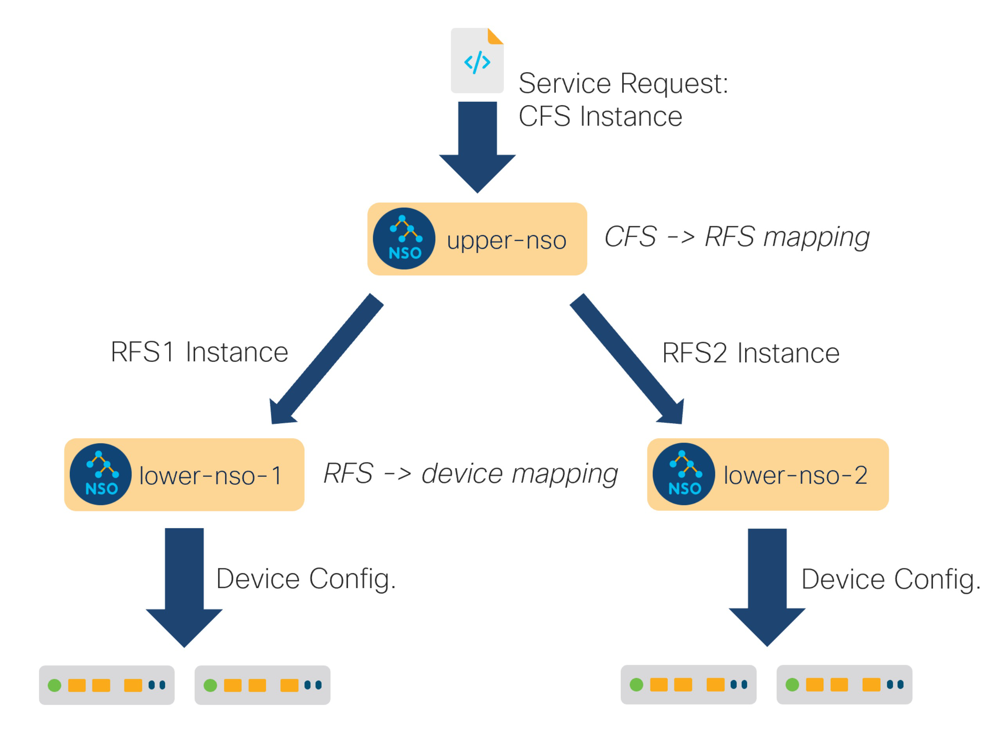

# Layered Service Architecture

Layered Service Architecture (LSA) is a design approach for massively large and scalable NSO applications. Large service providers and enterprises can use it to manage services for millions of users, ranging over several hundred thousand managed devices. Such scale requires special consideration since a single NSO instance no longer suffices and LSA helps you address this challenge.

## Going Big <a href="#d5e35" id="d5e35"></a>

At some point, scaling up hits the law of diminishing returns. Effectively, adding more resources to the NSO server becomes prohibitively expensive. To further increase the throughput of the whole system, you can share the load across multiple instances, in a scale-out fashion.

You achieve this by splitting a service into a main, upper-layer part, and one or more lower-layer parts. The upper part controls and dispatches work to the lower parts. This is the same approach as using a customer-facing service (CFS) and a resource-facing service (RFS). However, here the CFS code (the upper-layer part) runs in a different NSO node than the RFS code (the lower-layer parts). What is more, the lower-layer parts can be spread across multiple NSO nodes.

Each RFS node is responsible for its own set of managed devices, mounted under its `/devices` tree, and the upper-layer, CFS node only concerns itself with the RFS nodes. So, the CFS node only mounts the RFS nodes under its `/devices` tree, not managed devices directly. The main advantage of this architecture is that you can add many device RFS nodes that collectively manage a huge number of actual devices—much more than a single node could.

<figure><figcaption><p>Layered CFS/RFS architecture</p></figcaption></figure>

## Is LSA for Me?

While it is tempting to design the system in the most scalable way from the start, it comes with a cost. Compared to a single, non-LSA setup, the automation system now becomes distributed across multiple nodes, with all the complexity that entails. For example, in a non-distributed system, the communication between different parts has mostly negligible latency and hardly ever fails. That is certainly not true anymore for distributed systems as we know them today, including LSA.

More practically, taking a service in NSO and deploying a single instance on an LSA system is likely to take longer and have a higher chance of failure compared to a non-LSA system, because additional network communication is involved.

Moreover, multiple NSO nodes present a higher operational complexity and administrative burden. There is no longer a “single pane of glass” view of all the individual devices. That's why you must weigh the benefits of the LSA approach against the scale at which you operate. When LSA starts making sense will depend on the type of devices you manage, the services you have, the geographical distribution of resources, and so on.

A distributed system can push the overall throughput way beyond what a single instance can do. But you will achieve a much better outcome by first focusing on eliminating the bottlenecks in the provisioning code, as discussed in [Scaling and Performance Optimization](../../development/advanced-development/scaling-and-performance-optimization.md). Only when that proves insufficient, consider deploying LSA.

LSA also addresses the memory limitations of NSO when device configurations become very large (individually or all together). If the NSO server is memory-constrained and more memory cannot be added, the LSA approach can be a solution.

Another challenge that LSA may help you overcome is scaling organizationally. When many teams share the same NSO instance, it can get hard to separate the different concerns and responsibilities. Teams may also have different cadences or preferences for upgrades, resulting in friction. With LSA, it becomes possible to create a clearer separation. The CFS node and the RFS nodes can have different release cycles (as long as the YANG upgrade rules are followed) and each can be upgraded independently. If a bug is found or a feature is missing in the RFS nodes, it can be fixed without affecting the CFS node, and vice versa.

To summarize, the major advantage of this architecture is scalability. The solution scales horizontally, both at the upper and the lower layer, thus catering for truly massive deployments, but at the expense of the increased complexity.

## Layered Service Design <a href="#d5e58" id="d5e58"></a>

To take advantage of the scalability potential of LSA, your services must be designed in a layered fashion. Once the automation logic in NSO reaches a certain level of complexity, a stacked service design tends to emerge naturally. Often, you can extend it to LSA with relatively little change. The same is true for brand-new, green field designs.

In other situations, you might need to invest some additional effort to split and orchestrate the work across multiple groups of devices. Examples are existing monolithic services or stacked service designs that require all RFSs to access all devices.

### New, Greenfield Design <a href="#d5e62" id="d5e62"></a>

If you are designing the service from scratch, you have the most freedom in choosing the partitioning of logic between CFS and RFS. The CFS must contain the YANG definition for the service and its configurable options that are available to the customer, perhaps through an order capture system north of the NSO. On the other hand, the RFS YANG models are internal to the service, that is, they are not used directly by the customer. So, you are free to design them in a way that makes the provisioning code as simple as possible.

As an example, you might have a VLAN provisioning service where the CFS lets users select if the hosts on the VLAN can access the internet. Then you can divide provisioning into, let's say, an RFS service that configures the VLAN and the appropriate IP subnet across the data center switches, and another RFS service that configures the firewall to allow the traffic from the subnet to reach the internet. This design clearly separates the provisioned devices into two groups: firewalls and data center switches. Each group can be managed by a separate lower-layer NSO.

### Existing Monolithic Application with Stacked Services <a href="#d5e66" id="d5e66"></a>

Similar to a brand new design, an existing monolithic application that uses stacked services has already laid the groundwork for LSA-compatible design because of the existing division into two layers (upper and lower).

A possible complication, in this case, is when each existing RFS touches all of the affected devices, and that makes it hard to partition devices across multiple lower-layer NSO nodes. For example, if one RFS manages the VLAN interface (the VLAN ID and layer 2 settings) and another RFS manages the IP configuration for this interface, that configuration very likely happens on the same devices. The solution in this situation could be to partition RFS services based on the data center that they operate in, such as one lower-layer NSO node for one data center, another lower-layer NSO for another data center, and so on. If that is not possible, an alternative is to redesign each RFS and split their responsibilities differently.

#### Existing Monolithic Application <a href="#d5e70" id="d5e70"></a>

The most complex, yet common case is when a single node NSO installation grows over time and you are faced with performance problems due to the new size. To leverage the LSA functionality, you must first split the service into upper- and lower-layer parts, which require a certain amount of effort. That is why the decision to use LSA should always be accompanied by a thorough analysis to determine what makes the system too slow. Sometimes, it is a result of a bad "must" expression in the service YANG code or similar. Fixing that is much easier than re-architecting the application.

### Orchestrating the Work <a href="#d5e73" id="d5e73"></a>

Regardless of whether you start with a green field design or extend an existing application, you must tackle the problem of dispatching the RFS instantiation to the correct lower-layer NSO node.

Imagine a VPN application that uses a managed device on each site to securely connect to the private network. In a service provider network, this is usually done by the CPE. When a customer orders connectivity to an additional site (another leg of the VPN), the service needs to configure the site-local device (the CPE). As there will be potentially many such devices, each will be managed by one of the RFS nodes. However, the VPN service is managed centrally, through the CFS, which must:

* Figure out which RFS node is responsible for the device for the new site (CPE).
* Dispatch the RFS instantiation to that particular RFS node, making sure the device is properly configured.

NSO provides a mechanism to facilitate the second part, the actual dispatch, but the service logic must somehow select the correct RFS node. If the RFS nodes are geographically separated across different countries or different data centers, the CFS could simply infer or calculate the right RFS node based on service instance parameters, such as the physical location of the new site.

A more flexible alternative is to use dynamic mapping. It can be as simple as a list of 2-tuples that map a device name to an RFS node, stored in the CDB. The trade-off is that the list must be maintained. It is straightforward to automate the maintenance of the list though, for example through NETCONF notifications whenever `/devices/device` on the RFS nodes is manipulated or by explicitly asking the CFS node to query the RFS nodes for their list of devices.

Ultimately, the right approach to dispatch will depend on the complexity of your service and operational procedures.

### Provisioning of an LSA Service Request <a href="#d5e86" id="d5e86"></a>

Having designed a layered service with the CFS and RFS parts, the CFS must now communicate with the RFS that resides on a different node. You achieve that by adding the lower-layer (RFS) node as a managed device to the upper-layer (CFS) node. The CFS node must access the RFS data model on the lower-layer node, just like it accesses any other configuration on any managed device. But don't you need a NED to do this? Indeed, you do. That's why the RFS model needs to be specially compiled for the upper-layer node to use as part of NED and not a standalone service. A model compiled in this way is called a 'device compiled'.

Let's then see how the LSA setup affects the whole service provisioning process. Suppose a new request arrives at the CFS node, such as a new service instance being created through RESTCONF by a customer order portal. The CFS runs the service mapping logic as usual; however, instead of configuring the network devices directly, the CFS configures the appropriate RFS nodes with the generated RFS service instance data. This is the dispatch logic in action.

<figure><figcaption><p>LSA Request Flow</p></figcaption></figure>

As the configuration for the lower-layer nodes happens under the `/devices/device` tree, it is picked up and pushed to the relevant NSO instances by the NED. The NED sends the appropriate NETCONF edit-config RPCs, which trigger the RFS FASTMAP code at the RFS nodes. The RFS mapping logic constructs the necessary network configuration for each RFS instance and the RFS nodes update the actual network devices.

In case the commit queue feature is not being used, this entire sequence is serialized through the system as a whole. It means that if another northbound request arrives at the CFS node while the first request is being processed, the second request is synchronously queued at the CFS node, waiting for the currently running transaction to either succeed or fail.

If the code on the RFS nodes is reactive, it will likely return without much waiting, since the RFM applications are usually very fast during their first round of execution. But that will still have a lower performance than using the commit queue since the execution is serialized eventually when modifying devices. To maximize throughput, you also need to enable the commit queue functionality throughout the system.

### Implementation Considerations <a href="#d5e100" id="d5e100"></a>

The main benefit of LSA is that it scales horizontally at the RFS node layer. If one RFS node starts to become overloaded, it's easy to bring up an additional one, to share the load. Thus LSA caters to scalability at the level of the number of managed devices. However, each RFS node needs to host all the RFSs that touch the devices it manages under its `/devices/device` tree. There is still one, and only one, NSO node that directly manages a single device.

Dividing a provisioning application into upper and lower-layer services also increases the complexity of the application itself. For example, to follow the execution of a reactive or nano RFS, typically an additional NETCONF notification code must be written. The notifications have to be sent from the RFS nodes and received and processed by the CFS code. This way, if something goes wrong at the device layer, the information is relayed all the way to the top level of the system.

Furthermore, it is highly recommended that LSA applications enable the commit queue on all NSO nodes. If the commit queue is not enabled, the slowest device on the network will limit the overall throughput, significantly reducing the benefits of LSA.

Finally, if the two-layer approach proves to be insufficient due to requirements at the CFS node, you can extend it to three layers, with an additional layer of NSO nodes between the CFS and RFS layers.

## LSA Examples

### Greenfield LSA Application

This section describes a small LSA application, which exists as a running example in the `examples.ncs/getting-started/developing-with-ncs/22-layered-service-architecture` directory.

The application is a slight variation on the `examples.ncs/getting-started/developing-with-ncs/4-rfs-service` example where the YANG code has been split up into an upper-layer and a lower-layer implementation. The example topology (based on netsim for the managed devices, and NSO for the upper/lower layer NSO instances) looks like the following:

<figure><figcaption><p>Example LSA architecture</p></figcaption></figure>

The upper layer of the YANG service data for this example looks like the following:

```yang
module cfs-vlan {
  ...
  list cfs-vlan {
    key name;
    leaf name {
      type string;
    }

    uses ncs:service-data;
    ncs:servicepoint cfs-vlan;

    leaf a-router {
      type leafref {
        path "/dispatch-map/router";
      }
      mandatory true;
    }
    leaf z-router {
      type leafref {
        path "/dispatch-map/router";
      }
      mandatory true;
    }
    leaf iface {
      type string;
      mandatory true;
    }
    leaf unit {
      type int32;
      mandatory true;
    }
    leaf vid {
      type uint16;
      mandatory true;
    }
  }
}
```

Instantiating one CFS we have:

```cli
admin@upper-nso% show cfs-vlan
cfs-vlan v1 {
    a-router ex0;
    z-router ex5;
    iface    eth3;
    unit     3;
    vid      77;
}
```

The provisioning code for this CFS has to make a decision on where to instantiate what. In this example the "what" is trivial, it's the accompanying RFS, whereas the "where" is more involved. The two underlying RFS nodes, each manage 3 netsim routers, thus given the input, the CFS code must be able to determine which RFS node to choose. In this example, we have chosen to have an explicit map, thus on the `upper-nso` we also have:

```cli
admin@upper-nso% show dispatch-map
dispatch-map ex0 {
    rfs-node lower-nso-1;
}
dispatch-map ex1 {
    rfs-node lower-nso-1;
}
dispatch-map ex2 {
    rfs-node lower-nso-1;
}
dispatch-map ex3 {
    rfs-node lower-nso-2;
}
dispatch-map ex4 {
    rfs-node lower-nso-2;
}
dispatch-map ex5 {
    rfs-node lower-nso-2;
}
```

So, we have a template CFS code that does the dispatching to the right RFS node.

```xml
<config-template xmlns="http://tail-f.com/ns/config/1.0"
                 servicepoint="cfs-vlan">
  <devices xmlns="http://tail-f.com/ns/ncs">
    <!-- Do this for the two leafs a-router and z-router -->
    <?foreach {a-router|z-router}?>
    <device>
      <!--
      Pick up the name of the rfs-node from the dispatch-map
      and do not change the current context thus the string()
      -->
      <name>{string(deref(current())/../rfs-node)}</name>
      <config>
        <vlan xmlns="http://com/example/rfsvlan">
          <!-- We do not want to change the current context here either -->
          <name>{string(/name)}</name>
          <!-- current() is still a-router or z-router -->
          <router>{current()}</router>
          <iface>{/iface}</iface>
          <unit>{/unit}</unit>
          <vid>{/vid}</vid>
          <description>Interface owned by CFS: {/name}</description>
        </vlan>
      </config>
    </device>
    <?end?>
  </devices>
</config-template>
```

This technique for dispatching is simple and easy to understand. The dispatching might be more complex, it might even be determined at execution time dependent on CPU load. It might be (as in this example) inferred from input parameters or it might be computed.

The result of the template-based service is to instantiate the RFS, at the RFS nodes.

First, let's have a look at what happened in the upper-nso. Look at the modifications but ignore the fact that this is an LSA service:

```cli
admin@upper-nso% request cfs-vlan v1 get-modifications no-lsa
cli {
    local-node {
        data  devices {
                   device lower-nso-1 {
                       config {
              +            rfs-vlan:vlan v1 {
              +                router ex0;
              +                iface eth3;
              +                unit 3;
              +                vid 77;
              +                description "Interface owned by CFS: v1";
              +            }
                       }
                   }
                   device lower-nso-2 {
                       config {
              +            rfs-vlan:vlan v1 {
              +                router ex5;
              +                iface eth3;
              +                unit 3;
              +                vid 77;
              +                description "Interface owned by CFS: v1";
              +            }
                       }
                   }
               }
    }
}
```

Just the dispatched data is shown. As `ex0` and `ex5` reside on different nodes, the service instance data has to be sent to both `lower-nso-1` and `lower-nso-2`.

Now let's see what happened in the `lower-nso`. Look at the modifications and take into account that these are LSA nodes (this is the default):

```cli
admin@upper-nso% request cfs-vlan v1 get-modifications
cli {
  local-node {
    .....
  }
  lsa-service {
    service-id /devices/device[name='lower-nso-1']/config/rfs-vlan:vlan[name='v1']
    data devices {
      device ex0 {
        config {
          r:sys {
            interfaces {
   +          interface eth3 {
   +            enabled;
   +            unit 3 {
   +              enabled;
   +              description "Interface owned by CFS: v1";
   +              vlan-id 77;
   +            }
   +          }
            }
          }
        }
      }
    }
  }
  lsa-service {
    service-id /devices/device[name='lower-nso-2']/config/rfs-vlan:vlan[name='v1']
    data devices {
      device ex5 {
        config {
          r:sys {
            interfaces {
   +          interface eth3 {
   +            enabled;
   +            unit 3 {
   +              enabled;
   +              description "Interface owned by CFS: v1";
   +              vlan-id 77;
   +            }
   +          }
            }
          }
        }
      }
    }
  }
```

Both the dispatched data and the modification of the remote service are shown. As `ex0` and `ex5` reside on different nodes, the service modifications of the service `rfs-vlan` on both `lower-nso-1` and `lower-nso-2` are shown.

The communication between the NSO nodes is of course NETCONF.

```cli
admin@upper-nso% set cfs-vlan v1 a-router ex0 z-router ex5 iface eth3 unit 3 vid 78
[ok][2016-10-20 16:52:45]

[edit]
admin@upper-nso% commit dry-run outformat native
native {
    device {
        name lower-nso-1
        data <rpc xmlns="urn:ietf:params:xml:ns:netconf:base:1.0"
                  message-id="1">
               <edit-config xmlns:nc="urn:ietf:params:xml:ns:netconf:base:1.0">
                 <target>
                   <running/>
                 </target>
                 <test-option>test-then-set</test-option>
                 <error-option>rollback-on-error</error-option>
                 <with-inactive xmlns="http://tail-f.com/ns/netconf/inactive/1.0"/>
                 <config>
                   <vlan xmlns="http://com/example/rfsvlan">
                     <name>v1</name>
                     <vid>78</vid>
                     <private>
                       <re-deploy-counter>-1</re-deploy-counter>
                     </private>
                   </vlan>
                 </config>
               </edit-config>
             </rpc>
    }
               ...........
               ....
```

The YANG model at the lower layer, also known as the RFS layer, is similar to the CFS, but slightly different:

```yang
module rfs-vlan {

  ...

  list vlan {
    key name;
    leaf name {
      tailf:cli-allow-range;
      type string;
    }

    uses ncs:service-data;
    ncs:servicepoint "rfs-vlan";

    leaf router {
      type string;
    }
    leaf iface {
      type string;
      mandatory true;
    }
    leaf unit {
      type int32;
      mandatory true;
    }
    leaf vid {
      type uint16;
      mandatory true;
    }
    leaf description {
      type string;
      mandatory true;
    }
  }
}
```

The task for the RFS provisioning code here is to actually provision the designated router. If we log into one of the lower layer NSO nodes, we can check the following.

```
admin@lower-nso-1> show configuration vlan
vlan v1 {
    router      ex0;
    iface       eth3;
    unit        3;
    vid         77;
    description "Interface owned by CFS: v1";
}
[ok][2016-10-20 17:01:08]
admin@lower-nso-1> request vlan v1 get-modifications
cli {
  local-node {
    data  devices {
             device ex0 {
               config {
                 r:sys {
                   interfaces {
    +                interface eth3 {
    +                  enabled;
    +                  unit 3 {
    +                    enabled;
    +                    description "Interface owned by CFS: v1";
    +                    vlan-id 77;
    +                  }
    +                }
                   }
                 }
               }
             }
    }
  }
}
```

To conclude this section, the final remark here is that to design a good LSA application, the trick is to identify a good layering for the service data models. The upper layer, the CFS layer is what is exposed northbound, and thus requires a model that is as forward-looking as possible since that model is what a system north of NSO integrates to, whereas the lower layer models, the RFS models can be viewed as "internal system models" and they can be more easily changed.

### Greenfield LSA Application Designed for Easy Scaling <a href="#d5e148" id="d5e148"></a>

In this section, we'll describe a lightly modified version of the example in the previous section. The application we describe here exists as a running example under: `examples.ncs/getting-started/developing-with-ncs/24-layered-service-architecture-scaling`

Sometimes it is desirable to be able to easily move devices from one lower LSA node to another. This makes it possible to easily expand or shrink the number of lower LSA nodes. Additionally, it is sometimes desirable to avoid HA pairs for replication but instead use a common store for all lower LSA devices, such as a distributed database, or a common file system.

The above is possible provided that the LSA application is structured in certain ways.

* The lower LSA nodes only expose services that manipulate the configuration of a single device. We call these devices RFSs, or dRFS for short.
*   All services are located in a way that makes it easy to extract them, for example in /drfs:dRFS/device

    ```yang
    container dRFS {
      list device {
        key name;
        leaf name {
          type string;
        }
      }
    }
    ```
* No RFS takes place on the lower LSA nodes. This avoids the complication with locking and distributed event handling.
* The LSA nodes need to be set up with the proper NEDs and with auth groups such that a device can be moved without having to install new NEDs or update auth groups.

Provided that the above requirements are met, it is possible to move a device from one lower LSA node by extracting the configuration from the source node and installing it on the target node. This, of course, requires that the source node is still alive, which is normally the case when HA-pairs are used.

An alternative to using HA-pairs for the lower LSA nodes is to extract the device configuration after each modification to the device and store it in some central storage. This would not be recommended when high throughput is required but may make sense in certain cases.

In the example application, there are two packages on the lower LSA nodes that provide this functionality. The package `inventory-updater` installs a database subscriber that is invoked every time any device configuration is modified, both in the preparation phase and in the commit phase of any such transaction. It extracts the device and dRFS configuration, including service metadata, during the preparation phase. If the transaction proceeds to a full commit, the package is again invoked and the extracted configuration is stored in a file in the directory `db_store`.

The other package is called `device-actions`. It provides three actions: `extract-device`, `install-device`, and `delete-device`. They are intended to be used by the upper LSA node when moving a device either from a lower LSA node or from `db_store`.

In the upper LSA node, there is one package for coordinating the movement, called `move-device`. It provides an action for moving a device from one lower LSA node to another. For example when invoked to move device `ex0` from `lower-1` to `lower-2` using the action

```cli
request move-device move src-nso lower-1 dest-nso lower-2 device-name ex0
```

it goes through the following steps:

* A partial lock is acquired on the upper-nso for the path `/devices/device[name=lower-1]/config/dRFS/device[name=ex0]` to avoid any changes to the device while the device is in the process of being moved.
*   The device and dRFS configuration are extracted in one of two ways:

    *   Read the configuration from `lower-1` using the action

        ```cli
        request device-action extract-device name ex0
        ```
    * Read the configuration from some central store, in our case the file system in the directory. `db_store`.

    The configuration will look something like this

    ```
    devices {
        device ex0 {
            address   127.0.0.1;
            port      12022;
            ssh {
            ...
               /* Refcount: 1 */
                /* Backpointer: [ /drfs:dRFS/drfs:device[drfs:name='ex0']/rfs-vlan:vlan[rfs-vlan:name='v1'] ] */
                interface eth3 {
                ...
                }
            ...
        }
    }
    dRFS {
        device ex0 {
            vlan v1 {
                private {
                ...
                }
            }
        }
    }
    ```
*   Install the configuration on the `lower-2` node. This can be done by running the action:

    ```cli
    request device-action install-device name ex0 config <cfg>
    ```

    This will load the configuration and commit using the flags `no-deploy` and `no-networking`.
*   Delete the device from `lower-1` by running the action

    ```cli
    request device-action delete-device name ex0
    ```
*   Update mapping table

    ```
    dispatch-map ex0 {
        rfs-node lower-nso-2;
    }
    ```
* Release the partial lock for `/devices/device[name=lower-1]/config/dRFS/device[name=ex0]`.
* Re-deploy all services that have touched the device. The services all have backpointers from `/devices/device{lower-1}/config/dRFS/device{ex0}`. They are `re-deployed` using the flags `no-lsa` and `no-networking`.
* Finally, the action runs `compare-config` on `lower-1` and `lower-2`.

With this infrastructure in place, it is fairly straightforward to implement actions for re-balancing devices among lower LSA nodes, as well as evacuating all devices from a given lower LSA node. The example contains implementations of those actions as well.

### Rearchitecting an Existing VPN Application for LSA <a href="#d5e230" id="d5e230"></a>

If we do not have the luxury of designing our NSO service application from scratch, but rather are faced with extending/changing an existing, already deployed application into the LSA architecture we can use the techniques described in this section.

Usually, the reasons for rearchitecting an existing application are performance-related.

In the NSO example collection, one of the most popular real examples is the `examples.ncs/service-provider/mpls-vpn` code. That example contains an almost "real" VPN provisioning example whereby VPNS are provisioned in a network of CPEs, PEs, and P routers according to this picture:

<figure><figcaption><p>VPN network</p></figcaption></figure>

The service model in this example roughly looks like this:

```yang
   list l3vpn {
      description "Layer3 VPN";

      key name;
      leaf name {
        type string;
      }

      leaf route-distinguisher {
        description "Route distinguisher/target identifier unique for the VPN";
        mandatory true;
        type uint32;
      }

      list endpoint {
        key "id";
        leaf id {
          type string;
        }
        leaf ce-device {
          mandatory true;
          type leafref {
            path "/ncs:devices/ncs:device/ncs:name";
          }
        }

        leaf ce-interface {
          mandatory true;
          type string;
        }

        ....

        leaf as-number {
          tailf:info "CE Router as-number";
          type uint32;
        }
      }
      container qos {
        leaf qos-policy {
           ......
```

There are several interesting observations on this model code related to the Layered Service Architecture.

* Each instantiated service has a list of endpoints and CPE routers. These are modeled as a leafref into the /devices tree. This has to be changed if we wish to change this application into an LSA application since the /devices tree at the upper layer doesn't contain the actual managed routers. Instead, the /devices tree contains the lower layer RFS nodes.
*   There is no connectivity/topology information in the service model. Instead, the `mpls-vpn` example has topology information on the side, and that data is used by the provisioning code. That topology information for example contains data on which CE routers are directly connected to which PE router.

    Remember from the previous section, that one of the additional complications of an LSA application is the dispatching part. The dispatching problem fits well into the pattern where we have topology information stored on the side and let the provisioning FASTMAP code use that data to guide the provisioning. One straightforward way would be to augment the topology information with additional data, indicating which RFS node is used to manage a specific managed device.

By far the easiest way to change an existing monolithic NSO application into the LSA architecture is to keep the service model at the upper layer and lower layer almost identical, only changing things like leafrefs directly into the /devices tree which obviously breaks.

In this example, the topology information is stored in a separate container `share-data` and propagated to the LSA nodes by means of service code.

The example, `examples.ncs/service-provider/mpls-vpn-layered-service-architecture` does exactly this, the upper layer data model in `upper-nso/packages/l3vpn/src/yang/l3vpn.yang` now looks as:

```yang
   list l3vpn {
      description "Layer3 VPN";

      key name;
      leaf name {
        type string;
      }

      leaf route-distinguisher {
        description "Route distinguisher/target identifier unique for the VPN";
        mandatory true;
        type uint32;
      }

      list endpoint {
        key "id";
        leaf id {
          type string;
        }
        leaf ce-device {
          mandatory true;
          type string;
        }
        .......
```

The `ce-device` leaf is now just a regular string, not a leafref.

So, instead of an NSO topology that looks like:

<figure><figcaption><p>NSO topology</p></figcaption></figure>

\
We want an NSO architecture that looks like this:

<figure><figcaption><p>NSO LSA topology</p></figcaption></figure>

The task for the upper layer FastMap code is then to instantiate a copy of itself on the right lower layer NSO nodes. The upper layer FastMap code must:

* Determine which routers, (CE, PE, or P) will be touched by its execution.
* Look in its dispatch table, which lower-layer NSO nodes are used to host these routers.
*   Instantiate a copy of itself on those lower layer NSO nodes. One extremely efficient way to do that is to use the `Maapi.copy_tree()` method. The code in the example contains code that looks like this:

    ```java
            public Properties create(
                ....
                NavuContainer lowerLayerNSO = ....

                Maapi maapi = service.context().getMaapi();
                int tHandle = service.context().getMaapiHandle();
                NavuNode dstVpn = lowerLayerNSO.container("config").
                        container("l3vpn", "vpn").
                        list("l3vpn").
                        sharedCreate(serviceName);
                ConfPath dst = dstVpn.getConfPath();
                ConfPath src = service.getConfPath();

                maapi.copy_tree(tHandle, true, src, dst);
    ```

Finally, we must make a minor modification to the lower layer (RFS) provisioning code too. Originally, the FastMap code wrote all config for all routers participating in the VPN, now with the LSA partitioning, each lower layer NSO node is only responsible for the portion of the VPN that involves devices that reside in its /devices tree, thus the provisioning code must be changed to ignore devices that do not reside in the /devices tree.

### Rearchitecting Details <a href="#d5e283" id="d5e283"></a>

In addition to conceptual changes of splitting into upper- and lower-layer parts, migrating an existing monolithic application to LSA may also impact the models used. In the new design, the upper-layer node contains the (more or less original) CFS model as well as the device-compiled RFS model, which it requires for communication with the RFS nodes. In a typical scenario, these are two separate models. So, for example, they must each use a unique namespace.

To illustrate the different YANG files and namespaces used, the following text describes the process of splitting up an example monolithic service. Let's assume that the original service resides in a file, `myserv.yang`, and looks like the following:

```yang
module myserv {

  namespace "http://example.com/myserv";
  prefix ms;

  .....

  list srv {
    key name;
    leaf name {
      type string;
    }

    uses ncs:service-data;
    ncs:servicepoint vlanspnt;

    leaf router {
       type leafref {
         path "/ncs:devices/ncs:device/ncs:name";
    .....
    }
}
```

In an LSA setting, we want to keep this module as close to the original as possible. We clearly want to keep the namespace, the prefix, and the structure of the YANG identical to the original. This is to not disturb any provisioning systems north of the original NSO. Thus with only minor modifications, we want to run this module at the CFS node, but with non-applicable leafrefs removed, thus at the CFS node we would get:

```yang
module myserv {

  namespace "http://example.com/myserv";
  prefix ms;

  .....

  list srv {
    key name;
    leaf name {
      type string;
    }

    uses ncs:service-data;
    ncs:servicepoint vlanspnt;

    leaf router {
       type string;
    .....
    }
}
```

Now, we want to run almost the same YANG module at the RFS node, however, the namespace must be changed. For the sake of the CFS node, we're going to NED compile the RFS and NSO doesn't like the same namespace to occur twice, thus for the RFS node, we would get a YANG module `myserv-rfs.yang` that looks like the following:

```yang
module myserv-rfs {

  namespace "http://example.com/myserv-rfs";
  prefix ms-rfs;

  .....

  list srv {
    key name;
    leaf name {
      type string;
    }

    uses ncs:service-data;
    ncs:servicepoint vlanspnt;

    leaf router {
       type leafref {
         path "/ncs:devices/ncs:device/ncs:name";
    .....
    }
}
```

This file can, and should, keep the leafref as is.

The final and last file we get is the compiled NED, which should be loaded in the CFS node. The NED is directly compiled from the RFS model, as an LSA NED.

```bash
$ ncs-make-package --lsa-netconf-ned /path/to-rfs-yang  myserv-rfs-ned
```

Thus, we end up with three distinct packages from the original one:

1. The original, slated for the CFS node, with leafrefs removed.
2. The modified original, slated for the RFS node, with the namespace and the prefix changed.
3. The NED, compiled from the RFS node code, slated for the CFS node.

## Deploying LSA

The purpose of the upper CFS node is to manage all CFS services and to push the resulting service mappings to the RFS services. The lower RFS nodes are configured as devices in the device tree of the upper CFS node and the RFS services are created under the `/devices/device/config` accordingly. This is almost identical to the relation between a normal NSO node and the normal devices. However, there are differences when it comes to commit parameters and the commit queue, as well as some other LSA-specific features.

Such a design allows you to decide whether you will run the same version of NSO on all nodes or not. Since some differences arise between the two options, this document distinguishes a _single-version_ deployment from a multi-version one.

Deployment of an LSA cluster where all the nodes have the same major version of NSO running is called a single version deployment. If the versions are different, then it is a multi-version deployment, since the packages on the CFS node must be managed differently.

The choice between the two deployment options depends on your functional needs. The single version is easier to maintain and is a good starting point but is less flexible. While it is possible to migrate from one to the other, the migration from a single version to a multi-version is typically easier than the other way around. Still, every migration requires some effort, so it is best to pick one approach and stick to it.

You can find working examples of both deployment types in the `examples.ncs/getting-started/developing-with-ncs/22-lsa-single-version-deployment` and `examples.ncs/getting-started/developing-with-ncs/28-lsa-multi-version-deployment` folders, respectively.

### RFS Nodes Setup <a href="#d5e320" id="d5e320"></a>

The type of deployment does not affect the RFS nodes. In general, the RFS nodes act very much like ordinary standalone NSO instances but only support the RFS services.

Configure and set up the lower RFS nodes as you would a standalone node, by making sure the necessary NED and RFS packages are loaded and the managed network devices added. This requires you to have already decided on the distribution of devices to lower RFS nodes. The RFS packages are ordinary service packages.

The only LSA-specific requirement is that these nodes enable NETCONF communication northbound, as this is how the upper CFS node will interact with them. To enable NETCONF northbound, ensure that a configuration similar to the following is present in the `ncs.conf` of every RFS node:

```xml
  <netconf-north-bound>
    <enabled>true</enabled>
    <transport>
      <ssh>
        <enabled>true</enabled>
        <ip>0.0.0.0</ip>
        <port>2022</port>
      </ssh>
    </transport>
  </netconf-north-bound>
```

One thing to note is that you do not need to explicitly enable the commit queue on the RFS nodes, even if you intend to use LSA with the commit queue feature. The upper CFS node is aware of the LSA setup and will propagate the relevant commit flags to the lower RFS nodes automatically.

If you wish to enable the commit queue by default, that is, even for transactions originating on the RFS node (non-LSA), you are strongly encouraged to enable it globally, through the `/devices/global-settings/commit-queue/enabled-by-default` setting on all the RFS nodes and, importantly, the upper CFS node too. Otherwise, you may end up in a situation where only a part of the transaction runs through the commit queue. In that case, the `rollback-on-error` commit queue error option will not work correctly, as it can't roll back the full original transaction but just the part that went through the commit queue. This can result in an inconsistent network state.

### CFS Node Setup <a href="#d5e332" id="d5e332"></a>

Regardless of single or multi-version deployment, the upper CFS node has the lower RFS nodes configured as devices under the `/devices/device` tree. The CFS node communicates with these devices through NETCONF and must have the correct `ned-id` configured for each lower RFS node. The `ned-id` is set under `/devices/device/device-type/netconf/ned-id`, as for any NETCONF device.

The part that is specific to LSA is the actual `ned-id` used. This has to be `ned:lsa-netconf` or a `ned-id` derived from it. What is more, the `ned-id` depends on the deployment type. For a single-version deployment, you can use the `lsa-netconf` value directly. This `ned-id` is built-in (defined in `tailf-ncs-ned.yang`) and available in NSO without any additional packages.

So the configuration for the RFS device in the CFS node would look similar to:

```cli
admin@upper-nso% show devices device | display-level 4
device lower-nso-1 {
    lsa-remote-node lower-nso-1;
    authgroup       default;
    device-type {
        netconf {
            ned-id lsa-netconf;
        }
    }
    state {
        admin-state unlocked;
    }
}
```

Notice the use of the `lsa-remote-node` instead of the `address` (and `port`) as is usually done. This setting identifies the device as a lower-layer LSA node and instructs NSO to use connection information provided under `cluster` configuration.

The value of `lsa-remote-node` references a `cluster remote-node`, such as the following:

```cli
admin@upper-nso% show cluster remote-node
remote-node lower-nso-1 {
    address   127.0.2.1;
    authgroup default;
}
```

In addition to `devices device`, the `authgroup` value is again required here and refers to `cluster authgroup`, not the device one. Both authgroups must be configured correctly for LSA to function.

Having added device and cluster configuration for all RFS nodes, you should update the SSH host keys for both, the `/devices/device` and `/cluster/remote-node` paths. For example:

```cli
admin@upper-nso% request devices device lower-nso-* ssh fetch-host-keys
admin@upper-nso% request cluster remote-node lower-nso-* ssh fetch-host-keys
```

Moreover, the RFS NSO nodes have an extra configuration that may not be visible to the CFS node, resulting in out-of-sync behavior. You are strongly encouraged to set the `out-of-sync-commit-behaviour` value to `accept`, with a command such as:

```cli
admin@upper-nso% set devices device lower-nso-* out-of-sync-commit-behaviour accept
```

At the same time you should also enable the `/cluster/device-notifications`, which will allow the CFS node to receive the forwarded device notifications from the RFS nodes, and `/cluster/commit-queue`, to enable the commit queue support for LSA. Without the latter, you will not be able to use the `commit commit-queue async` command, for example.

If you wish to enable the commit queue by default, you should do so by setting the `/devices/global-settings/commit-queue/enabled-by-default` on the CFS node. Do not use per device or per device group configuration, for the same reason you should avoid it on the RFS nodes.

#### Multi-Version Deployment <a href="#ncs_lsa.lsa_setup.multi_version" id="ncs_lsa.lsa_setup.multi_version"></a>

If you plan a single-version deployment, the preceding steps are sufficient. For a multi-version deployment, on the other hand, there are two additional tasks to perform.

First, you will need to install the correct Cisco-NSO LSA NED package (or packages if you need to support more versions). Each NSO release includes these packages that are specifically tailored for LSA. They are used by the upper CFS node if the lower RFS nodes are running a different version than the CFS node itself. The packages are named `cisco-nso-nc-X.Y` where X.Y are the two most significant numbers of the NSO release (the major version) that the package supports. So, if your RFS nodes are running NSO 5.7.2, for example, you should use `cisco-nso-nc-5.7`.

These packages are found in the `$NCS_DIR/packages/lsa` directory. Each package contains the complete model of the `ncs` namespace for the corresponding NSO version, compiled as an LSA NED. Please always use the `cisco-nso` package included with the NSO version of the upper CFS node and not some older variant (such as the one from the lower RFS node) as it may not work correctly.

Second, installing the cisco-nso LSA NED package will make the corresponding `ned-id` available, such as `cisco-nso-nc-5.7` (`ned-id` matches the package name). Use this `ned-id` for the RFS nodes instead of `lsa-netconf`. For example:

```cli
admin@upper-nso% show devices device | display-level 4
device lower-nso-1 {
    lsa-remote-node lower-nso-1;
    authgroup       default;
    device-type {
        netconf {
            ned-id cisco-nso-nc-5.7;
        }
    }
    state {
        admin-state unlocked;
    }
}
```

This configuration allows the CFS node to communicate with a different NSO version but there are still some limitations. The upper CFS node must have the same or newer version than the managed RFS nodes. For all the currently supported versions of the lower node, the packages can be found in the `$NCS_DIR/packages/lsa` directory, but you may also be able to build an older one yourself.

In case you already have a single-version deployment using the `lsa-netconf` `ned-id'`s, you can use the NED migrate procedure to switch to the new `ned-id` and multi-version deployment.

### Device Compiled RFS Services <a href="#d5e392" id="d5e392"></a>

Besides adding managed lower-layer nodes, the upper-layer node also requires packages for the services. Obviously, you must add the CFS package, which is an ordinary service package, to the CFS node. But you must also provide the device compiled RFS YANG models to allow provisioning of RFSs on the remote RFS nodes.

The process resembles the way you create and compile device YANG models in normal NED packages. The `ncs-make-package` tool provides the `--lsa-netconf-ned` option, where you specify the location of the RFS YANG model and the tool creates a NED package for you. This is a new package that is separate from the RFS package used in the RFS nodes, so you might want to name it differently to avoid confusion. The following text uses the `-ned` suffix.

Usually, you would also provide the `--no-netsim`, `--no-java`, and `--no-python` switches to the invocation, as the package is used with the NETCONF protocol and doesn't need any additional code. The `--no-netsim` option is required because netsim is not supported for these types of packages. For example:

```bash
ncs-make-package --no-netsim --no-java --no-python    \
    --lsa-netconf-ned ./path/to/rfs/src/yang          \
    myrfs-service-ned
```

In this case, there is no explicit `--lsa-lower-nso` option specified and `ncs-make-package` will by default be set up to compile the package for the single version deployment, tied to the `lsa-netconf` `ned-id`. That means the models in the NED can be used with devices that have a `lsa-netconf` `ned-id` configured.

To compile it for the multi-version deployment, which uses a different `ned-id`, you must select the target NSO version with the `--lsa-lower-nso cisco-nso-nc-X.Y` option, for example:

```bash
ncs-make-package --no-netsim --no-java --no-python    \
    --lsa-netconf-ned ./path/to/rfs/src/yang          \
    --lsa-lower-nso cisco-nso-nc-5.7
    myrfs-service-ned
```

Depending on the RFS model, the package may fail to compile, even though the model compiles fine as a service. A typical error would indicate some node from a module, such as `tailf-ncs`, is not found. The reason is that the original RFS service YANG model has dependencies on other YANG models that are not included in the compilation process.

One solution to this problem is to remove the dependencies in the YANG model before compilation. Normally this can be solved by changing the datatype in the NED compiled copy of the YANG model, for example from `leafref` or `instance-identifier` to string. This is only needed for the NED compiled copy, the lower RFS node YANG model can remain the same. There will then be an implicit conversion between types, at runtime, in the communication between the upper CFS node and the lower RFS node.

An alternate solution, if you are doing a single version deployment and there are dependencies on the `tailf-ncs` namespace, is to switch to a multi-version deployment because the `cisco-nso` package includes this namespace (device compiled). Here, the NSO versions match but you are still using the `cisco-nso-nc-X.Y` `ned-id` and have to follow the instructions for the multi-version deployment.

Once you have both, the CFS and device-compiled RFS service packages are ready; add them to the CFS node, then invoke a `sync-from` action to complete the setup process.

### Example Walkthrough <a href="#d5e425" id="d5e425"></a>

You can see all the required setup steps for a single version deployment performed in the example `examples.ncs/getting-started/developing-with-ncs/22-lsa-single-version-deployment` and the `examples.ncs/getting-started/developing-with-ncs/28-lsa-multi-version-deployment` has the steps for the multi-version one. The two are quite similar but the multi-version deployment has additional steps, so it is the one described here.

First, build the example for manual setup.

```bash
$ make clean manual
$ make start-manual
$ make cli-upper-nso
```

Then configure the nodes in the cluster. This is needed so that the upper CFS node can receive notifications from the lower RFS node and prepare the upper CFS node to be used with the commit queue.

```cli
> configure

% set cluster device-notifications enabled
% set cluster remote-node lower-nso-1 authgroup default username admin
% set cluster remote-node lower-nso-1 address 127.0.0.1 port 2023
% set cluster remote-node lower-nso-2 authgroup default username admin
% set cluster remote-node lower-nso-2 address 127.0.0.1 port 2024
% set cluster commit-queue enabled
% commit
% request cluster remote-node lower-nso-* ssh fetch-host-keys
```

To be able to handle the lower NSO node as an LSA node, the correct version of the `cisco-nso-nc` package needs to be installed. In this example, 5.4 is used.

Create a link to the `cisco-nso` package in the packages directory of the upper CFS node:

```bash
$ ln -sf ${NCS_DIR}/packages/lsa/cisco-nso-nc-5.4 upper-nso/packages
```

Reload the packages:

```cli
% exit
> request packages reload

e>>> System upgrade is starting.
>>> Sessions in configure mode must exit to operational mode.
>>> No configuration changes can be performed until upgrade has completed.
>>> System upgrade has completed successfully.
reload-result {
    package cisco-nso-nc-5.4
    result true
}
```

Now when the `cisco-nso-nc` package is in place, configure the two lower NSO nodes and `sync-from` them:

```cli
> configure
Entering configuration mode private

% set devices device lower-nso-1 device-type netconf ned-id cisco-nso-nc-5.4
% set devices device lower-nso-1 authgroup default
% set devices device lower-nso-1 lsa-remote-node lower-nso-1
% set devices device lower-nso-1 state admin-state unlocked
% set devices device lower-nso-2 device-type netconf ned-id cisco-nso-nc-5.4
% set devices device lower-nso-2 authgroup default
% set devices device lower-nso-2 lsa-remote-node lower-nso-2
% set devices device lower-nso-2 state admin-state unlocked

% commit
Commit complete.

% request devices fetch-ssh-host-keys
fetch-result {
    device lower-nso-1
    result updated
    fingerprint {
        algorithm ssh-ed25519
        value 4a:c6:5d:91:6d:4a:69:7a:4e:0d:dc:4e:51:51:ee:e2
    }
}
fetch-result {
    device lower-nso-2
    result updated
    fingerprint {
        algorithm ssh-ed25519
        value 4a:c6:5d:91:6d:4a:69:7a:4e:0d:dc:4e:51:51:ee:e2
    }
}

% request devices sync-from
sync-result {
    device lower-nso-1
    result true
}
sync-result {
    device lower-nso-2
    result true
}
```

Now, for example, the configured devices of the lower nodes can be viewed:

```cli
% show devices device config devices device | display xpath | display-level 5

/devices/device[name='lower-nso-1']/config/ncs:devices/device[name='ex0']
/devices/device[name='lower-nso-1']/config/ncs:devices/device[name='ex1']
/devices/device[name='lower-nso-1']/config/ncs:devices/device[name='ex2']
/devices/device[name='lower-nso-2']/config/ncs:devices/device[name='ex3']
/devices/device[name='lower-nso-2']/config/ncs:devices/device[name='ex4']
/devices/device[name='lower-nso-2']/config/ncs:devices/device[name='ex5']
```

Or, alarms inspected:

```cli
% run show devices device lower-nso-1 live-status alarms summary

live-status alarms summary indeterminates 0
live-status alarms summary criticals 0
live-status alarms summary majors 0
live-status alarms summary minors 0
live-status alarms summary warnings 0
```

Now, create a netconf package on the upper CFS node which can be used towards the `rfs-vlan` service on the lower RFS node, in the shell terminal window, do the following:

```bash
$ ncs-make-package --no-netsim --no-java --no-python                \
    --lsa-netconf-ned package-store/rfs-vlan/src/yang               \
    --lsa-lower-nso cisco-nso-nc-5.4                                \
    --package-version 5.4 --dest upper-nso/packages/rfs-vlan-nc-5.4 \
    --build rfs-vlan-nc-5.4
```

The created NED is an `lsa-netconf-ned` based on the YANG files of the `rfs-vlan` service:

```
--lsa-netconf-ned package-store/rfs-vlan/src/yang
```

The version of the NED reflects the version of the nso on the lower node:

```
--package-version 5.4
```

The package will be generated in the packages directory of the upper NSO CFS node:

```
--dest upper-nso/packages/rfs-vlan-nc-5.4
```

And, the name of the package will be:

```
rfs-vlan-nc-5.4
```

Install the `cfs-vlan` service on the upper CFS node. In the shell terminal window, do the following:

```bash
$ ln -sf ../../package-store/cfs-vlan     upper-nso/packages
```

Reload the packages once more to get the `cfs-vlan` package. In the CLI terminal window, do the following:

```cli
% exit

> request packages reload

>>> System upgrade is starting.
>>> Sessions in configure mode must exit to operational mode.
>>> No configuration changes can be performed until upgrade has completed.
>>> System upgrade has completed successfully.
reload-result {
    package cfs-vlan
    result true
}
reload-result {
    package cisco-nso-nc-5.4
    result true
}
reload-result {
    package rfs-vlan-nc-5.4
    result true
}

> configure
Entering configuration mode private
```

Now, when all packages are in place a `cfs-vlan` service can be configured. The `cfs-vlan` service will dispatch service data to the right lower RFS node depending on the device names used in the service.

In the CLI terminal window, verify the service:

```cli
% set cfs-vlan v1 a-router ex0 z-router ex5 iface eth3 unit 3 vid 77

% commit dry-run
.....
    local-node {
        data  devices {
                  device lower-nso-1 {
                      config {
                          services {
             +                vlan v1 {
             +                    router ex0;
             +                    iface eth3;
             +                    unit 3;
             +                    vid 77;
             +                    description "Interface owned by CFS: v1";
             +                }
                          }
                      }
                  }
                  device lower-nso-2 {
                      config {
                          services {
             +                vlan v1 {
             +                    router ex5;
             +                    iface eth3;
             +                    unit 3;
             +                    vid 77;
             +                    description "Interface owned by CFS: v1";
             +                }
                          }
                      }
                  }
              }
.....
```

As `ex0` resides on `lower-nso-1` that part of the configuration goes there and the `ex5` part goes to `lower-nso-2`.

### Migration and Upgrades <a href="#d5e478" id="d5e478"></a>

Since an LSA deployment consists of multiple NSO nodes (or HA pairs of nodes), each can be upgraded to a newer NSO version separately. While that offers a lot of flexibility, it also makes upgrades more complex in many cases. For example, performing a major version upgrade on the upper CFS node only will make the deployment Multi-Version even if it was Single-Version before the upgrade, requiring additional action on your part.

In general, staying with the Single-Version Deployment is the simplest option and does not require any further LSA-specific upgrade action (except perhaps recompiling the packages). However, the main downside is that, at least for a major upgrade, you must upgrade all the nodes at the same time (otherwise, you no longer have a Single-Version Deployment).

If that is not feasible, the solution is to run a Multi-Version Deployment. Along with all of the requirements, the section [Multi-Version Deployment](layered-service-architecture.md#ncs\_lsa.lsa\_setup.multi\_version) describes a major difference from the Single Version variant: the upper CFS node uses a version-specific `cisco-nso-nc-X.Y` NED ID to refer to lower RFS nodes. That means, if you switch to a Multi-Version Deployment, or perform a major upgrade of the lower-layer RFS node, the `ned-id` should change accordingly. However, do not change it directly but follow the correct NED upgrade procedure described in the section called [NED Migration](../management/ned-administration.md#sec.ned_migration). Briefly, the procedure consists of these steps:

1. Keep the currently configured ned-id for an RFS device and the corresponding packages. If upgrading the CFS node, you will need to recompile the packages for the new NSO version.
2. Compile and load the packages that are device-compiled with the new `ned-id`, alongside the old packages.
3. Use the **migrate** action on a device to switch over to the new `ned-id`.

The procedure requires you to have two versions of the device-compiled RFS service packages loaded in the upper CFS node when calling the `migrate` action: one version compiled by referencing the old (current) NED ID and the other one by referencing the new (target) NED ID.

To illustrate, suppose you currently have an upper-layer and a lower-layer node both running NSO 5.4. The nodes were set up as described in the Single Version Deployment option, with the upper CFS node using the `tailf-ncs-ned:lsa-netconf` NED ID for the lower-layer RFS node. The CFS node also uses the `rfs-vlan-ned` NED package for the `rfs-vlan` service.

Now you wish to upgrade the CFS node to NSO 5.7 but keep the RFS node on the existing version 5.4. Before upgrading the CFS node, you create a backup and recompile the `rfs-vlan-ned` package for NSO 5.7. Note that the package references the `lsa-netconf` `ned-id`, which is the `ned-id` configured for the RFS device in the CFS node's CDB. Then, you perform the CFS node upgrade as usual.

At this point the CFS node is running the new, 5.7 version and the RFS node is running 5.4. Since you now have a Multi Version Deployment, you should migrate to the correct `ned-id` as well. Therefore, you prepare the `rfs-vlan-nc-5.4` package, as described in the Multi-Version Deployment option, compile the package, and load it into the CFS node. Thanks to the NSO CDM feature, both packages, `rfs-vlan-nc-5.4` and `rfs-vlan-ned`, can be used at the same time.

With the packages ready, you execute the `devices device lower-nso-1 migrate new-ned-id cisco-nso-nc-5.4` command on the CFS node. The command configures the RFS device entry on CFS to use the new `cisco-nso-nc-5.4 ned-id`, as well as migrates the device configuration and service meta-data to the new model. Having completed the upgrade, you can now remove the `rfs-vlan-ned` if you wish.

Later on, you may decide to upgrade the RFS node to NSO 5.6. Again, you prepare the new `rfs-vlan-nc-5.6` package for the CFS node in a similar way as before, now using the `cisco-nso-nc-5.6` ned-id instead of `cisco-nso-nc-5.4`. Next, you perform the RFS node upgrade to 5.6 and finally migrate the RFS device on the CFS node to the `cisco-nso-nc-5.6 ned-id`, with the **migrate** action.

Likewise, you can return to the Single Version Deployment, by upgrading the RFS node to the NSO 5.7, reusing the old, or preparing anew, the `rfs-vlan-ned` package and migrating to the `lsa-netconf ned-id`.

All these `ned-id` changes stem from the fact that the upper-layer CFS node treats the lower-layer RFS node as a managed device, requiring the correct model, just like it does for any other device type. For the same reason, maintenance (bug fix or patch) NSO upgrades do not result in a changed ned-id, so for those no migration is necessary.
