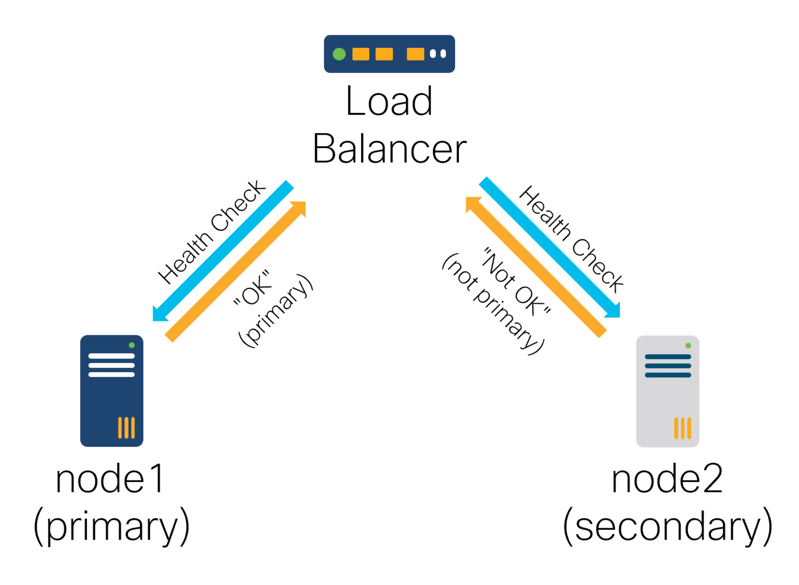

# High Availability

As a single NSO node can fail or lose network connectivity, you can configure multiple nodes in a highly available (HA) setup, which replicates the CDB configuration and operational data across participating nodes. It allows the system to continue functioning even when some nodes are inoperable.

The replication architecture is that of one active primary and a number of secondaries. This means all configuration write operations must occur on the primary, which distributes the updates to the secondaries.

Operational data in the CDB may be replicated or not based on the `tailf:persistent` statement in the data model. If replicated, operational data writes can only be performed on the primary, whereas non-replicated operational data can also be written on the secondaries.

Replication is supported in several different architectural setups. For example, two-node active/standby designs as well as multi-node clusters with runtime software upgrade.

<figure><figcaption><p>Primary - Secondary Configuration</p></figcaption></figure>

<figure><figcaption><p>One Primary - Several Secondaries</p></figcaption></figure>

This feature is independent of but compatible with the [Layered Service Architecture (LSA)](../advanced-topics/layered-service-architecture.md), which also configures multiple NSO nodes to provide additional scalability. When the following text simply refers to a cluster, it identifies the set of NSO nodes participating in the same HA group, not an LSA cluster, which is a separate concept.

NSO supports the following options for implementing an HA setup to cater to the widest possible range of use cases (only one can be used at a time):

* [**HA Raft**](high-availability.md#ug.ha.raft): Using a modern, consensus-based algorithm, it offers a robust, hands-off solution that works best in the majority of cases.
* [**Rule-based HA**](high-availability.md#ug.ha.builtin): A less sophisticated solution that allows you to influence the primary selection but may require occasional manual operator action.
* [**External HA**](high-availability.md#ferret): NSO only provides data replication; all other functions, such as primary selection and group membership management, are performed by an external application, using the HA framework (HAFW).

In addition to data replication, having a fixed address to connect to the current primary in an HA group greatly simplifies access for operators, users, and other systems alike. Use [Tail-f HCC Package](high-availability.md#ug.ha.hcc) or an [external load balancer](high-availability.md#ug.ha.lb) to manage it.

## NSO HA Raft <a href="#ug.ha.raft" id="ug.ha.raft"></a>

[Raft](https://raft.github.io/) is a consensus algorithm that reliably distributes a set of changes to a group of nodes and robustly handles network and node failure. It can operate in the face of multiple, subsequent failures, while also allowing a previously failed or disconnected node to automatically rejoin the cluster without risk of data conflicts.

Compared to traditional fail-over HA solutions, Raft relies on the consensus of the participating nodes, which addresses the so-called “split-brain” problem, where multiple nodes assume a primary role. This problem is especially characteristic of two-node systems, where it is impossible for a single node on its own to distinguish between losing network connectivity itself versus the other node malfunctioning. For this reason, Raft requires at least three nodes in the cluster.

Raft achieves robustness by requiring at least three nodes in the HA cluster. Three is the recommended cluster size, allowing the cluster to operate in the face of a single node failure. In case you need to tolerate two nodes failing simultaneously, you can add two additional nodes, for a 5-node cluster. However, permanently having more than five nodes in a single cluster is currently not recommended since Raft requires the majority of the currently configured nodes in the cluster to reach consensus. Without the consensus, the cluster cannot function.

You can start a sample HA Raft cluster using the `examples.ncs/high-availability/raft-cluster` example to test it out. The scripts in the example show various aspects of cluster setup and operation, which are further described in the rest of this section.

Optionally, examples using separate containers for each HA Raft cluster member with NSO system installations are available and referenced in the `examples.ncs/development-guide/high-availability/hcc` example in the NSO example set.

### Overview of Raft Operation <a href="#d5e4526" id="d5e4526"></a>

The Raft algorithm works with the concept of (election) terms. In each term, nodes in the cluster vote for a leader. The leader is elected when it receives the majority of the votes. Since each node only votes for a single leader in a given term, there can only be one leader in the cluster for this term.

Once elected, the leader becomes responsible for distributing the changes and ensuring consensus in the cluster for that term. Consensus means that the majority of the participating nodes must confirm a change before it is accepted. This is required for the system to ensure no changes ever get overwritten and provide reliability guarantees. On the other hand, it also means more than half of the nodes must be available for normal operation.

Changes can only be performed on the leader, that will accept the change after the majority of the cluster nodes confirm it. This is the reason a typical Raft cluster has an odd number of nodes; exactly half of the nodes agreeing on a change is not sufficient. It also makes a two-node cluster (or any even number of nodes in a cluster) impractical; the system as a whole is no more available than it is with one fewer node.

If the connection to the leader is broken, such as during a network partition, the nodes start a new term and a new election. Another node can become a leader if it gets the majority of the votes of all nodes initially in the cluster. While gathering votes, the node has the status of a candidate. In case multiple nodes assume candidate status, a split-vote scenario may occur, which is resolved by starting a fresh election until a candidate secures the majority vote.

If it happens that there aren't enough reachable nodes to obtain a majority, a candidate can stay in the candidate state for an indefinite time. Otherwise, when a node votes for a candidate, it becomes a follower and stays a follower in this term, regardless if the candidate is elected or not.

Additionally, the NSO node can also be in the stalled state, if HA Raft is enabled but the node has not joined a cluster.

### Node Names and Certificates <a href="#ch_ha.raft_names" id="ch_ha.raft_names"></a>

Each node in an HA Raft cluster needs a unique name. Names are usually in the `ADDRESS` format, where `ADDRESS` identifies a network host where the NSO process is running, such as a fully qualified domain name (FQDN) or an IPv4 address.

Other nodes in the cluster must be able to resolve and reach the `ADDRESS`, which creates a dependency on the DNS if you use domain names instead of IP addresses.

Limitations of the underlying platform place a constraint on the format of `ADDRESS`, which can't be a simple short name (without a dot), even if the system is able to resolve such a name using `hosts` file or a similar mechanism.

You specify the node address in the `ncs.conf` file as the value for `node-address`, under the `listen` container. You can also use the full node name (with the “@” character), however, that is usually unnecessary as the system prepends `ncsd@` as-needed.

Another aspect in which `ADDRESS` plays a role is authentication. The HA system uses mutual TLS to secure communication between cluster nodes. This requires you to configure a trusted Certificate Authority (CA) and a key/certificate pair for each node. When nodes connect, they check that the certificate of the peer validates against the CA and matches the `ADDRESS` of the peer.


Consider that TLS not only verifies that the certificate/key pair comes from a trusted source (certificate is signed by a trusted CA), it also checks that the certificate matches the host you are connecting to. Host A may have a valid certificate and key, signed by a trusted CA, however, if the certificate is for another host, say host B, the authentication will fail.


In most cases, this means the `ADDRESS` must appear in the node certificate's Subject Alternative Name (SAN) extension, as `dNSName` (see [RFC2459](https://datatracker.ietf.org/doc/html/rfc2459)).

Create and use a self-signed CA to secure the NSO HA Raft cluster. A self-signed CA is the only secure option. The CA should only be used to sign the certificates of the member nodes in one NSO HA Raft cluster. It is critical for security that the CA is not used to sign any other certificates. Any certificate signed by the CA can be used to gain complete control of the NSO HA Raft cluster.

See the `examples.ncs/high-availability/raft-cluster` example for one way to set up a self-signed CA and provision individual node certificates. The example uses a shell script `gen_tls_certs.sh` that invokes the `openssl` command. Consult the section [Recipe for a Self-signed CA](high-availability.md#recipe-for-a-self-signed-ca) for using it independently of the example.

Examples using separate containers for each HA Raft cluster member with NSO system installations that use a variant of the `gen_tls_certs.sh` script are available and referenced in the `examples.ncs/development-guide/high-availability/hcc` example in the NSO example set.


When using an IP address instead of a DNS name for node's `ADDRESS`, you must add the IP address to the certificate's dNSName SAN field (adding it to iPAddress field only is insufficient). This is a known limitation in the current version.


The following is a HA Raft configuration snippet for `ncs.conf` that includes certificate settings and a sample `ADDRESS`:

```xml
  <ha-raft>
    <!-- ... -->
    <listen>
      <node-address>198.51.100.10</node-address>
    </listen>
    <ssl>
      <ca-cert-file>${NCS_CONFIG_DIR}/dist/ssl/cert/myca.crt</ca-cert-file>
      <cert-file>${NCS_CONFIG_DIR}/dist/ssl/cert/node-100-10.crt</cert-file>
      <key-file>${NCS_CONFIG_DIR}/dist/ssl/cert/node-100-10.key</key-file>
    </ssl>
  </ha-raft>
```

### Recipe for a Self-signed CA

HA Raft uses a standard TLS protocol with public key cryptography for securing cross-node communication, where each node requires a separate public/private key pair and a corresponding certificate. Key and certificate management is a broad topic and is critical to the overall security of the system.

The following text provides a recipe for generating certificates using a self-signed CA. It uses strong cryptography and algorithms that are deemed suitable for production use. However, it makes a few assumptions that may not be appropriate for all environments. Always consider how they affect your own deployment and consult a security professional if in doubt.

The recipe makes the following assumptions:

* You use a secured workstation or server to run these commands and handle the generated keys with care. In particular, you must copy the generated keys to NSO nodes in a secure fashion, such as using `scp`.
* The CA is used solely for a single NSO HA Raft cluster, with certificates valid for 10 years, and provides no CRL. If a single key or host is compromised, a new CA and all key/certificate pairs must be recreated and reprovisioned in the cluster.
* Keys and signatures based on ecdsa-with-sha384/P-384 are sufficiently secure for the vast majority of environments. However, if your organization has specific requirements, be sure to follow those.

To use this recipe, first, prepare a working environment on a secure host by creating a new directory and copying the `gen_tls_certs.sh` script from `$NCS_DIR/examples.ncs/high-availability/raft-cluster` into it. Additionally, ensure that the `openssl` command, version 1.1 or later, is available and the system time is set correctly. Supposing that you have a cluster named `lower-west`, you might run:

```bash
$ mkdir raft-ca-lower-west
$ cd raft-ca-lower-west
$ cp $NCS_DIR/examples.ncs/high-availability/raft-cluster/gen_tls_certs.sh .
$ openssl version
$ date
```


Including cluster name in the directory name helps distinguish certificates of one HA cluster from another, such as when using an LSA deployment in an HA configuration.


The recipe relies on the `gen_tls_certs.sh` script to generate individual certificates. For clusters using FQDN node addresses, invoke the script with full hostnames of all the participating nodes. For example:

```bash
$ ./gen_tls_certs.sh node1.example.org node2.example.org node3.example.org
```


Using only hostnames, e.g. `node1`, will not work.


If your HA cluster is using IP addresses instead, add the `-a` option to the command and list the IPs:

```bash
$ ./gen_tls_certs.sh -a 192.0.2.1 192.0.2.2 192.0.2.3
```

The script outputs the location of the relevant files and you should securely transfer each set of files to the corresponding NSO node. For each node, transfer only the three files: `ca.crt`, _`host`_`.crt`, and _`host`_`.key`.

Once certificates are deployed, you can check their validity with the `openssl verify` command:

```bash
$ openssl verify -CAfile ssl/certs/ca.crt ssl/certs/node1.example.org.crt
```

This command takes into account the current time and can be used during troubleshooting. It can also display information contained in the certificate if you use the `openssl x509 -text -in ssl/certs/`_`node1.example.org`_`.crt -noout` variant. The latter form allows you to inspect the incorporated hostname/IP address and certificate validity dates.

### Network and `ncs.conf` Prerequisites <a href="#ch_ha.raft_ports" id="ch_ha.raft_ports"></a>

In addition to the network connectivity required for the normal operation of a standalone NSO node, nodes in the HA Raft cluster must be able to initiate TCP connections from a random ephemeral client port to the following ports on other nodes:

* Port 4369
* Ports in the range 4370-4399 (configurable)

You can change the ports in the second listed range from the default of 4370-4399. Use the `min-port` and `max-port` settings of the `ha-raft/listen` container.

The Raft implementation does not impose any other hard limits on the network but you should keep in mind that consensus requires communication with other nodes in the cluster. A high round-trip latency between cluster nodes is likely to negatively impact the transaction throughput of the system.

The HA Raft cluster also requires compatible `ncs.conf` files among the member nodes. In particular, `/ncs-config/cdb/operational/enabled` and `/ncs-config/rollback/enabled` values affect replication behavior and must match. Likewise, each member must have the same set of encryption keys and the keys cannot be changed while the cluster is in operation.

To update the `ncs.conf` configuration, you must manually update the copy on each member node, making sure the new versions contain compatible values. Then perform the reload on the leader and the follower members will automatically reload their copies of the configuration file as well.

If a node is a cluster member but has been configured with a new, incompatible `ncs.conf` file, it gets automatically disabled. See the `/ha-raft/status/disabled-reason` for reason. You can re-enable the node with the `ha-raft reset` command, once you have reconciled the incompatibilities.

### Connected Nodes and Node Discovery <a href="#d5e4598" id="d5e4598"></a>

Raft has a notion of cluster configuration, in particular, how many and which members the cluster has. You define member nodes when you first initialize the cluster with the `create-cluster` command or use the `adjust-membership` command. The member nodes allow the cluster to know how many nodes are needed for consensus and similar.

However, not all cluster members may be reachable or alive all the time. Raft implementation in NSO uses TCP connections between nodes to transport data. The TCP connections are authenticated and encrypted using TLS by default (see [Security Considerations](high-availability.md#ch\_ha.raft\_security)). A working connection between nodes is essential for the cluster to function but a number of factors, such as firewall rules or expired/invalid certificates, can prevent the connection from establishing.

Therefore, NSO distinguishes between configured member nodes and nodes to which it has established a working transport connection. The latter are called connected nodes. In a normal, fully working, and properly configured cluster, the connected nodes will be the same as member nodes (except for the current node).

To help troubleshoot connectivity issues without affecting cluster operation, connected nodes will show even nodes that are not actively participating in the cluster but have established a transport connection to nodes in the cluster. The optional discovery mechanism, described next, relies on this functionality.

NSO includes a mechanism that simplifies the initial cluster setup by enumerating known nodes. This mechanism uses a set of seed nodes to discover all connectable nodes, which can then be used with the `create-cluster` command to form a Raft cluster.

When you specify one or more nodes with the `/ha-raft/seed-nodes/seed-node` setting in the `ncs.conf` file, the current node tries to establish a connection to these seed nodes, in order to discover the list of all nodes potentially participating in the cluster. For the discovery to work properly, all other nodes must also use seed nodes and the set of seed nodes must overlap. The recommended practice is to use the same set of seed nodes on every participating node.

Along with providing an autocompletion list for the `create-cluster` command, this feature streamlines the discovery of node names when using NSO in containerized or other dynamic environments, where node addresses are not known in advance.

### Initial Cluster Setup <a href="#ch_ha.raft_setup" id="ch_ha.raft_setup"></a>

Creating a new HA cluster consists of two parts: configuring the individual nodes and running the `create-cluster` action.

First, you must update the `ncs.conf` configuration file for each node. All HA Raft configuration comes under the `/ncs-config/ha-raft` element.

As part of the configuration, you must:

* Enable HA Raft functionality through the `enabled` leaf.
* Set `node-address` and the corresponding TLS parameters (see [Node Names and Certificates](high-availability.md#ch\_ha.raft\_names)).
* Identify the cluster this node belongs to with `cluster-name`.
* Reload or restart the NSO process (if already running).
* Repeat the preceding steps for every participating node.
* Invoke the `create-cluster` action.

The cluster name is simply a character string that uniquely identifies this HA cluster. The nodes in the cluster must use the same cluster name or they will refuse to establish a connection. This setting helps prevent mistakenly adding a node to the wrong cluster when multiple clusters are in operation, such as in an LSA setup.


```xml
  <ha-raft>
    <enabled>true</enabled>
    <cluster-name>sherwood</cluster-name>
    <listen>
      <node-address>ash.example.org</node-address>
    </listen>
    <ssl>
      <ca-cert-file>${NCS_CONFIG_DIR}/dist/ssl/cert/myca.crt</ca-cert-file>
      <cert-file>${NCS_CONFIG_DIR}/dist/ssl/cert/ash.crt</cert-file>
      <key-file>${NCS_CONFIG_DIR}/dist/ssl/cert/ash.key</key-file>
    </ssl>
    <seed-nodes>
      <seed-node>birch.example.org</seed-node>
    </seed-nodes>
  </ha-raft>
```


With all the nodes configured and running, connect to the node that you would like to become the initial leader and invoke the `ha-raft create-cluster` action. The action takes a list of nodes identified by their names. If you have configured `seed-nodes`, you will get auto-completion support, otherwise, you have to type in the names of the nodes yourself.

This action makes the current node a cluster leader and joins the other specified nodes to the newly created cluster. For example:

```cli
admin@ncs# ha-raft create-cluster member [ birch.example.org cedar.example.org ]
admin@ncs# show ha-raft
ha-raft status role leader
ha-raft status leader ash.example.org
ha-raft status member [ ash.example.org birch.example.org cedar.example.org ]
ha-raft status connected-node [ birch.example.org cedar.example.org ]
ha-raft status local-node ash.example.org
...
```

You can use the `show ha-raft` command on any node to inspect the status of the HA Raft cluster. The output includes the current cluster leader and members according to this node, as well as information about the local node, such as node name (`local-node`) and role. The `status/connected-node` list contains the names of the nodes with which this node has active network connections.

In case you get an error, such as the `Error: NSO can't reach member node 'ncsd@ADDRESS'.`, please verify all of the following:

* The node at the `ADDRESS` is reachable. You can use the `ping` `ADDRESS` command, for example.
* The problematic node has the correct `ncs.conf` configuration, especially `cluster-name` and `node-address`. The latter should match the `ADDRESS` and should contain at least one dot.
* Nodes use compatible configuration. For example, make sure the `ncs.crypto_keys` file (if used) or the `encrypted-strings` configuration in `ncs.conf` is identical across nodes.
* HA Raft is enabled, using the **show ha-raft** command on the unreachable node.
* The firewall configuration on the OS and on the network level permits traffic on the required ports (see [Network and `ncs.conf` Prerequisites](high-availability.md#ch\_ha.raft\_ports)).
* The node uses a certificate that the CA can validate. For example, copy the certificates to the same location and run `openssl verify -CAfile CA_CERT NODE_CERT` to verify this.
* Verify the `epmd -names` command on each node shows the ncsd process. If not, stop NSO, run `epmd -kill`, and then start NSO again.

In addition to the above, you may also examine the `logs/raft.log` file for detailed information on the error message and overall operation of the Raft algorithm. The amount of information in the file is controlled by the `/ncs-config/logs/raft-log` configuration in the `ncs.conf`.

### Cluster Management <a href="#d5e4696" id="d5e4696"></a>

After the initial cluster setup, you can add new nodes or remove existing nodes from the cluster with the help of the `ha-raft adjust-membership` action. For example:

```cli
admin@ncs# show ha-raft status member
ha-raft status member [ ash.example.org birch.example.org cedar.example.org ]
admin@ncs# ha-raft adjust-membership remove-node birch.example.org
admin@ncs# show ha-raft status member
ha-raft status member [ ash.example.org cedar.example.org ]
admin@ncs# ha-raft adjust-membership add-node dollartree.example.org
admin@ncs# show ha-raft status member
ha-raft status member [ ash.example.org cedar.example.org dollartree.example.org ]
```

When removing nodes using the `ha-raft adjust-membership remove-node` command, the removed node is not made aware that it is removed from the cluster and continues signaling the other nodes. This is a limitation in the algorithm, as it must also handle situations, where the removed node is down or unreachable. To prevent further communication with the cluster, it is important you ensure the removed node is shut down. You should shut down the to-be-removed node prior to removal from the cluster, or immediately after it. The former is recommended but the latter is required if there are only two nodes left in the cluster and shutting down prior to removal would prevent the cluster from reaching consensus.

Additionally, you can force an existing follower node to perform a full re-sync from the leader by invoking the `ha-raft reset` action with the `force` option. Using this action on the leader will make the node give up the leader role and perform a sync with the newly elected leader.

As leader selection during the Raft election is not deterministic, NSO provides the `ha-raft handover` action, which allows you to either trigger a new election if called with no arguments or transfer leadership to a specific node. The latter is especially useful when, for example, one of the nodes resides in a different location and more traffic between locations may incur extra costs or additional latency, so you prefer this node is not the leader under normal conditions.

#### Passive follower

In certain situations, it may be advantageous to have a follower node that cannot be promoted to leader role. Consider a scenario with three Raft-enabled nodes distributed across two different data centers.

In this case, a node located without a peer in the same data center might experience increased latency due to the requirement for acknowledgments from at least one node in the other data center.

To address this, HA Raft provides the `/ncs-config/ha-raft/passive` setting. When this setting is enabled (set to `true`), it prevents the node from assuming the candidate or leader role. A passive follower still participates by voting in leader elections.

Note that the `passive` parameter is local to the node, meaning other nodes in the cluster are unaware that a particular follower is passive. Consequently, it is possible to initiate a handover action targeting the passive node, but the handover will ultimately fail at a later stage, allowing the current leader to retain its position.

### Migrating From Existing Rule-based HA <a href="#d5e4714" id="d5e4714"></a>

If you have an existing HA cluster using the rule-based built-in HA, you can migrate it to use HA Raft instead. This procedure is performed in four distinct high-level steps:

* Ensuring the existing cluster meets migration prerequisites.
* Preparing the required HA Raft configuration files.
* Switching to HA Raft.
* Adding additional nodes to the cluster.

The procedure does not perform an NSO version upgrade, so the cluster remains on the same version. It also does not perform any schema upgrades, it only changes the type of the HA cluster.

The migration procedure is in place, that is, the existing nodes are disconnected from the old cluster and connected to the new one. This results in a temporary disruption of the service, so it should be performed during a service window.

First, you should ensure the cluster meets migration prerequisites. The cluster must use:

* NSO 6.1.2 or later
* tailf-hcc 6.0 or later (if used)

In case these prerequisites are not met, follow the standard upgrade procedures to upgrade the existing cluster to supported versions first.

Additionally, ensure that all used packages are compatible with HA Raft, as NSO uses some new or updated notifications about HA state changes. Also, verify the network supports the new cluster communications (see [Network and `ncs.conf` Prerequisites](high-availability.md#ch\_ha.raft\_ports)).

Secondly, prepare all the `ncs.conf` and related files for each node, such as certificates and keys. Create a copy of all the `ncs.conf` files and disable or remove the existing `>ha<` section in the copies. Then add the required configuration items to the copies, as described in [Initial Cluster Setup](high-availability.md#ch\_ha.raft\_setup) and [Node Names and Certificates](high-availability.md#ch\_ha.raft\_names). Do not update the `ncs.conf` files used by the nodes yet.

It is recommended but not necessary that you set the seed nodes in `ncs.conf` to the designated primary and fail-over primary. Do this for all `ncs.conf` files for all nodes.

#### Procedure 1. Migration to HA Raft

1. With the new configurations at hand and verified, start the switch to HA Raft. The cluster nodes should be in their nominal, designated roles. If not, perform a failover first.
2.  On the designated (actual) primary, called `node1`, enable read-only mode.

    ```cli
    admin@node1# high-availability read-only mode true
    ```
3. Then take a backup of all nodes.
4.  Once the backup successfully completes, stop the designated fail-over primary (actual secondary) NSO process, update its `ncs.conf` and the related (certificate) files for HA Raft, and then start it again. Connect to this node's CLI, here called node2, and verify HA Raft is enabled with the `show` `ha-raft` command.

    ```cli
    admin@node2# show ha-raft
    ha-raft status role stalled
    ha-raft status local-node node2.example.org
    > ... output omitted ... <
    ```
5.  Now repeat the same for the designated primary (`node1`). If you have set the seed nodes, you should see the fail-over primary show under `connected-node`.

    ```cli
    admin@node1# show ha-raft
    ha-raft status role stalled
    ha-raft status connected-node [ node2.example.org ]
    ha-raft status local-node node1.example.org
    > ... output omitted ... <
    ```
6.  On the old designated primary (node1) invoke the `ha-raft create-cluster` action and create a two-node Raft cluster with the old fail-over primary (`node2`, actual secondary). The action takes a list of nodes identified by their names. If you have configured `seed-nodes`, you will get auto-completion support, otherwise you have to type in the name of the node yourself.

    ```cli
    admin@node1# ha-raft create-cluster member [ node2.example.org ]
    admin@node1# show ha-raft
    ha-raft status role leader
    ha-raft status leader node1.example.org
    ha-raft status member [ node1.example.org node2.example.org ]
    ha-raft status connected-node [ node2.example.org ]
    ha-raft status local-node node1.example.org
    > ... output omitted ... <
    ```

    In case of errors running the action, refer to [Initial Cluster Setup](high-availability.md#ch\_ha.raft\_setup) for possible causes and troubleshooting steps.
7. Raft requires at least three nodes to operate effectively (as described in [NSO HA Raft](high-availability.md#ug.ha.raft)) and currently, there are only two in the cluster. If the initial cluster had only two nodes, you must provision an additional node and set it up for HA Raft. If the cluster initially had three nodes, there is the remaining secondary node, `node3`, which you must stop, update its configuration as you did with the other two nodes, and start it up again.
8.  Finally, on the old designated primary and current HA Raft leader, use the `ha-raft adjust-membership add-node` action to add this third node to the cluster.

    ```cli
    admin@node1# ha-raft adjust-membership add-node node3.example.org
    admin@node1# show ha-raft status member
    ha-raft status member [ node1.example.org node2.example.org node3.example.org ]
    ```

### Security Considerations <a href="#ch_ha.raft_security" id="ch_ha.raft_security"></a>

Communication between the NSO nodes in an HA Raft cluster takes place over Distributed Erlang, an RPC protocol transported over TLS (unless explicitly disabled by setting `/ncs-config/ha-raft/ssl/enabled` to 'false').

TLS (Transport Layer Security) provides Authentication and Privacy by only allowing NSO nodes to connect using certificates and keys issued from the same Certificate Authority (CA). Distributed Erlang is transported over TLS 1.2. Access to a host can be revoked by the CA through the means of a CRL (Certificate Revocation List). To enforce certificate revocation within an HA Raft cluster, invoke the action /ha-raft/disconnect to terminate the pre-existing connection. A connection to the node can re-establish once the node's certificate is valid.

Please ensure the CA key is kept in a safe place since it can be used to generate new certificates and key pairs for peers.

Distributed Erlang supports for multiple NSO nodes to run on the same host and the node addresses are resolved by the `epmd` ([Erlang Port Mapper Daemon](https://www.erlang.org/docs/22/man/epmd.html)) service. Once resolved, the NSO nodes communicate directly.

The ports `epmd` and the NSO nodes listen to can be found in [Network and `ncs.conf` Prerequisites](high-availability.md#ch\_ha.raft\_ports). `epmd` binds the wildcard IPv4 address `0.0.0.0` and the IPv6 address `::`.

In case `epmd` is exposed to a DoS attack, the HA Raft members may be unable to resolve addresses and communication could be disrupted. Please ensure traffic on these ports are only accepted between the HA Raft members by using firewall rules or other means.

Two NSO nodes can only establish a connection if a shared secret "cookie" matches. The cookie is optionally configured from `/ncs-config/ha-raft/cluster-name`. Please note the cookie is not a security feature but a way to isolate HA Raft clusters and to avoid accidental misuse.

### Packages Upgrades in Raft Cluster

NSO contains a mechanism for distributing packages to nodes in a Raft cluster, greatly simplifying package management in a highly-available setup.

You perform all package management operations on the current leader node. To identify the leader node, you can use the `show ha-raft status leader` command on a running cluster.

Invoking the `packages reload` command makes the leader node update its currently loaded packages, identical to a non-HA, single-node setup. At the same time, the leader also distributes these packages to the followers to load. However, the load paths on the follower nodes, such as `/var/opt/ncs/packages/`, are not updated. This means, that if a leader election took place, a different leader was elected, and you performed another `packages reload`, the system would try to load the versions of the packages on this other leader, which may be out of date or not even present.

The recommended approach is, therefore, to use the `packages ha sync and-reload` command instead, unless a load path is shared between NSO nodes, such as the same network drive. This command distributes and updates packages in the load paths on the follower nodes, as well as loading them.

For the full procedure, first, ensure all cluster nodes are up and operational, then follow these steps on the leader node:

* Perform a full backup of the NSO instance, such as running `ncs-backup`.
* Add, replace, or remove packages on the filesystem. The exact location depends on the type of NSO deployment, for example `/var/opt/ncs/packages/`.
* Invoke the `packages ha sync and-reload` or `packages ha sync and-add` command to start the upgrade process.

Note that while the upgrade is in progress, writes to the CDB are not allowed and will be rejected.

For a `packages ha sync and-reload` example see the `raft-upgrade-l2` NSO system installation-based example referenced by the `examples.ncs/development-guide/high-availability/hcc` example in the NSO example set.

For more details, troubleshooting, and general upgrade recommendations, see [NSO Packages](package-mgmt.md) and [Upgrade](../installation-and-deployment/upgrade-nso.md).

### Version Upgrade of Cluster Nodes <a href="#ch_ha.raft_upgrade" id="ch_ha.raft_upgrade"></a>

Currently, the only supported and safe way of upgrading the Raft HA cluster NSO version requires that the cluster be taken offline since the nodes must, at all times, run the same software version.

Do not attempt an upgrade unless all cluster member nodes are up and actively participating in the cluster. Verify the current cluster state with the `show ha-raft status` command. All member nodes must also be present in the connected-node list.

The procedure differentiates between the current leader node versus followers. To identify the leader, you can use the `show ha-raft status leader` command on a running cluster.

**Procedure 2. Cluster version upgrade**

1. On the leader, first enable read-only mode using the `ha-raft read-only mode true` command and then verify that all cluster nodes are in sync with the `show ha-raft status log replications state` command.
2. Before embarking on the upgrade procedure, it's imperative to backup each node. This ensures that you have a safety net in case of any unforeseen issues. For example, you can use the `$NCS_DIR/bin/ncs-backup` command.
3. Delete the `$NCS_RUN_DIR/cdb/compact.lock` file and compact the CDB write log on all nodes using, for example, the `$NCS_DIR/bin/ncs --cdb-compact $NCS_RUN_DIR/cdb` command.
4. On all nodes, delete the `$NCS_RUN_DIR/state/raft/` directory with a command such as `rm -rf $NCS_RUN_DIR/state/raft/`.
5. Stop NSO on all the follower nodes, for example, invoking the `$NCS_DIR/bin/ncs --stop` or `/etc/init.d/ncs stop` command on each node.
6. Stop NSO on the leader node only after you have stopped all the follower nodes in the previous step. Alternatively NSO can be stopped on the nodes before deleting the HA Raft state and compacting the CDB write log without needing to delete the `compact.lock` file.
7. Upgrade the NSO packages on the leader to support the new NSO version.
8. Install the new NSO version on all nodes.
9. Start NSO on all nodes.
10. Re-initialize the HA cluster using the `ha-raft create-cluster` action on the node to become the leader.
11. Finally, verify the cluster's state through the `show ha-raft status` command. Ensure that all data has been correctly synchronized across all cluster nodes and that the leader is no longer read-only. The latter happens automatically after re-initializing the HA cluster.

For a standard System Install, the single-node procedure is described in [Single Instance Upgrade](../installation-and-deployment/upgrade-nso.md#ug.admin\_guide.manual\_upgrade), but in general depends on the NSO deployment type. For example, it will be different for containerized environments. For specifics, please refer to the documentation for the deployment type.

For an example see the `raft-upgrade-l2` NSO system installation-based example referenced by the `examples.ncs/development-guide/high-availability/hcc` example in the NSO example set.

If the upgrade fails before or during the upgrade of the original leader, start up the original followers to restore service and then restore the original leader, using backup as necessary.

However, if the upgrade fails after the original leader was successfully upgraded, you should still be able to complete the cluster upgrade. If you are unable to upgrade a follower node, you may provision a (fresh) replacement and the data and packages in use will be copied from the leader.

## NSO Rule-based HA <a href="#ug.ha.builtin" id="ug.ha.builtin"></a>

NSO can manage the HA groups based on a set of predefined rules. This functionality was added in NSO 5.4 and is sometimes referred to simply as the built-in HA. However, since NSO 6.1, HA Raft (which is also built-in) is available as well, and is likely a better choice in most situations.

Rule-based HA allows administrators to:

* Configure HA group members with IP addresses and default roles
* Configure failover behavior
* Configure start-up behavior
* Configure HA group members with IP addresses and default roles
* Assign roles, join HA group, enable/disable rule-based HA through actions
* View the state of the current HA setup

NSO rule-based HA is defined in `tailf-ncs-high-availability.yang`, with data residing under the `/high-availability/` container.

NSO rule-based HA does not manage any virtual IP addresses, or advertise any BGP routes or similar. This must be handled by an external package. Tail-f HCC 5.x and greater has this functionality compatible with NSO rule-based HA. You can read more about the HCC package in the [following chapter](high-availability.md#ug.ha.hcc).

### Prerequisites <a href="#d5e4824" id="d5e4824"></a>

To use NSO rule-based HA, HA must first be enabled in `ncs.conf` - See [Mode of Operation](high-availability.md#ha.moo).


If the package tailf-hcc with a version less than 5.0 is loaded, NSO rule-based HA will not function. These HCC versions may still be used but NSO built-in HA will not function in parallel.


### HA Member Configuration <a href="#d5e4830" id="d5e4830"></a>

All HA group members are defined under `/high-availability/ha-node`. Each configured node must have a unique IP address configured and a unique HA ID. Additionally, nominal roles and fail-over settings may be configured on a per-node basis.

The HA Node ID is a unique identifier used to identify NSO instances in an HA group. The HA ID of the local node - relevant amongst others when an action is called - is determined by matching configured HA node IP addresses against IP addresses assigned to the host machine of the NSO instance. As the HA ID is crucial to NSO HA, NSO rule-based HA will not function if the local node cannot be identified.

To join a HA group, a shared secret must be configured on the active primary and any prospective secondary. This is used for a CHAP-2-like authentication and is specified under `/high-availability/token/`.


In an NSO System Install setup, not only does the shared token need to match between the HA group nodes but the configuration for encrypted strings, default stored in `/etc/ncs/ncs.crypto_keys`, need also to match between the nodes in the HA group.


The token configured on the secondary node is overwritten with the encrypted token of type `aes-256-cfb-128-encrypted-string` from the primary node when the secondary node connects to the primary. If there is a mismatch between the encrypted-string configuration on the nodes, NSO will not decrypt the HA token to match the token presented. As a result, the primary node denies the secondary node access the next time the HA connection needs to reestablish with a "Token mismatch, secondary is not allowed" error.

See the `upgrade-l2` example, referenced from `examples.ncs/development-guide/high-availability/hcc`, for an example setup and the [Deployment Example](../installation-and-deployment/deployment-example.md) for a description of the example.

Also, note that the `ncs.crypto_keys` file is highly sensitive. The file contains the encryption keys for all CDB data that is encrypted on disk. Besides the HA token, this often includes passwords for various entities, such as login credentials to managed devices.

### HA Roles <a href="#d5e4846" id="d5e4846"></a>

NSO can assume HA roles `primary`, `secondary` and `none`. Roles can be assigned directly through actions, or at startup or failover. See [HA Framework Requirements](high-availability.md#ferret) for the definition of these roles.


NSO rule-based HA does not support relay-secondaries.


NSO rule-based HA distinguishes between the concepts of nominal role and assigned role. Nominal-role is configuration data that applies when an NSO instance starts up and at failover. The assigned role is the role that the NSO instance has been ordered to assume either by an action or as a result of startup or failover.

### Failover <a href="#d5e4857" id="d5e4857"></a>

Failover may occur when a secondary node loses the connection to the primary node. A secondary may then take over the primary role. Failover behavior is configurable and controlled by the parameters:

* `/high-availability/ha-node{id}/failover-primary`
* `/high-availability/settings/enable-failover`

For automatic failover to function, `/high-availability/settings/enable-failover` must be se to `true`. It is then possible to enable at most one node with a nominal role secondary as failover-primary, by setting the parameter `/high-availability/ha-node{id}/failover-primary`. A node with a nominal role primary is also implicitly a failover-primary - it will act as failover-primary if its currently assigned role is secondary.

Before failover happens, a failover-primary-enabled secondary node may attempt to reconnect to the previous primary before assuming the primary role. This behavior is configured by the parameters denoting how many reconnect attempts will be made, and with which interval, respectively.

* `/high-availability/settings/reconnect-attempts`
* `/high-availability/settings/reconnect-interval`

HA Members that are assigned as secondaries, but are neither failover-primaries nor set with a nominal-role primary, may attempt to rejoin the HA group after losing connection to the primary.

This is controlled by `/high-availability/settings/reconnect-secondaries`. If this is true, secondary nodes will query the nodes configured under `/high-availability/ha-node` for an NSO instance that currently has the primary role. Any configured nominal roles will not be considered. If no primary node is found, subsequent attempts to rejoin the HA setup will be issued with an interval defined by `/high-availability/settings/reconnect-interval`.

In case a net-split provokes a failover it is possible to end up in a situation with two primaries, both nodes accepting writes. The primaries are then not synchronized and will end up in a split brain. Once one of the primaries joins the other as a secondary, the HA cluster is once again consistent but any out-of-sync changes will be overwritten.

To prevent split-brain from occurring, NSO 5.7 or later comes with a rule-based algorithm. The algorithm is enabled by default, it can be disabled or changed from the parameters:

* `/high-availability/settings/consensus/enabled [true]`
* `/high-availability/settings/consensus/algorithm [ncs:rule-based]`

The rule-based algorithm can be used in either of the two HA constellations:

* Two nodes: one nominal primary and one nominal secondary configured as failover-primary.
* Three nodes: one nominal primary, one nominal secondary configured as failover-primary, and one perpetual secondary.

On failover:

* Failover-primary: become primary but enable read-only mode. Once the secondary joins, disable read-only.
* Nominal primary: on loss of all secondaries, change role to none. If one secondary node is connected, stay primary.


In certain cases, the rule-based consensus algorithm results in nodes being disconnected and will not automatically rejoin the HA cluster, such as in the example above when the nominal primary becomes none on the loss of all secondaries.


To restore the HA cluster one may need to manually invoke the `/high-availability/be-secondary-to` action.


In the case where the failover-primary takes over as primary, it will enable read-only mode, if no secondary connects it will remain read-only. This is done to guarantee consistency.


The read-write mode can manually be enabled from the `/high-availability/read-only` action with the parameter mode passed with value false.

When any node loses connection, this can also be observed in high-availability alarms as either a `ha-primary-down` or a `ha-secondary-down` alarm.

```
alarms alarm-list alarm ncs ha-primary-down /high-availability/ha-node[id='paris']
 is-cleared              false
 last-status-change      2022-05-30T10:02:45.706947+00:00
 last-perceived-severity critical
 last-alarm-text         "Lost connection to primary due to: Primary closed connection"
 status-change 2022-05-30T10:02:45.706947+00:00
  received-time      2022-05-30T10:02:45.706947+00:00
  perceived-severity critical
  alarm-text         "Lost connection to primary due to: Primary closed connection"
```

```
alarms alarm-list alarm ncs ha-secondary-down /high-availability/ha-node[id='london'] ""
 is-cleared              false
 last-status-change      2022-05-30T10:04:33.231808+00:00
 last-perceived-severity critical
 last-alarm-text         "Lost connection to secondary"
 status-change 2022-05-30T10:04:33.231808+00:00
  received-time      2022-05-30T10:04:33.231808+00:00
  perceived-severity critical
  alarm-text         "Lost connection to secondary"
```

### Startup <a href="#ug.ha.startup" id="ug.ha.startup"></a>

Startup behavior is defined by a combination of the parameters `/high-availability/settings/start-up/assume-nominal-role` and `/high-availability/settings/start-up/join-ha` as well as the node's nominal role:

<table data-header-hidden><thead><tr><th width="188">assume-nominal-role</th><th width="137">join-ha</th><th width="154">nominal-role</th><th>behaviour</th></tr></thead><tbody><tr><td><code>assume-nominal-role</code></td><td><code>join-ha</code></td><td><code>nominal-role</code></td><td><code>behaviour</code></td></tr><tr><td><code>true</code></td><td><code>false</code></td><td><code>primary</code></td><td>Assume primary role.</td></tr><tr><td><code>true</code></td><td><code>false</code></td><td><code>secondary</code></td><td>Attempt to connect as secondary to the node (if any) which has nominal-role primary. If this fails, make no retry attempts and assume none role.</td></tr><tr><td><code>true</code></td><td><code>false</code></td><td><code>none</code></td><td>Assume none role</td></tr><tr><td><code>false</code></td><td><code>true</code></td><td><code>primary</code></td><td>Attempt to join HA setup as secondary by querying for current primary. Retries will be attempted. Retry attempt interval is defined by <code>/high-availability/settings/reconnect-interval</code>.</td></tr><tr><td><code>false</code></td><td><code>true</code></td><td><code>secondary</code></td><td>Attempt to join HA setup as secondary by querying for current primary. Retries will be attempted. Retry attempt interval is defined by <code>/high-availability/settings/reconnect-interval</code>. If all retry attempts fail, assume none role.</td></tr><tr><td><code>false</code></td><td><code>true</code></td><td><code>none</code></td><td>Assume none role.</td></tr><tr><td><code>true</code></td><td><code>true</code></td><td><code>primary</code></td><td>Query HA setup once for a node with primary role. If found, attempt to connect as secondary to that node. If no current primary is found, assume primary role.</td></tr><tr><td><code>true</code></td><td><code>true</code></td><td><code>secondary</code></td><td>Attempt to join HA setup as secondary by querying for current primary. Retries will be attempted. Retry attempt interval is defined by <code>/high-availability/settings/reconnect-interval</code>. If all retry attempts fail, assume none role.</td></tr><tr><td><code>true</code></td><td><code>true</code></td><td><code>none</code></td><td>Assume none role.</td></tr><tr><td><code>false</code></td><td><code>false</code></td><td><code>-</code></td><td>Assume none role.</td></tr></tbody></table>

### Actions <a href="#d5e5031" id="d5e5031"></a>

NSO rule-based HA can be controlled through several actions. All actions are found under `/high-availability/`. The available actions are listed below:

<table data-header-hidden><thead><tr><th width="240">Action</th><th>Description</th></tr></thead><tbody><tr><td><code>be-primary</code></td><td>Order the local node to assume ha role primary</td></tr><tr><td><code>be-none</code></td><td>Order the local node to assume ha role none</td></tr><tr><td><code>be-secondary-to</code></td><td>Order the local node to connect as secondary to the provided HA node. This is an asynchronous operation, result can be found under <code>/high-availability/status/be-secondary-result</code></td></tr><tr><td><code>local-node-id</code></td><td>Identify the which of the nodes in <code>/high-availability/ha-node</code> (if any) corresponds to the local NSO instance</td></tr><tr><td><code>enable</code></td><td>Enable NSO rule-based HA and optionally assume a ha role according to /high-availability/settings/start-up/ parameters</td></tr><tr><td><code>disable</code></td><td>Disable NSO rule-based HA and assume a ha role none</td></tr></tbody></table>

### Status Check <a href="#d5e5077" id="d5e5077"></a>

The current state of NSO rule-based HA can be monitored by observing `/high-availability/status/`. Information can be found about the current active HA mode and the current assigned role. For nodes with active mode primary, a list of connected nodes and their source IP addresses is shown. For nodes with assigned role secondary the latest result of the be-secondary operation is listed. All NSO rule-based HA status information is non-replicated operational data - the result here will differ between nodes connected in an HA setup.

## Tail-f HCC Package <a href="#ug.ha.hcc" id="ug.ha.hcc"></a>

The Tail-f HCC package extends the built-in HA functionality by providing virtual IP addresses (VIPs) that can be used to connect to the NSO HA group primary node. HCC ensures that the VIP addresses are always bound by the HA group primary and never bound by a secondary. Each time a node transitions between primary and secondary states HCC reacts by binding (primary) or unbinding (secondary) the VIP addresses.

HCC manages IP addresses at the link layer (OSI layer 2) for Ethernet interfaces, and optionally, also at the network layer (OSI layer 3) using BGP router advertisements. The layer-2 and layer-3 functions are mostly independent and this document describes the details of each one separately. However, the layer-3 function builds on top of the layer-2 function. The layer-2 function is always necessary, otherwise, the Linux kernel on the primary node would not recognize the VIP address or accept traffic directed to it.


Tail-f HCC version 5.x is non-backward compatible with previous versions of Tail-f HCC and requires functionality provided by NSO version 5.4 and greater. For more details, see the [following chapter](high-availability.md#ug.ha.hcc.compared).


### Dependencies <a href="#ug.ha.hcc.deps" id="ug.ha.hcc.deps"></a>

Both the HCC layer-2 VIP and layer-3 BGP functionality depend on `iproute2` utilities and `awk`. An optional dependency is `arping` (either from `iputils` or Thomas Habets `arping` implementation) which allows HCC to announce the VIP to MAC mapping to all nodes in the network by sending gratuitous ARP requests.

The HCC layer-3 BGP functionality depends on the [`GoBGP`](https://osrg.github.io/gobgp/) daemon version 2.x being installed on each NSO host that is configured to run HCC in BGP mode.

GoBGP is open-source software originally developed by NTT Communications and released under the Apache License 2.0. GoBGP can be obtained directly from https://osrg.github.io/gobgp/ and is also packaged for mainstream Linux distributions.

The HCC layer-3 DNS Update functionality depends on the command line utility `nsupdate`.

Tools Dependencies are listed below:

<table><thead><tr><th width="192">Tool</th><th width="164">Package</th><th width="128">Required</th><th>Description</th></tr></thead><tbody><tr><td><code>ip</code></td><td><code>iproute2</code></td><td>yes</td><td>Adds and deletes the virtual IP from the network interface.</td></tr><tr><td><code>awk</code></td><td><code>mawk</code> or <code>gawk</code></td><td>yes</td><td>Installed with most Linux distributions.</td></tr><tr><td><code>sed</code></td><td><code>sed</code></td><td>yes</td><td>Installed with most Linux distributions.</td></tr><tr><td><code>arping</code></td><td><code>iputils</code> or <code>arping</code></td><td>optional</td><td>Installation recommended. Will reduce the propagation of changes to the virtual IP for layer-2 configurations.</td></tr><tr><td><code>gobgpd</code> and <code>gobgp</code></td><td><code>GoBGP 2.x</code></td><td>optional</td><td>Required for layer-3 configurations. gobgpd is started by the HCC package and advertises the virtual IP using BGP. gobgp is used to get advertised routes.</td></tr><tr><td><code>nsupdate</code></td><td><code>bind-tools</code> or <code>knot-dnsutils</code></td><td>optional</td><td>Required for layer-3 DNS update functionality and is used to submit Dynamic DNS Update requests to a name server.</td></tr></tbody></table>

Same as with built-in HA functionality, all NSO instances must be configured to run in HA mode. See the [following instructions](high-availability.md#ha.moo) on how to enable HA on NSO instances.

### Running the HCC Package with NSO as a Non-Root User <a href="#ug.ha.hcc.nonroot" id="ug.ha.hcc.nonroot"></a>

GoBGP uses TCP port 179 for its communications and binds to it at startup. As port 179 is considered a privileged port it is normally required to run gobgpd as root.

When NSO is running as a non-root user the gobgpd command will be executed as the same user as NSO and will prevent gobgpd from binding to port 179.

There a multiple ways of handling this and two are listed here.

1.  Set capability `CAP_NET_BIND_SERVICE` on the `gobgpd` file. May not be supported by all Linux distributions.

    ```bash
    $ sudo setcap 'cap_net_bind_service=+ep' /usr/bin/gobgpd
    ```
2.  Set the owner to `root` and the `setuid` bit of the `gobgpd` file. Works on all Linux distributions.

    ```bash
    $ sudo chown root /usr/bin/gobgpd
    $ sudo chmod u+s /usr/bin/gobgpd
    ```
3.  The `vipctl` script, included in the HCC package, uses `sudo` to run the `ip` and `arping` commands when NSO is not running as root. If `sudo` is used, you must ensure it does not require password input. For example, if NSO runs as `admin` user, the `sudoers` file can be edited similarly to the following:

    ```bash
    $ sudo echo "admin ALL = (root) NOPASSWD: /bin/ip" << /etc/sudoers
    $ sudo echo "admin ALL = (root) NOPASSWD: /path/to/arping" << /etc/sudoers
    ```

### Tail-f HCC Compared with HCC Version 4.x and Older <a href="#ug.ha.hcc.compared" id="ug.ha.hcc.compared"></a>

#### **HA Group Management Decisions**

Tail-f HCC 5.x or later does not participate in decisions on which NSO node is primary or secondary. These decisions are taken by NSO's built-in HA and then pushed as notifications to HCC. The NSO built-in HA functionality is available in NSO starting with version 5.4, where older NSO versions are not compatible with the HCC 5.x or later.

#### **Embedded BGP Daemon**

HCC 5.x or later operates a GoBGP daemon as a subprocess completely managed by NSO. The old HCC function pack interacted with an external Quagga BGP daemon using a NED interface.

#### **Automatic Interface Assignment**

HCC 5.x or later automatically associates VIP addresses with Linux network interfaces using the `ip` utility from the iproute2 package. VIP addresses are also treated as `/32` without defining a new subnet. The old HCC function pack used explicit configuration to associate VIPs with existing addresses on each NSO host and define IP subnets for VIP addresses.

### Upgrading <a href="#ug.ha.hcc.upgrade" id="ug.ha.hcc.upgrade"></a>

Since version 5.0, HCC relies on the NSO built-in HA for cluster management and only performs address or route management in reaction to cluster changes. Therefore, no special measures are necessary if using HCC when performing an NSO version upgrade or a package upgrade. Instead, you should follow the standard best practice HA upgrade procedure from [NSO HA Version Upgrade](../installation-and-deployment/upgrade-nso.md#ch\_upgrade.ha).

A reference to upgrade examples can be found in the NSO example set under `examples.ncs/development-guide/high-availability/hcc/README`.

### Layer-2 <a href="#ug.ha.hcc.layer2" id="ug.ha.hcc.layer2"></a>

The purpose of the HCC layer-2 functionality is to ensure that the configured VIP addresses are bound in the Linux kernel of the NSO primary node only. This ensures that the primary node (and only the primary node) will accept traffic directed toward the VIP addresses.

HCC also notifies the local layer-2 network when VIP addresses are bound by sending Gratuitous ARP (GARP) packets. Upon receiving the Gratuitous ARP, all the nodes in the network update their ARP tables with the new mapping so they can continue to send traffic to the non-failed, now primary node.

#### **Operational Details**

HCC binds the VIP addresses as additional (alias) addresses on existing Linux network interfaces (e.g. `eth0`). The network interface for each VIP is chosen automatically by performing a kernel routing lookup on the VIP address. That is, the VIP will automatically be associated with the same network interface that the Linux kernel chooses to send traffic to the VIP.

This means that you can map each VIP onto a particular interface by defining a route for a subnet that includes the VIP. If no such specific route exists the VIP will automatically be mapped onto the interface of the default gateway.


To check which interface HCC will choose for a particular VIP address, simply run for example and look at the device `dev` in the output, for example `eth0`:

```bash
admin@paris:~$ ip route get 192.168.123.22
```


#### **Configuration**

The layer-2 functionality is configured by providing a list of IPv4 and/or IPv6 VIP addresses and enabling HCC. The VIP configuration parameters are found under `/hcc:hcc`.

Global Layer-2 Configuration:

<table><thead><tr><th width="168">Parameters</th><th width="199">Type</th><th>Description</th></tr></thead><tbody><tr><td><code>enabled</code></td><td>boolean</td><td>If set to 'true', the primary node in an HA group automatically binds the set of Virtual IPv[46] addresses.</td></tr><tr><td><code>vip-address</code></td><td>list of inet:ip-address</td><td>The list of virtual IPv[46] addresses to bind on the primary node. The addresses are automatically unbound when a node becomes secondary. The addresses can therefore be used externally to reliably connect to the HA group primary node.</td></tr></tbody></table>

#### **Example Configuration**

```cli
admin@ncs(config)# hcc enabled
admin@ncs(config)# hcc vip 192.168.123.22
admin@ncs(config)# hcc vip 2001:db8::10
admin@ncs(config)# commit
```

### Layer-3 BGP <a href="#ug.ha.hcc.layer3" id="ug.ha.hcc.layer3"></a>

The purpose of the HCC layer-3 BGP functionality is to operate a BGP daemon on each NSO node and to ensure that routes for the VIP addresses are advertised by the BGP daemon on the primary node only.

The layer-3 functionality is an optional add-on to the layer-2 functionality. When enabled, the set of BGP neighbors must be configured separately for each NSO node. Each NSO node operates an embedded BGP daemon and maintains connections to peers but only the primary node announces the VIP addresses.

The layer-3 functionality relies on the layer-2 functionality to assign the virtual IP addresses to one of the host's interfaces. One notable difference in assigning virtual IP addresses when operating in Layer-3 mode is that the virtual IP addresses are assigned to the loopback interface `lo` rather than to a specific physical interface.

#### **Operational Details**

HCC operates a [`GoBGP`](https://osrg.github.io/gobgp/) subprocess as an embedded BGP daemon. The BGP daemon is started, configured, and monitored by HCC. The HCC YANG model includes basic BGP configuration data and state data.

Operational data in the YANG model includes the state of the BGP daemon subprocess and the state of each BGP neighbor connection. The BGP daemon writes log messages directly to NSO where the HCC module extracts updated operational data and then repeats the BGP daemon log messages into the HCC log verbatim. You can find these log messages in the developer log (`devel.log`).

```cli
admin@ncs# show hcc
NODE    BGPD  BGPD
ID      PID   STATUS   ADDRESS       STATE        CONNECTED
-------------------------------------------------------------
london  -     -        192.168.30.2  -            -
paris   827   running  192.168.31.2  ESTABLISHED  true
```


GoBGP must be installed separately. The `gobgp` and `gobgpd` binaries must be found in paths specified by the `$PATH` environment variable. For system install, NSO reads `$PATH` in the init script /etc/init.d/ncs. Since tailf-hcc 6.0.2, the path to gobgp/gobgpd is no longer possible to specify from the configuration data leaf `/hcc/bgp/node/gobgp-bin-dir`. The leaf has been removed from the tailf-hcc/src/yang/tailf-hcc.yang module.

Upgrades: If BGP is enabled and the gobgp or gobgpd binaries are not found, the tailf-hcc package will fail to load. The user must then install GoBGP and invoke the `packages reload` action or restart NSO with `NCS_RELOAD_PACKAGES=true /etc/init.d/ncs restart`.


#### **Configuration**

The layer-3 BGP functionality is configured as a list of BGP configurations with one list entry per node. Configurations are separate because each NSO node usually has different BGP neighbors with their own IP addresses, authentication parameters, etc.

The BGP configuration parameters are found under `/hcc:hcc/bgp/node{id}`.

Per-Node Layer-3 Configuration:

<table><thead><tr><th width="194">Parameters</th><th width="190">Type</th><th>Description</th></tr></thead><tbody><tr><td><code>node-id</code></td><td><code>string</code></td><td>Unique node ID. A reference to <code>/ncs:high-availability/ha-node/id</code>.</td></tr><tr><td><code>enabled</code></td><td><code>boolean</code></td><td>If set to <code>true</code>, this node uses BGP to announce VIP addresses when in the HA primary state.</td></tr><tr><td><code>as</code></td><td><code>inet:as-number</code></td><td>The BGP Autonomous System Number for the local BGP daemon.</td></tr><tr><td><code>router-id</code></td><td><code>inet:ip-address</code></td><td>The router ID for the local BGP daemon.</td></tr></tbody></table>

Each NSO node can connect to a different set of BGP neighbors. For each node, the BGP neighbor list configuration parameters are found under `/hcc:hcc/bgp/node{id}/neighbor{address}`.

Per-Neighbor BGP Configuration:

<table><thead><tr><th width="178">Parameters</th><th width="201">Type</th><th>Description</th></tr></thead><tbody><tr><td><code>address</code></td><td><code>inet:ip-address</code></td><td>BGP neighbor IP address.</td></tr><tr><td><code>as</code></td><td><code>inet:as-number</code></td><td>BGP neighbor Autonomous System Number.</td></tr><tr><td><code>ttl-min</code></td><td><code>uint8</code></td><td>Optional minimum TTL value for BGP packets. When configured enables BGP Generalized TTL Security Mechanism (GTSM).</td></tr><tr><td><code>password</code></td><td><code>string</code></td><td>Optional password to use for BGP authentication with this neighbor.</td></tr><tr><td><code>enabled</code></td><td><code>boolean</code></td><td>If set to <code>true</code>, then an outgoing BGP connection to this neighbor is established by the HA group primary node.</td></tr></tbody></table>

#### **Example**

```cli
admin@ncs(config)# hcc bgp node paris enabled
admin@ncs(config)# hcc bgp node paris as 64512
admin@ncs(config)# hcc bgp node paris router-id 192.168.31.99
admin@ncs(config)# hcc bgp node paris gobgp-bindir /usr/bin
admin@ncs(config)# hcc bgp node paris neighbor 192.168.31.2 as 64514
admin@ncs(config)# ... repeated for each neighbor if more than one ...
            ... repeated for each node ...
admin@ncs(config)# commit
```

### Layer-3 DNS Update

The purpose of the HCC layer-3 DNS Update functionality is to notify a DNS server of the IP address change of the active primary NSO server, allowing the DNS server to update the DNS record for the given domain name.

Geographically redundant NSO setup typically relies on DNS support. To enable this use case, tailf-hcc can dynamically update DNS with the `nsupdate` utility on HA status change notification.

The DNS server used should support updates through `nsupdate` command (RFC 2136).

#### Operational Details

HCC listens on the underlying NSO HA notifications stream. When HCC receives a notification about an NSO node being Primary, it updates the DNS Server with the IP address of the Primary NSO for the given hostname. The HCC YANG model includes basic DNS configuration data and operational status data.

Operational data in the YANG model includes the result of the latest DNS update operation.

```cli
admin@ncs# show hcc dns
hcc dns status time 2023-10-20T23:16:33.472522+00:00
hcc dns status exit-code 0
```

If the DNS Update is unsuccessful, an error message will be populated in operational data, for example:

```cli
admin@ncs# show hcc dns
hcc dns status time 2023-10-20T23:36:33.372631+00:00
hcc dns status exit-code 2
hcc dns status error-message "; Communication with 10.0.0.10#53 failed: timed out"
```


The DNS Server must be installed and configured separately, and details are provided to HCC as configuration data. The DNS Server must be configured to update the reverse DNS record.


#### Configuration

The layer-3 DNS Update functionality needs DNS-related information like DNS server IP address, port, zone, etc, and information about NSO nodes involved in HA - node, ip, and location.

The DNS configuration parameters are found under `/hcc:hcc/dns`.

Layer-3 DNS Configuration:

| Parameters | Type             | Description                                     |
| ---------- | ---------------- | ----------------------------------------------- |
| `enabled`  | boolean          | If set to `true`, DNS updates will be enabled.  |
| `fqdn`     | inet:domain-name | DNS domain-name for the HA primary.             |
| `ttl`      | uint32           | Time to live for DNS record, default 86400.     |
| `key-file` | string           | Specifies the file path for `nsupdate` keyfile. |
| `server`   | inet:ip-address  | DNS Server IP Address.                          |
| `port`     | uint32           | DNS Server port, default 53.                    |
| `zone`     | inet:host        | DNS Zone to update on the server.               |
| `timeout`  | uint32           | Timeout for `nsupdate` command, default 300.    |

Each NSO node can be placed in a separate Location/Site/Availability-Zone. This is configured as a list member configuration, with one list entry per node ID. The member list configuration parameters are found under `/hcc:hcc/dns/member{node-id}`.

| Parameter    | Type            | Description                                                                                                                         |
| ------------ | --------------- | ----------------------------------------------------------------------------------------------------------------------------------- |
| `node-id`    | string          | Unique NSO HA node ID. Valid values are: /high-availability/ha-node when built-in HA is used or /ha-raft/status/member for HA Raft. |
| `ip-address` | inet:ip-address | IP where NSO listens for incoming requests to any northbound interfaces.                                                            |
| `location`   | string          | Name of the Location/Site/Availability-Zone where node is placed.                                                                   |

#### Example

Here is an example configuration for a setup of two dual-stack NSO nodes, node-1 and node-2, that have an IPv4 and an IPv6 address configured. The configuration also sets up an update signing with the specified key.

```cli
admin@ncs(config)#  hcc dns enabled 
admin@ncs(config)#  hcc dns fqdn example.com 
admin@ncs(config)#  hcc dns ttl 120 
admin@ncs(config)#  hcc dns key-file /home/cisco/DNS-testing/good.key 
admin@ncs(config)#  hcc dns server 10.0.0.10 
admin@ncs(config)#  hcc dns port 53 
admin@ncs(config)#  hcc dns zone zone1.nso 
admin@ncs(config)#  hcc dns member node-1 ip-address [ 10.0.0.20 ::10 ] 
admin@ncs(config)#  hcc dns member node-1 location SanJose 
admin@ncs(config)#  hcc dns member node-2 ip-address [ 10.0.0.30 ::20 ] 
admin@ncs(config)#  hcc dns member node-2 location NewYork 
admin@ncs(config)# commit
```

### Usage

This section describes basic deployment scenarios for HCC. Layer-2 mode is demonstrated first and then the layer-3 BGP functionality is configured in addition:

* [Layer-2 Deployment](high-availability.md#layer-2-deployment)
* [Enabling Layer-3 BGP](high-availability.md#enabling-layer-3-bgp)
* [Enabling Layer-3 DNS](high-availability.md#enabling-layer-3-dns)

A reference to container-based examples for the layer-2 and layer-3 deployment scenarios described here can be found in the NSO example set under `examples.ncs/development-guide/high-availability/hcc`.

Both scenarios consist of two test nodes: `london` and `paris` with a single IPv4 VIP address. For the layer-2 scenario, the nodes are on the same network. The layer-3 scenario also involves a BGP-enabled `router` node as the `london` and `paris` nodes are on two different networks.

#### **Layer-2 Deployment**

The layer-2 operation is configured by simply defining the VIP addresses and enabling HCC. The HCC configuration on both nodes should match, otherwise, the primary node's configuration will overwrite the secondary node configuration when the secondary connects to the primary node.

Addresses:

| Hostname | Address        | Role                               |
| -------- | -------------- | ---------------------------------- |
| `paris`  | 192.168.23.99  | Paris service node.                |
| `london` | 192.168.23.98  | London service node.               |
| `vip4`   | 192.168.23.122 | NSO primary node IPv4 VIP address. |

Configuring VIPs:

```cli
admin@ncs(config)# hcc enabled
admin@ncs(config)# hcc vip 192.168.23.122
admin@ncs(config)# commit
```

Verifying VIP Availability:

Once enabled, HCC on the HA group primary node will automatically assign the VIP addresses to corresponding Linux network interfaces.

```bash
root@paris:/var/log/ncs# ip address list
1: lo: <LOOPBACK,UP,LOWER_UP> mtu 65536 qdisc noqueue state UNKNOWN group default qlen 1
    link/loopback 00:00:00:00:00:00 brd 00:00:00:00:00:00
    inet 127.0.0.1/8 scope host lo
    valid_lft forever preferred_lft forever
    inet6 ::1/128 scope host
    valid_lft forever preferred_lft forever
2: enp0s3: <BROADCAST,MULTICAST,UP,LOWER_UP> mtu 1500 qdisc pfifo_fast state UP group default qlen 1000
    link/ether 52:54:00:fa:61:99 brd ff:ff:ff:ff:ff:ff
    inet 192.168.23.99/24 brd 192.168.23.255 scope global enp0s3
    valid_lft forever preferred_lft forever
    inet 192.168.23.122/32 scope global enp0s3
    valid_lft forever preferred_lft forever
    inet6 fe80::5054:ff:fefa:6199/64 scope link
    valid_lft forever preferred_lft forever
```

On the secondary node, HCC will not configure these addresses.

```bash
root@london:~# ip address list
1: lo: <LOOPBACK,UP,LOWER_UP> mtu 65536 ...
    link/loopback 00:00:00:00:00:00 brd 00:00:00:00:00:00
    inet 127.0.0.1/8 scope host lo
    valid_lft forever preferred_lft forever
    inet6 ::1/128 scope host
    valid_lft forever preferred_lft forever
2: enp0s3: <BROADCAST,MULTICAST,UP,LOWER_UP> mtu 1500 ...
    link/ether 52:54:00:fa:61:98 brd ff:ff:ff:ff:ff:ff
    inet 192.168.23.98/24 brd 192.168.23.255 scope global enp0s3
    valid_lft forever preferred_lft forever
    inet6 fe80::5054:ff:fefa:6198/64 scope link
    valid_lft forever preferred_lft forever
```

Layer-2 Example Implementation:

A reference to a container-based example of the layer-2 scenario can be found in the NSO example set. See the `examples.ncs/development-guide/high-availability/hcc/README`

#### **Enabling Layer-3 BGP**

Layer-3 operation is configured for each NSO HA group node separately. The HCC configuration on both nodes should match, otherwise, the primary node's configuration will overwrite the configuration on the secondary node.

Addresses:

<table><thead><tr><th>Hostname</th><th>Address</th><th width="101">AS</th><th>Role</th></tr></thead><tbody><tr><td><code>paris</code></td><td>192.168.31.99</td><td>64512</td><td>Paris node</td></tr><tr><td><code>london</code></td><td>192.168.30.98</td><td>64513</td><td>London node</td></tr><tr><td><code>router</code></td><td><p>192.168.30.2</p><p>192.168.31.2</p></td><td>64514</td><td>BGP-enabled router</td></tr><tr><td><code>vip4</code></td><td>192.168.23.122</td><td></td><td>Primary node IPv4 VIP address</td></tr></tbody></table>

Configuring BGP for Paris Node:

```cli
admin@ncs(config)# hcc bgp node paris enabled
admin@ncs(config)# hcc bgp node paris as 64512
admin@ncs(config)# hcc bgp node paris router-id 192.168.31.99
admin@ncs(config)# hcc bgp node paris gobgp-bindir /usr/bin
admin@ncs(config)# hcc bgp node paris neighbor 192.168.31.2 as 64514
admin@ncs(config)# commit
```

Configuring BGP for London Node:

```cli
admin@ncs(config)# hcc bgp node london enabled
admin@ncs(config)# hcc bgp node london as 64513
admin@ncs(config)# hcc bgp node london router-id 192.168.30.98
admin@ncs(config)# hcc bgp node london gobgp-bindir /usr/bin
admin@ncs(config)# hcc bgp node london neighbor 192.168.30.2 as 64514
admin@ncs(config)# commit
```

Check BGP Neighbor Connectivity:

Check neighbor connectivity on the `paris` primary node. Note that its connection to neighbor 192.168.31.2 (`router`) is `ESTABLISHED`.

```cli
admin@ncs# show hcc
      BGPD  BGPD
NODE ID PID   STATUS   ADDRESS       STATE        CONNECTED
----------------------------------------------------------------
london  -     -        192.168.30.2  -            -
paris   2486  running  192.168.31.2  ESTABLISHED  true
```

Check neighbor connectivity on the `london` secondary node. Note that the primary node also has an `ESTABLISHED` connection to its neighbor 192.168.30.2 (`router`). The primary and secondary nodes both maintain their BGP neighbor connections at all times when BGP is enabled, but only the primary node announces routes for the VIPs.

```cli
admin@ncs# show hcc
      BGPD  BGPD
NODE ID PID   STATUS   ADDRESS       STATE        CONNECTED
----------------------------------------------------------------
london  494   running  192.168.30.2  ESTABLISHED  true
paris   -     -        192.168.31.2  -            -
```

Check Advertised BGP Routes Neighbors:

Check the BGP routes received by the `router`.

```cli
admin@ncs# show ip bgp
...
Network          Next Hop            Metric LocPrf Weight Path
*> 192.168.23.122/32
                  192.168.31.99                          0 64513 ?
```

The VIP subnet is routed to the `paris` host, which is the primary node.

Layer-3 BGP Example Implementation:

A reference to a container-based example of the combined layer-2 and layer-3 BGP scenario can be found in the NSO example set. See the `examples.ncs/development-guide/high-availability/hcc/README`

#### **Enabling Layer-3 DNS**

If enabled prior to the HA being established, HCC will update the DNS server with the IP address of the Primary node once a primary is selected.

If an HA is already operational, and Layer-3 DNS is enabled and configured afterward, HCC will not update the DNS server automatically. An automatic DNS server update will only happen if a HA switchover happens. HCC exposes an update action to manually trigger an update to the DNS server with the IP address of the primary node.

DNS Update Action:

The user can explicitly update DNS from the specific NSO node by running the update action.

```cli
admin@ncs# hcc dns update
```

Check the result of invoking the DNS update utility using the operational data in `/hcc/dns`:

```cli
admin@ncs# show hcc dns
hcc dns status time 2023-10-10T20:47:31.733661+00:00
hcc dns status exit-code 0
hcc dns status error-message ""
```

One way to verify DNS server updates is through the `nslookup` program. However, be mindful of the DNS caching mechanism, which may cache the old value for the amount of time controlled by the TTL setting.

```bash
cisco@node-2:~$ nslookup example.com
Server:   10.0.0.10
Address:  10.0.0.10#53

Name: example.com
Address: 10.0.0.20
Name: example.com
Address: ::10
```

DNS get-node-location Action:

/hcc/dns/member holds the information about all members involved in HA. The `get-node-location` action provides information on the location of an NSO node.

```cli
admin@ncs(config)# hcc dns get-node-location
location SanJose
```

### Data Model <a href="#ug.ha.hcc.data_models" id="ug.ha.hcc.data_models"></a>

The HCC data model can be found in the HCC package (`tailf-hcc.yang`).

## Setup with an External Load Balancer <a href="#ug.ha.lb" id="ug.ha.lb"></a>

As an alternative to the HCC package, NSO built-in HA, either rule-based or HA Raft, can also be used in conjunction with a load balancer device in a reverse proxy configuration. Instead of managing the virtual IP address directly as HCC does, this setup relies on an external load balancer to route traffic to the currently active primary node.

<figure><figcaption><p>Load Balancer Routes Connections to the Appropriate NSO Node</p></figcaption></figure>

The load balancer uses HTTP health checks to determine which node is currently the active primary. The example, found in the `examples.ncs/development-guide/high-availability/load-balancer` directory uses HTTP status codes on the health check endpoint to easily distinguish whether the node is currently primary or not.

In the example, freely available HAProxy software is used as a load balancer to demonstrate the functionality. It is configured to steer connections on localhost to either of the TCP port 2024 (SSH CLI) and TCP port 8080 (web UI and RESTCONF) to the active node in a 2-node HA cluster. The HAProxy software is required if you wish to run this example yourself.

<figure><figcaption><p>Load Balancer Uses Health Checks to Determine the Currently Active Primary Node</p></figcaption></figure>

You can start all the components in the example by running the `make build start` command. At the beginning, the first node `n1` is the active primary. Connecting to the localhost port 2024 will establish a connection to this node:

```bash
$ make build start
Setting up run directory for nso-node1
 ... make output omitted ...
Waiting for n2 to connect: .
$ ssh -p 2024 admin@localhost
admin@localhost's password: admin

admin connected from 127.0.0.1 using ssh on localhost
admin@n1> switch cli
admin@n1# show high-availability
high-availability enabled
high-availability status mode primary
high-availability status current-id n1
high-availability status assigned-role primary
high-availability status read-only-mode false
ID  ADDRESS
---------------
n2  127.0.0.1
```

Then, you can disable the high availability subsystem on `n1` to simulate a node failure.

```cli
admin@n1# high-availability disable
result NSO Built-in HA disabled
admin@n1# exit
Connection to localhost closed.
```

Disconnect and wait a few seconds for the built-in HA to perform the failover to node `n2`. The time depends on the `high-availability/settings/reconnect-interval` and is set quite aggressively in this example to make the failover in about 6 seconds. Reconnect with the SSH client and observe the connection is now made to the fail-over node which has become the active primary:

```bash
$ ssh -p 2024 admin@localhost
admin@localhost's password: admin

admin connected from 127.0.0.1 using ssh on localhost
admin@n2> switch cli
admin@n2# show high-availability
high-availability enabled
high-availability status mode primary
high-availability status current-id n2
high-availability status assigned-role primary
high-availability status read-only-mode false
```

Finally, shut down the example with the `make stop clean` command.

## NB Listens to Addresses on HA Primary for Load Balancers <a href="#d5e5523" id="d5e5523"></a>

NSO can be configured for the HA primary to listen on additional ports for the northbound interfaces NETCONF, RESTCONF, the web server (including JSON-RPC), and the CLI over SSH. Once a different node transitions to role primary the configured listen addresses are brought up on that node instead.

When the following configuration is added to `ncs.conf`, then the primary HA node will listen(2) and bind(2) port 1830 on the wildcard IPv4 and IPv6 addresses.

```xml
<netconf-north-bound>
  <transport>
    <ssh>
      <enabled>true</enabled>
      <ip>0.0.0.0</ip>
      <port>830</port>
      <ha-primary-listen>
        <ip>0.0.0.0</ip>
        <port>1830</port>
      </ha-primary-listen>
      <ha-primary-listen>
        <ip>::</ip>
        <port>1830</port>
      </ha-primary-listen>
    </ssh>
  </transport>
</netconf-north-bound>
```

A similar configuration can be added for other NB interfaces, see the ha-primary-listen list under `/ncs-config/{restconf,webui,cli}`.

## HA Framework Requirements <a href="#ferret" id="ferret"></a>

If an external HAFW is used, NSO only replicates the CDB data. NSO must be told by the HAFW which node should be primary and which nodes should be secondaries.

The HA framework must also detect when nodes fail and instruct NSO accordingly. If the primary node fails, the HAFW must elect one of the remaining secondaries and appoint it the new primary. The remaining secondaries must also be informed by the HAFW about the new primary situation.

### Mode of Operation <a href="#ha.moo" id="ha.moo"></a>

NSO must be instructed through the `ncs.conf` configuration file that it should run in HA mode. The following configuration snippet enables HA mode:

```xml
<ha>
  <enabled>true</enabled>
  <ip>0.0.0.0</ip>
  <port>4570</port>
  <extra-listen>
    <ip>::</ip>
    <port>4569</port>
  </extra-listen>
  <tick-timeout>PT20S</tick-timeout>
</ha>
```

Make sure to restart the `ncs` process for the changes to take effect.

The IP address and the port above indicate which IP and which port should be used for the communication between the HA nodes. `extra-listen` is an optional list of `ip:port` pairs that a HA primary also listens to for secondary connections. For IPv6 addresses, the syntax `[ip]:port` may be used. If the `:port` is omitted, `port` is used. The `tick-timeout` is a duration indicating how often each secondary must send a tick message to the primary indicating liveness. If the primary has not received a tick from a secondary within 3 times the configured tick time, the secondary is considered to be dead. Similarly, the primary sends tick messages to all the secondaries. If a secondary has not received any tick messages from the primary within the 3 times the timeout, the secondary will consider the primary dead and report accordingly.

A HA node can be in one of three states: `NONE`, `SECONDARY` or `PRIMARY`. Initially, a node is in the `NONE` state. This implies that the node will read its configuration from CDB, stored locally on file. Once the HA framework has decided whether the node should be a secondary or a primary the HAFW must invoke either the methods `Ha.beSecondary(primary)` or `Ha.bePrimary()`

When an NSO HA node starts, it always starts up in mode `NONE`. At this point, there are no other nodes connected. Each NSO node reads its configuration data from the locally stored CDB and applications on or off the node may connect to NSO and read the data they need. Although write operations are allowed in the `NONE` state it is highly discouraged to initiate southbound communication unless necessary. A node in `NONE` state should only be used to configure NSO itself or to do maintenance such as upgrades. When in `NONE` state, some features are disabled, including but not limited to:

* commit queue
* NSO scheduler
* nano-service side effect queue

This is to avoid situations where multiple NSO nodes are trying to perform the same southbound operation simultaneously.

At some point, the HAFW will command some nodes to become secondary nodes of a named primary node. When this happens, each secondary node tracks changes and (logically or physically) copies all the data from the primary. Previous data at the secondary node is overwritten.

Note that the HAFW, by using NSO's start phases, can make sure that NSO does not start its northbound interfaces (NETCONF, CLI, ...) until the HAFW has decided what type of node it is. Furthermore once a node has been set to the `SECONDARY` state, it is not possible to initiate new write transactions towards the node. It is thus never possible for an agent to write directly into a secondary node. Once a node is returned either to the `NONE` state or to the `PRIMARY` state, write transactions can once again be initiated towards the node.

The HAFW may command a secondary node to become primary at any time. The secondary node already has up-to-date data, so it simply stops receiving updates from the previous primary. Presumably, the HAFW also commands the primary node to become a secondary node or takes it down, or handles the situation somehow. If it has crashed, the HAFW tells the secondary to become primary, restarts the necessary services on the previous primary node, and gives it an appropriate role, such as secondary. This is outside the scope of NSO.

Each of the primary and secondary nodes has the same set of all callpoints and validation points locally on each node. The start sequence has to make sure the corresponding daemons are started before the HAFW starts directing secondary nodes to the primary, and before replication starts. The associated callbacks will however only be executed at the primary. If e.g. the validation executing at the primary needs to read data that is not stored in the configuration and only available on another node, the validation code must perform any needed RPC calls.

If the order from the HAFW is to become primary, the node will start to listen for incoming secondaries at the `ip:port` configured under `/ncs-config/ha`. The secondaries TCP connect to the primary and this socket is used by NSO to distribute the replicated data.

If the order is to be a secondary, the node will contact the primary and possibly copy the entire configuration from the primary. This copy is not performed if the primary and secondary decide that they have the same version of the CDB database loaded, in which case nothing needs to be copied. This mechanism is implemented by use of a unique token, the `transaction id` - it contains the node id of the node that generated it and a time stamp, but is effectively "opaque".

This transaction ID is generated by the cluster primary each time a configuration change is committed, and all nodes write the same transaction ID into their copy of the committed configuration. If the primary dies and one of the remaining secondaries is appointed the new primary, the other secondaries must be told to connect to the new primary. They will compare their last transaction ID to the one from the newly appointed primary. If they are the same, no CDB copy occurs. This will be the case unless a configuration change has sneaked in since both the new primary and the remaining secondaries will still have the last transaction ID generated by the old primary - the new primary will not generate a new transaction ID until a new configuration change is committed. The same mechanism works if a secondary node is simply restarted. No cluster reconfiguration will lead to a CDB copy unless the configuration has been changed in between.

Northbound agents should run on the primary, an agent can't commit write operations at a secondary node.

When an agent commits its CDB data, CDB will stream the committed data out to all registered secondaries. If a secondary dies during the commit, nothing will happen, the commit will succeed anyway. When and if the secondary reconnects to the cluster, the secondary will have to copy the entire configuration. All data on the HA sockets between NSO nodes only go in the direction from the primary to the secondaries. A secondary that isn't reading its data will eventually lead to a situation with full TCP buffers at the primary. In principle, it is the responsibility of HAFW to discover this situation and notify the primary NSO about the hanging secondary. However, if 3 times the tick timeout is exceeded, NSO will itself consider the node dead and notify the HAFW. The default value for tick timeout is 20 seconds.

The primary node holds the active copy of the entire configuration data in CDB. All configuration data has to be stored in CDB for replication to work. At a secondary node, any request to read will be serviced while write requests will be refused. Thus, the CDB subscription code works the same regardless of whether the CDB client is running at the primary or at any of the secondaries. Once a secondary has received the updates associated to a commit at the primary, all CDB subscribers at the secondary will be duly notified about any changes using the normal CDB subscription mechanism.

If the system has been set up to subscribe for NETCONF notifications, the secondaries will have all subscriptions as configured in the system, but the subscription will be idle. All NETCONF notifications are handled by the primary, and once the notifications get written into stable storage (CDB) at the primary, the list of received notifications will be replicated to all secondaries.

## Security Aspects <a href="#d5e5586" id="d5e5586"></a>

We specify in `ncs.conf` which IP address the primary should bind for incoming secondaries. If we choose the default value `0.0.0.0` it is the responsibility of the application to ensure that connection requests only arrive from acceptable trusted sources through some means of firewalling.

A cluster is also protected by a token, a secret string only known to the application. The `Ha.connect()` method must be given the token. A secondary node that connects to a primary node negotiates with the primary using a CHAP-2-like protocol, thus both the primary and the secondary are ensured that the other end has the same token without ever revealing their own token. The token is never sent in clear text over the network. This mechanism ensures that a connection from an NSO secondary to a primary can only succeed if they both have the same token.

It is indeed possible to store the token itself in CDB, thus an application can initially read the token from the local CDB data, and then use that token in . the constructor for the `Ha` class. In this case, it may very well be a good idea to have the token stored in CDB be of type tailf:aes-256-cfb-128-encrypted-string.

If the actual CDB data that is sent on the wire between cluster nodes is sensitive, and the network is untrusted, the recommendation is to use IPSec between the nodes. An alternative option is to decide exactly which configuration data is sensitive and then use the tailf:aes-256-cfb-128-encrypted-string type for that data. If the configuration data is of type tailf:aes-256-cfb-128-encrypted-string the encrypted data will be sent on the wire in update messages from the primary to the secondaries.

## API <a href="#d5e5602" id="d5e5602"></a>

There are two APIs used by the HA framework to control the replication aspects of NSO. First, there exists a synchronous API used to tell NSO what to do, secondly, the application may create a notifications socket and subscribe to HA-related events where NSO notifies the application on certain HA-related events such as the loss of the primary, etc. The HA-related notifications sent by NSO are crucial to how to program the HA framework.

The HA-related classes reside in the `com.tailf.ha` package. See Javadocs for reference. The HA notifications-related classes reside in the `com.tailf.notif` package, See Javadocs for reference.

## Ticks <a href="#d5e5608" id="d5e5608"></a>

The configuration parameter `/ncs-cfg/ha/tick-timeout` is by default set to 20 seconds. This means that every 20 seconds each secondary will send a tick message on the socket leading to the primary. Similarly, the primary will send a tick message every 20 seconds on every secondary socket.

This aliveness detection mechanism is necessary for NSO. If a socket gets closed all is well, NSO will clean up and notify the application accordingly using the notifications API. However, if a remote node freezes, the socket will not get properly closed at the other end. NSO will distribute update data from the primary to the secondaries. If a remote node is not reading the data, TCP buffer will get full and NSO will have to start to buffer the data. NSO will buffer data for at most `tickTime` times 3 time units. If a `tick` has not been received from a remote node within that time, the node will be considered dead. NSO will report accordingly over the notifications socket and either remove the hanging secondary or, if it is a secondary that loses contact with the primary, go into the initial `NONE` state.

If the HAFW can be really trusted, it is possible to set this timeout to `PT0S`, i.e zero, in which case the entire dead-node-detection mechanism in NSO is disabled.

## Relay Secondaries <a href="#ug.ha.relay_secondaries" id="ug.ha.relay_secondaries"></a>

The normal setup of an NSO HA cluster is to have all secondaries connected directly to the primary. This is a configuration that is both conceptually simple and reasonably straightforward to manage for the HAFW. In some scenarios, in particular a cluster with multiple secondaries at a location that is network-wise distant from the primary, it can however be sub-optimal, since the replicated data will be sent to each remote secondary individually over a potentially low-bandwidth network connection.

To make this case more efficient, we can instruct a secondary to be a relay for other secondaries, by invoking the `Ha.beRelay()` method. This will make the secondary start listening on the IP address and port configured for HA in `ncs.conf`, and handle connections from other secondaries in the same manner as the cluster primary does. The initial CDB copy (if needed) to a new secondary will be done from the relay secondary, and when the relay secondary receives CDB data for replication from its primary, it will distribute the data to all its connected secondaries in addition to updating its own CDB copy.

To instruct a node to become a secondary connected to a relay secondary, we use the `Ha.beSecondary()` method as usual, but pass the node information for the relay secondary instead of the node information for the primary. I.e. the "sub-secondary" will in effect consider the relay secondary as its primary. To instruct a relay secondary to stop being a relay, we can invoke the `Ha.beSecondary()` method with the same parameters as in the original call. This is a no-op for a "normal" secondary, but it will cause a relay secondary to stop listening for secondary connections, and disconnect any already connected "sub-secondaries".

This setup requires special consideration by the HAFW. Instead of just telling each secondary to connect to the primary independently, it must set up the secondaries that are intended to be relays, and tell them to become relays, before telling the "sub-secondaries" to connect to the relay secondaries. Consider the case of a primary M and a secondary S0 in one location, and two secondaries S1 and S2 in a remote location, where we want S1 to act as relay for S2. The setup of the cluster then needs to follow this procedure:

1. Tell M to be primary.
2. Tell S0 and S1 to be secondary with M as primary.
3. Tell S1 to be relay.
4. Tell S2 to be secondary with S1 as primary.

Conversely, the handling of network outages and node failures must also take the relay secondary setup into account. For example, if a relay secondary loses contact with its primary, it will transition to the `NONE` state just like any other secondary, and it will then disconnect its sub-secondaries which will cause those to transition to `NONE` too, since they lost contact with "their" primary. Or if a relay secondary dies in a way that is detected by its sub-secondaries, they will also transition to `NONE`. Thus in the example above, S1 and S2 needs to be handled differently. E.g. if S2 dies, the HAFW probably won't take any action, but if S1 dies, it makes sense to instruct S2 to be a secondary of M instead (and when S1 comes back, perhaps tell S2 to be a relay and S1 to be a secondary of S2).

Besides the use of `Ha.beRelay()`, the API is mostly unchanged when using relay secondaries. The HA event notifications reporting the arrival or the death of a secondary are still generated only by the "real" cluster primary. If the `Ha.HaStatus()` method is used towards a relay secondary, it will report the node state as `SECONDARY_RELAY` rather than just `SECONDARY`, and the array of nodes will have its primary as the first element (same as for a "normal" secondary), followed by its "sub-secondaries" (if any).

## CDB Replication <a href="#d5e5651" id="d5e5651"></a>

When HA is enabled in `ncs.conf`, CDB automatically replicates data written on the primary to the connected secondary nodes. Replication is done on a per-transaction basis to all the secondaries in parallel and is synchronous. When NSO is in secondary mode the northbound APIs are in read-only mode, that is the configuration can not be changed on a secondary other than through replication updates from the primary. It is still possible to read from for example NETCONF or CLI (if they are enabled) on a secondary. CDB subscriptions work as usual. When NSO is in the `NONE` state CDB is unlocked and it behaves as when NSO is not in HA mode at all.

Unlike configuration data, operational data is replicated only if it is defined as persistent in the data model (using the `tailf:persistent` extension).
