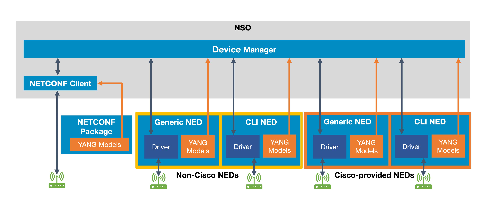
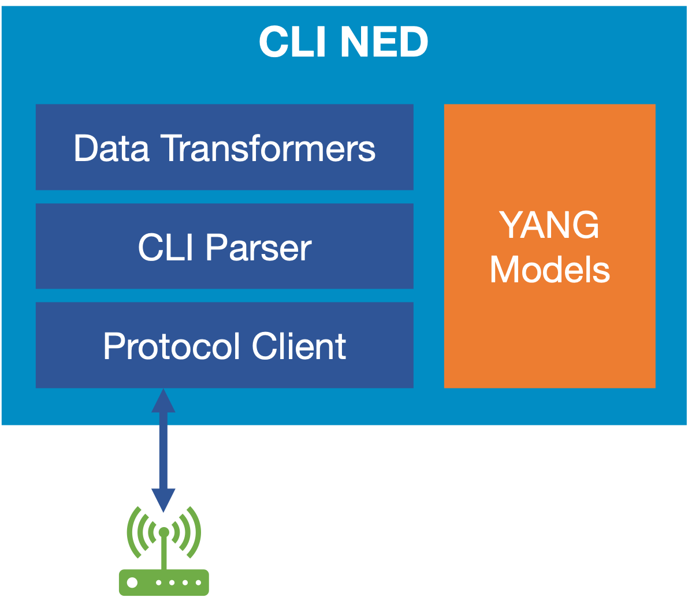
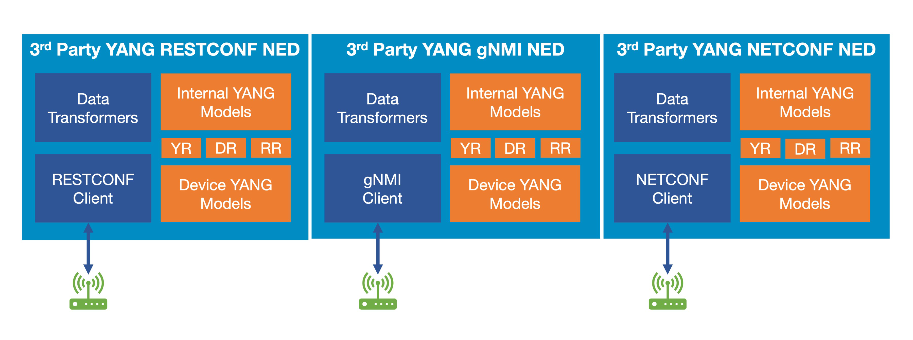

# NED Administration

This section provides necessary information on NED (Network Element Driver) administration with a focus on Cisco-provided NEDs. If you're planning to use NEDs not provided by Cisco, refer to the [NED Development](../../development/advanced-development/developing-neds/) to build your own NED packages.

NED represents a key NSO component that makes it possible for the NSO core system to communicate southbound with network devices in most deployments. NSO has a built-in client that can be used to communicate southbound with NETCONF-enabled devices. Many network devices are, however, not NETCONF-enabled, and there exist a wide variety of methods and protocols for configuring network devices, ranging from simple CLI to HTTP/REST-enabled devices. For such cases, it is necessary to use a NED to allow NSO communicate southbound with the network device.

Even for NETCONF-enabled devices, it is possible that the NSO's built-in NETCONF client cannot be used, for instance, if the devices do not strictly follow the specification for the NETCONF protocol. In such cases, one must also use a NED to seamlessly communicate with the device. See [Managing Cisco-provided third Party YANG NEDs](ned-administration.md#sec.managing\_thirdparty\_neds) for more information on third-party YANG NEDs.

## Types of NED Packages <a href="#d5e8900" id="d5e8900"></a>

A NED package is a package that NSO uses to manage a particular type of device. A NED is a piece of code that enables communication with a particular type of managed device. You add NEDs to NSO as a special kind of package, called NED packages.

A NED package must provide a device YANG model as well as define means (protocol) to communicate with the device. The latter can either leverage the NSO built-in NETCONF and SNMP support or use a custom implementation. When a package provides custom protocol implementation, typically written in Java, it is called a CLI NED or a Generic NED.

Cisco provides and supports a number of such NEDs. With these Cisco-provided NEDs, a major category are CLI NEDs which communicate with a device through its CLI instead of a dedicated API.

<figure><figcaption><p>NED Package Types</p></figcaption></figure>

### CLI NED <a href="#d5e8910" id="d5e8910"></a>

This NED category is targeted at devices that use CLI as a configuration interface. Cisco-provided CLI NEDs are available for various network devices from different vendors. Many different CLI syntaxes are supported.

The driver element in a CLI NED implemented by the Cisco NSO NED team typically consists of the following three parts:

* The protocol client, responsible for connecting to and interacting with the device. The protocols supported are SSH and Telnet.
* A fast and versatile CLI parser (+ emitter), usually referred to as the turbo parser.
* Various transform engines capable of converting data between NSO and device formats.

The YANG models in a CLI NED are developed and maintained by the Cisco NSO NED team. Usually, the models for a CLI NED are structured to mimic the CLI command hierarchy on the device.

<figure><figcaption><p>CLI NED</p></figcaption></figure>

### Generic NED <a href="#d5e8927" id="d5e8927"></a>

A generic NED is typically used to communicate with non-CLI devices, such as devices using protocols like REST, TL1, Corba, SOAP, RESTCONF, or gNMI as a configuration interface. Even NETCONF-enabled devices in many cases require a generic NED to function properly with NSO.

The driver element in a Generic NED implemented by the Cisco NED team typically consists of the following parts:

* The protocol client, responsible for interacting with the device.
* Various transform engines capable of converting data between NSO and the device formats, usually JSON and/or XML transformers.

There are two types of Generic NEDs maintained by the Cisco NSO NED team:

* NEDs with Cisco-owned YANG models. These NEDs have models developed and maintained by the Cisco NSO NED team.
* NEDs targeted at YANG models from third-party vendors, also known as, third-party YANG NEDs.

### **Generic Cisco-provided NEDs with Cisco-owned YANG Models**

Generic NEDs belonging to the first category typically handle devices that are model-driven. For instance, devices using proprietary protocols based on REST, SOAP, Corba, etc. The YANG models for such NEDs are usually structured to mimic the messages used by the proprietary protocol of the device.

<figure><figcaption><p>Generic NED</p></figcaption></figure>

### **Third-party YANG NEDs**

As the name implies, this NED category is used for cases where the device YANG models are not implemented, maintained, or owned by the Cisco NSO NED team. Instead, the YANG models are typically provided by the device vendor itself, or by organizations like IETF, IEEE, ONF, or OpenConfig.

This category of NEDs has some special characteristics that set them apart from all other NEDs developed by the Cisco NSO NED team:

* Targeted for devices supporting model-driven protocols like NETCONF, RESTCONF, and gNMI.
* Delivered from the software.cisco.com portal without any device YANG models included. There are several reasons for this, such as legal restrictions that prevent Cisco from re-distributing YANG models from other vendors, or the availability of several different version bundles for open-source YANG, like OpenConfig. The version used by the NED must match the version used by the targeted device.
* The NEDs can be bundled with various fixes to solve shortcomings in the YANG models, the download sources, and/or in the device. These fixes are referred to as recipes.

<figure><figcaption><p>Third-Party YANG NEDs</p></figcaption></figure>

Since the third-party NEDs are delivered without any device YANG models, there are additional steps required to make this category of NEDs operational:

1. The device models need to be downloaded and copied into the NED package source tree. This can be done by using a special (optional) downloader tool bundled with each third-party YANG NED, or in any custom way.
2. The NED must be rebuilt with the downloaded YANG models.

This procedure is thoroughly described in [Managing Cisco-provided third-Party YANG NEDs](ned-administration.md#sec.managing\_thirdparty\_neds).

**Recipes**

A third-party YANG NED can be bundled with up to three types of recipe modules. These recipes are used by the NED to solve various types of issues related to:

* The source of the YANG files.
* The YANG files.
* The device itself.

The recipes represent the characteristics and the real value of a third-party YANG NED. Recipes are typically adapted for a certain bundle of YANG models and/or certain device types. This is why there exist many different third-party YANG NEDs, each one adapted for a specific protocol, a specific model package, and/or a specific device.


The NSO NED team does not provide any super third-party YANG NEDs, for instance, a super RESTCONF NED that can be used with any models and any device.


**Download Recipes**

When downloading the YANG files, it is first of all important to know which source to use. In some cases, the source is the device itself. For instance, if the device is enabled for NETCONF and sometimes for RESTCONF (in rare cases).

In other cases, the device does not support model download. This applies to all gNMI-enabled devices and most RESTCONF devices too. In this case, the source can be a public Git repository or an archive file provided by the device vendor.

Another important question is what YANG models and what versions to download. To make this task easier, third-party NEDs can be bundled with the download recipes. These are presets to be used with the downloader tool bundled with the NED. There can be several profiles, each representing a preset that has been verified to work by the Cisco NSO NED team. A profile can point out a certain source to download from. It can also limit the scope of the download so that only certain YANG files are selected.

**YANG Recipes (YR)**

Third-party YANG files can often contain various types of errors, ranging from real bugs that cause compilation errors to certain YANG constructs that are known to cause runtime issues in NSO. To ensure that the files can be built correctly, the third-party NEDs can be bundled with YANG recipes. These recipes patch the downloaded YANG files before they are built by the NSO compiler. This procedure is performed automatically by the `make` system when the NED is rebuilt after downloading the device YANG files. For more information, refer to [Rebuilding the NED with a Unique NED ID](ned-administration.md#sec.rebuilding\_ned).

**Runtime Recipes (RR)**

Many devices enabled for NETCONF, RESTCONF, or gNMI sometimes deviate in their runtime behavior. This can make it impossible to interact properly with NSO. These deviations can be on any level in the runtime behavior, such as:

* The configuration protocol is not properly implemented, i.e., the device lacks support for mandatory parts of, for instance, the RESTCONF RFC.
* The device returns "dirty" configuration dumps, for instance, JSON or XML containing invalid elements.
* Special quirks are required when applying new configuration on a device. May also require additional transforms of the payload before it is relayed by the NED.
* The device has aliasing issues, possibly caused by overlapping YANG models. If leaf X in model A is modified, the device will automatically modify leaf Y in model B as well.

A third-party YANG NED can be bundled with runtime recipes to solve these kinds of issues, if necessary. How this is implemented varies from NED to NED. In some cases, a NED has a fixed set of recipes that are always used. Alternatively, a NED can support several different recipes, which can be configured through a NED setting, referred to as a runtime profile. For example, a multi-vendor third-party YANG NED might have one runtime profile for each device type supported:

```cli
admin@ncs(config)# devices device dev-1 ned-settings
onf-tapi_rc restconf profile vendor-xyz
```

### NED Settings <a href="#d5e9013" id="d5e9013"></a>

NED settings are YANG models augmented as configurations in NSO and control the behavior of the NED. These settings are augmented under:

* `/devices/global-settings/ned-settings`
* `/devices/profiles/ned-settings`
* `/devices/device/ned-settings`

Most NEDs are instrumented with a large number of NED settings that can be used to customize the device instance configured in NSO. The README file in the respective NED contains more information on these.

## Purpose of NED ID <a href="#d5e9027" id="d5e9027"></a>

Each managed device in NSO has a device type that informs NSO how to communicate with the device. When managing NEDs, the device type is either `cli` or `generic`. The other two device types, `netconf` and `snmp`, are used in NETCONF and SNMP packages and are further described in this guide.

In addition, a special NED ID identifier is needed. Simply put, this identifier is a handle in NSO pointing to the NED package. NSO uses the identifier when it is about to invoke the driver in a NED package. The identifier ensures that the driver of the correct NED package is called for a given device instance. For more information on how to set up a new device instance, see [Configuring a device with the new Cisco-provided NED](ned-administration.md#sec.config\_device.with.ciscoid).

Each NED package has a NED ID, which is mandatory. The NED ID is a simple string that can have any format. For NEDs developed by the Cisco NSO NED team, the NED ID is formatted as `<NED NAME>-<gen | cli>-<NED VERSION MAJOR>.<NED VERSION MINOR>`.

**Examples**

* `onf-tapi_rc-gen-2.0`
* `cisco-iosxr-cli-7.43`

The NED ID for a certain NED package stays the same from one version to another, as long as no backward incompatible changes have been done to the YANG models. Upgrading a NED from one version to another, where the NED ID is the same, is simple as it only requires replacing the old NED package with the new one in NSO and then reloading all packages.

Upgrading a NED package from one version to another, where the NED ID is not the same (typically indicated by a change of major or minor number in the NED version), requires additional steps. The new NED package first needs to be installed side-by-side with the old one. Then, a NED migration needs to be performed. This procedure is thoroughly described in [NED Migration](ned-administration.md#sec.ned\_migration).

The Cisco NSO NED team ensures that our CLI NEDs, as well as Generic NEDs with Cisco-owned models, have version numbers and NED ID that indicate any possible backward incompatible YANG model changes. When a NED with such an incompatible change is released, the minor digit in the version is always incremented. The case is a bit different for our third-party YANG NEDs since it is up to the end user to select the NED ID to be used. This is further described in [Managing Cisco-provided third-Party YANG NEDs](ned-administration.md#sec.managing\_thirdparty\_neds).

### NED Versioning Scheme <a href="#sec.ned_migration_version-scheme" id="sec.ned_migration_version-scheme"></a>

A NED is assigned a version number consisting of a sequence of numbers separated by dots. The first two numbers represent the major and minor version, and the third number represents the maintenance version.

For example, the number 5.8.1 indicates a maintenance release (1) for the minor release 5.8. Incompatible YANG model changes require either the major or minor version number to be changed. This means that any version within the 5.8.x series is backward compatible with the previous versions.

When a newer maintenance release with the same major/minor version replaces a NED release, NSO can perform a simple data model upgrade to handle stored instance data in the CDB (Configuration Database). This type of upgrade does not pose a risk of data loss.

However, when a NED is replaced by a new major/minor release, it becomes a NED migration. These migrations are complex because the YANG model changes can potentially result in the loss of instance data if not handled correctly.

<figure><figcaption><p>NED Version Scheme</p></figcaption></figure>

## NED Installation in NSO <a href="#sec.ned_installation_nso" id="sec.ned_installation_nso"></a>

This section describes the NED installation in NSO for Local and System installs. Consult the `README.md` supplied with the NED for the most up-to-date installation description.

### Local Install of NED in NSO <a href="#sec.local_install_ned_nso" id="sec.local_install_ned_nso"></a>

This section describes how to install a NED package on a locally installed NSO. See [Local Install Steps](../installation-and-deployment/local-install.md) for more information.

Follow the instructions below to install a NED package:

1.  Download the latest production-grade version of the NED from software.cisco.com using the URLs provided on your NED license certificates. All NED packages are files with the `.signed.bin` extension named using the following rule: `ncs-<NSO VERSION>-<NED NAME>-<NED VERSION>.signed.bin`. The NED package `ncs-6.0-cisco-iosxr-7.43.signed.bin` will be used in the example below. It is assumed the NED package has been downloaded into the directory named `/tmp/ned-package-store`. The environment variable `NSO_RUNDIR` needs to be configured to point to the NSO runtime directory. Example:

    ```cli
    > export NSO_RUNDIR=~/nso-lab-rundir
    ```
2.  Unpack the NED package and verify its signature.

    ```cli
    > cd /tmp/ned-package-store
    > chmod u+x ncs-6.0-cisco-iosxr-7.43.signed.bin
    > ./ncs-6.0-cisco-iosxr-7.43.signed.bin
    ```

    In case the signature cannot be verified (for instance, if access to internet is down), do as below instead:

    ```cli
    > ./ncs-6.0-cisco-iosxr-7.43.signed.bin --skip-verification
    ```

    \
    The result of the unpacking is a `tar.gz` file with the same name as the `.bin` file.

    ```cli
    > ls *.tar.gz
    ncs-6.0-cisco-iosxr-7.43.tar.gz
    ```
3.  Untar the `tar.gz` file. The result is a subdirectory named like `<NED NAME>-<NED MAJOR VERSION DIGIT>.<NED MINOR VERSION DIGIT>`

    ```cli
    > tar xfz ncs-6.0-cisco-iosxr-7.43.tar.gz
    > ls -d */
    cisco-iosxr-7.43
    ```
4.  Install the NED into NSO, using the `ncs-setup` tool.

    ```cli
        > ncs-setup --package cisco-iosxr-7.43 --dest $NSO_RUNDIR
    ```
5.  Finally, open an NSO CLI session and load the new NED package like below:

    ```cli
    > ncs_cli -C -u admin
    admin@ncs# packages reload
    reload-result {
    package cisco-iosxr-cli-7.43
    result true
    }
    ```

Alternatively, the `tar.gz` file can be installed directly into NSO. In this case, skip steps 3 and 4, and do as below instead:

```cli
> ncs-setup --package cisco-iosxr-7.43.tar.gz --dest $NSO_RUNDIR
```

### System Install of Cisco-provided NED in NSO <a href="#d5e9127" id="d5e9127"></a>

This section describes how to install a NED package on a system-installed NSO. See [System Install Steps](../installation-and-deployment/system-install.md) for more information.

1. Download the latest production-grade version of the NED from software.cisco.com using the URLs provided on your NED license certificates. All NED packages are files with the `.signed.bin` extension named using the following rule: `ncs-<NSO_VERSION>-<NED NAME>-<NED VERSION>.signed.bin`. The NED package `ncs-6.0-cisco-iosxr-7.43.signed.bin` will be used in the example below. It is assumed that the package has been downloaded into the directory named `/tmp/ned-package-store`.
2.  Unpack the NED package and verify its signature.

    ```cli
    > cd /tmp/ned-package-store
    > chmod u+x ncs-6.0-cisco-iosxr-7.43.signed.bin
    > ./ncs-6.0-cisco-iosxr-7.43.signed.bin
    ```

    In case the signature cannot be verified (for instance, if access to internet is down), do as below instead.

    ```cli
    > ./ncs-6.0-cisco-iosxr-7.43.signed.bin --skip-verification
    ```

    The result of the unpacking is a `tar.gz` file with the same name as the `.bin` file.

    ```cli
    > ls *.tar.gz
    ncs-6.0-cisco-iosxr-7.43.tar.gz
    ```
3.  Perform an NSO backup before installing the new NED package.

    ```cli
    > $NCS_DIR/bin/ncs-backup
    ```
4.  Start an NSO CLI session.

    ```cli
    > ncs_cli -C -u admin
    ```
5.  Fetch the NED package.

    ```cli
    admin@ncs# software packages fetch package-from-file
        /tmp/ned-package-store/ncs-6.0-cisco-iosxr-7.43.tar.gz
    admin@ncs# software packages list
      package {
         name ncs-6.0-cisco-iosxr-7.43.tar.gz
         installable
     }
    ```
6.  Install the NED package (add the argument **replace-existing** if a previous version has been loaded).

    ```cli
    admin@ncs# software packages install cisco-iosxr-7.43
    admin@ncs# software packages list
      package {
         name ncs-6.0-cisco-iosxr-7.43.tar.gz
         installed
      }
    ```
7.  Finally, load the NED package.

    ```cli
    admin@ncs# packages reload
    admin@ncs# software packages list
      package {
         name cisco-iosxr-cli-7.43
         loaded
     }
    ```

## Configuring a device with the new Cisco-provided NED <a href="#sec.config_device.with.ciscoid" id="sec.config_device.with.ciscoid"></a>

The basic steps for configuring a device instance using the newly installed NED package are described in this section. Only the most basic configuration steps are covered here.

Many NEDs require additional custom configuration to be operational. This applies in particular to Generic NEDs. Information about such additional configuration can be found in the files `README.md` and `README-ned-settings.md` bundled with the NED package.

The following info is necessary to proceed with the basic setup of a device instance in NSO:

* NED ID of the new NED.
* Connection information for the device to connect to (address and port).
* Authentication information to the device (username and password).

### CLI NED Setup <a href="#sec.cli_ned_setup" id="sec.cli_ned_setup"></a>

For CLI NEDs, it is mandatory to specify the protocol to be used, either SSH or Telnet.

The following values will be used for this example:

* NED ID: `cisco-iosxr-cli-7.43`
* Address: `10.10.1.1`
* Port: `22`
* Protocol: `ssh`
* User: `cisco`
* Password: `cisco`

Do the CLI NED setup as below:

1.  Start an NSO CLI session.

    ```cli
    > ncs_cli -C -u admin
    ```
2.  Enter the configuration mode.

    ```cli
    admin@ncs# configure
    Entering configuration mode terminal
    admin@ncs(config)#
    ```
3.  Configure a new authentication group to be used for this device.

    ```cli
    admin@ncs(config)# devices authgroup my-xrgroup default-map
    remote-name cisco remote-password cisco
    ```
4.  Configure the new device instance.

    ```cli
    admin@ncs(config)# devices device xrdev-1 address 10.10.1.1
    admin@ncs(config)# devices device xrdev-1 port 22
    admin@ncs(config)# devices device xrdev-1 device-type cli ned-id cisco-iosxr-cli-7.43 protocol ssh
    admin@ncs(config)# devices device xrdev-1 state admin-state unlocked
    admin@ncs(config)# devices device xrdev-1 authgroup my-xrgroup
    ```
5. Next, check the `README.md` and `README-ned-settings.md` bundled with the NED package for further information on additional settings to make the NED fully operational.
6.  Finally, commit the configuration.

    ```cli
    admin@ncs(config)# commit
    ```

    In the case of SSH, run also:

    ```cli
    admin@ncs(config)# devices device xrdev-1 ssh fetch-host-keys
    ```

### Cisco-provided Generic NED Setup <a href="#sec.cisco_generic_ned_setup" id="sec.cisco_generic_ned_setup"></a>

This example shows a simple setup of a generic NED.

The following values will be used for this example:

* NED ID: `onf-tapi_rc-gen-2.0`
* Address: `10.10.1.2`
* Port: `443`
* User: `admin`
* Password: `admin`

Do the Generic NED setup as below:

1.  Start an NSO CLI session.

    ```cli
    > ncs_cli -C -u admin
    ```
2.  Enter the configuration mode.

    ```cli
    admin@ncs# configure
    Entering configuration mode terminal
    admin@ncs(config)#
    ```
3.  Configure a new authentication group to be used for this device.

    ```cli
    admin@ncs(config)# devices authgroup my-tapigroup default-map remote-name admin
    remote-password admin
    ```
4.  Configure the new device instance.

    ```cli
    admin@ncs(config)# devices device tapidev-1 address 10.10.1.2
    admin@ncs(config)# devices device tapidev-1 port 443
    admin@ncs(config)# devices device tapidev-1 device-type generic ned-id onf-tapi_rc-gen-2.0
    admin@ncs(config)# devices device tapidev-1 state admin-state unlocked
    admin@ncs(config)# devices device tapidev-1 authgroup my-tapigroup
    ```
5. Next, check the `README.md` and `README-ned-settings.md` bundled with the NED package for further information on additional settings to make the NED fully operational.
6.  Finally, commit the configuration.

    ```cli
    admin@ncs(config)# commit
    ```

## Managing Cisco-provided third Party YANG NEDs <a href="#sec.managing_thirdparty_neds" id="sec.managing_thirdparty_neds"></a>

The third-party YANG NED type is a special category of the generic NED type targeted for devices supporting protocols like NETCONF, RESTCONF, and gNMI. As the name implies, this NED category is used for cases where the device YANG models are not implemented or maintained by the Cisco NSO NED Team. Instead, the YANG models are typically provided by the device vendor itself or by organizations like IETF, IEEE, ONF, or OpenConfig.

A third-party YANG NED package is delivered from the software.cisco.com portal without any device YANG models included. It is required that the models are first downloaded, followed by a rebuild and reload of the package, before the NED can become fully operational. This task needs to be performed by the NED user.

### Downloading with the NED Built-in Download Tool <a href="#sec.ned_download_tool" id="sec.ned_download_tool"></a>

This section gives a brief instruction on how to download the device YANG models using the special downloader tool that is bundled with each third-party YANG NED. Each specific NED can contain specific requirements regarding downloading/rebuilding. Before proceeding, check the file `README-rebuild.md` bundled with the NED package. Furthermore, it is recommended to use a non-production NSO environment for this task.

1. Download and install the third-party YANG NED package into NSO, see [Local Install of NED in NSO](ned-administration.md#sec.local\_install\_ned\_nso).
2. Configure a device instance using as usual. See [Cisco-provided Generic NED Setup](ned-administration.md#sec.cisco\_generic\_ned\_setup) for more information. The device name `dev-1` will be used in this example.
3.  Open an NCS CLI session (non-configure mode).

    ```cli
    > ncs_cli -C -u admin
    ```
4.  The installed NED is now basically empty. It contains no YANG models except some used by the NED internally. This can be verified with the following CLI commands:

    ```cli
    admin@ncs# devices device dev-1 connect
    result true
    info (admin) Connected to dev-1 - 127.0.0.1:7888
    admin@ncs# show devices device dev-1 module
    NAME                         REVISION    FEATURE  DEVIATION
    -------------------------------------------------------------
    ietf-restconf-monitoring     2017-01-26  -        -
    tailf-internal-rpcs          2022-07-08  -        -
    tailf-ned-onf-tapi_rc-stats  2022-10-17  -        -
    ```
5.  The built-in downloader tool consists of a couple of NSO RPCs defined in one of the NED internal YANG files.

    ```cli
    admin@ncs# devices device dev-1 rpc ?
    Possible completions:
    rpc-get-modules  rpc-list-modules  rpc-list-profiles  rpc-show-default-local-dir
    ```
6.  Start with checking the default local directory. This directory will be used as a target for the device YANG models to be downloaded.

    ```cli
    admin@ncs# devices device dev-1 rpc rpc-show-default-local-dir show-default-local-dir
    result /nso-lab-rundir/packages/onf-tapi_rc-2.0/src/yang
    admin@ncs#
    ```

    This RPC will throw an error if the NED package was installed directly using the `tar.gz` file. See [NED Installation in NSO](ned-administration.md#sec.ned\_installation\_nso) for more information.

    ```cli
    admin@ncs# devices device dev-1 rpc rpc-show-default-local-dir show-default-local-dir
    Error: External error in the NED implementation for device nokia-srlinux-1: default
        local directory does not exist (/nso-lab-rundir/packages/onf-tapi_rc-2.0/src/yang)
    admin@ncs#
    ```

    \
    If this error occurs, it is necessary to unpack the NED package in some other directory and use that as a target for the download. In the example below it is `/tmp/ned-package-store/onf-tapi_rc-2.0/src/yang`.

    ```cli
    > cd /tmp/ned-package-store
    > chmod u+x ncs-6.0-onf-tapi_rc-2.0.3.signed.bin
    > ./ncs-6.0-onf-tapi_rc-2.0.3.signed.bin
    > tar xfz ncs-6.0-onf-tapi_rc-2.0.3.tar.gz
    > ls -d */
    onf-tapi_rc-2.0
    ```
7.  Continue with listing the models supported by the connected device.

    ```cli
    admin@ncs# devices device netsim-0 rpc rpc-list-modules list-modules
    module {
        name tapi-common
        revision 2020-04-23
        namespace urn:onf:otcc:yang:tapi-common
        schema https://localhost:7888/restconf/tailf/modules/tapi-common/2020-04-23
    }
    module {
        name tapi-connectivity
        revision 2020-06-16
        namespace urn:onf:otcc:yang:tapi-connectivity
        schema https://localhost:7888/restconf/tailf/modules/tapi-connectivity/2020-06-16
    }
    module {
        name tapi-dsr
        revision 2020-04-23
        namespace urn:onf:otcc:yang:tapi-dsr
        schema https://localhost:7888/restconf/tailf/modules/tapi-dsr/2020-04-23
    }
    module {
        name tapi-equipment
        revision 2020-04-23
        namespace urn:onf:otcc:yang:tapi-equipment
        schema https://localhost:7888/restconf/tailf/modules/tapi-equipment/2020-04-23
    }

    ...
    ```

    \
    The size of the displayed list is device-dependent and so is the level of detail in each list entry. The only mandatory field is the `name`. Furthermore, not all devices are actually capable of advertising the models supported. If the currently connected device lacks this support, it is usually emulated by the NED instead. Check the `README-rebuild.md` for more information regarding this.
8.  Next, list the download profiles currently supported by the device.

    ```cli
    admin@ncs# devices device dev-1 rpc rpc-list-profiles list-profiles
    profile {
        name onf-tapi-from-device
        description Download the ONF TAPI YANG models. Download is done directly from device.
    }
    profile {
        name onf-tapi-from-git
        description Download the ONF TAPI YANG models. Download is done from the ONF TAPI github repo.
    }
    profile {
        name onf-tapi
        description Download the ONF TAPI YANG models. Download source must be specified explicitly.
    }
    ```

    \
    A download profile is a preset for the built-in download tool. Its purpose is to make the download procedure as easy as possible. A profile can, for instance, define a certain source from where the device YANG models will be downloaded. Another usage can be to limit the scope of the YANG files to download. For example, one profile to download the native device models, and another for the OpenConfig models. All download profiles are defined and verified by the Cisco NSO NED team. There is usually at least one profile available, otherwise, check the `README-rebuild.md` bundled in the NED package.
9.  Finally, try downloading the YANG models using a profile. In case a non-default local directory is used as a target, it must be explicitly specified.

    ```cli
    admin@ncs# devices device dev-1 rpc rpc-get-modules get-modules profile
    onf-tapi-from-device local-dir /tmp/ned-package-store/onf-tapi_rc-2.0/src/yang
    ```

    \
    In case the default local directory is used, no further arguments are needed.

    ```cli
    admin@ncs# devices device dev-1 rpc rpc-get-modules get-modules profile onf-tapi-from-device
    ```

    \
    The tool will output a list with each file downloaded. It automatically scans each YANG file for dependencies and tries to download them as well.

    ```
    result
    Fetching modules:
      tapi-common - urn:onf:otcc:yang:tapi-common (32875 bytes)
      tapi-connectivity - urn:onf:otcc:yang:tapi-connectivity (40488 bytes)
        fetching imported module tapi-path-computation
        fetching imported module tapi-topology
      tapi-dsr - urn:onf:otcc:yang:tapi-dsr (11172 bytes)
      tapi-equipment - urn:onf:otcc:yang:tapi-equipment (33406 bytes)
      tapi-eth - urn:onf:otcc:yang:tapi-eth (93152 bytes)
        fetching imported module tapi-oam
      tapi-notification - urn:onf:otcc:yang:tapi-notification (23864 bytes)
      tapi-oam - urn:onf:otcc:yang:tapi-oam (30409 bytes)
      tapi-odu - urn:onf:otcc:yang:tapi-odu (45327 bytes)
      tapi-path-computation - urn:onf:otcc:yang:tapi-path-computation (19628 bytes)
      tapi-photonic-media - urn:onf:otcc:yang:tapi-photonic-media (52848 bytes)
      tapi-topology - urn:onf:otcc:yang:tapi-topology (43357 bytes)
      tapi-virtual-network - urn:onf:otcc:yang:tapi-virtual-network (13278 bytes)
    fetched and saved 12 yang module(s) to /tmp/ned-package-store/onf-tapi_rc-2.0/src/yang
    ```
10. Verify that the downloaded files have been stored properly in the configured target directory.

    ```cli
    > ls -l /tmp/ned-package-store/onf-tapi_rc-2.0/src/yang
    total 616
    -rw-r--r-- 1 nso-user staff 109607 Nov 11 13:15 tailf-common.yang
    -rw-r--r-- 1 nso-user staff  32878 Nov 11 13:15 tapi-common.yang
    -rw-r--r-- 1 nso-user staff  40503 Nov 11 13:15 tapi-connectivity.yang
    -rw-r--r-- 1 nso-user staff  11172 Nov 11 13:15 tapi-dsr.yang
    -rw-r--r-- 1 nso-user staff  33406 Nov 11 13:15 tapi-equipment.yang
    -rw-r--r-- 1 nso-user staff  93152 Nov 11 13:15 tapi-eth.yang
    -rw-r--r-- 1 nso-user staff  23864 Nov 11 13:15 tapi-notification.yang
    -rw-r--r-- 1 nso-user staff  30409 Nov 11 13:15 tapi-oam.yang
    -rw-r--r-- 1 nso-user staff  45327 Nov 11 13:15 tapi-odu.yang
    -rw-r--r-- 1 nso-user staff  19628 Nov 11 13:15 tapi-path-computation.yang
    -rw-r--r-- 1 nso-user staff  52848 Nov 11 13:15 tapi-photonic-media.yang
    -rw-r--r-- 1 nso-user staff  43357 Nov 11 13:15 tapi-topology.yang
    -rw-r--r-- 1 nso-user staff  13281 Nov 11 13:15 tapi-virtual-network.yang
    ```

### Rebuilding NED with Downloaded YANG Files <a href="#sec.rebuilding_ned_with_downloaded_yang" id="sec.rebuilding_ned_with_downloaded_yang"></a>

The NED must be rebuilt when the device YANG models have been downloaded and stored properly. Compiling third-party YANG files is often combined with various types of issues caused by bad or odd YANG constructs. Such issues typically cause compiler errors or unwanted runtime errors in NSO. A third-party YANG NED is configured to take care of all currently known build issues. It will automatically patch the problematic files such that they build properly for NSO. This is done using a set of YANG build recipes bundled with the NED package.


Adapting the YANG build recipes is a continuous process. If new issues are found, the Cisco NED team updates the recipes accordingly and releases a new version of the NED.

It is strongly recommended that end users report newly found YANG build issues to the Cisco NSO NED team through a support request.


Before rebuilding the NED, it is important to know the path to the target directory used for the downloaded YANG files. This is the same as the local directory if the built-in NED downloader tool was used, see [Downloading with the NED Built-in Download Tool](ned-administration.md#sec.ned\_download\_tool).

This example uses the environment variable `NED_YANG_TARGET_DIR` to represent the target directory.

To rebuild the NED with the downloaded YANG file:

1.  Enter the NED build directory, which is the parent directory to the target directory.

    ```cli
    > echo $NED_YANG_TARGET_DIR
    /tmp/ned-package-store/onf-tapi_rc-2.0/src/yang
    > cd $NED_YANG_TARGET_DIR/..
    ```
2.  Run the `make clean all` command. The output from the **make** command can be massive, depending on the number of YANG files, etc. After this step, the NED is rebuilt with the device YANG models included. Lines like below indicate that the NED has applied a number of YANG recipes (patches) to solve known issues with the YANG files:

    ```cli
    > make clean all
    ======== RUNNING YANG PRE-PROCESSOR (YPP) WITH THE FOLLOWING VARIABLES:
    tools/ypp  --var NCS_VER=6.0  --var NCS_VER_NUMERIC=6000000
        --var SUPPORTS_CDM=YES  --var SUPPORTS_ROLLBACK_FILES_OCTAL=YES
        --var SUPPORTS_SHOW_STATS_PATH=YES \
             \
            --from=' NEDCOM_SECRET_TYPE' --to=' string' \
            'tmp-yang/*.yang'
    touch tmp-yang/ypp_ned

    ======== REMOVE PRESENCE STATEMENT ON CONTEXT TOP CONTAINER
    tools/ypp --from="(presence \"Root container)" \
               --to="//\g<1>" \
            'tmp-yang/tapi-common.yang'

    ======== ADDING EXTRA ENUM WITH CORRECT SPELLING: NO_PROTECTION
    tools/jypp --add-stmt=/typedef#protection-type/type::"enum NO_PROTECTION;" \
            'tmp-yang/tapi-topology.yang' || true

    ======== ADDING EXTRA IDENTITIES USED BY CERTAIN TAPI DEVICES
    tools/jypp --add-stmt=/::"identity DIGITAL_SIGNAL_TYPE_400GBASE-R {  base DIGITAL_SIGNAL_TYPE; }" \
                --add-stmt=/::"identity DIGITAL_SIGNAL_TYPE_GigE_CONV {  base DIGITAL_SIGNAL_TYPE; }" \
                --add-stmt=/::"identity DIGITAL_SIGNAL_TYPE_ETHERNET {  base DIGITAL_SIGNAL_TYPE; }" \
            'tmp-yang/tapi-dsr.yang' || true
    ```

### Reloading the NED Package into NSO <a href="#d5e9426" id="d5e9426"></a>

This is the final step to make a third-party YANG NED operational. If the NED built-in YANG downloader tool was used together with no `local-dir` argument specified (i.e., the default), the only thing required is a package reload in NSO, which you can do by running the **packages reload** or the **packages add** command.

```cli
> ncs_cli -C -u admin
admin@ncs# packages reload

>>> System upgrade is starting.
>>> Sessions in configure mode must exit to operational mode.
>>> No configuration changes can be performed until upgrade has completed.
>>> System upgrade has completed successfully.
reload-result {
    package onf-tapi_rc-gen-2.0
    result true
}
admin@ncs#
```

If another target directory was used for the YANG file download, it is necessary to first do a proper re-install of the NED package. See [NED Installation in NSO](ned-administration.md#sec.ned\_installation\_nso).

### Rebuilding the NED with a Unique NED ID <a href="#sec.rebuilding_ned" id="sec.rebuilding_ned"></a>

A common use case is to have many different versions of a certain device type in the network. All devices can be managed by the same third-party YANG NED. However, each device will likely have its unique set of YANG files (or versions) which this NED has to be rebuilt for.

To set up NSO for this kind of scenario, some additional steps need to be taken:

* Each flavor of the NED needs to be built in a separate source directory, i.e., untar the third-party YANG NED package at multiple locations.
* Each flavor of the re-built NED must have its own unique NED-ID. This will make NSO allow multiple versions of the same NED package to co-exist.

The default NED ID for a third-party YANG NED typically looks like this: `<NED NAME>-gen-<NED VERSION MAJOR DIGIT>.<NED VERSION MINOR DIGIT>`

The NED build system allows for a customized NED ID by setting one or several of three make variables in any combination when rebuilding the NED:

* `NED_ID_SUFFIX`
* `NED_ID_MAJOR`
* `NED_ID_MINOR`

Do as follows to build each flavor of the third-party YANG NED. Do it in iterations, one at a time:

1. Unpack the empty NED package as described in [NED Installation in NSO](ned-administration.md#sec.ned\_installation\_nso).
2.  Unpack the NED package again in a separate location. Rename the NED directory to something unique.

    ```cli
    > cd /tmp/ned-package-store
    > chmod u+x ncs-6.0-onf-tapi_rc-2.0.3.signed.bin
    > ./ncs-6.0-onf-tapi_rc-2.0.3.signed.bin
    > tar xfz ncs-6.0-onf-tapi_rc-2.0.3.tar.gz
    > ls -d */
    onf-tapi_rc-2.0
    > mv onf-tapi_rc-2.0 onf-tapi_rc-2.0-variant-1
    ```
3. Configure a device instance using the installed NED, as described in [Cisco-provided Generic NED Setup](ned-administration.md#sec.cisco\_generic\_ned\_setup). Configure it to connect to the first variant of the device.
4.  Follow the instructions in [Downloading with the NED Built-in Download Tool](ned-administration.md#sec.ned\_download\_tool) to download the YANG files. Configure `local-dir` to point to the location configured in [Rebuilding NED with Downloaded YANG Files](ned-administration.md#sec.rebuilding\_ned\_with\_downloaded\_yang).

    ```cli
    > ncs_cli -C -u admin
    admin@ncs# devices device dev-1 rpc rpc-get-modules get-modules profile
    onf-tapi-from-device local-dir /tmp/ned-package-store/onf-tapi_rc-2.0-variant-1/src/yang
    ```
5.  Rebuild a NED package from the location configured in [Rebuilding NED with Downloaded YANG Files](ned-administration.md#sec.rebuilding\_ned\_with\_downloaded\_yang). Use a suitable combination of the `NED_ID_SUFFIX`, `NED_ID_MAJOR`, `NED_ID_MINOR`.

    \
    Example 1:

    ```cli
    > make clean all NED_ID_SUFFIX=_tapi_v2.1.3
    ```

    \
    This will result in the NED ID: `onf-tapi_rc_tapi_v2.1.3-gen-2.0`.

    \
    Example 2:

    ```cli
    > make clean all NED_ID_MAJOR=2 NED_ID_MINOR=1.3
    ```

    \
    This will result in the NED ID: `onf-tapi_rc-gen-2.1.3`.
6.  Install the newly built NED package into NSO, side-by-side with the original NED package. See [Configuring a Device with the New Cisco-provided NED](ned-administration.md#sec.config\_device.with.ciscoid) for further information.

    \
    Example:

    ```cli
    > cd /tmp/ned-package-store
    > tar cfz onf-tapi_rc-2.0-variant-1.tar.gz onf-tapi_rc-2.0-variant-1
    > ncs-setup --package onf-tapi_rc-2.0-variant-1.tar.gz --dest $NSO_RUNDIR
    > ncs_cli -C -u admin
    admin@ncs# packages reload
    ```
7. Configure a new device instance using the newly installed NED package. Configure it to connect to the first variant of the device, as done in step 3.
8. Verify functionality by executing a `sync-from` on the configured device instance.

### Upgrading a Cisco-provided Third Party YANG NED to a Newer Version <a href="#sec.ned_mgmt.third_party" id="sec.ned_mgmt.third_party"></a>

The NSO procedure to upgrade a NED package to a newer version uses the following approach:

* If there are no backward incompatible changes in the schemas (YANG models) of respective NEDs, simply replace the old NED with the new one and reload all packages in NSO.
* In case there are backwards incompatible changes present in the schemas, some administration is required: the new NED needs to be installed side-by-side with the old NED, after which a NED migration must be performed to properly update the data in CDB using the new schemas. More information about NED migration is available in [NED Migration](ned-administration.md#sec.ned\_migration).

Whether or not there are backward incompatible differences present between two versions of the same NED, is determined by the NED ID. If the versions have the same NED ID, they are fully compatible; otherwise, the NED IDs will differ, typically indicated by the major and/or minor number in the NED ID.

The third-party YANG NEDs add some extra complexity to the NED migration feature. This is because the device YANG models are not included in the NED package. It is up to the end user to select the YANG model versions to use and also to configure the NED ID. If the same NED, at a later stage, needs to be upgraded and rebuilt with newer versions of the YANG model, a decision has to be made regarding the NED ID: Is it safe to use the same NED ID, or should a new one be used?

Using a unique NED ID for each NED package is always the safe option. It minimizes the risk of data loss during package upgrade, etc. However, in some cases, it might be beneficial to use the same NED ID when upgrading a NED package since it minimizes the administration in NSO, i.e., simply replace the old NED package with the new one without any need of NED migration.

This kind of use case can occur when the firmware is upgraded on an NSO-controlled device. For example, assume that we have an optical device that supports the TAPI YANG models from the Open Networking Foundation. Current firmware supports version 2.1.3 of the TAPI bundle. The third-party YANG NED `onf-tapi_rc` has been rebuilt accordingly with TAPI version 2.1.3 and the default NED ID `onf-tapi_rc-gen-2.0`. This NED package is installed in NSO and a device instance named `dev-1` is configured using it. Next, the optical device is upgraded with the new firmware that supports the TAPI bundle version 2.3.1 instead. The `onf-tapi_rc` NED needs to be upgraded accordingly. The question is what NED ID to use?

To upgrade a Cisco-provided third-party YANG NED to a newer version:

1.  Unpack a fresh copy of the `onf-tapi_rc` NED package.

    ```cli
    > cd /tmp/ned-package-store
    > chmod u+x ncs-6.0-onf-tapi_rc-2.0.3.signed.bin
    > ./ncs-6.0-onf-tapi_rc-2.0.3.signed.bin
    > tar xfz ncs-6.0-onf-tapi_rc-2.0.3.tar.gz
    > ls -d */
    onf-tapi_rc-2.0
    > mv onf-tapi_rc-2.0 onf-tapi_rc-2.0-for-new-firmware
    ```
2.  Download the TAPI models v2.3.1 from the TAPI public Git repository.

    ```cli
    > ncs_cli -C -u admin
    admin@ncs# devices device dev-1 rpc rpc-get-modules get-modules
            profile onf-tapi-from-git remote { git { checkout v2.3.1 } }
            local-dir /tmp/ned-package-store/onf-tapi_rc-2.0-new-firmware/src/yang
    ```
3.  Rebuild the NED package with a temporary unique NED ID for this rebuild. Any unique NED ID works for this.

    ```cli
    > cd /tmp/ned-package-store/onf-tapi_rc-2.0-for-new-firmware/src/yang
    > make clean all NED_ID_MAJOR=2 NED_ID_MINOR=3.1
    ```

    \
    This will generate the NED ID: `onf-tapi_rc-gen-2.3.1`.
4.  Install the new `onf-tapi_rc` NED package into NSO, side by side with the old one.

    ```cli
    > cd /tmp/ned-package-store
    > tar cfz onf-tapi_rc-2.0-variant-1.tar.gz onf-tapi_rc-2.0-variant-1
    > ncs-setup --package onf-tapi_rc-2.0-variant-1.tar.gz --dest $NSO_RUNDIR
    > ncs_cli -C -u admin
    admin@ncs# packages reload

    >>> System upgrade is starting.
    >>> Sessions in configure mode must exit to operational mode.
    >>> No configuration changes can be performed until upgrade has completed.
    >>> System upgrade has completed successfully.
    reload-result {
        package onf-tapi_rc-gen-2.0
        result true
    }
    reload-result {
        package onf-tapi_rc-gen-2.3.1
        result true
    }
    ```
5.  Now, execute a dry run of the NSO NED migration feature. This command generates a list of all schema differences found between the two packages, like below:

    ```cli
    admin@ncs# devices device dev-1 migrate new-ned-id onf-tapi_rc-gen-2.3.1 dry-run

    modified-path {
        path /tapi-common:context/tapi-virtual-network:virtual-network-context/
            virtual-nw-service/vnw-constraint/service-layer
        info leaf-list type stack has changed
        backward-compatible false
    }
    modified-path {
        path /tapi-common:context/tapi-virtual-network:virtual-network-context/
            virtual-nw-service/vnw-constraint/requested-capacity/bandwidth-profile
        info sub-tree has been deleted
        backward-compatible false
    }
    modified-path {
        path /tapi-common:context/tapi-virtual-network:virtual-network-context/
            virtual-nw-service/vnw-constraint/latency-characteristic/queing-latency-characteristic
        info sub-tree has been deleted
        backward-compatible false
    }
    modified-path {
        path /tapi-common:context/tapi-virtual-network:virtual-network-context/
            virtual-nw-service/vnw-constraint
        info min/max has been relaxed
        backward-compatible true
    }
    modified-path {
        path /tapi-common:context/tapi-virtual-network:virtual-network-context/
            virtual-nw-service/vnw-constraint
        info list key has changed; leaf 'local-id' has changed type
        backward-compatible false
    }
    modified-path {
        path /tapi-common:context/tapi-virtual-network:virtual-network-context/
            virtual-nw-service/layer-protocol-name
        info node is no longer mandatory
        backward-compatible true
    }
    modified-path {
        path /tapi-common:context/tapi-virtual-network:virtual-network-context/
            virtual-nw-service/layer-protocol-name
        info leaf-list type stack has changed
        backward-compatible false
    }
    ```

    \
    If the goal is to rebuild the new NED package again using the same NED ID as the old NED package, there are two things to look out for in the list:

    1. Does the list contain any items with backward-compatible false?
    2. If the answer is yes, is the affected schema node relevant for any use case, i.e., referenced by any service code running in NSO?

    Any item listed as backward-compatible false can potentially result in data loss if the old NED is simply replaced with the new one. This might however be acceptable if the affected schema node is not relevant for any use case.

## NED Migration <a href="#sec.ned_migration" id="sec.ned_migration"></a>

If you upgrade a managed device (such as installing a new firmware), the device data model can change in a significant way. If this is the case, you usually need to use a different and newer NED with an updated YANG model.

When the changes in the NED are not backward compatible, the NED is assigned a new ned-id to avoid breaking existing code. On the plus side, this allows you to use both versions of the NED at the same time, so some devices can use the new version and some can use the old one. As a result, there is no need to upgrade all devices at the same time. The downside is, NSO doesn't know the two NEDs are related and will not perform any upgrade on its own due to different ned-ids. Instead, you must manually change the NED of a managed device through a NED migration.


For third-party NEDs, the end user is required to configure the NED ID and also be aware of the backward incompatibilities. See [Upgrading a Cisco-provided Third Party YANG NED to a Newer Version](ned-administration.md#sec.ned\_mgmt.third\_party) for an example.


Migration is required when upgrading a NED and the NED-ID changes, which is signified by a change in either the first or the second number in the NED package version. For example, if you're upgrading the existing `router-nc-1.0.1` NED to `router-nc-1.2.0` or `router-nc-2.0.2`, you must perform NED migration. On the other hand, upgrading to `router-nc-1.0.2` or `router-nc-1.0.3` retains the same ned-id and you can upgrade the `router-1.0.1` package in place, directly replacing it with the new one. However, note that some third-party, non-Cisco packages may not adhere to this standard versioning convention. In that case, you must check the ned-id values to see whether migration is needed.

<figure><figcaption><p>Sample NED Package Versioning</p></figcaption></figure>

A potential issue with a new NED is that it can break an existing service or other packages that rely on it. To help service developers and operators verify or upgrade the service code, NSO provides additional options of migration tooling for identifying the paths and service instances that may be impacted. Therefore, ensure that all the other packages are compatible with the new NED before you start migrating devices.

To prepare for the NED migration process, first, load the new NED package into NSO with either `packages reload` or `packages add` command. Then, use the `show packages` command to verify that both NEDs, the new and the old, are present. Finally, you may perform the migration of devices either one by one or multiple at a time.

Depending on your operational policies, this may be done during normal operations and does not strictly require a maintenance window, as the migration only reads from and doesn't write to a network device. Still, it is recommended that you create an NSO backup before proceeding.

Note that changing a ned-id also affects device templates if you use them. To make existing device templates compatible with the new ned-id, you can use the `copy` action. It will copy the configuration used for one ned-id to another, as long as the schema nodes used haven't changed between the versions. The following example demonstrates the `copy` action usage:

```cli
admin@ncs(config)# devices template acme-ntp ned-id router-nc-1.0
copy ned-id router-nc-1.2
```

For individual devices, use the `/devices/device/migrate` action, with the `new-ned-id` parameter. Without additional options, the command will read and update the device configuration in NSO. As part of this process, NSO migrates all the configuration and service meta-data. Use the `dry-run` option to see what the command would do and `verbose` to list all impacted service instances.

You may also use the `no-networking` option to prevent NSO from generating any southbound traffic towards the device. In this case, only the device configuration in the CDB is used for the migration but then NSO can't know if the device is in sync. Afterward, you must use the **compare-config** or the **sync-from** action to remedy this.

For migrating multiple devices, use the `/devices/migrate` action, which takes the same options. However, with this action, you must also specify the `old-ned-id`, which limits the migration to devices using the old NED. You can further restrict the action with the `device` parameter, selecting only specific devices.

It is possible for a NED migration to fail if the new NED is not entirely backward compatible with the old one and the device has an active configuration that is incompatible with the new NED version. In such cases, NSO will produce an error with the YANG constraint that is not satisfied. Here, you must first manually adjust the device configuration to make it compatible with the new NED, and then you can perform the migration as usual.

Depending on what changes are introduced by the migration and how these impact the services, it might be good to `re-deploy` the affected services before removing the old NED package. It is especially recommended in the following cases:

* When the service touches a list key that has changed. As long as the old schema is loaded, NSO is able to perform an upgrade.
* When a namespace that was used by the service has been removed. The service diffset, that is, the recorded configuration changes created by the service, will no longer be valid. The diffset is needed for the correct `get-modifications` output, `deep-check-sync`, and similar operations.

## Revision Merge Functionality <a href="#d5e9642" id="d5e9642"></a>

The YANG modeling language supports the notion of a module `revision`. It allows users to distinguish between different versions of a module, so the module can evolve over time. If you wish to use a new revision of a module for a managed device, for example, to access new features, you generally need to create a new NED.

When a model evolves quickly and you have many devices that require the use of a lot of different revisions, you will need to maintain a high number of NEDs, which are mostly the same. This can become especially burdensome during NSO version upgrades, when all NEDs may need to be recompiled.

When a YANG module is only updated in a backward-compatible way (following the upgrade rules in RFC6020 or RFC7950), the NSO compiler, `ncsc`, allows you to pack multiple module revisions into the same package. This way, a single NED with multiple device model revisions can be used, instead of multiple NEDs. Based on the capabilities exchange, NSO will then use the correct revision for communication with each device.

However, there is a major downside to this approach. While the exact revision is known for each communication session with the managed device, the device model in NSO does not have that information. For that reason, the device model always uses the latest revision. When pushing configuration to a device that only supports an older revision, NSO silently drops the unsupported parts. This may have surprising results, as the NSO copy can contain configuration that is not really supported on the device. Use the `no-revision-drop` commit parameter when you want to make sure you are not committing config that is not supported by a device.

If you still wish to use this functionality, you can create a NED package with the `ncs-make-package --netconf-ned` command as you would otherwise. However, the supplied source YANG directory should contain YANG modules with different revisions. The files should follow the _`module-or-submodule-name`_`@`_`revision-date`_`.yang` naming convention, as specified in the RFC6020. Some versions of the compiler require you to use the `--no-fail-on-warnings` option with the `ncs-make-package` command or the build process may fail.

The [examples.ncs/device-management/ned-yang-revision](https://github.com/NSO-developer/nso-examples/tree/6.4/device-management/ned-yang-revision) example shows how you can perform a YANG model upgrade. The original, 1.0 version of the router NED uses the `router@2020-02-27.yang` YANG model. First, it is updated to the version 1.0.1 `router@2020-09-18.yang` using a revision merge approach. This is possible because the changes are backward-compatible.

In the second part of the example, the updates in `router@2022-01-25.yang` introduce breaking changes, therefore the version is increased to 1.1 and a different NED-ID is assigned to the NED. In this case, you can't use revision merge and the usual NED migration procedure is required.
