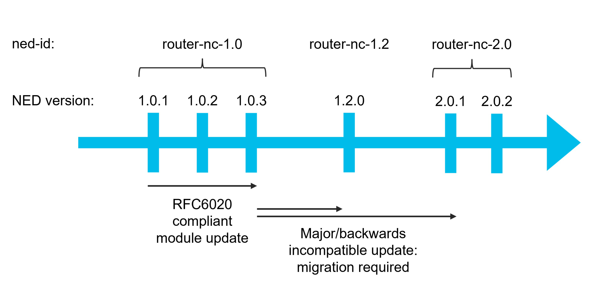

# NED Administration

This section provides necessary information on Network Element Driver (NED) administration with a focus on Cisco-provided NEDs. If you're planning to use NEDs not provided by Cisco, refer to the [NED Development](../../development/advanced-development/developing-neds/) to build your own NED packages.

## NED Introduction

NED represents a key NSO component that makes it possible for the NSO core system to communicate southbound with network devices in most deployments. NSO has a built-in client that can be used to communicate southbound with NETCONF-enabled devices. Many network devices are, however, not NETCONF-enabled, and there exist a wide variety of methods and protocols for configuring network devices, ranging from simple CLI to HTTP/REST-enabled devices. For such cases, it is necessary to use a NED to allow NSO communicate southbound with the network device.

Even for NETCONF-enabled devices, it is possible that the NSO's built-in NETCONF client cannot be used, for instance, if the devices do not strictly follow the specification for the NETCONF protocol. In such cases, one must also use a NED to seamlessly communicate with the device. See [Managing Cisco-provided third Party YANG NEDs](ned-administration.md#sec.managing_thirdparty_neds) for more information on third-party YANG NEDs.

### NED Contents and Capabilities

It's important to understand the functionality of a NED and the capabilities it offers — as well as those it does not. The following summarizes what a NED contains and what it doesn't.

#### **What a NED Provides**

<details>

<summary>YANG Data Model</summary>

The NED provides a YANG data model of the device to NSO and services, enabling standardized configuration management. This applies only to NEDs where Cisco creates and maintains the device data model—commonly referred to as classic NEDs, which includes both the CLI-based and Generic NEDs—and excludes third-party YANG (3PY) NEDs, where the model is provided externally. \
\
Note that for classic NEDs, the device model is typically implemented as a superset, covering multiple versions or variants of a given device type. This approach allows a single NED package to support a broad range of software versions or hardware flavors. The benefit is simplified deployment and upgrade handling across similar devices. However, a side effect is that certain parts of the model may not apply to the specific device instance in use.

</details>

<details>

<summary>Data Translation</summary>

The NED is responsible for transforming outbound data from NSO's internal format into a format understood by the device — whether that format is vendor-specific (e.g., CLI, REST, SOAP) or standards-based (e.g., NETCONF, RESTCONF, gNMI). It also handles the reverse transformation for inbound data from the device back into NSO's format.

</details>

NSO ensures all data modifications occur within a single transaction for consistency and guarantees a transaction is either completely successful or fails, maintaining data integrity.

#### **What a NED Does not Provide**

<details>

<summary>A Data Model of the Entire Set in the Data</summary>

For Classic NEDs, NED development is use-case driven. As a result, a NED, in most cases, does not contain the complete data model of a device. Providing a 100% complete YANG model for a device is not a goal and is not in the scope of NED development. It does not make sense to invest resources into modeling data which is not needed to support the desired use cases. If a NED does not cover a needed use case, please submit an enhancement request via your support channel. For third party NEDs, the models come from third party sources not controlled by Cisco.

</details>

<details>

<summary>An Exact Copy of the Syntax in the Device CLI</summary>

NED development focuses on representing device data for NSO. As a side effect for CLI NEDs, the NSO CLI will get similar behavior as the device CLI, however, in most situations, this will not be perfect and is not the goal of the NED.

</details>

<details>

<summary>Fine-grained Validation of Data (Classic NEDs Only)</summary>

In classic NEDs, adding strict validations in the YANG model (e.g., `mandatory`, `when`, `must`, `range`, `min`, `max`, etc.) can lead to inflexible models. These constraints are interpreted and enforced by NSO at runtime, not the device. Since such validations often need to be updated as devices evolve across versions, NSO's policy is to keep the models relaxed by minimizing the use of these validation constructs. This allows for greater flexibility and forward compatibility.

</details>

<details>

<summary>Convenience Macros in the Device CLI (Only Discrete Data Leaves are Supported)</summary>

Some devices have macro-style functionality in the CLI and users may find it annoying that these are not available in NEDs. The convenience macros have proven very dynamic in the parameters they change, causing frequent out-of-sync situations, but these are generally not available in the NED.

</details>

<details>

<summary>Dynamic Configuration in Devices (Only Data in a Transaction May Change)</summary>

Cisco NEDs do not model device-generated or dynamic configuration, as such behavior varies between device versions and is difficult to standardize. Only configuration explicitly included in a transaction is managed by NSO. If needed, service logic can insert expected dynamic elements during provisioning.

</details>

<details>

<summary>Auto-correction of Parameters with Multiple Syntaxes (i.e., Use Canonical Form)</summary>

The NED does not allow the same value for a parameter to have a different name (e.g., `true` vs. `yes`). The canonical name displayed in `show-running-config` or similar is used.

</details>

<details>

<summary>Handling Out-of-band Changes (Model as Operational Data)</summary>

Leaves that have out-of-band changes will cause NSO and the device to become out- of-sync, and should be made "config false", or not be part of the model at all. Similarly, actions that cause out-of-band changes are not supported.

</details>

<details>

<summary>Splitting a Single Transaction into Several Sub-transactions</summary>

For devices that support the transaction paradigm, the NED will never split an NSO transaction in two or more device transactions. The service must handle this by doing multiple NSO transactions.

</details>

<details>

<summary>Backporting of Fixes to Old NED Releases (i.e., Trunk based Development is Used)</summary>

All NEDs use trunk-based development, i.e., new NED releases are created from the tip of a single branch, develop. New features and fixes are thus delivered to the stakeholders in the latest NED release, not by backporting an old release.

</details>

## Types of NED Packages <a href="#d5e8900" id="d5e8900"></a>

A NED package is a package that NSO uses to manage a particular type of device. A NED is a piece of code that enables communication with a particular type of managed device. You add NEDs to NSO as a special kind of package, called NED packages.

A NED package must provide a device YANG model as well as define means (protocol) to communicate with the device. The latter can either leverage the NSO built-in NETCONF and SNMP support or use a custom implementation. When a package provides custom protocol implementation, typically written in Java, it is called a CLI NED or a Generic NED.

Cisco provides and supports a number of such NEDs. With these Cisco-provided NEDs, a major category are CLI NEDs which communicate with a device through its CLI instead of a dedicated API.

<figure><figcaption><p>NED Package Types</p></figcaption></figure>

### NED Types Summary Table

<table><thead><tr><th width="144.1484375" valign="top">NED Category</th><th width="193.3515625" valign="top">Purpose</th><th valign="top">Provider</th><th width="192.66015625" valign="top">YANG Model Provider</th><th width="198.25390625" valign="top">YANG Models Included?</th><th width="173.2890625" valign="top">Device Interface</th><th width="181.953125" valign="top">Protocols Supported</th><th width="275.9375">Key Characteristics</th></tr></thead><tbody><tr><td valign="top"><strong>CLI NED</strong>*</td><td valign="top">Designed for devices with a CLI-based interface. The NED parses CLI commands and translates data to/from YANG.</td><td valign="top">Cisco</td><td valign="top">Cisco NSO NED Team</td><td valign="top">Yes</td><td valign="top">CLI (Command Line Interface)</td><td valign="top">SSH, Telnet</td><td><ul><li>Mimics CLI command hierarchy</li><li>Turbo parser for CLI parsing</li><li>Transform engines for data conversion</li><li>Targets devices using CLI as config interface</li></ul></td></tr><tr><td valign="top"><strong>Generic NED - Cisco YANG Models</strong>*</td><td valign="top">Built for API-based devices (e.g., REST, SOAP, TL1), using custom parsers and data transformation logic maintained by Cisco.</td><td valign="top">Cisco</td><td valign="top">Cisco NSO NED Team</td><td valign="top">Yes</td><td valign="top">Non-CLI (API-based)</td><td valign="top">REST, TL1, CORBA, SOAP, RESTCONF, gNMI, NETCONF</td><td><ul><li>Model-driven devices</li><li>YANG models mimic proprietary protocol messages</li><li>JSON/XML transformers</li><li>Custom protocol implementations</li></ul></td></tr><tr><td valign="top"><strong>Third-party YANG NED</strong></td><td valign="top">Cisco-supplied generic NED packages that do not include any device models.</td><td valign="top">Cisco</td><td valign="top">Third-party Vendors/Organizations (IETF, IEEE, ONF, OpenConfig)</td><td valign="top">No - Must be downloaded separately</td><td valign="top">Model-driven protocols</td><td valign="top">NETCONF, RESTCONF, gNMI</td><td><ul><li>Delivered without YANG models</li><li>Requires download and rebuild process</li><li>Includes recipes for YANG/device fixes</li><li>Legal restrictions prevent Cisco redistribution</li></ul></td></tr></tbody></table>

<sup>\*Also referred to as Classic NED.</sup>

### CLI NED <a href="#d5e8910" id="d5e8910"></a>

This NED category is targeted at devices that use CLI as a configuration interface. Cisco-provided CLI NEDs are available for various network devices from different vendors. Many different CLI syntaxes are supported.

The driver element in a CLI NED implemented by the Cisco NSO NED team typically consists of the following three parts:

* The protocol client, responsible for connecting to and interacting with the device. The protocols supported are SSH and Telnet.
* A fast and versatile CLI parser (+ emitter), usually referred to as the turbo parser.
* Various transform engines capable of converting data between NSO and device formats.

The YANG models in a CLI NED are developed and maintained by the Cisco NSO NED team. Usually, the models for a CLI NED are structured to mimic the CLI command hierarchy on the device.

<figure><figcaption><p>CLI NED</p></figcaption></figure>

### Generic NED <a href="#d5e8927" id="d5e8927"></a>

A Generic NED is typically used to communicate with non-CLI devices, such as devices using protocols like REST, TL1, Corba, SOAP, RESTCONF, or gNMI as a configuration interface. Even NETCONF-enabled devices in many cases require a generic NED to function properly with NSO.

The driver element in a Generic NED implemented by the Cisco NED team typically consists of the following parts:

* The protocol client, responsible for interacting with the device.
* Various transform engines capable of converting data between NSO and the device formats, usually JSON and/or XML transformers.

There are two types of Generic NEDs maintained by the Cisco NSO NED team:

* NEDs with Cisco-owned YANG models. These NEDs have models developed and maintained by the Cisco NSO NED team.
* NEDs targeted at YANG models from third-party vendors, also known as, third-party YANG NEDs.

### **Generic Cisco-provided NEDs with Cisco-owned YANG Models**

Generic NEDs belonging to the first category typically handle devices that are not model-driven. For instance, devices using proprietary protocols based on REST, SOAP, Corba, etc. The YANG models for such NEDs are usually structured to mimic the messages used by the proprietary protocol of the device.

<figure><figcaption><p>Generic NED</p></figcaption></figure>

### **Third-party YANG NEDs**

As the name implies, this NED category is used for cases where the device YANG models are not implemented, maintained, or owned by the Cisco NSO NED team. Instead, the YANG models are typically provided by the device vendor itself, or by organizations like IETF, IEEE, ONF, or OpenConfig.

This category of NEDs has some special characteristics that set them apart from all other NEDs developed by the Cisco NSO NED team:

* Targeted for devices supporting model-driven protocols like NETCONF, RESTCONF, and gNMI.
* Delivered from the software.cisco.com portal without any device YANG models included. There are several reasons for this, such as legal restrictions that prevent Cisco from re-distributing YANG models from other vendors, or the availability of several different version bundles for open-source YANG, like OpenConfig. The version used by the NED must match the version used by the targeted device.
* The NEDs can be bundled with various fixes to solve shortcomings in the YANG models, the download sources, and/or in the device. These fixes are referred to as recipes.

<figure><figcaption><p>Third-Party YANG NEDs</p></figcaption></figure>

Since the third-party NEDs are delivered without any device YANG models, there are additional steps required to make this category of NEDs operational:

1. The device models need to be downloaded and copied into the NED package source tree. This can be done by using a special (optional) downloader tool bundled with each third-party YANG NED, or in any custom way.
2. The NED must be rebuilt with the downloaded YANG models.

This procedure is thoroughly described in [Managing Cisco-provided third-Party YANG NEDs](ned-administration.md#sec.managing_thirdparty_neds).

#### **Recipes**

A third-party YANG NED can be bundled with up to three types of recipe modules. These recipes are used by the NED to solve various types of issues related to:

* The source of the YANG files.
* The YANG files.
* The device itself.

The recipes represent the characteristics and the real value of a third-party YANG NED. Recipes are typically adapted for a certain bundle of YANG models and/or certain device types. This is why there exist many different third-party YANG NEDs, each one adapted for a specific protocol, a specific model package, and/or a specific device.


The NSO NED team does not provide any super third-party YANG NEDs, for instance, a super RESTCONF NED that can be used with any models and any device.


**Third-party YANG NED Recipe Types**

<table><thead><tr><th valign="top">Recipe Type</th><th valign="top">Purpose</th><th valign="top">Description</th></tr></thead><tbody><tr><td valign="top"><strong>Download Recipes (DR)</strong></td><td valign="top">YANG Model Sourcing</td><td valign="top"><ul><li>Presets for downloader tool</li><li>Define download sources (device, Git repos, archives)</li><li>Limit scope of YANG files to download</li><li>Multiple profiles per NED</li></ul></td></tr><tr><td valign="top"><strong>YANG Recipes (YR)</strong></td><td valign="top">YANG File Fixes</td><td valign="top"><ul><li>Patch downloaded YANG files before compilation</li><li>Fix compilation errors and YANG construct issues</li><li>Applied automatically during make process</li></ul></td></tr><tr><td valign="top"><strong>Runtime Recipes (RR)</strong></td><td valign="top">Device Behavior Fixes</td><td valign="top"><ul><li>Handle device runtime deviations</li><li>Fix protocol implementation issues</li><li>Clean up "dirty" configuration dumps</li><li>Handle device aliasing issues</li><li>Configurable via runtime profiles</li></ul></td></tr></tbody></table>

**Download Recipes (or Download Profiles)**

When downloading the YANG files, it is first of all important to know which source to use. In some cases, the source is the device itself. For instance, if the device is enabled for NETCONF and sometimes for RESTCONF (in rare cases).

In other cases, the device does not support model download. This applies to all gNMI-enabled devices and most RESTCONF devices too. In this case, the source can be a public Git repository or an archive file provided by the device vendor.

Another important question is what YANG models and what versions to download. To make this task easier, third-party NEDs can be bundled with the download recipes (also known as download profiles). These are presets to be used with the downloader tool bundled with the NED. There can be several profiles, each representing a preset that has been verified to work by the Cisco NSO NED team. A profile can point out a certain source to download from. It can also limit the scope of the download so that only certain YANG files are selected.

**YANG Recipes (YR)**

Third-party YANG files can often contain various types of errors, ranging from real bugs that cause compilation errors to certain YANG constructs that are known to cause runtime issues in NSO. To ensure that the files can be built correctly, the third-party NEDs can be bundled with YANG recipes. These recipes patch the downloaded YANG files before they are built by the NSO compiler. This procedure is performed automatically by the `make` system when the NED is rebuilt after downloading the device YANG files. For more information, refer to the procedure related to rebuilding the NED with a unique NED ID in NED READMEs.

In some cases, YANG recipes are also necessary when a device does not fully conform to the behavior described by its advertised YANG models. This often happens when the device is more permissive than the model suggests—for example, allowing optional parameters that the model marks as mandatory, or omitting data that is expected. Such mismatches can lead to runtime issues in NSO, such as `sync-from` failures or commit errors. YANG recipes allow patching the models to reflect the actual device behavior more accurately.

**Runtime Recipes (RR)**

Many devices enabled for NETCONF, RESTCONF, or gNMI sometimes deviate in their runtime behavior. This can make it impossible to interact properly with NSO. These deviations can be on any level in the runtime behavior, such as:

* The configuration protocol is not properly implemented, i.e., the device lacks support for mandatory parts of, for instance, the RESTCONF RFC.
* The device returns "dirty" configuration dumps, for instance, JSON or XML containing invalid elements.
* Special quirks are required when applying new configuration on a device. May also require additional transforms of the payload before it is relayed by the NED.
* The device has aliasing issues, possibly caused by overlapping YANG models. If leaf X in model A is modified, the device will automatically modify leaf Y in model B as well. While this can be a cause of deviation, note that resolving aliasing issues through runtime recipes is generally avoided by NSO, as it is typically considered a modeling error.

A third-party YANG NED can be bundled with runtime recipes to solve these kinds of issues, if necessary. How this is implemented varies from NED to NED. In some cases, a NED has a fixed set of recipes that are always used. Alternatively, a NED can support several different recipes, which can be configured through a NED setting, referred to as a runtime profile. For example, a multi-vendor third-party YANG NED might have one runtime profile for each device type supported:

```bash
admin@ncs(config)# devices device dev-1 ned-settings
onf-tapi_rc restconf profile vendor-xyz
```

### NED Settings <a href="#d5e9013" id="d5e9013"></a>

NED settings are YANG models augmented as configurations in NSO and control the behavior of the NED. These settings are augmented under:

* `/devices/global-settings/ned-settings`
* `/devices/profiles/ned-settings`
* `/devices/device/ned-settings`

Most NEDs are instrumented with a large number of NED settings that can be used to customize the device instance configured in NSO. The README file in the respective NED contains more information on these.

## Purpose of NED ID <a href="#d5e9027" id="d5e9027"></a>

Each managed device in NSO has a device type that informs NSO how to communicate with the device. When managing NEDs, the device type is either `cli` or `generic`. The other two device types, `netconf` and `snmp`, are used in NETCONF and SNMP packages and are further described in this guide.

In addition, a special NED ID identifier is needed. Simply put, this identifier is a handle in NSO pointing to the NED package. NSO uses the identifier when it is about to invoke the driver in a NED package. The identifier ensures that the driver of the correct NED package is called for a given device instance. For more information on how to set up a new device instance, see [Configuring a device with the new Cisco-provided NED](ned-administration.md#sec.config_device.with.ciscoid).

Each NED package has a NED ID, which is mandatory. The NED ID is a simple string that can have any format. For NEDs developed by the Cisco NSO NED team, the NED ID is formatted as `<NED NAME>-<gen | cli>-<NED VERSION MAJOR>.<NED VERSION MINOR>`.

**Examples**

* `onf-tapi_rc-gen-2.0`
* `cisco-iosxr-cli-7.43`

The NED ID for a certain NED package stays the same from one version to another, as long as no backward incompatible changes have been introduced to the YANG models. Upgrading a NED from one version to another, where the NED ID is the same, is simple as it only requires replacing the old NED package with the new one in NSO and then reloading all packages. For third-party (3PY) NEDs, such as the `onf-tapi_rc` NED, the situation differs slightly. Since the YANG models originate from external sources, the NED team does not control their evolution or guarantee backward compatibility between revisions. As a result, it is the responsibility of the end user to determine whether changes in the third-party YANG models are backward compatible and to choose an appropriate version and NED ID when rebuilding the NED. Unlike classic NEDs, upgrading a 3PY NED may therefore require more careful validation and potentially a change in NED ID to reflect incompatibilities.

Upgrading a NED package from one version to another, where the NED ID is not the same (typically indicated by a change of major or minor number in the NED version), requires additional steps. The new NED package first needs to be installed side-by-side with the old one. Then, a NED migration needs to be performed. This procedure is thoroughly described in [NED Migration](ned-administration.md#sec.ned_migration).

The Cisco NSO NED team ensures that our CLI NEDs, as well as Generic NEDs with Cisco-owned models, have version numbers and NED ID that indicate any possible backward incompatible YANG model changes. When a NED with such an incompatible change is released, the minor digit in the version is always incremented. The case is a bit different for our third-party YANG NEDs since it is up to the end user to select the NED ID to be used. This is further described in [Managing Cisco-provided third-Party YANG NEDs](ned-administration.md#sec.managing_thirdparty_neds).

### NED Versioning Scheme (Classic NEDs Only) <a href="#sec.ned_migration_version-scheme" id="sec.ned_migration_version-scheme"></a>


Not applicable to Cisco third-party NEDs.


A NED is assigned a version number consisting of a sequence of numbers separated by dots. The first two numbers represent the major and minor version, and the third number represents the maintenance version.

For example, the number 5.8.1 indicates a maintenance release (1) for the minor release 5.8. Incompatible YANG model changes require either the major or minor version number to be changed. This means that any version within the 5.8.x series is backward compatible with the previous versions.

When a newer maintenance release with the same major/minor version replaces a NED release, NSO can perform a simple data model upgrade to handle stored instance data in the CDB (Configuration Database). This type of upgrade does not pose a risk of data loss.

However, when a NED is replaced by a new major/minor release, it becomes a NED migration. These migrations are complex because the YANG model changes can potentially result in the loss of instance data if not handled correctly.

<figure><figcaption><p>NED Version Scheme</p></figcaption></figure>

## Installing a NED in NSO <a href="#sec.ned_installation_nso" id="sec.ned_installation_nso"></a>

This section describes the NED installation in NSO for Local and System installs.&#x20;




This procedure below broadly outlines the steps needed to install a NED package on a [Local Install](../installation-and-deployment/local-install.md). For most up-to-date and specific installation instructions, consult the `README.md` supplied with the NED.


General instructions to install a NED package:

1. Download the latest production-grade version of the NED from [software.cisco.com](https://software.cisco.com) using the URLs provided on your NED license certificates. All NED packages are files with the `.signed.bin` extension named using the following rule: `ncs-<NSO VERSION>-<NED NAME>-<NED VERSION>.signed.bin`.&#x20;
2. Place the NED package in the `/tmp/ned-package-store` directory and configure the environment variable `NSO_RUNDIR`  to point to the NSO runtime directory.
3. Unpack the NED package and verify its signature. The result of the unpacking is a `tar.gz` file with the same name as the `.bin` file.
4. Untar the `.tar.gz` file. The result is a subdirectory named like `<NED NAME>-<NED MAJOR VERSION DIGIT>.<NED MINOR VERSION DIGIT>`.
5. Install the NED on NSO, using the `ncs-setup` tool.
6. Finally, open an NSO CLI session and load the new NED package.               &#x20;




This procedure below broadly outlines the steps needed to install a NED package on a [System Install](../installation-and-deployment/system-install.md). For most up-to-date and specific installation instructions, consult the `README.md` supplied with the NED.


General instructions to install a NED package:

1. Download the latest production-grade version of the NED from [software.cisco.com](https://software.cisco.com) using the URLs provided on your NED license certificates. All NED packages are files with the `.signed.bin` extension named using the following rule: `ncs-<NSO VERSION>-<NED NAME>-<NED VERSION>.signed.bin`.&#x20;
2. Place the NED package in the `/tmp/ned-package-store` directory.
3. Unpack the NED package and verify its signature. The result of the unpacking is a `.tar.gz` file with the same name as the `.bin` file.
4. Perform an NSO backup before installing the new NED package.
5. Start an NSO CLI session.
6. Fetch the NED package.
7. Install the NED package (add the argument `replace-existing` if a previous version has been loaded).
8. Finally, load the NED package.



## Configuring a Device with an Installed NED <a href="#sec.config_device.with.ciscoid" id="sec.config_device.with.ciscoid"></a>

Once a NED has been installed in NSO, the next step is to create and configure device entries that use this NED. The basic steps for configuring a device instance using a newly installed NED package are described in this section. Only the most basic configuration steps are covered here. Many NEDs also require additional custom configuration to be operational. This applies in particular to Generic NEDs. Information about configuration and such additional configuration can be found in the files `README.md` and `README-ned-settings.md` bundled with the NED package.

The following info is necessary to proceed with the basic setup of a device instance in NSO:

* NED ID of the new NED.
* Connection information for the device to connect to (address and port).
* Authentication information to the device (username and password).

The general steps to configure a device with a NED are:

1. Start an NSO CLI session.
2. Enter the configuration mode.
3. Configure a new authentication group to be used for this device.
4. Configure the new device instance, such as its IP address, port, etc.
5. Check the `README.md` and `README-ned-settings.md` bundled with the NED package for further information on additional settings to make the NED fully operational.
6. Commit the configuration.

## Managing Cisco-provided Third Party YANG NEDs <a href="#sec.managing_thirdparty_neds" id="sec.managing_thirdparty_neds"></a>

The third-party YANG NED type is a special category of the generic NED type targeted for devices supporting protocols like NETCONF, RESTCONF, and gNMI. As the name implies, this NED category is used for cases where the device YANG models are not implemented or maintained by the Cisco NSO NED Team. Instead, the YANG models are typically provided by the device vendor itself or by organizations like IETF, IEEE, ONF, or OpenConfig.

A third-party YANG NED package is delivered from the software.cisco.com portal without any device YANG models included. It is required that the models are first downloaded, followed by a rebuild and reload of the package, before the NED can become fully operational. This task needs to be performed by the NED user.

Detailed NED-specific instructions to manage Cisco-provided third-party YANG NEDs are provided in the respective READMEs.

## NED Migration <a href="#sec.ned_migration" id="sec.ned_migration"></a>

If you upgrade a managed device (such as installing a new firmware), the device data model can change in a significant way. If this is the case, you usually need to use a different and newer NED with an updated YANG model.

When the changes in the NED are not backward compatible, the NED is assigned a new ned-id to avoid breaking existing code. On the plus side, this allows you to use both versions of the NED at the same time, so some devices can use the new version and some can use the old one. As a result, there is no need to upgrade all devices at the same time. The downside is, NSO doesn't know the two NEDs are related and will not perform any upgrade on its own due to different ned-ids. Instead, you must manually change the NED of a managed device through a NED migration.


For third-party NEDs, the end user is required to configure the NED ID and also be aware of the backward incompatibilities.&#x20;


Migration is required when upgrading a NED and the NED-ID changes, which is signified by a change in either the first or the second number in the NED package version. For example, if you're upgrading the existing `router-nc-1.0.1` NED to `router-nc-1.2.0` or `router-nc-2.0.2`, you must perform NED migration. On the other hand, upgrading to `router-nc-1.0.2` or `router-nc-1.0.3` retains the same ned-id and you can upgrade the `router-1.0.1` package in place, directly replacing it with the new one. However, note that some third-party, non-Cisco packages may not adhere to this standard versioning convention. In that case, you must check the ned-id values to see whether migration is needed.

<figure><figcaption><p>Sample NED Package Versioning</p></figcaption></figure>

A potential issue with a new NED is that it can break an existing service or other packages that rely on it. To help service developers and operators verify or upgrade the service code, NSO provides additional options of migration tooling for identifying the paths and service instances that may be impacted. Therefore, ensure that all the other packages are compatible with the new NED before you start migrating devices.

To prepare for the NED migration process, first, load the new NED package into NSO with either `packages reload` or `packages add` command. Then, use the `show packages` command to verify that both NEDs, the new and the old, are present. Finally, you may perform the migration of devices either one by one or multiple at a time.

Depending on your operational policies, this may be done during normal operations and does not strictly require a maintenance window, as the migration only reads from and doesn't write to a network device. Still, it is recommended that you create an NSO backup before proceeding.

Note that changing a ned-id also affects device templates if you use them. To make existing device templates compatible with the new ned-id, you can use the `copy` action. It will copy the configuration used for one ned-id to another, as long as the schema nodes used haven't changed between the versions. The following example demonstrates the `copy` action usage:

```bash
admin@ncs(config)# devices template acme-ntp ned-id router-nc-1.0
copy ned-id router-nc-1.2
```

For individual devices, use the `/devices/device/migrate` action, with the `new-ned-id` parameter. Without additional options, the command will read and update the device configuration in NSO. As part of this process, NSO migrates all the configuration and service meta-data. Use the `dry-run` option to see what the command would do and `verbose` to list all impacted service instances.

You may also use the `no-networking` option to prevent NSO from generating any southbound traffic towards the device. In this case, only the device configuration in the CDB is used for the migration but then NSO can't know if the device is in sync. Afterward, you must use the **compare-config** or the **sync-from** action to remedy this.

For migrating multiple devices, use the `/devices/migrate` action, which takes the same options. However, with this action, you must also specify the `old-ned-id`, which limits the migration to devices using the old NED. You can further restrict the action with the `device` parameter, selecting only specific devices.

It is possible for a NED migration to fail if the new NED is not entirely backward compatible with the old one and the device has an active configuration that is incompatible with the new NED version. In such cases, NSO will produce an error with the YANG constraint that is not satisfied. Here, you must first manually adjust the device configuration to make it compatible with the new NED, and then you can perform the migration as usual.

Depending on what changes are introduced by the migration and how these impact the services, it might be good to `re-deploy` the affected services before removing the old NED package. It is especially recommended in the following cases:

* When the service touches a list key that has changed. As long as the old schema is loaded, NSO is able to perform an upgrade.
* When a namespace that was used by the service has been removed. The service diffset, that is, the recorded configuration changes created by the service, will no longer be valid. The diffset is needed for the correct `get-modifications` output, `deep-check-sync`, and similar operations.

## Migrating from Legacy to Third-party NED


This section uses `juniper-junos_nc` as an example third-party NED. The process is generally same and  applicable to other third-party NEDs.


NSO has supported Junos devices from early on. The legacy Junos NED is NETCONF-based, but as Junos devices did not provide YANG modules in the past, complex NSO machinery translated Juniper's XML Schema Description (XSD) files into a single YANG module. This was an attempt to aggregate several Juniper device modules/versions.

Juniper nowadays provides YANG modules for Junos devices. Junos YANG modules can be downloaded from the device and used directly in NSO with the new `juniper-junos_nc` NED.

By downloading the YANG modules using `juniper-junos_nc` NED tools and rebuilding the NED, the NED can provide full coverage immediately when the device is updated instead of waiting for a new legacy NED release.

This guide describes how to replace the legacy `juniper-junos` NED and migrate NSO applications to the `juniper-junos_nc` NED using the NSO MPLS VPN example from the NSO examples collection as a reference.

Prepare the example:

1. Add the `juniper-junos` and `juniper-junos_nc` NED packages to the example.
2. Configure the connection to the Junos device.
3. Add the MPLS VPN service configuration to the simulated network, including the Junos device using the legacy `juniper-junos` NED.

Adapting the service to the `juniper-junos_nc` NED:

1. Un-deploy MPLS VPN service instances with `no-networking`.
2. Delete Junos device config with `no-networking`.
3. Set the Junos device to NETCONF/YANG compliant mode.
4. Download the compliant YANG models, build, and reload the `juniper-junos_nc` NED package.
5. Switch the ned-id for the Junos device to the `juniper-junos_nc` NED package.
6. Sync from the Junos device to get the compliant Junos device config.
7. Update the MPLS VPN service to handle the difference between the non-compliant and compliant configurations belonging to the service.
8. Re-deploy the MPLS VPN service instances with `no-networking` to make the MPLS VPN service instances own the device configuration again.


If applying the steps for this example on a production system, you should first take a backup using the `ncs-backup` tool before proceeding.


### Prepare the Example <a href="#d5e10954" id="d5e10954"></a>

This guide uses the MPLS VPN example in Python from the NSO example set under [examples.ncs/service-management/mpls-vpn-python](https://github.com/NSO-developer/nso-examples/tree/6.5/service-management/mpls-vpn-python) to demonstrate porting an existing application to use the `juniper-junos_nc` NED. The simulated Junos device is replaced with a Junos vMX 21.1R1.11 container, but other NETCONF/YANG-compliant Junos versions also work.

### **Add the `juniper-junos` and `juniper-junos_nc` NED Packages**

The first step is to add the latest `juniper-junos` and `juniper-junos_nc` NED packages to the example's package directory. The NED tar-balls must be available and downloaded from your [https://software.cisco.com/download/home](https://software.cisco.com/download/home) account to the `mpls-vpn-python` example directory. Replace the `NSO_VERSION` and `NED_VERSION` variables with the versions you use:

```bash
$ cd $NCS_DIR/examples.ncs/service-management/mpls-vpn-python
$ cp ./ncs-NSO_VERSION-juniper-junos-NED_VERSION.tar.gz packages/
$ cd packages
$ tar xfz ../ncs-NSO_VERSION-juniper-junos_nc-NED_VERSION.tar.gz
$ cd -
```

Build and start the example:

```bash
$ make all start
```

### **Configure the Connection to the Junos Device**

Replace the netsim device connection configuration in NSO with the configuration for connecting to the Junos device. Adjust the `USER_NAME`, `PASSWORD`, and `HOST_NAME/IP_ADDR` variables and the timeouts as required for the Junos device you are using with this example:

```bash
$ ncs_cli -u admin -C
admin@ncs# config
admin@ncs(config)# devices authgroups group juniper umap admin remote-name USER_NAME \
                   remote-password PASSWORD
admin@ncs(config)# devices device pe2 authgroup juniper address HOST_NAME/IP_ADDR port 830
admin@ncs(config)# devices device pe2 connect-timeout 240
admin@ncs(config)# devices device pe2 read-timeout 240
admin@ncs(config)# devices device pe2 write-timeout 240
admin@ncs(config)# commit
admin@ncs(config)# end
admin@ncs# exit
```

Open a CLI terminal or use NETCONF on the Junos device to verify that the `rfc-compliant` and `yang-compliant` modes are not yet enabled. Examples:

```bash
$ ssh USER_NAME@HOST_NAME/IP_ADDR
junos> configure
junos# show system services netconf
ssh;
```

Or:

```bash
$ netconf-console -s plain -u USER_NAME -p PASSWORD --host=HOST_NAME/IP_ADDR \
 --port=830 --get-config
 --subtree-filter=-<<<'<configuration xmlns="http://xml.juniper.net/xnm/1.1/xnm">
                        <system>
                          <services>
                            <netconf/>
                          </services>
                        </system>
                      </configuration>'

<rpc-reply xmlns:junos="http://xml.juniper.net/junos/21.1R0/junos"
           xmlns="urn:ietf:params:xml:ns:netconf:base:1.0" message-id="1">
  <data>
    <configuration xmlns="http://xml.juniper.net/xnm/1.1/xnm">
      <system>
        <services>
          <netconf>
            <ssh>
            </ssh>
          </netconf>
        </services>
      </system>
    </configuration>
  </data>
</rpc-reply>
```

The `rfc-compliant` and `yang-compliant` nodes must not be enabled yet for the legacy Junos NED to work. If enabled, delete in the Junos CLI or using NETCONF. A netconf-console example:

```bash
$ netconf-console -s plain -u USER_NAME -p PASSWORD --host=HOST_NAME/IP_ADDR --port=830
  --db=candidate
  --edit-config=- <<<'<configuration xmlns="http://xml.juniper.net/xnm/1.1/xnm"
                                     xmlns:nc="urn:ietf:params:xml:ns:netconf:base:1.0">
                        <system>
                          <services>
                            <netconf>
                              <rfc-compliant nc:operation="remove"/>
                              <yang-compliant nc:operation="remove"/>
                            </netconf>
                          </services>
                        </system>
                      </configuration>'

$ netconf-console -s plain -u USER_NAME -p PASSWORD --host=HOST_NAME/IP_ADDR \
                  --port=830 --commit
```

Back to the NSO CLI to upgrade the legacy `juniper-junos` NED to the latest version:

```bash
$ ncs_cli -u admin -C
admin@ncs# config
admin@ncs(config)# devices device pe2 ssh fetch-host-keys
admin@ncs(config)# devices device pe2 migrate new-ned-id juniper-junos-nc-NED_VERSION
admin@ncs(config)# devices sync-from
admin@ncs(config)# end
```

### **Add the MPLS VPN Service Configuration to the Simulated Network**

Turn off `autowizard` and `complete-on-space` to make it possible to paste configs:

```cli
admin@ncs# autowizard false
admin@ncs# complete-on-space false
```

The example service config for two MPLS VPNs where the endpoints have been selected to pass through the `PE` node `PE2`, which is a Junos device:

```
vpn l3vpn ikea
as-number 65101
endpoint branch-office1
  ce-device    ce1
  ce-interface GigabitEthernet0/11
  ip-network   10.7.7.0/24
  bandwidth    6000000
!
endpoint branch-office2
  ce-device    ce4
  ce-interface GigabitEthernet0/18
  ip-network   10.8.8.0/24
  bandwidth    300000
!
endpoint main-office
  ce-device    ce0
  ce-interface GigabitEthernet0/11
  ip-network   10.10.1.0/24
  bandwidth    12000000
!
qos qos-policy GOLD
!
vpn l3vpn spotify
as-number 65202
endpoint branch-office1
  ce-device    ce5
  ce-interface GigabitEthernet0/1
  ip-network   10.2.3.0/24
  bandwidth    10000000
!
endpoint branch-office2
  ce-device    ce3
  ce-interface GigabitEthernet0/4
  ip-network   10.4.5.0/24
  bandwidth    20000000
!
endpoint main-office
  ce-device    ce2
  ce-interface GigabitEthernet0/8
  ip-network   10.0.1.0/24
  bandwidth    40000000
!
qos qos-policy GOLD
!
```

To verify that the traffic passes through `PE2`:

```cli
admin@ncs(config)# commit dry-run outformat native
```

Toward the end of this lengthy output, observe that some config changes are going to the `PE2` device using the `http://xml.juniper.net/xnm/1.1/xnm` legacy namespace:

```
device {
    name pe2
    data <rpc xmlns="urn:ietf:params:xml:ns:netconf:base:1.0" message-id="1">
          <edit-config xmlns:nc="urn:ietf:params:xml:ns:netconf:base:1.0">
            <target>
              <candidate/>
            </target>
            <test-option>test-then-set</test-option>
            <error-option>rollback-on-error</error-option>
            <with-inactive xmlns="http://tail-f.com/ns/netconf/inactive/1.0"/>
            <config>
              <configuration xmlns="http://xml.juniper.net/xnm/1.1/xnm">
                <interfaces>
                  <interface>
                    <name>xe-0/0/2</name>
                    <unit>
                      <name>102</name>
                      <description>Link to CE / ce5 - GigabitEthernet0/1</description>
                      <family>
                        <inet>
                          <address>
                            <name>192.168.1.22/30</name>
                          </address>
                        </inet>
                      </family>
                      <vlan-id>102</vlan-id>
                    </unit>
                  </interface>
                </interfaces>
      ...
```

Looks good. Commit to the network:

```cli
admin@ncs(config)# commit
```

### Adapting the Service to the `juniper-junos_nc` NED <a href="#d5e11047" id="d5e11047"></a>

Now that the service's configuration is in place using the legacy `juniper-junos` NED to configure the `PE2` Junos device, proceed and switch to using the `juniper-junos_nc` NED with `PE2` instead. The service template and Python code will need a few adaptations.

### **Un-deploy MPLS VPN Services Instances with `no-networking`**

To keep the NSO service meta-data information intact when bringing up the service with the new `juniper-junos_nc` NED, first `un-deploy` the service instances in NSO, only keeping the configuration on the devices:

```cli
admin@ncs(config)# vpn l3vpn * un-deploy no-networking
```

### **Delete Junos Device Config with `no-networking`**

First, save the legacy Junos non-compliant mode device configuration to later diff against the compliant mode config:

```cli
admin@ncs(config)# show full-configuration devices device pe2 config \
                                   configuration | display xml | save legacy.xml
```

Delete the `PE2` configuration in NSO to prepare for retrieving it from the device in a NETCONF/YANG compliant format using the new NED:

```cli
admin@ncs(config)# no devices device pe2 config
admin@ncs(config)# commit no-networking
admin@ncs(config)# end
admin@ncs# exit
```

### **Set the Junos Device to NETCONF/YANG Compliant Mode**

Using the Junos CLI:

```bash
$ ssh USER_NAME@HOST_NAME/IP_ADDR
junos> configure
junos# set system services netconf rfc-compliant
junos# set system services netconf yang-compliant
junos# show system services netconf
ssh;
rfc-compliant;
ÿang-compliant;
junos# commit
```

Or, using the NSO `netconf-console` tool:

```bash
$ netconf-console -s plain -u USER_NAME -p PASSWORD --host=HOST_NAME/IP_ADDR --port=830 \
  --db=candidate
  --edit-config=- <<<'<configuration xmlns="http://xml.juniper.net/xnm/1.1/xnm">
                        <system>
                          <services>
                            <netconf>
                              <rfc-compliant/>
                              <yang-compliant/>
                            </netconf>
                          </services>
                        </system>
                      </configuration>'

$ netconf-console -s plain -u USER_NAME -p PASSWORD --host=HOST_NAME/IP_ADDR --port=830 \
                  --commit
```

### **Switch the NED ID for the Junos Device to the `juniper-junos_nc` NED Package**

```bash
$ ncs_cli -u admin -C
admin@ncs# config
admin@ncs(config)# devices device pe2 device-type generic ned-id juniper-junos_nc-gen-1.0
admin@ncs(config)# commit
admin@ncs(config)# end
```

### **Download the Compliant YANG models, Build, and Load the `juniper-junos_nc` NED Package**

The `juniper-junos_nc` NED is delivered without YANG modules, enabling populating it with device-specific YANG modules. The YANG modules are retrieved directly from the Junos device:

```bash
$ ncs_cli -u admin -C
admin@ncs# devices device pe2 connect
admin@ncs# devices device pe2 rpc rpc-get-modules get-modules
admin@ncs# exit
```

See the `juniper-junos_nc` `README` for more options and details.

Build the YANG modules retrieved from the Junos device with the `juniper-junos_nc` NED:

```bash
$ make -C packages/juniper-junos_nc-gen-1.0/src
```

Reload the packages to load the `juniper-junos_nc` NED with the added YANG modules:

```bash
$ ncs_cli -u admin -C
admin@ncs# packages reload
```

### **Sync From the Junos Device to Get the Device Configuration in NETCONF/YANG Compliant Format**

```cli
admin@ncs# devices device pe2 sync-from
```

### **Update the MPLS VPN Service**

The service must be updated to handle the difference between the Junos device's non-compliant and compliant configuration. The NSO service uses Python code to configure the Junos device using a service template. One way to find the required updates to the template and code is to check the difference between the non-compliant and compliant configurations for the parts covered by the template.

<figure><figcaption><p>Side by Side, Running Config on the Left, Template on the Right.</p></figcaption></figure>

Checking the `packages/l3vpn/templates/l3vpn-pe.xml` service template Junos device part under the legacy `http://xml.juniper.net/xnm/1.1/xnm` namespace, you can observe that it configures `interfaces`, `routing-instances`, `policy-options`, and `class-of-service`.

You can save the NETCONF/YANG compliant Junos device configuration and diff it against the non-compliant configuration from the previously stored `legacy.xml` file:

```cli
admin@ncs# show running-config devices device pe2 config configuration \
                          | display xml | save new.xml
```

Examining the difference between the configuration in the `legacy.xml` and `new.xml` files for the parts covered by the service template:

1. There is no longer a single namespace covering all configurations. The configuration is now divided into multiple YANG modules with a namespace for each.
2. The `/configuration/policy-options/policy-statement/then/community` node choice identity is no longer provided with a leaf named `key1`. Instead, the leaf name is `choice-ident`, and a `choice-value` leaf is set.
3. The `/configuration/class-of-service/interfaces/interface/unit/shaping-rate/rate` leaf format has changed from using an `int32` value to a string with either no suffix or a "k", "m" or "g" suffix. This differs from the other devices controlled by the template, so a new template `BW_SUFFIX` variable set from the Python code is needed.

To enable the template to handle a Junos device in NETCONF/YANG compliant mode, add the following to the `packages/l3vpn/templates/l3vpn-pe.xml` service template:

```xml
            </interfaces>
          </class-of-service>
        </configuration>
+
+        <configuration xmlns="http://yang.juniper.net/junos/conf/root" tags="merge">
+          <interfaces xmlns="http://yang.juniper.net/junos/conf/interfaces">
+            <interface>
+              <name>{$PE_INT_NAME}</name>
+              <no-traps/>
+              <vlan-tagging/>
+              <per-unit-scheduler/>
+              <unit>
+                <name>{$VLAN_ID}</name>
+                <description>Link to CE / {$CE} - {$CE_INT_NAME}</description>
+                <vlan-id>{$VLAN_ID}</vlan-id>
+                <family>
+                  <inet>
+                    <address>
+                      <name>{$LINK_PE_ADR}/{$LINK_PREFIX}</name>
+                    </address>
+                  </inet>
+                </family>
+              </unit>
+            </interface>
+          </interfaces>
+          <routing-instances xmlns="http://yang.juniper.net/junos/conf/routing-instances">
+            <instance>
+              <name>{/name}</name>
+              <instance-type>vrf</instance-type>
+              <interface>
+                <name>{$PE_INT_NAME}.{$VLAN_ID}</name>
+              </interface>
+              <route-distinguisher>
+                <rd-type>{/as-number}:1</rd-type>
+              </route-distinguisher>
+              <vrf-import>{/name}-IMP</vrf-import>
+              <vrf-export>{/name}-EXP</vrf-export>
+              <vrf-table-label>
+              </vrf-table-label>
+              <protocols>
+                <bgp>
+                  <group>
+                    <name>{/name}</name>
+                    <local-address>{$LINK_PE_ADR}</local-address>
+                    <peer-as>{/as-number}</peer-as>
+                    <local-as>
+                      <as-number>100</as-number>
+                    </local-as>
+                    <neighbor>
+                      <name>{$LINK_CE_ADR}</name>
+                    </neighbor>
+                  </group>
+                </bgp>
+              </protocols>
+            </instance>
+          </routing-instances>
+          <policy-options xmlns="http://yang.juniper.net/junos/conf/policy-options">
+            <policy-statement>
+              <name>{/name}-EXP</name>
+              <from>
+                <protocol>bgp</protocol>
+              </from>
+              <then>
+                <community>
+                  <choice-ident>add</choice-ident>
+                  <choice-value/>
+                  <community-name>{/name}-comm-exp</community-name>
+                </community>
+                <accept/>
+              </then>
+            </policy-statement>
+            <policy-statement>
+              <name>{/name}-IMP</name>
+              <from>
+                <protocol>bgp</protocol>
+                <community>{/name}-comm-imp</community>
+              </from>
+              <then>
+                <accept/>
+              </then>
+            </policy-statement>
+            <community>
+              <name>{/name}-comm-imp</name>
+              <members>target:{/as-number}:1</members>
+            </community>
+            <community>
+              <name>{/name}-comm-exp</name>
+              <members>target:{/as-number}:1</members>
+            </community>
+          </policy-options>
+          <class-of-service xmlns="http://yang.juniper.net/junos/conf/class-of-service">
+            <interfaces>
+              <interface>
+                <name>{$PE_INT_NAME}</name>
+                <unit>
+                  <name>{$VLAN_ID}</name>
+                  <shaping-rate>
+                    <rate>{$BW_SUFFIX}</rate>
+                  </shaping-rate>
+                </unit>
+              </interface>
+            </interfaces>
+          </class-of-service>
+        </configuration>
      </config>
    </device>
  </devices>
```

The Python file changes to handle the new `BW_SUFFIX` variable to generate a string with a suffix instead of an `int32`:

```bash
# of the service. These functions can be useful e.g. for
# allocations that should be stored and existing also when the
# service instance is removed.
+
+    @staticmethod
+    def int32_to_numeric_suffix_str(val):
+        for suffix in ["", "k", "m", "g", ""]:
+            suffix_val = int(val / 1000)
+            if suffix_val * 1000 != val:
+                return str(val) + suffix
+            val = suffix_val
+
@ncs.application.Service.create
def cb_create(self, tctx, root, service, proplist):
    # The create() callback is invoked inside NCS FASTMAP and must
```

Code that uses the function and set the string to the service template:

```
            tv.add('LOCAL_CE_NET', getIpAddress(endpoint.ip_network))
            tv.add('CE_MASK', getNetMask(endpoint.ip_network))
+            tv.add('BW_SUFFIX', self.int32_to_numeric_suffix_str(endpoint.bandwidth))
            tv.add('BW', endpoint.bandwidth)
            tmpl = ncs.template.Template(service)
            tmpl.apply('l3vpn-pe', tv)
```

After making the changes to the service template and Python code, reload the updated package(s):

```bash
$ ncs_cli -u admin -C
admin@ncs# packages reload
```

### **Re-deploy the MPLS VPN Service Instances**

The service instances need to be re-deployed to own the device configuration again:

```cli
admin@ncs# vpn l3vpn * re-deploy no-networking
```

The service is now in sync with the device configuration stored in NSO CDB:

```cli
admin@ncs# vpn l3vpn * check-sync
vpn l3vpn ikea check-sync
in-sync true
vpn l3vpn spotify check-sync
in-sync true
```

When re-deploying the service instances, any issues with the added service template section for the compliant Junos device configuration, such as the added namespaces and nodes, are discovered.

As there is no validation for the rate leaf string with a suffix in the Junos device model, no errors are discovered if it is provided in the wrong format until updating the Junos device. Comparing the device configuration in NSO with the configuration on the device shows such inconsistencies without having to test the configuration with the device:

```cli
admin@ncs# devices device pe2 compare-config
```

If there are issues, correct them and redo the `re-deploy no-networking` for the service instances.

When all issues have been resolved, the service configuration is in sync with the device configuration, and the NSO CDB device configuration matches to the configuration on the Junos device:

```bash
$ ncs_cli -u admin -C
admin@ncs# vpn l3vpn * re-deploy
```

The NSO service instances are now in sync with the configuration on the Junos device using the `juniper-junos_nc` NED.

## Revision Merge Functionality <a href="#d5e9642" id="d5e9642"></a>

The YANG modeling language supports the notion of a module `revision`. It allows users to distinguish between different versions of a module, so the module can evolve over time. If you wish to use a new revision of a module for a managed device, for example, to access new features, you generally need to create a new NED.

When a model evolves quickly and you have many devices that require the use of a lot of different revisions, you will need to maintain a high number of NEDs, which are mostly the same. This can become especially burdensome during NSO version upgrades, when all NEDs may need to be recompiled.

When a YANG module is only updated in a backward-compatible way (following the upgrade rules in RFC6020 or RFC7950), the NSO compiler, `ncsc`, allows you to pack multiple module revisions into the same package. This way, a single NED with multiple device model revisions can be used, instead of multiple NEDs. Based on the capabilities exchange, NSO will then use the correct revision for communication with each device.

However, there is a major downside to this approach. While the exact revision is known for each communication session with the managed device, the device model in NSO does not have that information. For that reason, the device model always uses the latest revision. When pushing configuration to a device that only supports an older revision, NSO silently drops the unsupported parts. This may have surprising results, as the NSO copy can contain configuration that is not really supported on the device. Use the `no-revision-drop` commit parameter when you want to make sure you are not committing config that is not supported by a device.

If you still wish to use this functionality, you can create a NED package with the `ncs-make-package --netconf-ned` command as you would otherwise. However, the supplied source YANG directory should contain YANG modules with different revisions. The files should follow the _`module-or-submodule-name`_`@`_`revision-date`_`.yang` naming convention, as specified in the RFC6020. Some versions of the compiler require you to use the `--no-fail-on-warnings` option with the `ncs-make-package` command or the build process may fail.

The [examples.ncs/device-management/ned-yang-revision](https://github.com/NSO-developer/nso-examples/tree/6.5/device-management/ned-yang-revision) example shows how you can perform a YANG model upgrade. The original, 1.0 version of the router NED uses the `router@2020-02-27.yang` YANG model. First, it is updated to the version 1.0.1 `router@2020-09-18.yang` using a revision merge approach. This is possible because the changes are backward-compatible.

In the second part of the example, the updates in `router@2022-01-25.yang` introduce breaking changes, therefore the version is increased to 1.1 and a different NED-ID is assigned to the NED. In this case, you can't use revision merge and the usual NED migration procedure is required.
