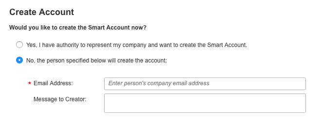
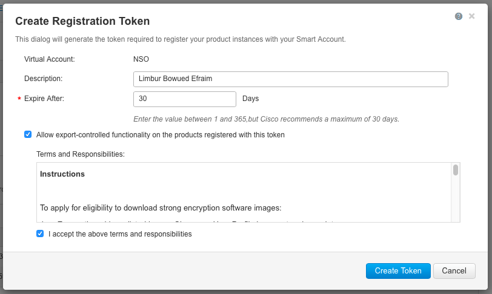

# Cisco Smart Licensing

[Cisco Smart Licensing](https://www.cisco.com/web/ordering/smart-software-licensing/index.html) is a cloud-based approach to licensing, and it simplifies the purchase, deployment, and management of Cisco software assets. Entitlements are purchased through a Cisco account via Cisco Commerce Workspace (CCW) and are immediately deposited into a Smart Account for usage. This eliminates the need to install license files on every device. Products that are smart-enabled communicate directly to Cisco to report consumption.

Cisco Smart Software Manager (CSSM) enables the management of software licenses and Smart Account from a single portal. The interface allows you to activate your product, manage entitlements, and renew and upgrade software.

A functioning Smart Account is required to complete the registration process. For detailed information about CSSM, see [Cisco Smart Software Manager](https://www.cisco.com/c/en/us/buy/smart-accounts/software-manager.html).

## Smart Accounts and Virtual Accounts <a href="#d5e2873" id="d5e2873"></a>

A virtual account exists as a sub-account within the Smart Account. Virtual accounts are a customer-defined structure based on organizational layout, business function, geography, or any defined hierarchy. They are created and maintained by the Smart Account administrator(s).

Visit [Cisco Cisco Software Central](https://software.cisco.com/) to learn about how to create and manage Smart Accounts.

### Request a Smart Account <a href="#d5e2878" id="d5e2878"></a>

The creation of a new Smart Account is a one-time event, and subsequent management of users is a capability provided through the tool. To request a Smart Account, visit [Cisco Cisco Software Central](https://software.cisco.com/) and take the following steps:

1.  After logging in, select **Request a Smart Account** in the Administration section.

    <figure><figcaption></figcaption></figure>
2.  Select the type of Smart Account to create. There are two options: (a) Individual Smart Account requiring agreement to represent your company. By creating this Smart Account, you agree to authorization to create and manage product and service entitlements, users, and roles on behalf of your organization. (b) Create the account on behalf of someone else.

    <figure><figcaption></figcaption></figure>
3.  Provide the required domain identifier and the preferred account name.

    <figure><figcaption></figcaption></figure>
4.  The account request will be pending approval of the Account Domain Identifier. A subsequent email will be sent to the requester to complete the setup process.

    <figure><figcaption></figcaption></figure>

### Adding Users to a Smart Account <a href="#d5e2905" id="d5e2905"></a>

Smart Account user management is available in the **Administration** section of [Cisco Cisco Software Central](https://software.cisco.com/). Take the following steps to add a new user to a Smart Account:

1.  After logging in Select **Manage Smart Account** in the **Administration** section.

    <figure><figcaption></figcaption></figure>
2.  Choose the **Users** tab.

    <figure><figcaption></figcaption></figure>
3.  Select **New User** and follow the instructions in the wizard to add a new user.

    <figure><figcaption></figcaption></figure>

### Create a License Registration Token <a href="#d5e2927" id="d5e2927"></a>

1.  To create a new token, log into CSSM and select the appropriate Virtual Account.

    <figure><figcaption></figcaption></figure>
2.  Click on the **Smart Licenses** link to enter CSSM.

    <figure><figcaption></figcaption></figure>
3.  In CSSM click on **New Token**.

    <figure><figcaption></figcaption></figure>
4.  Follow the dialog to provide a description, expiration, and export compliance applicability before accepting the terms and responsibilities. Click on **Create Token** to continue.

    <figure><figcaption></figcaption></figure>
5.  Click on the new token.

    <figure><figcaption></figcaption></figure>
6.  Copy the token from the dialogue window into your clipboard.

    <figure><figcaption></figcaption></figure>
7.  Go to the NSO CLI and provide the token to the `license smart register idtoken` command:

    ```cli
    admin@ncs# license smart register idtoken YzY2YjFlOTYtOWYzZi00MDg1...
    Registration process in progress.
    Use the 'show license status' command to check the progress and result.
    ```

### Notes on Configuring Smart Licensing <a href="#d5e2966" id="d5e2966"></a>

* If `ncs.conf` contains configuration for any of java-executable, java-options, override-url/url, or proxy/url under the configure path `/ncs-config/smart-license/smart-agent/` any corresponding configuration done via the CLI is ignored.
*   The smart licensing component of NSO runs its own Java virtual machine. Usually, the default Java options are sufficient:

    ```yang
              leaf java-options {
              tailf:info "Smart licensing Java VM start options";
              type string;
              default "-Xmx64M -Xms16M
              -Djava.security.egd=file:/dev/./urandom";
              description
              "Options which NCS will use when starting
              the Java VM.";}
    ```

    \
    If you, for some reason, need to modify the Java options, remember to include the default values as found in the YANG model.

### Validation and Troubleshooting <a href="#d5e2975" id="d5e2975"></a>

#### Available `show` and `debug` Commands <a href="#d5e2977" id="d5e2977"></a>

* `show license all`: Displays all information.
* `show license status`: Displays status information.
* `show license summary`: Displays summary.
* `show license tech`: Displays license tech support information.
* `show license usage`: Displays usage information.
* `debug smart_lic all`: All available Smart Licensing debug flags.
