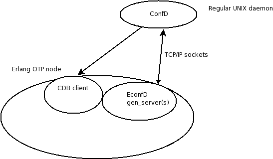

# Erlang API Reference

The `econfd` application is the Erlang API towards the ConfD daemon. It is delivered as an OTP application, which must be started by the system which wishes to interface to ConfD. As an alternative, the supervisor `econfd_sup` can be started directly.

This is the equivalent of libconfd.so for C programmers.

The interface towards ConfD is a socket based IPC interface, thus this application, econfd, executes in a different address space than ConfD itself. The protocol between econfd and ConfD is almost the same regardless of whether econfd (erlang API) or libconfd.so (C API) is used.

Thus the architecture is according to the following picture:

<figure><figcaption>
Architecture
</figcaption></figure>

which illustrates the overall architecture from an OTP perspective.

The econfd OTP application consists of the following parts.

### Data provider API

Module [econfd](econfd.md)

This API consists of a gen\_server (econfd\_daemon) which needs to get a number of callback functions installed. This API is used when we need to implement an external data provider. Typically statistics data which is part of the data model, but not part of the actual configuration.

### CDB API

Module [econfd\_cdb](econfd_cdb.md)

This API is the CDB database client API. It is used to read (and write) into CDB.

### MAAPI API

Module [econfd\_maapi](econfd_maapi.md)

This API is used when we wish to implement proprietary agents. It is also used by user defined validation code which needs to attach to the executing transaction and read the "not yet committed" data in the currently executing transaction.

### Event Notifications API

Module [econfd\_notif](econfd_notif.md)

This API is used when we wish to receive notification events from ConfD describing certain events.

### HA API

Module [econfd\_ha](econfd_ha.md)

This API is used by an optional surrounding HA (High availability) framework which needs to notify ConfD about various HA related events.

### Schema API

Module [econfd\_schema](econfd_schema.md)

This API is used to access schema information (i.e. the internal representation of YANG modules), making it possible to navigate the schema trees and obtain and use structure and type information.

In order to use the econfd API, familiarity with the corresponding C API is necessary. This edoc documentation is fairly thin. In practice all types are documented and in order to figure out the semantics for a certain function, it is necessary to read the corresponding man page for the equivalent C function.
