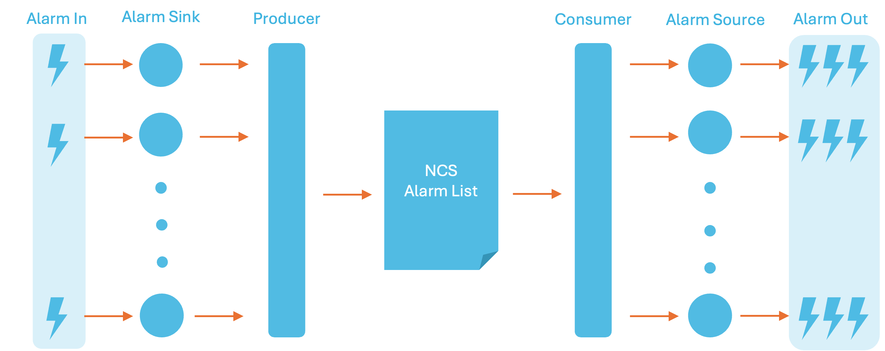

# Developing Alarm Applications

This section focuses on how to manipulate the NSO alarm table using the dedicated Alarm APIs. Make sure that the concepts in the [Alarm Manager](../../operation-and-usage/operations/alarm-manager.md) introduction are well understood before reading this section.

The Alarm API provides a simplified way of managing your alarms for the most common alarm management use cases. The API is divided into a producer and a consumer part.

The producer part provides an alarm sink. Using an alarm sink, you can submit your alarms into the system. The alarms are then queued and fed into the NSO alarm list. You can have multiple alarm sinks active at any time.

The consumer part provides an Alarm Source. The alarm source lets you listen to new alarms and alarm changes. As with the producer side, you can have multiple alarm sources listening for new and changed alarms in parallel.

The diagram below shows a high-level view of the flow of alarms in and out of the system. Alarms are received, e.g. as SNMP notifications, and fed into the NSO Alarm List. At the other end, you subscribe for the alarm changes.

<figure><figcaption><p>The Alarm Flow</p></figcaption></figure>

## Using the Alarm Sink

The producer part of the Alarm API can be used in the following modes:

* **Centralized Mode**\
  This is the preferred mode for NSO. In the centralized mode, we submit alarms to a central alarm writer that optimizes the number of sessions towards the CDB. The NSO Java VM will set up the centralized alarm sink at start-up which will be available for all Java components run by the NSO Java VM.
* **Local Mode**\
  In the local mode, we submit alarms directly into the CDB. In this case, each Alarm Sink keeps its own CDB session. This mode is the recommended mode for applications run outside of the NSO Java VM or Java components that have a specific need for controlling the CDB session.

The difference between the two modes is manifested by the way you retrieve the `AlarmSink` instance to use for alarm submission. For submitting an alarm in centralized mode a prerequisite is that a central alarm sink has been set up within your JVM. For components in the NSO java VM, this is done for you. For applications outside of the NSO java VM that want to utilize the centralized mode, you need to get a `AlarmSinkCentral` instance. This instance has to be started and the central will then execute in a separate thread. The application needs to maintain this instance and stop it when the application finishes.


```
  Socket socket = new Socket("127.0.0.1",Conf.NCS_PORT);
  Maapi maapi = new Maapi(socket);

  AlarmSinkCentral sinkCentral = new AlarmSinkCentral(1000, maapi);
  sinkCentral.start();
```


The centralized alarm sink can then be retrieved using the default constructor in the `AlarmSink` class for components in the NSO Java VM.


```
  AlarmSink sink = new AlarmSink();
```


For applications outside the NSO Java VM, the
`AlarmSinkCentral` needs to be supplied when constructing
the alarm sink.


```
  AlarmSink sink = new AlarmSink(sinkCentral);
```


When submitting an alarm using the local mode, you need a
Maapi socket and a `Maapi` instance.
The local mode alarm sink needs the `Maapi` instance to write alarm info to CDB. The local alarm sink is retrieved using a constructor with a `Maapi` instance as an argument.


```
  Socket socket = new Socket("127.0.0.1",Conf.NCS_PORT);
  Maapi maapi = new Maapi(socket);

  AlarmSink sink = AlarmSink(maapi);
```


The `sink.submitAlarm(...)` method provided by the `AlarmSink` instance can be used in both centralized and local mode to submit an alarm.


```java
  package com.tailf.ncs.alarmman.producer;
    ...
    /**
     * Submits the specified <code>Alarm</code> into the alarm list.
     * If the alarms key
     * "managedDevice, managedObject, alarmType, specificProblem" already
     * exists, the existing alarm will be updated with a
     * new status change entry.
     *
     * Alarm identity:
     *
     * @param managedDevice the managed device which emits the alarm.
     *
     * @param managedObject the managed object emitting the alarm.
     *
     * @param alarmtype the alarm type of the alarm.
     *
     * @param specificProblem is used when the alarmtype cannot uniquely
     *        identify the alarm type.  Normally, this is not the case,
     *        and this leaf is the empty string.
     *
     * Status change within the alarm:
     * @param severity         the severity of the alarm.
     * @param alarmText        the alarm text
     * @param impactedObjects  Objects that might be affected by this alarm
     * @param relatedAlarms    Alarms related to this alarm
     * @param rootCauseObjects Objects that are candidates for causing the
     *                         alarm.
     * @param timeStamp        The time the status of the alarm changed,
     *                         as reported by the device
     * @param customAttributes Custom attributes
     *
     * @return  boolean true/false whether the submitting the specified
     *       alarm was successful
     *
     * @throws IOException
     * @throws ConfException
     * @throws NavuException
     */
     public synchronized boolean
                           submitAlarm(ManagedDevice managedDevice,
                                       ManagedObject managedObject,
                                       ConfIdentityRef alarmtype,
                                       ConfBuf specificProblem,
                                       PerceivedSeverity severity,
                                       ConfBuf alarmText,
                                       List<ManagedObject> impactedObjects,
                                       List<AlarmId> relatedAlarms,
                                       List<ManagedObject> rootCauseObjects,
                                       ConfDatetime timeStamp,
                                       Attribute ... customAttributes)
         throws NavuException, ConfException, IOException {
         ..
     }

    ...
  }
```


Below is an example showing how to submit alarms using the centralized mode, which is the normal scenario for components running inside the NSO Java VM. In the example, we create an alarm sink and submit an alarm.


```
  ...
  AlarmSink sink = new AlarmSink();
  ...

  // Submit the alarm.

  sink.submitAlarm(new ManagedDevice("device0"),
    new ManagedObject("/ncs:devices/device{device0}"),
    new ConfIdentityRef(new MyAlarms().hash(),
      MyAlarms._device_on_fire),
    PerceivedSeverity.INDETERMINATE,
    "Indeterminate Alarm",
    null,
    null,
    null,
    ConfDatetime.getConfDatetime(),
    new AlarmAttribute(new myAlarm(), // A custom alarm attribute
      myAlarm._custom_alarm_attribute_,
      new ConfBuf("this is an alarm attribute")),
    new StatusChangeAttribute(new myAlarm(), // A custom status change attribute
      myAlarm._custom_status_change_attribute_,
      new ConfBuf("this is a status change attribute")));
  ...
```


## Using the Alarm Source

In contrast to the alarm source, the alarm sink only operates in centralized mode. Therefore, before being able to consume alarms using the alarm API you need to set up a central alarm source. If you are executing components in the scope of the NSO Java VM this central alarm source is already set up for you.

You typically set up a central alarm source if you have a stand-alone application executing outside the NSO Java VM. Setting up a central alarm source is similar to setting up a central alarm sink. You need to retrieve a `AlarmSourceCentral`. Your application needs to maintain this instance, which implies starting it at initialization and stopping it when the application finishes.


```
  socket = new Socket("127.0.0.1",Conf.NCS_PORT);
  cdb = new Cdb("MySourceCentral", socket);

  source = new AlarmSourceCentral(MAX_QUEUE_CAPACITY, cdb);
  source.start();
```


The central alarm source subscribes to changes in the alarm list and forwards them to the instantiated alarm sources. The alarms are broadcast to the alarm sources. This means that each alarm source will receive its own copy of the alarm.

The alarm source promotes two ways of receiving alarms:

* **Take**\
  Block execution until an alarm is received.
* **Poll**\
  Wait for the alarm with a timeout. If you do not receive an alarm within the stated time frame, the call will return.


```java
package com.tailf.ncs.alarmman.consumer;
...
public class AlarmSource {
    ...

    /**
     * Waits indefinitely for a new alarm or until the
     * queue is interrupted.
     *
     * @return a new alarm.
     * @throws InterruptedException
     */
    public Alarm takeAlarm() throws InterruptedException{
        ...
    }

    ...

    /**
     * Waits until the next alarm comes or until the time has expired.
     *
     * @param time time to wait.
     * @param unit
     * @return a new alarm or null it timeout expired.
     * @throws InterruptedException
     */
    public Alarm pollAlarm(int time, TimeUnit unit)
    throws InterruptedException{
        ...
    }
```


As soon as you create an alarm source object, the alarm source object will start receiving alarms. If you do not poll or take any alarms from the alarm source object, the queue will fill up until it reaches the maximum number of queued alarms as specified by the alarm source central. The alarm source central will then start to drop the oldest alarms until the alarm source starts the retrieval. This only affects the alarm source that is lagging behind. Any other alarm sources that are active at the same time will receive alarms without discontinuation.


```
  AlarmSource mySource = new AlarmSource();

  Alarm lAlarm = mySource.pollAlarm();

  while (lAlarm != null){
    //handle alarm
  }
```



```
  AlarmSource mySource = new AlarmSource(source);

  Alarm lAlarm = mySource.pollAlarm();

  while (lAlarm != null){
    //handle alarm
  }
```


## Extending the Alarm Manager, Adding User-defined Alarm Types and Fields

The NSO alarm manager is extendable. NSO itself has a number of built-in alarms. The user can add user-defined alarms. In the website example, we have a small YANG module that extends the set of alarm types.

We have in the module `my-alarms.yang` the following alarm type extension:


```yang
  module my-alarms {
    namespace "http://examples.com/ma";
    prefix ma;

    ....

    import tailf-ncs-alarms {
      prefix al;
    }

    import tailf-common {
      prefix tailf;
    }

    identity website-alarm {
      base al:alarm-type;
    }

    identity webserver-on-fire {
      base website-alarm;
    }
```


The `identity` statement in the YANG language is used for this type of constructs. To complete our alarm type extension we also need to populate configuration data related to the new alarm type. A good way to do that is to provide XML data in a CDB initialization file and place this file in the `ncs-cdb` directory:


```xml
    <alarms xmlns="http://tail-f.com/ns/ncs-alarms">
      <alarm-model>
        <alarm-type>
          <type
            xmlns:ma="http://examples.com/ma">ma:webserver-on-fire</type>
          <event-type>equipmentAlarm</event-type>
          <has-clear>true</has-clear>
          <kind-of-alarm>root-cause</kind-of-alarm>
          <probable-cause>957</probable-cause>
        </alarm-type>
      </alarm-model>
    </alarms>
```


Another possibility of extension is to add fields to the existing NSO alarms. This can be useful if you want to add extra fields for attributes not directly supported by the NSO alarm list.

Below is an example showing how to extend the alarm and the alarm status.


```yang
module my-alarms {
  namespace "http://examples.com/ma";
  prefix ma;

  ....

  augment /al:alarms/al:alarm-list/al:alarm {
      leaf custom-alarm-attribute {
        type string;
      }
  }

  augment /al:alarms/al:alarm-list/al:alarm/al:status-change {
      leaf custom-status-change-attribute {
        type string;
      }
  }
}
```


## Mapping Alarms to Objects

One of the strengths of the NSO model structure is the correlation capabilities. Whenever NSO FASTMAP creates a new service it creates a back pointer reference to the service that caused the device modification to take place. NSO template-based services will generate these pointers by default. For Java-based services, back pointers are created when the `createdShared` method is used. These pointers can be retrieved and used as input to the impacted objects parameter of a raised alarm.

The impacted objects of the alarm are the objects that are affected by the alarm i.e. depending on the alarming objects, or the root cause objects. For NSO, this typically means services that have created the device configuration. An impacted object should therefore point to a service that may suffer from this alarm.

The root cause object is another important object of the alarm. It describes the object that likely is the original cause of the alarm. Note that this is not the same thing as the alarming object. The alarming object is the object that raised the alarm, while the root cause object is the primary suspect for causing the alarm. In NSO, any object can raise alarms, it may be a service, a device, or something else.


```
     private List<ManagedObject> findImpactedObjects(String path)
        throws ConfException, IOException
    {

        List<ManagedObject> objs = new ArrayList<ManagedObject>();

        int th = -1;
        try {
          //A helper object that can return the topmost tag (not key)
          //and that can reduce the path by one tag at a time (parent)
          ExtConfPath p = new ExtConfPath(path);

          // Start a read transaction towards the running configuration.
          th = maapi.startTrans(Conf.DB_RUNNING, Conf.MODE_READ);

          while(!(p.topTag().equals("config")
                  || p.topTag().equals("ncs:config"))){

            //Check for back pointer
            ConfAttributeValue[] vals = this.maapi.getAttrs(th,
             new ConfAttributeType[] {ConfAttributeType.BACKPOINTER},
                                                            p.toString());

            for(ConfAttributeValue v : vals){
              ConfList refs = (ConfList)v.getAttributeValue();
              for (ConfObject co : refs.elements()){
                ManagedObject mo = new ManagedObject((ConfObjectRef)co);
                objs.add(mo);
              }
            }

            p = p.parent();
          }
        }
        catch (IOException ioe){
          LOGGER.warn("Could not access Maapi, "
                      +" aborting mapping attempt of impacted objects");
        }
        catch (ConfException ce){
          ce.printStackTrace();
          LOGGER.warn("Failed to retrieve Attributes via Maapi");
        }
        finally {
          maapi.finishTrans(th);
        }
        return objs;
    }
```

