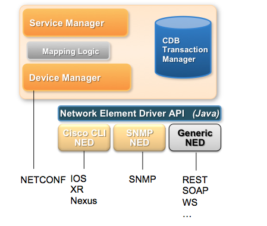

# Developing NEDs

NSO knows how to automatically communicate southbound to NETCONF and SNMP-enabled devices. By supplying NSO with the YANG models of a NETCONF device, NSO knows the data models of the device, and through the NETCONF protocol knows exactly how to manipulate the device configuration. This can be used for a NETCONF device such as a Juniper router, any device that uses ConfD as a management system, or any other device that runs a compliant NETCONF server. Similarly, by providing NSO with the MIBs for a device, NSO can automatically manage such a device.

Unfortunately, the majority of existing devices in current networks do not speak NETCONF and SNMP is usually mostly used to retrieve data from devices. By far the most common way to configure network devices is through the CLI. Management systems typically connect over SSH to the CLI of the device and issue a series of CLI configuration commands. Some devices do not even have a CLI, and thus SNMP, or even worse, various proprietary protocols, are used to configure the device.

NSO can speak southbound not only to NETCONF-enabled devices, but through the NED architecture it can speak to an arbitrary management interface. This is not entirely automatic like with NETCONF, and depending on the type of interface the device has for configuration, this may involve some programming. SNMP devices can be managed automatically, by supplying NSO with the MIBs for the device, with some additional declarative annotations. Devices with a Cisco-style CLI can be managed by writing YANG models describing the data in the CLI, and a relatively thin layer of Java code to handle the communication to the devices. Other types of devices require more coding.

The NSO architecture is described in the picture below, with a built-in NED for NETCONF, another built-in NED for SNMP, one NED for Cisco CLIs, and a generic NED for other protocols. The NED is the adaptation layer between the XML representation of the network configuration contained inside NSO and the wire protocol between NSO and managed devices. The NETCONF and SNMP NEDs are built in, the CLI NED is entirely model-driven, whereas the generic NED requires a Java program to translate operations on the NSO XML tree into configuration operations toward the device. Depending on what means are used to configure the device, this may be more or less complicated.

<figure><figcaption><p>NSO NED Architecture</p></figcaption></figure>

## SNMP NED <a href="#ug.ned.snmpned" id="ug.ned.snmpned"></a>

NSO can use SNMP to configure a managed device, under certain circumstances. SNMP in general is not suitable for configuration, and it is important to understand why:

* In SNMP, the size of a SET request, which is used to write to a device, is limited to what fits into one UDP packet. This means that a large configuration change must be split into many packets. Each such packet contains some parameters to set, and each such packet is applied on its own by the device. If one SET request out of many fails, there is no abort command to undo the already applied changes, meaning that rollback is very difficult.
* The data modeling language used in SNMP, SMIv2, does not distinguish between configuration objects and other writable objects. This means that it is not possible to retrieve only the configuration from a device without explicit, exact knowledge of all objects in all MIBs supported by the device.
* SNMP supports only two basic operations, read and write. There is no protocol support for creating or deleting data. Such operations must be modeled in the MIBs, explicitly.
* SMIv2 has limited support for semantic constraints in the data model. This means that it is difficult to know if a certain configuration will apply cleanly on a device. If it doesn't, rollback is tricky, as explained above.
* Because of all of the above, ordering of SET requests becomes very important. If a device refuses to create some object A before another B, an SNMP manager must make sure to create B before creating A. It is also common that objects cannot be modified without first making them disabled or inactive. There is no standard way to do this, so again, different data models do this in different ways.

Despite all this, if a device can be configured over SNMP, NSO can use its built-in multilingual SNMP manager to communicate with the device. However, to solve the problems mentioned above, the MIBs supported by the device need to be carefully annotated with some additional information that instructs NSO on how to write configuration data to the device. This additional information is described in detail below.

### Overview <a href="#d5e72" id="d5e72"></a>

To add a device, the following steps need to be followed. They are described in more detail in the following sections.

* [ ] Collect (a subset of) the MIBs supported by the device.
* [ ] Optionally, annotate the MIBs with annotations to instruct NSO on how to talk to the device, for example, ordering dependencies that are not explicitly modeled in the MIB. This step is not required.
* [ ] Compile the MIBs and load them into NSO.
* [ ] Configure NSO with the address and authentication parameter for the SNMP devices.
* [ ] Optionally configure a named MIB group in NSO with the MIBs supported by the device, and configure the managed device in NSO to use this MIB group. If this step is not done, NSO assumes the device implements all MIBs known to NSO.

### Compiling and Loading MIBs <a href="#d5e86" id="d5e86"></a>

(See the Makefile `snmp-ned/basic/packages/ex-snmp-ned/src/Makefile`, for an example of the below description.) Make sure that you have all MIBs available, including import dependencies, and that they contain no errors.

The `ncsc --ncs-compile-mib-bundle` compiler is used to compile MIBs and MIB annotation files into NSO load files. Assuming a directory with input MIB files (and optional MIB annotation files) exist, the following command compiles all the MIBs in `device-models` and writes the output to `ncs-device-model-dir`.

```bash
$ ncsc --ncs-compile-mib-bundle device-models \
    --ncs-device-dir ./ncs-device-model-dir
```

The compilation steps performed by the `ncsc --ncs-compile-mib-bundle` are elaborated below:

1. Transform the MIBs into YANG according to the IETF standardized mapping ([https://www.ietf.org/rfc/rfc6643.txt](https://www.ietf.org/rfc/rfc6643.txt)). The IETF-defined mapping makes all MIB objects read-only over NETCONF.
2. Generate YANG deviations from the MIB, this makes SMIv2 `read-write` objects YANG `config true` as a YANG deviation.
3. Include the optional MIB annotations.
4. Merge the read-only YANG from step 1 with the read-write deviation from step 2.
5. Compile the merged YANG files into NSO load format.

These steps are illustrated in the figure below:

<figure><figcaption><p>SNMP NED Compile Steps</p></figcaption></figure>

Finally make sure that the NSO configuration file points to the correct device model directory:

```xml
<device-model-dir>./ncs-device-model-dir</device-model-dir>
```

### Configuring NSO to Speak SNMP Southbound <a href="#d5e120" id="d5e120"></a>

Each managed device is configured with a name, IP address, and port (161 by default), and the SNMP version to use (v1, v2c, or v3).

```cli
admin@host# show running-config devices device r3
      
address 127.0.0.1
port    2503
device-type snmp version v3 snmp-authgroup my-authgroup
state admin-state unlocked
```

To minimize the necessary configuration, the authentication group concept (see [Authentication Groups](../../../operation-and-usage/operations/nso-device-manager.md#user\_guide.devicemanager.authgroups)) is used also for SNMP. A configured managed device of the type `snmp` refers to an SNMP authgroup. An SNMP authgroup contains community strings for SNMP v1 and v2c and USM parameters for SNMP v3.

```cli
admin@host# show running-config devices authgroups snmp-group my-authgroup
      
devices authgroups snmp-group my-authgroup
 default-map community-name public
 umap admin
  usm remote-name admin
  usm security-level auth-priv
  usm auth md5 remote-password $4$wIo7Yd068FRwhYYI0d4IDw==
  usm priv des remote-password $4$wIo7Yd068FRwhYYI0d4IDw==
 !
!
```

In the example above, when NSO needs to speak to the device `r3`, it sees that the device is of type `snmp`, and that SNMP v3 should be used with authentication parameters from the SNMP authgroup `my-authgroup`. This authgroup maps the local NSO user `admin` to the USM user `admin`, with explicit remote passwords given. These passwords will be localized for each SNMP engine that NSO communicates with. While the passwords above are shown encrypted, when you enter them in the CLI you write them in clear text. Note also that the remote engine ID is not configured; NSO performs a discovery process to find it automatically.

No NSO user other than `admin` is mapped by the `authgroup my-authgroup` for SNMP v3.

### **Configure MIB Groups**

With SNMP, there is no standardized, generic way for an SNMP manager to learn which MIBs an SNMP agent implements. By default, NSO assumes that an SNMP device implements all MIBs known to NSO, i.e., all MIBs that have been compiled with the `ncsc --ncs-compile-mib-bundle` command. This works just fine if all SNMP devices NSO manages are of the same type, and implement the same set of MIBs. But if NSO is configured to manage many different SNMP devices, some other mechanism is needed.

In NSO, this problem is solved by using MIB groups. MIB group is a named collection of MIB module names. A managed SNMP device can refer to one or more MIB groups. For example, below two MIB groups are defined:

```cli
admin@ncs# show running-config devices mib-group
        
devices mib-group basic
 mib-module [ BASIC-CONFIG-MIB BASIC-TC ]
!
devices mib-group snmp
 mib-module [ SNMP* ]
!
```

The wildcard `*` can be used only at the end of a string; it is thus used to define a prefix of the MIB module name. So the string `SNMP*` matches all loaded standard SNMP modules, such as SNMPv2-MIB, SNMP-TARGET-MIB, etc.

An SNMP device can then be configured to refer to one or more of the MIB groups:

```cli
admin@ncs# show running-config devices device r3 device-type snmp
        
devices device r3
 device-type snmp version v3
 device-type snmp snmp-authgroup default
 device-type snmp mib-group [ basic snmp ]
!
```

### Annotations for MIB Objects <a href="#d5e149" id="d5e149"></a>

Most annotations for MIB objects are used to instruct NSO on how to split a large transaction into suitable SNMP SET requests. This step is not necessary for a default integration. But when for example ordering dependencies in the MIB is discovered it is better to add this as annotations and let NSO handle the ordering rather than leaving it to the CLI user or Java programmer.

In some cases, NSO can automatically understand when rows in a table must be created or deleted before rows in some other table. Specifically, NSO understands that if table B has an INDEX object in table A (i.e., B sparsely augments A), then rows in table B must be created after rows in table B, and vice versa for deletions. NSO also understands that if table B AUGMENTS table A, then a row in table A must be created before any column in B is modified.

However, in some MIBs, table dependencies cannot be detected automatically. In this case, these tables must be annotated with a `sort-priority`. By default, all rows have sort-priority 0. If table A has a lower sort priority than table B, then rows in table A are created before rows in table B.

In some tables, existing rows cannot be modified unless the row is inactivated. Once inactive, the row can be modified and then activated again. Unfortunately, there is no formal way to declare this is SMIv2, so these tables must be annotated with two statements; `ned-set-before-row-modification` and `ned-modification-dependent`. The former is used to instruct NSO which column and which value is used to inactivate a row, and the latter is used on each column that requires the row to be inactivated before modification. `ned-modification-dependent` can be used in the same table as `ned-set-before-row-modification`, or in a table that augments or sparsely augments the table with `ned-set-before-row-modification`.

By default, NSO treats a writable SMIv2 object as configuration, except if the object is of type RowStatus. Any writable object that does not represent configuration must be listed in a MIB annotation file when the MIB is compiled, with the "operational" modifier.

When NSO retrieves data from an SNMP device, e.g., when doing a `sync from-device`, it uses the GET-NEXT request to scan the table for available rows. When doing the GET-NEXT, NSO must ask for an accessible column. If the row has a column of type RowStatus, NSO uses this column. Otherwise, if one of the INDEX objects is accessible, it uses this object. Otherwise, if the table has been annotated with `ned-accessible-column`, this column is used. And, as a last resort, NSO does not indicate any column in the first GET-NEXT request, and uses the column returned from the device in subsequent requests. If the table has "holes" for this column, i.e., the column is not instantiated in all rows, NSO will not detect those rows.

NSO can automatically create and delete table rows for tables that use the RowStatus TEXTUAL-CONVENTION, defined in RFC 2580.

It is pretty common to mix configuration objects with non-configuration objects in MIBs. Specifically, it is quite common that rows are created automatically by the device, but then some columns in the row are treated as configuration data. In this case, the application programmer must tell NSO to sync from the device before attempting to modify the configuration columns, to let NSO learn which rows exist on the device.

Some SNMP agents require a certain order of row deletions and creations. By default, the SNMP NED sends all creates before deletes. The annotation `ned-delete-before-create` can be used on a table entry to send row deletions before row creations, for that table.

Sometimes rows in some SNMP agents cannot be modified once created. Such rows can be marked with the annotation `ned-recreate-when-modified`. This makes the SNMP NED to first delete the row, and then immediately recreate it with the new values.

A good starting point for understanding annotations is to look at the example in `examples.ncs/snmp-ned` directory. The BASIC-CONFIG-MIB mib has a table where rows can be modified if the `bscActAdminState` is set to locked. To have NSO do this automatically when modifying entries rather then leaving it to users an annotation file can be created. See the `BASIC-CONFIG-MIB.miba` which contains the following:

```
## NCS Annotation module for BASIC-CONFIG-MIB

bscActAdminState  ned-set-before-row-modification = locked
bscActFlow        ned-modification-dependent
```

This tells NSO that before modifying the `bscActFlow` column set the `bscActAdminState` to locked and restore the previous value after committing the set operation.

All MIB annotations for a particular MIB are written to a file with the file suffix `.miba`. See [mib\_annotations(5)](https://developer.cisco.com/docs/nso-guides-6.1/#!ncs-man-pages-volume-5/man.5.mib\_annotations) in manual pages for details.

Make sure that the MIB annotation file is put into the directory where all the MIB files are which is given as input to the `ncsc --ncs-compile-mib-bundle` command

### Using the SNMP NED <a href="#d5e185" id="d5e185"></a>

NSO can manage SNMP devices within transactions, a transaction can span Cisco devices, NETCONF devices, and SNMP devices. If a transaction fails NSO will generate the reverse operation to the SNMP device.

The basic features of the SNMP will be illustrated below by using the `examples.ncs/snmp-ned` example. First, try to connect to all SNMP devices:

```cli
admin@ncs# devices connect
        
connect-result {
    device r1
    result true
    info (admin) Connected to r1 - 127.0.0.1:2501
}
connect-result {
    device r2
    result true
    info (admin) Connected to r2 - 127.0.0.1:2502
}
connect-result {
    device r3
    result true
    info (admin) Connected to r3 - 127.0.0.1:2503
}
```

When NSO executes the connect request for SNMP devices it performs a get-next request with 1.1 as var-bind. When working with the SNMP NED it is helpful to turn on the NED tracing:

```bash
$ ncs_cli -C -u admin
```

```
admin@ncs config
```

```cli
admin@ncs(config)# devices global-settings trace pretty trace-dir .
```

```cli
admin@ncs(config)# commit
```

```
Commit complete.
```

This creates a trace file named `ned-devicename.trace`. The trace for the NCS `connect` action looks like:

```bash
$ more ned-r1.trace
get-next-request reqid=2
    1.1
get-response reqid=2
    1.3.6.1.2.1.1.1.0=Tail-f ConfD agent - 1
```

When looking at SNMP trace files it is useful to have the OBJECT-DESCRIPTOR rather than the OBJECT-IDENTIFIER. To do this, pipe the trace file to the `smixlate` tool:

```bash
$ more ned-r1.trace | smixlate $NCS_DIR/src/ncs/snmp/mibs/SNMPv2-MIB.mib
        
get-next-request reqid=2
    1.1
get-response reqid=2
    sysDescr.0=Tail-f ConfD agent - 1
```

You can access the data in the SNMP systems directly (read-only and read-write objects):

```cli
admin@ncs# show devices device live-status
      
ncs live-device r1
 live-status SNMPv2-MIB system sysDescr "Tail-f ConfD agent - 1"
 live-status SNMPv2-MIB system sysObjectID 1.3.6.1.4.1.24961
 live-status SNMPv2-MIB system sysUpTime 596197
 live-status SNMPv2-MIB system sysContact ""
 live-status SNMPv2-MIB system sysName ""
...
```

NSO can synchronize all writable objects into CDB:

```cli
admin@ncs# devices sync-from
sync-result {
    device r1
    result true
...
```

```cli
admin@ncs# show running-config devices device r1 config r:SNMPv2-MIB
    
devices device r1
  config
    system
      sysContact  ""
      sysName     ""
      sysLocation ""
    !
    snmp
      snmpEnableAuthenTraps disabled;
    !
```

All the standard features of NSO with transactions and roll-backs will work with SNMP devices. The sequence below shows how to enable authentication traps for all devices as one transaction. If any device fails, NSO will automatically roll back the others. At the end of the CLI sequence a manual rollback is shown:

```cli
admin@ncs# config
```

<pre><code><strong>admin@ncs(config)# devices device r1-3 config r:SNMPv2-MIB snmp snmpEnableAuthenTraps enabled
</strong></code></pre>

```cli
admin@ncs(config)# commit
```

```
Commit complete.
```

```cli
admin@ncs(config)# top rollback configuration
```

```cli
admin@ncs(config)# commit dry-run outformat cli
```

```
cli  devices {
         device r1 {
             config {
                 r:SNMPv2-MIB {
                     snmp {
    -                    snmpEnableAuthenTraps enabled;
    +                    snmpEnableAuthenTraps disabled;
                     }
                 }
             }
         }
         device r2 {
             config {
                 r:SNMPv2-MIB {
                     snmp {
    -                    snmpEnableAuthenTraps enabled;
    +                    snmpEnableAuthenTraps disabled;
                     }
                 }
             }
         }
         device r3 {
             config {
                 r:SNMPv2-MIB {
                     snmp {
    -                    snmpEnableAuthenTraps enabled;
    +                    snmpEnableAuthenTraps disabled;
                     }
                 }
             }
         }
     }
```

```cli
admin@ncs(config)# commit
```

```
Commit complete.
```

## NED Identification <a href="#ug.ned.identification" id="ug.ned.identification"></a>

Each managed device in NSO has a device type, which informs NSO how to communicate with the device. The device type is one of `netconf`, `snmp`, `cli`, or `generic`. In addition, a special `ned-id` identifier is needed.

NSO uses a technique called YANG Schema Mount, where all the data models from a device are mounted into the `/devices` tree in NSO. Each set of mounted data models is completely separated from the others (they are confined to a "mount jail"). This makes it possible to load different versions of the same YANG module for different devices. The functionality is called Common Data Models (CDM).

In most cases, there are many devices running the same software version in the network managed by NSO, thus using the exact same set of YANG modules. With CDM, all YANG modules for a certain device (or family of devices) are contained in a NED package (or just NED for short). If the YANG modules on the device are updated in a backward-compatible way, the NED is also updated.

However, if the YANG modules on the device are updated in an incompatible way in a new version of the device's software, it might be necessary to create a new NED package for the new set of modules. Without CDM, this would not be possible, since there would be two different packages that contained different versions of the same YANG module.

When a NED is being built, its YANG modules are compiled to be mounted into the NSO YANG model. This is done by device compilation of the device's YANG modules and is performed via the `ncsc` tool provided by NSO.

The ned-id identifier is a YANG identity, which must be derived from one of the pre-defined identities in `tailf-ncs-ned.yang`:


```yang
module tailf-ncs-ned {
  namespace "http://tail-f.com/ns/ncs-ned";
  prefix ned;

  import tailf-common {
    prefix tailf;
  }

  organization "Tail-f Systems";

  description
    "This module defines the Tail-f NCS NED base identities.

     Copyright 2011-2021 Cisco Systems, Inc.
     All rights reserved.
     Permission is hereby granted to redistribute this file without
     modification.";

  revision 2021-09-02 {
    description
      "Released as part of NCS-5.6.

       Added identity 'generic-ned-notification-id'.

       Added idenity 'cli-ned-notification-id'.";
  }

  revision 2019-04-09 {
    description
      "Released as part of NCS-5.1.

       Added 'ned-id' as base to all protocol specific ned ids.";
  }

  revision 2016-11-24 {
    description
      "Released as part of NCS-4.3.

       Added base identity for NETCONF devices.
       Added identity lsa-netconf";
  }

  revision 2011-06-01 {
    description
      "Released as part of NCS-1.6.";
  }

  identity ned-id {
    description
      "Base identity for Tail-f NEDs.";
  }

  identity netconf-ned-id {
    base ned-id;
    tailf:abstract;
    description
      "Base identity for NETCONF NEDs.";
  }
  identity generic-ned-id {
    base ned-id;
    tailf:abstract;
    description
      "Base identity for generic NEDs.";
  }

  identity cli-ned-id {
    base ned-id;
    tailf:abstract;
    description
      "Base identity for CLI NEDs.";
  }
  identity snmp-ned-id {
    base ned-id;
    tailf:abstract;
    description
      "Base identity for SNMP NEDs.

       Note that currently there is no way to actually set a ned-id
       for SNMP devices.";
  }

  identity rfc5277-id {
    base netconf-ned-id;
    tailf:abstract;
    description
      "Special internal id for the data model in RFC 5277.";
  }

  identity generic-ned-notification-id {
    base generic-ned-id;
    tailf:abstract;
    description
      "Special internal id for generic NEDs with notification capability.";
  }

  identity cli-ned-notification-id {
    base cli-ned-id;
    tailf:abstract;
    description
      "Special internal id for CLI NEDs with notification capability.";
  }

  identity netconf {
    base netconf-ned-id;
    description
      "Default identity for a netconf device.";
  }

  identity lsa-netconf {
    base netconf-ned-id;
    description
      "Base identity for LSA nodes.";
  }

  identity snmp {
    base snmp-ned-id;
    description
      "Default identity for an SNMP device.";
  }

}
```


A YANG model for devices handled by NED code needs to extend the base identity and provide a new identity that can be configured.


```
import tailf-ncs-ned {
    prefix ned;
}

identity cisco-ios {
 base ned:cli-ned-id;
}
```


The Java NED code registers the identity it handles with NSO.

Similar to how we import device models for NETCONF-based devices, we use the `ncsc --ncs-compile-bundle` command to import YANG models for NED-handled devices.

Once we have imported such a YANG model into NSO, we can configure the managed device in NSO to be handled by the appropriate NED handler (which is user Java code, more on that later)


```cli
admin@ncs# show running config devices device r1
    
address   127.0.0.1
port      2025
authgroup default
device-type cli ned-id cisco-ios
state admin-state unlocked
...
```


When NSO needs to communicate southbound towards a managed device that is not of type NETCONF, it will look for a NED that has registered with the name of the identity, in the case above, the string `ios`.

Thus, before NSO attempts to connect to a NED device before it tries to sync or manipulate the configuration of the device, a user-based Java NED code must have registered with the NSO service manager indicating which Java class is responsible for the NED with the string of the identity, in this case, the string `ios`. This happens automatically when the NSO Java VM gets a `instantiate-component` request for an NSO package component of type `ned`.

The component Java class `myNed` needs to implement either of the interfaces `NedGeneric` or `NedCli`. Both interfaces require the NED class to implement the following:


```
// should return "cli" or "generic"
String type();

// Which YANG modules are covered by the class
String [] modules();

// Which identity is implemented by the class
String identity();
```


The above three callbacks are used by the NSO Java VM to connect the NED Java class with NSO. They are called at when the NSO Java VM receives the `instantiate-component request`.

The underlying NedMux will start a number of threads, and invoke the registered class with other data callbacks as transactions execute.

## YANG Module Namespace Identifier <a href="#d5e288" id="d5e288"></a>

Internally in NSO, a YANG module is identified by its namespace. Each such namespace must be unique. Without CDM, the namespace identifier would be the same as the XML namespace defined in the YANG module. But with CDM, the namespace is constructed from a mount ID and the XML namespace. The resulting namespace is sometimes referred to as a crunched namespace.

## Mount Point <a href="#d5e294" id="d5e294"></a>

To implement CDM, NSO uses the YANG Schema Mount, defined in [RFC 8528](https://www.ietf.org/rfc/rfc8528.txt). This document introduces a mount point, under which YANG models are mounted. NSO defines two such mount points, in `/devices/device/config` and `/devices/device/live-status`. Under these mount points, all the device's YANG modules are mounted.

This implies that traversing a path in the schema that crosses a mount-point, signals that referencing a node under the mount point by using a module's name, prefix, or XML namespace may be ambiguous (since there may be multiple versions of the same module, with different definitions of the same node). To resolve this ambiguity, it is necessary to know the mount ID.

A NED package must define a NED ID that identifies the device type for the NED. In NSO, the NED ID is also the mount ID for the crunched namespaces.

This means that the NED ID must be unique for each NED and will serve the dual role of defining the device type and mount ID.

So, when traversing a mount-point, NSO will internally look up the ned-id for the specific device instance and resolve the ambiguities in the module name, prefix, or XML namespace. This way all user-code can and must use paths and XML namespaces just as before. There is no need for user code to ever handle crunched namespaces.

## NED Version Scheme <a href="#ug.ned.migration.version-scheme" id="ug.ned.migration.version-scheme"></a>

A NED has a version associated with it. A version consists of a sequence of numbers separated by dots (`.`). The first two numbers define the major and minor version number, the third number defines the maintenance version number and any following numbers are patch release version numbers.

For instance, the 5.8.1 number indicates a maintenance release (1) on the minor release 5.8, and 5.8.1.1 indicates a patch release (1) on the maintenance release 5.8.1. Any incompatible YANG model change will require the major or minor version number to change, i.e. any 5.8.x version is to be backward compatible with the previous.

When a NED release is replaced with a later maintenance/patch release with the same major/minor version, NSO can do a simple data model upgrade to handle stored instance data in CDB. There is no risk that any data would be lost by this sort of upgrade.

On the other hand, when a NED is replaced by a new major/minor release this becomes a NED migration. These are nontrivial since the YANG model changes can result in loss of instance data if not handled correctly.

<figure><figcaption><p>NED Version Scheme</p></figcaption></figure>

## NED Settings

NED settings are YANG models augmented as config in NSO that controls the behavior of the NED. These settings are augmented under `/devices/global-settings/ned-settings`, `/devices/profiles/ned-settings` and `/devices/device/ned-settings`. Traditionally, these NED settings have been accompanied by a _when_ expression specifying the NED ID for which the settings are legal. With the introduction of CDM, such _when_ expressions on specific NED IDs are not recommended since NED ID will change with NED releases.

Instead, there is a need to introduce a 'family' identity that becomes base for all NED releases for a certain family. The `when` expressions can then use `derived-from` syntax to be legal for all NED releases in the family.

## Schema Traversals in NED Java code <a href="#d5e331" id="d5e331"></a>

As stated above schema traversal works as before until a mount-point is reached in the path. At that point, a lookup of the current mount-id (ned-id) is necessary to resolve any ambiguities in the module name, prefix, or XML namespace. Since the NED, by definition, works on devices under a NED any schema traversal in NED code falls under the latter case.

Pre CDM retrieving a CSNode from the Maapi Schema for a path was as simple as calling the `findCSNode(Namespace, Path)` function.

```
private  MaapiSchemas.CSNode getCSNode(String path) throws MaapiException {
  return schemas.findCSNode(Ncs.uri, path);
}
```

With CDM the original `findCSNode(Namespace, Path)` still exists for backward compatibility but in the NED code case all paths are under a mount-point and hence this function will return an error that a lookup cannot be performed. The reason for this is that a maapi call to the NSO service is necessary to retrieve the mount-id for the device. This is accomplished with a mount-id callback `MountIdCb(Maapi, Th)` which takes a Maapi instance and optionally a current transaction.

```
private  MaapiSchemas.CSNode getCSNode(String path) throws MaapiException {
  return schemas.findCSNode(new MountIdCb(this.mm, -1), Ncs.uri, path);
}
```

## Dumb Versus Capable Devices <a href="#ug.ned.devs" id="ug.ned.devs"></a>

NSO differentiates between managed devices that can handle transactions and devices that can not. This discussion applies regardless of NED type, i.e., NETCONF, SNMP, CLI, or Generic.

NEDs for devices that cannot handle abort, must indicate so in the reply of the `newConnection()` method indicating that the NED wants a reverse diff in case of abort. Thus, NSO has two different ways to abort a transaction towards a NED, invoke the `abort()` method with or without a generated reverse diff.

For non-transactional devices, we have no other way of trying out a proposed configuration change than to send the change to the device and see what happens.

The table below shows the 7 different data-related callbacks that could or must be implemented by all NEDs. It also differentiates between 4 different types of devices and what the NED must do in each callback for the different types of devices.

The table lists device types.

<table data-full-width="false"><thead><tr><th width="238">Non transactional devices</th><th width="198">Transactional devices</th><th width="180">Transactional devices with confirmed commit</th><th>Fully capable NETCONF server</th></tr></thead><tbody><tr><td>SNMP, Cisco IOS, NETCONF devices with startup+running.</td><td>Devices that can abort, NETCONF devices without confirmed commit.</td><td>Cisco XR type of devices.</td><td>ConfD, Junos.</td></tr><tr><td><strong>INITIALIZE</strong>: The initialize phase is used to initialize a transaction. For instance, if locking or other transaction preparations are necessary, they should be performed here. This callback is not mandatory to implement if no NED specific transaction preparations are needed.</td><td></td><td></td><td></td></tr><tr><td><code>initialize()</code>. NED code shall make the device go into config mode (if applicable) and lock (if applicable).</td><td><code>initialize()</code>. NED code shall start a transaction on the device.</td><td><code>initialize()</code>. NED code shall do the equivalent of configure exclusive.</td><td>Built in, NSO will lock.</td></tr><tr><td><strong>UNINITIALIZE</strong>: If the transaction is not completed and the NED has done INITIALIZE, this method is called to undo the transaction preparations, that is restoring the NED to the state before INITIALIZE. This callback is not mandatory to implement if no NED specific preparations was performed in INITIALIZE.</td><td></td><td></td><td></td></tr><tr><td><code>uninitialize()</code>. NED code shall unlock (if applicable).</td><td><code>uninitialize()</code>. NED code shall abort the transaction.</td><td><code>uninitialize()</code>. NED code shall abort the transaction.</td><td>Built in, NSO will unlock.</td></tr><tr><td><strong>PREPARE</strong>: In the prepare phase, the NEDs get exposed to all the changes that are destined for each managed device handled by each NED. It is the responsibility of the NED to determine the outcome here. If the NED replies successfully from the prepare phase, NSO assumes the device will be able to go through with the proposed configuration change.</td><td></td><td></td><td></td></tr><tr><td><code>prepare(Data)</code>. NED code shall send all data to the device.</td><td><code>prepare(Data)</code>. NED code shall add Data to the transaction and validate.</td><td><code>prepare(Data)</code>. NED code shall add Data to the transaction and validate.</td><td>Built in, NSO will edit-config towards the candidate, validate and commit confirmed with a timeout.</td></tr><tr><td><strong>ABORT</strong>: If any participants in the transaction reject the proposed changes, all NEDs will be invoked in the <code>abort()</code> method for each managed device the NED handles. It is the responsibility of the NED to make sure that whatever was done in the PREPARE phase is undone. For NEDs that indicate as reply in <code>newConnection()</code> that they want the reverse diff, they will get the reverse data as a parameter here.</td><td></td><td></td><td></td></tr><tr><td><code>abort(ReverseData | null)</code> Either do the equivalent of copy startup to running, or apply the ReverseData to the device.</td><td><code>abort(ReverseData | null)</code>. Abort the transaction</td><td><code>abort(ReverseData | null)</code>. Abort the transaction</td><td>Built in, discard-changes and close.</td></tr><tr><td><strong>COMMIT</strong>: Once all NEDs that get invoked in <code>commit(Timeout)</code> reply ok, the transaction is permanently committed to the system. The NED may still reject the change in COMMIT. If any NED reject the COMMIT, all participants will be invoked in REVERT, NEDs that support confirmed commit with a timeout, Cisco XR, may choose to use the provided timeout to make REVERT easy to implement.</td><td></td><td></td><td></td></tr><tr><td><code>commit(Timeout)</code>. Do nothing</td><td><code>commit(Timeout)</code>. Commit the transaction.</td><td><code>commit(Timeout)</code>. Execute commit confirmed [Timeout] on the device.</td><td>Built in, commit confirmed with the timeout.</td></tr><tr><td><strong>REVERT</strong>: This state is reached if any NED reports failure in the COMMIT phase. Similar to the ABORT state, the reverse diff is supplied to the NED if the NED has asked for that.</td><td></td><td></td><td></td></tr><tr><td><code>revert(ReverseData | null)</code> Either do the equivalent of copy startup to running, or apply the ReverseData to the device.</td><td><code>revert(ReverseData | null)</code> Either do the equivalent of copy startup to running, or apply the ReverseData to the device.</td><td><code>revert(ReverseData | null)</code>. discard-changes</td><td>Built in, discard-changes and close.</td></tr><tr><td><strong>PERSIST</strong>: This state is reached at the end of a successful transaction. Here it's responsibility of the NED to make sure that if the device reboots, the changes are still there.</td><td></td><td></td><td></td></tr><tr><td><code>persist()</code> Either do the equivalent of copy running to startup or nothing.</td><td><code>persist()</code> Either do the equivalent of copy running to startup or nothing.</td><td><code>persist()</code>. confirm.</td><td>Built in, commit confirm.</td></tr></tbody></table>

The following state diagram depicts the different states the NED code goes through in the life of a transaction.

<figure><figcaption><p>NED Transaction States</p></figcaption></figure>

## CLI NED <a href="#ug.ned.clined" id="ug.ned.clined"></a>

The CLI NED is magic, it is an entirely model-driven way to CLI script towards all Cisco-like devices. The basic idea is that the Cisco CLI engine found in ConfD can be run in both directions.

*   A sequence of Cisco CLI commands can be turned into the equivalent manipulation of the internal XML tree that represents the configuration inside NSO/ConfD. This is the normal mode of operations of ConfD, run in Cisco mode.

    A YANG model, annotated appropriately, will produce a Cisco CLI. The user can enter Cisco commands and ConfD will, using the annotated YANG model, parse the Cisco CLI commands and change the internal XML tree accordingly. Thus this is the CLI parser and interpreter. Model-driven.
*   The reverse operation is also possible. Given two different XML trees, each representing a configuration state, in the ConfD case it represents the configuration of a single device, i.e. the device using ConfD as a management framework, whereas in the NSO case, it represents the entire network configuration, we can generate the list of Cisco commands that would take us from one XML tree to another.

    This technology is used by NSO to generate CLI commands southbound when we manage Cisco-like devices.

It will become clear later in the examples how the CLI engine is run in forward and also reverse mode. The key point though, is that the Cisco CLI NED Java programmer doesn't have to understand and parse the structure of the CLI, this is entirely done by the NSO CLI engine.

To implement a CLI NED, the following components are required:

*   A YANG data model that describes the CLI. An important development tool here is ConfD, the Tail-f on-device management toolkit. For NSO to manage a CLI device, it needs a YANG file with exactly the right annotations to produce precisely the CLI of the managed device. In the NSO example collection, we have a few examples of annotated YANG models that render different variants of Cisco CLI. See for example `$NCS_DIR/packages/neds/dell-ftos` and `$NCS_DIR/packages/neds/cisco-nx`.

    \
    Thus, to create annotated YANG files for a device with a Cisco-like CLI, the work procedure is thus to run ConfD and write a YANG file which renders the correct CLI. This procedure is well described in the ConfD user guide documentation.

    \
    Furthermore, this YANG model must declare an identity with `ned:cli-ned-id` as base.
* The next thing we need is a Java class that implements the NED. This is typically not a lot of code, and the existing example NED Java classes are easily extended and modified to fit other needs. The most important point of Java NED class code though is that the code can be oblivious of the actual CLI commands sent and received.

Java CLI NED code must implement the `CliNed` interface.


```java
/*    -*- Java -*-
 *
 *  Copyright 2010 Tail-F Systems AB. All rights reserved.
 *
 *  This software is the confidential and proprietary
 *  information of Tail-F Systems AB.
 *
 *  $Id$
 *
 */
package com.tailf.ned;

import java.io.InputStream;
import java.util.Calendar;

import javax.xml.XMLConstants;
import javax.xml.parsers.DocumentBuilder;
import javax.xml.parsers.DocumentBuilderFactory;

import org.apache.logging.log4j.Logger;
import org.apache.logging.log4j.LogManager;
import org.w3c.dom.Document;
import org.xml.sax.InputSource;

import com.tailf.conf.ConfPath;
import com.tailf.conf.ConfXMLParam;
import com.tailf.maapi.Maapi;
import com.tailf.maapi.MaapiSchemas.CSSchema;
import com.tailf.ned.NedWorker.TransactionIdMode;

/**
 * A NedConnection is the interface used by the NedMux for keeping
 * track of connections to different devices. One instance of each
 * type should be registered with the NedMux before the NedMux is
 * started. Specific sub-classes are defined for cli and generic
 * neds, see NedCli and NedGeneric.
 *
 * The life of a specific connection to a backend device is as
 * follows.
 *
 * 1 Initially an instance is created through the invocation of
 *   the create method, and a connection to the backend
 *   device is set up.
 * 2 a mix of prepare/abort/revert/commit/persist/show/getTransId/
 *   showStatsPath, etc
 * 3 possibly get invocations to the isAlive() method. This method
 *   is involved when the connection is pooled.
 * 4 possibly get an invocation to the reconnect method, and start
 *   over at 2
 * 5 finally one of the close() methods will be involved. The
 *   connection should close the connection to the device and
 *   release all resources.
 *
 * If the connection is poolable then it may live in the connection
 * pool. The state of the connection is polled by the connection
 * pool manager using the isAlive() method.
 *
 */

abstract public class NedConnectionBase {

    private static Logger LOGGER = LogManager.getLogger(
            NedConnectionBase.class);

    private NedCapability[] capas;
    private NedCapability[] statscapas;
    private boolean wantRevertDiff;
    private TransactionIdMode transMode = TransactionIdMode.NONE;
    private ConfXMLParam[] platformData;
    private int connectionId;
    private long poolTimestamp = Long.MAX_VALUE;
    private boolean useStoredCapas = false;
    // Holds reference to the new style SSH connection
    protected SSHClient sshClient = null;

    protected void setPoolTimestamp(long timestamp) {
        this.poolTimestamp = timestamp;
    }

    public long getTimeInPool() {
        return Calendar.getInstance().getTimeInMillis() - poolTimestamp;
    }

    /**
     * This function is used to set the parameters of NedConnection for
     * a specific NED.
     *
     * @param capas
     *  an array of capabilities for config data
     * @param statscapas
     *  an array of capabilities for stats data
     * @param wantRevertDiff
     *  Indicates if the NED should be provided with the edit operations
     *    needed to undo the configuration changes done in
     *    the prepare method when a transaction is aborted.
     * @param transMode
     *  Indicates the mode of Transaction ID supported by the NED.
     *    NONE if not supported. If supported, then getTransId()
     *    should be implemented. Support for Transaction IDs is required
     *    for check-sync action.
     */
    public void setConnectionData(NedCapability[] capas,
                                  NedCapability[] statscapas,
                                  boolean wantRevertDiff,
                                  TransactionIdMode transMode) {
        this.capas = capas;
        this.statscapas = statscapas;
        this.wantRevertDiff = wantRevertDiff;
        this.transMode = transMode;
    }

    /**
     * This function is used to set the capabilities for a specific NED.
     * It has the same functionality as setConnectionData, but only for
     * config capabilities. This is useful when initializing a NED instance
     * without establishing connection to the device because other connection
     * parameters such as stats capabilities, reverse diff and
     * transaction id mode are irrelevant in this case
     *
     * @param capas
     *  an array of capabilities for config data
     */
    public void setCapabilities(NedCapability[] capas) {
        this.capas = capas;
    }

    /**
     * This function is used to set the same capabilities as stored in
     * CDB for a particular device. This method can only be used when
     * initializing a NED instance without establishing connection to
     * the device.
     */
    public void useStoredCapabilities() {
        this.useStoredCapas = true;
    }

    /**
     * This function is used to set the platform operational data for
     * a specific NED. This is optional data that can be retrieved and
     * used for instance in service code.
     *
     * It is possible to augment NED specific data into the platform container
     * in the NCS device model. This method is then used to set both standard
     * and augmented data.
     *
     * The ConfXMLParam[] array is expected to start with the platform tag:
     *
     * The following is an example of how the platformData array would
     * be structured in an example with both the NCS standard name,
     * model and version leaves as well as a augmented inventory list
     * with three list elements:
     * <pre>
     * ConfXMLParam[] platformData =
     *     new ConfXMLParam[] {
     *         new ConfXMLParamStart("ncs", "platform"),
     *         new ConfXMLParamValue("ncs", "name",
     *                               new ConfBuf("ios")),
     *         new ConfXMLParamValue("ncs", "version",
     *                               new ConfBuf("15.0M")),
     *         new ConfXMLParamValue("ncs", "model",
     *                               new ConfBuf("7200")),
     *
     *         new ConfXMLParamStart("ginv", "inventory"),
     *         new ConfXMLParamValue("ginv", "name",
     *                               new ConfBuf("lx-345")),
     *         new ConfXMLParamValue("ginv", "value",
     *                               new ConfBuf("line-card")),
     *         new ConfXMLParamStop("ginv", "inventory"),
     *         new ConfXMLParamStart("ginv", "inventory"),
     *         new ConfXMLParamValue("ginv", nameStr,
     *                               new ConfBuf("lx-1001")),
     *         new ConfXMLParamValue("ginv", "value",
     *                               new ConfBuf("line-card")),
     *         new ConfXMLParamStop("ginv", "inventory"),
     *         new ConfXMLParamStart("ginv", "inventory"),
     *         new ConfXMLParamValue("ginv", "name",
     *                               new ConfBuf("FA1209A4E389")),
     *         new ConfXMLParamValue("ginv", "value",
     *                               new ConfBuf("licence")),
     *         new ConfXMLParamStop("ginv", "inventory"),
     *
     *         new ConfXMLParamStop("ncs", "platform")
     *     };
     *
     *      setPlatformData(platformData);
     *
     * </pre>
     *
     * @param platformData
     *  An ConfXMLParam array containing operational data to be set under
     *  the platform container in the device model. Expected to start with
     *  the platform tag. If the platform container is augmented with some user
     *  specific model such data should also be part of this array to be set at
     *  connection time.
     */
    public void setPlatformData(ConfXMLParam[] platformData) {
        this.platformData = platformData;
    }

    public int connection_id() {
        return getConnectionId();
    }

    protected void setConnectionId(int connectionId) {
        this.connectionId = connectionId;
    }

    public int getConnectionId() {
        return connectionId;
    }

    public NedCapability[] getCapas() {
        return capas;
    }

    public NedCapability[] getStatsCapas() {
        return statscapas;
    }

    public boolean getWantRevertDiff() {
        return wantRevertDiff;
    }

    public TransactionIdMode getTransactionIdMode() {
        return transMode;
    }

    public ConfXMLParam[] getSystemStateData() {
        return platformData;
    }

    public boolean getUseStoredCapas() {
        return useStoredCapas;
    }

    /**
     * The device_id is originally provided by NCS to properly identify
     * the device. It is the name used for the device by NCS in the
     * list of devices.
     */
    abstract public String device_id();

    /**
     * The type is one of "cli" and "generic". This information is sent to
     * NCS when the NedMux is started to let NCS know how to communicate
     * with each device.
     */
    abstract public String type();

    /**
     * Which YANG modules are covered by the class instance. This information
     * is defined by the setConnectionData() call and is sent to NCS after
     * initiating a new connection, or when re-establishing a connection.
     * The modules() method is not actually used.
     */
    abstract public String [] modules();

    /**
     * This should return the a unique (among registered NedConnection classes)
     * identity. It will be used by NCS when creating new connections to
     * control which of the registered NedConnection classes to use.
     */
    public String identity() {
        // obsolete since NSO 4.7
        return null;
    }

    /**
     * This indicates that the current set of operations should be
     * committed to the running configuration. When completed the
     * w.commitResponse() method should be invoked. Devices that does
     * not support commit() should invoke the w.commitResponse() method
     * without delay. On error invoke the w.error(NedCmd.COMMIT,
     * Error, Reason) method.
     *
     * @param w
     *    The NedWorker instance currently responsible for driving the
     *    communication between NCS and the device. This NedWorker
     *    instance should be used when communicating with NCS, i.e,
     *    for sending responses, errors, and trace messages. It is also
     *    implements the NedTracer API and can be used in, for example,
     *    the SSHSession as a tracer.
     * @param timeout
     *    If the commit operation does not complete within 'timeout' seconds
     *    the operation should be aborted.
     */
    abstract public void commit(NedWorker w, int timeout) throws Exception;

    /**
     * This method is invoked when the currently committed change set
     * should be made permanent. This corresponds to copying the
     * running configuration to the startup configuration, on a
     * running/startup device, or issuing the confirming commit operation
     * on a device that supports that. When completed the
     * w.persistResponse() should be invoked. On error invoke the
     * w.error(NedCmd.PERSIST,Error, Reason) method.
     *
     * @param w
     *    The NedWorker instance currently responsible for driving the
     *    communication between NCS and the device. This NedWorker
     *    instance should be used when communicating with NCS, i.e,
     *    for sending responses, errors, and trace messages. It is also
     *    implements the NedTracer API and can be used in, for example,
     *    the SSHSession as a tracer.
     */
    abstract public void persist(NedWorker w) throws Exception;

    /**
     * This method is invoked when the connection is terminated. It is
     * not invoked when placing the connection in the connection pool.
     * No response is required, but trace messages may be generated
     * during the close down.
     *
     * @param w
     *    The NedWorker instance currently responsible for driving the
     *    communication between NCS and the device. This NedWorker
     *    instance should be used when communicating with NCS, i.e,
     *    for sending responses, errors, and trace messages. It is also
     *    implements the NedTracer API and can be used in, for example,
     *    the SSHSession as a tracer.
     */
    abstract public void close(NedWorker w) throws Exception;

    /**
     * This method is invoked when a connection close is forced and no
     * NedWorker is involved. This typically occurs when a connection
     * is removed from the connection pool. No response or trace
     * messages can be sent during the operation.
     */
    abstract public void close();

    /**
     * @deprecated Use the method
     * {@link #isAlive(NedWorker)}
     * instead.
     *
     * If the {@link #isAlive(NedWorker)}
     * method is implemented in the NED, this method will not be
     * invoked. The NED must implement one of these methods.
     *
     */
    @Deprecated
    public boolean isAlive() {
        return false;
    }

    /**
     * This method is invoked to check if a connection is still
     * alive. When a connection is stored in the connection pool
     * it will periodically be polled to see if it is alive. If
     * false is returned the connection will be closed using the
     * close() method invocation.
     *
     * @param w
     *    The NedWorker instance currently responsible for driving the
     *    communication between NCS and the device. This NedWorker
     *    instance should be used when communicating with NCS, i.e,
     *    for sending responses, errors, and trace messages. It is also
     *    implements the NedTracer API and can be used in, for example,
     *    the SSHSession as a tracer.
     */
    public boolean isAlive(NedWorker w) {
        return this.isAlive();
    }

    protected void isSessionAlive(NedWorker w) throws Exception {
        boolean alive = false;
        try {
            alive = this.isAlive(w);
        } catch (Exception e) {
            alive = false;
        }
        w.isAliveResponse(alive);
    }

    /**
     * This method is invoked periodically to keep an connection
     * alive. If false is returned the connection will be closed using the
     * close() method invocation.
     *
     * @param w
     *    The NedWorker instance currently responsible for driving the
     *    communication between NCS and the device. This NedWorker
     *    instance should be used when communicating with NCS, i.e,
     *    for sending responses, errors, and trace messages. It is also
     *    implements the NedTracer API and can be used in, for example,
     *    the SSHSession as a tracer.
     */
    public boolean keepAlive(NedWorker w) {
        return true;
    }

    protected void keepSessionAlive(NedWorker w) throws Exception {
        boolean alive = true;
        try {
            alive = this.keepAlive(w);
        } catch (Exception e) {
            alive = false;
        }
        w.isAliveResponse(alive);
    }

    /**
     * This is for any optional commands on the device that are
     * not part of the yang files config data, but is modeled as
     * tailf:actions or rpcs in the device yang files.
     *
     * @param w
     *    The NedWorker instance currently responsible for driving the
     *    communication between NCS and the device. This NedWorker
     *    instance should be used when communicating with NCS, i.e,
     *    for sending responses, errors, and trace messages. It is also
     *    implements the NedTracer API and can be used in, for example,
     *    the SSHSession as a tracer.
     * @param cmdName
     *    Name of the command (path to action?)
     * @param params
     *
     */
    abstract public void command(NedWorker w, String cmdName,
                                 ConfXMLParam[] params) throws Exception;

    /**
     * When this method is invoked depending on the node type the NED should:
     *  * If the path points to the list node or leaf-list node without
     *    specifying the key, then the NED should populate the list keys.
     *    The NED should also set the TTL on the list node or individual list
     *    instances. It may choose to write more data into the list instances
     *    in which case it may populate TTL values for this data as well.
     *  * If the path indicates a list entry, presence container, empty leaf or
     *    a leaf-list instance, then the NED should indicate the existence of
     *    this node in the data tree and return the corresponding TTL value. It
     *    may populate more data into the list instance or presence container in
     *    which case it may populate TTL values for this data as well.
     *  * If the path points to a leaf, then the NED should write the value of
     *    the leaf and indicate its TTL.
     *  * If the NED chooses to populate the entire subtree below the path and
     *    has nothing more to fetch, it should indicate so in the TTL value.
     *    The TTL value for this path will act as the default TTL.
     *
     * The abovementioned operations should be performed on the provided
     * transaction th.
     *
     * The method should indicate its return status by invoking
     * the method w.error() or w.showStatsPathResponse()
     *
     * @param w
     *    The NedWorker instance currently responsible for driving the
     *    communication between NCS and the device. This NedWorker
     *    instance should be used when communicating with NCS, i.e,
     *    for sending responses, errors, and trace messages. It is also
     *    implements the NedTracer API and can be used in, for example,
     *    the SSHSession as a tracer.
     * @param th
     *    a transaction handler that can be used in Maapi
     * @param path
     *    a ConfPath indication which list is requested
     *
     */
    public void showStatsPath(NedWorker w, int th, ConfPath path)
        throws Exception {
        w.error(NedCmd.SHOW_STATS_PATH, "not implemented");
    }

    /**
     * When this method is invoked the NED should populate the provided
     * transaction th with the data corresponding to the filter.
     *
     * This method will be invoked if the NED announces the
     * http://tail-f.com/ns/ncs-ned/show-stats?format=path capability.
     *
     * The method should indicate its return status by invoking
     * the method w.error() or w.showStatsFilterResponse()
     *
     * @param w
     *    The NedWorker instance currently responsible for driving the
     *    communication between NCS and the device. This NedWorker
     *    instance should be used when communicating with NCS, i.e,
     *    for sending responses, errors, and trace messages. It is also
     *    implements the NedTracer API and can be used in, for example,
     *    the SSHSession as a tracer.
     * @param th
     *    a transaction handler that can be used in Maapi
     * @param paths
     *    an array of ConfPath objects indicating what is requested
     *
     */
    public void showStatsFilter(NedWorker w, int th, ConfPath[] paths)
        throws Exception {
        w.error(NedCmd.SHOW_STATS_FILTER, "not implemented");
    }

    /**
     * When this method is invoked the NED should populate the provided
     * transaction th with the data corresponding to the filter.
     *
     * This method will be invoked if the NED announces the
     * http://tail-f.com/ns/ncs-ned/show-stats?format=xpath capability.
     *
     * The method should indicate its return status by invoking
     * the method w.error() or w.showStatsFilterResponse()
     *
     * @param w
     *    The NedWorker instance currently responsible for driving the
     *    communication between NCS and the device. This NedWorker
     *    instance should be used when communicating with NCS, i.e,
     *    for sending responses, errors, and trace messages. It is also
     *    implements the NedTracer API and can be used in, for example,
     *    the SSHSession as a tracer.
     * @param th
     *    a transaction handler that can be used in Maapi
     * @param xpaths
     *    an array of xpath strings indicating what is requested
     *
     */
    public void showStatsFilter(NedWorker w, int th, String[] xpaths)
        throws Exception {
        w.error(NedCmd.SHOW_STATS_FILTER, "not implemented");
    }

    /**
     * When this method is invoked the NED should populate the provided
     * transaction th with the data corresponding to the filter.
     *
     * This method will be invoked if the NED announces the
     * http://tail-f.com/ns/ncs-ned/show-stats?format=filter capability.
     *
     * The method should indicate its return status by invoking
     * the method w.error() or w.showStatsFilterResponse()
     *
     * @param w
     *    The NedWorker instance currently responsible for driving the
     *    communication between NCS and the device. This NedWorker
     *    instance should be used when communicating with NCS, i.e,
     *    for sending responses, errors, and trace messages. It is also
     *    implements the NedTracer API and can be used in, for example,
     *    the SSHSession as a tracer.
     * @param th
     *    a transaction handler that can be used in Maapi
     * @param filters
     *    an array of NedShowFilter indicating what is requested
     *
     */
    public void showStatsFilter(NedWorker w, int th, NedShowFilter[] filters)
        throws Exception {
        w.error(NedCmd.SHOW_STATS_FILTER, "not implemented");
    }

    /**
     * When this method is invoked the NED should produce a transaction
     * id that must be changed if any changes has been made to the
     * configuration since the last time the transaction id was requested.
     * The transaction id can either be requested from the system,
     * or calculated by the callback, for example by calculating an
     * MD5 checksum of the configuration text.
     *
     *    The method should indicate its return status by invoking
     *    the method w.error() or w.getTransIdResponse()
     *
     *    The method should be implemented if the NED claimed
     *    a NedWorker.TransactionIdMode which is not NONE
     *    in setConnectionData().
     *
     * @param w
     *    The NedWorker instance currently responsible for driving the
     *    communication between NCS and the device. This NedWorker
     *    instance should be used when communicating with NCS, i.e,
     *    for sending responses, errors, and trace messages. It is also
     *    implements the NedTracer API and can be used in, for example,
     *    the SSHSession as a tracer.
     */
    abstract public void getTransId(NedWorker w) throws Exception;

    /**
     * Used for resuming a connection found in the connection pool.
     *
     * @param w
     *    The NedWorker instance currently responsible for driving the
     *    communication between NCS and the device. This NedWorker
     *    instance should be used when communicating with NCS, i.e,
     *    for sending responses, errors, and trace messages. It is also
     *    implements the NedTracer API and can be used in, for example,
     *    the SSHSession as a tracer.
     */
    abstract public void reconnect(NedWorker w) throws Exception;

    /**
     * Used for initializing an transaction. For instance if locking
     * or other transaction preparations are necessary,
     * they should be performed here.
     * Note, that this method has a proper implementation in the base class
     * and is therefore not necessary to override if no NED specific
     * transaction preparations are needed.
     *
     *    The method should indicate its return status by invoking
     *    the method w.error() or w.initializeResponse()
     *
     *    If the NED has claimed a NedWorker.TransactionIdMode other than
     *    not NONE a transaction id must be produced in the response same
     *    as for the getTransId() call.
     *
     * @param w
     *    The NedWorker instance currently responsible for driving the
     *    communication
     *    between NCS and the device. This NedWorker instance should be
     *    used when communicating with NCS, ie for sending responses,
     *    errors, and trace messages. It is also implements the NedTracer
     *    API and can be used in, for example, the SSHSession as a tracer.
     */
    public void initialize(NedWorker w) throws Exception {
        if (transMode == TransactionIdMode.NONE || w.isSuppressTransId()) {
            w.initializeResponse("");
        } else {
            getTransId(w);
        }
    }

    /**
     * If the transaction is not completed and the NED has done initialize
     * this method is called to undo the transaction preparations.
     * That is restoring the NED to the state before initialize.
     * Note, that this method has a proper implementation in the base class
     * and is therefore not necessary to override if no NED specific operations
     * was performed in initialize.
     *
     *    The method should indicate its return status by invoking
     *    the method w.error() or w.uninitializeResponse()
     *
     * @param w
     *    The NedWorker instance currently responsible for driving the
     *    communication between NCS and the device. This NedWorker
     *    instance should be used when communicating with NCS, i.e,
     *    for sending responses, errors, and trace messages. It is also
     *    implements the NedTracer API and can be used in, for example,
     *    the SSHSession as a tracer.
     */
    public void uninitialize(NedWorker w) throws Exception {
        w.uninitializeResponse();
    }

    /**
     * This method is invoked to create a notification subscription.
     * After the subscription has been created the NedWorker can
     * send notifiction messages, in the NETCONF notification format,
     * with the w.notification() method.
     *
     *    The method should indicate its return status by invoking
     *    the method w.error() or w.createSubscriptionResponse()
     *
     * @param w
     *    The NedWorker instance currently responsible for driving the
     *    communication between NCS and the device. This NedWorker
     *    instance should be used when communicating with NCS, i.e,
     *    for sending responses, errors, and trace messages. It is also
     *    implements the NedTracer API and can be used in, for example,
     *    the SSHSession as a tracer.
     * @param stream
     *    The notification stream to establish the subscription on.
     * @param startTime
     *    Trigger the replay feature and indicate that the replay should
     *    start at the time specified. If null, this is not a replay
     *    subscription. It is not valid to specify start times that are
     *    later than the current time. If the time specified is
     *    earlier than the log can support, the replay will begin with
     *    the earliest available notification. This parameter is of
     *    dateTime XML schema type and compliant to RFC 3339.
     *    Implementations must support time zones.
     * @param filter
     *    Indicates which subset of all possible events is of interest.
     *    The format of this parameter is the same as that of the filter
     *    parameter in the NETCONF protocol operations. If not present,
     *    all events not precluded by other parameters will be sent.
     * @param filterType
     *    Indicates the type of filter if it is used:
     *    <ul>
     *    <li> {@link com.tailf.ned.NedCmd#FILTER_NONE}
     *    <li> {@link com.tailf.ned.NedCmd#FILTER_XPATH}
     *    <li> {@link com.tailf.ned.NedCmd#FILTER_SUBTREE}
     *    </ul>
     *
     * @see <a href="https://tools.ietf.org/html/rfc3339">RFC 3339</a>
     * @see <a href="https://tools.ietf.org/html/rfc5277">RFC 5277</a>
     * @see <a href="https://www.w3.org/TR/xmlschema-2/">
     *      XSD-TYPES: XML Schema Part 2: Datatypes Second Edition
     *      </a>
     */
    public void createSubscription(NedWorker w, String stream, String startTime,
                                   String filter, int filterType)
        throws Exception {
        w.error(NedCmd.CREATE_SUBSCRIPTION, "not implemented");
    }

    static protected String retrieveIdentity(NedConnectionBase ned)
        throws NedException {
        InputStream stream = ned.getClass().getClassLoader().
                                getResourceAsStream("package-meta-data.xml");
        if (stream == null) {
            // backward compatibility with old neds.
            String nedName = ned.getClass().getName();
            LOGGER.warn("Ned '" + nedName +
                        "' do not contain the package-meta-data.xml in any " +
                        "of its private jar files");
            return ned.identity();
        }
        // The Xalan/Xerces libraries have their own impl for this factory
        // and it doesn't support disabling external DTD/schema.
        // So, we have to force usage of JDK's built-in implementation here
        DocumentBuilderFactory dbf = DocumentBuilderFactory.newInstance(
                "com.sun.org.apache.xerces.internal.jaxp." +
                "DocumentBuilderFactoryImpl",
                NedConnectionBase.class.getClassLoader());
        dbf.setAttribute(XMLConstants.ACCESS_EXTERNAL_DTD,
                ""); // SQ Rule java:S2755
        dbf.setAttribute(XMLConstants.ACCESS_EXTERNAL_SCHEMA,
                ""); // SQ Rule java:S2755
        dbf.setNamespaceAware(true);
        DocumentBuilder db;
        try {
            db = dbf.newDocumentBuilder();
            InputSource src = new InputSource(stream);
            Document doc = db.parse(src);

            org.w3c.dom.NodeList nlist = doc.getElementsByTagName("ned-id");
            org.w3c.dom.Node node = nlist.item(0);
            String[] sarr1 = node.getTextContent().split(":");
            String lprefix = sarr1[0].trim();
            String nedid = sarr1[1].trim();
            String attrname = "xmlns:"+lprefix;
            org.w3c.dom.Node nsnode =
                node.getAttributes().getNamedItem(attrname);
            String uri = nsnode.getNodeValue().trim();
            CSSchema schema = Maapi.getSchemas().findCSSchema(uri);
            String prefix = schema.getPrefix();
            String identity = prefix+":"+nedid;
            return identity;
        } catch (Exception e) {
            String nedName = ned.getClass().getName();
            throw new NedException(NedErrorCode.CONNECT_BADKEY,
                     "Could not retrieve ned-id from package-meta-data.xml " +
                      "for ned '" + nedName + "'.", e);
        }
    }
}
```



```java
/*    -*- Java -*-
 *
 *  Copyright 2010 Tail-F Systems AB. All rights reserved.
 *
 *  This software is the confidential and proprietary
 *  information of Tail-F Systems AB.
 *
 *  $Id$
 *
 */
package com.tailf.ned;

import java.net.InetAddress;
import com.tailf.conf.ConfPath;

/**
 * This class is used for connections between the NCS and CLI based
 * NEDs. A NedCli instance must be combined with a YANG data model
 * that models the data and CLI commands used for talking to the device.
 */

abstract public class NedCliBase extends NedConnectionBase {
    // mangle output, we're invoked during prepare phase
    // of NCS

    /**
     * Is invoked by NCS to take the configuration to a new state. The Ned may
     * choose to apply the changes directly to the device, preferably to a
     * candidate
     * configuration, but if the device lacks candidate support it may choose
     * to apply the changes directly to the running config (typically the case
     * on IOS like boxes). If the configuration changes are later aborted, or
     * reverted, the NCS will provide the necessary commands for restoring the
     * configuration to its previous state. The device should invoke the
     * w.prepareResponse() when the operation is completed.
     *
     *        initialize (prepare transaction)
     *              / \
     *             /   uninitialize (undo preparations)
     *            v
     *        prepare (send data to device)
     *            /   \
     *           v     v
     *        abort | commit(send confirmed commit (ios would do noop))
     *                 /   \
     *                v     v
     *            revert | persist (send confirming commit)
     *
     * @param w
     *    The NedWorker instance currently responsible for driving the
     *    communication
     *    between NCS and the device. This NedWorker instance should be
     *    used when communicating with the NCS, ie for sending responses,
     *    errors, and trace messages. It is also implements the NedTracer
     *    API and can be used in, for example, the SSHSession as a tracer.
     *
     * @param data
     *    is the CLI commands for transforming the configuration to
     *    a new state. The commands are generated using the YANG data
     *    model in combination with the tailf: extensions to guide the
     *    mapping.
     */
    abstract public void prepare(NedWorker w, String data) throws Exception;

    /**
     * Is invoked by NCS to tell the NED what actions it should take towards
     * the device if it should do a prepare.
     *
     * The NED should invoke the method
     * {@link com.tailf.ned.NedWorker#prepareDryResponse(String)
     * prepareDryResponse()}
     * when the operation is completed. If no changes needs to be done
     * just answer <code>prepareDryResponse(data)</code>
     *
     * If an error is detected answer this through a call to
     * {@link com.tailf.ned.NedWorker#error(int,String,String) error()}
     * in <code>NedWorker w</code>.
     *
     * @param w
     *    The NedWorker instance currently responsible for driving the
     *    communication
     *    between NCS and the device. This NedWorker instance should be
     *    used when communicating with the NCS, ie for sending responses,
     *    errors, and trace messages. It is also implements the
     *    {@link NedTracer}
     *    API and can be used in, for example, the {@link SSHSession}
     *    as a tracer.
     *
     * @param data
     *    is the CLI commands for transforming the configuration to
     *    a new state. The commands are generated using the YANG data
     *    model in combination with the tailf: extensions to guide the
     *    mapping.
     */
    abstract public void prepareDry(NedWorker w, String data)
        throws Exception;

    /**
     * Is invoked by NCS to abort the configuration to the state before the
     * previous prepare() invocation. The NCS has calculated the commands needed
     * to reach that state from the current state. The instance may choose
     * to use there commands, or use some other mechanism to reach the same
     * state. When the operation is completed it should invoke the
     * w.abortResponse() method in the NedWorker.
     *
     * @param w
     *    The NedWorker instance currently responsible for driving the
     *    communication
     *    between NCS and the device. This NedWorker instance should be
     *    used when communicating with the NCS, ie for sending responses,
     *    errors, and trace messages. It is also implements the NedTracer
     *    API and can be used in, for example, the SSHSession as a tracer.
     *
     * @param data
     *    is the commands for taking the config back to the previous
     *    state. The commands are generated using the YANG data
     *    model in combination with the tailf: extensions to guide the
     *    mapping.
     */
    abstract public void abort(NedWorker w, String data) throws Exception;

    /**
     * Is invoked by NCS to undo the changes introduced in the last commit
     * operation (communicated to the NED in the prepare method invocation).
     * The difference between abort() and revert() is that revert() is invoked
     * after commit() (but before persist), whereas abort() is invoked before
     * commit(). Once the configuration has been made persistent by persist()
     * it can no longer be restored to any previous  (potentially saved) state.
     * When the revert operation has been completed the w.revertResponse()
     * method should be called.
     *
     * @param w
     *    The NedWorker instance currently responsible for driving the
     *    communication
     *    between NCS and the device. This NedWorker instance should be
     *    used when communicating with the NCS, ie for sending responses,
     *    errors, and trace messages. It is also implements the NedTracer
     *    API and can be used in, for example, the SSHSession as a tracer.
     *
     * @param data
     *    is the commands for taking the config back to the previous
     *    state.
     */
    abstract public void revert(NedWorker w, String data) throws Exception;

    /**
     * Extract parts of the configuration and send it to NCS. The response
     * is sent by invoking the w.showCliResponse() method in the provided
     * NedWorker.
     *
     * @param w
     *    The NedWorker instance currently responsible for driving the
     *    communication
     *    between NCS and the device. This NedWorker instance should be
     *    used when communicating with the NCS, ie for sending responses,
     *    errors, and trace messages. It is also implements the NedTracer
     *    API and can be used in, for example, the SSHSession as a tracer.
     *
     * @param toptag
     *    is the top level tag indicating which part of the config
     *    should be extracted.
     */
    abstract public void show(NedWorker w, String toptag) throws Exception;

    /**
     * @deprecated Use the method
     * {@link #showPartial(NedWorker,ConfPath[],String[])}
     * instead.
     *
     * Extract parts of the configuration and send it to NCS. The response
     * is sent by invoking the w.showCliResponse() method in the provided
     * NedWorker.
     *
     * @param w
     *    The NedWorker instance currently responsible for driving the
     *    communication
     *    between NCS and the device. This NedWorker instance should be
     *    used when communicating with the NCS, ie for sending responses,
     *    errors, and trace messages. It is also implements the NedTracer
     *    API and can be used in, for example, the SSHSession as a tracer.
     *
     * @param cmdpaths
     *    are cmd paths to filter the various parts of the configuration tree
     *    that should be extracted.
     */
    @Deprecated
    public void showPartial(NedWorker w, String[] cmdpaths)
        throws Exception {
        w.error(NedCmd.SHOW_PARTIAL_CLI, "not implemented");
    }

    /**
     * Extract parts of the configuration and send it to NCS. The response
     * is sent by invoking the w.showCliResponse() method in the provided
     * NedWorker.
     *
     * @param w
     *    The NedWorker instance currently responsible for driving the
     *    communication
     *    between NCS and the device. This NedWorker instance should be
     *    used when communicating with the NCS, ie for sending responses,
     *    errors, and trace messages. It is also implements the NedTracer
     *    API and can be used in, for example, the SSHSession as a tracer.
     *
     * @param paths
     *    are paths to filter the various parts of the configuration tree
     *    that should be extracted.
     */
    public void showPartial(NedWorker w, ConfPath[] paths)
        throws Exception {
        w.error(NedCmd.SHOW_PARTIAL_CLI, "not implemented");
    }

    /**
     * Extract parts of the configuration and send it to NCS. The response
     * is sent by invoking the w.showCliResponse() method in the provided
     * NedWorker.
     *
     * @param w
     *    The NedWorker instance currently responsible for driving the
     *    communication
     *    between NCS and the device. This NedWorker instance should be
     *    used when communicating with the NCS, ie for sending responses,
     *    errors, and trace messages. It is also implements the NedTracer
     *    API and can be used in, for example, the SSHSession as a tracer.
     *
     * @param paths
     *    are paths to filter the various parts of the configuration tree
     *    that should be extracted.
     *
     * @param cmdpaths
     *    are cmd paths to filter the various parts of the configuration tree
     *    that should be extracted.
     */
    public void showPartial(NedWorker w, ConfPath[] paths, String[] cmdpaths)
        throws Exception {
        throw new NedWorker.NotImplementedException();
    }

    /**
     * Extract parts of the configuration and send it to NCS. The response
     * is sent by invoking the w.showCliResponse() method in the provided
     * NedWorker.
     *
     * @param w
     *    The NedWorker instance currently responsible for driving the
     *    communication
     *    between NCS and the device. This NedWorker instance should be
     *    used when communicating with the NCS, ie for sending responses,
     *    errors, and trace messages. It is also implements the NedTracer
     *    API and can be used in, for example, the SSHSession as a tracer.
     *
     * @param toptag
     *    is the top level tag indicating which part of the config
     *    should be extracted.
     *
     * @param data
     *    is the CLI commands in native format.
     */
    public void showOffline(NedWorker w, String toptag, String data)
        throws Exception {
        w.error(NedCmd.SHOW_OFFLINE_CLI, "not implemented");
    }

    /**
     * Used by the connection pool to find a matching connection. If
     * the current connection is has the same parameters it should return
     * true, otherwise false.
     *
     * @param deviceId name of device
     * @param ip address to connect to device
     * @param port port to connect to
     * @param proto ssh or telnet
     * @param ruser name of user to connect as
     * @param pass password to use when connecting
     * @param secpass secondary password to use when entering config mode,
     *        set to empty string if not configured in the authgroup
     * @param trace indicates if raw trace messages should be generated or not
     * @param connectTimeout in milliseconds
     * @param readTimeout in milliseconds
     * @param writeTimeout in milliseconds
     */
    abstract public boolean isConnection(String deviceId,
                                         InetAddress ip,
                                         int port,
                                         String proto,  // ssh or telnet
                                         String ruser,
                                         String pass,
                                         String secpass,
                                         String keydir,
                                         boolean trace,
                                         int connectTimeout, // msecs
                                         int readTimeout,    // msecs
                                         int writeTimeout    // msecs
                                        );

    /**
     * Establish a new connection to a device and send response to
     * NCS with information about the device. This information is set by
     * using the setConnectionData() method.
     * A new instance representing the new connection should
     * be returned. That instance will then be used for further communication
     * with the device. Different worker instances may be used for that
     * communication and the instance cannot assume that the worker used in
     * this invocation will be the same used for the invocations of the
     * prepare, abort, revert, persist, show, etc methods.
     *
     * @return the connection instance
     * @param deviceId name of device
     * @param ip address to connect to device
     * @param port port to connect to
     * @param proto ssh or telnet
     * @param ruser name of user to connect as
     * @param pass password to use when connecting
     * @param secpass secondary password to use when entering config mode,
     *        set to empty string if not configured in the authgroup
     * @param publicKeyDir directory to read public keys. null if password is
     *        given
     * @param trace indicates if raw trace messages should be generated or not
     * @param connectTimeout in milliseconds
     * @param readTimeout in milliseconds
     * @param writeTimeout in milliseconds
     * @param mux
     * @param w
     *    The NedWorker instance currently responsible for driving the
     *    communication
     *    between NCS and the device. This NedWorker instance should be
     *    used when communicating with the NCS, ie for sending responses,
     *    errors, and trace messages. It is also implements the NedTracer
     *    API and can be used in, for example, the SSHSession as a tracer.
     */
    abstract public NedCliBase newConnection(String deviceId,
                                         InetAddress ip,
                                         int port,
                                         String proto,  // ssh or telnet
                                         String ruser,
                                         String pass,
                                         String secpass,
                                         String publicKeyDir,
                                         boolean trace,
                                         int connectTimeout, // msecs
                                         int readTimeout,    // msecs
                                         int writeTimeout,   // msecs
                                         NedMux mux,
                                         NedWorker w
                                        );

    /**
     * Make a new instance of Ned object without establishing a connection
     * towards the device. The NED should use previously stored information
     * about the device to initialize its state if needed or throw
     * NedWorker.NotEnoughDataException. It should then send the information
     * about the device using the setConnectionData() method.  A new instance
     * representing the new connection should be returned. That instance can
     * only be used for invoking prepareDry() callback and not for actual
     * communication with the device. close() callback will be invoked
     * before destroying the NED instance, so the implementation of the close()
     * callback should handle cleanup both for instances created with
     * newConnection() and instanced created with initNoConnect()
     *
     * @return the NED instance
     * @param device_id name of device
     * @param mux
     * @param worker
     *    The NedWorker instance currently responsible for driving the
     *    communication between NCS and the device. This NedWorker instance
     *    should be used when communicating with the NCS, ie for sending
     *    responses, errors, and trace messages.
     */
    public NedCliBase initNoConnect(String device_id,
                                    NedMux mux,
                                    NedWorker worker)
        throws NedWorker.NotEnoughDataException {
        throw new NedWorker.NotEnoughDataException();
    }
}
```


Thus the Java NED class has the following responsibilities.

* It must implement the identification callbacks, i.e. `modules()`, `type()`, and `identity()`_._
*   It must implement the connection-related callback methods `newConnection()`, `isConnection()`, and `reconnect()`_._

    \
    NSO will invoke the `newConnection()` when it requires a connection to a managed device. It is the responsibility of the `newConnection()` method to connect to the device, figure out exactly what type of device it is, and return an array of `NedCapability` objects.\\

    ```java
    public class NedCapability {

        public String str;
        public String uri;
        public String module;
        public String features;
        public String revision;
        public String deviations;

        ....
    ```

    \
    This is very much in line with how a NETCONF connect works and how the NETCONF client and server exchange hello messages.
*   Finally, the NED code must implement a series of data methods. For example, the method `void prepare(NedWorker w, String data)` get a String object which is the set of Cisco CLI commands it shall send to the device.

    \
    In the other direction, when NSO wants to collect data from the device, it will invoke `void show(NedWorker w, String toptag)` for each tag found at the top of the data model(s) loaded for that device. For example, if the NED gets invoked with `show(w, "interface")`, it's responsibility is to invoke the relevant show configuration command for `"interface"`, i.e., _s_`how running-config interface` over the connection to the device, and then dumbly reply with all the data the device replies with. NSO will parse the output data and feed it into its internal XML trees.

    \
    NSO can order the `showPartial()` to collect part of the data if the NED announces the capability _http://tail-f.com/ns/ncs-ned/show-partial?path-format=FORMAT_ in which FORMAT is of the following:

    * `key-path`: support regular instance keypath format.
    * `top-tag`: support top tags under the `/devices/device/config` tree.
    * `cmd-path-full`: support Cisco's CLI edit path with instances.
    * `path-modes-only`: support Cisco CLI mode path.
    * `cmd-path-modes-only-existing`: same as `path-mode-only` but NSO only supplies the path mode of existing nodes.

## Generic NED <a href="#ug.ned.generic" id="ug.ned.generic"></a>

As described in previous sections, the CLI NEDs are almost programming-free. The NSO CLI engine takes care of parsing the stream of characters that come from "show running-config \[toptag]" and also automatically produces the sequence of CLI commands required to take the system from one state to another.

A generic NED is required when we want to manage a device that neither speaks NETCONF or SNMP nor can be modeled so that ConfD - loaded with those models - gets a CLI that looks almost/exactly like the CLI of the managed device. For example, devices that have other proprietary CLIs, devices that can only be configured over other protocols such as REST, Corba, XML-RPC, SOAP, other proprietary XML solutions, etc.

In a manner similar to the CLI NED, the Generic NED needs to be able to connect to the device, return the capabilities, perform changes to the device, and finally, grab the entire configuration of the device.

The interface that a Generic NED has to implement is very similar to the interface of a CLI NED. The main differences are:

* When NSO has calculated a diff for a specific managed device, it will for CLI NEDS also calculate the exact set of CLI commands to send to the device, according to the YANG models loaded for the device. In the case of a generic NED, NSO will instead send an array of operations to perform towards the device in the form of DOM manipulations. The generic NED class will receive an array of `NedEditOp` objects. Each `NedEditOp` object contains:
  * The operation to perform, i.e. CREATED, DELETED, VALUE\_SET, etc.
  * The keypath to the object in case.
  * An optional value
* When NSO wants to sync the configuration from the device to NSO, the CLI NED only has to issue a series of `show running-config [toptag]` commands and reply with the output received from the device. A generic NED has to do more work. It is given a transaction handler, which it must attach to over the Maapi interface. Then the NED code must - by some means - retrieve the entire configuration and write into the supplied transaction, again using the Maapi interface.

Once the generic NED is implemented, all other functions in NSO work precisely in the same manner as with NETCONF and CLI NED devices. NSO still has the capability to run network-wide transactions. The caveat is that to abort a transaction towards a device that doesn't support transactions, we calculate the reverse diff and send it to the device, i.e. we automatically calculate the undo operations.

Another complication with generic NEDs is how the NED class shall authenticate towards the managed device. This depends entirely on the protocol between the NED class and the managed device. If SSH is used to a proprietary CLI, the existing authgroup structure in NSO can be used as is. However, if some other authentication data is needed, it is up to the generic NED implementer to augment the authgroups in `tailf-ncs.yang` accordingly.

We must also configure a managed device, indicating that its configuration is handled by a specific generic NED. Below we see that the NED with identity `xmlrpc` is handling this device.

```cli
admin@ncs# show running-config devices device x1
    
address   127.0.0.1
port      12023
authgroup default
device-type generic ned-id xmlrpc
state admin-state unlocked
...
```

The example `examples.ncs/generic-ned/xmlrpc-device` in the NSO examples collection implements a generic NED that speaks XML-RPC to 3 HTTP servers. The HTTP servers run the apache XML-RPC server code and the NED code manipulates the 3 HTTP servers using a number of predefined XML RPC calls.

A good starting point when we wish to implement a new generic NED is the `ncs-make-package --generic-ned-skeleton ...` command, which is used to generate a skeleton package for a generic NED.

```bash
$ ncs-make-package --generic-ned-skeleton abc --build
```

```bash
$ ncs-setup --ned-package abc --dest ncs
```

```bash
$ cd ncs
```

```bash
$ ncs -c ncs.conf
```

```bash
$ ncs_cli -C -u admin
```

```cli
admin@ncs# show packages package abc
packages package abc
package-version 1.0
description     "Skeleton for a generic NED"
ncs-min-version [ 3.3 ]
component MyDevice
 callback java-class-name [ com.example.abc.abcNed ]
 ned generic ned-id abc
 ned device vendor "Acme abc"
 ...
 oper-status up
```

## Getting started with a CLI NED <a href="#ug.ned.starting.generic" id="ug.ned.starting.generic"></a>

NSO ships with several CLI NED examples. A good starting point is `$NCS_DIR/packages/neds/cisco-ios` which contains that allows NSO to control Cisco IOS/Catalyst routers.

Implementing a CLI NED is almost entirely a YANG model activity. The tool to use while developing the YANG model is ConfD. The task is to write a YANG model, that when run with ConfD, make ConfD produce a CLI that is as close as possible to the target device, in this case, a Cisco IOS router.

The ConfD example found under `$CONFD_DIR/examples.confd/cli/c7200` doesn't cover the entire Cisco c7200 router. It only covers certain aspects of the device. This is important, to have NSO manage a device with a Cisco-like CLI we do not have to model the entire device, we only need to cover the commands that we intend to use. When the `show()` callback issues its `show running-config [toptag]` command, and the device replies with data that is fed to NSO, NSO will ignore all command dump output that is not covered by the loaded YANG models.

Thus, whichever Cisco-like device we wish to manage, we must first have YANG models that cover all aspects of the device we wish to use from NSO. Tailf ships various YANG models covering different variants of Cisco routers and switches in the NSO example collection. Either of these is a good starting point. Once we have a YANG model, we load it into NSO, modify the example CLI NED class to return the `NedCapability` list of the device.

The NED code gets to see all data that goes from and to the device. If it's impossible or too hard to get the YANG model exactly right for all commands, a last resort is to let the NED code modify the data inline. Hopefully, this shall never be necessary.

NSO can order the `showPartial()` to collect part of the data if the NED announces the capability `http://tail-f.com/ns/ncs-ned/show-partial?path-format=key-path`_._

## Getting started with a generic NED <a href="#ug.ned.generic.gettingstarted" id="ug.ned.generic.gettingstarted"></a>

A generic NED always requires more work than a CLI NED. The generic NED needs to know how to map arrays of `NedEditOp` objects into the equivalent reconfiguration operations on the device. Depending on the protocol and configuration capabilities of the device, this may be arbitrarily difficult.

Regardless of the device, we must always write a YANG model that describes the device. The array of `NedEditOp` objects that the generic NED code gets exposed to is relative the YANG model that we have written for the device. Again, this model doesn't necessarily have to cover all aspects of the device.

Often a useful technique with generic NEDs can be to write a pyang plugin to generate code for the generic NED. Again, depending on the device it may be possible to generate Java code from a pyang plugin that covers most or all aspects of mapping an array of `NedEditOp` objects into the equivalent reconfiguration commands for the device.

Pyang is an extensible and open-source YANG parser (written by Tail-f) available at `http://www.yang-central.org`. pyang is also part of the NSO release. A number of plugins are shipped in the NSO release, for example `$NCS_DIR/lib/pyang/pyang/plugins/tree.py` is a good plugin to start with if we wish to write our own plugin.

`$NCS_DIR/examples.ncs/generic-ned/xmlrpc-device` is a good example to start with if we wish to write a generic NED. It manages a set of devices over the XML-RPC protocol. In this example, we have:

* Defined a fictitious YANG model for the device.
* Implemented an XML-RPC server exporting a set of RPCs to manipulate that fictitious data model. The XML-RPC server runs the apache `org.apache.xmlrpc.server.XmlRpcServer` Java package.
* Implemented a Generic NED which acts as an XML-RPC client speaking HTTP to the XML-RPC servers.

The example is self-contained, and we can, using the NED code, manipulate these XML-RPC servers in a manner similar to all other managed devices.

```bash
$ cd $NCS_DIR/generic-ned/xmlrpc-device
```

```bash
$ make all start
```

```bash
$ ncs_cli -C -u admin
```

```cli
admin@ncs# devices sync-from
sync-result {
    device r1
    result true
}
sync-result {
    device r2
    result true
}
sync-result {
    device r3
    result true
}
```

```cli
admin@ncs# show running-config devices r1 config
    
ios:interface eth0
  macaddr      84:2b:2b:9e:af:0a
  ipv4-address 192.168.1.129
  ipv4-mask    255.255.255.0
  status       Up
  mtu          1500
  alias 0
    ipv4-address 192.168.1.130
    ipv4-mask    255.255.255.0
    !
  alias 1
    ipv4-address 192.168.1.131
    ipv4-mask    255.255.255.0
    !
speed        100
txqueuelen   1000
!
```

### Tweaking the Order of NedEditOp Objects <a href="#ug.gen.ned.diff" id="ug.gen.ned.diff"></a>

As it was mentioned earlier the `NedEditOp` objects are relative to the YANG model of the device, and they are to be translated into the equivalent reconfiguration operations on the device. Applying reconfiguration operations may only be valid in a certain order.

For Generic NEDs, NSO provides a feature to ensure dependency rules are being obeyed when generating a diff to commit. It controls the order of operations delivered in the `NedEditOp` array. The feature is activated by adding the following option to `package-meta-data.xml`:

```xml
<option>
  <name>ordered-diff</name>
</option>
```

When the `ordered-diff` flag is set, the `NedEditOp` objects follow YANG schema order and consider dependencies between leaf nodes. Dependencies can be defined using leafrefs and the _`tailf:cli-diff-after`_, _`tailf:cli-diff-create-after`_, _`tailf:cli-diff-modify-after`_, _`tailf:cli-diff-set-after`_, _`tailf:cli-diff-delete-after`_ YANG extensions. Read more about the above YANG extensions in the Tail-f CLI YANG extensions man page.

## NED Commands <a href="#ug.ned.commands" id="ug.ned.commands"></a>

A device we wish to manage using a NED usually has not just configuration data that we wish to manipulate from NSO, but the device usually has a set of commands that do not relate to configuration.

The commands on the device we wish to be able to invoke from NSO must be modeled as actions. We model this as actions and compile it using a special `ncsc` command to compile NED data models that do not directly relate to configuration data on the device.

The NSO example `$NCS_DIR/examples.ncs/generic-ned/xmlrpc-device` contains an example where the managed device, a fictitious XML-RPC device contains a YANG snippet :

```yang
container commands {
  tailf:action idle-timeout {
    tailf:actionpoint ncsinternal {
      tailf:internal;
    }
    input {
      leaf time {
        type int32;
      }
    }
    output {
      leaf result {
        type string;
      }
    }
  }
}
```

When that action YANG is imported into NSO it ends up under the managed device. We can invoke the action _on_ the device as :

<pre><code><strong>admin@ncs# devices device r1 config ios:commands idle-timeout time 55
</strong></code></pre>

```
result OK
```

The NED code is obviously involved here. All NEDs must always implement:

```
void command(NedWorker w, String cmdName, ConfXMLParam[] params)
    throws NedException, IOException;
```

The `command()` method gets invoked in the NED, the code must then execute the command. The input parameters in the `params` parameter correspond to the data provided in the action. The `command()` method must reply with another array of `ConfXMLParam` objects.

```java
public void command(NedWorker worker, String cmdname, ConfXMLParam[] p)
    throws NedException, IOException {
    session.setTracer(worker);
    if (cmdname.compareTo("idle-timeout") == 0) {
            worker.commandResponse(new ConfXMLParam[]{
               new ConfXMLParamValue(new interfaces(),
                                     "result",
                                      new ConfBuf("OK"))
        });
 }
```

The above code is fake, on a real device, the job of the `command()` method is to establish a connection to the device, invoke the command, parse the output, and finally reply with an `ConfXMLParam` array.

The purpose of implementing NED commands is usually that we want to expose device commands to the programmatic APIs in the NSO DOM tree.

## Statistics <a href="#ug.ned.stats" id="ug.ned.stats"></a>

NED devices have runtime data and statistics. The first part is being able to collect non-configuration data from a NED device is to model the statistics data we wish to gather. In normal YANG files, it is common to have the runtime data nested inside the configuration data. In gathering runtime data for NED devices we have chosen to separate configuration data and runtime data. In the case of the archetypical CLI device, the `show running-config ...` and friends are used to display the running configuration of the device whereas other different `show ...` commands are used to display runtime data, for example `show interfaces`, `show routes`. Different commands for different types of routers/switches and in particular, the different tabular output formats for different device types.

To expose runtime data from a NED controlled device, regardless of whether it's a CLI NED or a Generic NED, we need to do two things:

* Write YANG models for the aspects of runtime data we wish to expose northbound in NSO.
* Write Java NED code that is responsible for collecting that data.

The NSO NED for the Avaya 4k device contains a data model for some real statistics for the Avaya router and also the accompanying Java NED code. Let's start to take a look at the YANG model for the stats portion, we have:


```yang
module tailf-ned-avaya-4k-stats {
  namespace 'http://tail-f.com/ned/avaya-4k-stats';
  prefix avaya4k-stats;

  import tailf-common {
    prefix tailf;
  }
  import ietf-inet-types {
    prefix inet;
  }

  import ietf-yang-types {
    prefix yang;
  }

  container stats {
    config false;
    container interface {
      list gigabitEthernet {
        key "num port";
        tailf:cli-key-format "$1/$2";

        leaf num {
          type uint16;
        }

        leaf port {
          type uint16;
        }

        leaf in-packets-per-second {
          type uint64;
        }

        leaf out-packets-per-second {
          type uint64;
        }

        leaf in-octets-per-second {
          type uint64;
        }

        leaf out-octets-per-second {
          type uint64;
        }

        leaf in-octets {
          type uint64;
        }

        leaf out-octets {
          type uint64;
        }

        leaf in-packets {
          type uint64;
        }

        leaf out-packets {
          type uint64;
        }
      }
    }
  }
}
```


It's a `config false;` list of counters per interface. We compile the NED stats module with the `--ncs-compile-module` flag or with the `--ncs-compile-bundle` flag. It's the same `non-config` module that contains both runtime data as well as commands and rpcs.

```bash
$ ncsc --ncs-compile-module avaya4k-stats.yang \
    --ncs-device-dir <dir>
```

The `config false;` data from a module that has been compiled with the `--ncs-compile-module` flag will end up mounted under `/devices/device/live-status` tree. Thus running the NED towards a real router we have:


```cli
admin@ncs# show devices device r1 live-status interfaces
        
live-status {
    interface gigabitEthernet1/1 {
        in-packets-per-second   234;
        out-packets-per-second  177;
        in-octets-per-second   4567;
        out-octets-per-second  3561;
        in-octets             12666;
        out-octets            16888;
        in-packets             7892;
        out-packets            2892;
     }
        ............
```


It is the responsibility of the NED code to populate the data in the live device tree. Whenever a northbound agent tries to read any data in the live device tree for a NED device, the NED code is invoked.

The NED code implements an interface called, `NedConnection` This interface contains:

```
void showStatsPath(NedWorker w, int th, ConfPath path)
        throws NedException, IOException;
```

This interface method is invoked by NSO in the NED. The Java code must return what is requested, but it may also return more. The Java code always needs to signal errors by invoking `NedWorker.error()` and success by invoking `NedWorker.showStatsPathResponse()`. The latter function indicates what is returned, and also how long it shall be cached inside NSO.

The reason for this design, is that it is common for many `show` commands to work on for example an entire interface, or some other item in the managed device. Say that the NSO operator (or maapi code) invokes:

```
admin@host> show status devices device r1 live-status  \
     interface gigabitEthernet1/1/1 out-octets
out-octets 340;
```

requesting a single leaf, the NED Java code can decide to execute any arbitrary `show` command towards the managed device, parse the output, and populate as much data as it wants. The Java code also decides how long the NSO shall cache the data.

*   When the `showStatsPath()` is invoked, the NED should indicate the state/value of the node indicated by the path (i.e. if a leaf was requested, the NED should write the value of this leaf to the provided transaction handler (th) using MAAPI, or indicate its absence as described below; if a list entry or a presence container was requested then the NED should indicate presence or absence of the element, if the whole list is requested then the NED should populate the keys for this list). Often requesting such data from the actual device will give the NED more data than specifically requested, in which case the worker is free to write other values as well. The NED is not limited to populating the subtree indicated by the path, it may also write values outside this subtree. NSO will then not request those paths but read them directly from the transaction. Different timeouts can be provided for different paths.

    \
    If a leaf does not have a value or does not exist, the NED can indicate this by returning a TTL for the path to the leaf, without setting the value in the provided transaction. This has changed from earlier versions of NSO. The same applies to optional containers and list entries. If the NED populates the keys for a certain list (both when it is requested to do so or when it decided to do so because it has received this data from the device), it should set the TTL value for the list itself to indicate the time the set of keys should be considered up to date. It may choose to provide different TTL values for some or all list entries, but it is not required to do so.

## Multi NEDs for Statistics <a href="#ug.ned.stats2" id="ug.ned.stats2"></a>

Sometimes we wish to use a different protocol to collect statistics from the live tree than the protocol that is used to configure a managed device. There are many interesting use cases where this pattern applies. For example, if we wish to access SNMP data as statistics in the live tree on a Juniper router, or alternatively if we have a CLI NED to a Cisco-type device, and wish to access statistics in the live tree over SNMP.

The solution is to configure additional protocols for the live tree. We can have an arbitrary number of NEDs associated with statistics data for an individual managed device.

The additional NEDs are configured under `/devices/device/live-status-protocol`.

In the configuration snippet below, we have configured two additional NEDs for statistics data.

```
devices {
    authgroups {
        snmp-group g1 {
            umap admin {
                community-name public;
            }
        }
    }
    mib-group m1 {
        mib-module [ SIMPLE-MIB ];
    }
    device device0 {
        live-status-protocol x1 {
            port 4001;
            device-type {
                snmp {
                    version        v2c;
                    snmp-authgroup g1;
                    mib-group      [ m1 ];
                }
            }
        }
        live-status-protocol x2 {
            authgroup default;
            device-type {
                cli {
                    ned-id xstats;
                }
            }
        }
     }
```

## Making the NED Handle Default Values Properly <a href="#ug.ned.defaultvalues" id="ug.ned.defaultvalues"></a>

One important task when implementing a NED of any type is to make it mimic the devices handling of default values as closely as possible. Network equipment can typically deal with default values in many different ways.

Some devices display default values on leafs even if they have not been explicitly set. Others use trimming, meaning that if a leaf is set to its default value it will be 'unset' and disappear from the devices configuration dump.

It is the responsibility of the NED to make the NSO aware of how the device handles default values. This is done by registering a special NED Capability entry with the NSO. Two modes are currently supported by the NSO: `trim` and `report-all`.

This is the typical behavior of a Cisco IOS device. The simple YANG code snippet below illustrates the behavior. A container with a boolean leaf. Its default value is `true`.


```yang
container aaa {
  leaf enabled {
    default true;
    type boolean;
  }
}
```


Try setting the leaf to true in NSO and commit. Then, compare the configuration:

```bash
$ ncs_cli -C -u admin
```

```cli
admin@ncs# config
```

```cli
admin@ncs(config)# devices device a0 config aaa enabled true
```

```cli
admin@ncs(config)# commit
```

```
Commit complete.
```

<pre><code><strong>admin@ncs(config)# top devices device a0 compare-config
</strong>      
diff
 devices {
     device a0 {
         config {
             aaa {
-                enabled;
             }
         }
     }
}
</code></pre>

The result shows that the configurations differ. The reason is that the device does not display the value of the leaf 'enabled'. It has been trimmed since it has its default value. The NSO is now out of sync with the device.

To solve this issue, make the NED tell the NSO that the device is trimming default values. Register an extra NED Capability entry in the Java code.

```
NedCapability capas[] = new NedCapability[2];
capas[0] = new NedCapability(
         "",
         "urn:ios",
         "tailf-ned-cisco-ios",
         "",
         "2015-01-01",
         "");
capas[1] = new NedCapability(
        "urn:ietf:params:netconf:capability:" +
        "with-defaults:1.0?basic-mode=trim",    // Set mode to trim
        "urn:ietf:params:netconf:capability:" +
        "with-defaults:1.0",
        "",
        "",
        "",
        "");
```

Now, try the same operation again:

```bash
$ ncs_cli -C -u admin
```

```cli
admin@ncs# config
```

```cli
admin@ncs(config)# devices device a0 config aaa enabled true
```

```cli
admin@ncs(config)# commit
```

```
Commit complete.
```

<pre><code><strong>admin@ncs(config)# top devices device a0 compare-config
</strong></code></pre>

```cli
admin@ncs(config)#
```

The NSO is now in sync with the device.

Some devices display default values for leafs even if they have not been explicitly set. The simple YANG code below will be used to illustrate this behavior. A list containing a key and a leaf with a default value.


```yang
list interface {
  key id;
  leaf id {
    type string;
  }
  leaf treshold {
    default 20;
    type uint8;
  }
}
```


Try creating a new list entry in NSO and commit. Then compare the configuration:

```bash
$ ncs_cli -C -u admin
```

```cli
admin@ncs# config
```

```cli
admin@ncs(config)# devices device a0 config interface myinterface
```

```cli
admin@ncs(config)# commit
```

```cli
admin@ncs(config)# top devices device a0 compare-config
    
diff
 devices {
     device a0 {
         config {
            interface myinterface {
+              treshold 20;
            }
         }
     }
  }
```

The result shows that the configurations differ. The NSO is out of sync. This is because the device displays the default value of the 'threshold' leaf even if it has not been explicitly set through the NSO.

To solve this issue, make the NED tell the NSO that the device is reporting all default values. Register an extra NED Capability entry in the Java code.

```
NedCapability capas[] = new NedCapability[2];
capas[0] = new NedCapability(
       "",
       "urn:abc",
       "tailf-ned-abc",
       "",
       "2015-01-01",
       "");
capas[1] = new NedCapability(
      "urn:ietf:params:netconf:capability:" +
      "with-defaults:1.0?basic-mode=report-all",  // Set mode to report-all
      "urn:ietf:params:netconf:capability:" +
      "with-defaults:1.0",
      "",
      "",
      "",
      "");
```

Now, try the same operation again:

```bash
$ ncs_cli -C -u admin
```

```cli
admin@ncs# config
```

```cli
admin@ncs(config)# devices device a0 config interface myinterface
```

```cli
admin@ncs(config)# commit
```

```
Commit complete.
```

<pre><code><strong>admin@ncs(config)# top devices device a0 compare-config
</strong></code></pre>

```cli
admin@ncs(config)#
```

The NSO is now in sync with the device.

## Using set Hooks in the NED <a href="#d5e766" id="d5e766"></a>

When implementing a NED it sometimes happens that the device has a really tricky behavior regarding how different parts of the configuration are related to each other. This is typically so complex making it impossible to model it in YANG.

Examples of such are:

*   A device that alters unrelated configuration. For instance, if a value of leaf A is changed through NSO the device will also automatically modify the value of leaf B.

    ```yang
    leaf A {
      type uint8;
    }
    leaf B {
      type uint8;
    }
    ```
*   A device that creates additional configuration. For instance, if a new entry in list A is created through NSO the device will also automatically create an entry in the sub-list B.

    ```yang
    list A {
      key a;
      leaf a {
        type uint8;
      }
      list B {
        key b;
        leaf b {
          type uint8;
        }
      }
    }
    ```

Both these cases will result in out-of-sync issues in the NSO.

One fairly straightforward way to solve this is by using set hooks in the NED. A set hook is a callback routine in Java that is mapped to something in the YANG model. This can for instance be a certain leaf or list in the model. The set hook can be configured to be called upon different operations. Typically this involves create, set, or delete operations.

**Example: Using a set hook to create additional configuration**

Assume a device that creates additional configuration as described above. The YANG code snippet below will be used to illustrate this.

```yang
list A {
  key a;
  leaf a {
    type string;
  }
  list B {
    key b;
    leaf b {
      type string;
    }
  }
}
```

Try creating a new list entry in NSO and commit. Then compare the configuration:

```bash
$ ncs_cli -C -u admin
```

```cli
admin@ncs# config
```

```cli
admin@ncs(config)# devices device a0 config A mylist
```

```cli
admin@ncs(config)# commit
```

```cli
admin@ncs(config)# commit dry-run outformat cli
cli  devices {
         device a0 {
             config {
    +            A mylist {
    +            }
             }
         }
     }
```

```
Commit complete.
```

<pre><code><strong>admin@ncs(config)# top devices device a0 compare-config
</strong>  
diff
 devices {
     device a0 {
         config {
            A mylist {
+              B default {
+              }
            }
         }
     }
 }
</code></pre>

The device has automatically created the sub list 'default' when it created the list `mylist`. The result is that NSO is now out of sync with the device.

The solution is to implement a set hook in the NED that makes the NSO mimic the device properly. In this case, it shall create an entry named 'default' in the sub-list B each time it creates an entry in list A.

The Java implementation of the set hook would look something like this:

```java
public class XYZDp {

    @Resource(type=ResourceType.MAAPI, scope=Scope.INSTANCE)
    public Maapi mm;

    /*
     * Set hook.
     * Called when a new entry in the A list is created.
     * The callpoint to be mapped in the YANG model is
     * "list-a-create-hook"
     */
    @DataCallback(callPoint="list-a-create-hook", callType=DataCBType.CREATE)
    public int createSublistBEntry(DpTrans trans, ConfObject[] keyPath)
        throws DpCallbackException {

        try {
            int tid = trans.getTransaction();
            ConfPath cp = new ConfPath(keyPath);

            // Create a sublist entry <path>/B{"default"}
            cp.append("/B{default}");
            mm.safeCreate(tid, cp);

            return Conf.REPLY_OK;
        }
        catch (Exception e) {
            throw new DpCallbackException("", e);
        }
    }

    // Init routine
    @TransCallback(callType=TransCBType.INIT)
    public void XYZDpInit(DpTrans trans) throws DpCallbackException {

        try {
            if (mm == null) {
                // Need a Maapi socket so that we can attach
                Socket s = new Socket("127.0.0.1", NcsMain.getInstance().
                                      getNcsPort());
                mm = new Maapi(s);
            }
            mm.attach(trans.getTransaction(),0,
                      trans.getUserInfo().getUserId());
            return;
        }
        catch (Exception e) {
            throw new DpCallbackException("Failed to attach", e);
        }
    }


    // Finish routine
    @TransCallback(callType=TransCBType.FINISH)
    public void XYZDpFinish(DpTrans trans) throws DpCallbackException {

        try {
            mm.detach(trans.getTransaction());
        }
        catch (Exception e) {
            ;
        }
    }
}
```

Finally, the YANG model is extended with an extra annotation:

```yang
list A {
  tailf:callpoint list-a-create-hook { tailf:set-hook node; }
  key a;
  leaf a {
    type string;
  }
  list B {
    key b;
    leaf b {
      type string;
    }
  }
}
```

Now, try the same operation again. Create a new list entry in NSO and commit. Then compare the configuration:

```bash
$ ncs_cli -C -u admin
```

```cli
admin@ncs# config
```

```cli
admin@ncs(config)# devices device a0 config A mylist
```

```cli
admin@ncs(config)# commit
```

```cli
admin@ncs(config)# commit dry-run outformat cli
cli  devices {
         device a0 {
             config {
    +            A mylist {
    +                B default;
    +            }
             }
         }
     }
```

```
Commit complete.
```

```cli
admin@ncs(config)# top devices device a0 compare-config
```

```cli
admin@ncs(config)#
```

The NSO has now automatically created the `default` entry in sub-list B the same way as the device does. The NSO will now be in sync with the device.

## Dry-run Considerations <a href="#d5e822" id="d5e822"></a>

The possibility to do a dry-run on a transaction is a feature in NSO that allows examination of the changes to be pushed out to the managed devices in the network. The output can be produced in different formats, namely `cli`, `xml` , and `native`. To produce a dry-run in the native output format, NSO needs to know the exact syntax used by the device, and the task of converting the commands or operations produced by the NSO into the device-specific output belongs the corresponding NED. This is the purpose of the `prepareDry()` callback in the NED interface.

To be able to invoke a callback an instance of the NED object needs to be created first. There are two ways to instantiate a NED:

* `newConnection()` callback that tells the NED to establish a connection to the device which can later be used to perform any action such as show configuration, apply changes, or view operational data as well as produce dry-run output.
* Optional `initNoConnect()` callback that tells the NED to create an instance that would not need to communicate with the device, and hence must not establish a connection or otherwise communicate with the device. This instance will only be used to calculate dry-run output. It is possible for a NED to reject the initNoConnect() request if it is not able to calculate the dry-run output without establishing a connection to the device, for example, if a NED is capable of managing devices with different flavors of syntax and it is not known at the moment which syntax is used by this particular device.

The following state diagram displays NED states specific to the dry-run scenario.

<figure><figcaption><p>NED dry-run states</p></figcaption></figure>

## Naming Conventions <a href="#ug.ned.naming_conventions" id="ug.ned.naming_conventions"></a>

NED packages should follow some naming conventions. A package is a directory where the package name is the same as the directory name. At the top level of this directory, a file called `package-meta-data.xml` must exist. The package name in that file should follow `<vendor>-<ned_name>-<ned_version>` for example, `cisco-iosxr-cli-7.29`. A package may also be a tar archive with the same directory layout. The tar archive can be either uncompressed with suffix `.tar`, or gzip-compressed with suffix `.tar.gz` or `.tgz`. The archive file should also follow some naming conventions, it should be named by `ncs-<ncs_version>-<vendor>-<ned_name>-<ned_version>.<suffix>`, for example, `ncs-5.4-cisco-iosxr-7.29.1.tar.gz` The NED name is expected to be two words (no dashes within the words) separated by a dash, for example, `cisco-iosxr`. It may also include NED type at the end, for example, `cisco-iosxr_netconf`.

## Revision Merge Functionality <a href="#d5e852" id="d5e852"></a>

The YANG modeling language supports the notion of a module `revision`. It allows users to distinguish between different versions of a module, so the module can evolve over time. If you wish to use a new revision of a module for a managed device, for example, to access new features, you generally need to create a new NED.

When a model evolves quickly and you have many devices that require the use of a lot of different revisions, you will need to maintain a high number of NEDs, which are mostly the same. This can become especially burdensome during NSO version upgrades, when all NEDs may need to be recompiled.

When a YANG module is only updated in a backward-compatible way (following the upgrade rules in RFC6020 or RFC7950), the NSO compiler, `ncsc`, allows you to pack multiple module revisions into the same package. This way, a single NED with multiple device model revisions can be used, instead of multiple NEDs. Based on the capabilities exchange, NSO will then use the correct revision for communication with each device.

However, there is a major downside to this approach. While the exact revision is known for each communication session with the managed device, the device model in NSO does not have that information. For that reason, the device model always uses the latest revision. When pushing configuration to a device that only supports an older revision, NSO silently drops the unsupported parts. This may have surprising results, as the NSO copy can contain configuration that is not really supported on the device. Use the **no-revision-drop** commit parameter when you want to make sure you are not committing a config that is not supported by a device.

If you still wish to use this functionality, you can create a NED package with the `ncs-make-package --netconf-ned` command as you would otherwise. However, the supplied source YANG directory should contain YANG modules with different revisions. The files should follow the _`module-or-submodule-name@revision-date`_`.yang` naming convention, as specified in the RFC6020. Some versions of the compiler require you to use the `--no-fail-on-warnings` option with the `ncs-make-package` command or the build process may fail.

The `examples.ncs/development-guide/ned-upgrade/yang-revision` example shows how you can perform a YANG model upgrade. The original, 1.0 version of the router NED uses the `router@2020-02-27.yang` YANG model. First, it is updated to the version 1.0.1 `router@2020-09-18.yang` using a revision merge approach. This is possible because the changes are backward-compatible.

In the second part of the example, the updates in `router@2022-01-25.yang` introduce breaking changes, therefore the version is increased to 1.1 and a different ned-id is assigned to the NED. In this case, you can't use revision merge and the usual NED migration procedure is required.

## NETCONF NED Builder <a href="#netconf-ned-builder" id="netconf-ned-builder"></a>

Before a NETCONF-capable device can be managed by NSO, a corresponding NETCONF NED needs to be loaded. While no code needs to be written for such a NED, it needs to contain YANG data models for this kind of devices.

While in some cases the YANG models may be provided by the device's vendor, devices that implement RFC 6022 YANG Module for NETCONF monitoring are able to provide their YANG models using the functionality described in this RFC.

The NETCONF NED builder functionality helps the NSO developer to onboard new kind of devices by fetching the YANG models from a reference device of this kind and building a NETCONF NED of them.

### Overview of the NETCONF NED Builder Workflow <a href="#ug.ned.builder.overview" id="ug.ned.builder.overview"></a>

The following steps need to be performed to build a new NED using NETCONF NED builder functionality:

* Configure the reference device in NSO under `/devices/device` list. Use the base `netconf` NED ID for this device as there is no NED ID specific to this kind of device defined in NSO yet.
* Create a new NETCONF NED builder project. To access the NETCONF NED builder data model `devtools` session parameter should be set to `true` using `devtools true` (C-style) / `set devtools true` (J-style) command in the CLI. The project's family name typically consists of the vendor and the name of the OS the device is running (for example, cisco-iosxr) and the major version is the NED version which may or may not reflect the actual device's OS version. The idea is that the NED major version only needs to be changed if backward-incompatible changes have been introduced in the device's YANG model compared to the previous NED version. The rules for backwards compatibility between YANG modules are described in RFC 6020 YANG section 10 Updating a Module.
* Running the `fetch-module-list` initiates NETCONF connection to the device and collects the list of YANG modules supported by the device which is stored in the `module` list under the NETCONF NED builder project.
* Once the list of modules has been collected the developer needs to decide which YANG modules need to be included in the NED and indicate these modules by using `select` action on these modules in the `module` list. By default, all the modules are deselected. Once a module is selected it will be downloaded from the device in the background.
* Once the modules are selected and successfully downloaded the developer may initiate a NED build using `build-ned` action. See [Building the NED](./#ug.ned.builder.building).
* A successfully built NED may be exported in form of a tar file using the `export-ned` action. The tar file name is constructed according to the naming convention ( `ncs-<ncs-version>-<ned-family>-nc-<ned-version>.tar.gz` ) and the user chooses the directory the file needs to be created in. The user must have write access to the directory.
* An alternative to letting NSO build the NED is to create a development version of the NED using `make-development-ned` action. This is useful if, for example, there is an intention to maintain this version of the NED with the upcoming minor (backward compatible) YANG model revisions, if the NED needs to support creating a NETSIM device, or if the YANG models provided by the device need to be manually edited due to errors in compilation. A development version of the NED is not built but instead contains the `Makefile` with the rules to build the NED. Essentially, it is the same package that would be created using the `ncs-make-package` tool with `--netconf-ned` flag.
* It is important to note that deleting the NETCONF NED builder project also deletes the list of modules along with the selection data all of the downloaded YANG modules and a working copy of the NED. Only the exported NED tarball or development NED are kept. The selection data may also be saved in the form of a selection profile as described in [Selecting the Modules](./#ug.ned.builder.selecting).

## Selecting the Modules <a href="#ug.ned.builder.selecting" id="ug.ned.builder.selecting"></a>

### Principles of Selecting the Modules <a href="#d5e921" id="d5e921"></a>

Selecting the modules for inclusion in the NED is a crucial step in the process of building the NED. The recommendation is to select only the modules necessary to perform the tasks within the given NSO installation to reduce memory consumption and size of sync-from and improve upgrade times.

For example, if the aim of the NSO installation is exclusively to manage BGP on the device and necessary configuration is defined in a separate module, then only this module needs to be selected. If there are several services running within the NSO installation, then it might be necessary to include more data models in the single NED for a given kind of device. However, if the NSO installation is used, for example, to take full backups of the devices' configuration, then all modules need to be included in the NED.

Selecting a module will also, by default, select the module's dependencies (namely, modules that are known to deviate this module in the device's implementation and modules imported by the selected modules). To disable this behaviour a `no-dependencies` flag may be used, but it should be noted that with dependencies missing the NED will fail to build. Deselecting a module, on the other hand, does not automatically deselect modules depending on it.

### Selecting Modules using CLI <a href="#d5e927" id="d5e927"></a>

Using `select` action on the module list entry will set a selection flag on it.

```bash
# don't forget to enable devtools
ncs# devtools true
ncs# netconf-ned-builder project cisco-iosxr 6.6 module \
     Cisco-IOS-XR-ifmgr-cfg 2017-09-07 select
ncs#
```

Once the module is selected the download starts automatically in the background.

```cli
ncs# show netconf-ned-builder project cisco-iosxr 6.6 \
     module Cisco-IOS-XR-ifmgr-cfg 2017-09-07
module Cisco-IOS-XR-ifmgr-cfg 2017-09-07
 namespace http://cisco.com/ns/yang/Cisco-IOS-XR-ifmgr-cfg
 import Cisco-IOS-XR-types
 location  [ NETCONF ]
 status    selected,downloaded
ncs#
```

We also see that the NETCONF NED Builder identified module Cisco-IOS-XR-types as being imported by Cisco-IOS-XR-ifmgr-cfg and it has been also selected.

```cli
ncs# show netconf-ned-builder project cisco-iosxr 6.6 \
     module Cisco-IOS-XR-types
module Cisco-IOS-XR-types 2018-06-29
 namespace http://cisco.com/ns/yang/cisco-xr-types
 location  [ NETCONF ]
 status    selected,downloaded
ncs#
```

CLI wildcards may be used to select multiple modules

```cli
ncs# netconf-ned-builder project cisco-iosxr 6.6 \
     module Cisco-IOS-XR-* * select
ncs#
```

### Selection Profiles <a href="#d5e947" id="d5e947"></a>

One may want to reuse a selection of modules, for example, if the same modules should be selected for the new major version of the NED as for the previous one. For this purpose, NETCONF NED builder supports selection profiles.

The selection profile is configuration data. It may be created in two ways:

* By exporting current selection from existing project using `save-selection` action on the project list entry.
* By manually creating a profile in configuration mode. As any other configuration it may be also, for example, be exported to XML file and loaded later.

A profile is applied to a certain project using `apply` action on the profile list entry.

```cli
ncs# netconf-ned-builder profile xr-profile apply \
     family-name cisco-iosxr major-version 6.6
result applied
selected [ <modules that have been selected> ]
ncs#
```

It is important to note that while `select` action selects modules with dependencies, a profile is assumed to be an exhaustive selection of modules and hence the dependencies are ignored. This is also indicated by `no-dependencies` status flag on the selected modules.

### Deselecting Modules <a href="#d5e965" id="d5e965"></a>

Modules that have been selected but are not needed anymore may be deselected using `deselect` action. It should be noted that this action only deselects the target module and does not automatically deselect modules that are dependent on it nor its dependencies (so, `select` and `deselect` actions are asymmetrical in this regard).

Modules that had been downloaded prior to being deselected are not removed from the NETCONF NED Builder cache, but they will not be included into the NED package upon building or making a development package. At the same time, a deselected module is not removed from a package that has already been built.

## Building the NED <a href="#ug.ned.builder.building" id="ug.ned.builder.building"></a>

The NED build is triggered using `build-ned` action on the project list entry.

```cli
ncs# netconf-ned-builder project cisco-iosxr 6.6 build-ned

ncs# show netconf-ned-builder project cisco-iosxr 6.6 build-status
build-status success
ncs#
```

If there was no error reported, then the build has been successful. There might be some warnings issued by the compiler that will be saved in `build-warning` leaf under module list entries. If the action returned an error mentioning that it was not possible to compile the NED bundle, then in addition to warnings there will be some errors that are saved in `build-error` leaf under module list entries.

```cli
ncs# netconf-ned-builder project cisco-iosxr 6.6 build-ned
Error: Failed to compile NED bundle
ncs# show netconf-ned-builder project cisco-iosxr 6.6 build-status
build-status error
ncs# show netconf-ned-builder project cisco-iosxr 6.6 \
     module build-error
module openconfig-telemetry 2016-02-04
 build-error at line 700: <error message>
ncs#
```

Possible ways to resolve this error would be to

* deselect the module if it is not critical for NSO operations towards this kind of devices
* use `make-development-ned` action to create a development version of NED and fix the issue in the YANG module

In addition to the processed compiler output that is saved per module list entry, it may be necessary to see the full compiler output. It is saved in the `compiler-output` leaf under the project list entry. The leaf is hidden by a hide-group `debug` and may be accessed on the CLI using `unhide debug` command if the hide group is configured in `ncs.conf`.

## Writing a Data Model for a CLI NED <a href="#writing-a-data-model-for-a-cli-ned" id="writing-a-data-model-for-a-cli-ned"></a>

The idea is to write a YANG data model and feed that into the NSO CLI engine such that the resulting CLI mimics that of the device to manage. This is fairly straightforward once you have understood how the different constructs in YANG are mapped into CLI commands. The data model usually needs to be annotated with a specific Tail-f CLI extension to tailor exactly how the CLI is rendered.

This chapter will describe how the general principles work and give a number of cookbook-style examples of how certain CLI constructs are modeled.

The CLI NED is primarily designed to be used with devices that has a CLI that is similar to the CLIs on a typical Cisco box (i.e. IOS, XR, NX-OS, etc). However, if the CLI follows the same principles but with a slightly different syntax, it may still be possible to use a CLI NED if some of the differences are handled by the Java part of the CLI NED. This chapter will describe how this can be done.

Let's start with the basic data model for CLI mapping. YANG consists of three major elements: containers, lists, and leaves. For example

```yang
container interface {
  list ethernet {
    key id;

    leaf id {
      type uint16 {
        range "0..66";
      }
    }

    leaf description {
      type string {
        length "1..80";
      }
    }

    leaf mtu {
      type uint16 {
        range "64..18000";
      }
    }
  }
}
```

The basic rendering of the constructs is as follows. Containers are rendered as command prefixes which can be stacked at any depth. Leaves are rendered as commands that take one parameter. Lists are rendered as submodes, where the key of the list is rendered as a submode parameter. The example above would result in the command

```
interface ethernet ID
```

for entering the interface ethernet submode. The interface is a container and is rendered as a prefix, ethernet is a list and is rendered as a submode. Two additional commands would be available in the submode

```
description WORD
mtu INTEGER<64-18000>
```

A typical configuration with two interfaces could look like this

```
interface ethernet 0
  description "customer a"
  mtu 1400
!
interface ethernet 1
  description "customer b"
  mtu 1500
!
```

Note that it makes sense to add help texts to the data model since these texts will be visible in the NSO and help the user see the mapping between the J-style CLI in the NSO and the CLI on the target device. The data model above may look like the following with proper help texts.

```yang
container interface {
  tailf:info "Configure interfaces";

  list ethernet {
    tailf:info "FastEthernet IEEE 802.3";
    key id;

    leaf id {
      type uint16 {
        range "0..66";
        tailf:info "<0-66>;;FastEthernet interface number";
    }

    leaf description {
      type string {
        length "1..80";
        tailf:info "LINE;;Up to 80 characters describing this interface";
      }
    }

    leaf mtu {
      type uint16 {
        range "64..18000";
        tailf:info "<64-18000>;;MTU size in bytes";
      }
    }
  }
}
```

I will generally not include the help texts in the examples below to save some space but they should be present in a production data model.

### Tweaking the Basic Rendering Scheme <a href="#d5e1017" id="d5e1017"></a>

The basic rendering suffice in many cases but is also not enough in many situations. What follows is a list of ways to annotate the data model in order to make the CLI engine mimic a device.

#### Suppressing submodes <a href="#d5e1020" id="d5e1020"></a>

Sometimes you want a number of instances (a list) but do not want a submode. For example

```yang
container dns {
  leaf domain {
    type string;
  }
  list server {
    ordered-by user;
    tailf:cli-suppress-mode;
    key ip;

    leaf ip {
      type inet:ipv4-address;
    }
  }
}
```

The above would result in the commands

```
dns domain WORD
dns server IPAddress
```

A typical show-config output may look like:

```
dns domain tail-f.com
dns server 192.168.1.42
dns server 8.8.8.8
```

#### Adding a Submode <a href="#d5e1028" id="d5e1028"></a>

Sometimes you want a submode to be created without having a list instance, for example a submode called **aaa** where all aaa configuration is located.

This is done by using the tailf:cli-add-mode extension. For example:

```yang
container aaa {
    tailf:info "AAA view";
    tailf:cli-add-mode;
    tailf:cli-full-command;

    ...
}
```

This would result in the command **aaa** for entering the container. However, sometimes the CLI requires that a certain set of elements are also set when entering the submode, but without being a list. For example the police rules inside a policy map in the Cisco 7200.

```yang
container police {
    // To cover also the syntax where cir, bc and be
    // doesn't have to be explicitly specified
    tailf:info "Police";
    tailf:cli-add-mode;
    tailf:cli-mode-name "config-pmap-c-police";
    tailf:cli-incomplete-command;
    tailf:cli-compact-syntax;
    tailf:cli-sequence-commands {
        tailf:cli-reset-siblings;
    }
    leaf cir {
        tailf:info "Committed information rate";
        tailf:cli-hide-in-submode;
        type uint32 {
            range "8000..2000000000";
            tailf:info "<8000-2000000000>;;Bits per second";
        }
    }
    leaf bc {
        tailf:info "Conform burst";
        tailf:cli-hide-in-submode;
        type uint32 {
            range "1000..512000000";
            tailf:info "<1000-512000000>;;Burst bytes";
        }
    }
    leaf be {
        tailf:info "Excess burst";
        tailf:cli-hide-in-submode;
        type uint32 {
            range "1000..512000000";
            tailf:info "<1000-512000000>;;Burst bytes";
        }
    }
    leaf conform-action {
        tailf:cli-break-sequence-commands;
        tailf:info "action when rate is less than conform burst";
        type police-action-type;
    }
    leaf exceed-action {
        tailf:info "action when rate is within conform and "+
            "conform + exceed burst";
        type police-action-type;
    }
    leaf violate-action {
        tailf:info "action when rate is greater than conform + "+
            "exceed burst";
        type police-action-type;
    }
}
```

Here the leaves with the annotation `tailf:cli-hide-in-submode` are not present as commands once the submode has been entered, but are instead only available as options the police command when entering the police submode.

#### Commands with Multiple Parameters <a href="#d5e1038" id="d5e1038"></a>

Often a command is defined as taking multiple parameters in a typical Cisco CLI. This is achieved in the data model by using the annotations `tailf:cli-sequence-commands`, `tailf:cli-compact-syntax`, `tailf:cli-drop-node-name`, and possibly `tailf:cli-reset-siblings`.

For example:

```yang
container udld-timeout {
    tailf:info "LACP unidirectional-detection timer";
    tailf:cli-sequence-commands {
        tailf:cli-reset-all-siblings;
    }
    tailf:cli-compact-syntax;
    leaf "timeout-type" {
        tailf:cli-drop-node-name;
        type enumeration {
            enum fast {
                tailf:info "in unit of milli-seconds";
            }
            enum slow {
                tailf:info "in unit of seconds";
            }
        }
    }
    leaf "milli" {
        tailf:cli-drop-node-name;
        when "../timeout-type = 'fast'" {
            tailf:dependency "../timeout-type";
        }
        type uint16 {
            range "100..1000";
            tailf:info "<100-1000>;;timeout in unit of "
                +"milli-seconds";
        }
    }
    leaf "secs" {
        tailf:cli-drop-node-name;
        when "../timeout-type = 'slow'" {
            tailf:dependency "../timeout-type";
        }
        type uint16 {
            range "1..60";
            tailf:info "<1-60>;;timeout in unit of seconds";
        }
    }
}
```

This results in the command:

```
udld-timeout [fast <millisecs> | slow <secs> ]
```

The `tailf:cli-sequence-commands` annotation tells the CLI engine to process the leaves in sequence.

The `tailf:cli-reset-siblings` tells the CLI to reset all leaves in the container if one is set. This is necessary to ensure that no lingering config remains from a previous invocation of the command where more parameters were configured.

The `tailf:cli-drop-node-name` tells the CLI that the leaf name shouldn't be specified.

The `tailf:cli-compact-syntax` annotation tells the CLI that the leaves should be formatted on one line, i.e. as:

```
udld-timeout fast 1000
```

As opposed to the following without the annotation:

```
uldl-timeout fast
uldl-timeout 1000
```

When constructs are used to control if the numerical value should be the `milli` or the `secs` leaf.

This command could also be written using a choice construct as:

```yang
container udld-timeout {
  tailf:cli-sequence-command;
  choice  udld-timeout-choice {
    case fast-case {
      leaf fast {
        tailf:info "in unit of milli-seconds";
        type empty;
      }
      leaf milli {
        tailf:cli-drop-node-name;
        must "../fast" { tailf:dependency "../fast"; }
        type uint16 {
            range "100..1000";
            tailf:info "<100-1000>;;timeout in unit of "
                +"milli-seconds";
        }
        mandatory true;
      }
    }
    case slow-case {
      leaf slow {
        tailf:info "in unit of milli-seconds";
        type empty;
      }
      leaf "secs" {
        must "../slow" { tailf:dependency "../slow"; }
        tailf:cli-drop-node-name;
        type uint16 {
            range "1..60";
            tailf:info "<1-60>;;timeout in unit of seconds";
        }
        mandatory true;
      }
    }
  }
}
```

Sometimes the `tailf:cli-incomplete-command` is used to ensure that all parameters are configured. The `cli-incomplete-command` only applies to the C- and I-style CLI. To ensure that prior leaves in a container are also configured when the configuration is written using J-style or Netconf, proper `must` declarations should be used.

Another example is below where `tailf:cli-optional-in-sequence` is used:

```yang
list pool {
    tailf:cli-remove-before-change;
    tailf:cli-suppress-mode;
    tailf:cli-sequence-commands {
        tailf:cli-reset-all-siblings;
    }
    tailf:cli-compact-syntax;
    tailf:cli-incomplete-command;
    key name;
    leaf name {
        type string {
            length "1..31";
            tailf:info "WORD<length:1-31>  Pool Name or Pool Group";
        }
    }
    leaf ipstart {
        mandatory true;
        tailf:cli-incomplete-command;
        tailf:cli-drop-node-name;
        type inet:ipv4-address {
            tailf:info "A.B.C.D;;Start IP Address of NAT pool";
        }
    }
    leaf ipend {
        mandatory true;
        tailf:cli-incomplete-command;
        tailf:cli-drop-node-name;
        type inet:ipv4-address {
            tailf:info "A.B.C.D;;End IP Address of NAT pool";
        }
    }
    leaf netmask {
        mandatory true;
        tailf:info "Configure Mask for Pool";
        type string {
            tailf:info "/nn or A.B.C.D;;Configure Mask for Pool";
        }
    }

    leaf gateway {
        tailf:info "Gateway IP";
        tailf:cli-optional-in-sequence;
        type inet:ipv4-address {
            tailf:info "A.B.C.D;;Gateway IP";
        }
    }
    leaf ha-group-ip {
        tailf:info "HA Group ID";
        tailf:cli-optional-in-sequence;
        type uint16 {
            range "1..31";
            tailf:info "<1-31>;;HA Group ID 1 to 31";
        }
    }
    leaf ha-use-all-ports {
        tailf:info "Specify this if services using this NAT pool "
            +"are transaction based (immediate aging)";
        tailf:cli-optional-in-sequence;
        type empty;
        when "../ha-group-ip" {
            tailf:dependency "../ha-group-ip";
        }
    }
    leaf vrid {
        tailf:info "VRRP vrid";
        tailf:cli-optional-in-sequence;
        when "not(../ha-group-ip)" {
            tailf:dependency "../ha-group-ip";
        }
        type uint16 {
            range "1..31";
            tailf:info "<1-31>;;VRRP vrid 1 to 31";
        }
    }

    leaf ip-rr {
        tailf:info "Use IP address round-robin behavior";
        type empty;
    }
}
```

The `tailf:cli-optional-in-sequence` means that the parameters should be processed in sequence but a parameter can be skipped. However, if a parameter is specified then only parameters later in the container can follow it.

It is also possible to have some parameters in sequence initially in the container, and then the rest in any order. This is indicated by the tailf:cli-break-sequence command. For example:

```yang
list address {
    key ip;
    tailf:cli-suppress-mode;
    tailf:info "Set the IP address of an interface";
    tailf:cli-sequence-commands {
        tailf:cli-reset-all-siblings;
    }
    tailf:cli-compact-syntax;
    leaf ip {
        tailf:cli-drop-node-name;
        type inet:ipv6-prefix;
    }
    leaf link-local {
        type empty;
        tailf:info "Configure an IPv6 link local address";
        tailf:cli-break-sequence-commands;
    }
    leaf anycast {
        type empty;
        tailf:info "Configure an IPv6 anycast address";
        tailf:cli-break-sequence-commands;
    }
}
```

Where it is possible to write:

```
ip 1.1.1.1 link-local anycast
```

As well as:

```
ip 1.1.1.1 anycast link-local
```

#### Leaf Values Not Really Part of the Key <a href="#d5e1062" id="d5e1062"></a>

Sometimes a command for entering a submode has parameters that are not really key values, i.e. not part of the instance identifier, but still need to be given when entering the submode. For example

```yang
list service-group {
    tailf:info "Service Group";
    tailf:cli-remove-before-change;
    key "name";
    leaf name {
        type string {
            length "1..63";
            tailf:info "NAME<length:1-63>;;SLB Service Name";
        }
    }
    leaf tcpudp {
        mandatory true;
        tailf:cli-drop-node-name;
        tailf:cli-hide-in-submode;
        type enumeration {
            enum tcp { tailf:info "TCP LB service"; }
            enum udp { tailf:info "UDP LB service"; }
        }
    }

    leaf backup-server-event-log {
        tailf:info "Send log info on back up server events";
        tailf:cli-full-command;
        type empty;
    }
    leaf extended-stats {
        tailf:info "Send log info on back up server events";
        tailf:cli-full-command;
        type empty;
    }
    ...
}
```

In this case, the `tcpudp` is a non-key leaf that needs to be specified as a parameter when entering the `service-group` submode. Once in the submode, the commands `backup-server-event-log` and `extended-stat`s are present. Leaves with the `tailf:cli-hide-in-submode` attribute are given after the last key, in the sequence they appear in the list.

It is also possible to allow leaf values to be entered in between key elements. For example:

```yang
list community {
    tailf:info "Define a community who can access the SNMP engine";
    key "read remote";
    tailf:cli-suppress-mode;
    tailf:cli-compact-syntax;
    tailf:cli-reset-container;
    leaf read {
        tailf:cli-expose-key-name;
        tailf:info "read only community";
        type string {
            length "1..31";
            tailf:info "WORD<length:1-31>;;SNMPv1/v2c community string";
        }
    }
    leaf remote {
        tailf:cli-expose-key-name;
        tailf:info "Specify a remote SNMP entity to which the user belongs";
        type string {
            length "1..31";
            tailf:info "Hostname or A.B.C.D;;IP address of remote SNMP "
                +"entity(length: 1-31)";
        }
    }

    leaf oid {
        tailf:info "specific the oid"; // SIC
        tailf:cli-prefix-key {
            tailf:cli-before-key 2;
        }
        type string {
            length "1..31";
            tailf:info "WORD<length:1-31>;;The oid qvalue";
        }
    }

    leaf mask {
        tailf:cli-drop-node-name;
        type string {
            tailf:info "/nn or A.B.C.D;;The mask";
        }
    }
}
```

Here we have a list that is not mapped to a submode. It has two keys, read and remote, and an optional oid that can be specified before the remote key. Finally, after the last key, an optional mask parameter can be specified. The use of the `tailf:cli-expose-key-name` means that the key names should be part of the command, which they are not by default. The above construct results in the commands:

```
community read WORD [oid WORD] remote HOSTNAME [/nn or A.B.C.D]
```

The `tailf:cli-reset-container` attribute means that all leaves in the container will be reset if any leaf is given.

#### Change Controlling Annotations <a href="#d5e1072" id="d5e1072"></a>

Some devices require that a setting is removed before it can be changed, for example, the service-group list above. This is indicated with the `tailf:cli-remove-before-change` annotation. It can be used both on lists and on leaves. A leaf example:

```yang
  leaf source-ip {
      tailf:cli-remove-before-change;
      tailf:cli-no-value-on-delete;
      tailf:cli-full-command;
      type inet:ipv6-address {
          tailf:info "X:X::X:X;;Source IPv6 address used by DNS";
      }
  }
```

This means that the diff sent to the device will contain first a `no source-ip` command, followed by a new source-ip command to set the new value.

The data model also uses the `tailf:cli-no-value-on-delete` annotation which means that the leaf value should not be present in the no command. With the annotation, a diff to modify the source IP from 1.1.1.1 to 2.2.2.2 would look like:

```
no source-ip
source-ip 2.2.2.2
```

And without the annotation as:

```
no source-ip 1.1.1.1
source-ip 2.2.2.2
```

#### Ordered-by User Lists <a href="#d5e1081" id="d5e1081"></a>

By default, a diff for an `ordered-by user` list contains information about where a new item should be inserted. This is typically not supported by the device. Instead, the commands (diff) to send the device needs to remove all items following the new item, and then reinsert the items in the proper order. This behavior is controlled using the `tailf:cli-long-obu-diff` annotation. For example:

```yang
list access-list {
    tailf:info "Configure Access List";
    tailf:cli-suppress-mode;
    key id;
    leaf id {
        type uint16 {
            range "1..199";
        }
    }
    list rules {
        ordered-by user;
        tailf:cli-suppress-mode;
        tailf:cli-drop-node-name;
        tailf:cli-show-long-obu-diffs;
        key "txt";
        leaf txt {
            tailf:cli-multi-word-key;
            type string;
        }
    }
}
```

Suppose we have the access list:

```
access-list 90 permit host 10.34.97.124
access-list 90 permit host 172.16.4.224
```

And we want to change this to:

```
access-list 90 permit host 10.34.97.124
access-list 90 permit host 10.34.94.109
access-list 90 permit host 172.16.4.224
```

We would generate the diff with the `tailf:cli-long-obu-diff`:

```
no access-list 90 permit host 172.16.4.224
access-list 90 permit host 10.34.94.109
access-list 90 permit host 172.16.4.224
```

Without the annotation, the diff would be:

```bash
# after permit host 10.34.97.124
access-list 90 permit host 10.34.94.109
```

#### Default Values <a href="#d5e1093" id="d5e1093"></a>

Often in a config when a leaf is set to its default value it is not displayed by the `show running-config` command, but we still need to set it explicitly. Suppose we have the leaf `state`. By default, the value is `active`.

```yang
leaf  state {
    tailf:info "Activate/Block the user(s)";
    type enumeration {
        enum active {
            tailf:info "Activate/Block the user(s)";
        }
        enum block {
            tailf:info "Activate/Block the user(s)";
        }
    }
    default "active";
}
```

If the device state is `block` and we want to set it to `active`, i.e. the default value. The default behavior is to send to the device.

```
no state block
```

This will not work. The correct command sequence should be:

```
state active
```

The way to achieve this is to do the following.

```yang
leaf  state {
    tailf:info "Activate/Block the user(s)";
    type enumeration {
        enum active {
            tailf:info "Activate/Block the user(s)";
        }
        enum block {
            tailf:info "Activate/Block the user(s)";
        }
    }
    default "active";
    tailf:cli-trim-default;
    tailf:cli-show-with-default;
}
```

This way a value for 'state' will always be generated. This may seem unintuitive but the reason this works comes from how the diff is calculated. When generating the diff, the target configuration and the desired configuration is compared (per line). The target config will be:

```
state block
```

The desired config will be:

```
state active
```

This will be interpreted as a leaf value change and the resulting diff will be to set the new value, i.e. active.

However, without the `cli-show-with-default` option the desired config will be an empty line, i.e. no value set. When we compare the two lines we get:

(current config)

```
state block
```

(desired config)

```xml
<empty>
```

This will result in the command to remove the configured leaf, i.e., the following, which does not work

```
state block
```

#### Understanding How the Diffs Are Generated <a href="#d5e1116" id="d5e1116"></a>

What you see in the C-style CLI when you do `show configuration` is the commands needed to go from the running config to the configuration you have in your current session. It usually corresponds to the command you have just issued in your CLI session, but not always.

The output is actually generated by comparing the two configurations, i.e. the running config and your current uncommitted configuration. It is done by running `show running-config` on both the running config and your uncommitted config and then comparing the output line by line. Each line is complemented by some meta information which makes it possible to generate a better diff.

For example, if you modify a leaf value, say set the `mtu` to `1400` and the previous value was `1500`. The two configs will then be:

```
interface FastEthernet0/0/1     interface FastEthernet0/0/1
  mtu 1500                        mtu 1400
!                               !
```

When we compare these configs, the first line is the same -> no action but we remember that we have entered the FastEthernet0/0/1 submode. The second line differs in value (the meta-information associated with the lines has the path and the value). When we analyze the two lines we determine that a `value_set` has occurred. The default action when the value has been changed is to output the command for setting the new value, i.e. `mtu` `1500`. However, we also need to reposition to the current submode. If this is the first line we are outputting in the submode, we need to issue the command before issuing the `mtu 1500` command.

```
interface FastEthernet0/0/1
```

Similarly, suppose a value has been removed, i.e. mtu used to be set but it is no longer present:

```
interface FastEthernet0/0/1     interface FastEthernet0/0/1
!                                 mtu 1400
                               !
```

As before, the first lines are equivalent, but the second line has `!` in the new config, and `mtu 1400` in the running config. This is analyzed as being a delete and the commands. The following is generated:

```
interface FastEthernet0/0/1
    no mtu 1400
```

There are tweaks to this behavior. For example, some machines do not like the no command to include the old value but want instead the command

```
no mtu
```

We can instruct the CLI diff engine to behave in this way by using the YANG annotation `tailf:cli-no-value-on-delete;`:

```yang
leaf mtu {
  tailf:cli-no-value-on-delete;
  type uint16;
}
```

It is also possible to tell the CLI engine to not include the element name in the delete operation. For example the command:

```
aaa local-user password cipher "C>9=UF*^V/'Q=^Q`MAF4<1!!"
```

But the command to delete the password is:

```
no aaa local-user password
```

The data model for this would be:

```
// aaa local-user
container password {
    tailf:info "Set password";
    tailf:cli-flatten-container;
    leaf cipher {
        tailf:cli-no-value-on-delete;
        tailf:cli-no-name-on-delete;
        type string {
            tailf:info "STRING<1-16>/<24>;;The UNENCRYPTED/"
                +"ENCRYPTED password string";
        }
    }
}
```

### Modifying the Java part of the CLI NED <a href="#d5e1140" id="d5e1140"></a>

It is often necessary to do some minor modifications to the Java part of a CLI NED. There are mainly four functions that needs to be modified: connect, show, applyConfig, enter/exit config mode.

#### Connecting to a device <a href="#d5e1143" id="d5e1143"></a>

The CLI NED code should do a few things when the connect callback is invoked.

* Set up a connection to the device (usually ssh).
* If necessary send a secondary password to enter exec mode. Typically a Cisco IOS-like CLI requires the user to give the **enable** command followed by a password.
* Verify that it is the right kind of device and respond to NSO with a list of capabilities. This is usually done by running the `show version` command, or equivalent, and parsing the output.
* Configure the CLI session on the device to not use pagination. This is normally done by setting the screen length to 0 (or infinity or disable). Optionally it may also fiddle with the idle time.

Some modifications may be needed in this section if the commands for the above differ from the Cisco IOS style.

#### Displaying the Configuration of a Device <a href="#d5e1158" id="d5e1158"></a>

The NSO will invoke the `show()` callback multiple times, one time for each top-level tag in the data model. Some devices have support for displaying just parts of the configuration, others do not.

For a device that cannot display only parts of a config the recommended strategy is to wait for a show() invocation with a well known top tag and send the entire config at that point. If you know that the data model has a top tag called **interface** then you can use code like:

```java
public void show(NedWorker worker, String toptag)
    throws NedException, IOException {
    session.setTracer(worker);
    try {
        int i;

        if (toptag.equals("interface")) {
            session.print("show running-config | exclude able-management\n");
            ...
        } else {
            worker.showCliResponse("");
        }
    } catch (...) { ... }
}
```

From the point of NSO, it is perfectly ok to send the entire config as a response to one of the requested top tags, and to send an empty response otherwise.

Often some filtering is required of the output from the device. For example, perhaps part of the configuration should not be sent to NSO, or some keywords replaced with others. Here are some examples:

**Stripping Sections, Headers, and Footers**

Some devices start the output from `show running-config` with a short header, and some add a footer. Common headers are `Current configuration:` and a footer may be `end` or `return`. In the example below we strip out a header and remove a footer.

```
if (toptag.equals("interface")) {
    session.print("show running-config | exclude able-management\n");
    session.expect("show running-config | exclude able-management");

    String res = session.expect(".*#");

    i = res.indexOf("Current configuration :");
    if (i >= 0) {
        int n = res.indexOf("\n", i);
        res = res.substring(n+1);
    }

    i = res.lastIndexOf("\nend");
    if (i >= 0) {
        res = res.substring(0,i);
    }

    worker.showCliResponse(res);
} else {
    // only respond to first toptag since the A10
    // cannot show different parts of the config.
    worker.showCliResponse("");
}
```

Also, you may choose to only model part of a device configuration in which case you can strip out the parts that you have not modelled. For example, stripping out the SNMP configuration:

```
if (toptag.equals("context")) {
    session.print("show configuration\n");
    session.expect("show configuration");

    String res = session.expect(".*\\[.*\\]#");

    snmp = res.indexOf("\nsnmp");
    home = res.indexOf("\nsession-home");
    port = res.indexOf("\nport");
    tunnel = res.indexOf("\ntunnel");

    if (snmp >= 0) {
        res = res.substring(0,snmp)+res.substring(home,port)+
        res.substring(tunnel);
    } else if (port >= 0) {
        res = res.substring(0,port)+res.substring(tunnel);
    }

    worker.showCliResponse(res);
} else {
    // only respond to first toptag since the STOKEOS
    // cannot show different parts of the config.
    worker.showCliResponse("");
}
```

**Removing Keywords**

Sometimes a device generates non-parsable commands in the output from `show running-config`. For example, some A10 devices add a keyword `cpu-process` at the end of the `ip route` command, i.e.

```
ip route 10.40.0.0 /14 10.16.156.65 cpu-process
```

However, it does not accept this keyword when a route is configured. The solution is to simply strip the keyword before sending the config to NSO and to not include the keyword in the data model for the device. The code to do this may look like this:

```
if (toptag.equals("interface")) {
    session.print("show running-config | exclude able-management\n");
    session.expect("show running-config | exclude able-management");

    String res = session.expect(".*#");

    // look for the string cpu-process and remove it
    i = res.indexOf(" cpu-process");
    while (i >= 0) {
        res = res.substring(0,i)+res.substring(i+12);
        i = res.indexOf(" cpu-process");
    }

    worker.showCliResponse(res);
} else {
    // only respond to first toptag since the A10
    // cannot show different parts of the config.
    worker.showCliResponse("");
}
```

**Replacing Keywords**

Sometimes a device has some other names for delete than the standard **no** command found in a typical Cisco CLI. NSO will only generate `no` commands when, for example, an element does not exist (i.e. `no shutdown` for an interface), but the device may need `undo` instead. This can be dealt with as a simple transformation of the configuration before sending it to NSO. For example:

```
if (toptag.equals("aaa")) {
    session.print("display current-config\n");
    session.expect("display current-config");

    String res = session.expect("return");

    session.expect(".*>");

    // split into lines, and process each line
    lines = res.split("\n");

    for(i=0 ; i < lines.length ; i++) {
        int c;
        // delete the version information, not really config
        if (lines[i].indexOf("version ") == 1) {
        lines[i] = "";
        }
        else if (lines[i].indexOf("undo ") >= 0) {
            lines[i] = lines[i].replaceAll("undo ", "no ");
        }
    }

    worker.showCliResponse(join(lines, "\n"));
} else {
    // only respond to first toptag since the H3C
    // cannot show different parts of the config.
    // (well almost)
    worker.showCliResponse("");
}
```

Another example is the following situation. A device has a configuration for `port trunk permit vlan 1-3` and may at the same time have disallowed some VLANs using the command `no port trunk permit vlan 4-6`. Since we cannot use a `no` container in the config, we instead add a `disallow` container, and then rely on the Java code to do some processing, e.g.:

```yang
container disallow {
    container port {
    tailf:info "The port of mux-vlan";
        container trunk {
            tailf:info "Specify current Trunk port's "
                +"characteristics";
            container permit {
                tailf:info "allowed VLANs";
                leaf-list vlan {
                    tailf:info "allowed VLAN";
                    tailf:cli-range-list-syntax;
                    type uint16 {
                        range "1..4094";
                    }
                }
            }
        }
    }
}
```

And in the Java `show()` code:

```
if (toptag.equals("aaa")) {
    session.print("display current-config\n");
    session.expect("display current-config");

    String res = session.expect("return");

    session.expect(".*>");

    // process each line
    lines = res.split("\n");

    for(i=0 ; i < lines.length ; i++) {
        int c;
        if (lines[i].indexOf("no port") >= 0) {
            lines[i] = lines[i].replaceAll("no ", "disallow ");
        }
    }

    worker.showCliResponse(join(lines, "\n"));
} else {
    // only respond to first toptag since the H3C
    // cannot show different parts of the config.
    // (well almost)
    worker.showCliResponse("");
}
```

A similar transformation needs to take place when the NSO sends a configuration change to the device. A more detailed discussion about applying config modifications follows later but the corresponding code would in this case be:

```
lines = data.split("\n");
for (i=0 ; i < lines.length ; i++) {
    if (lines[i].indexOf("disallow port ") == 0) {
        lines[i] = lines[i].replace("disallow ", "undo ");
    }
}
```

**Different Quoting Practices**

If the way a device quotes strings differs from the way it can be modeled in NSO, it can be handled in the Java code. For example, one device does not quote encrypted password strings which may contain odd characters like the command character `!`. Java code to deal with this may look like:

```
if (toptag.equals("aaa")) {
    session.print("display current-config\n");
    session.expect("display current-config");

    String res = session.expect("return");

    session.expect(".*>");

    // process each line
    lines = res.split("\n");
    for(i=0 ; i < lines.length ; i++) {
        if ((c=lines[i].indexOf("cipher ")) >= 0) {
            String line = lines[i];
            String pass = line.substring(c+7);
            String rest;
            int s = pass.indexOf(" ");
            if (s >= 0) {
                rest = pass.substring(s);
                pass = pass.substring(0,s);
            } else {
                s = pass.indexOf("\r");
                if (s >= 0) {
                    rest = pass.substring(s);
                    pass = pass.substring(0,s);
                }
                else {
                    rest = "";
                }
            }
            // find cipher string and quote it
            lines[i] = line.substring(0,c+7)+quote(pass)+rest;
        }
    }

    worker.showCliResponse(join(lines, "\n"));
} else {
    worker.showCliResponse("");
}
```

And similarly de-quoting when applying a configuration.

```
lines = data.split("\n");
for (i=0 ; i < lines.length ; i++) {
    if ((c=lines[i].indexOf("cipher ")) >= 0) {
        String line = lines[i];
        String pass = line.substring(c+7);
        String rest;
        int s = pass.indexOf(" ");
        if (s >= 0) {
            rest = pass.substring(s);
            pass = pass.substring(0,s);
        } else {
            s = pass.indexOf("\r");
            if (s >= 0) {
                rest = pass.substring(s);
                pass = pass.substring(0,s);
            }
            else {
                rest = "";
            }
        }
        // find cipher string and quote it
        lines[i] = line.substring(0,c+7)+dequote(pass)+rest;
    }
}
```

#### Applying a Config <a href="#d5e1209" id="d5e1209"></a>

NSO will send the configuration to the device in three different callbacks: `prepare()`, `abort()`, and `revert()`. The Java code should issue these commands to the device but some processing of the commands may be necessary. Also, the ongoing CLI session needs to enter configure mode, issue the commands, and then exit configure mode. Some processing may be needed if the device has different keywords, or different quoting, as described under the [Displaying the Configuration of a Device](./#d5e1158) section above.

For example, if a device uses **undo** in place of **no** then the code may look like this, where `data` is the string of commands received from NSO:

```
lines = data.split("\n");
for (i=0 ; i < lines.length ; i++) {
    if (lines[i].indexOf("no ") == 0) {
        lines[i] = lines[i].replace("no ", "undo ");
    }
}
```

This relies on the fact that NSO will not have any indentation in the commands sent to the device (as opposed to the indentation usually present in the output from `show running-config`).

## Tail-f CLI NED Annotations <a href="#tail-f-cli-ned-annotations" id="tail-f-cli-ned-annotations"></a>

The typical Cisco CLI has two major modes, operational mode and configure mode. In addition, the configure mode has submodes. For example, interfaces are configured in a submode that is entered by giving the command `interface <InterfaceType> <Number>`. Exiting a submode, i.e. giving the **exit** command, leaves you in the parent mode. Submodes can also be embedded in other submodes.

In a typical Cisco CLI, you do not necessary have to exit a submode to execute a command in a parent mode. In fact, the output of the command `show running-config` hardly contains any exit commands. Instead, there is an exclamation mark, `!`, to indicate that a submode is done, which is only a comment. The config is formatted to rely on the fact that if a command isn't found in the current submode, the CLI engine searches for the command in its parent mode.

Another interesting mapping problem is how to interpret the **no** command when multiple leaves are given on a command line. Consider the model:

```yang
container foo {
  tailf:cli-compact-syntax;
  tailf:cli-sequence-commands;
  presence true;
  leaf a {
    type string;
  }
  leaf b {
    type string;
  }
  leaf c {
    type string;
  }
}
```

It corresponds to the command syntax `foo [a <word> [b <word> [c <word>]]]`, i.e. the following commands are valid:

```
foo
foo a <word>
foo a <word> b <word>
foo a <word> b <word> c <word>
```

Now what does it mean to write `no foo a <word> b <word> c <word>`? . It could mean that only the `c` leaf should be removed, or it could mean that all leaves should be removed, and it may also mean that the `foo` container should be removed.

There is no clear principle here and no one right solution. The annotations are therefore necessary to help the diff engine figure out what to actually send to the device.

### Annotations <a href="#ug.cli-annot.annotations" id="ug.cli-annot.annotations"></a>

The full set of annotations can be found in the `tailf_yang_cli_extensions` man page. All are not applicable in an NSO context, but most are. The most commonly used annotations are (in alphabetical order):

<details>

<summary><code>tailf:cli-add-mode</code></summary>

Used for adding a submode in a container. The default rendering engine maps a container as a command prefix and a list node as a submode. However, sometimes entering a submode does not require the user to give a specific instance. In these cases, you can use the `tailf:cli-add-mode` on a container:

```yang
container system {
  tailf:info "For system events.";
  container "default" {
    tailf:cli-add-mode;
    tailf:cli-mode-name "cfg-acct-mlist";
    tailf:cli-delete-when-empty;
    presence true;
    container start-stop {
      tailf:info "Record start and stop without waiting";
      leaf group {
        tailf:info "Use Server-group";
        type aaa-group-type;
      }
    }
  }
}
```

In this example, the `tailf:cli-add-mode` annotations tell the CLI engine to render the `default` container as a submode, in other words, there will be a command `system default` for entering the default container as a submode. All further commands will use that context as a base. In the example above, the `default` container will only contain one command `start-stop group`, rendered from the `start-stop` container (rendered as a prefix) and the `group` leaf.

</details>

<details>

<summary><code>tailf:cli-allow-join-with-key</code></summary>

Tells the parser that the list name is allowed to be joined together with the first key, i.e. written without space in between. This is used to render, for example, the `interface FastEthernet` command where the list is `FastEthernet` and the key is the interface name. In a typical Cisco CLI they are allowed to be written both as **i**`nterface FastEthernet 1` and as `interface FastEthernet1`.

```yang
list FastEthernet {
  tailf:info "FastEthernet IEEE 802.3";
  tailf:cli-allow-join-with-key {
    tailf:cli-display-joined;
  }
  tailf:cli-mode-name "config-if";
  key name;
  leaf name {
    type string {
    pattern "[0-9]+.*";
    tailf:info "<0-66>/<0-128>;;FastEthernet interface number";
  }
}
```

In the above example, the `tailf:cli-display-joined` substatement is used to tell the command renderer that it should display a list item using the format without space.

</details>

<details>

<summary><code>tailf:cli-allow-join-with-value</code></summary>

This tells the parser that a leaf value is allowed to be written without space between the leaf name and the value. This is typically the case when referring to an interface. For example:

```yang
leaf FastEthernet {
  tailf:info "FastEthernet IEEE 802.3";
  tailf:cli-allow-join-with-value {
    tailf:cli-display-joined;
  }
  type string;
  tailf:non-strict-leafref {
    path "/ios:interface/ios:FastEthernet/ios:name";
  }
}
```

In the example above, a leaf FastEthernet is used to point to an existing interface. The command is allowed to be written both as `FastEthernet 1` and as `FastEthernet1`, when referring to FastEthernet interface 1. The substatements say which is the preferred format when rendering the command.

</details>

<details>

<summary><code>tailf:cli-prefix-key and tailf:cli-before-key</code></summary>

Normally, keys come before other leaves when a list command is used, and this is required in YANG. However, this is not always the case in Cisco-style CLIs. For example the `route-map` command where the name and sequence numbers are the keys, but the leaf operation (permit or deny) is given in between the first and the second key. The `tailf:cli-prefix-key` annotation tells the parser to expect a given leaf before the keys, but the substatement `tailf:cli-before-key <N>` can be used to specify that the leaf should occur in between two keys. For example:

```yang
list route-map {
  tailf:info "Route map tag";
  tailf:cli-mode-name "config-route-map";
  tailf:cli-compact-syntax;
  tailf:cli-full-command;
  key "name sequence";
  leaf name {
    type string {
      tailf:info "WORD;;Route map tag";
    }
  }
  // route-map * #
  leaf sequence {
    tailf:cli-drop-node-name;
    type uint16 {
      tailf:info "<0-65535>;;Sequence to insert to/delete from "
        +"existing route-map entry";
      range "0..65535";
    }
  }
  // route-map * permit
  // route-map * deny
  leaf operation {
    tailf:cli-drop-node-name;
    tailf:cli-prefix-key {
      tailf:cli-before-key 2;
    }
    type enumeration {
      enum deny {
        tailf:code-name "op_deny";
        tailf:info "Route map denies set operations";
      }
      enum permit {
        tailf:code-name "op_internet";
        tailf:info "Route map permits set operations";
      }
    }
    default permit;
  }
}
```

A lot of things are going on in the example above, in addition to the `tailf:cli-prefix-key` and `tailf:cli-before-key` annotations. The `tailf:cli-drop-node-name` annotation tells the parser to ignore the name of the leaf (to not accept that as input, or render it when displaying the configuration).

</details>

<details>

<summary><code>tailf:cli-boolean-no</code></summary>

This tells the parser to render a leaf of type boolean as `no <leaf>` and `<leaf>` instead of the default `<leaf> false` and `<leaf> true`. The other alternative to this is to use a leaf of type empty and the `tailf:cli-show-no` annotation. The difference is subtle. A leaf with `tailf:cli-boolean-no` would not be displayed unless explicitly configured to either true or false, whereas a type empty leaf with `tailf:cli-show-no` would always be displayed if not set. For example:

```yang
leaf keepalive {
  tailf:info "Enable keepalive";
  tailf:cli-boolean-no;
  type boolean;
}
```

In the above example the `keepalive` leaf is set to true when the command `keepalive` is given, and to false when `no keepalive` is given. The well known `shutdown` command, on the other hand, is modeled as a type empty leaf with the `tailf:cli-show-no` annotation:

```yang
leaf shutdown {
  // Note: default to "no shutdown" in order to be able to bring if up.
  tailf:info "Shutdown the selected interface";
  tailf:cli-full-command;
  tailf:cli-show-no;
  type empty;
}
```

**...**

</details>

<details>

<summary><code>tailf:cli-sequence-commands and tailf:cli-break-sequence-commands</code></summary>

These annotations are used to tell the CLI to only accept leaves in a container in the same order as they appears in the data model. This is typically required when the leaf names are hidden using the `tailf:cli-drop-node-name` annotation. It is very common in the Cisco CLI that commands accept multiple parameters, and such commands must be mapped to setting of multiple leaves in the data model. For example the `aggregate-address` command in the `router bgp` submode:

```
// router bgp * / aggregate-address
container aggregate-address {
  tailf:info "Configure BGP aggregate entries";
  tailf:cli-compact-syntax;
  tailf:cli-sequence-commands {
    tailf:cli-reset-all-siblings;
  }
  leaf address {
    tailf:cli-drop-node-name;
    type inet:ipv4-address {
      tailf:info "A.B.C.D;;Aggregate address";
    }
  }
  leaf mask {
    tailf:cli-drop-node-name;
    type inet:ipv4-address {
      tailf:info "A.B.C.D;;Aggregate mask";
    }
  }
  leaf advertise-map {
    tailf:cli-break-sequence-commands;
    tailf:info "Set condition to advertise attribute";
    type string {
      tailf:info "WORD;;Route map to control attribute "
      +"advertisement";
    }
  }
  leaf as-set {
    tailf:info "Generate AS set path information";
    type empty;
  }
  leaf attribute-map {
    type string {
      tailf:info "WORD;;Route map for parameter control";
    }
  }
  leaf as-override {
    tailf:info "Override matching AS-number while sending update";
    type empty;
  }
  leaf route-map {
    type string {
      tailf:info "WORD;;Route map for parameter control";
    }
  }
  leaf summary-only {
    tailf:info "Filter more specific routes from updates";
    type empty;
  }
  leaf suppress-map {
    tailf:info "Conditionally filter more specific routes from "
    +"updates";
    type string {
      tailf:info "WORD;;Route map for suppression";
    }
  }
}
```

In the above example, the `tailf:cli-sequence-commands` annotation tells the parser to require the leaves in the `aggregate-address` container to be entered in the same order as in the data model, i.e. first address then mask. Since these leaves also have the `tailf:cli-drop-node-name` annotation, it would be impossible for the parser to know which leaf to map the values to, unless the order of appearance was used. The `tailf:cli-break-sequence-commands` annotation on the advertise-map leaf tells the parser that from that leaf and onward the ordering is no longer important and the leaves can be entered in any order (and leaves can be skipped).

Two other annotations are often used in combination with `tailf:cli-sequence-commands`; `tailf:cli-reset-all-siblings`, and `tailf:cli-compact-syntax`. The first tells the parser that all leaves should be reset when any leaf is entered, i.e. if the user first gives the command:

```
aggregate-address 1.1.1.1 255.255.255.0 as-set summary-only
```

This would result in the leaves address, mask, as-set, and summary-only being set in the configuration. However, if the user then entered:

```
aggregate-address 1.1.1.1 255.255.255.0 as-set
```

The assumed result of this is that summary-only is no longer configured, ie that all leaves in the container is zeroed out when the command is entered again. The `tailf:cli-compact-syntax` annotation tells the CLI engine to render all leaves in the rendered on a separate line.

```
aggregate-address 1.1.1.1
aggregate-address 255.255.255.0
aggregate-address as-set
aggregate-address summary-only
```

The above will be rendered on one line (compact syntax) as:

```
aggregate-address 1.1.1.1 255.255.255.0 as-set summary-only
```

</details>

<details>

<summary><code>tailf:cli-case-insensitive</code></summary>

Tells the parser that this particular leaf should be allowed to be entered in case insensitive format. The reason this is needed is that some devices display a command in one case, and other display the same command in a different case. Normally command parsing is case-sensitive. For example:

```yang
leaf dhcp {
  tailf:info "Default Gateway obtained from DHCP";
  tailf:cli-case-insensitive;
  type empty;
}
```

</details>

<details>

<summary><code>tailf:cli-compact-syntax</code></summary>

This annotation tells the CLI engine to render all leaves in the container on one command line, i.e. instead of the default rendering where each leaf is rendered on a separate line

```
aggregate-address 1.1.1.1
aggregate-address 255.255.255.0
aggregate-address as-set
aggregate-address summary-only
```

It should be rendered on one line (compact syntax) as

```
aggregate-address 1.1.1.1 255.255.255.0 as-set summary-only
```

</details>

<details>

<summary><code>tailf:cli-delete-container-on-delete</code></summary>

Deleting items in the database is tricky when using the Cisco CLI syntax. The reason is that `no <command>` is open to multiple interpretations in many cases, for example when multiple leaves are set in one command, or a presence container is set in addition to a leaf. For example:

```yang
container dampening {
  tailf:info "Enable event dampening";
  presence "true";
  leaf dampening-time {
    tailf:cli-drop-node-name;
    tailf:cli-delete-container-on-delete;
    tailf:info "<1-30>;;Half-life time for penalty";
    type uint16 {
      range 1..30;
    }
  }
}
```

This data model allows both the `dampening` command and the command `dampening 10`. When the command `no dampening 10` is issued, should both the dampening container and the leaf be removed, or only the leaf? The `tailf:cli-delete-container-on-delete` tells the CLI engine to also delete the container when the leaf is removed.

</details>

<details>

<summary><code>tailf:cli-delete-when-empty</code></summary>

This annotation tells the CLI engine to remove a list entry or a presence container when all content of the container or list instance has been removed. For example:

```yang
container access-class {
  tailf:info "Filter connections based on an IP access list";
  tailf:cli-compact-syntax;
  tailf:cli-sequence-commands;
  tailf:cli-reset-container;
  tailf:cli-flatten-container;
  list access-list {
    tailf:cli-drop-node-name;
    tailf:cli-compact-syntax;
    tailf:cli-reset-container;
    tailf:cli-suppress-mode;
    tailf:cli-delete-when-empty;
    key direction;
    leaf direction {
      type enumeration {
        enum "in" {
          tailf:info "Filter incoming connections";
        }
        enum "out" {
          tailf:info "Filter outgoing connections";
        }
      }
    }
    leaf access-list {
      tailf:cli-drop-node-name;
      tailf:cli-prefix-key;
      type exp-ip-acl-type;
      mandatory true;
    }
    leaf vrf-also {
      tailf:info "Same access list is applied for all VRFs";
      type empty;
    }
  }
}
```

In this case, the `tailf:cli-delete-when-empty` annotation tells the CLI engine to remove an access-list instance when it doesn't have neither an access-list nor a `vrf-also` child.

</details>

<details>

<summary><code>tailf:cli-diff-dependency</code></summary>

This annotation tells the CLI engine that there is a dependency between the current account when generating diff commands to send to the device, or when rendering the `show configuratio`**n** command output. It can have two different substatements: `tailf:cli-trigger-on-set` and `tailf:cli-trigger-on-all`.

Without substatements, it should be thought of as similar to a leaf-ref, i.e. if the dependency target is delete, first perform any modifications to this leaf. For example, the redistribute `ospf` submode in `router bgp`:

```
// router bgp * / redistribute ospf *
list ospf {
  tailf:info "Open Shortest Path First (OSPF)";
  tailf:cli-suppress-mode;
  tailf:cli-delete-when-empty;
  tailf:cli-compact-syntax;
  key id;
  leaf id {
    type uint16 {
      tailf:info "<1-65535>;;Process ID";
      range "1..65535";
    }
  }
  list vrf {
    tailf:info "VPN Routing/Forwarding Instance";
    tailf:cli-suppress-mode;
    tailf:cli-delete-when-empty;
    tailf:cli-compact-syntax;
    tailf:cli-diff-dependency "/ios:ip/ios:vrf";
    tailf:cli-diff-dependency "/ios:vrf/ios:definition";
    key name;
    leaf name {
      type string {
        tailf:info "WORD;;VPN Routing/Forwarding Instance (VRF) name";
      }
    }
  }
}
```

The `tailf:cli-diff-dependency "/ios:ip/ios:vrf"` tells the engine that if the `ip vrf` part of the configuration is deleted, then first display any changes to this part. This can be used when the device requires a certain ordering of the commands.

If the `tailf:cli-trigger-on-all` substatement is used, then it means that the target will always be displayed before the current node. Normally the order in the YANG file is used, but and it might not even be possible if they are embedded in a container.

The `tailf:cli-trigger-on-set` tells the engine that the ordering should be taken into account when this leaf is set and some other leaf is deleted. The other leaf should then be deleted before this is set. Suppose you have this data model:

```yang
list b {
  key "id";
  leaf id {
    type string;
  }
  leaf name {
    type string;
  }
  leaf y {
    type string;
  }
}
list a {
  key id;
  leaf id {
    tailf:cli-diff-dependency "/c[id=current()/../id]" {
      tailf:cli-trigger-on-set;
    }
    tailf:cli-diff-dependency "/b[id=current()/../id]";
    type string;
  }
}
list c {
  key id;
  leaf id {
    tailf:cli-diff-dependency "/a[id=current()/../id]" {
      tailf:cli-trigger-on-set;
    }
    tailf:cli-diff-dependency "/b[id=current()/../id]";
    type string;
  }
}
```

Then the `tailf:cli-diff-dependency "/b[id=current()/../id]"` tells the CLI that before `b` list instance is delete, the `c` instance with the same name needs to be changed.

```
tailf:cli-diff-dependency "/a[id=current()/../id]" {
  tailf:cli-trigger-on-set;
}
```

This annotation, on the other hand, says that before this instance is created any changes to the a instance with the same name needs to be displayed.

Suppose you have the configuration:

```
b foo
!
a foo
!
```

Then created `c foo` and deleted `a foo`, it should be displayed as:

```
no a foo
c foo
```

If you then deleted **c foo** and created **a foo**, it should be rendered as:

```
no c foo
a foo
```

That is, in the reverse order.

</details>

<details>

<summary><code>tailf:cli-disallow-value</code></summary>

This annotation is used to disambiguate parsing. This is sometimes necessary when `tailf:cli-drop-node-name` is used. For example:

```yang
container authentication {
  tailf:info "Authentication";
  choice auth {
    leaf word {
      tailf:cli-drop-node-name;
      tailf:cli-disallow-value "md5|text";
      type string {
        tailf:info "WORD;;Plain text authentication string "
        +"(8 chars max)";
      }
    }
    container md5 {
      tailf:info "Use MD5 authentication";
      leaf key-chain {
        tailf:info "Set key chain";
        type string {
          tailf:info "WORD;;Name of key-chain";
        }
      }
    }
  }
}
```

when the command `authentication md5...` is entered the CLI parser cannot determine if the leaf **word** should be set to the value `"md5"` of if the leaf `md5` should be set. By adding the `tailf:cli-disallow-value` annotation you can tell the CLI parser that certain regular expressions are not valid values. An alternative would be to add a restriction to the string type of **word** but this is much more difficult since restrictions can only be used to specify allowed values, not disallowed values.

</details>

<details>

<summary><code>tailf:cli-display-joined</code></summary>

See the description of `tailf:cli-allow-join-with-value` and `tailf:cli-allow-join-with-key`.

</details>

<details>

<summary><code>tailf:cli-display-separated</code></summary>

This annotation can be used on a presence container and tells the CLI engine that the container should be displayed as a separate command, even when a leaf in the container is set. The default rendering does not do this. For example:

```yang
container ntp {
  tailf:info "Configure NTP";
  // interface * / ntp broadcast
  container broadcast {
    tailf:info "Configure NTP broadcast service";
    //tailf:cli-display-separated;
    presence true;
    container client {
      tailf:info "Listen to NTP broadcasts";
      tailf:cli-full-command;
      presence true;
    }
  }
}
```

If both `broadcast` and `client` are created in the configuration then this will be displayed as:

```
ntp broadcast
ntp broadcast client
```

When the `tailf:cli-display-separated` annotation is used. If the annotation isn't present then it would only be displayed as:

```
ntp broadcast client
```

The creation of the broadcast container would be implied.

</details>

<details>

<summary><code>tailf:cli-drop-node-name</code></summary>

This might be the most used annotation of them all. It can be used for multiple purposes. Primarily it tells the CLI engine that the node name should be ignored, which is typically needed when there is no corresponding leaf name in the command, typically when a command requires multiple parameters:

```yang
container exec-timeout {
  tailf:info "Set the EXEC timeout";
  tailf:cli-sequence-commands;
  tailf:cli-compact-syntax;
  leaf minutes {
    tailf:info "<0-35791>;;Timeout in minutes";
    tailf:cli-drop-node-name;
    type uint32;
  }
  leaf seconds {
    tailf:info "<0-2147483>;;Timeout in seconds";
    tailf:cli-drop-node-name;
    type uint32;
  }
}
```

However, it can also be used to introduce ambiguity, or a choice in the parse tree if you like. Suppose you need to support these commands:

```
// interface * / vrf forwarding
// interface * / ip vrf forwarding
choice vrf-choice {
  container ip-vrf {
    tailf:cli-no-keyword;
    tailf:cli-drop-node-name;
    container ip {
      container vrf {
        leaf forwarding {
          tailf:info "Configure forwarding table";
          type string {
            tailf:info "WORD;;VRF name";
          }
          tailf:non-strict-leafref {
            path "/ios:ip/ios:vrf/ios:name";
          }
        }
     }
  }
}
container vrf {
  tailf:info "VPN Routing/Forwarding parameters on the interface";
  // interface * / vrf forwarding
  leaf forwarding {
    tailf:info "Configure forwarding table";
    type string {
      tailf:info "WORD;;VRF name";
    }
    tailf:non-strict-leafref {
      path "/ios:vrf/ios:definition/ios:name";
    }
  }
}

// interface * / ip
container ip {
  tailf:info "Interface Internet Protocol config commands";
}
```

In the above case, when the parser sees the beginning of the command `ip`, it can interpret it as either entering the `interface */vrf-choice/ip-vrf/ip/vrf` config tree, or the `interface */ip` tree since the tokens consumed are the same in both branches. When the parser sees a `tailf:cli-drop-node-name` in the parse tree, it will try to match the current token stream to that parse tree, and if that fails backtrack and try other paths.

</details>

<details>

<summary><code>tailf:cli-exit-command</code></summary>

Tells the CLI engine to add an explicit exit command in the current submode. Normally, a submode does not have exit commands for leaving a submode, instead, it is implied by the following command residing in a parent mode. However, to avoid ambiguity it is sometimes necessary. For example, in the `address-family` submode:

```yang
container address-family {
  tailf:info "Enter Address Family command mode";
  container ipv6 {
    tailf:info "Address family";
    container unicast {
      tailf:cli-add-mode;
      tailf:cli-mode-name "config-router-af";
      tailf:info "Address Family Modifier";
      tailf:cli-full-command;
      tailf:cli-exit-command "exit-address-family" {
        tailf:info "Exit from Address Family configuration "
        +"mode";
      }
    }
  }
}
```

</details>

<details>

<summary><code>tailf:cli-explicit-exit</code></summary>

This tells the CLI engine to render explicit exit commands instead of the default `!` when leaving a submode. The annotation is inherited by all submodes. For example:

```yang
container interface {
  tailf:info "Configure interfaces";
  tailf:cli-diff-dependency "/ios:vrf";
  tailf:cli-explicit-exit;
  // interface Loopback
  list Loopback {
    tailf:info "Loopback interface";
    tailf:cli-allow-join-with-key {
      tailf:cli-display-joined;
    }
    tailf:cli-mode-name "config-if";
    tailf:cli-suppress-key-abbreviation;
    // tailf:cli-full-command;
    key name;
    leaf name {
      type string {
        pattern "([0-9\.])+";
        tailf:info "<0-2147483647>;;Loopback interface number";
      }
    }
    uses interface-common-grouping;
  }
}
```

Without the `tailf:cli-explicit-exit` annotation, the edit sequences sent to the NED device will contain `!` at the end of a mode, and rely on the next command to move from one submode to some other place in the CLI. This is the way the Cisco CLI usually works. However, it may cause problems if the next edit command is also a valid command in the current submode. Using `tailf:cli-explicit-exit` gets around this problem.

</details>

<details>

<summary><code>tailf:cli-expose-key-name</code></summary>

By default, the key leaf names are not shown in the CLI, but sometimes you want them to be visible, for example:

```
// ip explicit-path name *
list explicit-path {
  tailf:info "Configure explicit-path";
  tailf:cli-mode-name "cfg-ip-expl-path";
  key name;
  leaf name {
    tailf:info "Specify explicit path by name";
    tailf:cli-expose-key-name;
    type string {
      tailf:info "WORD;;Enter name";
    }
  }
}
```

</details>

<details>

<summary><code>tailf:cli-flat-list-syntax</code></summary>

By default, a leaf-list is rendered as a single line with the elements enclosed by `[` and `]`. If you want the values to be listed on one line this is the annotation to use. For example:

```
// class-map * / match cos
leaf-list cos {
  tailf:info "IEEE 802.1Q/ISL class of service/user priority values";
  tailf:cli-flat-list-syntax;
  type uint16 {
    range "0..7";
    tailf:info "<0-7>;;Enter up to 4 class-of-service values"+
    " separated by white-spaces";
  }
}
```

</details>

<details>

<summary><code>tailf:cli-flatten-container</code></summary>

This annotation is a bit tricky. It tells the CLI engine that the container should be allowed to co-exist with leaves on the same command line, i.e. flattened. Normally, once the parser has entered a container it will not exit. However, if the container is flattened, the container will be exited once all leaves in the container have been entered. Also, a flattened container will be displayed together with sibling leaves on the same command line (provided the surrounding container has `tailf:cli-compact-syntax`).

Suppose you want to model the command `limit [inbound <int16> <int16>] [outbound <int16> <int16>] mtu <uint16>`. In other words, the inbound and outbound settings are optional, but if you give inbound you have to specify two 16-bit integers, and you can always specify mtu.

```yang
container foo {
  tailf:cli-compact-syntax;
  container inbound {
    tailf:cli-compact-syntax;
    tailf:cli-sequence-commands;
    tailf:cli-flatten-container;
    leaf a {
      tailf:cli-drop-node-name;
      type uint16;
    }
    leaf b {
      tailf:cli-drop-node-name;
      type uint16;
    }
  }
  container outbound {
    tailf:cli-compact-syntax;
    tailf:cli-sequence-commands;
    tailf:cli-flatten-container;
    leaf a {
      tailf:cli-drop-node-name;
      type uint16;
    }
    leaf b {
      tailf:cli-drop-node-name;
      type uint16;
    }
  }
  leaf mtu {
    type uint16;
  }
}
```

In the above example the `tailf:cli-flatten-container` tells the parser that it should exit the outbound/inbound container once both values have been entered. Without the annotation, it would not be possible to exit the container once it has been entered. It would be possible to have the command `foo inbound 1 3` or `foo outbound 1 2` but not both at the same time, and not the final mtu leaf. The `tailf:cli-compact-syntax` annotation tells the renderer to display all leaves on the same line. If it wasn't used the line setting `foo inbound 1 2 outbound 3 4 mtu 1500` would be displayed as:

```
foo inbound 1
foo inbound 2
foo outbound 3
foo outbound 4
foo mtu 1500
```

The annotation `tailf:cli-sequence-commands` tells the CLI that the user has to enter the leaves inside the container in the specified order. Without this annotation, it would not be possible to drop the names of the leaves and still have a deterministic parser. With the annotation, the parser knows that for the command `foo inbound 1 2`, leaf a should be assigned the value 1 and leaf b the value 2.

Another example:

```yang
container htest {
  tailf:cli-add-mode;
  container param {
    tailf:cli-hide-in-submode;
    tailf:cli-flatten-container;
    tailf:cli-compact-syntax;
    leaf a {
      type uint16;
    }
    leaf b {
      type uint16;
    }
  }
  leaf mtu {
    type uint16;
  }
}
```

The above model results in the command `htest param a <uint16> b <uint16>` for entering the submode. Once the submode has been entered, the command `mtu <uint16>` is available. Without the `tailf:cli-flatten-container` annotation it wouldn't be possible to use the `tailf:cli-hide-in-submode` annotation to attach the leaves to the command for entering the submode.

</details>

<details>

<summary><code>tailf:cli-full-command</code></summary>

This annotation tells the parser to not accept any more input beyond this element. By default, the parser will allow the setting of multiple leaves in the same command, and both enter a submode and set leaf values in the submode. In most cases, it doesn't matter that the parser accepts commands that are not actually generated by the device in the output of `show running-config`. It is however needed to avoid ambiguity, or just to make the NSO CLI for the device more user-friendly.

```yang
container transceiver {
  tailf:info "Select from transceiver configuration commands";
  container "type" {
    tailf:info "type keyword";
    // transceiver type all
    container all {
      tailf:cli-add-mode;
      tailf:cli-mode-name "config-xcvr-type";
      tailf:cli-full-command;
      // transceiver type all / monitoring
        container monitoring {
        tailf:info "Enable/disable monitoring";
        presence true;
        leaf interval {
          tailf:info "Set interval for monitoring";
          type uint16 {
            tailf:info "<300-3600>;;Time interval for monitoring "+
            "transceiver in seconds";
            range "300..3600";
          }
        }
      }
    }
  }
}
```

In the above example, it is possible to have the command `transceiver type all` for entering a submode, and then give the command `monitor [interval <300-3600>]`. If the `tailf:cli-full-command` annotation had not been used, the following would also have been a valid command: `transceiver type all monitor [interval <300-3600>]`. In the above example, it doesn't make a difference as far as being able to parse the configuration on a device. The device will never show the oneline command syntax but always display it as two lines, one for entering the submode and one for setting the monitor interval.

</details>

<details>

<summary><code>tailf:cli-full-no</code></summary>

This annotation tells the CLI parser that no further arguments should be accepted for this path when the path is traversed as an argument to the **no** command.

Example of use:

```
// event manager applet * / action * info
container info {
  tailf:info "Obtain system specific information";
  // event manager applet * / action info type
  container "type" {
    tailf:info "Type of information to obtain";
    tailf:cli-full-no;
    container snmp {
      tailf:info "SNMP information";
      // event manager applet * / action info type snmp var
      container var {
        tailf:info "Trap variable";
        tailf:cli-compact-syntax;
        tailf:cli-sequence-commands;
        tailf:cli-reset-container;
        leaf variable-name {
          tailf:cli-drop-node-name;
          tailf:cli-incomplete-command;
          type string {
            tailf:info "WORD;;Trap variable name";
          }
        }
      }
    }
  }
}
```

</details>

<details>

<summary><code>tailf:cli-hide-in-submode</code></summary>

In some cases, you need to give some parameters for entering a submode, but the submode cannot be modeled as a list, or the parameters should not be modeled as a key element of the list but rather behaves as a leaf. In these cases, you model the parameter as a leaf and use the `tailf:cli-hide-in-submode` annotation. It has two purposes, the leaf is displayed as part of the command for entering the submode when rendering the config, and the leaf is not available as a command in the submode.

For example:

```
// event manager applet *
list applet {
  tailf:info "Register an Event Manager applet";
  tailf:cli-mode-name "config-applet";
  tailf:cli-exit-command "exit" {
    tailf:info "Exit from Event Manager applet configuration submode";
  }
  key name;
  leaf name {
    type string {
      tailf:info "WORD;;Name of the Event Manager applet";
    }
  }
  // event manager applet * authorization
  leaf authorization {
    tailf:info "Specify an authorization type for the applet";
    tailf:cli-hide-in-submode;
    type enumeration {
      enum bypass {
        tailf:info "EEM aaa authorization type bypass";
      }
    }
  }
  // event manager applet * class
  leaf class {
    tailf:info "Specify a class for the applet";
    tailf:cli-hide-in-submode;
    type string {
      tailf:info "Class A-Z | default - default class";
      pattern "[A-Z]|default";
    }
  }
  // event manager applet * trap
  leaf trap {
    tailf:info "Generate an SNMP trap when applet is triggered.";
    tailf:cli-hide-in-submode;
    type empty;
  }
}
```

In the example above the key to the list is the **name** leaf, but to enter the submode the user may also give the arguments `event manager applet <name> [authorization bypass] [class <word>] [trap]`. It is clear that these leaves are not keys to the list since giving the same name but different authorization, class, or trap argument does not result in a new applet instance.

</details>

<details>

<summary><code>tailf:cli-incomplete-command</code></summary>

Tells the CLI that it should not be possible to hit `cr` after the current element. This is usually the case when a command takes multiple parameters, for example, given the following data model:

```yang
container foo {
  tailf:cli-compact-syntax;
  tailf:cli-sequence-commands;
  presence true;
  leaf a {
    type string;
  }
  leaf b {
    type string;
  }
  leaf c {
    type string;
  }
}
```

The valid commands are `foo [a <word> [b <word> [c <word>]]]`. If it however should be `foo a <word> b <word> [c <word>]`, i.e. the parameters `a` and `b` are mandatory, and `c` is optional, then the `tailf:cli-incomplete-command` annotation should be used as follows:

```yang
container foo {
  tailf:cli-compact-syntax;
  tailf:cli-sequence-commands;
  tailf:cli-incomplete-command;
  presence true;
  leaf a {
    tailf:cli-incomplete-command;
    type string;
  }
  leaf b {
    type string;
  }
  leaf c {
    type string;
  }
}
```

In other words, the command is incomplete after entering just `foo`, and also after entering `foo a <word>`, but not after `foo a <word> b <word>` or `foo a <word> b <word> c <word>`.

</details>

<details>

<summary><code>tailf:cli-incomplete-no</code></summary>

This annotation is similar to the `tailf:cli-incomplete-command` above, but applies to **no** commands. Sometimes you want to prevent the user from entering a generic **no** command. Suppose you have the data model:

```yang
container foo {
  tailf:cli-compact-syntax;
  tailf:cli-sequence-commands;
  tailf:cli-incomplete-command;
  presence true;
  leaf a {
    tailf:cli-incomplete-command;
    type string;
  }
  leaf b {
    type string;
  }
  leaf c {
    type string;
  }
}
```

Then it would be valid to write any of the following:

```
no foo
no foo a <word>
no foo a <word> b <word>
no foo a <word> b <word> c <word>
```

If you only want the last version of this to be a valid command, then you can use `tailf:cli-incomplete-no` to enforce this. For example:

```yang
container foo {
  tailf:cli-compact-syntax;
  tailf:cli-sequence-commands;
  tailf:cli-incomplete-command;
  tailf:cli-incomplete-no;
  presence true;
  leaf a {
    tailf:cli-incomplete-command;
    tailf:cli-incomplete-no;
    type string;
  }
  leaf b {
    tailf:cli-incomplete-no;
    type string;
  }
  leaf c {
    type string;
  }
}
```

</details>

<details>

<summary><code>tailf:cli-list-syntax</code></summary>

The default rendering of a leaf-list element is as a command taking a list of values enclosed in square brackets. Given the following element:

```
// class-map * / source-address
container source-address {
  tailf:info "Source address";
  leaf-list mac {
    tailf:info "MAC address";
    type string {
      tailf:info "H.H.H;;MAC address";
    }
  }
}
```

This would result in the command `source-address mac [ H.H.H... H.H.H ]`, instead of the desired `source-address mac H.H.H`. Given the configuration:

```
source-address {
  mac [ 1410.9fd8.8999 a110.9fd8.8999 bb10.9fd8.8999 ]
}
```

It should be rendered as:

```
source-address mac 1410.9fd8.8999
source-address mac a110.9fd8.8999
source-address mac bb10.9fd8.8999
```

This is achieved by adding the `tailf:cli-list-syntax` annotation. For example:

```
// class-map * / source-address
container source-address {
  tailf:info "Source address";
  leaf-list mac {
    tailf:info "MAC address";
    tailf:cli-list-syntax;
    type string {
      tailf:info "H.H.H;;MAC address";
    }
  }
}
```

An alternative would be to model this as a list, i.e.:

```
// class-map * / source-address
container source-address {
  tailf:info "Source address";
  list mac {
    tailf:info "MAC address";
    tailf:cli-suppress-mode;
    key address;
    leaf address {
      type string {
        tailf:info "H.H.H;;MAC address";
      }
    }
  }
}
```

In many cases, this may be the better choice. Notice how the `tailf:cli-suppress-mode` annotation is used to prevent the list from being rendered as a submode.

</details>

<details>

<summary><code>tailf:cli-mode-name</code></summary>

This annotation is not really needed when writing a NED. It is used to tell the CLI which prompt to use when in the submode. Without specific instructions, the CLI will invent a prompt based on the name of the submode container/list and the list instance. If a specific prompt is desired this annotation can be used. For example:

```yang
container transceiver {
  tailf:info "Select from transceiver configuration commands";
  container "type" {
    tailf:info "type keyword";
    // transceiver type all
    container all {
      tailf:cli-add-mode;
      tailf:cli-mode-name "config-xcvr-type";
      tailf:cli-full-command;
      // transceiver type all / monitoring
      container monitoring {
        tailf:info "Enable/disable monitoring";
        presence true;
        leaf interval {
          tailf:info "Set interval for monitoring";
          type uint16 {
            tailf:info "<300-3600>;;Time interval for monitoring "+
            "transceiver in seconds";
            range "300..3600";
          }
        }
      }
    }
  }
}
```

</details>

<details>

<summary><code>tailf:cli-multi-value</code></summary>

This annotation is used to indicate that a leaf should accept multiple tokens, and concatenate them. By default, only a single token is accepted as value to a leaf. If spaces are required then the value needs to be quoted. If this isn't desired the `tailf:cli-multi-value` annotation can be used to tell the parser that a leaf should accept multiple tokens. A common example of this is the description command. It is modeled as:

```
// event manager applet * / description
leaf "description" {
  tailf:info "Add or modify an applet description";
  tailf:cli-full-command;
  tailf:cli-multi-value;
  type string {
    tailf:info "LINE;;description";
  }
}
```

In the above example, the description command will take all tokens to the end of the line, concatenate them with a space, and use that for leaf value. The `tailf:cli-full-command` annotation is used to tell the parser that no other command following this can be entered on the same command line. The parser would not be able to determine when the argument to this command ended and the next command commenced anyway.

</details>

<details>

<summary><code>tailf:cli-multi-word-key and tailf:cli-max-words</code></summary>

By default, all key values consist of a single parser token, i.e. a string without spaces, or a quoted string. If multiple tokens should be accepted for a single key element, without quotes, then the `tailf:cli-multi-word-key` annotation can be used. The sub-annotation `tailf:cli-max-words` can be used to tell the parser that at most a fixed number of words should be allowed for the key. For example:

```yang
container permit {
  tailf:info "Specify community to accept";
  presence "Specify community to accept";
  list permit-list {
    tailf:cli-suppress-mode;
    tailf:cli-delete-when-empty;
    tailf:cli-drop-node-name;
    key expr;
    leaf expr {
      tailf:cli-multi-word-key {
        tailf:cli-max-words 10;
      }
      type string {
        tailf:info "LINE;;An ordered list as a regular-expression";
      }
    }
  }
}
```

The `tailf:cli-max-words` annotation can be used to allow more things to be entered on the same command line.

</details>

<details>

<summary><code>tailf:cli-no-name-on-delete and tailf:cli-no-value-on-delete</code></summary>

When generating delete commands towards the device, the default behavior is to simply add `no` in front of the line you are trying to remove. However, this is not always allowed. In some cases, only parts of the command are allowed. For example, suppose you have the data model:

```yang
container ospf {
  tailf:info "OSPF routes Administrative distance";
  leaf external {
    tailf:info "External routes";
    type uint32 {
      range "1.. 255";
      tailf:info "<1-255>;;Distance for external routes";
    }
    tailf:cli-suppress-no;
    tailf:cli-no-value-on-delete;
    tailf:cli-no-name-on-delete;
  }
  leaf inter-area {
    tailf:info "Inter-area routes";
    type uint32 {
      range "1.. 255";
      tailf:info "<1-255>;;Distance for inter-area routes";
    }
    tailf:cli-suppress-no;
    tailf:cli-no-name-on-delete;
    tailf:cli-no-value-on-delete;
  }
  leaf intra-area {
    tailf:info "Intra-area routes";
    type uint32 {
      range "1.. 255";
      tailf:info "<1-255>;;Distance for intra-area routes";
    }
    tailf:cli-suppress-no;
    tailf:cli-no-name-on-delete;
    tailf:cli-no-value-on-delete;
  }
}
```

If the old configuration has the configuration `ospf external 3 inter-area 4 intra-area 1` then the default behavior would be to send `no ospf external 3 inter-area 4 intra-area 1` but this would generate an error. Instead, the device simply wants `no ospf`. This is then achieved by adding `tailf:cli-no-name-on-delete` (telling the CLI engine to remove the element name from the no line), and `tailf:cli-no-value-on-delete` (telling the CLI engine to strip the leaf value from the command line to be sent).

</details>

<details>

<summary><code>tailf:cli-optional-in-sequence</code></summary>

This annotation is used in combination with `tailf:cli-sequence-commands`. It tells the parser that a leaf in the sequence isn't mandatory. Suppose you have the data model:

```yang
container foo {
  tailf:cli-compact-syntax;
  tailf:cli-sequence-commands;
  presence true;
  leaf a {
    tailf:cli-incomplete-command;
    type string;
  }
  leaf b {
    tailf:cli-incomplete-command;
    type string;
  }
  leaf c {
    type string;
  }
}
```

If you want the command to behave as `foo a <word> [b <word>] c <word>`, it means that the leaves `a` and `c` are required and `b` is optional. If `b` is to be entered, it must be entered after `a` and before `c`. This would be achieved by adding `tailf:cli-optional-in-sequence` in `b`.

```yang
container foo {
  tailf:cli-compact-syntax;
  tailf:cli-sequence-commands;
  presence true;
  leaf a {
    tailf:cli-incomplete-command;
    type string;
  }
  leaf b {
    tailf:cli-incomplete-command;
    tailf:cli-optional-in-sequence;
    type string;
  }
  leaf c {
    type string;
  }
}
```

A live example of this from the Cisco-ios data model is:

```
// voice translation-rule * / rule *
list rule {
  tailf:info "Translation rule";
  tailf:cli-suppress-mode;
  tailf:cli-delete-when-empty;
  tailf:cli-incomplete-command;
  tailf:cli-compact-syntax;
  tailf:cli-sequence-commands {
    tailf:cli-reset-all-siblings;
  }
  ordered-by "user";
  key tag;
  leaf tag {
    type uint8 {
      tailf:info "<1-15>;;Translation rule tag";
      range "1..15";
    }
  }
  leaf reject {
    tailf:info "Call block rule";
    tailf:cli-optional-in-sequence;
    type empty;
  }
  leaf "pattern" {
  tailf:cli-drop-node-name;
  tailf:cli-full-command;
  tailf:cli-multi-value;
  type string {
    tailf:info "WORD;;Matching pattern";
    }
  }
}
```

</details>

<details>

<summary><code>tailf:cli-prefix-key</code></summary>

This annotation is used when the key element of a list isn't the first value that you give when setting a list element (for example when entering a submode). This is similar to `tailf:cli-hide-in-submode`, except it allows the leaf values to be entered in between key elements. In the example below the match leaf is entered before giving the filter ID.

```yang
container radius {
  tailf:info "RADIUS server configuration command";
  // radius filter *
  list filter {
    tailf:info "Packet filter configuration";
    key id;
    leaf id {
      type string {
      tailf:info "WORD;;Name of the filter (max 31 characters, longer will "
      +"be rejected";
    }
  }
  leaf match {
    tailf:cli-drop-node-name;
    tailf:cli-prefix-key;
    type enumeration {
      enum match-all {
        tailf:info "Filter if all of the attributes matches";
      }
      enum match-any {
        tailf:info "Filter if any of the attributes matches";
      }
    }
  }
}
```

It is also possible to have a sub-annotation to `tailf:cli-prefix-key` that specifies that the leaf should occur before a certain key position. For example:

```yang
list route-map {
  tailf:info "Route map tag";
  tailf:cli-mode-name "config-route-map";
  tailf:cli-compact-syntax;
  tailf:cli-full-command;
  key "name sequence";
  leaf name {
    type string {
      tailf:info "WORD;;Route map tag";
    }
  }
  // route-map * #
  leaf sequence {
    tailf:cli-drop-node-name;
    type uint16 {
      tailf:info "<0-65535>;;Sequence to insert to/delete from "
      +"existing route-map entry";
      range "0..65535";
    }
  }
  // route-map * permit
  // route-map * deny
  leaf operation {
    tailf:cli-drop-node-name;
    tailf:cli-prefix-key {
      tailf:cli-before-key 2;
    }
    type enumeration {
      enum deny {
        tailf:code-name "op_deny";
        tailf:info "Route map denies set operations";
      }
      enum permit {
        tailf:code-name "op_internet";
        tailf:info "Route map permits set operations";
      }
    }
    default permit;
  }
  // route-map * / description
  leaf "description" {
    tailf:info "Route-map comment";
    tailf:cli-multi-value;
    type string {
      tailf:info "LINE;;Comment up to 100 characters";
      length "0..100";
    }
  }
}
```

The keys for this list are `name` and `sequence`, but in between you need to specify `deny` or `permit`. This is not a key since you cannot have two different list instances with the same name and sequence number, but differ in `deny` and `permit`.

</details>

<details>

<summary><code>tailf:cli-range-list-syntax</code></summary>

This annotation is used to group together list instances, or values in a leaf-list into ranges. The type of the value is not restricted to integers only. It works with a string also, and it is possible to have a value like this: 1-5, t1, t2.

```
// spanning-tree vlans-root
container vlans-root {
  tailf:cli-drop-node-name;
  list vlan {
    tailf:info "VLAN Switch Spanning Tree";
    tailf:cli-range-list-syntax;
    tailf:cli-suppress-mode;
    tailf:cli-delete-when-empty;
    key id;
    leaf id {
      type uint16 {
        tailf:info "WORD;;vlan range, example: 1,3-5,7,9-11";
        range "1..4096";
      }
    }
  }
}
```

What will exist in the database is separate instances, i.e. if the configuration is `vlan 1,3-5,7,9-11` this will result in the database having the instances 1,3,4,5,7,9,10, and 11. Similarly, to create these instances on the device, the command generated by NSO will be `vlan 1,3-5,7,9-11`. Without this annotation, NSO would generate unique commands for each instance, i.e.:

```
vlan 1
vlan 2
vlan 3
vlan 5
vlan 7
...
```

Same thing for leaf-lists:

```
leaf-list vlan {
  tailf:info "Range of vlans to add to the instance mapping";
  tailf:cli-range-list-syntax;
  type uint16 {
    tailf:info "LINE;;vlan range ex: 1-65, 72, 300 -200";
  }
}
```

</details>

<details>

<summary><code>tailf:cli-remove-before-change</code></summary>

Some settings need to be unset before they can be set. This can be accommodated by using the `tailf:cli-remove-before-change` annotation. An example of such a leaf is:

```
// ip vrf * / rd
leaf rd {
  tailf:info "Specify Route Distinguisher";
  tailf:cli-full-command;
  tailf:cli-remove-before-change;
  type rd-type;
}
```

You are not allowed to define a new route distinguisher before removing the old one.

</details>

<details>

<summary><code>tailf:cli-replace-all</code></summary>

This annotation is used on leaf-lists to tell the CLI engine that the entire list should be written and not just the additions or subtractions, which is the default behavior for leaf-lists. For example:

```
// controller * / channel-group
list channel-group {
  tailf:info "Specify the timeslots to channel-group "+
  "mapping for an interface";
  tailf:cli-suppress-mode;
  tailf:cli-delete-when-empty;
  key number;
  leaf number {
    type uint8 {
      range "0..30";
    }
  }
  leaf-list timeslots {
    tailf:cli-replace-all;
    tailf:cli-range-list-syntax;
    type uint16;
  }
}
```

The `timeslots` leaf is changed by writing the entire range value. The default would be to generate commands for adding and deleting values from the range.

</details>

<details>

<summary><code>tailf:cli-reset-siblings and tailf:cli-reset-all-siblings</code></summary>

This annotation is a sub-annotation to `tailf:cli-sequence-commands`. The problem it addresses is what should happen when a command that takes multiple parameters is run a second time. Consider the data model:

```yang
container foo {
  tailf:cli-compact-syntax;
  tailf:cli-sequence-commands {
    tailf:cli-reset-siblings;
  }
  presence true;
  leaf a {
    type string;
  }
  leaf b {
    type string;
  }
  leaf c {
    type string;
  }
}
```

You are allowed to enter any of the below commands:

```
foo
foo a <word>
foo a <word> b <word>
foo a <word> b <word> c <word>
```

If you first enter the command `foo a 1 b 2 c 3`, what will be stored in the database is foo being present, the leaf `a` having the value 1, the leaf b having the value 2, and the leaf `c` having the value 3.

Now, if the command `foo a 3` is executed, it will set the value of leaf `a` to 3, but will leave leaf `b` and `c` as they were before. This is probably not the way the device works. In most cases, it expects the leaves `b` and `c` to be unset. The annotation `tailf:cli-reset-siblings` tells the CLI engine that all siblings covered by the `tailf:cli-sequence-commands` should be reset.

Another similar case is when you have some leaves covered by the command sequencing, and some not. For example:

```yang
container foo {
  tailf:cli-compact-syntax;
  tailf:cli-sequence-commands {
    tailf:cli-reset-all-siblings;
  }
  presence true;
  leaf a {
    type string;
  }
  leaf b {
    tailf:cli-break-sequence-commands;
    type string;
  }
  leaf c {
    type string;
  }
}
```

The above model will allow the user to enter the b and c leaves in any order, as long as leaf a is entered first. The annotation `tailf:cli-reset-siblings` will reset the leaves up to the `tailf:cli-break-sequence-commands`. The `tailf:cli-reset-all-siblings` tells the CLI engine to reset all siblings, also those outside the command sequencing.

</details>

<details>

<summary><code>tailf:cli-reset-container</code></summary>

This annotation can be used on both containers/lists and on leaves, but has slightly different meaning. When used on a container it means that whenever the container is entered, all leaves in it are reset.

If used on a leaf, it should be understood as whenever that leaf is set all other leaves in the container are reset. For example:

```
// license udi
container udi {
  tailf:cli-compact-syntax;
  tailf:cli-sequence-commands;
  tailf:cli-reset-container;
  leaf pid {
    type string;
  }
  leaf sn {
    type string;
  }
}
container ietf {
  tailf:info "IETF graceful restart";
  container helper {
    tailf:info "helper support";
    presence "helper support";
    leaf disable {
      tailf:cli-reset-container;
      tailf:cli-delete-container-on-delete;
      tailf:info "disable helper support";
      type empty;
    }
    leaf strict-lsa-checking {
    tailf:info "enable helper strict LSA checking";
    type empty;
  }
}
```

</details>

<details>

<summary><code>tailf:cli-show-long-obu-diffs</code></summary>

Changes to lists that have the `ordered-by "user"` annotation are shown as insert, delete, and move operations. However, most devices do not support such operations on the lists. In these cases, if you want to insert an element in the middle of a list, you need to first delete all elements following the insertion point, add the new element, and then add all the elements you deleted. The `tailf:cli-show-long-obu-diffs` tells the CLI engine to do exactly this. For example:

```yang
list foo {
  ordered-by user;
  tailf:cli-show-long-obu-diffs;
  tailf:cli-suppress-mode;
  key id;
  leaf id {
    type string;
  }
}
```

If the old configuration is:

```
foo a
foo b
foo c
foo d
```

The desired configuration is:

```
foo a
foo b
foo e
foo c
foo d
```

NSO will send the following to the device:

```
no foo c
no foo d
foo e
foo c
foo d
```

An example from the cisco-ios model is:

```
// ip access-list extended *
container extended {
  tailf:info "Extended Access List";
  tailf:cli-incomplete-command;
  list ext-named-acl {
    tailf:cli-drop-node-name;
    tailf:cli-full-command;
    tailf:cli-mode-name "config-ext-nacl";
    key name;
    leaf name {
      type ext-acl-type;
    }
    list ext-access-list-rule {
      tailf:cli-suppress-mode;
      tailf:cli-delete-when-empty;
      tailf:cli-drop-node-name;
      tailf:cli-compact-syntax;
      tailf:cli-show-long-obu-diffs;
      ordered-by user;
      key rule;
      leaf rule {
        tailf:cli-drop-node-name;
        tailf:cli-multi-word-key;
        type string {
          tailf:info "deny;;Specify packets to reject\n"+
          "permit;;Specify packets to forwards\n"+
          "remark;;Access list entry comment";
          pattern "(permit.*)|(deny.*)|(no.*)|(remark.*)|([0-9]+.*)";
        }
      }
    }
  }
}
```

</details>

<details>

<summary><code>tailf:cli-show-no</code></summary>

One common CLI behavior is to not only show when something is configured but also when it isn't configured by displaying it as **no \<command>**. You can tell the CLI engine that you want this behavior by using the `tailf:cli-show-no` annotation. It can be used both on leaves and on presence containers. For example:

```
// ipv6 cef
container cef {
  tailf:info "Cisco Express Forwarding";
  tailf:cli-display-separated;
  tailf:cli-show-no;
  presence true;
}
```

And,

```
// interface * / shutdown
leaf shutdown {
  // Note: default to "no shutdown" in order to be able to bring if up.
  tailf:info "Shutdown the selected interface";
  tailf:cli-full-command;
  tailf:cli-show-no;
  type empty;
}
```

However, this is a much more subtle behaviour than one may think and it is not obvious when the `tailf:cli-show-no` and the `tailf:cli-boolean-no` should be used. For example, it would also be possible to model the `shutdown` leaf a boolean value, i.e.:

```
// interface * / shutdown
leaf shutdown {
  tailf:cli-boolean-no;
  type boolean;
}
```

The problem with the above is that when a new interface is created, say a VLAN interface, the `shutdown` leaf would not be set to anything and you would not send anything to the device. With the `cli-show-no` definition, you would send `no shutdown` since the shutdown leaf would not be defined when a new interface VLAN instance is created.

The boolean version can be tweaked to behave in a similar way using the `default` annotation and `tailf:cli-show-with-default`, i.e.:

```
// interface * / shutdown
leaf shutdown {
  tailf:cli-show-with-default;
  tailf:cli-boolean-no;
  type boolean;
  default "false";
}
```

The problem with this is that if you explicitly configure the leaf to false in NSO, you will send `no shutdown` to the device (which is fine), but if you then read the config from the device it will not display `no shutdown` since it now has its default setting. This will lead to an out-of-sync situation in NSO. NSO thinks the value should be set to false (which is different from the leaf not being set), whereas the device reports the value as being unset.

The whole situation comes from the fact that NSO and the device treat default values differently. NSO considers a leaf as either being set or not set. If a leaf is set to its default value, it is still considered as set. A leaf must be explicitly deleted for it to become unset. Whereas a typical Cisco device considers a leaf unset if you set it to its default value.

</details>

<details>

<summary><code>tailf:cli-show-with-default</code></summary>

This tells the CLI engine to render a leaf not only when it is actually set, but also when it has its default value. For example:

```yang
leaf "input" {
  tailf:cli-boolean-no;
  tailf:cli-show-with-default;
  tailf:cli-full-command;
  type boolean;
  default true;
}
```

</details>

<details>

<summary><code>tailf:cli-suppress-list-no</code></summary>

Tells the CLI that it should not be possible to delete all lists instances, i.e. the command `no foo` is not allowed, it needs to be `no foo <instance>`. For example:

```yang
list class-map {
  tailf:info "Configure QoS Class Map";
  tailf:cli-mode-name "config-cmap";
  tailf:cli-suppress-list-no;
  tailf:cli-delete-when-empty;
  tailf:cli-no-key-completion;
  tailf:cli-sequence-commands;
  tailf:cli-full-command;
  // class-map *
  key name;
  leaf name {
    tailf:cli-disallow-value "type|match-any|match-all";
    type string {
      tailf:info "WORD;;class-map name";
    }
  }
}
```

</details>

<details>

<summary><code>tailf:cli-suppress-mode</code></summary>

By default, all lists are rendered as submodes. This can be suppressed using the `tailf:cli-suppress-mode` annotation. For example, the data model:

```yang
list foo {
  key id;
  leaf id {
    type string;
  }
  leaf mtu {
    type uint16;
  }
}
```

If you have the configuration:

```
foo a {
  mtu 1400;
}
foo b {
  mtu 1500;
}
```

It would be rendered as:

```
foo a
mtu 1400
!
foo b
mtu 1500
!
```

However, if you add `tailf:cli-suppress-mode`:

```yang
list foo {
  tailf:cli-suppress-mode;
  key id;
  leaf id {
    type string;
  }
  leaf mtu {
    type uint16;
  }
}
```

It will be rendered as:

```
foo a mtu 1400
foo b mtu 1500
```

</details>

<details>

<summary><code>tailf:cli-key-format</code></summary>

The format string is used when parsing a key value and when generating a key value for an existing configuration. The key items are numbered from 1-N and the format string should indicate how they are related by using $(X) (where X is the key number). For example:

```yang
list interface {
  tailf:cli-key-format "$(1)/$(2)/$(3):$(4)";
  key "chassis slot subslot number";
  leaf chassis {
    type uint8 {
      range "1 .. 4";
    }
  }
  leaf slot {
    type uint8 {
      range "1 .. 16";
    }
  }
  leaf subslot {
    type uint8 {
      range "1 .. 48";
    }
  }
  leaf number {
    type uint8 {
      range "1 .. 255";
    }
  }
}
```

It will be rendered as:

```
interface 1/2/3:4
```

</details>

<details>

<summary><code>tailf:cli-recursive-delete</code></summary>

When generating configuration diffs delete all contents of a container or list before deleting the node. For example:

```yang
list foo {
  tailf:cli-recursive-delete;
  key "id"";
  leaf id {
    type string;
  }
  leaf a {
    type uint8;
  }
  leaf b {
    type uint8;
  }
  leaf c {
    type uint8;
  }
}
```

It will be rendered as:

```bash
# show full
foo bar
 a 1
 b 2
 c 3
!
# ex
# no foo bar
# show configuration
foo bar
 no a 1
 no b 2
 no c 3
!
no foo bar
#
```

</details>

<details>

<summary><code>tailf:cli-suppress-no</code></summary>

Specifies that the CLI should not auto-render `no` commands for this element. An element with this annotation will not appear in the completion list to the `no` command. For example:

```yang
list foo {
  tailf:cli-recursive-delete;
  key "id"";
  leaf id {
    type string;
  }
  leaf a {
    type uint8;
  }
  leaf b {
    tailf:cli-suppress-no;
    type uint8;
  }
  leaf c {
    type uint8;
  }
}
```

It will be rendered as:

```
(config-foo-bar)# no ?
Possible completions:
  a
  c
  ---
```

The problem with the above is that the diff will still generate the **no**. To avoid it, you must use the `tailf:cli-no-value-on-delete` and `tailf:cli-no-name-on-delete`.

```
(config-foo-bar)# no ?
Possible completions:
  a
  c
  ---
  service   Modify use of network based services
(config-foo-bar)# ex
(config)# no foo bar
(config)# show config
foo bar
 no a 1
 no b 2
 no c 3
!
no foo bar
(config)#
```

</details>

<details>

<summary><code>tailf:cli-trim-default</code></summary>

Do not display the value if it is the same as default. Please note that this annotation works only in the case of with-defaults basic-mode capability set to `explicit` and the value is explicitly set by the user to the default value. For example:

```yang
list foo {
  key "id"";
  leaf id {
    type string;
  }
  leaf a {
    type uint8;
    default 1;
  }
  leaf b {
    tailf:cli-trim-default;
    type uint8;
    default 2;
  }
}
```

It will be rendered as:

```
(config)# foo bar
(config-foo-bar)# a ?
Possible completions:
  <unsignedByte>[1]
(config-foo-bar)# a 2 b ?
Possible completions:
  <unsignedByte>[2]
(config-foo-bar)# a 2 b 3
(config-foo-bar)# commit
Commit complete.
(config-foo-bar)# show full
foo bar
 a 2
 b 3
!
(config-foo-bar)# a 1 b 2
(config-foo-bar)# commit
Commit complete.
(config-foo-bar)# show full
foo bar
 a 1
!
```

</details>

<details>

<summary><code>tailf:cli-embed-no-on-delete</code></summary>

Embed `no` in front of the element name instead of at the beginning of the line. For example:

```yang
list foo {
 key "id";
 leaf id {
  type string;
 }
 leaf a {
  type uint8;
 }
 container x {
  leaf b {
   type uint8;
   tailf:cli-embed-no-on-delete;
  }
 }
}
```

It will be rendered as:

```
(config-foo-bar)# show full
foo bar
 a 1
 x b 3
!
(config-foo-bar)# no x
(config-foo-bar)# show conf
foo bar
 x no b 3
!
```

</details>

<details>

<summary><code>tailf:cli-allow-range</code></summary>

This means that the non-integer key should allow range expressions. Can be used in key leafs only. The key must support a range format. The range applies only for matching existing instances. For example:

```yang
list interface {
  key name;
  leaf name {
    type string;
    tailf:cli-allow-range;
  }
  leaf number {
    type uint32;
  }
}
```

It will be rendered as:

```
(config)# interface eth0-100 number 90
Error: no matching instances found
(config)# interface
Possible completions:
  <name:string>  eth0  eth1  eth2  eth3  eth4  eth5  range
(config)# interface eth0-3 number 100
(config-interface-eth0-3)# ex
(config)# interface eth4-5 number 200
(config-interface-eth4-5)# commit
Commit complete.
(config-interface-eth4-5)# ex
(config)# do show running-config interface
interface eth0
 number 100
!
interface eth1
 number 100
!
interface eth2
 number 100
!
interface eth3
 number 100
!
interface eth4
 number 200
!
interface eth5
 number 200
!
```

</details>

<details>

<summary><code>tailf:cli-case-sensitive</code></summary>

Specifies that this node is case-sensitive. If applied to a container or a list, any nodes below will also be case-sensitive. For example:

```yang
list foo {
  tailf:cli-case-sensitive;
  key "id";
  leaf id {
    type string;
  }
  leaf a {
    type string;
  }
}
```

It will be rendered as:

```
(config)# foo bar a test
(config-foo-bar)# ex
(config)# commit
Commit complete.
(config)# do show running-config foo
foo bar
 a test
!
(config)# foo bar a Test
(config-foo-bar)# ex
(config)# foo Bar a TEST
(config-foo-Bar)# commit
Commit complete.
(config-foo-Bar)# ex
(config)# do show running-config foo
foo Bar
 a TEST
!
foo bar
 a Test
!
```

</details>

<details>

<summary><code>tailf:cli-expose-ns-prefix</code></summary>

When used force the CLI to display the namespace prefix of all children. For example:

```yang
list foo {
  tailf:cli-expose-ns-prefix;
  key "id"";
  leaf id {
    type string;
  }
  leaf a {
    type uint8;
  }
  leaf b {
    type uint8;
  }
  leaf c {
    type uint8;
  }
}
```

It will be rendered as:

```
(config)# foo bar
(config-foo-bar)# ?
Possible completions:
  example:a
  example:b
  example:c
  ---
```

</details>

<details>

<summary><code>tailf:cli-show-obu-comments</code></summary>

Enforces the CLI engine to generate `insert` comments when displaying configuration changes of `ordered-by user` lists. Should not be used together with `tailf:cli-show-long-obu-diffs`. For example:

```yang
  container policy {
    list policy-list {
      tailf:cli-drop-node-name;
      tailf:cli-show-obu-comments;
      ordered-by user;
      key policyid;
      leaf policyid {
        type uint32 {
          tailf:info "policyid;;Policy ID.";
        }
      }
      leaf-list srcintf {
        tailf:cli-flat-list-syntax {
          tailf:cli-replace-all;
        }
        type string;
      }
      leaf-list srcaddr {
        tailf:cli-flat-list-syntax {
          tailf:cli-replace-all;
        }
        type string;
      }
      leaf-list dstaddr {
        tailf:cli-flat-list-syntax {
          tailf:cli-replace-all;
        }
        type string;
      }
      leaf action {
        type enumeration {
          enum accept {
          tailf:info "Action accept.";
          }
          enum deny {
          tailf:info "Action deny.";
          }
      }
```

It will be rendered as:

```cli
admin@ncs(config-policy-4)# commit dry-run outformat cli
...
                   policy {
                       policy-list 1 {
  -                        action accept;
  +                        action deny;
                       }
  +                    # after policy-list 3
  +                    policy-list 4 {
  +                        srcintf aaa;
  +                        srcaddr bbb;
  +                        dstaddr ccc;
  +                    }
                   }
               }
           }
       }
   }
```

</details>

<details>

<summary><code>tailf:cli-multi-line-prompt</code></summary>

This tells the CLI to automatically enter multi-line mode when prompting the user for a value to this leaf. The user must type `<CR>` to enter in the multiline mode. For example:

```yang
leaf message {
  tailf:cli-multi-line-prompt;
  type string;
}
```

If configured on the same line, no prompt will appear and it will be rendered as:

```
(config)# message aaa
```

If \<CR> typed, it will be rendered as:

```
(config)# message
(<string>) (aaa):
[Multiline mode, exit with ctrl-D.]
> Lorem ipsum dolor sit amet, consectetuer adipiscing elit.
> Aenean commodo ligula eget dolor. Aenean massa.
> Cum sociis natoque penatibus et magnis dis parturient montes,
> nascetur ridiculus mus. Donec quam felis, ultricies nec,
>  pellentesque eu, pretium quis, sem.
>
(config)# commit
Commit complete.
ubuntu(config)# do show running-config message
message "Lorem ipsum dolor sit amet, consectetuer adipiscing elit. \nAenean
commodo ligula eget dolor. Aenean massa. \nCum sociis natoque penatibus et
magnis dis parturient montes, \nnascetur ridiculus mus. Donec quam felis,
ultricies nec,\n pellentesque eu, pretium quis, sem. \n"
(config)#
```

</details>

<details>

<summary><code>tailf:link target</code></summary>

This statement specifies that the data node should be implemented as a link to another data node, called the target data node. This means that whenever the node is modified, the system modifies the target data node instead, and whenever the data node is read, the system returns the value of the target data node. Note that if the data node is a leaf, the target node MUST also be a leaf, and if the data node is a leaf-list, the target node MUST also be a leaf-list. The argument is an XPath absolute location path. If the target lies within lists, all keys must be specified. A key either has a value or is a reference to a key in the path of the source node, using the function `current()` as a starting point for an XPath location path. For example:

```yang
container foo {
  list bar {
   key id;
   leaf id {
     type uint32;
   }
   leaf a {
    type uint32;
   }
   leaf b {
     tailf:link "/example:foo/example:bar[id=current()/../id]/example:a";
     type uint32;
   }
 }
}
```

It will be rendered as:

```
(config)# foo bar 1
ubuntu(config-bar-1)# ?
Possible completions:
  a
  b
  ---
  commit     Commit current set of changes
  describe   Display transparent command information
  exit       Exit from current mode
  help       Provide help information
  no         Negate a command or set its defaults
  pwd        Display current mode path
  top        Exit to top level and optionally run command
(config-bar-1)# b 100
(config-bar-1)# show config
foo bar 1
 b 100
!
(config-bar-1)# commit
Commit complete.
(config-bar-1)# show full
foo bar 1
 a 100
 b 100
!
(config-bar-1)# a 20
(config-bar-1)# commit
Commit complete.
(config-bar-1)# show full
foo bar 1
 a 20
 b 20
!
```

</details>
