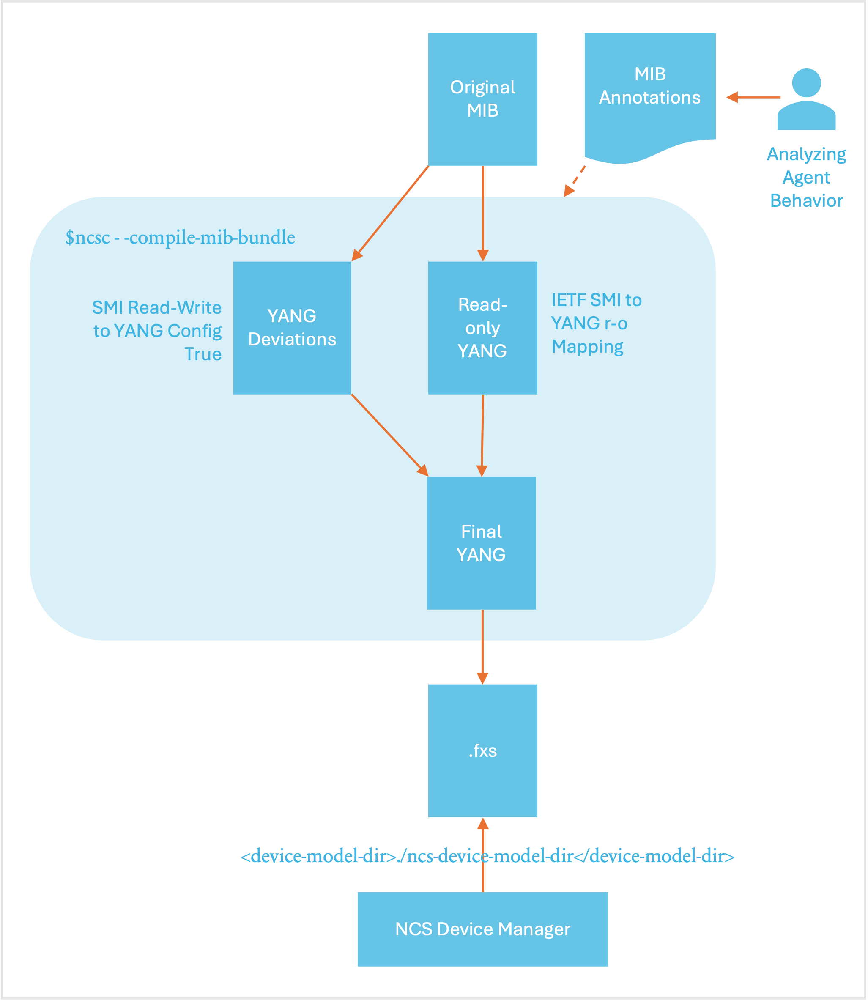

# SNMP NED

NSO can use SNMP to configure a managed device, under certain circumstances. SNMP in general is not suitable for configuration, and it is important to understand why:

* In SNMP, the size of a SET request, which is used to write to a device, is limited to what fits into one UDP packet. This means that a large configuration change must be split into many packets. Each such packet contains some parameters to set, and each such packet is applied on its own by the device. If one SET request out of many fails, there is no abort command to undo the already applied changes, meaning that rollback is very difficult.
* The data modeling language used in SNMP, SMIv2, does not distinguish between configuration objects and other writable objects. This means that it is not possible to retrieve only the configuration from a device without explicit, exact knowledge of all objects in all MIBs supported by the device.
* SNMP supports only two basic operations, read and write. There is no protocol support for creating or deleting data. Such operations must be modeled in the MIBs, explicitly.
* SMIv2 has limited support for semantic constraints in the data model. This means that it is difficult to know if a certain configuration will apply cleanly on a device. If it doesn't, rollback is tricky, as explained above.
* Because of all of the above, ordering of SET requests becomes very important. If a device refuses to create some object A before another B, an SNMP manager must make sure to create B before creating A. It is also common that objects cannot be modified without first making them disabled or inactive. There is no standard way to do this, so again, different data models do this in different ways.

Despite all this, if a device can be configured over SNMP, NSO can use its built-in multilingual SNMP manager to communicate with the device. However, to solve the problems mentioned above, the MIBs supported by the device need to be carefully annotated with some additional information that instructs NSO on how to write configuration data to the device. This additional information is described in detail below.

## Overview <a href="#d5e72" id="d5e72"></a>

To add a device, the following steps need to be followed. They are described in more detail in the following sections.

* Collect (a subset of) the MIBs supported by the device.
* Optionally, annotate the MIBs with annotations to instruct NSO on how to talk to the device, for example, ordering dependencies that are not explicitly modeled in the MIB. This step is not required.
* Compile the MIBs and load them into NSO.
* Configure NSO with the address and authentication parameter for the SNMP devices.
* Optionally configure a named MIB group in NSO with the MIBs supported by the device, and configure the managed device in NSO to use this MIB group. If this step is not done, NSO assumes the device implements all MIBs known to NSO.

## Compiling and Loading MIBs <a href="#d5e86" id="d5e86"></a>

(See the `Makefile` in the [examples.ncs/device-management/snmp-ned](https://github.com/NSO-developer/nso-examples/tree/6.6/device-management/snmp-ned) example under `packages/ex-snmp-ned/src/Makefile`, for an example of the below description.) Make sure that you have all MIBs available, including import dependencies, and that they contain no errors.

The `ncsc --ncs-compile-mib-bundle` compiler is used to compile MIBs and MIB annotation files into NSO load files. Assuming a directory with input MIB files (and optional MIB annotation files) exist, the following command compiles all the MIBs in `device-models` and writes the output to `ncs-device-model-dir`.

```bash
$ ncsc --ncs-compile-mib-bundle device-models \
    --ncs-device-dir ./ncs-device-model-dir
```

The compilation steps performed by the `ncsc --ncs-compile-mib-bundle` are elaborated below:

1. Transform the MIBs into YANG according to the IETF standardized mapping ([https://www.ietf.org/rfc/rfc6643.txt](https://www.ietf.org/rfc/rfc6643.txt)). The IETF-defined mapping makes all MIB objects read-only over NETCONF.
2. Generate YANG deviations from the MIB, this makes SMIv2 `read-write` objects YANG `config true` as a YANG deviation.
3. Include the optional MIB annotations.
4. Merge the read-only YANG from step 1 with the read-write deviation from step 2.
5. Compile the merged YANG files into NSO load format.

These steps are illustrated in the figure below:

<div data-with-frame="true"><figure><figcaption><p>SNMP NED Compile Steps</p></figcaption></figure></div>

Finally make sure that the NSO configuration file points to the correct device model directory:

```xml
<device-model-dir>./ncs-device-model-dir</device-model-dir>
```

## Configuring NSO to Speak SNMP Southbound <a href="#d5e120" id="d5e120"></a>

Each managed device is configured with a name, IP address, and port (161 by default), and the SNMP version to use (v1, v2c, or v3).

```cli
admin@host# show running-config devices device r3

address 127.0.0.1
port    2503
device-type snmp version v3 snmp-authgroup my-authgroup
state admin-state unlocked
```

To minimize the necessary configuration, the authentication group concept (see [Authentication Groups](../../../operation-and-usage/operations/nso-device-manager.md#user_guide.devicemanager.authgroups)) is used also for SNMP. A configured managed device of the type `snmp` refers to an SNMP authgroup. An SNMP authgroup contains community strings for SNMP v1 and v2c and USM parameters for SNMP v3.

```cli
admin@host# show running-config devices authgroups snmp-group my-authgroup

devices authgroups snmp-group my-authgroup
 default-map community-name public
 umap admin
  usm remote-name admin
  usm security-level auth-priv
  usm auth md5 remote-password $4$wIo7Yd068FRwhYYI0d4IDw==
  usm priv des remote-password $4$wIo7Yd068FRwhYYI0d4IDw==
 !
!
```

In the example above, when NSO needs to speak to the device `r3`, it sees that the device is of type `snmp`, and that SNMP v3 should be used with authentication parameters from the SNMP authgroup `my-authgroup`. This authgroup maps the local NSO user `admin` to the USM user `admin`, with explicit remote passwords given. These passwords will be localized for each SNMP engine that NSO communicates with. While the passwords above are shown encrypted, when you enter them in the CLI you write them in clear text. Note also that the remote engine ID is not configured; NSO performs a discovery process to find it automatically.

No NSO user other than `admin` is mapped by the `authgroup my-authgroup` for SNMP v3.

## **Configure MIB Groups**

With SNMP, there is no standardized, generic way for an SNMP manager to learn which MIBs an SNMP agent implements. By default, NSO assumes that an SNMP device implements all MIBs known to NSO, i.e., all MIBs that have been compiled with the `ncsc --ncs-compile-mib-bundle` command. This works just fine if all SNMP devices NSO manages are of the same type, and implement the same set of MIBs. But if NSO is configured to manage many different SNMP devices, some other mechanism is needed.

In NSO, this problem is solved by using MIB groups. MIB group is a named collection of MIB module names. A managed SNMP device can refer to one or more MIB groups. For example, below two MIB groups are defined:

```cli
admin@ncs# show running-config devices mib-group

devices mib-group basic
 mib-module [ BASIC-CONFIG-MIB BASIC-TC ]
!
devices mib-group snmp
 mib-module [ SNMP* ]
!
```

The wildcard `*` can be used only at the end of a string; it is thus used to define a prefix of the MIB module name. So the string `SNMP*` matches all loaded standard SNMP modules, such as SNMPv2-MIB, SNMP-TARGET-MIB, etc.

An SNMP device can then be configured to refer to one or more of the MIB groups:

```cli
admin@ncs# show running-config devices device r3 device-type snmp

devices device r3
 device-type snmp version v3
 device-type snmp snmp-authgroup default
 device-type snmp mib-group [ basic snmp ]
!
```

## Annotations for MIB Objects <a href="#d5e149" id="d5e149"></a>

Most annotations for MIB objects are used to instruct NSO on how to split a large transaction into suitable SNMP SET requests. This step is not necessary for a default integration. But when for example ordering dependencies in the MIB is discovered it is better to add this as annotations and let NSO handle the ordering rather than leaving it to the CLI user or Java programmer.

In some cases, NSO can automatically understand when rows in a table must be created or deleted before rows in some other table. Specifically, NSO understands that if table B has an INDEX object in table A (i.e., B sparsely augments A), then rows in table B must be created after rows in table B, and vice versa for deletions. NSO also understands that if table B AUGMENTS table A, then a row in table A must be created before any column in B is modified.

However, in some MIBs, table dependencies cannot be detected automatically. In this case, these tables must be annotated with a `sort-priority`. By default, all rows have sort-priority 0. If table A has a lower sort priority than table B, then rows in table A are created before rows in table B.

In some tables, existing rows cannot be modified unless the row is inactivated. Once inactive, the row can be modified and then activated again. Unfortunately, there is no formal way to declare this is SMIv2, so these tables must be annotated with two statements; `ned-set-before-row-modification` and `ned-modification-dependent`. The former is used to instruct NSO which column and which value is used to inactivate a row, and the latter is used on each column that requires the row to be inactivated before modification. `ned-modification-dependent` can be used in the same table as `ned-set-before-row-modification`, or in a table that augments or sparsely augments the table with `ned-set-before-row-modification`.

By default, NSO treats a writable SMIv2 object as configuration, except if the object is of type RowStatus. Any writable object that does not represent configuration must be listed in a MIB annotation file when the MIB is compiled, with the "operational" modifier.

When NSO retrieves data from an SNMP device, e.g., when doing a `sync from-device`, it uses the GET-NEXT request to scan the table for available rows. When doing the GET-NEXT, NSO must ask for an accessible column. If the row has a column of type RowStatus, NSO uses this column. Otherwise, if one of the INDEX objects is accessible, it uses this object. Otherwise, if the table has been annotated with `ned-accessible-column`, this column is used. And, as a last resort, NSO does not indicate any column in the first GET-NEXT request, and uses the column returned from the device in subsequent requests. If the table has "holes" for this column, i.e., the column is not instantiated in all rows, NSO will not detect those rows.

NSO can automatically create and delete table rows for tables that use the RowStatus TEXTUAL-CONVENTION, defined in RFC 2580.

It is pretty common to mix configuration objects with non-configuration objects in MIBs. Specifically, it is quite common that rows are created automatically by the device, but then some columns in the row are treated as configuration data. In this case, the application programmer must tell NSO to sync from the device before attempting to modify the configuration columns, to let NSO learn which rows exist on the device.

Some SNMP agents require a certain order of row deletions and creations. By default, the SNMP NED sends all creates before deletes. The annotation `ned-delete-before-create` can be used on a table entry to send row deletions before row creations, for that table.

Sometimes rows in some SNMP agents cannot be modified once created. Such rows can be marked with the annotation `ned-recreate-when-modified`. This makes the SNMP NED to first delete the row, and then immediately recreate it with the new values.

A good starting point for understanding annotations is to look at the example in the [examples.ncs/device-management/snmp-ned](https://github.com/NSO-developer/nso-examples/tree/6.6/device-management/snmp-ned) directory. The BASIC-CONFIG-MIB mib has a table where rows can be modified if the `bscActAdminState` is set to locked. To have NSO do this automatically when modifying entries rather than leaving it to users an annotation file can be created. See the `BASIC-CONFIG-MIB.miba` which contains the following:

```
## NCS Annotation module for BASIC-CONFIG-MIB

bscActAdminState  ned-set-before-row-modification = locked
bscActFlow        ned-modification-dependent
```

This tells NSO that before modifying the `bscActFlow` column set the `bscActAdminState` to locked and restore the previous value after committing the set operation.

All MIB annotations for a particular MIB are written to a file with the file suffix `.miba`. See [mib\_annotations(5)](../../../resources/man/mib_annotations.5.md) in manual pages for details.

Make sure that the MIB annotation file is put into the directory where all the MIB files are which is given as input to the `ncsc --ncs-compile-mib-bundle` command

## Using the SNMP NED <a href="#d5e185" id="d5e185"></a>

NSO can manage SNMP devices within transactions, a transaction can span Cisco devices, NETCONF devices, and SNMP devices. If a transaction fails NSO will generate the reverse operation to the SNMP device.

The basic features of the SNMP will be illustrated below by using the [examples.ncs/device-management/snmp-ned](https://github.com/NSO-developer/nso-examples/tree/6.6/device-management/snmp-ned) example. First, try to connect to all SNMP devices:

```cli
admin@ncs# devices connect

connect-result {
    device r1
    result true
    info (admin) Connected to r1 - 127.0.0.1:2501
}
connect-result {
    device r2
    result true
    info (admin) Connected to r2 - 127.0.0.1:2502
}
connect-result {
    device r3
    result true
    info (admin) Connected to r3 - 127.0.0.1:2503
}
```

When NSO executes the connect request for SNMP devices it performs a get-next request with 1.1 as var-bind. When working with the SNMP NED it is helpful to turn on the NED tracing:

```bash
$ ncs_cli -C -u admin
```

```
admin@ncs config
```

```cli
admin@ncs(config)# devices global-settings trace pretty trace-dir .
```

```cli
admin@ncs(config)# commit
```

```
Commit complete.
```

This creates a trace file named `ned-devicename.trace`. The trace for the NCS `connect` action looks like:

```bash
$ more ned-r1.trace
get-next-request reqid=2
    1.1
get-response reqid=2
    1.3.6.1.2.1.1.1.0=Tail-f ConfD agent - 1
```

When looking at SNMP trace files it is useful to have the OBJECT-DESCRIPTOR rather than the OBJECT-IDENTIFIER. To do this, pipe the trace file to the `smixlate` tool:

```bash
$ more ned-r1.trace | smixlate $NCS_DIR/src/ncs/snmp/mibs/SNMPv2-MIB.mib

get-next-request reqid=2
    1.1
get-response reqid=2
    sysDescr.0=Tail-f ConfD agent - 1
```

You can access the data in the SNMP systems directly (read-only and read-write objects):

```cli
admin@ncs# show devices device live-status

ncs live-device r1
 live-status SNMPv2-MIB system sysDescr "Tail-f ConfD agent - 1"
 live-status SNMPv2-MIB system sysObjectID 1.3.6.1.4.1.24961
 live-status SNMPv2-MIB system sysUpTime 596197
 live-status SNMPv2-MIB system sysContact ""
 live-status SNMPv2-MIB system sysName ""
...
```

NSO can synchronize all writable objects into CDB:

```cli
admin@ncs# devices sync-from
sync-result {
    device r1
    result true
...
```

```cli
admin@ncs# show running-config devices device r1 config r:SNMPv2-MIB

devices device r1
  config
    system
      sysContact  ""
      sysName     ""
      sysLocation ""
    !
    snmp
      snmpEnableAuthenTraps disabled;
    !
```

All the standard features of NSO with transactions and roll-backs will work with SNMP devices. The sequence below shows how to enable authentication traps for all devices as one transaction. If any device fails, NSO will automatically roll back the others. At the end of the CLI sequence a manual rollback is shown:

```cli
admin@ncs# config
```

<pre><code><strong>admin@ncs(config)# devices device r1-3 config r:SNMPv2-MIB snmp snmpEnableAuthenTraps enabled
</strong></code></pre>

```cli
admin@ncs(config)# commit
```

```
Commit complete.
```

```cli
admin@ncs(config)# top rollback-files apply-rollback-file id 0
```

```cli
admin@ncs(config)# commit dry-run outformat cli
```

```
cli  devices {
         device r1 {
             config {
                 r:SNMPv2-MIB {
                     snmp {
    -                    snmpEnableAuthenTraps enabled;
    +                    snmpEnableAuthenTraps disabled;
                     }
                 }
             }
         }
         device r2 {
             config {
                 r:SNMPv2-MIB {
                     snmp {
    -                    snmpEnableAuthenTraps enabled;
    +                    snmpEnableAuthenTraps disabled;
                     }
                 }
             }
         }
         device r3 {
             config {
                 r:SNMPv2-MIB {
                     snmp {
    -                    snmpEnableAuthenTraps enabled;
    +                    snmpEnableAuthenTraps disabled;
                     }
                 }
             }
         }
     }
```

```cli
admin@ncs(config)# commit
```

```
Commit complete.
```
