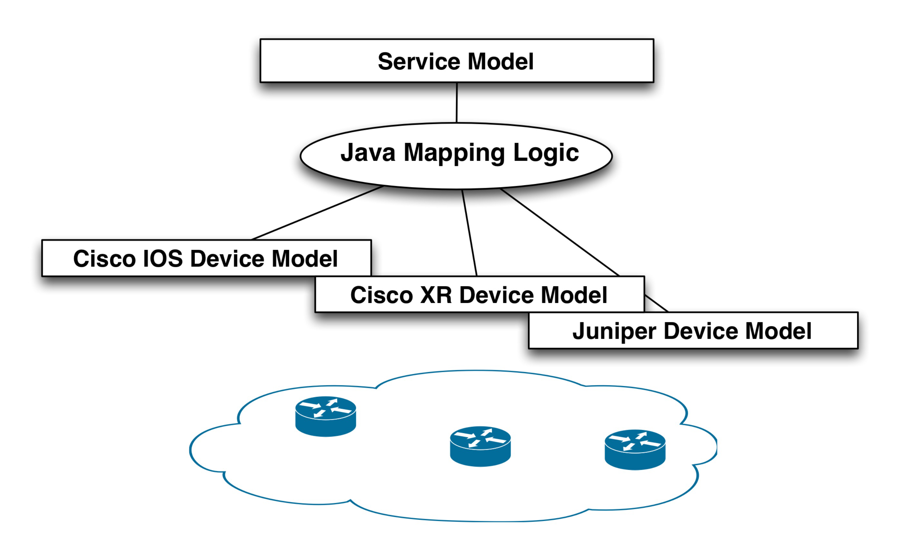
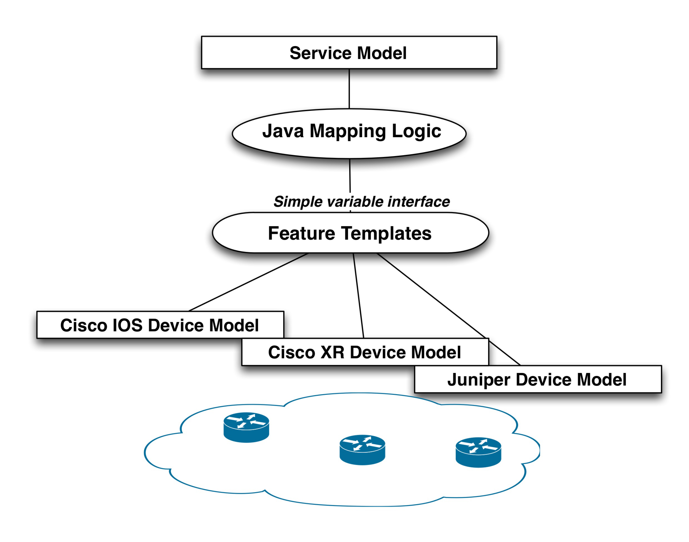

# Service Development Using Java

As using Java for service development may be somewhat more involved than Python, this section provides further examples and additional tips for setting up the development environment for Java.

The two examples, a simple VLAN service and a Layer 3 MPLS VPN service are more elaborate but show the same techniques as [Implementing Services](../../core-concepts/implementing-services.md).


If you or your team primarily focuses on services implemented in Python, feel free to skip or only skim through this section.


## Creating a Simple VLAN Service <a href="#ncs.development.services.mapping_template" id="ncs.development.services.mapping_template"></a>

In this example, you will create a simple VLAN service in Java. In order to illustrate the concepts, the device configuration is simplified from a networking perspective and only uses one single device type (Cisco IOS).

### Overview of Steps <a href="#d5e8278" id="d5e8278"></a>

We will first look at the following preparatory steps:

1. Prepare a simulated environment of Cisco IOS devices: in this example, we start from scratch in order to illustrate the complete development process. We will not reuse any existing NSO examples.
2. Generate a template service skeleton package: use NSO tools to generate a Java-based service skeleton package.
3. Write and test the VLAN Service Model.
4. Analyze the VLAN service mapping to IOS configuration.

These steps are no different from defining services using templates. Next is to start playing with the Java Environment:

1. Configuring the start and stop of the Java VM.
2. First look at the Service Java Code: introduction to service mapping in Java.
3. Developing by tailing log files.
4. Developing using Eclipse.

### Setting Up the Environment <a href="#d5e8299" id="d5e8299"></a>

We will start by setting up a run-time environment that includes simulated Cisco IOS devices and configuration data for NSO. Make sure you have sourced the `ncsrc` file.

1. Create a new directory that will contain the files for this example, such as:

```bash
$ mkdir ~/vlan-service
$ cd ~/vlan-service
```

2. Now, let's create a simulated environment with 3 IOS devices and an NSO that is ready to run with this simulated network:

```bash
$ ncs-netsim create-network $NCS_DIR/packages/neds/cisco-ios 3 c
$ ncs-setup --netsim-dir ./netsim/ --dest ./
```

3. Start the simulator and NSO:

```bash
$ ncs-netsim start
DEVICE c0 OK STARTED
DEVICE c1 OK STARTED
DEVICE c2 OK STARTED
$ ncs
```

4. Use the Cisco CLI towards one of the devices:

```bash
$ ncs-netsim cli-i c0
admin connected from 127.0.0.1 using console on ncs
c0> enable
c0# configure
Enter configuration commands, one per line. End with CNTL/Z.
c0(config)# show full-configuration
no service pad
no ip domain-lookup
no ip http server
no ip http secure-server
ip routing
ip source-route
ip vrf my-forward
bgp next-hop Loopback 1
!
...
```

5. Use the NSO CLI to get the configuration:

```bash
$ ncs_cli -C -u admin

admin connected from 127.0.0.1 using console on ncs
admin@ncs# devices sync-from
sync-result {
    device c0
    result true
}
sync-result {
    device c1
    result true
}
sync-result {
    device c2
    result true
}
admin@ncs# config
Entering configuration mode terminal

admin@ncs(config)# show full-configuration devices device c0 config
devices device c0
 config
  no ios:service pad
  ios:ip vrf my-forward
   bgp next-hop Loopback 1
  !
  ios:ip community-list 1 permit
  ios:ip community-list 2 deny
  ios:ip community-list standard s permit
  no ios:ip domain-lookup
  no ios:ip http server
  no ios:ip http secure-server
  ios:ip routing
...
```

6. Finally, set VLAN information manually on a device to prepare for the mapping later.

```cli
admin@ncs(config)# devices device c0 config ios:vlan 1234 
admin@ncs(config)# devices device c0 config ios:interface
                   FastEthernet 1/0 switchport mode trunk 
admin@ncs(config-if)# switchport trunk allowed vlan 1234 
admin@ncs(config-if)# top 

admin@ncs(config)# show configuration 
devices device c0
 config
  ios:vlan 1234
  !
  ios:interface FastEthernet1/0
   switchport mode trunk
   switchport trunk allowed vlan 1234
  exit
 !
!

admin@ncs(config)# commit 
```

### Creating a Service Package <a href="#d5e8336" id="d5e8336"></a>

1. In the run-time directory, you created:

```bash
$ ls -F1
README.ncs
README.netsim
logs/
ncs-cdb/
ncs.conf
netsim/
packages/
scripts/
state/
```

Note the `packages` directory, `cd` to it:

```bash
$ cd packages
$ ls -l
total 8
cisco-ios -> .../packages/neds/cisco-ios
```

Currently, there is only one package, the Cisco IOS NED.

2. We will now create a new package that will contain the VLAN service.

```bash
$ ncs-make-package --service-skeleton java vlan
$ ls
cisco-ios vlan
```

This creates a package with the following structure:

<figure><figcaption><p>Package Structure</p></figcaption></figure>

During the rest of this section, we will work with the `vlan/src/yang/vlan.yang` and `vlan/src/java/src/com/example/vlan/vlanRFS.java` files.

### The Service Model <a href="#d5e8361" id="d5e8361"></a>

So, if a user wants to create a new VLAN in the network what should the parameters be? Edit the `vlan/src/yang/vlan.yang` according to below:

```yang
  augment /ncs:services {
    list vlan {
      key name;

      uses ncs:service-data;
      ncs:servicepoint "vlan-servicepoint";
      leaf name {
        type string;
      }

      leaf vlan-id {
        type uint32 {
          range "1..4096";
        }
      }

      list device-if {
        key "device-name";
          leaf device-name {
            type leafref {
              path "/ncs:devices/ncs:device/ncs:name";
            }
          }
          leaf interface {
            type string;
          }
      }
    }
  }
```

This simple VLAN service model says:

1. We give a VLAN a name, for example `net-1`.
2. The VLAN has an id from 1 to 4096.
3. The VLAN is attached to a list of devices and interfaces. In order to make this example as simple as possible the interface name is just a string. A more correct and useful example would specify this is a reference to an interface to the device, but for now it is better to keep the example simple.

The VLAN service list is augmented into the services tree in NSO. This specifies the path to reach VLANs in the CLI, REST, etc. There are no requirements on where the service shall be added into NCS, if you want VLANs to be at the top level, simply remove the augments statement.

Make sure you keep the lines generated by the `ncs-make-package`:

```
uses ncs:service-data;
ncs:servicepoint "vlan-servicepoint";
```

The two lines tell NSO that this is a service. The first line expands to a YANG structure that is shared amongst all services. The second line connects the service to the Java callback.

To build this service model, `cd` to `packages/vlan/src` and type `make` (assumes that you have the prerequisite `make` build system installed).

```bash
$ cd packages/vlan/src/
$ make
```

We can now test the service model by requesting NSO to reload all packages:

```bash
$ ncs_cli -C -U admin
admin@ncs# packages reload
>>> System upgrade is starting.
>>> Sessions in configure mode must exit to operational mode.
>>> No configuration changes can be performed until upgrade has completed.
>>> System upgrade has completed successfully.
result Done
```

You can also stop and start NSO, but then you have to pass the option `--with-package-reload` when starting NSO. This is important, NSO does not by default take any changes in packages into account when restarting. When packages are reloaded the `state/packages-in-use` is updated.

Now, create a VLAN service, (nothing will happen since we have not defined any mapping).

```cli
admin@ncs(config)# services vlan net-0 vlan-id 1234 device-if c0 interface 1/0
admin@ncs(config-device-if-c0)# top
admin@ncs(config)# commit
```

Now, let us move on and connect that to some device configuration using Java mapping. Note well that Java mapping is not needed, templates are more straightforward and recommended but we use this as a "Hello World" introduction to Java service programming in NSO. Also at the end, we will show how to combine Java and templates. Templates are used to define a vendor-independent way of mapping service attributes to device configuration and Java is used as a thin layer before the templates to do logic, call-outs to external systems, etc.

### Managing the NSO Java VM <a href="#d5e8401" id="d5e8401"></a>

The default configuration of the Java VM is:

```cli
admin@ncs(config)# show full-configuration java-vm | details
java-vm stdout-capture enabled
java-vm stdout-capture file ./logs/ncs-java-vm.log
java-vm connect-time           60
java-vm initialization-time    60
java-vm synchronization-timeout-action log-stop
```

By default, NCS will start the Java VM by invoking the command `$NCS_DIR/bin/ncs-start-java-vm`. That script will invoke

```bash
$ java com.tailf.ncs.NcsJVMLauncher
```

The class `NcsJVMLauncher` contains the `main()` method. The started Java VM will automatically retrieve and deploy all Java code for the packages defined in the load path of the `ncs.conf` file. No other specification than the `package-meta-data.xml` for each package is needed.

The verbosity of Java error messages can be controlled by:

```cli
admin@ncs(config)# java-vm exception-error-message verbosity
Possible completions:
  standard  trace  verbose
```

For more details on the Java VM settings, see [NSO Java VM](../../core-concepts/nso-virtual-machines/nso-java-vm.md).

### A First Look at Java Development <a href="#d5e8420" id="d5e8420"></a>

The service model and the corresponding Java callback are bound by the servicepoint name. Look at the service model in `packages/vlan/src/yang`:

<figure><figcaption><p>VLAN Service Model Service Point</p></figcaption></figure>

The corresponding generated Java skeleton, (one print 'Hello World!' statement added):

<figure><figcaption><p>Java Service Create Callback</p></figcaption></figure>

Modify the generated code to include the print "Hello World!" statement in the same way. Re-build the package:

```bash
$ cd packages/vlan/src/
$ make
```

Whenever a package has changed, we need to tell NSO to reload the package. There are three ways:

1. Just reload the implementation of a specific package, will not load any model changes: `admin@ncs# packages package vlan redeploy`.
2. Reload all packages including any model changes: `admin@ncs# packages reload`.
3. Restart NSO with reload option: `$ncs --with-package-reload`.

When that is done we can create a service (or modify an existing one) and the callback will be triggered:

```cli
admin@ncs(config)# vlan net-0 vlan-id 888
admin@ncs(config-vlan-net-0)# commit
```

Now, have a look at the `logs/ncs-java-vm.log`:

```bash
$ tail ncs-java-vm.log
...
<INFO> 03-Mar-2014::16:55:23.705 NcsMain JVM-Launcher: \
       - REDEPLOY PACKAGE COLLECTION  --> OK
<INFO> 03-Mar-2014::16:55:23.705 NcsMain JVM-Launcher: \
       - REDEPLOY ["vlan"] --> DONE
<INFO> 03-Mar-2014::16:55:23.706 NcsMain JVM-Launcher: \
       - DONE COMMAND --> REDEPLOY_PACKAGE
<INFO> 03-Mar-2014::16:55:23.706 NcsMain JVM-Launcher: \
       - READ SOCKET =>
Hello World!
```

Tailing the `ncs-java-vm.log` is one way of developing. You can also start and stop the Java VM explicitly and see the trace in the shell. To do this, tell NSO not to start the VM by adding the following snippet to `ncs.conf`:

```xml
<java-vm>
    <auto-start>false</auto-start>
</java-vm>
```

Then, after restarting NSO or reloading the configuration, from the shell prompt:

```bash
$ ncs-start-java-vm
.....
.. all stdout from JVM
```

So modifying or creating a VLAN service will now have the "Hello World!" string show up in the shell. You can modify the package, then reload/redeploy, and see the output.

### Using Eclipse <a href="#d5e8467" id="d5e8467"></a>

To use a GUI-based IDE Eclipse, first generate an environment for Eclipse:

```bash
$ ncs-setup --eclipse-setup
```

This will generate two files, `.classpath` and `.project`. If we add this directory to Eclipse as a **File** -> **New** -> J**ava Project**, uncheck the **Use default location** and enter the directory where the `.classpath` and `.project` have been generated.

We are immediately ready to run this code in Eclipse.

<figure><figcaption><p>Creating the Project in Eclipse</p></figcaption></figure>

All we need to do is choose the `main()` routine in the `NcsJVMLauncher` class. The Eclipse debugger works now as usual, and we can, at will, start and stop the Java code.


**Timeouts**

A caveat worth mentioning here is that there exist a few timeouts between NSO and the Java code that will trigger when we are in the debugger. While developing with the Eclipse debugger and breakpoints, we typically want to disable these timeouts.

First, we have the three timeouts in `ncs.conf` that matter. Set the three values of `/ncs-config/api/new-session-timeout`, `/ncs-config/api/query-timeout`, and `/ncs-config/api/connect-timeout` to a large value (see man page [ncs.conf(5)](https://developer.cisco.com/docs/nso-api-6.4/ncs-man-pages-volume-5/#man.5.ncs.conf) for a detailed description on what those values are). If these timeouts are triggered, NSO will close all sockets to the Java VM.

```bash
$ cp $NCS_DIR/etc/ncs/ncs.conf .
```


Edit the file and enter the following XML entry just after the Webui entry:

```xml
<api>
    <new-session-timeout>PT1000S</new-session-timeout>
    <query-timeout>PT1000S</query-timeout>
    <connect-timeout>PT1000S</connect-timeout>
</api>
```

Now, restart `ncs`, and from now on start it as:

```bash
$ ncs -c ./ncs.conf
```

You can verify that the Java VM is not running by checking the package status:

```cli
admin@ncs# show packages package vlan
packages package vlan
 package-version 1.0
 description     "Skeleton for a resource facing service - RFS"
 ncs-min-version 3.0
 directory       ./state/packages-in-use/1/vlan
 component RFSSkeleton
  callback java-class-name [ com.example.vlan.vlanRFS ]
 oper-status java-uninitialized
```

Create a new project and start the launcher `main` in Eclipse:

<figure><figcaption><p>Starting the NSO JVM from Eclipse</p></figcaption></figure>

You can start and stop the Java VM from Eclipse. Note well that this is not needed since the change cycle is: modify the Java code, `make` in the `src` directory, and then reload the package. All while NSO and the JVM are running.

Change the VLAN service and see the console output in Eclipse:

<figure><figcaption><p>Console Output in Eclipse</p></figcaption></figure>

Another option is to have Eclipse connect to the running VM. Start the VM manually with the `-d` option.

```bash
$ ncs-start-java-vm -d
Listening for transport dt_socket at address: 9000
NCS JVM STARTING
...
```

Then you can set up Eclipse to connect to the NSO Java VM:

<figure><figcaption><p>Connecting to NSO Java VM Remote with Eclipse</p></figcaption></figure>

In order for Eclipse to show the NSO code when debugging, add the NSO Source Jars (add external Jar in Eclipse):

<figure><figcaption><p>Adding the NSO Source Jars</p></figcaption></figure>

Navigate to the service `create` for the VLAN service and add a breakpoint:

<figure><figcaption><p>Setting a break-point in Eclipse</p></figcaption></figure>

Commit a change of a VLAN service instance and Eclipse will stop at the breakpoint:

<figure><figcaption><p>Service Create breakpoint</p></figcaption></figure>

### Writing the Service Code

#### **Fetching the Service Attributes**

So the problem at hand is that we have service parameters and a resulting device configuration. Previously, we showed how to do that with templates. The same principles apply in Java. The service model and the device models are YANG models in NSO irrespective of the underlying protocol. The Java mapping code transforms the service attributes to the corresponding configuration leafs in the device model.

The NAVU API lets the Java programmer navigate the service model and the device models as a DOM tree. Have a look at the `create` signature:

```java
 @ServiceCallback(servicePoint="vlan-servicepoint",
        callType=ServiceCBType.CREATE)
    public Properties create(ServiceContext context,
                             NavuNode service,
                             NavuNode ncsRoot,
                             Properties opaque)
                             throws DpCallbackException {
```

Two NAVU nodes are passed: the actual service `service`instance and the NSO root `ncsRoot`.

We can have a first look at NAVU by analyzing the first `try` statement:

```
try {
            // check if it is reasonable to assume that devices
            // initially has been sync-from:ed
            NavuList managedDevices =
            ncsRoot.container("devices").list("device");
            for (NavuContainer device : managedDevices) {
                if (device.list("capability").isEmpty()) {
                    String mess = "Device %1$s has no known capabilities, " +
                                   "has sync-from been performed?";
                    String key = device.getKey().elementAt(0).toString();
                    throw new DpCallbackException(String.format(mess, key));
                }
            }
```

NAVU is a lazy evaluated DOM tree that represents the instantiated YANG model. So knowing the NSO model: `devices/device`, (`container/list`) corresponds to the list of capabilities for a device, this can be retrieved by `ncsRoot.container("devices").list("device")`.

The `service` node can be used to fetch the values of the VLAN service instance:

* `vlan/name`
* `vlan/vlan-id`
* `vlan/device-if/device and vlan/device-if/interface`

The first snippet that iterates the service model and prints to the console looks like below:

<figure><figcaption><p>The first Example</p></figcaption></figure>

The `com.tailf.conf` package contains Java Classes representing the YANG types like `ConfUInt32`.

Try it out in the following sequence:

1. **Rebuild the Java Code**: In `packages/vlan/src` type `make`.
2. **Reload the Package**: In the NSO Cisco CLI, do `admin@ncs# packages package vlan redeploy`.
3. **Create or Modify a `vlan` Service**: In NSO CLI, do `admin@ncs(config)# services vlan net-0 vlan-id 844 device-if c0 interface 1/0`, and commit.

#### **Mapping Service Attributes to Device Configuration**

<figure><figcaption><p>Fetching Values from the Service Instance</p></figcaption></figure>

Remember the `service` attribute is passed as a parameter to the create method. As a starting point, look at the first three lines:

1. To reach a specific leaf in the model use the NAVU leaf method with the name of the leaf as a parameter. This leaf then has various methods like getting the value as a string.
2. `service.leaf("vlan-id")` and `service.leaf(vlan._vlan_id_)` are two ways of referring to the VLAN-id leaf of the service. The latter alternative uses symbols generated by the compilation steps. If this alternative is used, you get the benefit of compilation time checking. From this leaf you can get the value according to the type in the YANG model `ConfUInt32` in this case.
3. Line 3 shows an example of casting between types. In this case, we prepare the VLAN ID as a 16 unsigned int for later use.

The next step is to iterate over the devices and interfaces. The NAVU `elements()` returns the elements of a NAVU list.

<figure><figcaption><p>Iterating a List in the Service Model</p></figcaption></figure>

In order to write the mapping code, make sure you have an understanding of the device model. One good way of doing that is to create a corresponding configuration on one device and then display that with the pipe target `display xpath`. Below is a CLI output that shows the model paths for `FastEthernet 1/0`:

```cli
admin@ncs% show devices device c0 config ios:interface
           FastEthernet 1/0 | display xpath 

/devices/device[name='c0']/config/ios:interface/
         FastEthernet[name='1/0']/switchport/mode/trunk

/devices/device[name='c0']/config/ios:interface/
         FastEthernet[name='1/0']/switchport/trunk/allowed/vlan/vlans [ 111 ]
```

Another useful tool is to render a tree view of the model:

```bash
$ pyang -f jstree tailf-ned-cisco-ios.yang -o ios.html
```

This can then be opened in a Web browser and model paths are shown to the right:

<figure><figcaption><p>The Cisco IOS Model</p></figcaption></figure>

Now, we replace the print statements with setting real configuration on the devices.

<figure><figcaption><p>Setting the VLAN List</p></figcaption></figure>

Let us walk through the above code line by line. The `device-name` is a `leafref`. The `deref` method returns the object that the `leafref` refers to. The `getParent()` might surprise the reader. Look at the path for a leafref: `/device/name/config/ios:interface/name`. The `name` leafref is the key that identifies a specific interface. The `deref` returns that key, while we want to have a reference to the interface, (`/device/name/config/ios:interface`), that is the reason for the `getParent()`.

The next line sets the VLAN list on the device. Note well that this follows the paths displayed earlier using the NSO CLI. The `sharedCreate()` is important, it creates device configuration based on this service, and it says that other services might also create the same value, "shared". Shared create maintains reference counters for the created configuration in order for the service deletion to delete the configuration only when the last service is deleted. Finally, the interface name is used as a key to see if the interface exists, `"containsNode()"`.

The last step is to update the VLAN list for each interface. The code below adds an element to the VLAN `leaf-list`.

```
// The interface
NavuNode theIf = feIntfList.elem(feIntfName);
theIf.container("switchport").
      sharedCreate().
      container("mode").
      container("trunk").
      sharedCreate();
// Create the VLAN leaf-list element
theIf.container("switchport").
      container("trunk").
      container("allowed").
      container("vlan").
      leafList("vlans").
      sharedCreate(vlanID16);
```

Note that the code uses the `sharedCreate()` functions instead of `create()`, as the shared variants are preferred and a best practice.

The above `create` method is all that is needed for create, read, update, and delete. NSO will automatically handle any changes, like changing the VLAN ID, adding an interface to the VLAN service, and deleting the service. This is handled by the FASTMAP engine, it renders any change based on the single definition of the create method.

## Simple VLAN Service with Templates <a href="#d5e8653" id="d5e8653"></a>

### Overview

The mapping strategy using only Java is illustrated in the following figure.

<figure><figcaption><p>Flat Mapping with Java</p></figcaption></figure>

This strategy has some drawbacks:

* Managing different device vendors. If we would introduce more vendors in the network this would need to be handled by the Java code. Of course, this can be factored into separate classes in order to keep the general logic clean and just pass the device details to specific vendor classes, but this gets complex and will always require Java programmers to introduce new device types.
* No clear separation of concerns, domain expertise. The general business logic for a service is one thing, detailed configuration knowledge of device types is something else. The latter requires network engineers and the first category is normally separated into a separate team that deals with OSS integration.

Java and templates can be combined:

<figure><figcaption><p>Two Layered Mapping using Feature Templates</p></figcaption></figure>

In this model, the Java layer focuses on required logic, but it never touches concrete device models from various vendors. The vendor-specific details are abstracted away using feature templates. The templates take variables as input from the service logic, and the templates in turn transform these into concrete device configuration. The introduction of a new device type does not affect the Java mapping.

This approach has several benefits:

* The service logic can be developed independently of device types.
* New device types can be introduced at runtime without affecting service logic.
* Separation of concerns: network engineers are comfortable with templates, they look like a configuration snippet. They have expertise in how configuration is applied to real devices. People defining the service logic often are more programmers, they need to interface with other systems, etc, this suites a Java layer.

Note that the logic layer does not understand the device types, the templates will dynamically apply the correct leg of the template depending on which device is touched.

### The VLAN Feature Template <a href="#d5e8684" id="d5e8684"></a>

From an abstraction point of view, we want a template that takes the following variables:

* VLAN ID
* Device and interface

So the mapping logic can just pass these variables to the feature template and it will apply it to a multi-vendor network.

Create a template as described before.

* Create a concrete configuration on a device, or several devices of different type
* Request NSO to display that as XML
* Replace values with variables

This results in a feature template like below:

```xml
<!-- Feature Parameters -->
<!-- $DEVICE -->
<!-- $VLAN_ID -->
<!-- $INTF_NAME -->

<config-template xmlns="http://tail-f.com/ns/config/1.0"
                 servicepoint="vlan">
  <devices xmlns="http://tail-f.com/ns/ncs">
    <device>
      <name>{$DEVICE}</name>
      <config>
        <vlan xmlns="urn:ios" tags="merge">
          <vlan-list>
            <id>{$VLAN_ID}</id>
          </vlan-list>
        </vlan>
        <interface xmlns="urn:ios" tags="merge">
          <FastEthernet tags="nocreate">
            <name>{$INTF_NAME}</name>
            <switchport>
              <trunk>
                <allowed>
                  <vlan tags="merge">
                    <vlans>{$VLAN_ID}</vlans>
                  </vlan>
                </allowed>
              </trunk>
            </switchport>
          </FastEthernet>
        </interface>
      </config>
    </device>
  </devices>
</config-template>
```

This template only maps to Cisco IOS devices (the `xmlns="urn:ios"` namespace), but you can add "legs" for other device types at any point in time and reload the package.


Nodes set with a template variable evaluating to the empty string are ignored, e.g., the setting \<some-tag>{$VAR}\</some-tag> is ignored if the template variable $VAR evaluates to the empty string. However, this does not apply to XPath expressions evaluating to the empty string. A template variable can be surrounded by the XPath function string() if it is desirable to set a node to the empty string.


### The VLAN Java Logic <a href="#d5e8703" id="d5e8703"></a>

The Java mapping logic for applying the template is shown below:

<figure><figcaption><p>Mapping Logic using a Template</p></figcaption></figure>

Note that the Java code has no clue about the underlying device type, it just passes the feature variables to the template. At run-time, you can update the template with mapping to other device types. The Java code stays untouched, if you modify an existing VLAN service instance to refer to the new device type the `commit` will generate the corresponding configuration for that device.

The smart reader will complain, "Why do we have the Java layer at all?", this could have been done as a pure template solution. That is true, but now this simple Java layer gives room for arbitrary complex service logic before applying the template.

### Steps to Build a Java and Template Solution <a href="#d5e8714" id="d5e8714"></a>

The steps to build the solution described in this section are:

1. Create a run-time directory: `$ mkdir ~/service-template; cd ~/service-template`.
2. Generate a netsim environment: `$ ncs-netsim create-network $NCS_DIR/packages/neds/cisco-ios 3 c`.
3. Generate the NSO runtime environment: `$ ncs-setup --netsim-dir ./netsim --dest ./`.
4. Create the VLAN package in the packages directory: `$ cd packages; ncs-make-package --service-skeleton java vlan`.
5. Create a template directory in the VLAN package: `$ cd vlan; mkdir templates`.
6. Save the above-described template in `packages/vlan/templates`.
7. Create the YANG service model according to the above: `packages/vlan/src/yang/vlan.yang`.
8. Update the Java code according to the above: `packages/vlan/src/java/src/com/example/vlan/vlanRFS.java`.
9. Build the package: in `packages/vlan/src` do `make`.
10. Start NSO.

## Layer 3 MPLS VPN Service <a href="#d5e8748" id="d5e8748"></a>

This service shows a more elaborate service mapping. It is based on the `examples.ncs/service-provider/mpls-vpn` example.

MPLS VPNs are a type of Virtual Private Network (VPN) that achieves segmentation of network traffic using Multiprotocol Label Switching (MPLS), often found in Service Provider (SP) networks. The Layer 3 variant uses BGP to connect and distribute routes between sites of the VPN.

The figure below illustrates an example configuration for one leg of the VPN. Configuration items in bold are variables that are generated from the service inputs.

<figure><figcaption><p>Example L3 VPN Device Configuration</p></figcaption></figure>

### Auxiliary Service Data

Sometimes the input parameters are enough to generate the corresponding device configurations. But in many cases, this is not enough. The service mapping logic may need to reach out to other data in order to generate the device configuration. This is common in the following scenarios:

* **Policies**: it might make sense to define policies that can be shared between service instances. The policies, for example, QoS, have data models of their own (not service models) and the mapping code reads from that.
* **Topology Information**: the service mapping might need to know connected devices, like which PE the CE is connected to.
* R**esources like VLAN IDs, and IP Addresses**: these might not be given as input parameters. This can be modeled separately in NSO or fetched from an external system.

It is important to design the service model to consider the above examples: what is input? what is available from other sources? This example illustrates how to define QoS policies "on the side". A reference to an existing QoS policy is passed as input. This is a much better principle than giving all QoS parameters to every service instance. Note well that if you modify the QoS definitions that services are referring to, this will not change the existing services. In order to have the service to read the changed policies you need to perform a **re-deploy** on the service.

This example also uses a list that maps every CE to a PE. This list needs to be populated before any service is created. The service model only has the CE as input parameter, and the service mapping code performs a lookup in this list to get the PE. If the underlying topology changes a service re-deploy will adopt the service to the changed CE-PE links. See more on topology below.

NSO has a package to manage resources like VLAN and IP addresses as a pool within NSO. In this way the resources are managed within the transaction. The mapping code could also reach out externally to get resources. Nano services are recommended for this.

### Topology <a href="#d5e8773" id="d5e8773"></a>

Using topology information in the instantiation of an NSO service is a common approach, but also an area with many misconceptions. Just like a service in NSO takes a black-box view of the configuration needed for that service in the network NSO treats topologies in the same way. It is of course common that you need to reference topology information in the service but it is highly desirable to have a decoupled and self-sufficient service that only uses the part of the topology that is interesting/needed for the specific service should be used.

Other parts of the topology could either be handled by other services or just let the network state sort it out - it does not necessarily relate to the configuration of the network. A routing protocol will for example handle the IP path through the network.

It is highly desirable to not introduce unneeded dependencies towards network topologies in your service.

To illustrate this, let's look at a Layer 3 MPLS VPN service. A logical overview of an MPLS VPN with three endpoints could look something like this. CE routers connecting to PE routers, that are connected to an MPLS core network. In the MPLS core network, there are a number of P routers.

<figure><figcaption><p>Simple MPLS VPN Topology</p></figcaption></figure>

In the service model, you only want to configure the CE devices to use as endpoints. In this case, topology information could be used to sort out what PE router each CE router is connected to. However, what type of topology do you need? Lets look at a more detailed picture of what the L1 and L2 topology could look like for one side of the picture above.

<figure><figcaption><p>L1-L2 Topology</p></figcaption></figure>

In pretty much all networks there is an access network between the CE and PE router. In the picture above the CE routers are connected to local Ethernet switches connected to a local Ethernet access network, connected through optical equipment. The local Ethernet access network is connected to a regional Ethernet access network, connected to the PE router. Most likely the physical connections between the devices in this picture have been simplified, in the real world redundant cabling would be used. The example above is of course only one example of how an access network could look like and it is very likely that a service provider have different access technologies. For example Ethernet, ATM, or a DSL-based access network.

Depending on how you design the L3VPN service, the physical cabling or the exact traffic path taken in the layer 2 Ethernet access network might not be that interesting, just like we don't make any assumptions or care about how traffic is transported over the MPLS core network. In both these cases we trust the underlying protocols handling state in the network, spanning tree in the Ethernet access network, and routing protocols like BGP in the MPLS cloud. Instead in this case, it could make more sense to have a separate NSO service for the access network, both so it can be reused for both for example L3VPNs and L2VPN but also to not tightly couple to the access network with the L3VPN service since it can be different (Ethernet or ATM etc.).

Looking at the topology again from the L3VPN service perspective, if services assume that the access network is already provisioned or taken care of by another service, it could look like this.

<figure><figcaption><p>Black-box Topology</p></figcaption></figure>

The information needed to sort out what PE router a CE router is connected to as well as configuring both CE and PE routers is:

* Interface on the CE router that is connected to the PE router, and IP address of that interface.
* Interface on the PE router that is connected to the CE router, and IP address to the interface.

### Creating a Multi-Vendor Service <a href="#d5e8807" id="d5e8807"></a>

This section describes the creation of an MPLS L3VPN service in a multi-vendor environment by applying the concepts described above. The example discussed can be found in `examples.ncs/service-provider/mpls-vpn`. The example network consists of Cisco ASR 9k and Juniper core routers (P and PE) and Cisco IOS-based CE routers.

The goal of the NSO service is to set up an MPLS Layer3 VPN on a number of CE router endpoints using BGP as the CE-PE routing protocol. Connectivity between the CE and PE routers is done through a Layer2 Ethernet access network, which is out of the scope of this service. In a real-world scenario, the access network could for example be handled by another service.

In the example network, we can also assume that the MPLS core network already exists and is configured.

<figure><figcaption><p>The MPLS VPN Example</p></figcaption></figure>

#### **YANG Service Model Design**

When designing service YANG models there are a number of things to take into consideration. The process usually involves the following steps:

1. Identify the resulting device configurations for a deployed service instance.
2. Identify what parameters from the device configurations are common and should be put in the service model.
3. Ensure that the scope of the service and the structure of the model work with the NSO architecture and service mapping concepts. For example, avoid unnecessary complexities in the code to work with the service parameters.
4. Ensure that the model is structured in a way so that integration with other systems north of NSO works well. For example, ensure that the parameters in the service model map to the needed parameters from an ordering system.

Steps 1 and 2: Device Configurations and Identifying Parameters:

Deploying an MPLS VPN in the network results in the following basic CE and PE configurations. The snippets below only include the Cisco IOS and Cisco IOS-XR configurations. In a real process, all applicable device vendor configurations should be analyzed.


```
  interface GigabitEthernet0/1.77
   description Link to PE / pe0 - GigabitEthernet0/0/0/3
   encapsulation dot1Q 77
   ip address 192.168.1.5 255.255.255.252
   service-policy output volvo
  !
  policy-map volvo
   class class-default
    shape average 6000000
   !
  !
 interface GigabitEthernet0/11
   description volvo local network
   ip address 10.7.7.1 255.255.255.0
  exit
  router bgp 65101
   neighbor 192.168.1.6 remote-as 100
   neighbor 192.168.1.6 activate
   network 10.7.7.0
  !
```



```
  vrf volvo
   address-family ipv4 unicast
    import route-target
     65101:1
    exit
    export route-target
     65101:1
    exit
   exit
  exit
  policy-map volvo-ce1
   class class-default
    shape average 6000000 bps
   !
   end-policy-map
  !
  interface GigabitEthernet 0/0/0/3.77
   description Link to CE / ce1 - GigabitEthernet0/1
   ipv4 address 192.168.1.6 255.255.255.252
   service-policy output volvo-ce1
   vrf         volvo
   encapsulation dot1q 77
  exit
  router bgp 100
   vrf volvo
    rd 65101:1
    address-family ipv4 unicast
    exit
    neighbor 192.168.1.5
     remote-as 65101
     address-family ipv4 unicast
      as-override
     exit
    exit
   exit
  exit
```


The device configuration parameters that need to be uniquely configured for each VPN have been marked in bold.

Steps 3 and 4: Model Structure and Integration with other Systems:

When configuring a new MPLS l3vpn in the network we will have to configure all CE routers that should be interconnected by the VPN, as well as the PE routers they connect to.

However, when creating a new l3vpn service instance in NSO it would be ideal if only the endpoints (CE routers) are needed as parameters to avoid having knowledge about PE routers in a northbound order management system. This means a way to use topology information is needed to derive or compute what PE router a CE router is connected to. This makes the input parameters for a new service instance very simple. It also makes the entire service very flexible, since we can move CE and PE routers around, without modifying the service configuration.

Resulting YANG Service Model:

```yang
container vpn {

  list l3vpn {
    tailf:info "Layer3 VPN";

    uses ncs:service-data;
    ncs:servicepoint l3vpn-servicepoint;

    key name;
    leaf name {
      tailf:info "Unique service id";
      type string;
    }
    leaf as-number {
      tailf:info "MPLS VPN AS number.";
      mandatory true;
      type uint32;
    }

    list endpoint {
      key id;
      leaf id {
        tailf:info "Endpoint identifier";
        type string;
      }
      leaf ce-device {
         mandatory true;
         type leafref {
           path "/ncs:devices/ncs:device/ncs:name";
         }
      }
      leaf ce-interface {
        mandatory true;
        type string;
      }
      leaf ip-network {
        tailf:info “private IP network”;
        mandatory true;
        type inet:ip-prefix;
      }
      leaf bandwidth {
        tailf:info "Bandwidth in bps";
        mandatory true;
        type uint32;
      }
    }
  }
}
```

The snipped above contains the l3vpn service model. The structure of the model is very simple. Every VPN has a name, an as-number, and a list of all the endpoints in the VPN. Each endpoint has:

* A unique ID.
* A reference to a device (a CE router in our case).
* A pointer to the LAN local interface on the CE router. This is kept as a string since we want this to work in a multi-vendor environment.
* LAN private IP network.
* Bandwidth on the VPN connection.

To be able to derive the CE to PE connections we use a very simple topology model. Notice that this YANG snippet does not contain any service point, which means that this is not a service model but rather just a YANG schema letting us store information in CDB.

```yang
container topology {
  list connection {
    key name;
    leaf name {
      type string;
    }
    container endpoint-1 {
      tailf:cli-compact-syntax;
      uses connection-grouping;
    }
    container endpoint-2 {
      tailf:cli-compact-syntax;
      uses connection-grouping;
    }
    leaf link-vlan {
      type uint32;
    }
  }
}

grouping connection-grouping {
  leaf device {
    type leafref {
      path "/ncs:devices/ncs:device/ncs:name";
    }
  }
  leaf interface {
    type string;
  }
  leaf ip-address {
    type tailf:ipv4-address-and-prefix-length;
  }
}
```

The model basically contains a list of connections, where each connection points out the device, interface, and IP address in each of the connections.

### Defining the Mapping <a href="#d5e8888" id="d5e8888"></a>

Since we need to look up which PE routers to configure using the topology model in the mapping logic it is not possible to use a declarative configuration template-based mapping. Using Java and configuration templates together is the right approach.

The Java logic lets you set a list of parameters that can be consumed by the configuration templates. One huge benefit of this approach is that all the parameters set in the Java code are completely vendor-agnostic. When writing the code, there is no need for knowledge of what kind of devices or vendors exist in the network, thus creating an abstraction of vendor-specific configuration. This also means that in to create the configuration template there is no need to have knowledge of the service logic in the Java code. The configuration template can instead be created and maintained by subject matter experts, the network engineers.

With this service mapping approach, it makes sense to modularize the service mapping by creating configuration templates on a per-feature level, creating an abstraction for a feature in the network. In this example means, we will create the following templates:

* CE router
* PE router

This is both to make services easier to maintain and create but also to create components that are reusable from different services. This can of course be even more detailed with templates with for example BGP or interface configuration if needed.

Since the configuration templates are decoupled from the service logic it is also possible to create and add additional templates in a running NSO system. You can for example add a CE router from a new vendor to the layer3 VPN service by only creating a new configuration template, using the set of parameters from the service logic, to a running NSO system without changing anything in the other logical layers.

<figure><figcaption><p>The MPLS VPN Example</p></figcaption></figure>

#### **The Java Code**

The Java code part for the service mapping is very simple and follows the following pseudo code steps:

```
READ topology
FOR EACH endpoint
        USING topology
DERIVE connected-pe-router
                READ ce-pe-connection
        SET pe-parameters
        SET ce-parameters
        APPLY TEMPLATE l3vpn-ce
        APPLY TEMPLATE l3vpn-pe
```

This section will go through relevant parts of Java outlined by the pseudo-code above. The code starts with defining the configuration templates and reading the list of endpoints configured and the topology. The Navu API is used for navigating the data models.

```
Template peTemplate = new Template(context, "l3vpn-pe");
        Template ceTemplate = new Template(context,"l3vpn-ce");
        NavuList endpoints = service.list("endpoint");
        NavuContainer topology = ncsRoot.getParent().
                container("http://com/example/l3vpn").
                container("topology");
```

The next step is iterating over the VPN endpoints configured in the service, finding out connected PE router using small helper methods navigating the configured topology.

```
 for(NavuContainer endpoint : endpoints.elements()) {
            try {
                String ceName =  endpoint.leaf("ce-device").valueAsString();
                // Get the PE connection for this endpoint router
                NavuContainer conn =
                    getConnection(topology,
                                  endpoint.leaf("ce-device").valueAsString());
                NavuContainer peEndpoint = getConnectedEndpoint(
                                                conn,ceName);
                NavuContainer ceEndpoint = getMyEndpoint(
                                                conn,ceName);
```

The parameter dictionary is created from the TemplateVariables class and is populated with appropriate parameters.

```
TemplateVariables vpnVar = new TemplateVariables();
vpnVar.putQuoted("PE",peEndpoint.leaf("device").valueAsString());
vpnVar.putQuoted("CE",endpoint.leaf("ce-device").valueAsString());
vpnVar.putQuoted("VLAN_ID", vlan.valueAsString());
vpnVar.putQuoted("LINK_PE_ADR",
getIPAddress(peEndpoint.leaf("ip-address").valueAsString()));
vpnVar.putQuoted("LINK_CE_ADR",
                getIPAddress(ceEndpoint. leaf("ip-address").valueAsString()));
vpnVar.putQuoted("LINK_MASK",
                getNetMask(ceEndpoint. leaf("ip-address").valueAsString()));
vpnVar.putQuoted("LINK_PREFIX",
                getIPPrefix(ceEndpoint.leaf("ip-address").valueAsString()));
```

The last step after all parameters have been set is applying the templates for the CE and PE routers for this VPN endpoint.

```
peTemplate.apply(service, vpnVar);
ceTemplate.apply(service, vpnVar);
```

#### **Configuration Templates**

The configuration templates are XML templates based on the structure of device YANG models. There is a very easy way to create the configuration templates for the service mapping if NSO is connected to a device with the appropriate configuration on it, using the following steps.

1. Configure the device with the appropriate configuration.
2. Add the device to NSO
3. Sync the configuration to NSO.
4. Display the device configuration in an XML template format.
5. Save the XML template output to a configuration template file and replace configured values with parameters

The commands in NSO give the following output. To make the example simpler, only the BGP part of the configuration is used:

```cli
admin@ncs# devices device ce1 sync-from
admin@ncs# show running-config devices device ce1 config \
        ios:router bgp | display xml-template

<config-template xmlns="http://tail-f.com/ns/config/1.0">
  <devices xmlns="http://tail-f.com/ns/ncs">
  <device>
    <name>ce1</name>
      <config>
         <router xmlns="urn:ios">
          <bgp>
            <as-no>65101</as-no>
            <neighbor>
              <id>192.168.1.6</id>
              <remote-as>100</remote-as>
              <activate/>
            </neighbor>
            <network>
              <number>10.7.7.0</number>
            </network>
          </bgp>
        </router>
      </config>
  </device>
  </devices>
</config-template>
```

The final configuration template with the replaced parameters marked in bold is shown below. If the parameter starts with a `$`-sign, it's taken from the Java parameter dictionary; otherwise, it is a direct xpath reference to the value from the service instance.

```xml
<config-template xmlns="http://tail-f.com/ns/config/1.0">
  <devices xmlns="http://tail-f.com/ns/ncs">
    <device tags="nocreate">
      <name>{$CE}</name>
      <config>
       <router xmlns="urn:ios" tags="merge">
          <bgp>
            <as-no>{/as-number}</as-no>
            <neighbor>
              <id>{$LINK_PE_ADR}</id>
              <remote-as>100</remote-as>
              <activate/>
            </neighbor>
            <network>
              <number>{$LOCAL_CE_NET}</number>
            </network>
          </bgp>
        </router>
      </config>
    </device>
  </devices>
</config-template>
```
