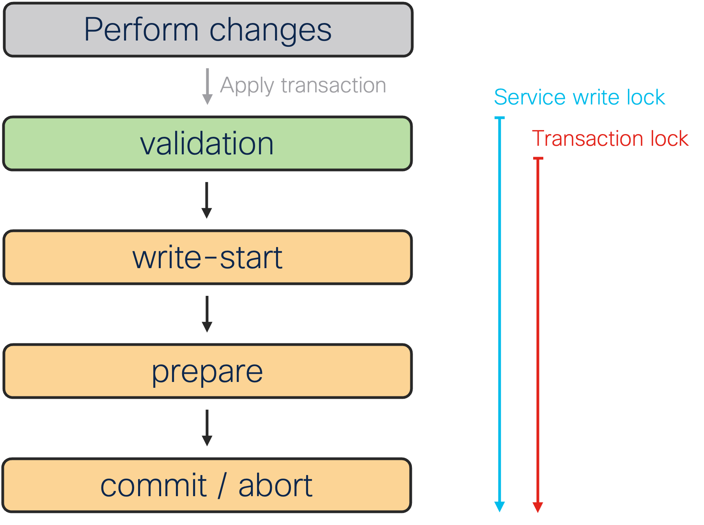
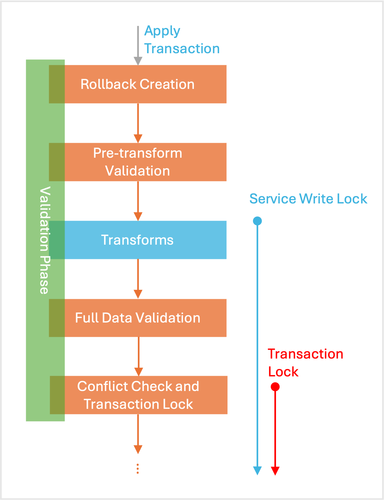
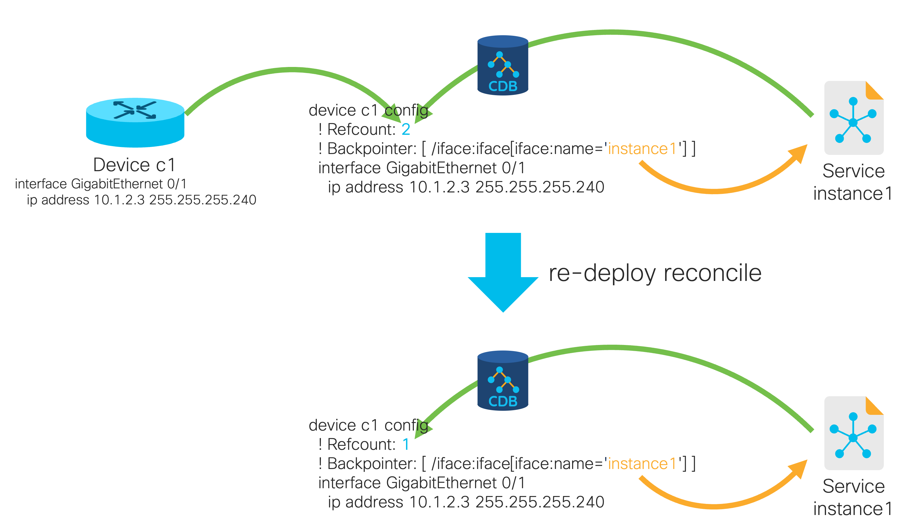

# Services Deep Dive


**Before you Proceed**

This section discusses the implementation details of services in NSO. The reader should already be familiar with the concepts described in the introductory sections and [Implementing Services](../../core-concepts/implementing-services.md).

For an introduction to services, see [Develop a Simple Service](../../introduction-to-automation/develop-a-simple-service.md) instead.


## Common Service Model <a href="#ch_svcref.model" id="ch_svcref.model"></a>

Each service type in NSO extends a part of the data model (a list or a container) with the `ncs:servicepoint` statement and the `ncs:service-data` grouping. This is what defines an NSO service.

The service point instructs NSO to involve the service machinery (Service Manager) for management of that part of the data tree and the `ncs:service-data` grouping contains definitions common to all services in NSO. Defined in `tailf-ncs-services.yang`, `ncs:service-data` includes parts that are required for the proper operation of FASTMAP and the Service Manager. Every service must therefore use this grouping as part of its data model.

In addition, `ncs:service-data` provides a common service interface to the users, consisting of:

<details>

<summary><code>check-sync</code>, <code>deep-check-sync</code> actions</summary>

Check if the configuration created by the service is (still) there. That is, a redeploy of this service would produce no changes.\
\
The deep variant also retrieves the latest configuration from all the affected devices, making it relatively expensive.

</details>

<details>

<summary><code>re-deploy</code>, <code>reactive-re-deploy</code> actions</summary>

Re-run the service mapping logic and deploy any changes from the current configuration. The non-reactive variant supports commit parameters, such as dry-run.

The reactive variant performs an asynchronous re-deploy as the user of the original commit and uses the commit parameters from the latest commit of this service. It is often used with nano services, such as restarting a failed nano service.

</details>

<details>

<summary><code>un-deploy</code> action</summary>

Remove the configuration produced by the service instance but keep the instance data, allowing a redeploy later. This action effectively deactivates the service while keeping it in the system.

</details>

<details>

<summary><code>get-modifications</code> action</summary>

Show the changes in the configuration that this service instance produced. Behaves as if this was the only service that made the changes.

</details>

<details>

<summary><code>touch</code> action</summary>

Available in the configure mode, it marks the service as being changed and allows redeploying multiple services in the same transaction.

</details>

<details>

<summary><code>directly-modified</code>, <code>modified</code> containers</summary>

List devices and services the configuration produced by this service affects directly or indirectly (through other services).

</details>

<details>

<summary><code>used-by-customer-service</code> leaf-list</summary>

List of customer services (defined under `/services/customer-service`) that this service is part of. Customer service is an optional concept that allows you to group multiple NSO services as belonging to the same customer.

</details>

<details>

<summary><code>commit-queue</code> container</summary>

Contains commit queue items related to this service. See [Commit Queue](../../../operation-and-usage/operations/nso-device-manager.md#user_guide.devicemanager.commit-queue) for details.

</details>

<details>

<summary><code>created</code>, <code>last-modified</code>, <code>last-run</code> leafs</summary>

Date and time of the main service events.

</details>

<details>

<summary><code>log</code> container</summary>

Contains log entries for important service events, such as those related to the commit queue or generated by user code. Defined in `tailf-ncs-log.yang`.

</details>

<details>

<summary><code>plan-location</code> leaf</summary>

Location of the plan data if the service plan is used. See [Nano Services for Staged Provisioning](../../core-concepts/nano-services.md) for more on service plans and using alternative plan locations.

</details>

While not part of `ncs:service-data` as such, you may consider the `service-commit-queue-event` notification part of the core service interface. The notification provides information about the state of the service when the service uses the commit queue. As an example, an event-driven application uses this notification to find out when a service instance has been deployed to the devices. See the `showcase_rc.py` script in [examples.ncs/scaling-performance/perf-stack](https://github.com/NSO-developer/nso-examples/tree/6.5/scaling-performance/perf-stack) for sample Python code, leveraging the notification. See `tailf-ncs-services.yang` for the full definition of the notification.

NSO Service Manager is responsible for providing the functionality of the common service interface, requiring no additional user code. This interface is the same for classic and nano services, whereas nano services further extend the model.

## Services and Transactions <a href="#ch_svcref.trans" id="ch_svcref.trans"></a>

NSO calls into Service Manager when accessing actions and operational data under the common service interface, or when the service instance configuration data (the data under the service point) changes. NSO being a transactional system, configuration data changes happen in a transaction.

When applied, a transaction goes through multiple stages, as shown by the progress trace (e.g. using `commit | details` in the CLI). The detailed output breaks up the transaction into four distinct phases:

1. validation
2. write-start
3. prepare
4. commit

These phases deal with how the network-wide transactions work:

The validation phase prepares and validates the new configuration (including NSO copy of device configurations), then the CDB processes the changes and prepares them for local storage in the write-start phase.

The prepare stage sends out the changes to the network through the Device Manager and the HA system. The changes are staged (e.g. in the candidate data store) and validated if the device supports it, otherwise, the changes are activated immediately.

If all systems took the new configuration successfully, enter the commit phase, marking the new NSO configuration as active and activating or committing the staged configuration on remote devices. Otherwise, enter the abort phase, discarding changes, and ask NEDs to revert activated changes on devices that do not support transactions (e.g. without candidate data store).

<figure><figcaption><p>Typical Transaction Phases</p></figcaption></figure>

There are also two types of locks involved with the transaction that are of interest to the service developer; the service write lock and the transaction lock. The latter is a global lock, required to serialize transactions, while the former is a per-service-type lock for serializing services that cannot be run in parallel. See [Scaling and Performance Optimization](../scaling-and-performance-optimization.md) for more details and their impact on performance.

The first phase, historically called validation, does more than just validate data and is the phase a service deals with the most. The other three support the NSO service framework but a service developer rarely interacts with directly.

We can further break down the first phase into the following stages:

1. rollback creation
2. pre-transform validation
3. transforms
4. full data validation
5. conflict check and transaction lock

When the transaction starts applying, NSO captures the initial intent and creates a rollback file, which allows one to reverse or roll back the intent. For example, the rollback file might contain the information that you changed a service instance parameter but it would not contain the service-produced device changes.

Then the first, partial validation takes place. It ensures the service input parameters are valid according to the service YANG model, so the service code can safely use provided parameter values.

Next, NSO runs transaction hooks and performs the necessary transforms, which alter the data before it is saved, for example encrypting passwords. This is also where the Service Manager invokes FASTMAP and service mapping callbacks, recording the resulting changes. NSO takes service write locks in this stage, too.

After transforms, there are no more changes to the configuration data, and the full validation starts, including YANG model constraints over the complete configuration, custom validation through validation points, and configuration policies (see [Policies](../../../operation-and-usage/operations/basic-operations.md#d5e319) in Operation and Usage).

<figure><figcaption><p>Stages of Transaction Validation Phase</p></figcaption></figure>

Throughout the phase, the transaction engine makes checkpoints, so it can restart the transaction faster in case of concurrency conflicts. The check for conflicts happens at the end of this first phase when NSO also takes the global transaction lock. Concurrency is further discussed in [NSO Concurrency Model](../../core-concepts/nso-concurrency-model.md).

## Service Callbacks <a href="#ch_svcref.cbs" id="ch_svcref.cbs"></a>

The main callback associated with a service point is the create callback, designed to produce the required (new) configuration, while FASTMAP takes care of the other operations, such as update and delete.

NSO implements two additional, optional callbacks for scenarios where create is insufficient. These are pre- and post-modification callbacks that NSO invokes before (pre) or after (post) create. These callbacks work outside of the scope tracked by FASTMAP. That is, changes done in pre- and post-modification do not automatically get removed during the update or delete of the service instance.

For example, you can use the pre-modification callback to check the service prerequisites (pre-check) or make changes that you want persisted even after the service is removed, such as enabling some global device feature. The latter may be required when NSO is not the only system managing the device and removing the feature configuration would break non-NSO managed services.

Similarly, you might use post-modification to reset the configuration to some default after the service is removed. Say the service configures an interface on a router for customer VPN. However, when the service is de-provisioned (removed), you don't want to simply erase the interface configuration. Instead, you want to put it in shutdown and configure it for a special, unused VLAN. The post-modification callback allows you to achieve this goal.

The main difference from create callback is that pre- and post-modification are called on update and delete, as well as service create. Since the service data node may no longer exist in case of delete, the API for these callbacks does not supply the `service` object. Instead, the callback receives the operation and key path to the service instance. See the following API signatures for details.


```python
    @Service.pre_modification
    def cb_pre_modification(self, tctx, op, kp, root, proplist): ...

    @Service.create
    def cb_create(self, tctx, root, service, proplist): ...

    @Service.post_modification
    def cb_post_modification(self, tctx, op, kp, root, proplist): ...
```


The Python callbacks use the following function arguments:

* `tctx`: A TransCtxRef object containing transaction data, such as user session and transaction handle information.
* `op`: Integer representing operation: create (`ncs.dp.NCS_SERVICE_CREATE`), update (`ncs.dp.NCS_SERVICE_UPDATE`), or delete (`ncs.dp.NCS_SERVICE_DELETE`) of the service instance.
* `kp`: A HKeypathRef object with a key path of the affected service instance, such as `/svc:my-service{instance1}`.
* `root`: A Maagic node for the root of the data model.
* `service`: A Maagic node for the service instance.
* `proplist`: Opaque service properties, see [Persistent Opaque Data](services-deep-dive.md#ch_svcref.opaque).


```java
    @ServiceCallback(servicePoint = "...",
                     callType = ServiceCBType.PRE_MODIFICATION)
    public Properties preModification(ServiceContext context,
                                      ServiceOperationType operation,
                                      ConfPath path,
                                      Properties opaque)
                                      throws DpCallbackException;

    @ServiceCallback(servicePoint="...",
                     callType=ServiceCBType.CREATE)
    public Properties create(ServiceContext context,
                             NavuNode service,
                             NavuNode ncsRoot,
                             Properties opaque)
                             throws DpCallbackException;

    @ServiceCallback(servicePoint = "...",
                     callType = ServiceCBType.POST_MODIFICATION)
    public Properties postModification(ServiceContext context,
                                       ServiceOperationType operation,
                                       ConfPath path,
                                       Properties opaque)
                                       throws DpCallbackException;
```


The Java callbacks use the following function arguments:

* `context`: A ServiceContext object for accessing root and service instance NavuNode in the current transaction.
* `operation`: ServiceOperationType enum representing operation: `CREATE`, `UPDATE`, `DELETE` of the service instance.
* `path`: A ConfPath object with a key path of the affected service instance, such as `/svc:my-service{instance1}`.
* `ncsRoot`: A NavuNode for the root of the `ncs` data model.
* `service`: A NavuNode for the service instance.
* `opaque`: Opaque service properties, see [Persistent Opaque Data](services-deep-dive.md#ch_svcref.opaque).

See [examples.ncs/service-management/iface-postmod-py](https://github.com/NSO-developer/nso-examples/tree/6.5/service-management/iface-postmod-py) and [examples.ncs/service-management/iface-postmod-java](https://github.com/NSO-developer/nso-examples/tree/6.5/service-management/iface-postmod-java) examples for a sample implementation of the post-modification callback.

Additionally, you may implement these callbacks with templates. Refer to [Service Callpoints and Templates](../../core-concepts/templates.md#ch_templates.servicepoint) for details.

### Persistent Opaque Data <a href="#ch_svcref.opaque" id="ch_svcref.opaque"></a>

FASTMAP greatly simplifies service code, so it usually only needs to deal with the initial mapping. NSO achieves this by first discarding all the configuration performed during the create callback of the previous run. In other words, the service create code always starts anew, with a blank slate.

If you need to keep some private service data across runs of the create callback, or pass data between callbacks, such as pre- and post-modification, you can use opaque properties.

The opaque object is available in the service callbacks as an argument, typically named `proplist` (Python) or `opaque` (Java). It contains a set of named properties with their corresponding values.

If you wish to use the opaque properties, it is crucial that your code returns the properties object from the create call, otherwise, the service machinery will not save the new version.

Compared to pre- and post-modification callbacks, which also persist data outside of FASTMAP, NSO deletes the opaque data when the service instance is deleted, unlike with the pre- and post-modification data.


```python
    @Service.create
    def cb_create(self, tctx, root, service, proplist):
        intf = None
        # proplist is of type list[tuple[str, str]]
        for pname, pvalue in proplist:
            if pname == 'INTERFACE':
                intf = pvalue

        if intf is None:
            intf = '...'
            proplist.append('INTERFACE', intf)

        return proplist
```



```java
    public Properties create(ServiceContext context,
                             NavuNode service,
                             NavuNode ncsRoot,
                             Properties opaque)
                             throws DpCallbackException {
        // In Java API, opaque is null when service instance is first created.
        if (opaque == null) {
            opaque = new Properties();
        }
        String intf = opaque.getProperty("INTERFACE");
        if (intf == null) {
            intf = "...";
            opaque.setProperty("INTERFACE", intf);
        }

        return opaque;
    }
```


The [examples.ncs/service-management/iface-postmod-py](https://github.com/NSO-developer/nso-examples/tree/6.5/service-management/iface-postmod-py) and [examples.ncs/service-management/iface-postmod-java](https://github.com/NSO-developer/nso-examples/tree/6.5/service-management/iface-postmod-java) examples showcase the use of opaque properties.

## Defining Static Service Conflicts <a href="#ch_svcref.conflicts" id="ch_svcref.conflicts"></a>

NSO by default enables concurrent scheduling and execution of services to maximize throughput. However, concurrent execution can be problematic for non-thread-safe services or services that are known to always conflict with themselves or other services, such as when they read and write the same shared data. See [NSO Concurrency Model](../../core-concepts/nso-concurrency-model.md) for details.

To prevent NSO from scheduling a service instance together with an instance of another service, declare a static conflict in the service model, using the `ncs:conflicts-with` extension. The following example shows a service with two declared static conflicts, one with itself and one with another service, named `other-service`.


```yang
        list example-service {
          key name;
          leaf name {
            type string;
          }
          uses ncs:service-data;
          ncs:servicepoint example-service {
            ncs:conflicts-with example-service;
            ncs:conflicts-with other-service;
          }
        }
```


This means each service instance will wait for other service instances that have started sooner than this one (and are of example-service or other-service type) to finish before proceeding.

## Reference Counting Overlapping Configuration <a href="#ch_svcref.refcount" id="ch_svcref.refcount"></a>

FASTMAP knows that a particular piece of configuration belongs to a service instance, allowing NSO to revert the change as needed. But what happens when several service instances share a resource that may or may not exist before the first service instance is created? If the service implementation naively checks for existence and creates the resource when it is missing, then the resource will be tracked with the first service instance only. If, later on, this first instance is removed, then the shared resource is also removed, affecting all other instances.

A well-known solution to this kind of problem is reference counting. NSO uses reference counting by default with the XML templates and Python Maagic API, while in Java Maapi and Navu APIs, the `sharedCreate()`, `sharedSet()`, and `sharedSetValues()` functions need to be used.

When enabled, the reference counter allows FASTMAP algorithm to keep track of the usage and only delete data when the last service instance referring to this data is removed.

Furthermore, containers and list items created using the `sharedCreate()` and `sharedSetValues()` functions also get an additional attribute called `backpointer`. (But this functionality is currently not available for individual leafs.)

`backpointer` points back to the service instance that created the entity in the first place. This makes it possible to look at part of the configuration, say under `/devices` tree, and answer the question: which parts of the device configuration were created by which service?

To see reference counting in action, start the [examples.ncs/service-management/implement-a-service/iface-v3](https://github.com/NSO-developer/nso-examples/tree/6.5/service-management/implement-a-service/iface-v3) example with `make demo` and configure a service instance.

```bash
admin@ncs(config)# iface instance1 device c1 interface 0/1 ip-address 10.1.2.3 cidr-netmask 28
admin@ncs(config)# commit
```

Then configure another service instance with the same parameters and use the `display service-meta-data` pipe to show the reference counts and backpointers:

```bash
admin@ncs(config)# iface instance2 device c1 interface 0/1 ip-address 10.1.2.3 cidr-netmask 28
admin@ncs(config)# commit dry-run
cli {
    local-node {
        data +iface instance2 {
             +    device c1;
             +    interface 0/1;
             +    ip-address 10.1.2.3;
             +    cidr-netmask 28;
             +}
    }
}
admin@ncs(config)# commit and-quit
admin@ncs# show running-config devices device c1 config interface\
 GigabitEthernet 0/1 | display service-meta-data
devices device c1
 config
  ! Refcount: 2
  ! Backpointer: [ /iface:iface[iface:name='instance1'] /iface:iface[iface:name='instance2'] ]
  interface GigabitEthernet0/1
   ! Refcount: 2
   ip address 10.1.2.3 255.255.255.240
   ! Refcount: 2
   ! Backpointer: [ /iface:iface[iface:name='instance1'] /iface:iface[iface:name='instance2'] ]
   ip dhcp snooping trust
  exit
 !
!
```

Notice how `commit dry-run` produces no new device configuration but the system still tracks the changes. If you wish, remove the first instance and verify the `GigabitEthernet 0/1` configuration is still there, but is gone when you also remove the second one.

But what happens if the two services produce different configurations for the same node? Say, one sets the IP address to `10.1.2.3` and the other to `10.1.2.4`. Conceptually, these two services are incompatible, and instantiating both at the same time produces a broken configuration (instantiating the second service instance breaks the configuration for the first). What is worse is that the current configuration depends on the order the services were deployed or re-deployed. For example, re-deploying the first service will change the configuration from `10.1.2.4` back to `10.1.2.3` and vice versa. Such inconsistencies break the declarative configuration model and really should be avoided.

In practice, however, NSO does not prevent services from producing such configuration. But note that we strongly recommend against it and that there are associated limitations, such as service un-deploy not reverting configuration to that produced by the other instance (but when all services are removed, the original configuration is still restored).

The `commit | debug` service pipe command warns about any such conflict that it finds but may miss conflicts on individual leafs. The best practice is to use integration tests in the service development life cycle to ensure there are no conflicts, especially when multiple teams develop their own set of services that are to be deployed on the same NSO instance.

## Stacked Services <a href="#ch_svcref.stacking" id="ch_svcref.stacking"></a>

Much like a service in NSO can provision device configurations, it can also provision other, non-device data, as well as other services. We call the approach of services provisioning other services 'service stacking' and the services that are involved — 'stacked'.

Service stacking concepts usually come into play for bigger, more complex services. There are a number of reasons why you might prefer stacked services to a single monolithic one:

* Smaller, more manageable services with simpler logic.
* Separation of concerns and responsibility.
* Clearer ownership across teams for (parts of) overall service.
* Smaller services reusable as components across the solution.
* Avoiding overlapping configuration between service instances causing conflicts, such as using one service instance per device (see examples in [Designing for Maximal Transaction Throughput](../scaling-and-performance-optimization.md#ncs.development.scaling.throughput)).

Stacked services are also the basis for LSA, which takes this concept even further. See [Layered Service Architecture](../../../administration/advanced-topics/layered-service-architecture.md) for details.

The standard naming convention with stacked services distinguishes between a Resource-Facing Service (RFS), that directly configures one or more devices, and a Customer-Facing Service (CFS), that is the top-level service, configuring only other services, not devices. There can be more than two layers of services in the stack, too.

To kickstart learning how to create a stacked service that uses a single CFS and several RFS to configure one device per RFS with a simple VLAN configuration, see the [examples.ncs/service-management/cfs-rfs-stacked](https://github.com/NSO-developer/nso-examples/blob/6.5/service-management/cfs-rfs-stacke) example.

While NSO does not prevent a single service from configuring devices as well as services, in the majority of cases this results in a less clean design and is best avoided.

Overall, creating stacked services is very similar to the non-stacked approach. First, you can design the RFS services as usual. Actually, you might take existing services and reuse those. These then become your lower-level services, since they are lower in the stack.

Then you create a higher-level service, say a CFS, that configures another service, or a few, instead of a device. You can even use a template-only service to do that, such as:


```xml
<config-template xmlns="http://tail-f.com/ns/config/1.0"
                 servicepoint="top-level-service">
  <iface xmlns="http://com/example/iface">
    <name>instance1</name>
    <device>c1</device>
    <interface>0/1</interface>
    <ip-address>10.1.2.3</ip-address>
    <cidr-netmask>28</cidr-netmask>
  </iface>
</config>
```


The preceding example references an existing `iface` service, such as the one in the [examples.ncs/service-management/implement-a-service/iface-v3](https://github.com/NSO-developer/nso-examples/tree/6.5/service-management/implement-a-service/iface-v3) example. The output shows hard-coded values but you can change those as you would for any other service.

In practice, you might find it beneficial to modularize your data model and potentially reuse parts in both, the lower- and higher-level service. This avoids duplication while still allowing you to directly expose some of the lower-level service functionality through the higher-level model.

The most important principle to keep in mind is that the data created by any service is owned by that service, regardless of how the mapping is done (through code or templates). If the user deletes a service instance, FASTMAP will automatically delete whatever the service created, including any other services. Likewise, if the operator directly manipulates service data that is created by another service, the higher-level service becomes out of sync. The **check-sync** service action checks this for services as well as devices.

In stacked service design, the lower-level service data is under the control of the higher-level service and must not be directly manipulated. Only the higher-level service may manipulate that data. However, two higher-level services may manipulate the same structures, since NSO performs reference counting (see [Reference Counting Overlapping Configuration](services-deep-dive.md#ch_svcref.refcount)).

## Stacked Service Design

Designing services in NSO offers a great deal of flexibility with multiple approaches available to suit different needs. But what’s the best way to go about it? At its core, a service abstracts a network service or functionality, bridging user-friendly inputs with network configurations. This definition leaves the implementation open-ended, providing countless possibilities for designing and building services. However, there are certain techniques and best practices that can help enhance performance and simplify ongoing maintenance, making your services more efficient and easier to manage.

Regardless of the type of service chosen—whether Java, Python, or plain template services—there are certain design patterns that can be followed to improve their long-term effectiveness. Rather than diving into API-level specifics, we’ll focus on higher-level design principles, with an emphasis on leveraging the stacked service approach for maximum efficiency and scalability.

### Service Performance

When designing a service, the first step is to identify the functionality of the network service and the corresponding device configurations it encompasses. The service should then be designed to generate those configurations. These configurations can either be static—hard-coded into the service if they remain consistent across all instances—or dynamic, represented as variables that adapt based on the service’s input parameters.

The flexibility in service design is virtually limitless, as both Java and Python can be used to define services, allowing for the generation of static or dynamic configurations based on minimal input. Ultimately, the goal is to have the service efficiently represent as much of the required device configuration as possible, while minimizing the number of input parameters.

When striving to achieve the goal of producing comprehensive device configurations, it's common to end up with a service that generates an extensive set of configurations. At first glance, this might seem ideal; however, it can introduce significant performance challenges.

### Service Bottlenecks

As the volume of a service's device configurations increases, its performance often declines. Both creating and modifying the service take longer, regardless of whether the change involves a single line of configuration or the entire set. In fact, the execution time of the service remains consistent for all modifications and increases proportionally with the size of the configurations it generates.

The underlying reason for this behavior is tied to FASTMAP. Without delving too deeply into its mechanics, FASTMAP essentially runs the service logic anew with every deploy or re-deploy (modification), regenerating all the device configurations from scratch. This process not only re-executes user-defined logic—whether in Java, Python, or templates—but also tasks NSO with generating the reverse diffset for the service. As the size of the reverse diffset grows, so does the computational load, leading to slower performance.

From this, it's clear that writing efficient service logic is crucial. Optimizing the time complexity of operations within the service callbacks will naturally improve performance, just as with any other software. However, there's a less obvious yet equally important factor to consider: minimizing the service diffset. A smaller diffset results in better performance overall.

At first glance, this might seem to contradict the initial goal of representing as much configuration as possible with minimal input parameters. This apparent conflict is where the concept of stacked services comes into play, offering a way to balance these priorities effectively.

We want a service to generate as much configuration as possible, but it doesn’t need to handle everything on its own. While a single service becomes slower as it takes on more, distributing the workload across multiple services introduces a new dimension of optimization.

For example, consider a simple service that configures interface descriptions. While not a real network service, it serves as a useful illustration of the impact of heavy operations and large diffsets. Let's explore how this approach can help optimize performance.

```yang
list python-service {
  key name;
  leaf name {
    type string;
  }

  uses ncs:service-data;
  ncs:servicepoint python-service-servicepoint;

  list device {
    key name;
    leaf name {
      type leafref {
        path "/ncs:devices/ncs:device/ncs:name";
      }
    }
    leaf number-of-interfaces {
      type uint32;
    }
  }
}
```

Each service instance will take, as input, a list of devices to configure and the number of interfaces to be configured for each device.


```python
@Service.create
def cb_create(self, tctx, root, service, proplist):
    self.log.info('Service create(service=', service._path, ')')

    for d in service.device:
        for i in range(d.number_of_interfaces):
            root.ncs__devices.device[d.name].config.ios__interface.GigabitEthernet.create(i).description = 'Managed by NSO'
```


The callback will then iterate through each provided device, creating interfaces and assigning descriptions in a loop.

When evaluating the service's performance, there are two key aspects to consider: the callback execution time and the time NSO takes to calculate the diffset. To analyze these, we can use NSO’s progress trace to gather statistics. Let’s start with an example involving three devices and 10 interfaces:

```bash
admin@ncs(config)# python-service test
admin@ncs(config-python-service-test)# device CE-1 number-of-interfaces 10
admin@ncs(config-device-CE-1)# exit
admin@ncs(config-python-service-test)# device CE-2 number-of-interfaces 10
admin@ncs(config-device-CE-2)# exit
admin@ncs(config-python-service-test)# device PE-1 number-of-interfaces 10
admin@ncs(config-device-PE-1)# 
```

The two key events we need to focus on are the create event for the service, which provides the execution time of the create callback, and the "saving reverse diff-set and applying changes" event, which shows how long NSO took to calculate the reverse diff-set.


```
2-Jan-2025::09:48:18.110 trace-id=8a94e614b426430ffcd34e0639b5cf40 span-id=c4a9037077c54402 parent-span-id=ff9ca4dccad15b30 usid=59 tid=132 datastore=running context=cli subsystem=service-manager service=/python-service[name='test'] create: ok (0.222 s)
2-Jan-2025::09:48:18.198 trace-id=8a94e614b426430ffcd34e0639b5cf40 span-id=2cdb960fde6f386e parent-span-id=ff9ca4dccad15b30 usid=59 tid=132 datastore=running context=cli subsystem=service-manager service=/python-service[name='test'] saving reverse diff-set and applying changes: ok (0.088 s)
```


Let’s capture the same data for 100 and 1000 interfaces to compare the results.


```
2-Jan-2025::09:49:00.909 trace-id=87b153d7edd0120f4810cd13fa207abd span-id=37188aea51359bd4 parent-span-id=f55947230241d550 usid=59 tid=214 datastore=running context=cli subsystem=service-manager service=/python-service[name='test'] create: ok (2.316 s)
2-Jan-2025::09:49:02.299 trace-id=87b153d7edd0120f4810cd13fa207abd span-id=6a9962e63805673e parent-span-id=f55947230241d550 usid=59 tid=214 datastore=running context=cli subsystem=service-manager service=/python-service[name='test'] saving reverse diff-set and applying changes: ok (1.389 s)
```



```
2-Jan-2025::09:50:19.314 trace-id=4b144bc1f493a1c6f1f09df45be7a567 span-id=7e7a805a711ae483 parent-span-id=867f790fef787fca usid=59 tid=293 datastore=running context=cli subsystem=service-manager service=/python-service[name='test'] create: ok (28.082 s)
2-Jan-2025::09:50:34.261 trace-id=4b144bc1f493a1c6f1f09df45be7a567 span-id=28a617b1279e8c56 parent-span-id=867f790fef787fca usid=59 tid=293 datastore=running context=cli subsystem=service-manager service=/python-service[name='test'] saving reverse diff-set and applying changes: ok (14.946 s)
```


We can observe that the time scales proportionally with the workload in the create callback as well as the size of the diffset. To demonstrate that the time remains consistent regardless of the size of the modification, we add one more interface to the 1000 interfaces already configured.

```bash
admin@ncs(config)# commit dry-run 
cli {
    local-node {
        data  devices {
                  device CE-1 {
                      config {
                          interface {
             +                GigabitEthernet 1000 {
             +                    description "Managed by NSO";
             +                }
                          }
                      }
                  }
              }
              python-service test {
                  device CE-1 {
             -        number-of-interfaces 1000;
             +        number-of-interfaces 1001;
                  }
              }
    }
}
```

From the progress trace, we can see that adding one interface took about the same amount of time as adding 1000 interfaces.


```
2-Jan-2025::09:57:40.581 trace-id=ab51722b3be82a83bc59d7b40bfdedd3 span-id=e9039240e794e819 parent-span-id=df585fdf73c00df3 usid=75 tid=425 datastore=running context=cli subsystem=service-manager service=/python-service[name='test'] create: ok (24.900 s)
2-Jan-2025::09:58:44.309 trace-id=ab51722b3be82a83bc59d7b40bfdedd3 span-id=1e841bcb07685884 parent-span-id=df585fdf73c00df3 usid=75 tid=425 datastore=running context=cli subsystem=service-manager service=/python-service[name='test'] saving reverse diff-set and applying changes: ok (15.727 s)
```


Fastmap offers significant benefits to our solution, but this performance trade-off is an unavoidable cost. As a result, our service will remain consistently slow for all modifications as long as it handles large-scale device configurations. To address this, our focus must shift to reducing the size of the device configuration.

### Service Stacking

The solution lies in distributing the configurations across multiple services while assigning the main service the role of managing these individual services. By analyzing the current service's functionality, we can easily identify how to break it down—by device. Instead of having a single service provisioning multiple devices, we will transition to a setup where one main service provisions multiple sub-services, with each sub-service responsible for provisioning a single device. The resulting structure will look as follows.

We'll begin by renaming our `python-service` to `upper-python-service`. This distinction is purely for clarity and to differentiate the two service types. In practice, the naming itself is not critical, as long as it aligns with the desired naming conventions for the northbound API, which represents the customer-facing service. The `upper-python-service` will still function as the main service that users interact with to configure interfaces on multiple devices, just as in the previous example.

```python
list upper-python-service {

  key name;
  leaf name {
    type string;
  }

  uses ncs:service-data;
  ncs:servicepoint upper-python-service-servicepoint;

  list device {
    key name;
    leaf name {
      type leafref {
        path "/ncs:devices/ncs:device/ncs:name";
      }
    }
    leaf number-of-interfaces {
      type uint32;
    }
  }
}
```

The `upper-python-service` however, will not provision any devices directly. Instead, it will delegate that responsibility to another layer of services by creating and managing those subordinate services.

```python
list lower-python-service {

  key "device name";
  leaf name {
    type string;
  }

  leaf device {
    type leafref {
      path "/ncs:devices/ncs:device/ncs:name";
    }  
  }

  uses ncs:service-data;
  ncs:servicepoint lower-python-service-servicepoint;

  leaf number-of-interfaces {
    type uint32;
  }
}
```

The `lower-python-service` will be created by the `upper-python-service` and will ultimately handle provisioning the device. This service is designed to take only a single device as input, which corresponds to the device it will provision. The behavior and interaction between the two services can be observed in the Python callbacks that define their logic.

```python
class UpperServiceCallbacks(Service):
    @Service.create
    def cb_create(self, tctx, root, service, proplist):
        self.log.info('Service create(service=', service._path, ')')

        for d in service.device:
            root.stacked_python_service__lower_python_service.create(d.name, service.name).number_of_interfaces = d.number_of_interfaces

class LowerServiceCallbacks(Service):
    @Service.create
    def cb_create(self, tctx, root, service, proplist):
        self.log.info('Service create(service=', service._path, ')')

        for i in range(service.number_of_interfaces):
            root.ncs__devices.device[service.device].config.ios__interface.GigabitEthernet.create(i).description = 'Managed by NSO'
```

The upper service creates a lower service for each device, and each lower service is responsible for provisioning its assigned device and populating its interfaces. This approach distributes the workload, reducing the load on individual services. The upper service loops over the total number of devices and generates a diffset consisting of the input parameters for each lower service. Each lower service then loops over the interfaces for its specific device and creates a diffset covering all interfaces for that device.

All of this happens within a single NSO transaction, ensuring that, from the user’s perspective, the behavior remains identical to the previous design.

At this point, you might wonder: if this still occurs in a single transaction and the total number of loops and combined diffset size remain unchanged, how does this improve performance? That’s a valid observation. When creating a large dataset all at once, this approach doesn’t provide a performance gain—in fact, the addition of an extra service layer might introduce a minimal and negligible amount of overhead.

However, the real benefit becomes apparent in update scenarios, as we’ll illustrate below.

We begin by creating the service to configure 1000 interfaces for each device.

```bash
admin@ncs(config)# upper-python-service test device CE-1 number-of-interfaces 1000
admin@ncs(config-device-CE-1)# top
admin@ncs(config)# upper-python-service test device CE-2 number-of-interfaces 1000
admin@ncs(config-device-CE-2)# top
admin@ncs(config)# upper-python-service test device PE-1 number-of-interfaces 1000
admin@ncs(config-device-PE-1)# commit 
```

The execution time of the `upper-python-service` turned out to be relatively low, as expected. This is because it only involves a loop with three iterations, where data is passed from the input of the `upper-python-service` to each corresponding `lower-python-service`.

Similarly, calculating the diffset is also efficient. The reverse diffset for the `upper-python-service` only includes the configuration for the `lower-python-services`, which consists of just a few lines. This minimal complexity keeps both execution time and diffset calculation fast and lightweight.


```
2-Jan-2025::10:14:27.682 trace-id=2dc929ca780db076154a16d0edc50d05 span-id=58c41383d602d7e4 parent-span-id=49f214d3c1e906fb usid=59 tid=132 datastore=running context=cli subsystem=service-manager service=/upper-python-service[name='test'] create: ok (0.012 s)
2-Jan-2025::10:14:27.706 trace-id=2dc929ca780db076154a16d0edc50d05 span-id=3dcdb68f79b38f78 parent-span-id=49f214d3c1e906fb usid=59 tid=132 datastore=running context=cli subsystem=service-manager service=/upper-python-service[name='test'] saving reverse diff-set and applying changes: ok (0.023 s)
```


In the same transaction, we also observe the execution of the three `lower-python-services`.


```
2-Jan-2025::10:14:35.205 trace-id=2dc929ca780db076154a16d0edc50d05 span-id=1aa5131f96e2b4fe parent-span-id=9da61057b7e18fae usid=59 tid=132 datastore=running context=cli subsystem=service-manager service=/lower-python-service[name='test'][device='CE-1'] create: ok (7.492 s)
2-Jan-2025::10:14:37.743 trace-id=2dc929ca780db076154a16d0edc50d05 span-id=3dce5f82d6f5558f parent-span-id=9da61057b7e18fae usid=59 tid=132 datastore=running context=cli subsystem=service-manager service=/lower-python-service[name='test'][device='CE-1'] saving reverse diff-set and applying changes: ok (2.538 s)
...
2-Jan-2025::10:14:46.126 trace-id=2dc929ca780db076154a16d0edc50d05 span-id=78201c416ffa5ca5 parent-span-id=056757c9dd26bb8e usid=59 tid=132 datastore=running context=cli subsystem=service-manager service=/lower-python-service[name='test'][device='CE-2'] create: ok (8.381 s)
2-Jan-2025::10:14:48.455 trace-id=2dc929ca780db076154a16d0edc50d05 span-id=5b4fd53af68d3233 parent-span-id=056757c9dd26bb8e usid=59 tid=132 datastore=running context=cli subsystem=service-manager service=/lower-python-service[name='test'][device='CE-2'] saving reverse diff-set and applying changes: ok (2.328 s)
...
2-Jan-2025::10:14:56.294 trace-id=2dc929ca780db076154a16d0edc50d05 span-id=374cecf183a5065a parent-span-id=e513c0823e29256c usid=59 tid=132 datastore=running context=cli subsystem=service-manager service=/lower-python-service[name='test'][device='PE-1'] create: ok (7.837 s)
2-Jan-2025::10:14:58.645 trace-id=2dc929ca780db076154a16d0edc50d05 span-id=b0d42c480167757d parent-span-id=e513c0823e29256c usid=59 tid=132 datastore=running context=cli subsystem=service-manager service=/lower-python-service[name='test'][device='PE-1'] saving reverse diff-set and applying changes: ok (2.351 s)
```


Each service callback took approximately 8 seconds to execute, and calculating the diffset took around 2.5 seconds per service. This results in a total callback execution time of about 24 seconds and a total diffset calculation time of around 8 seconds, which is less than the time required in the previous service design.

So, what’s the advantage of stacking services like this? The real benefit becomes evident during updates. Let’s add an interface to device `CE-1`, just as we did with the previous design, to illustrate this.

```bash
admin@ncs(config)# upper-python-service test device CE-1 number-of-interfaces 1001
admin@ncs(config-device-CE-1)# commit dry-run 
cli {
    local-node {
        data  upper-python-service test {
                  device CE-1 {
             -        number-of-interfaces 1000;
             +        number-of-interfaces 1001;
                  }
              }
              lower-python-service test CE-1 {
             -    number-of-interfaces 1000;
             +    number-of-interfaces 1001;
              }
              devices {
                  device CE-1 {
                      config {
                          interface {
             +                GigabitEthernet 1000 {
             +                    description "Managed by NSO";
             +                }
                          }
                      }
                  }
              }
    }
}
```

Observing the progress trace generated for this scenario would give a clearer understanding. From the trace, we see that the `upper-python-service` was invoked and executed just as quickly as it did during the initial deployment. The same applies to the callback execution and diffset calculation time for the `lower-python-service` handling `CE-1`.

But what about `CE-2` and `PE-1`? Interestingly, there are no traces of these services in the log. That’s because they were never executed. The modification was passed only to the relevant `lower-python-service` for `CE-1`, while the other two services remained untouched.

And that is the power of stacked services.

### Resource-Facing Layer

Does this mean the more we stack, the better? Should every single line of configuration be split into its own service? The answer is no. In most real-world cases, the primary performance bottleneck is the diffset calculation rather than the callback execution time. Service callbacks typically aren't computationally intensive, nor should they be.

Stacked services are generally used to address issues with diffset calculation, and this strategy is only effective if we can reduce the diffset size of the "hottest" service. However, increasing the number of services managed by the upper service also increases the total configuration it must generate on each re-deploy. This trade-off needs careful consideration to strike the right balance.

#### Modeling the Layer

When restructuring a service into a stacked service model, the first target should always be devices. If a service configures multiple devices, it’s a good practice to split it up by adding another layer of services, ensuring that no more than one device is provisioned by any service at the lowest layer. This approach reduces the service's complexity, making it easier to maintain.

Focusing on a single device per service also provides significant advantages in various scenarios, such as restoring consistency when a device goes out of sync, handling NED migrations, hardware upgrades, or even migrating a device between NSO instances.

The lower service we created uses the device name as its key. The primary reason for this is to ensure a clear separation of service instances based on the devices they are deployed on. One key benefit of this approach is the ability to easily identify all services deployed on a specific device by simply filtering for that device. For example, after adding a few more services, you could list all services associated with a particular device using a `show` command similar to the following.

```bash
admin@ncs(config)# show full-configuration lower-python-service CE-1 
lower-python-service CE-1 another-instance
 number-of-interfaces 1
!
lower-python-service CE-1 test
 number-of-interfaces 1001
!
lower-python-service CE-1 yet-another-instance
 number-of-interfaces 1
!
```

While the complete distribution of the service looks like this:

```bash
admin@ncs(config)# show full-configuration lower-python-service 
lower-python-service CE-1 another-instance
 number-of-interfaces 1
!
lower-python-service CE-1 test
 number-of-interfaces 1001
!
lower-python-service CE-1 yet-another-instance
 number-of-interfaces 1
!
lower-python-service CE-2 test
 number-of-interfaces 1000
!
lower-python-service PE-1 test
 number-of-interfaces 1000
!
```

This approach provides an excellent way to maintain an overview of services deployed on each device. However, introducing new service types presents a challenge: you wouldn’t be able to see all service types with a single show command. For instance, `show lower-python-service ...` will only display instances of the `lower-python-service`. But what happens when the device also has L2VPNs, L3VPNs, or other service types, as it would in a real network?

#### Organizing the Schema

To address this, we can nest the services within another list. By organizing all services under a common structure, we enable the ability to view and manage multiple service types for a device in a unified manner, providing a comprehensive overview with a single command.

To illustrate this approach, we need to introduce another service type. Moving beyond the dummy example, let’s use a more realistic scenario: the [mpls-vpn-simple](https://github.com/NSO-developer/nso-examples/tree/6.5/service-management/mpls-vpn-simple) example. We'll refactor this service to adopt the stacked service approach while maintaining the existing customer-facing interface.

After the refactor, the service will shift from provisioning multiple devices directly through a single instance to creating a separate service instance for each device, VPN, and endpoint, what we call resource-facing services. These resource-facing services will be structured so that all device-specific services are grouped under a node for each device.

This is accomplished by introducing a list of devices, modeled within a separate package. We’ll create this new package and call it `resource-facing-services`, with the following model definition:

```yang
  container resource-facing-services {
    list device {
      description "All services on a device";

      key name;
      leaf name {
        type leafref {
          path "/ncs:devices/ncs:device/ncs:name";
        }
      }
    }
  }
```

This model allows us to organize services by device, providing a unified structure for managing and querying all services deployed on each device.

Each element in this list will represent a device and all the services deployed on it. The model itself is empty, which is intentional, as each resource-facing service (RFS) will be added to this list through augmentation from its respective package. The YANG model for the RFS version of our L3VPN service is designed specifically to integrate seamlessly into this structure.

```yang
  augment "/rfs:resource-facing-services/rfs:device" {
    list l3vpn-rfs {
      key "name endpoint-id";

      leaf name {
        tailf:info "Unique service id";
        tailf:cli-allow-range;
        type string;
      }

      leaf endpoint-id {
        tailf:info "Endpoint identifier";
        type string;
      }
      uses ncs:service-data;
      ncs:servicepoint l3vpn-rfs-servicepoint;

      leaf role {
        type enumeration {
          enum "ce";
          enum "pe";
        }
      }

      container remote {
        leaf device {
          type leafref {
            path "/rfs:resource-facing-services/rfs:device/rfs:name";
          }
        }
        leaf ip-address {
          type inet:ipv4-address;
        }
      }

      leaf as-number {
        description "AS used within all VRF of the VPN";
        tailf:info "MPLS VPN AS number.";
        mandatory true;
        type uint32;
      }

      container local {
        when "../role = 'ce'";
        uses endpoint-grouping;
      }
      container link {
        uses endpoint-grouping;
      }
    }
  }
```

We deploy an L3VPN to our network with two CE endpoints by creating the following `l3vpn` customer-facing service.

```bash
admin@ncs(config)# show full-configuration vpn 
vpn l3vpn volvo
 endpoint c1
  as-number 65001
  ce device CE-1
  ce local interface-name GigabitEthernet
  ce local interface-number 0/9
  ce local ip-address 192.168.0.1
  ce link interface-name GigabitEthernet
  ce link interface-number 0/2
  ce link ip-address 10.1.1.1
  pe device PE-1
  pe link interface-name GigabitEthernet
  pe link interface-number 0/0/0/1
  pe link ip-address 10.1.1.2
 !
 endpoint c2
  as-number 65001
  ce device CE-2
  ce local interface-name GigabitEthernet
  ce local interface-number 0/3
  ce local ip-address 192.168.1.1
  ce link interface-name GigabitEthernet
  ce link interface-number 0/1
  ce link ip-address 10.2.1.1
  pe device PE-1
  pe link interface-name GigabitEthernet
  pe link interface-number 0/0/0/2
  pe link ip-address 10.2.1.2
 !
!
```

After deploying our service, we can quickly gain an overview of the services deployed on a device without needing to analyze or reverse-engineer its configurations. For example, we can see that the device `PE-1` is acting as a PE for two different endpoints within a VPN.

```bash
admin@ncs(config)# show full-configuration resource-facing-services device PE-1 
resource-facing-services device PE-1
 l3vpn-rfs volvo c1
  role      pe
  as-number 65001
  link interface-name GigabitEthernet
  link interface-number 0/0/0/1
  link ip-address  10.1.1.2
  link remote ip-address 10.1.1.1
 !
 l3vpn-rfs volvo c2
  role      pe
  as-number 65001
  link interface-name GigabitEthernet
  link interface-number 0/0/0/2
  link ip-address  10.2.1.2
  link remote ip-address 10.2.1.1
 !
!
```

`CE-1` serves as a CE for that VPN.

```bash
admin@ncs(config)# show full-configuration resource-facing-services device CE-1
resource-facing-services device CE-1
 l3vpn-rfs volvo c1
  role      ce
  as-number 65001
  local interface-name GigabitEthernet
  local interface-number 0/9
  local ip-address 192.168.0.1
  link interface-name GigabitEthernet
  link interface-number 0/2
  link ip-address  10.1.1.1
  link remote ip-address 10.1.1.2
 !
!
```

And `CE-2` serves as another CE for that VPN.

```bash
admin@ncs(config)# show full-configuration resource-facing-services device CE-2
resource-facing-services device CE-2
 l3vpn-rfs volvo c2
  role      ce
  as-number 65001
  local interface-name GigabitEthernet
  local interface-number 0/3
  local ip-address 192.168.1.1
  link interface-name GigabitEthernet
  link interface-number 0/1
  link ip-address  10.2.1.1
  link remote ip-address 10.2.1.2
 !
!
```

## Caveats and Best Practices <a href="#ch_svcref.caveats" id="ch_svcref.caveats"></a>

This section lists some specific advice for implementing services, as well as any known limitations you might run into.

You may also obtain some useful information by using the `debug service` commit pipe command, such as `commit dry-run | debug service`. The command display the net effect of the service create code, as well as issue warnings about potentially problematic usage of overlapping shared data.

* **Service callbacks must be deterministic**: NSO invokes service callbacks in a number of situations, such as for dry-run, check sync, and actual provisioning. If a service does not create the same configuration from the same inputs, NSO sees it as being out of sync, resulting in a lot of configuration churn and making it incompatible with many NSO features.\
  \
  If you need to introduce some randomness or rely on some other nondeterministic source of data, make sure to cache the values across callback invocations, such as by using opaque properties (see [Persistent Opaque Data](services-deep-dive.md#ch_svcref.opaque)) or persistent operational data (see [Operational Data](../../core-concepts/implementing-services.md#ch_services.oper)) populated in a pre-modification callback.
*   **Never overwrite service inputs**: Service input parameters capture client intent and a service should never change its own configuration. Such behavior not only muddles the intent but is also temporary when done in the create callback, as the changes are reverted on the next invocation.

    \
    If you need to keep some additional data that cannot be easily computed each time, consider using opaque properties (see [Persistent Opaque Data](services-deep-dive.md#ch_svcref.opaque)) or persistent operational data (see [Operational Data](../../core-concepts/implementing-services.md#ch_services.oper)) populated in a pre-modification callback.
* **No service ordering in a transaction**: NSO is a transactional system and as such does not have the concept of order inside a single transaction. That means NSO does not guarantee any specific order in which the service mapping code executes if the same transaction touches multiple service instances. Likewise, your code should not make any assumptions about running before or after other service code.
* **Return value of create callback**: The create callback is not the exclusive user of the opaque object; the object can be chained in several different callbacks, such as pre- and post-modification. Therefore, returning `None/null` from create callback is not a good practice. Instead, always return the opaque object even if the create callback does not use it.
*   **Avoid delete in service create**: Unlike creation, deleting configuration does not support reference counting, as there is no data left to reference count. This means the deleted elements are tied to the service instance that deleted them.

    \
    Additionally, FASTMAP must store the entire deleted tree and restore it on every service change or re-deploy, only to be deleted again. Depending on the amount of deleted data, this is potentially an expensive operation.

    \
    So, a general rule of thumb is to never use delete in service create code. If an explicit delete is used, `debug service` may display the following warning:\\

    ```
    *** WARNING ***: delete in service create code is unsafe if data is
                     shared by other services
    ```

    \
    However, the service may also delete data implicitly, through `when` and `choice` statements in the YANG data model. If a `when` statement evaluates to false, the configuration tree below that node is deleted. Likewise, if a `case` is set in a `choice` statement, the previously set `case` is deleted. This has the same limitations as an explicit delete.

    \
    To avoid these issues, create a separate service, that only handles deletion, and use it in the main service through the stacked service design (see [Stacked Services](services-deep-dive.md#ch_svcref.stacking)). This approach allows you to reference count the deletion operation and contains the effect of restoring deleted data through a small, rarely-changing helper service. See [examples.ncs/service-management/shared-delete](https://github.com/NSO-developer/nso-examples/tree/6.5/service-management/shared-delete) for an example.

    \
    Alternatively, you might consider pre- and post-modification callbacks for some specific cases.
*   **Prefer `shared*()` functions**: Non-shared create and set operations in the Java and Python low-level API do not add reference counts or backpointer information to changed elements. In case there is overlap with another service, unwanted removal can occur. See [Reference Counting Overlapping Configuration](services-deep-dive.md#ch_svcref.refcount) for details.

    \
    In general, you should prefer `sharedCreate()`, `sharedSet()`, `sharedSetValues()`, and `loadConfigCmds()`. If non-shared variants are used in a shared context, `service debug` displays a warning, such as:\\

    ```
    *** WARNING ***: set in service create code is unsafe if data is
                     shared by other services
    ```

    \
    Likewise, do not use other MAAPI `load_config` variants from the service code. Use the `loadConfigCmds()` or `sharedSetValues()` function to load XML data from a file or a string. See [examples.ncs/scaling-performance/perf-bulkcreate](https://github.com/NSO-developer/nso-examples/tree/6.5/scaling-performance/perf-bulkcreate) for an example.
*   **Reordering ordered-by-user lists**: If the service code rearranges an ordered-by-user list with items that were created by another service, that other service becomes out of sync. In some cases, you might be able to avoid out-of-sync scenarios by leveraging special XML template syntax (see [Operations on ordered lists and leaf-lists](../../core-concepts/templates.md#ch_templates.order_ops)) or using service stacking with a helper service.

    In general, however, you should reconsider your design and try to avoid such scenarios.
*   **Automatic upgrade of keys for existing services is unsupported**: Service backpointers, described in [Reference Counting Overlapping Configuration](services-deep-dive.md#ch_svcref.refcount), rely on the keys that the service model defines to identify individual service instances. If you update the model by adding, removing, or changing the type of leafs used in the service list key, while there are deployed service instances, the backpointers will not be automatically updated. Therefore, it is best to not change the service list key.

    \
    A workaround, if the service key absolutely must change, is to first perform a no-networking undeploy of the affected service instances, then upgrade the model, and finally no-networking re-deploy the previously un-deployed services.
* **Avoid conflicting intents**: Consider that a service is executed as part of a transaction. If, in the same transaction, the service gets conflicting intents, for example, it gets modified and deleted, the transaction is aborted. You must decide which intent has higher priority and design your services to avoid such situations.

## Service Discovery and Import <a href="#ch_svcref.discovery" id="ch_svcref.discovery"></a>

A very common situation, when NSO is deployed in an existing network, is that the network already has services implemented. These services may have been deployed manually or through an older provisioning system. To take full advantage of the new system, you should consider importing the existing services into NSO. The goal is to use NSO to manage existing service instances, along with adding new ones in the future.

The process of identifying services and importing them into NSO is called Service Discovery and can be broken down into the following high-level parts:

* Implementing the service to match existing device configuration.
* Enumerating service instances and their parameters.
* Amend the service metadata references with reconciliation.

Ultimately, the problem that service discovery addresses is one of referencing or linking configuration to services. Since the network already contains target configuration, a new service instance in NSO produces no changes in the network. This means the new service in NSO by default does not own the network configuration. One side effect is that removing a service will not remove the corresponding device configuration, which is likely to interfere with service modification as well.

<figure><figcaption><p>Service Reconciliation</p></figcaption></figure>

Some of the steps in the process can be automated, while others are mostly manual. The amount of work differs a lot depending on how structured and consistent the original deployment is.

### Matching Configuration <a href="#d5e3447" id="d5e3447"></a>

A prerequisite (or possibly the product in an iterative approach) is an NSO service that supports all the different variants of the configuration for the service that are used in the network. This usually means there will be a few additional parameters in the service model that allow selecting the variant of device configuration produced, as well as some covering other non-standard configurations (if such configuration is present).

Alternatively, some parts of the configuration could be managed as out-of-band, in order to simplify and expedite the development of the service model and the mapping logic. But out-of-band data has more limitations when used with service updates. See [Out-of-band Interoperation](../../../operation-and-usage/operations/out-of-band-interoperation.md) for specific disadvantages and carefully consider if out-of-band data is really the right choice.

In the simplest case, there is only one variant and that is the one that the service needs to produce. Let's take the [examples.ncs/service-management/implement-a-service/iface-v2-py](https://github.com/NSO-developer/nso-examples/tree/6.5/service-management/implement-a-service/iface-v2-py) example and consider what happens when a device already has an existing interface configuration.

```bash
admin@ncs# show running-config devices device c1 config\
 interface GigabitEthernet 0/1
devices device c1
 config
  interface GigabitEthernet0/1
   ip address 10.1.2.3 255.255.255.240
  exit
 !
!
```

Configuring a new service instance does not produce any new device configuration (notice that device c1 has no changes).

```bash
admin@ncs(config)# commit dry-run
cli {
    local-node {
        data +iface instance1 {
             +    device c1;
             +    interface 0/1;
             +    ip-address 10.1.2.3;
             +    cidr-netmask 28;
             +}
    }
}
```

However, when committed, NSO records the changes, just like in the case of overlapping configuration (see [Reference Counting Overlapping Configuration](services-deep-dive.md#ch_svcref.refcount)). The main difference is that there is only a single backpointer, to a newly configured service, but the `refcount` is 2. The other item, that contributes to the `refcount`, is the original device configuration. Which is why the configuration is not deleted when the service instance is.

```bash
admin@ncs# show running-config devices device c1 config interface\
 GigabitEthernet 0/1 | display service-meta-data
devices device c1
 config
  ! Refcount: 2
  ! Backpointer: [ /iface:iface[iface:name='instance1'] ]
  interface GigabitEthernet0/1
   ! Refcount: 2
   ! Originalvalue: 10.1.2.3
   ip address 10.1.2.3 255.255.255.240
  exit
 !
!
```

### Enumerating Instances <a href="#d5e3461" id="d5e3461"></a>

A prerequisite for service discovery to work is that it is possible to construct a list of the already existing services. Such a list may exist in an inventory system, an external database, or perhaps just an Excel spreadsheet.

You can import the list of services in a number of ways. If you are reading it in from a spreadsheet, a Python script using NSO API directly ([Basic Automation with Python](../../introduction-to-automation/basic-automation-with-python.md)) and a module to read Excel files is likely a good choice.


```python
import ncs
from openpyxl import load_workbook

def main()
    wb = load_workbook('services.xslx')
    sheet = wb[wb.sheetnames[0]]

    with ncs.maapi.single_write_trans('admin', 'python') as t:
        root = ncs.maagic.get_root(t)
        for sr in sheet.rows:
            # Suppose columns in spreadsheet are:
            # instance (A), device (B), interface (C), IP (D), mask (E)
            name = sr[0].value
            service = root.iface.create(name)
            service.device = sr[1].value
            service.interface = sr[2].value
            service.ip_address = sr[3].value
            service.cidr_netmask = sr[4].value

        t.apply()

main()
```


Or, you might generate an XML data file to import using the `ncs_load` command; use `display xml` filter to help you create a template:

```bash
admin@ncs# show running-config iface | display xml
<config xmlns="http://tail-f.com/ns/config/1.0">
  <iface xmlns="http://com/example/iface">
    <name>instance1</name>
    <device>c1</device>
    <interface>0/1</interface>
    <ip-address>10.1.2.3</ip-address>
    <cidr-netmask>28</cidr-netmask>
  </iface>
</config>
```

Regardless of the way you implement the data import, you can run into two kinds of problems.

On one hand, the service list data may be incomplete. Suppose that the earliest service instances deployed did not take the network mask as a parameter. Moreover, for some specific reasons, a number of interfaces had to deviate from the default of 28 and that information was never populated back in the inventory for old services after the `netmask` parameter was added.

Now the only place where that information is still kept may be the actual device configuration. Fortunately, you can access it through NSO, which may allow you to extract the missing data automatically, for example:

```bash
devconfig = root.devices.device[service.device].config
intf = devconfig.interface.GigabitEthernet[service.interface]
netmask = intf.ip.address.primary.mask
cidr = IPv4Network(f'0.0.0.0/{netmask}').prefixlen
```

On the other hand, some parameters may be NSO specific, such as those controlling which variant of configuration to produce. Again, you might be able to use a script to find this information, or it could turn out that the configuration is too complex to make such a script feasible.

In general, this can be the most tricky part of the service discovery process, making it very hard to automate. It all comes down to how good the existing data is. Keep in mind that this exercise is typically also a cleanup exercise, and every network will be different.

### Reconciliation <a href="#d5e3480" id="d5e3480"></a>

The last step is updating the metadata, telling NSO that a given service controls (owns) the device configuration that was already present when the NSO service was configured. This is called reconciliation and you achieve it using a special `re-deploy reconcile { attach-non-service-config }` action for the service.

Let's examine the effects of this action on the following data:

```bash
admin@ncs# show running-config devices device c1 config\
 interface GigabitEthernet 0/1 | display service-meta-data
devices device c1
 config
  ! Refcount: 2
  ! Backpointer: [ /iface:iface[iface:name='instance1'] ]
  interface GigabitEthernet0/1
   ! Refcount: 2
   ! Originalvalue: 10.1.2.3
   ip address 10.1.2.3 255.255.255.240
  exit
 !
!
```

Having run the action, NSO has updated the `refcount` to remove the reference to the original device configuration:

```bash
admin@ncs# iface instance1 re-deploy reconcile
admin@ncs# show running-config devices device c1 config\
 interface GigabitEthernet 0/1 | display service-meta-data
devices device c1
 config
  ! Refcount: 1
  ! Backpointer: [ /iface:iface[iface:name='instance1'] ]
  interface GigabitEthernet0/1
   ! Refcount: 1
   ip address 10.1.2.3 255.255.255.240
  exit
 !
!
```

What is more, the reconcile algorithm works even if multiple service instances share configuration. What if you had two instances of the `iface` service, instead of one?

Before reconciliation, the device configuration would show a refcount of three.

```bash
admin@ncs# show running-config devices device c1 config\
 interface GigabitEthernet 0/1 | display service-meta-data
devices device c1
 config
  ! Refcount: 3
  ! Backpointer: [ /iface:iface[iface:name='instance1'] /iface:iface[iface:name='instance2'] ]
  interface GigabitEthernet0/1
   ! Refcount: 3
   ! Originalvalue: 10.1.2.3
   ip address 10.1.2.3 255.255.255.240
  exit
 !
!
```

Invoking `re-deploy reconcile` on either one or both of the instances makes the services sole owners of the configuration.

```bash
admin@ncs# show running-config devices device c1 config\
 interface GigabitEthernet 0/1 | display service-meta-data
devices device c1
 config
  ! Refcount: 2
  ! Backpointer: [ /iface:iface[iface:name='instance1'] /iface:iface[iface:name='instance2'] ]
  interface GigabitEthernet0/1
   ! Refcount: 2
   ip address 10.1.2.3 255.255.255.240
  exit
 !
!
```

This means the device configuration is removed only when you remove both service instances.

```bash
admin@ncs(config)# no iface instance1
admin@ncs(config)# commit dry-run outformat native
native {
}
admin@ncs(config)# no iface instance2
admin@ncs(config)# commit dry-run outformat native
native {
    device {
        name c1
        data no interface GigabitEthernet0/1
    }
}
```

The reconcile operation only removes the references to the original configuration (without the service backpointer), so you can execute it as many times as you wish. Just note that it is part of a service re-deploy, with all the implications that brings, such as potentially deploying new configuration to devices when you change the service template.

As an alternative to the `re-deploy reconcile`, you can initially add the service configuration with a `commit reconcile` variant, performing reconciliation right away.

### Iterative Approach <a href="#d5e3509" id="d5e3509"></a>

It is hard to design a service in one go when you wish to cover existing configurations that are exceedingly complex or have a lot of variance. In such cases, many prefer an iterative approach, where you tackle the problem piece-by-piece.

Suppose there are two variants of the service configured in the network; `iface-v2-py` and the newer `iface-v3`, which produces a slightly different configuration. This is a typical scenario when a different (non-NSO) automation system is used and the service gradually evolves over time. Or, when a Method of Procedure (MOP) is updated if manual provisioning is used.

We will tackle this scenario to show how you might perform service discovery in an iterative fashion. We shall start with the `iface-v2-py` as the first iteration of the `iface` service, which represents what configuration the service should produce to the best of our current knowledge.

There are configurations for two service instances in the network already: For interfaces `0/1` and `0/2` on the `c1` device. So, configure the two corresponding `iface` instances.

```bash
admin@ncs(config)# commit dry-run
cli {
    local-node {
        data +iface instance1 {
             +    device c1;
             +    interface 0/1;
             +    ip-address 10.1.2.3;
             +    cidr-netmask 28;
             +}
             +iface instance2 {
             +    device c1;
             +    interface 0/2;
             +    ip-address 10.2.2.3;
             +    cidr-netmask 28;
             +}
    }
}
admin@ncs(config)# commit
```

You can also use the `commit no-deploy` variant to add service parameters when a normal commit would produce device changes, which you do not want.

Then use the `re-deploy reconcile { discard-non-service-config } dry-run` command to observe the difference between the service-produced configuration and the one present in the network.

```bash
admin@ncs# iface instance1 re-deploy reconcile\
 { discard-non-service-config } dry-run
cli {
}
```

For `instance1`, the config is the same, so you can safely reconcile it already.

```bash
admin@ncs# iface instance1 re-deploy reconcile
```

But interface 0/2 (`instance2`), which you suspect was initially provisioned with the newer version of the service, produces the following:

```bash
admin@ncs# iface instance2 re-deploy reconcile\
 { discard-non-service-config } dry-run
cli {
    local-node {
        data  devices {
                   device c1 {
                       config {
                           interface {
                               GigabitEthernet 0/2 {
                                   ip {
                                       dhcp {
                                           snooping {
              -                                trust;
                                           }
                                       }
                                   }
                               }
                           }
                       }
                   }
               }

    }
}
```

The output tells you that the service is missing the `ip dhcp snooping trust` part of the interface configuration. Since the service does not generate this part of the configuration yet, running `re-deploy reconcile { discard-non-service-config }` (without dry-run) would remove the DHCP trust setting. This is not what we want.

One option, and this is the default reconcile mode, would be to use `keep-non-service-config` instead of `discard-non-service-config`. But that would result in the service taking ownership of only part of the interface configuration (the IP address).

Instead, the right approach is to add the missing part to the service template. There is, however, a little problem. Adding the DHCP snooping trust configuration unconditionally to the template can interfere with the other service instance, `instance1`.

In some cases, upgrading the old configuration to the new variant is viable, but in most situations, you likely want to avoid all device configuration changes. For the latter case, you need to add another parameter to the service model that selects the configuration variant. You must update the template too, producing the second iteration of the service.

```bash
iface instance2
 device       c1
 interface    0/2
 ip-address   10.2.2.3
 cidr-netmask 28
 variant      v3
!
```

With the updated configuration, you can now safely reconcile the `service2` service instance:

```bash
admin@ncs# iface instance2 re-deploy reconcile\
 { discard-non-service-config } dry-run
cli {
}
admin@ncs# iface instance2 re-deploy reconcile
```

Nevertheless, keep in mind that the discard-non-service-config reconcile operation only considers parts of the device configuration under nodes that are created with the service mapping. Even if all data there is covered in the mapping, there could still be other parts that belong to the service but reside in an entirely different section of the device configuration (say DNS configuration under `ip name-server`, which is outside the `interface GigabitEthernet` part) or even a different device. That kind of configuration the `discard-non-service-config` option cannot find on its own and you must add manually.

You can find the complete `iface` service as part of the [examples.ncs/service-management/discovery](https://github.com/NSO-developer/nso-examples/tree/6.5/service-management/discovery) example.

Since there were only two service instances to reconcile, the process is now complete. In practice, you are likely to encounter multiple variants and many more service instances, requiring you to make additional iterations. But you can follow the iterative process shown here.

## Partial Sync <a href="#ch_svcref.partialsync" id="ch_svcref.partialsync"></a>

In some cases a service may need to rely on the actual device configurations to compute the changeset. It is often a requirement to pull the current device configurations from the network before executing such service. Doing a full `sync-from` on a number of devices is an expensive task, especially if it needs to be performed often. The alternative way in this case is using `partial-sync-from`.

In cases where a multitude of service instances touch a device that is not entirely orchestrated using NSO, i.e. relying on the `partial-sync-from` feature described above, and the device needs to be replaced then all services need to be re-deployed. This can be expensive depending on the number of service instances. `Partial-sync-to` enables the replacement of devices in a more efficient fashion.

`Partial-sync-from` and `partial-sync-to` actions allow to specify certain portions of the device's configuration to be pulled or pushed from or to the network, respectively, rather than the full config. These are more efficient operations on NETCONF devices and NEDs that support the partial-show feature. NEDs that do not support the partial-show feature will fall back to pulling or pushing the whole configuration.

Even though `partial-sync-from` and `partial-sync-to` allows to pull or push only a part of the device's configuration, the actions are not allowed to break the consistency of configuration in CDB or on the device as defined by the YANG model. Hence, extra consideration needs to be given to dependencies inside the device model. If some configuration item A depends on configuration item B in the device's configuration, pulling only A may fail due to unsatisfied dependency on B. In this case, both A and B need to be pulled, even if the service is only interested in the value of A.

It is important to note that `partial-sync-from` and `partial-sync-to` clear the transaction ID of the device in NSO unless the whole configuration has been selected (e.g. `/ncs:devices/ncs:device[ncs:name='ex0']/ncs:config`). This ensures NSO does not miss any changes to other parts of the device configuration but it does make the device out of sync.

### Partial `sync-from` <a href="#d5e3577" id="d5e3577"></a>

Pulling the configuration from the network needs to be initiated outside the service code. At the same time, the list of configuration subtrees required by a certain service should be maintained by the service developer. Hence it is a good practice for such a service to implement a wrapper action that invokes the generic `/devices/partial-sync-from` action with the correct list of paths. The user or application that manages the service would only need to invoke the wrapper action without needing to know which parts of the configuration the service is interested in.

The snippet in the example below shows running the `partial-sync-from` action via Java, using the `router` device from the [examples.ncs/device-management/router-network](https://github.com/NSO-developer/nso-examples/tree/6.5/device-management/router-network) example.


```java
        ConfXMLParam[] params = new ConfXMLParam[] {
        new ConfXMLParamValue("ncs", "path", new ConfList(new ConfValue[] {
        new ConfBuf("/ncs:devices/ncs:device[ncs:name='ex0']/"
        + "ncs:config/r:sys/r:interfaces/r:interface[r:name='eth0']"),
        new ConfBuf("/ncs:devices/ncs:device[ncs:name='ex1']/"
        + "ncs:config/r:sys/r:dns/r:server")
        })),
        new ConfXMLParamLeaf("ncs", "suppress-positive-result")};
        ConfXMLParam[] result =
        maapi.requestAction(params, "/ncs:devices/ncs:partial-sync-from");
```

