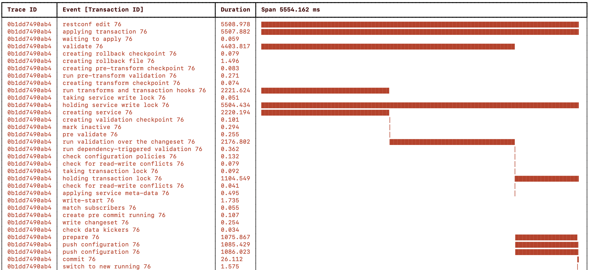
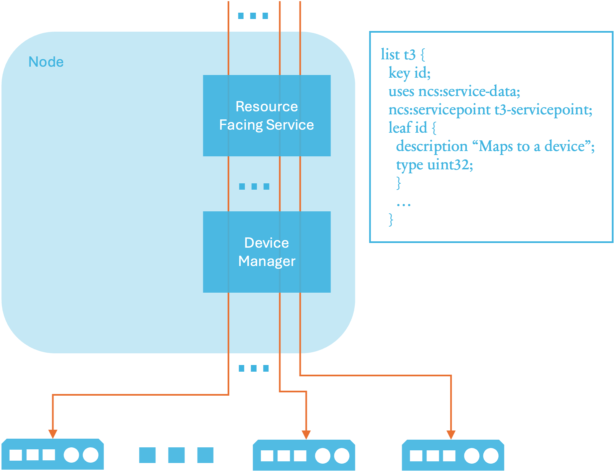
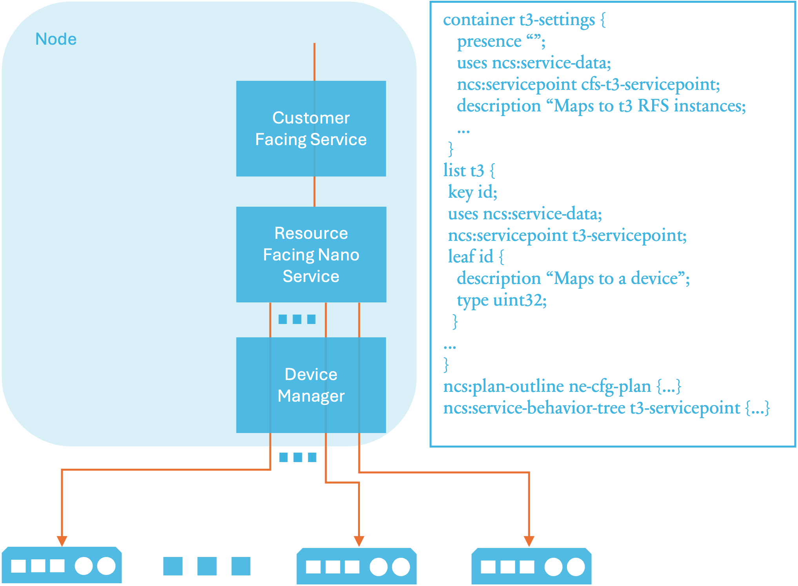
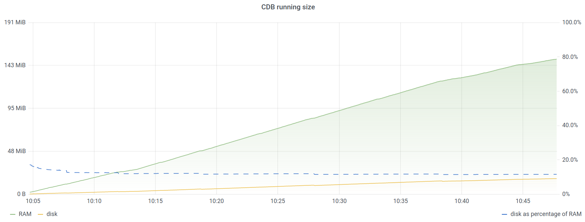

# Scaling and Performance Optimization

With an increasing number of services and managed devices in NSO, performance becomes a more important aspect of the system. At the same time, other aspects, such as the way you organize code, also start playing an important role when using NSO on a bigger scale.

The following section examines these concerns and presents the available options for scaling your NSO automation solution.

## Understanding Your Use Case <a href="#ncs.development.scaling.tracing" id="ncs.development.scaling.tracing"></a>

NSO allows you to tackle different automation challenges and every solution has its own specifics. Therefore, the best approach to scaling depends on the way the solution is implemented. What works in one case may be useless, or effectively degrade performance, for another. You must first analyze and understand how your particular use case behaves, which will then allow you to take the right approach to scaling.

When trying to improve the performance, a very good, possibly even the best starting point is to inspect the tracing data. Tracing is further described in [Progress Trace](progress-trace.md). Yet a simple `commit | details` command already provides a lot of useful data.


```cli
admin@ncs(config-mysvc-test)# commit | details
 2022-09-16T09:17:48.977 applying transaction...
entering validate phase for running usid=54 tid=225 trace-id=3a4a3b7f-a09f-4f9d-b05e-1656310ea5b6
 2022-09-16T09:17:48.977 creating rollback checkpoint... ok (0.000 s)
 2022-09-16T09:17:48.978 creating rollback file... ok (0.004 s)
 2022-09-16T09:17:48.983 creating pre-transform checkpoint... ok (0.000 s)
 2022-09-16T09:17:48.983 run pre-transform validation... ok (0.000 s)
 2022-09-16T09:17:48.983 creating transform checkpoint... ok (0.000 s)
 2022-09-16T09:17:48.983 run transforms and transaction hooks...
 2022-09-16T09:17:48.985 taking service write lock... ok (0.000 s)
 2022-09-16T09:17:48.985 holding service write lock...
 2022-09-16T09:17:48.986 service /mysvc[name='test']: run service... ok (0.012 s)
 2022-09-16T09:17:48.999 run transforms and transaction hooks: ok (0.016 s)
 2022-09-16T09:17:48.999 creating validation checkpoint... ok (0.000 s)
 2022-09-16T09:17:49.000 mark inactive... ok (0.000 s)
 2022-09-16T09:17:49.001 pre validate... ok (0.000 s)
 2022-09-16T09:17:49.001 run validation over the changeset... ok (0.000 s)
 2022-09-16T09:17:49.002 run dependency-triggered validation... ok (0.000 s)
 2022-09-16T09:17:49.003 check configuration policies... ok (0.000 s)
 2022-09-16T09:17:49.003 check for read-write conflicts... ok (0.000 s)
 2022-09-16T09:17:49.004 taking transaction lock... ok (0.000 s)
 2022-09-16T09:17:49.004 holding transaction lock...
 2022-09-16T09:17:49.004 check for read-write conflicts... ok (0.000 s)
 2022-09-16T09:17:49.004 applying service meta-data... ok (0.000 s)
leaving validate phase for running usid=54 tid=225 trace-id=3a4a3b7f-a09f-4f9d-b05e-1656310ea5b6 (0.028 s)
entering write-start phase for running usid=54 tid=225 trace-id=3a4a3b7f-a09f-4f9d-b05e-1656310ea5b6
 2022-09-16T09:17:49.005 cdb: write-start
 2022-09-16T09:17:49.006 ncs-internal-service-mux: write-start
 2022-09-16T09:17:49.006 ncs-internal-device-mgr: write-start
 2022-09-16T09:17:49.007 cdb: match subscribers... ok (0.000 s)
 2022-09-16T09:17:49.007 cdb: create pre commit running... ok (0.000 s)
 2022-09-16T09:17:49.007 cdb: write changeset... ok (0.000 s)
 2022-09-16T09:17:49.008 check data kickers... ok (0.000 s)
leaving write-start phase for running usid=54 tid=225 trace-id=3a4a3b7f-a09f-4f9d-b05e-1656310ea5b6 (0.003 s)
entering prepare phase for running usid=54 tid=225 trace-id=3a4a3b7f-a09f-4f9d-b05e-1656310ea5b6
 2022-09-16T09:17:49.009 cdb: prepare
 2022-09-16T09:17:49.009 ncs-internal-device-mgr: prepare
 2022-09-16T09:17:49.022 device ex1: push configuration...
leaving prepare phase for running usid=54 tid=225 trace-id=3a4a3b7f-a09f-4f9d-b05e-1656310ea5b6 (0.121 s)
entering commit phase for running usid=54 tid=225 trace-id=3a4a3b7f-a09f-4f9d-b05e-1656310ea5b6
 2022-09-16T09:17:49.130 cdb: commit
 2022-09-16T09:17:49.130 cdb: switch to new running... ok (0.000 s)
 2022-09-16T09:17:49.132 ncs-internal-device-mgr: commit
 2022-09-16T09:17:49.149 device ex1: push configuration: ok (0.126 s)
 2022-09-16T09:17:49.151 holding service write lock: ok (0.166 s)
 2022-09-16T09:17:49.151 holding transaction lock: ok (0.147 s)
leaving commit phase for running usid=54 tid=225 trace-id=3a4a3b7f-a09f-4f9d-b05e-1656310ea5b6 (0.021 s)
 2022-09-16T09:17:49.151 applying transaction: ok (0.174 s)
Commit complete.
admin@ncs(config-mysvc-test)#
```


Pay attention to the time NSO spends doing specific tasks. For a simple service, these are mainly:

* Validate service data (pre-transform validation)
* Run service mapping logic
* Validate produced configuration (changeset)
* Push changes to affected devices
* Commit the new configuration

Tracing data can often quickly reveal a bottleneck, a hidden delay, or some other unexpected inefficiency in your code. The best strategy is to first address any such concerns if they show up since only well-performing code is a good candidate for further optimization. Otherwise, you might find yourself optimizing the wrong parameters and hitting a dead end. Visualizing the progress trace is often helpful in identifying bottlenecks. See [Measuring Transaction Throughput](scaling-and-performance-optimization.md#ncs.development.scaling.throughput.measure).

Analyzing the service in isolation can yield useful insight. But it may also lead you in the wrong direction because some issues only manifest under load and the data from a live system can surprise you. That is why NSO supports different ways of exposing tracing information, including operational data and notification events. Remember to always verify that your observations and assumptions hold for a live, production system, too.

## Where to Start? <a href="#d5e8370" id="d5e8370"></a>

The times for different parts of the transaction, as reported by the tracing data, are very useful in determining where to focus your efforts.

For example, if your service data model uses a very broad `must` or similar XPath statement, then NSO may potentially need to evaluate thousands of data entries. Such evaluation requires a considerable amount of additional processing and is, in turn, reflected in increased time spent in validation. The solution in this case is to limit the scope of the data referenced in the YANG constraint, which you can often achieve with a more specific XPath expression.

Similarly, if a significant amount of time is spent constructing a service mapping, perhaps there is some redundant work occurring that you could optimize? Sometimes, however, provisioning requires calls to other systems or some computationally expensive operation, which you cannot easily manage without. Then you might want to consider splitting the provisioning process into smaller pieces, using nano services, for example. See [Simplify the Per-Device Concurrent Transaction Creation Using a Nano Service](scaling-and-performance-optimization.md#ncs.development.scaling.throughput.nano) for an example use-case and references to the Nano service documentation.

In general, your own code for a single transaction with no additional load on NSO should execute quickly (sub-second, as a rule of thumb). The faster each service or action code is, the better the overall system performance. Using a service design pattern to both improve performance and scale and avoid conflicts is described in [Design to Minimize Conflicts](scaling-and-performance-optimization.md#ncs.development.scaling.throughput.conflicts).

## Divide the Work Correctly <a href="#d5e8379" id="d5e8379"></a>

Things such as reading external data or large computations should not be done inside the create code. Consider using an action to encapsulate these functions. An action does not run under the lock unless it triggers a transaction and can perform side effects as desired.

There are several ways to utilize an action:

* An action is allowed to perform side effects.
* An action can read operational data from devices or external systems.
* An action can write values to operational data in CDB, for later use from the service.
* An action can write configuration to CDB, potentially triggering a service.

Actions can be used together with nano services, see [Simplify the Per-Device Concurrent Transaction Creation Using a Nano Service](scaling-and-performance-optimization.md#ncs.development.scaling.throughput.nano).

## Optimizing Device Communication <a href="#ncs.development.scaling.devcom" id="ncs.development.scaling.devcom"></a>

With the default configuration, one of the first things you might notice standing out in the tracing data is that pushing device configuration takes a significant amount of time compared to other parts of service provisioning. Why is that?

All changes in NSO happen inside a transaction. Network devices participate in the transaction, which gives you the all-or-nothing behavior, to ensure correctness and consistency across the network. But network communication is not instantaneous and a transaction in NSO holds a lock while waiting for devices to process the change. This way, changes to network devices are serialized, even when there are multiple simultaneous transactions. However, a lock blocks other transactions from proceeding, ultimately limiting the overall NSO transaction rate.

So, in many cases, the NSO system is not really resource-constrained but merely experiencing lock contention. Therefore, making locks as short as possible is the best way to improve performance. In the example trace from the section [Understanding Your Use Case](scaling-and-performance-optimization.md#ncs.development.scaling.tracing), most of the time is spent in the prepare phase, where configuration changes are propagated to the network devices. Change propagation requires a management session with each participating device, as well as updating and validating the new configuration on the device side. Understandably, all of these tasks take time.

NSO allows you to influence this behavior. Take a look at [Commit Queue](../../operation-and-usage/operations/nso-device-manager.md#user_guide.devicemanager.commit-queue) on how to avoid long device locks with commit queues and the trade-offs they bring. Usually, enabling the commit queue feature is the first and the most effective step to significantly improving transaction times.

## Improving Subscribers <a href="#ncs.development.scaling.kicker" id="ncs.development.scaling.kicker"></a>

The CDB subscriber mechanism is used to notify the application code about CDB changes and runs at the end of the transaction commit, inside a global lock. Due to this fact, the number and configuration of subscribers affect performance and should be investigated early in your performance optimization efforts.

A badly implemented subscriber prolongs the time the transaction holds the lock, preventing other transactions from completing, in addition to the original transaction taking more time to commit. There are mainly two reasons for suboptimal operation: either the subscriber is too broad and must process too many (irrelevant) changes, or it performs more work inside the lock as necessary. As a recommended practice, the subscriber should only note the changes and schedule the processing to be done later, in order to return and release the lock as quickly as possible.

Moreover, subscribers incur processing overhead regardless of their implementation because NSO needs to communicate with the custom subscriber code, typically written in Java or Python.

That is why modern, performant code in NSO should use the kicker mechanism instead of implementing custom subscribers. While it is still possible to create a badly performing kicker, you are less likely to do so inadvertently. In most situations, kickers are also easier to implement and troubleshoot. You can read more on kickers in [Kicker](kicker.md).

## Minimizing Concurrency Conflicts <a href="#ncs.development.scaling.conflicts" id="ncs.development.scaling.conflicts"></a>

The time it takes to complete a transaction is certainly an important performance metric. However, after a certain point, it gets increasingly hard or even impossible to get meaningful improvement from optimizing each individual transaction. As it turns out, on a busy system, there are usually multiple outstanding requests. So, instead of trying to process each as fast as possible one after another, the system might process them in parallel.

<figure><figcaption><p>Running Transactions Sequentially and in Parallel</p></figcaption></figure>

In practice and as the figure shows, some parts must still be processed sequentially to ensure transactional properties. However, there is a significant gain in the overall time it takes to process all transactions in a busy system, even though each might take a little longer individually due to the concurrency overhead.

Throughput then becomes a more relevant metric. It is the number of requests or transactions that the system can process in a given time unit. While throughput is still related to individual transaction times, other factors also come into play. An important one is the way in which NSO implements concurrency and the interaction between the transaction system and your, user, code. Designing for transaction throughput is covered in detail later in this section, and the NSO concurrency model is detailed in [NSO Concurrency Model](../core-concepts/nso-concurrency-model.md).

The section provides guidance on identifying transaction conflicts and what affects their occurrence, so you can make your code more resistant to producing them. Conflicts arise more frequently on busier systems and negatively affect throughput, which makes them a good candidate for optimization.

## Fine-tuning the Concurrency Parameters <a href="#d5e8421" id="d5e8421"></a>

Depending on the specifics of the server running NSO, additional performance improvement might be possible by fine-tuning the `transaction-limits` set of configuration parameters in `ncs.conf`. Please see the ncs.conf(1) manpage for details.

## Enabling Even More Parallelism <a href="#d5e8426" id="d5e8426"></a>

If you are experiencing high resource utilization, such as memory and CPU usage, while individual transactions are optimized to execute fast and the rate of conflicts is low, it's possible you are starting to see the level of demand that pushes the limits of this system.

First, you should try adding more resources, in a scale-up manner, if possible. At the same time, you might also have some services that are using an older, less performant user code execution model. For example, the way Python code is executed is controlled by the callpoint-model option, described in [The `application` Component](../core-concepts/nso-virtual-machines/nso-python-vm.md#ncs.development.pythonvm.cthread), which you should ensure is set to the most performant setting.

Regardless, a single system cannot scale indefinitely. After you have exhausted all other options, you will need to “scale out,” that is, split the workload across multiple NSO instances. You can achieve this by using the Layered Service Architecture (LSA) approach. But the approach has its trade-offs, so make sure it provides the right benefits in your case. The LSA is further documented in [LSA Overview](../../administration/advanced-topics/layered-service-architecture.md) in Layered Service Architecture.

## Limit **`sync-from`** <a href="#d5e8436" id="d5e8436"></a>

In a brownfield environment, where the configuration is not 100% automated and controlled by NSO alone but also written to by other systems or operators, NSO is bound to end up out-of-sync with the device. How to handle synchronization is a big topic, and it is vital to understand what it means to you when things are out of sync. This will help guide your strategy.

If NSO is frequently brought out of sync, it can be tempting to invoke `sync-from` from the create callback. While it does achieve a higher degree of reliability in the sense that service modifications won't return an out-of-sync error, the impact on performance is usually catastrophic. The typical `sync-from` operation takes orders of magnitudes longer than the typical service modification, and transactional throughput will suffer greatly.

But other alternatives are often better:

* You can synchronize the configuration from the device when it reports a change rather than when the service is modified by listening for configuration change events from the device, e.g., via RESTCONF or NETCONF notifications, SNMP traps, or Syslog, and invoking `sync-from` or `partial-sync-from` when another party (not NSO) has modified the device. See also the section called [Partial Sync](developing-services/services-deep-dive.md#ch_svcref.partialsync).
* Using the `devices sync-from` command does not hold the transaction lock and run across devices concurrently, which reduces the total amount of time spent time synchronizing. This is particularly useful for periodic synchronization to lower the risk of being out-of-sync when committing configuration changes.
* Using the `no-overwrite` commit flag, you can be more lax about being in sync and focus on not overwriting the modified configuration.
* If the configuration is 100% automated and controlled by NSO alone, using `out-of-sync-behaviour accept`, you can completely ignore if the device is in sync or not.
* Letting your modification fail with an out-of-sync error and handling that error at the calling side.

## Designing for Maximal Transaction Throughput <a href="#ncs.development.scaling.throughput" id="ncs.development.scaling.throughput"></a>

Maximal transaction throughput refers to the maximum number of transactions a system can handle within a given period. Factors that can influence maximal transaction throughput include:

* Hardware capabilities (e.g., processing power, memory).
* Software efficiency.
* Network bandwidth.
* The complexity of the transactions themselves.

Besides making sure the system hardware capabilities and network bandwidth are not a bottleneck, there are four areas where the NSO user can significantly affect the transaction throughput performance for an NSO node:

* Run multiple transactions concurrently. For example, multiple concurrent RESTCONF or NETCONF edits, CLI commits, MAAPI `apply()`, nano service re-deploy, etc.
* Design to avoid conflicts and minimize the service `create()` and validation implementation. For example, in service templates and code mapping to devices or other service instances, YANG `must` statements with XPath expressions or validation code.
* Using commit queues to exclude the time to push configuration changes to devices from inside the transaction lock.
* Simplify using nano and stacked services. If the processor where NSO with a stacked service runs becomes a severe bottleneck, the added complexity of migrating the stacked service to an LSA setup can be motivated. LSA helps expose only a single service instance when scaling up the number of devices by increasing the number of available CPU cores beyond a single processor.

<figure><figcaption></figcaption></figure>

### Measuring Transaction Throughput <a href="#ncs.development.scaling.throughput.measure" id="ncs.development.scaling.throughput.measure"></a>

Measuring transaction performance includes measuring the total wall-clock time for the service deployment transaction(s) and using the detailed NSO progress trace of the transactions to find bottlenecks. The developer log helps debug the NSO internals, and the XPath trace log helps find misbehaving XPath expressions used in, for example, YANG `must` statements.

The picture below shows a visualization of the NSO progress trace when running a single transaction for two service instances configuring a device each:

<figure><figcaption></figcaption></figure>

The total RESTCONF edit took \~5 seconds, and the service mapping (“creating service” event) and validation (“run validation ...” event) were done sequentially for the service instances and took 2 seconds each. The configuration push to the devices was done concurrently in 1 second.

For progress trace documentation, see [Progress Trace](progress-trace.md).

### Running the `perf-trans` Example Using a Single Transaction <a href="#d5e8501" id="d5e8501"></a>

The `perf-trans` example from the NSO example set explores the opportunities to improve the wall-clock time performance and utilization, as well as opportunities to avoid common pitfalls.

The example uses simulated CPU loads for service creation and validation work. Device work is simulated with `sleep()` as it will not run on the same processor in a production system.

The example shows how NSO can benefit from running many transactions concurrently if the service and validation code allow concurrency. It uses the NSO progress trace feature to get detailed timing information for the transactions in the system.

The provided code sets up an NSO instance that exports tracing data to a `.csv` file, provisions one or more service instances, which each map to a device, and shows different (average) transaction times and a graph to visualize the sequences plus concurrency.

Play with the `perf-trans` example by tweaking the `measure.py` script parameters:

```code
-nt NTRANS, --ntrans NTRANS
    The number of transactions updating the same service in parallel. For this
    example, we use NTRANS parallel RESTCONF <tag>plain patch</tag>.
    Default: 1.

-nw NWORK, --nwork NWORK
    Work per transaction in the service creation and validation phases. One
    second of CPU time per work item.
    Default: 3 seconds of CPU time.

-nd 0..10, --ndtrans 0..10
    Number of devices the service will configure per service transaction.
    Default: 1

-dd DDELAY, --ddelay DDELAY
    Transaction delay (simulated by sleeping) on the netsim devices (seconds).
    Default: 0s

-cq {async,sync,bypass,none}, --cqparam {async,sync,bypass,none}
    Commit queue behavior. Select "none" to use the global or device setting.
    Default: none
```

See the README in the `perf-trans` example for details.

To run the `perf-trans` example from the NSO example set and recreate the variant shown in the progress trace above:

```bash
cd $NCS_DIR/examples.ncs/development-guide/concurrency-model/perf-trans
make NDEVS=2 python
python3 measure.py --ntrans 1 --nwork 2 --ndtrans 2 --cqparam bypass --ddelay 1
python3 ../common/simple_progress_trace_viewer.py $(ls logs/*.csv)
```

The following is a sequence diagram and the progress trace of the example, describing the transaction `t1`. The transaction deploys service configuration to the devices using a single RESTCONF `patch` request to NSO and then NSO configures the netsim devices using NETCONF:

```
RESTCONF   service   validate   push config
patch      create    config     ndtrans=2        netsim
ntrans=1   nwork=2   nwork=2    cqparam=bypass   device    ddelay=1
  t1 ------> 2s -----> 2s -----------------------> ex0 -----> 1s
                                    \------------> ex1 -----> 1s
  wall-clock 2s        2s                                     1s = 5s
```

The only part running concurrently in the example above was configuring the devices. It is the most straightforward option if transaction throughput performance is not a concern or the service creation and validation work are insignificant. A single transaction service deployment will not need to use commit queues as it is the only transaction holding the transaction lock configuring the devices inside the critical section. See the “holding transaction lock” event in the progress trace above.

Stop NSO and the netsim devices:

```bash
make stop
```

### Concurrent Transactions <a href="#d5e8524" id="d5e8524"></a>

Everything from smartphones and tablets to laptops, desktops, and servers now contain multi-core processors. For maximal throughput, the powerful multi-core systems need to be fully utilized. This way, the wall clock time is minimized when deploying service configuration changes to the network, which is usually equated with performance. Therefore, enabling NSO to spread as much work as possible across all available cores becomes important. The goal is to have service deployments maximize their utilization of the total available CPU time to deploy services faster to the users who ordered them.

Close to full utilization of every CPU core when running under maximal load, for example, ten transactions to ten devices, is ideal, as some process viewer tools such as `htop` visualize with meters:

```
    0[|||||||||||||||||||||||||||||||||||||||||||||||||100.0%]
    1[|||||||||||||||||||||||||||||||||||||||||||||||||100.0%]
    2[||||||||||||||||||||||||||||||||||||||||||||||||||99.3%]
    3[||||||||||||||||||||||||||||||||||||||||||||||||||99.3%]
    4[||||||||||||||||||||||||||||||||||||||||||||||||||99.3%]
    5[||||||||||||||||||||||||||||||||||||||||||||||||||99.3%]
    6[||||||||||||||||||||||||||||||||||||||||||||||||||98.7%]
    7[||||||||||||||||||||||||||||||||||||||||||||||||||98.7%]
    8[||||||||||||||||||||||||||||||||||||||||||||||||||98.7%]
    9[||||||||||||||||||||||||||||||||||||||||||||||||||98.7%]
    ...
```

One transaction per RFS instance and device will allow each NSO transaction to run on a separate core concurrently. Multiple concurrent RESTCONF or NETCONF edits, CLI commits, MAAPI `apply()`, nano service re-deploy, etc. Keep the number of running concurrent transactions equal to or below the number of cores available in the multi-core processor to avoid performance degradation due to increased contention on system internals and resources. NSO helps by limiting the number of transactions applying changes in parallel to, by default, the number of logical processors (e.g., CPU cores). See [ncs.conf(5)](../../man/section5.md#ncs.conf) in Manual Pages under `/ncs-config/transaction-limits/max-transactions` for details.

<figure><figcaption></figcaption></figure>

### Design to Minimize Conflicts <a href="#ncs.development.scaling.throughput.conflicts" id="ncs.development.scaling.throughput.conflicts"></a>

Conflicts between transactions and how to avoid them are described in [Minimizing Concurrency Conflicts](scaling-and-performance-optimization.md#ncs.development.scaling.conflicts) and in detail by the [NSO Concurrency Model](../core-concepts/nso-concurrency-model.md). While NSO can handle transaction conflicts gracefully with retries, retries affect transaction throughput performance. A simple but effective design pattern to avoid conflicts is to update one device with one Resource Facing Service (RFS) instance where service instances do not read each other's configuration changes.

<figure><figcaption></figcaption></figure>

### Design to Minimize Service and Validation Processing Time <a href="#d5e8544" id="d5e8544"></a>

An overly complex service or validation implementation using templates, code, and XPath expressions increases the processing required and, even if transactions are processed concurrently, will affect the wall-clock time spent processing and, thus, transaction throughput.

When data processing performance is of interest, the best practice rule of thumb is to ensure that `must` and `when` statement XPath expressions in YANG models and service templates are only used as necessary and kept as simple as possible.

If a service creates a significant amount of configuration data for devices, it is often significantly faster using a single MAAPI `shared_set_values()` call instead of using multiple `create()` and `set()` calls or a service template.

#### **Running the `perf-setvals` Example Using a Single Call to MAAPI `shared_set_values()`**

The `perf-setvals` example writes configuration to an access control list and a route list of a Cisco Adaptive Security Appliance (ASA) device. It uses either MAAPI Python `create()` and `set()` calls, Python `shared_set_values()`, or Java `sharedSetValues()` to write the configuration in XML format.

To run the `perf-setvals` example using MAAPI Python `create()` and `set()` calls to create 3000 rules and 3000 routes on one device:

```bash
cd $NCS_DIR/examples.ncs/development-guide/concurrency-model/perf-setvals
./measure.sh -r 3000 -t py_create -n true
```

The commit uses the `no-networking` parameter to skip pushing the configuration to the simulated and un-proportionally slow Cisco ASA netsim device. The resulting NSO progress trace:

<figure><figcaption></figcaption></figure>

Next, run the `perf-setvals` example using a single MAAPI Python `shared_set_values()` call to create 3000 rules and 3000 routes on one device:

```
./measure.sh -r 3000 -t py_setvals_xml -n true
```

The resulting NSO progress trace:

<figure><figcaption></figcaption></figure>

Using the MAAPI `shared_set_values()` function, the service `create` callback is, for this example, \~5x faster than using the MAAPI `create()` and `set()` functions. The total wall-clock time for the transaction is more than 2x faster, and the difference will increase for larger transactions.

Stop NSO and the netsim devices:

```bash
make stop
```

### Use a Data Kicker Instead of a CDB Subscriber <a href="#d5e8549" id="d5e8549"></a>

A kicker triggering on a CDB change, a data-kicker, should be used instead of a CDB subscriber when the action taken does not have to run inside the transaction lock, i.e., the critical section of the transaction. A CDB subscriber will be invoked inside the critical section and, thus, will have a negative impact on the transaction throughput. See [Improving Subscribers](scaling-and-performance-optimization.md#ncs.development.scaling.kicker) for more details.

### Shorten the Time Used for Writing Configuration to Devices <a href="#d5e8553" id="d5e8553"></a>

Writing to devices and other network elements that are slow to configure will stall transaction throughput if you do not enable commit queues, as transactions waiting for the transaction lock to be released cannot start configuring devices before the transaction ahead of them is done writing. For example, if one device is configured using CLI transported with [IP over Avian Carriers](https://datatracker.ietf.org/doc/html/rfc1149), the transactions, including such a device, will significantly stall transactions behind it going to devices supporting [RESTCONF](https://datatracker.ietf.org/doc/html/rfc8040) or [NETCONF](https://datatracker.ietf.org/doc/html/rfc6241) over a fast optical transport. Where transaction throughput performance is a concern, choosing devices that can be configured efficiently to implement their part of the service configuration is wise.

### Running the `perf-trans` Example Using One Transaction per Device <a href="#d5e8559" id="d5e8559"></a>

Dividing the service creation and validation work into two separate transactions, one per device, allows the work to be spread across two CPU cores in a multi-core processor. To run the `perf-trans` example with the work divided into one transaction per device:

```bash
cd $NCS_DIR/examples.ncs/development-guide/concurrency-model/perf-trans
make stop clean NDEVS=2 python
python3 measure.py --ntrans 2 --nwork 1 --ndtrans 1 --cqparam bypass --ddelay 1
python3 ../common/simple_progress_trace_viewer.py $(ls logs/*.csv)
```

The resulting NSO progress trace:

<figure><figcaption></figcaption></figure>

A sequence diagram with transactions `t1` and `t2` deploying service configuration to two devices using RESTCONF `patch` requests to NSO with NSO configuring the netsim devices using NETCONF:

```
RESTCONF   service   validate   push config
patch      create    config     ndtrans=1       netsim            netsim
ntrans=2   nwork=1   nwork=1    cqparam=bypass  device  ddelay=1  device  ddelay=1
  t1 ------> 1s -----> 1s ---------------------> ex0 ---> 1s
  t2 ------> 1s -----> 1s ---------------------------------------> ex1 ---> 1s
  wall-clock 1s        1s                                 1s                1s = 4s
```

Note how the service creation and validation work now is divided into 1s per transaction and runs concurrently on one CPU core each. However, the two transactions cannot push the configuration concurrently to a device each as the config push is done inside the critical section, making one of the transactions wait for the other to release the transaction lock. See the two “holding the transaction lock” events in the above progress trace visualization.

To enable transactions to push configuration to devices concurrently, we must enable commit queues.

### Using Commit Queues <a href="#d5e8576" id="d5e8576"></a>

The concept of a network-wide transaction requires NSO to wait for the managed devices to process the configuration change before exiting the critical section, i.e., before NSO can release the transaction lock. In the meantime, other transactions have to wait their turn to write to CDB and the devices. The commit queue feature avoids waiting for configuration to be written to the device and increases the throughput. For most use cases, commit queues improve transaction throughput significantly.

Writing to a commit queue instead of the device moves the device configuration push outside of the critical region, and the transaction lock can instead be released when the change has been written to the commit queue.

<figure><figcaption></figcaption></figure>

For commit queue documentation, see [Commit Queue](../../operation-and-usage/operations/nso-device-manager.md#user_guide.devicemanager.commit-queue).

### Enabling Commit Queues for the perf-trans Example <a href="#d5e8585" id="d5e8585"></a>

Enabling commit queues allows the two transactions to spread the create, validation, and configuration push to devices work across CPU cores in a multi-core processor. Only the CDB write and commit queue write now remain inside the critical section, and the transaction lock is released as soon as the device configuration changes have been written to the commit queues instead of waiting for the config push to the devices to complete. To run the `perf-trans` example with the work divided into one transaction per device and commit queues enabled:

```bash
make stop clean NDEVS=2 python
python3 measure.py --ntrans 2 --nwork 1 --ndtrans 1 --cqparam sync --ddelay 1
python3 ../common/simple_progress_trace_viewer.py $(ls logs/*.csv)
```

The resulting NSO progress trace:

<figure><figcaption></figcaption></figure>

A sequence diagram with transactions `t1` and `t2` deploying service configuration to two devices using RESTCONF `patch` requests to NSO with NSO configuring the netsim devices using NETCONF:

```
RESTCONF   service   validate   push config
patch      create    config     ndtrans=1        netsim
ntrans=2   nwork=1   nwork=1    cqparam=sync     device    ddelay=1
  t1 ------> 1s -----> 1s --------------[----]---> ex0 -----> 1s
  t2 ------> 1s -----> 1s --------------[----]---> ex1 -----> 1s
  wall-clock 1s        1s                                     1s = 3s
```

Note how the two transactions now push the configuration concurrently to a device each as the config push is done outside of the critical section. See the two push configuration events in the above progress trace visualization.

Stop NSO and the netsim devices:

```bash
make stop
```

Running the `perf-setvals` example with two devices and commit queues enabled will produce a similar result.

### Simplify the Per-Device Concurrent Transaction Creation Using a Nano Service <a href="#ncs.development.scaling.throughput.nano" id="ncs.development.scaling.throughput.nano"></a>

The `perf-trans` example service uses one transaction per service instance where each service instance configures one device. This enables transactions to run concurrently on separate CPU cores in a multi-core processor. The example sends RESTCONF `patch` requests concurrently to start transactions that run concurrently with the NSO transaction manager. However, dividing the work into multiple processes may not be practical for some applications using the NSO northbound interfaces, e.g., CLI or RESTCONF. Also, it makes a future migration to LSA more complex.

To simplify the NSO manager application, a resource-facing nano service (RFS) can start a process per service instance. The NSO manager application or user can then use a single transaction, e.g., CLI or RESTCONF, to configure multiple service instances where the NSO nano service divides the service instances into transactions running concurrently in separate processes.

<figure><figcaption></figcaption></figure>

The nano service can be straightforward, for example, using a single `t3:configured` state to invoke a service template or a `create()` callback. If validation code is required, it can run in a nano service post-action, `t3:validated` state, instead of a validation point callback to keep the validation code in the process created by the nano service.

<figure><figcaption></figcaption></figure>

See [Nano Services for Staged Provisioning](../core-concepts/nano-services.md) and [Develop and Deploy a Nano Service](../introduction-to-automation/develop-and-deploy-a-nano-service.md) for Nano service documentation.

### Simplify Using a CFS and Minimize Diff-set Calculation Time <a href="#d5e8621" id="d5e8621"></a>

A Customer Facing Service (CFS) that is stacked with the RFS and maps to one RFS instance per device can simplify the service that is exposed to the NSO northbound interfaces so that a single NSO northbound interface transaction spawns multiple transactions, for example, one transaction per RFS instance when using the `converge-on-re-deploy` YANG extension with the nano service behavior tree.

<figure><figcaption></figcaption></figure>

Furthermore, the time spent calculating the diff-set, as seen with the `saving reverse diff-set and applying changes` event in the[ perf-setvals example](scaling-and-performance-optimization.md#running-the-perf-setvals-example-using-a-single-call-to-maapi-shared_set_values), can be [optimized using a stacked service design](developing-services/services-deep-dive.md#stacked-service-design).

### Running the CFS and Nano Service enabled `perf-stack` Example <a href="#d5e8628" id="d5e8628"></a>

The `perf-stack` example showcases how a CFS on top of a simple resource-facing nano service can be implemented with the `perf-trans` example by modifying the existing t3 RFS and adding a CFS. Instead of multiple RESTCONF transactions, the example uses a single CLI CFS service commit that updates the desired number of service instances. The commit configures multiple service instances in a single transaction where the nano service runs each service instance in a separate process to allow multiple cores to be used concurrently.

<figure><figcaption></figcaption></figure>

Run as below to start two transactions with a 1-second CPU time workload per transaction in both the service and validation callbacks, each transaction pushing the device configuration to one device, each using a synchronous commit queue, where each device simulates taking 1 second to make the configuration changes to the device:

```bash
cd $NCS_DIR/examples.ncs/development-guide/concurrency-model/perf-stack
./showcase.sh -d 2 -t 2 -w 1 -r 1 -q 'True' -y 1
```

<figure><figcaption></figcaption></figure>

The above progress trace visualization is truncated to fit, but notice how the `t3:validated` state action callbacks, `t3:configured` state service creation callbacks and configuration push from the commit queues are running concurrently (on separate CPU cores) when initiating the service deployment with a single transaction started by the CLI commit.

A sequence diagram describing the transaction `t1` deploying service configuration to the devices using the NSO CLI:

```
                                                              config
        CFS             validate  service  push config        change
CLI     create    Nano  config    create   ndtrans=1   netsim subscriber
commit  trans=2   RFS   nwork=1   nwork=1  cq=True     device ddelay=1
                  t1 --> 1s -----> 1s -------[----]---> ex0 ---> 1s
  t -----> t --->
                  t2 --> 1s -----> 1s -------[----]---> ex1 ---> 1s
              wall-clock 1s        1s                            1s=3s
```

The two transactions run concurrently, deploying the service in \~3 seconds (plus some overhead) of wall-clock time. Like the `perf-trans` example, you can play around with the `perf-stack` example by tweaking the parameters.

```
-d  NDEVS
    The number of netsim (ConfD) devices (network elements) started.
    Default 4

-t  NTRANS
    The number of transactions updating the same service in parallel.
    Default: $NDEVS

-w  NWORK
    Work per transaction in the service creation and validation phases. One
    second of CPU time per work item.
    Default: 3 seconds of CPU time.

-r  NDTRANS
    Number of devices the service will configure per service transaction.
    Default: 1

-c  USECQ
    Use device commit queues.
    Default: True

-y  DEV_DELAY
    Transaction delay (simulated by sleeping) on the netsim devices (seconds).
    Default: 1 second
```

See the `README` in the `perf-stack` example for details. For even more details, see the steps in the `showcase` script.

Stop NSO and the netsim devices:

```bash
make stop
```

### Migrating to and Scale Up Using an LSA Setup <a href="#d5e8658" id="d5e8658"></a>

If the processor where NSO runs becomes a severe bottleneck, the CFS can migrate to a layered service architecture (LSA) setup. The `perf-stack` example implements stacked services, a CFS abstracting the RFS. It allows for easy migration to an LSA setup to scale with the number of devices or network elements participating in the service deployment. While adding complexity, LSA allows exposing a single CFS instance for all processors instead of one per processor.


Before considering taking on the complexity of a multi-NSO node LSA setup, make sure you have done the following:

* Explored all possible avenues of design and optimization improvements described so far in this section.
* Measured the transaction performance to find bottlenecks.
* Optimized any bottlenecks to reduce their overhead as much as possible.
* Observe that the available processor cores are all fully utilized.
* Explored running NSO on a more powerful processor with more CPU cores and faster clock speed.
* If there are more devices and RFS instances created at one point than available CPU cores, verify that increasing the number of CPU cores will result in a significant improvement. I.e., if the CPU processing spent on service creation and validation is substantial, the bottleneck, compared to writing the configuration to CDB and the commit queues and pushing the configuration to the devices.

Migrating to an LSA setup should only be considered after checking all boxes for the above items.


<figure><figcaption></figcaption></figure>

### Running the LSA-enabled `perf-lsa` Example <a href="#d5e8680" id="d5e8680"></a>

The `perf-lsa` example builds on the `perf-stack` example and showcases an LSA setup using two RFS NSO instances, `lower-nso-1` and `lower-nso-2`, with a CFS NSO instance, `upper-nso`.

<figure><figcaption></figcaption></figure>

You can imagine adding more RFS NSO instances, `lower-nso-3`, `lower-nso-4`, etc., to the existing two as the number of devices increases. One NSO instance per multi-core processor and at least one CPU core per device (network element) is likely the most performant setup for this simulated work example. See [LSA Overview](../../administration/advanced-topics/layered-service-architecture.md) in Layered Service Architecture for more.

As an example, a variant that starts four RFS transactions with a 1-second CPU time workload per transaction in both the service and validation callbacks, each RFS transaction pushing the device configuration to 1 device using synchronous commit queues, where each device simulates taking 1 second to make the configuration changes to the device:

```bash
cd $NCS_DIR/examples.ncs/development-guide/concurrency-model/perf-lsa
./showcase.sh -d 2 -t 2 -w 1 -r 1 -q 'True' -y 1
```

The three NSO progress trace visualizations show NSO on the CFS and the two RFS nodes. Notice how the CLI commit starts a transaction on the CFS node and configures four service instances with two transactions on each RFS node to push the resulting configuration to four devices.

<figure><figcaption><p>NSO CFS Node</p></figcaption></figure>

<figure><figcaption><p>NSO RFS Node 1 (Truncated to Fit)</p></figcaption></figure>

<figure><figcaption><p>NSO RFS Node 2 (Truncated to Fit)</p></figcaption></figure>

A sequence diagram describing the transactions on RFS 1 `t1` `t2` and RFS 2 `t1` `t2`. The transactions deploy service configuration to the devices using the NSO CLI:

```
                                                             config
       CFS             validate  service  push config        change
CLI    create    Nano  config    create   ndtrans=1   netsim subscriber
commit ntrans=2  RFS 1 nwork=1   nwork=1  cq=True     device ddelay=1
  t -----> t ---> t1 --> 1s -----> 1s -------[----]---> ex0 ---> 1s
            \     t2 --> 1s -----> 1s -------[----]---> ex1 ---> 1s
             \   RFS 2
              --> t1 --> 1s -----> 1s -------[----]---> ex2 ---> 1s
                  t2 --> 1s -----> 1s -------[----]---> ex3 ---> 1s
              wall-clock 1s        1s                            1s=3s
```

The four transactions run concurrently, two per RFS node, performing the work and configuring the four devices in \~3 seconds (plus some overhead) of wall-clock time.

You can play with the `perf-lsa` example by tweaking the parameters.

```
-d  LDEVS
    Number of netsim (ConfD) devices (network elements) started per RFS
    NSO instance.
    Default 2 (4 total)

-t  NTRANS
    Number of transactions updating the same service in parallel per RFS
    NSO instance. Here, one per device.
    Default: $LDEVS ($LDEVS * 2 total)

-w  NWORK
    Work per transaction in the service creation and validation phases. One
    second of CPU time per work item.
    Default: 3 seconds of CPU time.

-r  NDTRANS
    Number of devices the service will configure per service transaction.
    Default: 1

-q  USECQ
    Use device commit queues.
    Default: True

-y  DEV_DELAY
    Transaction delay (simulated by sleeping) on the netsim devices (seconds).
    Default: 1 second
```

See the `README` in the `perf-lsa` example for details. For even more details, see the steps in the `showcase` script.

Stop NSO and the netsim devices:

```bash
make stop
```

## Scaling RAM and Disk <a href="#ncs.development.scaling.memory" id="ncs.development.scaling.memory"></a>

NSO contains an internal database called CDB, which stores both configuration and operational state data. Understanding the resource consumption of NSO at a steady state is mostly about understanding CDB, as it typically stands for the vast majority of resource usage.

### CDB <a href="#d5e8731" id="d5e8731"></a>

Optimized for fast access, CDB is an in-memory database that holds all data in RAM. It also keeps the data on disk for persistence. The in-memory data structure is optimized for navigating tree data but is still a compact and efficient memory structure. The on-disk format uses a log structure, making it fast to write and very compact.

The in-memory structure usually consumes 2 - 3x more than the size of the on-disk format. The on-disk log will grow as more changes are performed in the system. A periodic compaction process compacts the write log and reduces its size. Upon startup of NSO, the on-disk version of CDB will be read, and the in-memory structure will be recreated based on the log. A recently compacted CDB will thus start up faster.

By default, NSO automatically determines when to compact CDB. It is visible in the `devel.log` when CDB compaction takes place. Compaction may require significant time, during which write transactions cannot be performed. In certain use cases, it may be preferable to disable automatic compaction by CDB and instead trigger compaction manually according to the specific needs. See [Compaction](../../administration/advanced-topics/compaction.md) for more details.

### Services and Devices in CDB <a href="#d5e8738" id="d5e8738"></a>

CDB is a YANG-modeled database. By writing a YANG model, it is possible to store any kind of data in NSO and access it via one of the northbound interfaces of NSO. From this perspective, a service or a device's configuration is like most other YANG-modeled data. The number of service instances in NSO in the steady state affects how much space the data consumes in RAM and on disk.

But keep in mind that services tend to be modified from time to time, and with a higher total number of service instances, changes to those services are more likely. A higher number of service instances means more transactions to deploy changes, which means an increased need for optimizing transactional throughput, available CPU processing, RAM, and disk. See [Designing for Maximal Transaction Throughput](scaling-and-performance-optimization.md#ncs.development.scaling.throughput) for details.

### CDB Stores the YANG Model Schema <a href="#d5e8743" id="d5e8743"></a>

In addition to storing instance data, CDB also stores the schema (the YANG models), on disk and reads it into memory on startup. Having a large schema (many or large YANG models) loaded means both disk and RAM will be used, even when starting up an "empty" NSO, i.e., no instance data is stored in CDB.

In particular, device YANG models can be of considerable size. For example, the YANG models in recent versions of Cisco IOS XR have over 750,000 lines. Loading one such NED will consume about 1GB GB of RAM and slightly less disk space. In a mixed vendor network, you would load NEDs for all or some of these device types. With CDM, you can have multiple XR NEDs loaded to support communicating with different versions of XR and similarly for other devices, further consuming resources.

In comparison, most CLI NEDs only model a subset of a device and, are as a result, much smaller, most often under 100,000 lines of YANG.

For small NSO systems, the schema will usually consume more resources than the instance data, and NEDs, in particular, are the most significant contributors to resource consumption. As the system grows and more service and device configurations are added, the percentage of the total resource usage used for NED YANG models will decrease.

Note that the schema is memory mapped into shared memory, so even though multiple Python VMs might be started, memory usage will not increase as it shares memory between different clients. The Java VM uses its own copy of the schema, which is also why we can see that the JVM memory consumption follows the size of the loaded YANG schema.

### The Size of CDB <a href="#d5e8750" id="d5e8750"></a>

Accurately predicting the size of CDB means accurately modeling its internal data structure. Since the result will depend on the YANG models and what actual values are stored in the database, the easiest way to understand of how the size grows is to start NSO with the schema and data in question and then measure the resource usage.

Performing accurate measurements can be a tedious process or sometimes impossible. When impossible, an estimate can be reached by extrapolating from known data, which is usually much more manageable and accurate enough.

We can look at the disk and RAM used for the running datastore, which stores configuration. On a freshly started NSO, it doesn't occupy much space at all:

```bash
# show ncs-state internal cdb datastore running | select ram-size | select disk-size
         DISK
NAME     SIZE      RAM SIZE
------------------------------
running  3.83 KiB  26.27 KiB
```

### Devices, Small and Large <a href="#d5e8757" id="d5e8757"></a>

Adding a device with a small configuration, in this case, a Cisco NXOS switch with about 700 lines of CLI configuration, there is a clear increase:

```bash
# show ncs-state internal cdb datastore running | select ram-size | select disk-size
NAME     DISK SIZE  RAM SIZE
--------------------------------
running  28.51 KiB  240.99 KiB
```

Compared to the size of CDB before we added the device, we can deduce that the device with its configuration takes up \~214 kB in RAM and 25 kB on disk. Adding 1000 such devices, we see how CDB resource consumption increases linearly with more devices. This graph shows the RAM and memory usage of the running datastore in CDB over time. We perform a sequential `sync-from` operation on the 1000 devices, and while it is executing, we see how resource consumption increases. At the end, resource consumption has reached about 150 MB of RAM and 25 MB of disk, equating to \~150 KiB of RAM and \~25 KiB of disk per device.

```bash
# request devices device * sync-from
```


The wildcard expansion in the request `devices device * sync-from` is processed by the CLI, which will iterate over the devices sequentially. This is inefficient and can be sped up by using `devices sync-from` which instead processes the devices concurrently. The sequential mode better produces a graph that better illustrates how this scales, which is why it is used here.


<figure><figcaption></figcaption></figure>

A device with a larger configuration will consume more space. With a single Juniper MX device that has a configuration with close to half a million lines of configuration, there's a substantial increase:

```bash
# show ncs-state internal cdb datastore running | select ram-size | select disk-size
NAME     DISK SIZE  RAM SIZE
--------------------------------
running  4.59 MiB  33.97 MiB
```

Similarly, adding more such devices allows monitoring of how it scales linearly. In the end, with 100 devices, CDB consumes 3.35 GB of RAM and 450 MB of disk, or \~33.5 MiB of RAM and \~4.5 MiB disk space per device.

<figure><figcaption></figcaption></figure>

Thus, you must do more than dimension your NSO installation based on the number of devices. You must also understand roughly how much resources each device will consume.

Unless a device uses NETCONF, NSO will not store the configuration as retrieved from the device. When configuration is retrieved, it is parsed by the NED into a structured format.

For example, here is a basic BGP stanza from a Cisco IOS device:

```
router bgp 64512
address-family ipv4 vrf TEST
no synchronization
redistribute connected metric 123 route-map IPV4-REDISTRIBUTE-CONNECTED-TO-BGP
!
```

After being parsed by the IOS CLI NED, the equivalent configuration looks like this in NSO:

```xml
<router xmlns="urn:ios">
    <bgp>
    <as-no>64512</as-no>
    <address-family>
        <with-vrf>
        <ipv4>
            <af>unicast</af>
            <vrf>
            <name>TEST</name>
            <redistribute>
                <connected>
                    <metric>123</metric>
                    <route-map>IPV4-REDISTRIBUTE-CONNECTED-TO-BGP</route-map>
                </connected>
                <static/>
            </redistribute>
            </vrf>
        </ipv4>
        </with-vrf>
    </address-family>
    </bgp>
</router>
```

A single line, such as `redistribute connected metric 123 route-map IPV4-REDISTRIBUTE-CONNECTED-TO-BGP` , is parsed into a structure of multiple nodes / YANG leaves. There is no exact correlation between the number of lines of configuration with the space it consumes in NSO. The easiest way to determine the resource consumption of a device's configuration is thus to load it into NSO and check the size of CDB before and after.

### Planning Resource Consumption <a href="#d5e8790" id="d5e8790"></a>

Forming a rough estimate of CDB resource consumption for planning can be helpful.

Divide your devices into categories. Get a rough measurement for an exemplar in each category, add a safety margin, e.g., double the resource consumption, and multiply by the number of devices in that category. Example:

<table data-full-width="true"><thead><tr><th>Device Type</th><th>RAM</th><th>Disk</th><th>Number of Devices</th><th>Margin</th><th>Total RAM</th><th>Total Disk</th></tr></thead><tbody><tr><td>FTTB access switch</td><td>200KiB</td><td>25KiB</td><td>30000</td><td>100%</td><td>11718MiB</td><td>1464MiB</td></tr><tr><td>Mobile Base Station</td><td>120KiB</td><td>11KiB</td><td>15000</td><td>100%</td><td>3515MiB</td><td>322MiB</td></tr><tr><td>Business CPE</td><td>50KiB</td><td>4KiB</td><td>50000</td><td>50%</td><td>3662MiB</td><td>292MiB</td></tr><tr><td>PE / Edge Router</td><td>10MiB</td><td>1MiB</td><td>1000</td><td>25%</td><td>12GiB</td><td>1.2GiB</td></tr><tr><td>Total</td><td></td><td></td><td></td><td></td><td>20.6GiB</td><td>3.3GiB</td></tr></tbody></table>

### The Size of a Service

A YANG model describes the input to services, and just like any other data in CDB, it consumes resources. Compared to the typical device configuration, where even small devices often have a few hundred lines of configuration, a small service might only have a handful of configurable inputs. Even extensive services rarely have more than 50 inputs.

When services write configuration, a reverse diff set is generated and saved as part of the service's private data. The more configuration a service writes, the larger its reverse diff set will be and, thus, the more resources it will consume. What appears as a small service with just a handful of inputs could consume considerable resources if it writes a lot of configuration. Similarly, we save a forward diff set by default, contributing to the size. Service metadata attributes, the back pointer list, and the recount are also added to the written configuration, which consumes some resources. For example, if 50 services all (share)create a node, there will be 50 backpointers in the database, which consumes some space.

### Implications of a Large CDB <a href="#d5e8858" id="d5e8858"></a>

As shown above, CDB scales linearly. Modern servers commonly support multiple terabytes of RAM, making it possible to support 50,000 - 100,000 such large router devices in NSO, well beyond the size of any currently existing network. However, beyond consuming RAM and disk space, the size of the CDB also affects the startup time of NSO and certain other operations like upgrades. In the previous example, 100 devices were used, which resulted in a CDB size of 461 MB on disk. Starting that on a standard laptop takes about 100 seconds. With 50,000 devices, CDB on-disk would be over 230 GB, which would take around 6 hours to load on the same laptop, if it had enough RAM. The typical server is considerably faster than the average laptop here, but loading a large CDB will take considerable time.

This also affects the sync/resync time in high availability setups, where the database size increases the data transfer needed.

A working system needs more than just storing the data. It must also be possible to use the devices and services and apply the necessary operations to these for the environment in which they operate. For example, it is common in brownfield environments to frequently run the `sync-from` action. Most device-related operations, including `sync-from`, can run concurrently across multiple devices in NSO. Syncing an extensive device configuration will take a few minutes or so. With 50,000 such large devices, we are looking at a total time of tens of hours or even days. Many environments require higher throughput, which could be handled using an LSA setup and spreading the devices over many NSO RFS nodes. **sync-from** is an example of an action that is easy to scale up and runs concurrently. For example, spreading the 50,000 devices over 5 NSO RFS nodes, each with 10,000 devices, would lead to a speedup close to 5x.

Using LSA, multiple Resource Facing Service (RFS) nodes can be employed to spread the devices across multiple NSO instances. This allows increasing the parallelism in sync-from and other operations, as described in [Designing for Maximal Transaction Throughput](scaling-and-performance-optimization.md#ncs.development.scaling.throughput), making it possible to scale to an almost arbitrary number of devices. Similarly, the services associated with each device are also spread across the RFS nodes, making it possible to operate on them in parallel. Finally, a top CFS node communicates with all RFS nodes, making it possible to administrate the entire setup as one extensive system.

## Checklists <a href="#d5e8868" id="d5e8868"></a>

For smooth operation of NSO instances consider all of the following:

* Ensure there is enough RAM for NSO to run, with ample headroom.
* `create()` should normally run in a few hundred milliseconds, perhaps a few seconds for extensive services.
  * Consider splitting into smaller services.
  * Stacked services allow the composition of many smaller services into a larger service. A common best-practice design pattern is to have one Resource Facing Service (RFS) instance map to one device or network element.
    * Avoid conflicts between service instances.
    * Improves performance compared to a single large service for typical modifications.
    * Only services with changed input will have their `create()` called.
    * A small change to the Customer Facing Service (CFS) that results in changes to a subset of the lower services avoids running `create()` for all lower services.
* No external calls or `sync-from` in `create()` code.
  * Use nano-services to do external calls asynchronously.
  * Never run `sync-from` from `create()` code.
* Carefully consider the complexity of XPath constraints, in particular around lists.
  * Avoid XPath expressions with linear scaling or worse.
    * For example, avoid checking something for every element in a list, as performance will drop radically as the list grows.
    * XPath expressions involving nested lists or comparisons between lists can lead to quadratic scaling.
* Make sure you have an efficient transaction ID method for NEDs.
  * In the worst case, the NED will compute the transaction ID based on a config hash, which means it will fetch the entire config to compute the transaction ID.
* Enable commit queues and ensure transactions utilize as many CPU cores in a multi-core system as possible to increase transactional throughput.
* Ensure there are enough file descriptors available.
  * In many Linux systems, the default limit is 1024.
  * If we, for example, assume that there are 4 northbound interface ports, CLI, RESTCONF, SNMP, JSON-RPC, or similar, plus a few hundred IPC ports, x 1024 == 5120. But one might as well use the next power of two, 8192, to be on the safe side.
* See [Disable Memory Overcommit](../../administration/installation-and-deployment/system-install.md#disable-memory-overcommit).

## Hardware Sizing <a href="#d5e8931" id="d5e8931"></a>

### Lab Testing and Development <a href="#d5e8933" id="d5e8933"></a>

While a minimal setup with a single CPU core and 1 GB of RAM is enough to start NSO for lab testing and development, it is recommended to have at least 2 CPU cores to avoid CPU contention and to run at least two transactions concurrently, and 4 GB of RAM to be able to load a few NEDs.

Contemporary laptops typically work well for NSO service development.

### Production <a href="#d5e8937" id="d5e8937"></a>

For production systems it is recommended to have at least 8 CPU cores and with as high clock frequency as possible. This ensures all NSO processes can run without contending for the same CPU cores. More CPU cores enable more transactions to run in parallel on the same processor. For higher-scale systems, an LSA setup should be investigated together with a technical expert. See [Designing for Maximal Transaction Throughput](scaling-and-performance-optimization.md#ncs.development.scaling.throughput).

NSO is not very disk intensive since CDB is loaded into RAM. On startup, CDB is read from disk into memory. Therefore, for fast startups of NSO, rapid backups, and other similar administrative operations, it is recommended to use a fast disk, for example, an NVMe SSD.

Network management protocols typically consume little network bandwidth. It is often less than 10 Mbps but can burst many times that. While 10 Gbps is recommended, 1 Gbps network connectivity will usually suffice. If you use High Availability (HA), the continuous HA updates are typically relatively small and do not consume a lot of bandwidth. A low latency, preferably below 1 ms and well within 10 ms, will significantly impact performance more than increasing bandwidth beyond 1 Gbps. 10 Gbps or more can make a difference for the initial synchronization in case the nodes are not in sync and avoid congestion when doing backups over the network or similar.

The in-memory portion of CDB needs to fit in RAM, and NSO needs working memory to process queries. This is a hard requirement. NSO can only function with enough memory. Less than the required amount of RAM does not lead to performance degradation - it prevents NSO from working. For example, if CDB consumes 50 GB, ensure you have at least 64 GB of RAM. There needs to be some headroom for RAM to allow temporary usage during, for example, heavy queries.

Swapping is a way to use disk space as RAM, and while it can make it possible to start an NSO instance that otherwise would not fit in RAM, it would lead to terrible performance. See [Disable Memory Overcommit](../../administration/installation-and-deployment/system-install.md#disable-memory-overcommit).

Provide at least 32GB of RAM and increase with the growth of CDB. As described in [Scaling RAM and Disk](scaling-and-performance-optimization.md#ncs.development.scaling.memory), the consumption of memory and disk resources for devices and services will vary greatly with the type and size of the service or device.
