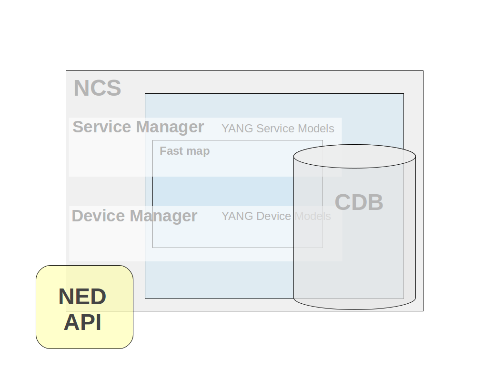
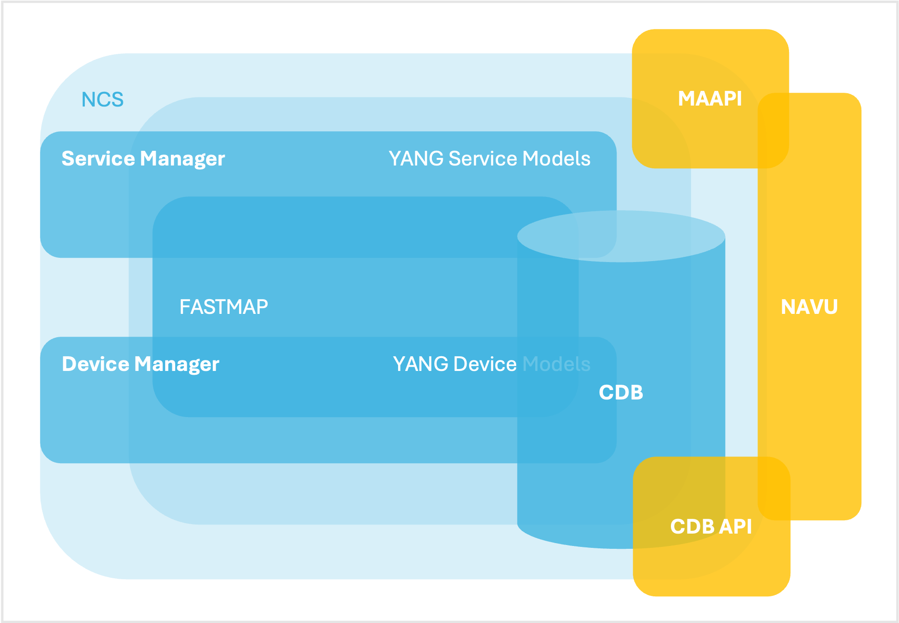
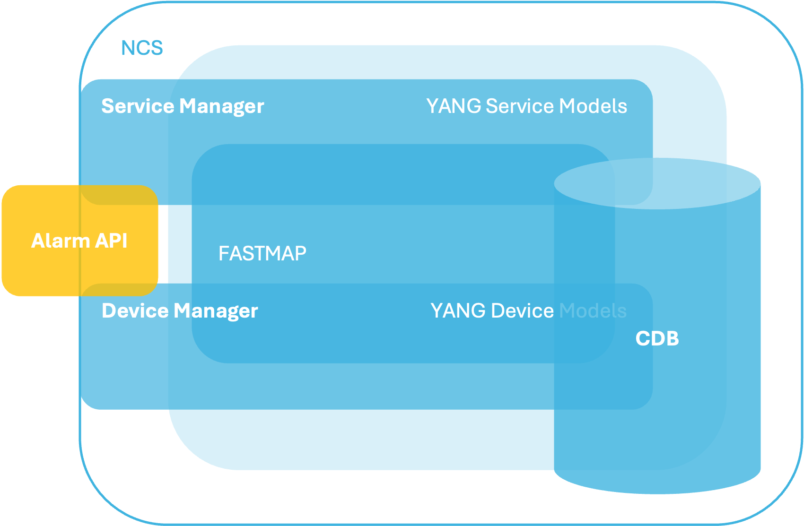
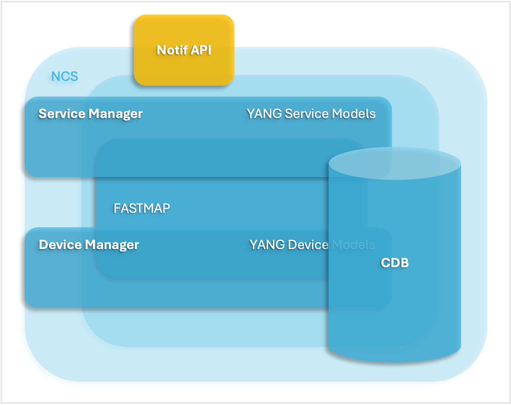
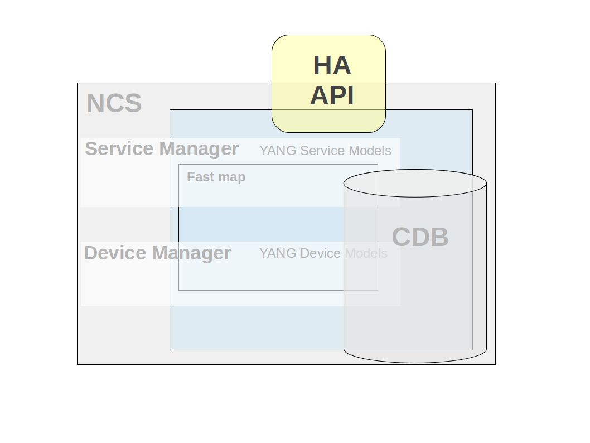
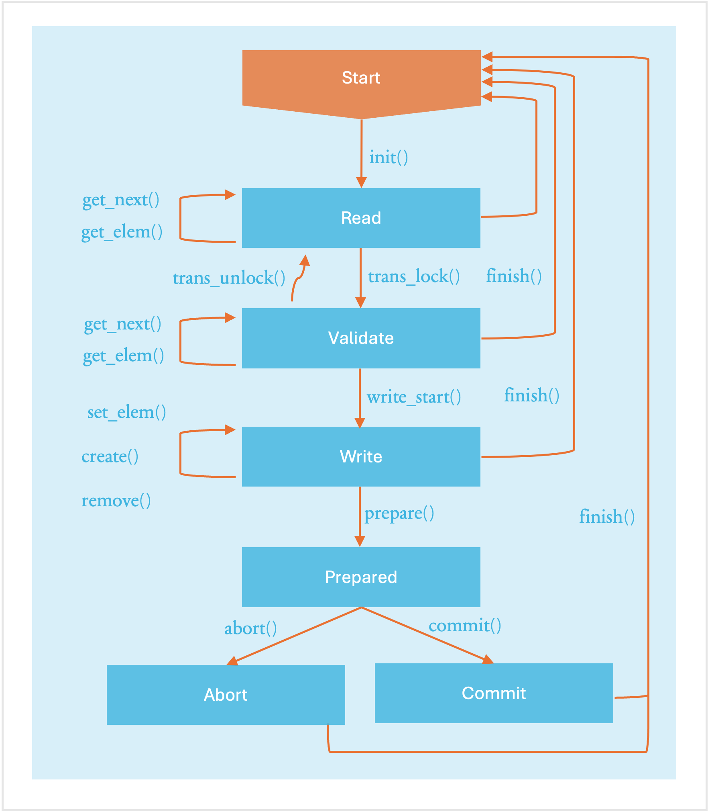
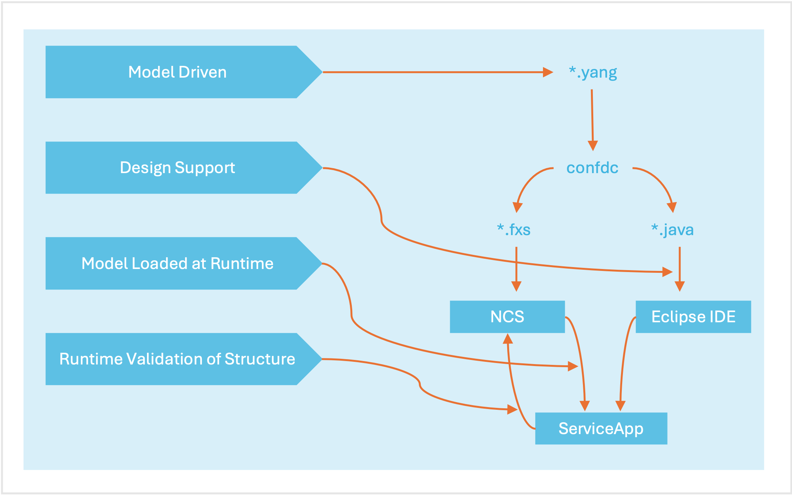
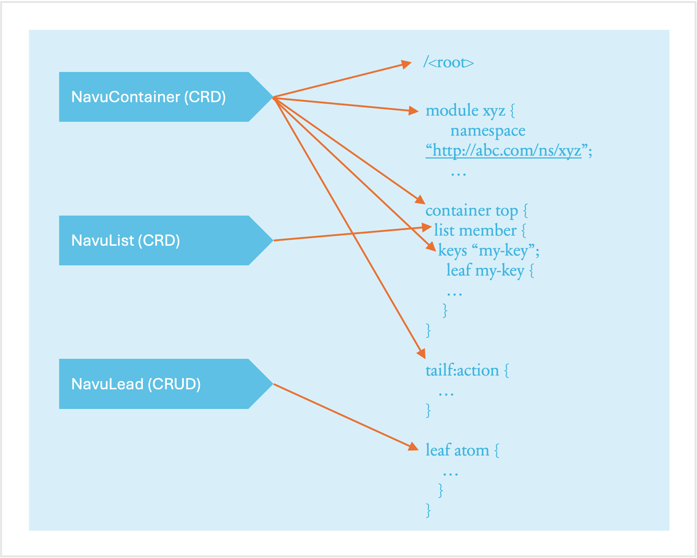

# Java API Overview

The NSO Java library contains a variety of APIs for different purposes. In this section, we introduce these and explain their usage. The Java library deliverables are found as two jar files (`ncs.jar` and `conf-api.jar`). The jar files and their dependencies can be found under `$NCS_DIR/java/jar/`.

For convenience, the Java build tool Apache ant ([https://ant.apache.org/](https://ant.apache.org/)) is used to run all of the examples. However, this tool is not a requirement for NSO.

General for all APIs is that they communicate with NSO using TCP sockets. This makes it possible to use all APIs from a remote location.

The following APIs are included in the library:

<table data-header-hidden data-full-width="false"><thead><tr><th width="345"></th><th></th></tr></thead><tbody><tr><td><strong>MAAPI (Management Agent API)</strong><br>Northbound interface that is transactional and user session-based. Using this interface both configuration and operational data can be read. Configuration data can be written and committed as one transaction. The API is complete in the way that it is possible to write a new northbound agent using only this interface. It is also possible to attach to ongoing transactions in order to read uncommitted changes and/or modify data in these transactions.</td><td></td></tr><tr><td><strong>CDB API</strong><br>The southbound interface provides access to the CDB configuration database. Using this interface configuration data can be read. In addition, operational data that is stored in CDB can be read and written. This interface has a subscription mechanism to subscribe to changes. A subscription is specified on a path that points to an element in a YANG model or an instance in the instance tree. Any change under this point will trigger the subscription. CDB has also functions to iterate through the configuration changes when a subscription has been triggered.</td><td></td></tr><tr><td><strong>DP API</strong><br>Southbound interface that enables callbacks, hooks, and transforms. This API makes it possible to provide the service callbacks that handle service-to-device mapping logic. Other usual cases are external data providers for operational data or action callback implementations. There are also transaction and validation callbacks, etc. Hooks are callbacks that are fired when certain data is written and the hook is expected to do additional modifications of data. Transforms are callbacks that are used when complete mediation between two different models is necessary.</td><td></td></tr><tr><td><strong>NED API (Network Element Driver)</strong><br>Southbound interface that mediates communication for devices that do not speak either NETCONF or SNMP. All prepackaged NEDs for different devices are written using this interface. It is possible to use the same interface to write your own NED. There are two types of NEDs, CLI NEDs and Generic NEDs. CLI NEDs can be used for devices that can be controlled by a Cisco-style CLI syntax, in this case the NED is developed primarily by building a YANG model and a relatively small part in Java. In other cases the Generic NED can be used for any type of communication protocol.</td><td></td></tr><tr><td><strong>NAVU API (Navigation Utilities)</strong><br>API that resides on top of the Maapi and Cdb APIs. It provides schema model navigation and instance data handling (read/write). Uses either a Maapi or Cdb context as data access and incorporates a subset of functionality from these (navigational and data read/write calls). Its major use is in service implementations which normally is about navigating device models and setting device data.</td><td></td></tr><tr><td><strong>ALARM API</strong><br>Eastbound API that is used both to consume and produce alarms in alignment with the NSO Alarm model. To consume alarms the AlarmSource interface is used. To produce a new alarm the AlarmSink interface is used. There is also a possibility to buffer produced alarms and make asynchronous writes to CDB to improve alarm performance.</td><td></td></tr><tr><td><strong>NOTIF API</strong><br>Northbound API that is used to subscribe to system events from NSO. These events are generated for audit log events, for different transaction states, for HA state changes, upgrade events, user sessions, etc.</td><td></td></tr><tr><td><strong>HA API (High Availability)</strong><br>Northbound api used to manage a High Availability cluster of NSO instances. An NSO instance can be in one of three states NONE, PRIMARY or SECONDARY. With the HA API the state can be queried and changed for NSO instances in the cluster.</td><td></td></tr></tbody></table>

In addition, the Conf API framework contains utility classes for data types, keypaths, etc.

## MAAPI <a href="#ug.ncs.api.maapi" id="ug.ncs.api.maapi"></a>

The Management Agent API (MAAPI) provides an interface to the Transaction engine in NSO. As such it is very versatile. Here are some examples of how the MAAPI interface can be used.

* Read and write configuration data stored by NSO or in an external database.
* Write our own northbound interface.
* We could access data inside a not yet committed transaction, e.g. as validation logic where our Java code can attach itself to a running transaction and read through the not yet committed transaction, and validate the proposed configuration change.
* During database upgrade we can access and write data to a special upgrade transaction.

The first step of a typical sequence of MAAPI API calls when writing a management application would be to create a user session. Creating a user session is the equivalent of establishing an SSH connection from a NETCONF manager. It is up to the MAAPI application to authenticate users. The TCP connection between MAAPI and NSO is neither encrypted, nor authenticated. The Maapi Java package does however include an `authenticate()` method that can be used by the application to hook into the AAA framework of NSO and let NSO authenticate the user.


```
    Socket socket = new Socket("localhost",Conf.NCS_PORT);
    Maapi maapi = new Maapi(socket);
```


When a Maapi socket has been created the next step is to create a user session and supply the relevant information about the user for authentication.


```
    maapi.startUserSession("admin", "maapi", new String[] {"admin"});
```


When the user has been authenticated and a user session has been created the Maapi reference is now ready to establish a new transaction toward a data store. The following code snippet starts a read/write transaction towards the running data store.


```
    int th = maapi.startTrans(Conf.DB_RUNNING,
                              Conf.MODE_READ_WRITE);
```


\\

The `startTrans(int db,int mode)` method of the Maapi class returns an integer that represents a transaction handler. This transaction handler is used when invoking the various Maapi methods.

An example of a typical transactional method is the `getElem()` method:


```java
    public ConfValue getElem(int tid,
                             String fmt,
                             Object... arguments)
```


The `getElem(int th, String fmt, Object ... arguments)` first parameter is the transaction handle which is the integer that was returned by the `startTrans()` method. The _`fmt`_ is a path that leads to a leaf in the data model. The path is expressed as a format string that contain fixed text with zero to many embedded format specifiers. For each specifier, one argument in the variable argument list is expected.

The currently supported format specifiers in the Java API are:

* `%d` - requiring an integer parameter (type int) to be substituted.
* `%s` - requiring a `java.lang.String` parameter to be substituted.
* `%x` - requiring subclasses of type `com.tailf.conf.ConfValue` to be substituted.

```
    ConfValue val = maapi.getElem(th,
                                  "/hosts/host{%x}/interfaces{%x}/ip",
                                  new ConfBuf("host1"),
                                  new ConfBuf("eth0"));
```

The return value _`val`_ contains a reference to a `ConfValue` which is a superclass of all the `ConfValues` that maps to the specific yang data type. If the Yang data type `ip` in the Yang model is `ietf-inet-types:ipv4-address`, we can narrow it to the subclass which is the corresponding `com.tailf.conf.ConfIPv4`.

```
    ConfIPv4 ipv4addr = (ConfIPv4)val;
```

The opposite operation of the `getElem()` is the `setElem()` method which set a leaf with a specific value.

```
    maapi.setElem(th ,
                  new ConfUInt16(1500),
                  "/hosts/host{%x}/interfaces{%x}/ip/mtu",
                  new ConfBuf("host1"),
                  new ConfBuf("eth0"));
```

We have not yet committed the transaction so no modification is permanent. The data is only visible inside the current transaction. To commit the transaction we call:

```
    maapi.applyTrans(th)
```

The method `applyTrans()` commits the current transaction to the running datastore.


```
    int th = maapi.startTrans(Conf.DB_RUNNING, Conf.MODE_READ_WRITE);
    try {
        maapi.lock(Conf.DB_RUNNING);
        /// make modifications to th
        maapi.setElem(th, .....);
        maapi.applyTrans(th);
        maapi.finishTrans(th);
    } catch(Exception e) {
        maapi.finishTrans(th);
    }  finally {
        maapi.unLock(Conf.DB_RUNNING);
    }
```


It is also possible to run the code above without `lock(Conf.DB_RUNNING)`.

Calling the `applyTrans()` method also performs additional validation of the new data as required by the data model and may fail if the validation fails. You can perform the validation beforehand, using the `validateTrans()` method.

Additionally, applying transaction can fail in case of a conflict with another, concurrent transaction. The best course of action in this case is to retry the transaction. Please see [Handling Conflicts](../nso-concurrency-model.md#ncs.development.concurrency.handling) for details.

The MAAPI is also intended to attach to already existing NSO transaction to inspect not yet committed data for example if we want to implement validation logic in Java. See the example below (Attach Maapi to the Current Transaction).

## CDB API <a href="#d5e3408" id="d5e3408"></a>

This API provides an interface to the CDB Configuration database which stores all configuration data. With this API the user can:

* Start a CDB Session to read configuration data.
* Subscribe to changes in CDB - The subscription functionality makes it possible to receive events/notifications when changes occur in CDB.

CDB can also be used to store operational data, i.e., data which is designated with a "config false" statement in the YANG data model. Operational data is read/write trough the CDB API. NETCONF and the other northbound agents can only read operational data.

Java CDB API is intended to be fast and lightweight and the CDB read Sessions are expected to be short lived and fast. The NSO transaction manager is surpassed by CDB and therefore write operations on configurational data is prohibited. If operational data is stored in CDB both read and write operations on this data is allowed.

CDB is always locked for the duration of the session. It is therefore the responsibility of the programmer to make CDB interactions short in time and assure that all CDB sessions are closed when interaction has finished.

To initialize the CDB API a CDB socket has to be created and passed into the API base class `com.tailf.cdb.Cdb`:


```
    Socket socket = new Socket("localhost", Conf.NCS_PORT);
    Cdb cdb = new Cdb("MyCdbSock",socket);
```


After the `cdb` socket has been established, a user could either start a CDB Session or start a subscription of changes in CDB:


```
    CdbSession session = cdb.startSession(CdbDBType.RUNNING);

    /*
     * Retrieve the number of children in the list and
     * loop over these children
     */
    for(int i = 0; i < session.getNumberOfInstances("/servers/server"); i++) {
        ConfBuf name =
           (ConfBuf) session.getElem("/servers/server[%d]/hostname", i);
        ConfIPv4 ip =
           (ConfIPv4) session.getElem("/servers/server[%d]/ip", i);
    }
```


We can refer to an element in a model with an expression like `/servers/server`. This type of string reference to an element is called keypath or just path. To refer to element underneath a list, we need to identify which instance of the list elements that is of interest.

This can be performed either by pinpointing the sequence number in the ordered list, starting from 0. For instance the path: `/servers/server[2]/port` refers to the `port` leaf of the third server in the configuration. This numbering is only valid during the current CDB session. Note, the database is locked during this session.

We can also refer to list instances using the key values for the list. Remember that we specify in the data model which leaf or leafs in list that constitute the key. In our case, a server has the `name` leaf as key. The syntax for keys is a space-separated list of key values enclosed within curly brackets: `{ Key1 Key2 ...}`. So, `/servers/server{www}/ip` refers to the `ip` leaf of the server whose name is `www`.

A YANG list may have more than one key for example the keypath: `/dhcp/subNets/subNet{192.168.128.0 255.255.255.0}/routers` refers to the routers list of the subnet which has key `192.168.128.0`, `255.255.255.0`.

The keypath syntax allows for formatting characters and accompanying substitution arguments. For example, `getElem("server[%d]/ifc{%s}/mtu",2,"eth0")` is using a keypath with a mix of sequence number and keyvalues with formatting characters and argument. Expressed in text the path will reference the MTU of the third server instance's interface named `eth0`.

The `CdbSession` Java class have a number of methods to control current position in the model.

* `CdbSession.cwd()` to get current position.
* `CdbSession.cd()` to change current position.
* `CdbSession.pushd()` to change and push a new position to a stack.
* `CdbSession.popd()` to change back to an stacked position.

Using relative paths and e.g. `CdbSession.pushd()`, it is possible to write code that can be re-used for common sub-trees.

The current position also includes the namespace. If an element of another namespace should be read, then the prefix of that namespace should be set in the first tag of the keypath, like: `/smp:servers/server` where `smp` is the prefix of the namespace. It is also possible to set the default namespace for the CDB session with the method `CdbSession.setNamespace(ConfNamespace)`.


```
    CdbSubscription sub = cdb.newSubscription();
    int subid = sub.subscribe(1, new servers(), "/servers/server/");

    // tell CDB we are ready for notifications
    sub.subscribeDone();

    // now do the blocking read
    while (true) {
        int[] points = sub.read();
        // now do something here like diffIterate
        .....
    }
```


The CDB subscription mechanism allows an external Java program to be notified when different parts of the configuration changes. For such a notification, it is also possible to iterate through the change set in CDB for that notification.

Subscriptions are primarily to the running data store. Subscriptions towards the operational data store in CDB is possible, but the mechanism is slightly different see below.

The first thing to do is to register in CDB which paths should be subscribed to. This is accomplished with the `CdbSubscription.subscribe(...)` method. Each registered path returns a subscription point identifier. Each subscriber can have multiple subscription points, and there can be many different subscribers.

Every point is defined through a path - similar to the paths we use for read operations, with the difference that instead of fully instantiated paths to list instances we can choose to use tag paths i.e. leave out key value parts to be able to subscribe on all instances. We can subscribe either to specific leaves, or entire sub trees. Assume a YANG data model on the form of:

```yang
   container servers {
     list server {
       key name;
       leaf name { type string;}
       leaf ip { type inet:ip-address; }
       leaf port type inet:port-number; }
       .....
```

Explaining this by example we get:

```
/servers/server/port
```

A subscription on a leaf. Only changes to this leaf will generate a notification.

```
    /servers
```

Means that we subscribe to any changes in the subtree rooted at `/servers`. This includes additions or removals of server instances, as well as changes to already existing server instances.

```
    /servers/server{www}/ip
```

Means that we only want to be notified when the server "www" changes its ip address.

```
    /servers/server/ip
```

Means we want to be notified when the leaf ip is changed in any server instance.

When adding a subscription point the client must also provide a priority, which is an integer. As CDB is changed, the change is part of a transaction. For example, the transaction is initiated by a commit operation from the CLI or an edit-config operation in NETCONF resulting in the running database being modified. As the last part of the transaction, CDB will generate notifications in lock-step priority order. First, all subscribers at the lowest numbered priority are handled; once they all have replied and synchronized by calling `sync(CdbSubscriptionSyncType synctype)`, the next set - at the next priority level - is handled by CDB. Not until all subscription points have been acknowledged, is the transaction complete.

This implies that if the initiator of the transaction was, for example, a commit command in the CLI, the command will hang until notifications have been acknowledged.

Note that even though the notifications are delivered within the transaction, a subscriber can't reject the changes (since this would break the two-phase commit protocol used by the NSO backplane towards all data providers).

When a client is done subscribing, it needs to inform NSO it is ready to receive notifications. This is done by first calling `subscribeDone()`, after which the subscription socket is ready to be polled.

As a subscriber has read its subscription notifications using `read()`, it can iterate through the changes that caused the particular subscription notification using the `diffIterate()` method.

It is also possible to start a new read-session to the `CDB_PRE_COMMIT_RUNNING` database to read the running database as it was before the pending transaction.

Subscriptions towards the operational data in CDB are similar to the above, but because the operational data store is designed for light-weight access (and thus, does not have transactions and normally avoids the use of any locks), there are several differences, in particular:

*   Subscription notifications are only generated if the writer obtains the subscription lock, by using the `startSession()` with the `CdbLockType.LOCKREQUEST`. In addition, when starting a session towards the operation data, we need to pass the `CdbDBType.CDB_OPERATIONAL` when starting a CDB session:\\

    ```
        CdbSession sess =
             cdb.startSession(CdbDBType.CDB_OPERATIONAL,
                              EnumSet.of(CdbLockType.LOCK_REQUEST));
    ```
* No priorities are used.
* Neither the writer that generated the subscription notifications nor other writers to the same data are blocked while notifications are being delivered. However, the subscription lock remains in effect until notification delivery is complete.
* The previous value for modified leaf is not available when using the `diffIterate()` method.

Essentially a write operation towards the operational data store, combined with the subscription lock, takes on the role of a transaction for configuration data as far as subscription notifications are concerned. This means that if operational data updates are done with many single-element write operations, this can potentially result in a lot of subscription notifications. Thus, it is a good idea to use the multi-element `setObject()` taking an array of ConfValues which sets a complete container or `setValues()` taking an array of `ConfXMLParam` and potent of setting an arbitrary part of the model. This to keep down notifications to subscribers when updating operational data.

Write operations that do not attempt to obtain the subscription lock, are allowed to proceed even during notification delivery. Therefore, it is the responsibility of the programmer to obtain the lock as needed when writing to the operational data store. E.g. if subscribers should be able to reliably read the exact data that resulted from the write that triggered their subscription, the subscription lock must always be obtained when writing that particular set of data elements. One possibility is of course to obtain the lock for all writes to operational data, but this may have an unacceptable performance impact.

To view registered subscribers, use the `ncs --status` command. For details on how to use the different subscription functions, see the Javadoc for NSO Java API.

The code in the [examples.ncs/sdk-api/cdb-java](https://github.com/NSO-developer/nso-examples/tree/6.6/sdk-api/cdb-java) example illustrates three different types of CDB subscribers:

* A simple CDB config subscriber that utilizes the low-level CDB API directly to subscribe to changes in the subtree of the configuration.
* Two Navu CDB subscribers, one subscribing to configuration changes, and one subscribing to changes in operational data.

## DP API <a href="#ug.java_api_overview.dp" id="ug.java_api_overview.dp"></a>

The DP API makes it possible to create callbacks which are called when certain events occur in NSO. As the name of the API indicates, it is possible to write data provider callbacks that provide data to NSO that is stored externally. However, this is only one of several callback types provided by this API. There exist callback interfaces for the following types:

* Service Callbacks - invoked for service callpoints in the YANG model. Implements service to device information mappings. See, for example, [examples.ncs/service-management/rfs-service](https://github.com/NSO-developer/nso-examples/tree/6.6/service-management/rfs-service).
* Action Callbacks - invoked for a certain action in the YANG model which is defined with a callpoint directive.
* Authentication Callbacks - invoked for external authentication functions.
* Authorization Callbacks - invoked for external authorization of operations and data. Note, avoid this callback if possible since performance will otherwise be affected.
* Data Callbacks - invoked for data provision and manipulation for certain data elements in the YANG model which is defined with a callpoint directive.
* DB Callbacks - invoked for external database stores.
* Range Action Callbacks - A variant of action callback where ranges are defined for the key values.
* Range Data Callbacks - A variant of data callback where ranges are defined for the data values.
* Snmp Inform Response Callbacks - invoked for response on Snmp inform requests on a certain element in the Yang model which is defined by a callpoint directive.
* Transaction Callbacks - invoked for external participants in the two-phase commit protocol.
* Transaction Validation Callbacks - invoked for external transaction validation in the validation phase of a two-phase commit.
* Validation Callbacks - invoked for validation of certain elements in the YANG Model which is designed with a callpoint directive.

The callbacks are methods in ordinary java POJOs. These methods are adorned with a specific Java Annotations syntax for that callback type. The annotation makes it possible to add metadata information to NSO about the supplied method. The annotation includes information about which `callType` and, when necessary, which `callpoint` the method should be invoked for.


Only one Java object can be registered on one and the same `callpoint`. Therefore, when a new Java object registers on a `callpoint` that already has been registered, the earlier registration (and Java object) will be silently removed.


### Transaction and Data Callbacks <a href="#d5e3544" id="d5e3544"></a>

By default, NSO stores all configuration data in its CDB data store. We may wish to store and configure other data in NSO than what is defined by the NSO built-in YANG models, alternatively, we may wish to store parts of the NSO tree outside NSO (CDB) i.e. in an external database. Say, for example, that we have our customer database stored in a relational database disjunct from NSO. To implement this, we must do a number of things: We must define a callpoint somewhere in the configuration tree, and we must implement what is referred to as a data provider. Also, NSO executes all configuration changes inside transactions and if we want NSO (CDB) and our external database to participate in the same two-phase commit transactions, we must also implement a transaction callback. Altogether, it will appear as if the external data is part of the overall NSO configuration, thus the service model data can refer directly to this external data - typically to validate service instances.

The basic idea for a data provider is that it participates entirely in each NSO transaction, and it is also responsible for reading and writing all data in the configuration tree below the callpoint. Before explaining how to write a data provider and what the responsibilities of a data provider are, we must explain how the NSO transaction manager drives all participants in a lock-step manner through the phases of a transaction.

A transaction has a number of phases, the external data provider gets called in all the different phases. This is done by implementing a transaction callback class and then registering that class. We have the following distinct phases of an NSO transaction:

*   `init()`: In this phase, the transaction callback class `init()` methods get invoked. We use annotation on the method to indicate that it's the `init()` method as in:\\

    ```java
        public  class MyTransCb {

            @TransCallback(callType=TransCBType.INIT)
            public void init(DpTrans trans) throws DpCallbackException {
                return;
            }
    ```

    \
    Each different callback method we wish to register must be annotated with an annotation from `TransCBType`.

    \
    The callback is invoked when a transaction starts, but NSO delays the actual invocation as an optimization. For a data provider providing configuration data, `init()` is invoked just before the first data-reading callback, or just before the `transLock()` callback (see below), whichever comes first. When a transaction has started, it is in a state we refer to as `READ`. NSO will, while the transaction is in the `READ` state, execute a series of read operations towards (possibly) different callpoints in the data provider.

    \
    Any write operations performed by the management station are accumulated by NSO and the data provider doesn't see them while in the `READ` state.
* `transLock()`: This callback gets invoked by NSO at the end of the transaction. NSO has accumulated a number of write operations and will now initiate the final write phases. Once the `transLock()` callback has returned, the transaction is in the `VALIDATE`state. In the `VALIDATE` state, NSO will (possibly) execute a number of read operations to validate the new configuration. Following the read operations for validations comes the invocation of one of the `writeStart()` or `transUnlock()` callbacks.
* `transUnlock()`: This callback gets invoked by NSO if the validation fails or if the validation was done separately from the commit (e.g. by giving a `validate` command in the CLI). Depending on where the transaction originated, the behavior after a call to `transUnlock()` differs. If the transaction originated from the CLI, the CLI reports to the user that the configuration is invalid and the transaction remains in the `READ` state whereas if the transaction originated from a NETCONF client, the NETCONF operation fails and a NETCONF `rpc` error is reported to the NETCONF client/manager.
*   `writeStart()`: If the validation succeeded, the `writeStart()` callback will be called and the transaction will enter the `WRITE` state. While in `WRITE` state, a number of calls to the write data callbacks `setElem()`, `create()` and `remove()` will be performed.

    \
    If the underlying database supports real atomic transactions, this is a good place to start such a transaction.

    \
    The application should not modify the real running data here. If, later, the `abort()` callback is called, all write operations performed in this state must be undone.
* `prepare()`: Once all write operations are executed, the `prepare()` callback is executed. This callback ensures that all participants have succeeded in writing all elements. The purpose of the callback is merely to indicate to NSO that the data provider is ok, and has not yet encountered any errors.
* `abort()`: If any of the participants die or fail to reply in the `prepare()` callback, the remaining participants all get invoked in the `abort()` callback. All data written so far in this transaction should be disposed of.
* `commit()`: If all participants successfully replied in their respective `prepare()` callbacks, all participants get invoked in their respective `commit()` callbacks. This is the place to make all data written by the write callbacks in `WRITE` state permanent.
* `finish()`: And finally, the `finish()` callback gets invoked at the end. This is a good place to deallocate any local resources for the transaction. The `finish()` callback can be called from several different states.

The following picture illustrates the conceptual state machine an NSO transaction goes through.

<div data-with-frame="true"><figure><figcaption><p>NSO Transaction State Machine</p></figcaption></figure></div>

All callback methods are optional. If a callback method is not implemented, it is the same as having an empty callback which simply returns.

Similar to how we have to register transaction callbacks, we must also register data callbacks. The transaction callbacks cover the life span of the transaction, and the data callbacks are used to read and write data inside a transaction. The data callbacks have access to what is referred to as the transaction context in the form of a `DpTrans` object.

We have the following data callbacks:

*   `getElem()`: This callback is invoked by NSO when NSO needs to read the actual value of a leaf element. We must also implement the `getElem()` callback for the keys. NSO invokes `getElem()` on a key as an existence test.\\

    We define the `getElem` callback inside a class as:\\

    ```java
    public static class DataCb {

        @DataCallback(callPoint="foo", callType=DataCBType.GET_ELEM)
            public ConfValue getElem(DpTrans trans, ConfObject[] kp)
            throws DpCallbackException {
               .....
    ```
* `existsOptional()`: This callback is called for all type less and optional elements, i.e. `presence` containers and leafs of type `empty` (unless in a union). If we have presence containers or leafs of type `empty` (unless in a union), we cannot use the `getElem()` callback to read the value of such a node, since it does not have a type. Type `empty` leafs in a union are instead read using `getElem()` callback.
*   An example of a data model could be:\\

    ```yang
      container bs {
        presence "";
        tailf:callpoint bcp;
        list b {
          key name;
          max-elements 64;
          leaf name {
            type string;
          }
          container opt {
            presence "";
            leaf ii {
              type int32;
            }
          }
          leaf foo {
            type empty;
          }
        }
      }
    ```

    The above YANG fragment has three nodes that may or may not exist and that do not have a type. If we do not have any such elements, nor any operational data lists without keys (see below), we do not need to implement the `existsOptional()` callback.

    \
    If we have the above data model, we must implement the `existsOptional()`, and our implementation must be prepared to reply to calls of the function for the paths `/bs`, `/bs/b/opt`, and `/bs/b/foo`. The leaf `/bs/b/opt/ii` is not mandatory, but it does have a type namely `int32`, and thus the existence of that leaf will be determined through a call to the `getElem()` callback.

    \
    The `existsOptional()` callback may also be invoked by NSO as an "existence test" for an entry in an operational data list without keys. Normally this existence test is done with a `getElem()` request for the first key, but since there are no keys, this callback is used instead. Thus, if we have such lists, we must also implement this callback, and handle a request where the keypath identifies a list entry.
*   `iterator()` and `getKey()`: This pair of callbacks is used when NSO wants to traverse a YANG list. The job of the `iterator()` callback is to return an `Iterator` object that is invoked by the library. For each `Object` returned by the `iterator`, the NSO library will invoke the `getKey()` callback on the returned object. The `getkey` callback shall return a `ConfKey` value.

    \
    An alternative to the `getKey()` callback is to register the optional `getObject()` callback whose job it is to return not just the key, but the entire YANG list entry. It is possible to register both `getKey()` and `getObject()` or either. If the `getObject()` is registered, NSO will attempt to use it only when bulk retrieval is executed.

We also have two additional optional callbacks that may be implemented for efficiency reasons.

* `getObject()`: If this optional callback is implemented, the work of the callback is to return an entire `object`, i.e., a list instance. This is not the same `getObject()` as the one that is used in combination with the `iterator()`
* `numInstances()`: When NSO needs to figure out how many instances we have of a certain element, by default NSO will repeatedly invoke the `iterator()` callback. If this callback is installed, it will be called instead.

The following example illustrates an external data provider. The example is possible to run from the examples collection. It resides under [examples.ncs/sdk-api/external-db](https://github.com/NSO-developer/nso-examples/tree/6.6/sdk-api/external-db).

The example comes with a tailor-made database - `MyDb`. That source code is provided with the example but not shown here. However, the functionality will be obvious from the method names like `newItem()`, `lock()`, `save()`, etc.

Two classes are implemented, one for the transaction callbacks and another for the data callbacks.

The data model we wish to incorporate into NSO is a trivial list of work items. It looks like:


```yang
        module work {
  namespace "http://example.com/work";
  prefix w;
  import ietf-yang-types {
    prefix yang;
  }
  import tailf-common {
    prefix tailf;
  }
  description "This model is used as a simple example model
               illustrating how to have NCS configuration data
               that is stored outside of NCS - i.e not in CDB";

  revision 2010-04-26 {
    description "Initial revision.";
  }

  container work {
    tailf:callpoint workPoint;
    list item {
      key key;
      leaf key {
        type int32;
      }
      leaf title {
        type string;
      }
      leaf responsible {
        type string;
      }
      leaf comment {
        type string;
      }
    }
  }
}
```


Note the callpoint directive in the model, it indicates that an external Java callback must register itself using that name. That callback will be responsible for all data below the callpoint.

To compile the `work.yang` data model and then also to generate Java code for the data model, we invoke `make all` in the example package src directory. The Makefile will compile the yang files in the package, generate Java code for those data models, and then also invoke ant in the Java src directory.

The Data callback class looks as follows:


```java
    @DataCallback(callPoint=work.callpoint_workPoint,
                  callType=DataCBType.ITERATOR)
    public Iterator<Object> iterator(DpTrans trans,
                                     ConfObject[] keyPath)
        throws DpCallbackException {
        return MyDb.iterator();
    }

    @DataCallback(callPoint=work.callpoint_workPoint,
                  callType=DataCBType.GET_NEXT)
    public ConfKey getKey(DpTrans trans, ConfObject[] keyPath,
                          Object obj)
        throws DpCallbackException {
        Item i = (Item) obj;
        return new ConfKey( new ConfObject[] { new ConfInt32(i.key) });
    }


    @DataCallback(callPoint=work.callpoint_workPoint,
                  callType=DataCBType.GET_ELEM)
    public ConfValue getElem(DpTrans trans, ConfObject[] keyPath)
        throws DpCallbackException {

        ConfInt32 kv = (ConfInt32) ((ConfKey) keyPath[1]).elementAt(0);
        Item i = MyDb.findItem( kv.intValue() );
        if (i == null) return null; // not found

        // switch on xml elem tag
        ConfTag leaf = (ConfTag) keyPath[0];
        switch (leaf.getTagHash()) {
        case work._key:
            return new ConfInt32(i.key);
        case work._title:
            return new ConfBuf(i.title);
        case work._responsible:
            return new ConfBuf(i.responsible);
        case work._comment:
            return new ConfBuf(i.comment);
        default:
            throw new DpCallbackException("xml tag not handled");
        }
    }

    @DataCallback(callPoint=work.callpoint_workPoint,
                  callType=DataCBType.SET_ELEM)
    public int setElem(DpTrans trans, ConfObject[] keyPath,
                       ConfValue newval)
        throws DpCallbackException {
        return Conf.REPLY_ACCUMULATE;
    }

    @DataCallback(callPoint=work.callpoint_workPoint,
                  callType=DataCBType.CREATE)
    public int create(DpTrans trans, ConfObject[] keyPath)
        throws DpCallbackException {
        return Conf.REPLY_ACCUMULATE;
    }

    @DataCallback(callPoint=work.callpoint_workPoint,
                  callType=DataCBType.REMOVE)
    public int remove(DpTrans trans, ConfObject[] keyPath)
        throws DpCallbackException {
        return Conf.REPLY_ACCUMULATE;
    }

    @DataCallback(callPoint=work.callpoint_workPoint,
                  callType=DataCBType.NUM_INSTANCES)
    public int numInstances(DpTrans trans, ConfObject[] keyPath)
        throws DpCallbackException {
        return MyDb.numItems();
    }


    @DataCallback(callPoint=work.callpoint_workPoint,
                  callType=DataCBType.GET_OBJECT)
    public ConfValue[] getObject(DpTrans trans, ConfObject[] keyPath)
        throws DpCallbackException {
        ConfInt32 kv = (ConfInt32) ((ConfKey) keyPath[0]).elementAt(0);
        Item i = MyDb.findItem( kv.intValue() );
        if (i == null) return null; // not found
        return getObject(trans, keyPath, i);
    }

    @DataCallback(callPoint=work.callpoint_workPoint,
                  callType=DataCBType.GET_NEXT_OBJECT)
    public ConfValue[] getObject(DpTrans trans, ConfObject[] keyPath,
                                 Object obj)
        throws DpCallbackException {
        Item i = (Item) obj;
        return new ConfValue[] {
            new ConfInt32(i.key),
            new ConfBuf(i.title),
            new ConfBuf(i.responsible),
            new ConfBuf(i.comment)
        };
    }
```


First, we see how the Java annotations are used to declare the type of callback for each method. Secondly, we see how the `getElem()` callback inspects the `keyPath` parameter passed to it to figure out exactly which element NSO wants to read. The `keyPath` is an array of `ConfObject` values. Keypaths are central to the understanding of the NSO Java library since they are used to denote objects in the configuration. A keypath uniquely identifies an element in the instantiated configuration tree.

Furthermore, the `getElem()` switches on the tag `keyPath[0]` which is a `ConfTag` using symbolic constants from the class "work". The "work" class was generated through the call to `ncsc --emit-java ...`.

The three write callbacks, `setElem()`, `create()` and `remove()` all return the value `Conf.REPLY_ACCUMULATE`. If our backend database has real support to abort transactions, it is a good idea to initiate a new backend database transaction in the Transaction callback `init()` (more on that later), whereas if our backend database doesn't support proper transactions, we can fake real transactions by returning `Conf.REPLY_ACCUMULATE` instead of actually writing the data. Since the final verdict of the NSO transaction as a whole may very well be to abort the transaction, we must be prepared to undo all write operations. The `Conf.REPLY_ACCUMULATE` return value means that we ask the library to cache the write for us.

The transaction callback class looks like this:


```java
    @TransCallback(callType=TransCBType.INIT)
    public void init(DpTrans trans) throws DpCallbackException {
        return;
    }

    @TransCallback(callType=TransCBType.TRANS_LOCK)
    public void transLock(DpTrans trans) throws DpCallbackException {
        MyDb.lock();
    }

    @TransCallback(callType=TransCBType.TRANS_UNLOCK)
    public void transUnlock(DpTrans trans) throws DpCallbackException {
        MyDb.unlock();
    }

    @TransCallback(callType=TransCBType.PREPARE)
    public void prepare(DpTrans trans) throws DpCallbackException {
        Item i;
        ConfInt32 kv;
        for (Iterator<DpAccumulate> it = trans.accumulated();
             it.hasNext(); ) {
            DpAccumulate ack= it.next();
            // check op
            switch (ack.getOperation()) {
            case DpAccumulate.SET_ELEM:
                kv = (ConfInt32)  ((ConfKey) ack.getKP()[1]).elementAt(0);
                if ((i = MyDb.findItem( kv.intValue())) == null)
                    break;
                // check leaf tag
                ConfTag leaf = (ConfTag) ack.getKP()[0];
                switch (leaf.getTagHash()) {
                case work._title:
                    i.title = ack.getValue().toString();
                    break;
                case work._responsible:
                    i.responsible = ack.getValue().toString();
                    break;
                case work._comment:
                    i.comment = ack.getValue().toString();
                    break;
                }
                break;
            case DpAccumulate.CREATE:
                kv = (ConfInt32)  ((ConfKey) ack.getKP()[0]).elementAt(0);
                MyDb.newItem(new Item(kv.intValue()));
                break;
            case DpAccumulate.REMOVE:
                kv = (ConfInt32)  ((ConfKey) ack.getKP()[0]).elementAt(0);
                MyDb.removeItem(kv.intValue());
                break;
            }
        }
        try {
            MyDb.save("running.prep");
        } catch (Exception e) {
            throw
              new DpCallbackException("failed to save file: running.prep",
                                      e);
        }
    }

    @TransCallback(callType=TransCBType.ABORT)
    public void abort(DpTrans trans) throws DpCallbackException {
        MyDb.restore("running.DB");
        MyDb.unlink("running.prep");
    }

    @TransCallback(callType=TransCBType.COMMIT)
    public void commit(DpTrans trans) throws DpCallbackException {
        try {
            MyDb.rename("running.prep","running.DB");
        } catch (DpCallbackException e) {
            throw new DpCallbackException("commit failed");
        }
    }

    @TransCallback(callType=TransCBType.FINISH)
    public void finish(DpTrans trans) throws DpCallbackException {
        ;
    }
}
```


We can see how the `prepare()` callback goes through all write operations and actually executes them towards our database `MyDb`.

### Service and Action Callbacks <a href="#d5e3716" id="d5e3716"></a>

Both service and action callbacks are fundamental in NSO.

Implementing a service callback is one way of creating a service type. This and other ways of creating service types are in-depth described in the [Package Development](../../advanced-development/developing-packages.md) section.

Action callbacks are used to implement arbitrary operations in Java. These operations can be basically anything, e.g. downloading a file, performing some test, resetting alarms, etc, but they should not modify the modeled configuration.

The actions are defined in the YANG model by means of `rpc` or `tailf:action` statements. Input and output parameters can optionally be defined via `input` and `output` statements in the YANG model. To specify that the `rpc` or `action` is implemented by a callback, the model uses a `tailf:actionpoint` statement.

The action callbacks are:

* `init()` Similar to the transaction `init()` callback. However note that, unlike the case with transaction and data callbacks, both `init()` and `action()` are registered for each `actionpoint` (i.e. different action points can have different `init()` callbacks), and there is no `finish()` callback - the action is completed when the `action()` callback returns.
* `action()` This callback is invoked to actually execute the `rpc` or `action`. It receives the input parameters (if any) and returns the output parameters (if any).

In the [examples.ncs/service-management/mpls-vpn-java](https://github.com/NSO-developer/nso-examples/tree/6.6/service-management/mpls-vpn-java) example, we can define a `self-test` action. In the `packages/l3vpn/src/yang/l3vpn.yang`, we locate the service callback definition:

```
uses ncs:service-data;
ncs:servicepoint vlanspnt;
```

Beneath the service callback definition, we add an action callback definition so the resulting YANG looks like the following:

```
uses ncs:service-data;
ncs:servicepoint vlanspnt;

tailf:action self-test {
  tailf:info "Perform self-test of the service";
  tailf:actionpoint vlanselftest;
  output {
    leaf success {
      type boolean;
    }
    leaf message {
      type string;
      description
        "Free format message.";
    }
  }
}
```

The `packages/l3vpn/src/java/src/com/example/l3vpnRFS.java` already contains an action implementation but it has been suppressed since no `actionpoint` with the corresponding name has been defined in the YANG model, before now.

```java
/**
 * Init method for selftest action
 */
@ActionCallback(callPoint="l3vpn-self-test",
callType=ActionCBType.INIT)
public void init(DpActionTrans trans) throws DpCallbackException {
}

/**
 * Selftest action implementation for service
 */
@ActionCallback(callPoint="l3vpn-self-test", callType=ActionCBType.ACTION)
public ConfXMLParam[] selftest(DpActionTrans trans, ConfTag name,
                               ConfObject[] kp, ConfXMLParam[] params)
throws DpCallbackException {
    try {
        // Refer to the service yang model prefix
        String nsPrefix = "l3vpn";
        // Get the service instance key
        String str = ((ConfKey)kp[0]).toString();

        return new ConfXMLParam[] {
              new ConfXMLParamValue(nsPrefix, "success", new ConfBool(true)),
              new ConfXMLParamValue(nsPrefix, "message", new ConfBuf(str))};
        } catch (Exception e) {
            throw new DpCallbackException("self-test failed", e);
        }
    }
}
```

### Validation Callbacks <a href="#d5e3761" id="d5e3761"></a>

In the `VALIDATE` state of a transaction, NSO will validate the new configuration. This consists of verification that specific YANG constraints such as `min-elements`, `unique`, etc, as well as arbitrary constraints specified by `must` expressions, are satisfied. The use of `must` expressions is the recommended way to specify constraints on relations between different parts of the configuration, both due to its declarative and concise form and due to performance considerations, since the expressions are evaluated internally by the NSO transaction engine.

In some cases, it may still be motivated to implement validation logic via callbacks in code. The YANG model will then specify a validation point by means of a `tailf:validate` statement. By default, the callback registered for a validation point will be invoked whenever a configuration is validated, since the callback logic will typically be dependent on data in other parts of the configuration, and these dependencies are not known by NSO. Thus it is important from a performance point of view to specify the actual dependencies by means of `tailf:dependency` substatements to the `validate` statement.

Validation callbacks use the MAAPI API to attach to the current transaction. This makes it possible to read the configuration data that is to be validated, even though the transaction is not committed yet. The view of the data is effectively the pre-existing configuration "shadowed" by the changes in the transaction, and thus exactly what the new configuration will look like if it is committed.

Similar to the case of transaction and data callbacks, there are transaction validation callbacks that are invoked when the validation phase starts and stops, and validation callbacks that are invoked for the specific validation points in the YANG model.

The transaction validation callbacks are:

* `init()`: This callback is invoked when the validation phase starts. It will typically attach to the current transaction:


```java
public class SimpleValidator implements DpTransValidateCallback{
    ...
    @TransValidateCallback(callType=TransValidateCBType.INIT)
    public void init(DpTrans trans) throws DpCallbackException{
        try {
            th = trans.thandle;
            maapi.attach(th, new MyNamesapce().hash(), trans.uinfo.usid);
            ..
            }
            catch(Exception e) {
            throw new DpCallbackException("failed to attach via maapi: "+ e.getMessage());
            }
        }
    }
```


* `stop()`: This callback is invoked when the validation phase ends. If `init()` attached to the transaction, `stop()` should detach from it.

The actual validation logic is implemented in a validation callback:

* `validate()`: This callback is invoked for a specific validation point.

#### Transforms <a href="#d5e3794" id="d5e3794"></a>

Transforms implement a mapping between one part of the data model - the front-end of the transform - and another part - the back-end of the transform. Typically the front-end is visible to northbound interfaces, while the back-end is not, but for operational data (`config false` in the data model), a transform may implement a different view (e.g. aggregation) of data that is also visible without going through the transform.

The implementation of a transform uses techniques already described in this section: Transaction and data callbacks are registered and invoked when the front-end data is accessed, and the transform uses the MAAPI API to attach to the current transaction and accesses the back-end data within the transaction.

To specify that the front-end data is provided by a transform, the data model uses the `tailf:callpoint` statement with a `tailf:transform true` substatement. Since transforms do not participate in the two-phase commit protocol, they only need to register the `init()` and `finish()` transaction callbacks. The `init()` callback attaches to the transaction and `finish()` detaches from it. Also, a transform for operational data only needs to register the data callbacks that read data, i.e. `getElem()`, `existsOptional()`, etc.

#### Hooks <a href="#d5e3808" id="d5e3808"></a>

Hooks make it possible to have changes to the configuration trigger additional changes. In general, this should only be done when the data that is written by the hook is not visible to northbound interfaces since otherwise, the additional changes will make it difficult e.g. EMS or NMS systems to manage the configuration - the complete configuration resulting from a given change cannot be predicted. However, one use case in NSO for hooks that trigger visible changes is precisely to model-managed devices that have this behavior: hooks in the device model can emulate what the device does on certain configuration changes, and thus the device configuration in NSO remains in sync with the actual device configuration.

The implementation technique for a hook is very similar to that for a transform. Transaction and data callbacks are registered, and the MAAPI API is used to attach to the current transaction and write the additional changes into the transaction. As for transforms, only the `init()` and `finish()` transaction callbacks need to be registered, to do the MAAPI attach and detach. However only data callbacks that write data, i.e. `setElem()`, `create()`, etc need to be registered, and depending on which changes should trigger the hook invocation, it is possible to register only a subset of those. For example, if the hook is registered for a leaf in the data model, and only changes to the value of that leaf should trigger invocation of the hook, it is sufficient to register `setElem()`.

To specify that changes to some part of the configuration should trigger a hook invocation, the data model uses the `tailf:callpoint` statement with a `tailf:set-hook` or `tailf:transaction-hook` substatement. A set-hook is invoked immediately when a northbound agent requests a write operation on the data, while a transaction-hook is invoked when the transaction is committed. For the NSO-specific use case mentioned above, a `set-hook` should be used. The `tailf:set-hook` and `tailf:transaction-hook` statements take an argument specifying the extent of the data model the hook applies to.

### NED API <a href="#d5e3823" id="d5e3823"></a>

NSO can speak southbound to an arbitrary management interface. This is of course not entirely automatic like with NETCONF or SNMP, and depending on the type of interface the device has for configuration, this may involve some programming. Devices with a Cisco-style CLI can however be managed by writing YANG models describing the data in the CLI, and a relatively thin layer of Java code to handle the communication to the devices. Refer to Network Element Drivers (NEDs) for more information.

### NAVU API <a href="#ug.java_api_overview.navu" id="ug.java_api_overview.navu"></a>

The NAVU API provides a DOM-driven approach to navigate the NSO service and device models. The main features of the NAVU API are dynamic schema loading at start-up and lazy loading of instance data. The navigation model is based on the YANG language structure. In addition to navigation and reading of values, NAVU also provides methods to modify the data model. Furthermore, it supports the execution of actions modeled in the service model.

By using NAVU, it is easy to drill down through tree structures with minimal effort using the node-by-node navigation primitives. Alternatively, we can use the NAVU search feature. This feature is especially useful when we need to find information deep down in the model structures.

NAVU requires all models i.e. the complete NSO service model with all its augmented sub-models. This is loaded at runtime from NSO. NSO has in turn acquired these from loaded `.fxs` files. The `.fxs` files are a product from the `ncsc` tool with compiles these from the `.yang` files.

The `ncsc` tool can also generate Java classes from the .yang files. These files, extending the `ConfNamespace` base class, are the Java representation of the models and contain all defined nametags and their corresponding hash values. These Java classes can, optionally, be used as help classes in the service applications to make NAVU navigation type-safe, e.g. eliminating errors from misspelled model container names.

<div data-with-frame="true"><figure><figcaption><p>NAVU Design Support</p></figcaption></figure></div>

The service models are loaded at start-up and are always the latest version. The models are always traversed in a lazy fashion i.e. data is only loaded when it is needed. This is to minimize the amount of data transferred between NSO and the service applications.

The most important classes of NAVU are the classes implementing the YANG node types. These are used to navigate the DOM. These classes are as follows.

* `NavuContainer`: the NavuContainer is a container representing either the root of the model, a YANG module root, or a YANG container.
* `NavuList`: the NavuList represents a YANG list node.
* `NavuListEntry`: list node entry.
* `NavuLeaf`: the NavuLeaf represents a YANG leaf node.

<div data-with-frame="true"><figure><figcaption><p>NAVU YANG Structure</p></figcaption></figure></div>

The remaining part of this section will guide us through the most useful features of the NAVU. Should further information be required, please refer to the corresponding Javadoc pages.

NAVU relies on MAAPI as the underlying interface to access NSO. The starting point in NAVU configuration is to create a `NavuContext` instance using the `NavuContext(Maapi maapi)` constructor. To read and/or write data a transaction has to be started in Maapi. There are methods in the `NavuContext` class to start and handle this transaction.

If data has to be written, the Navu transaction has to be started differently depending on the data being the configuration or operational data. Such a transaction is started by the methods `NavuContext.startRunningTrans()` or `NavuContext.startOperationalTrans()` respectively. The Javadoc describes this in more detail.

When navigating using NAVU we always start by creating a `NavuContainer` and passing in the `NavuContext` instance, this is a base container from which navigation can be started. Furthermore, we need to create a root `NavuContainer` which is the top of the YANG module in which to navigate down. This is done by using the `NavuContainer.container(int hash)` method. Here the argument is the hash value for the module namespace.


```yang
module tailf-ncs {
  namespace "http://tail-f.com/ns/ncs";
  ...
}
```



```java
    .....
      NavuContext context = new NavuContext(maapi);
      context.startRunningTrans(Conf.MODE_READ);
      // This will be the base container "/"
      NavuContainer base = new NavuContainer(context);

      // This will be the ncs root container "/ncs"
      NavuContainer root = base.container(new Ncs().hash());
      .....
      // This method finishes the started read transaction and
      // clears the context from this transaction.
      context.finishClearTrans();
```


NAVU maps the YANG node types; `container`, `list`, `leaf`, and `leaf-list` into its own structure. As mentioned previously `NavuContainer` is used to represent both the `module` and the `container` node type. The `NavuListEntry` is also used to represent a `list` node instance (actually `NavuListEntry` extends `NavuContainer`). i.e. an element of a list node.

Consider the YANG excerpt below.


```yang
submodule tailf-ncs-devices {
  ...
  container devices {
    .....

      list device {

        key name;

        leaf name {
          type string;
        }
        ....
      }
    }

    .......
  }
}
```


If the purpose is to directly access a list node, we would typically do a direct navigation to the list element using the NAVU primitives.


```java
    .....
    NavuContext context = new NavuContext(maapi);
    context.startRunningTrans(Conf.MODE_READ);

    NavuContainer base = new NavuContainer(context);
    NavuContainer ncs = base.container(new Ncs().hash());
    NavuContainer dev = ncs.container("devices").
                             list("device").
                             elem( key);

    NavuListEntry devEntry = (NavuListEntry)dev;
    .....
    context.finishClearTrans();
```


Or if we want to iterate over all elements of a list we could do as follows.


```java
    .....
    NavuContext context = new NavuContext(maapi);
    context.startRunningTrans(Conf.MODE_READ);

    NavuContainer base = new NavuContainer(context);
    NavuContainer ncs = base.container(new Ncs().hash());
    NavuList listOfDevs = ncs.container("devices").
                             list("device");

    for (NavuContainer dev: listOfDevs.elements()) {
        .....
    }
    .....
    context.finishClearTrans();
```


The above example uses the `select()` which uses a recursive regexp match against its children.

Alternatively, if the purpose is to drill down deep into a structure we should use `select()`. The `select()` offers a wild card-based search. The search is relative and can be performed from any node in the structure.


```java
    .....
    NavuContext context = new NavuContext(maapi);
    context.startRunningTrans(Conf.MODE_READ);

    NavuContainer base = new NavuContainer(context);
    NavuContainer ncs = base.container(new Ncs().hash());

    for (NavuNode node: ncs.container("devices").select("dev.*/.*")) {
        NavuContainer dev = (NavuContainer)node;
        .....
    }
    .....
    context.finishClearTrans();
```


All of the above are valid ways of traversing the lists depending on the purpose. If we know what we want, we use direct access. If we want to apply something to a large amount of nodes, we use `select()`.

An alternative method is to use the `xPathSelect()` where an XPath query could be issued instead.


```java
    .....
    NavuContext context = new NavuContext(maapi);
    context.startRunningTrans(Conf.MODE_READ);

    NavuContainer base = new NavuContainer(context);
    NavuContainer ncs = base.container(new Ncs().hash());

    for (NavuNode node: ncs.container("devices").xPathSelect("device/*")) {
        NavuContainer devs = (NavuContainer)node;
        .....
    }
    .....
    context.finishClearTrans();
```


`NavuContainer` and `NavuList` are structural nodes with NAVU. i.e. they have no values. Values are always kept by `NavuLeaf`. A `NavuLeaf` represents the YANG node types `leaf`. A `NavuLeaf` can be both read and set. `NavuLeafList` represents the YANG node type `leaf-list` and has some features in common with both `NavuLeaf` (which it inherits from) and `NavuList`.


```yang
module tailf-ncs {
  namespace "http://tail-f.com/ns/ncs";
  ...
  container ncs {
    .....

      list service {

        key object-id;

        leaf object-id {
          type string;
        }
        ....

        leaf reference {
          type string;
        }
        ....

      }
    }

    .......
  }
}
```


To read and update a leaf, we simply navigate to the leaf and request the value. And in the same manner, we can update the value.


```java
    .....
    NavuContext context = new NavuContext(maapi);
    context.startRunningTrans(Conf.MODE_READ);

    NavuContainer base = new NavuContainer(context);
    NavuContainer ncs = base.container(new Ncs().hash());

    for (NavuNode node: ncs.select("sm/ser.*/.*")) {
        NavuContainer rfs = (NavuContainer)node;
        if (rfs.leaf(Ncs._description_).value()==null) {
            /*
             * Setting dummy value.
             */
            rfs.leaf(Ncs._description_).set(new ConfBuf("Dummy value"));
        }
    }
    .....
    context.finishClearTrans();
```


In addition to the YANG standard node types, NAVU also supports the Tailf proprietary node type `action`. An action is considered being a `NavuAction`. It differs from an ordinary container in that it can be executed using the `call()` primitive. Input and output parameters are represented as ordinary nodes. The action extension of YANG allows an arbitrary structure to be defined both for input and output parameters.

Consider the excerpt below. It represents a module on a managed device. When connected and synchronized to the NSO, the module will appear in the `/devices/device/config` container.


```yang
module interfaces {
  namespace "http://router.com/interfaces";
  prefix i;
  .....

  list interface {
    key name;
    max-elements 64;

    tailf:action ping-test {
      description "ping a machine ";
      tailf:exec "/tmp/mpls-ping-test.sh" {
        tailf:args "-c $(context) -p $(path)";
      }

      input {
        leaf ttl {
            type int8;
        }
      }

      output {
        container rcon {
          leaf result {
            type string;
          }
          leaf ip {
            type inet:ipv4-address;
          }
          leaf ival {
            type int8;
          }
        }
      }
    }

   .....

  }

  .....
}
```


To execute the action below we need to access a device with this module loaded. This is done in a similar way to non-action nodes.


```java
    .....
    NavuContext context = new NavuContext(maapi);
    context.startRunningTrans(Conf.MODE_READ);

    NavuContainer base = new NavuContainer(context);
    NavuContainer ncs = base.container(new Ncs().hash());

    /*
     * Execute ping on all devices with the interface module.
     */
    for (NavuNode node: ncs.container(Ncs._devices_).
                   select("device/.*/config/interface/.*")) {
        NavuContainer if = (NavuContainer)node;

        NavuAction ping = if.action(interfaces.i_ping_test_);


        /*
         * Execute action.
         */
        ConfXMLParamResult[] result = ping.call(new ConfXMLParam[] {
                new ConfXMLParamValue(new interfaces().hash(),
                                      interfaces._ttl,
                                      new ConfInt64(64))};

        //or we could execute it with XML-String

        result = ping.call("<if:ttl>64</if:ttl>");
        /*
         * Output the result of the action.
         */
         System.out.println("result_ip: "+
         ((ConfXMLParamValue)result[1]).getValue().toString());

         System.out.println("result_ival:" +
         ((ConfXMLParamValue)result[2]).getValue().toString());
    }
    .....
    context.finishClearTrans();
```


Or, we could do it with `xPathSelect()`.


```java
    .....
    NavuContext context = new NavuContext(maapi);
    context.startRunningTrans(Conf.MODE_READ);

    NavuContainer base = new NavuContainer(context);
    NavuContainer ncs = base.container(new Ncs().hash());

    /*
     * Execute ping on all devices with the interface module.
     */
    for (NavuNode node: ncs.container(Ncs._devices_).
                   xPathSelect("device/config/interface")) {
        NavuContainer if = (NavuContainer)node;

        NavuAction ping = if.action(interfaces.i_ping_test_);


        /*
         * Execute action.
         */
        ConfXMLParamResult[] result = ping.call(new ConfXMLParam[] {
                new ConfXMLParamValue(new interfaces().hash(),
                                      interfaces._ttl,
                                      new ConfInt64(64))};

        //or we could execute it with XML-String

        result = ping.call("<if:ttl>64</if:ttl>");
        /*
         * Output the result of the action.
         */
         System.out.println("result_ip: "+
         ((ConfXMLParamValue)result[1]).getValue().toString());

         System.out.println("result_ival:" +
         ((ConfXMLParamValue)result[2]).getValue().toString());
    }
    .....
    context.finishClearTrans();
```


The examples above have described how to attach to the NSO module and navigate through the data model using the NAVU primitives. When using NAVU in the scope of the NSO Service manager, we normally don't have to worry about attaching the `NavuContainer` to the NSO data model. NSO does this for us providing `NavuContainer` nodes pointing at the nodes of interest.

## ALARM API <a href="#d5e3951" id="d5e3951"></a>

Since this API is potent for both producing and consuming alarms, this becomes an API that can be used both north and eastbound. It adheres to the NSO Alarm model.

For more information see [Alarm Manager](../../../operation-and-usage/operations/alarm-manager.md)_._

The `com.tailf.ncs.alarmman.consumer.AlarmSource` class is used to subscribe to alarms. This class establishes a listener towards an alarm subscription server called `com.tailf.ncs.alarmman.consumer.AlarmSourceCentral`. The `AlarmSourceCentral` needs to be instantiated and started prior to the instantiation of the `AlarmSource` listener. The NSO Java VM takes care of starting the `AlarmSourceCentral` so any use of the ALARM API inside the NSO Java VM can expect this server to be running.

For situations where alarm subscription outside of the NSO Java VM is desired, starting the `AlarmSourceCentral` is performed by opening a `Cdb` socket, passing this `Cdb` to the `AlarmSourceCentral` class, and then calling the `start()` method.

```
    // Set up a CDB socket
    Socket socket = new Socket("127.0.0.1",Conf.NCS_PORT);
    Cdb cdb = new Cdb("my-alarm-source-socket", socket);

    // Get and start alarm source - this must only be done once per JVM
    AlarmSourceCentral source = new AlarmSourceCentral(10000, cdb);
    source.start();
```

To retrieve alarms from the `AlarmSource` listener, either a blocking `takeAlarm()` or a timeout based `pollAlarm()` can be used. The first method will wait indefinitely for new alarms to arrive while the second will timeout if an alarm has not arrived in the stipulated time. When a listener no longer is needed then a `stopListening()` call should be issued to deactivate it, or the `AlarmSource` can be used in a try-with-resources statement.


```
        try (AlarmSource mySource = new AlarmSource()) {
            mySource.startListening();
            // Get an alarms.
            Alarm alarm = mySource.takeAlarm();

            while (alarm != null){
                System.out.println(alarm);

                for (Attribute attr: alarm.getCustomAttributes()){
                    System.out.println(attr);
                }

                alarm = mySource.takeAlarm();
            }

        } catch (Exception e) {
            e.printStackTrace();
        }
```



```
        try (AlarmSource mySource = new AlarmSource(source)) {
            mySource.startListening();
            // Get an alarms.
            Alarm alarm = mySource.takeAlarm();

            while (alarm != null){
                System.out.println(alarm);

                for (Attribute attr: alarm.getCustomAttributes()){
                    System.out.println(attr);
                }

                alarm = mySource.takeAlarm();
            }

        } catch (Exception e) {
            e.printStackTrace();
        }
```


Both the `takeAlarm()` and the `pollAlarm()` method returns a `Alarm` object from which all alarm information can be retrieved.

The `com.tailf.ncs.alarmman.producer.AlarmSink` is used to persistently store alarms in NSO. This can be performed either directly or by the use of an alarm storage server called `com.tailf.ncs.alarmman.producer.AlarmSinkCentral`.

To directly store alarms an AlarmSink instance is created using the `AlarmSink(Maapi maapi)` constructor.

```
        //
        // Maapi socket used to write alarms directly.
        //
        Socket socket = new Socket("127.0.0.1",Conf.NCS_PORT);
        Maapi maapi = new Maapi(socket);
        maapi.startUserSession("system", "system");

        AlarmSink sink = new AlarmSink(maapi);
```

On the other hand, if the alarms are to be stored using the `AlarmSinkCentral` then the `AlarmSink()` constructor without arguments is used.

```
        AlarmSink sink = new AlarmSink();
```

However, this case requires that the `AlarmSinkCentral` is started prior to the instantiation of the `AlarmSink`. The NSO Java VM will take care of starting this server so any use of the ALARM API inside the Java VM can expect this server to be running. If it is desired to store alarms in an application outside of the NSO java VM, the `AlarmSinkCentral` needs to be started like the following example:

```
       //
       // You will need a Maapi socket to write you alarms.
       //
       Socket socket = new Socket("127.0.0.1",Conf.NCS_PORT);
       Maapi maapi = new Maapi(socket);
       maapi.startUserSession("system", "system");

       AlarmSinkCentral sinkCentral = new AlarmSinkCentral(1000, maapi);
       sinkCentral.start();
```

The alarm sink can then be started with the `AlarmSink(AlarmSinkCentral central)` constructor, i.e.:

```
       AlarmSink sink = new AlarmSink(sinkCentral);
```

To store an alarm using the `AlarmSink`, an `Alarm` instance must be created. This alarm alarm instance is then stored by a call to the `submitAlarm()` method.

```
    ArrayList<AlarmId> idList = new ArrayList<AlarmId>();

    ConfIdentityRef alarmType =
        new ConfIdentityRef(NcsAlarms.hash,
                               NcsAlarms._ncs_dev_manager_alarm);

    ManagedObject managedObject1 =
        new ManagedObject("/ncs:devices/device{device0}/config/root1");
    ManagedObject managedObject2 =
        new ManagedObject("/ncs:devices/device{device0}/config/root2");

    idList.add(new AlarmId(new ManagedDevice("device0"),
                           alarmType,
                           managedObject1));
    idList.add(new AlarmId(new ManagedDevice("device0"),
                           alarmType,
                           managedObject2));

    ManagedObject managedObject3 =
        new ManagedObject("/ncs:devices/device{device0}/config/root3");

    Alarm myAlarm =
        new Alarm(new ManagedDevice("device0"),
                  managedObject3,
                  alarmType,
                  PerceivedSeverity.WARNING,
                  false,
                  "This is a warning",
                  null,
                  idList,
                  null,
                  ConfDatetime.getConfDatetime(),
                  new AlarmAttribute(myAlarm.hash,
                                     myAlarm._custom_alarm_attribute_,
                                     new ConfBuf("An alarm attribute")),
                  new AlarmAttribute(myAlarm.hash,
                                     myAlarm._custom_status_change_,
                                     new ConfBuf("A status change")));

     sink.submitAlarm(myAlarm);
```

## NOTIF API <a href="#ug.java_api_overview.notif" id="ug.java_api_overview.notif"></a>

Applications can subscribe to certain events generated by NSO. The event types are defined by the `com.tailf.notif.NotificationType` enumeration. The following notification can be subscribed to:

* `NotificationType.NOTIF_AUDIT`: all audit log events are sent from NSO on the event notification socket.
* `NotificationType.NOTIF_COMMIT_SIMPLE`: an event indicating that a user has somehow modified the configuration.
* `NotificationType.NOTIF_COMMIT_DIFF`: an event indicating that a user has somehow modified the configuration. The main difference between this event and the above-mentioned `NOTIF_COMMIT_SIMPLE` is that this event is synchronous, i.e. the entire transaction hangs until we have explicitly called `Notif.diffNotificationDone()`. The purpose of this event is to give the applications a chance to read the configuration diffs from the transaction before it commits. A user subscribing to this event can use the MAAPI API to attach `Maapi.attach()` to the running transaction and use `Maapi.diffIterate()` to iterate through the diff.
* `NotificationType.NOTIF_COMMIT_FAILED`: This event is generated when a data provider fails in its commit callback. NSO executes a two-phase commit procedure towards all data providers when committing transactions. When a provider fails to commit, the system is an unknown state. If the provider is "external", the name of the failing daemon is provided. If the provider is another NETCONF agent, the IP address and port of that agent is provided.
* `NotificationType.NOTIF_COMMIT_PROGRESS`: This event provides progress information about the commit of a transaction.
* `NotificationType.NOTIF_PROGRESS`: This event provides progress information about the commit of a transaction or an action being applied. Subscribing to this notification type means that all notifications of the type `NotificationType.NOTIF_COMMIT_PROGRESS` are subscribed to as well.
* `NotificationType.NOTIF_CONFIRMED_COMMIT`: This event is generated when a user has started a confirmed commit, when a confirming commit is issued, or when a confirmed commit is aborted; represented by `ConfirmNotification.confirm_type`. For a confirmed commit, the timeout value is also present in the notification.
* `NotificationType.NOTIF_FORWARD_INFO`: This event is generated whenever the server forwards (proxies) a northbound agent.
* `NotificationType.NOTIF_HA_INFO`: an event related to NSO's perception of the current cluster configuration.
* `NotificationType.NOTIF_HEARTBEAT`: This event can be used by applications that wish to monitor the health and liveness of the server itself. It needs to be requested through a Notif instance which has been constructed with a heartbeat\_interval. The server will continuously generate heartbeat events on the notification socket. If the server fails to do so, the server is hung. The timeout interval is measured in milliseconds. The recommended value is 10000 milliseconds to cater for truly high load situations. Values less than 1000 are changed to 1000.
* `NotificationType.NOTIF_SNMPA`: This event is generated whenever an SNMP PDU is processed by the server. The application receives an `SnmpaNotification` with a list of all varbinds in the PDU. Each varbind contains subclasses that are internal to the SnmpaNotification.
* `NotificationType.NOTIF_SUBAGENT_INFO`: Only sent if NSO runs as a primary agent with subagents enabled. This event is sent when the subagent connection is lost or reestablished. There are two event types, defined in `SubagentNotification.subagent_info_type}`: "subagent up" and "subagent down".
* `NotificationType.NOTIF_DAEMON`: all log events that also go to the `/NCSConf/logs/NSCLog` log are sent from NSO on the event notification socket.
* `NotificationType.NOTIF_NETCONF`: All log events that also go to the `/NCSConf/logs/netconfLog` log are sent from NSO on the event notification socket.
* `NotificationType.NOTIF_DEVEL`: All log events that also go to the `/NCSConf/logs/develLog` log are sent from NSO on the event notification socket.
* `NotificationType.NOTIF_TAKEOVER_SYSLOG`: If this flag is present, NSO will stop Syslogging. The idea behind the flag is that we want to configure Syslogging for NSO to let NSO log its startup sequence. Once NSO is started we wish to subsume the syslogging done by NSO. Typical applications that use this flag want to pick up all log messages, reformat them, and use some local logging method. Once all subscriber sockets with this flag set are closed, NSO will resume to syslog.
* `NotificationType.NOTIF_UPGRADE_EVENT`: This event is generated for the different phases of an in-service upgrade, i.e. when the data model is upgraded while the server is running. The application receives an `UpgradeNotification` where the `UpgradeNotification.event_type` gives the specific upgrade event. The events correspond to the invocation of the Maapi functions that drive the upgrade.
* `NotificationType.NOTIF_COMPACTION`: This event is generated after each CDB compaction performed by NSO. The application receives a `CompactionNotification` where `CompactionNotification.dbfile` indicates which datastore was compacted, and `CompactionNotification.compaction_type` indicates whether the compaction was triggered manually or automatically by the system.
* `NotificationType.NOTIF_USER_SESSION`: An event related to user sessions. There are 6 different user session-related event types, defined in `UserSessNotification.user_sess_type`: session starts/stops, session locks/unlocks database, and session starts/stop database transaction.

To receive events from the NSO the application opens a socket and passes it to the notification base class `com.tailf.notif.Notif` together with an EnumSet of NotificationType for all types of notifications that should be received. Looping over the `Notif.read()` method will read and deliver notifications which are all subclasses of the `com.tailf.notif.Notification` base class.

```
    Socket sock = new Socket("localhost", Conf.NCS_PORT);
    EnumSet notifSet = EnumSet.of(NotificationType.NOTIF_COMMIT_SIMPLE,
                                  NotificationType.NOTIF_AUDIT);
    Notif notif = new Notif(sock, notifSet);

    while (true) {
        Notification n = notif.read();

        if (n instanceof CommitNotification) {
            // handle NOTIF_COMMIT_SIMPLE case
            .....
        } else if (n instanceof AuditNotification) {
            // handle NOTIF_AUDIT case
            .....
        }
    }
```

## HA API <a href="#d5e4061" id="d5e4061"></a>

The HA API is used to set up and control High-Availability cluster nodes. This package is used to connect to the High Availability (HA) subsystem. Configuration data can then be replicated on several nodes in a cluster. (see [High Availability](../../../administration/management/high-availability.md))

The following example configures three nodes in a HA cluster. One is set as primary and the other two as secondaries.


```
  ....

  Socket s0 = new Socket("host1", Conf.NCS_PORT);
  Socket s1 = new Socket("host2", Conf.NCS_PORT);
  Socket s2 = new Socket("host3", Conf.NCS_PORT);

  Ha ha0 = new Ha(s0, "clus0");
  Ha ha1 = new Ha(s1, "clus0");
  Ha ha2 = new Ha(s2, "clus0");

  ConfHaNode primary =
      new ConfHaNode(new ConfBuf("node0"),
                     new ConfIPv4(InetAddress.getByName("localhost")));


  ha0.bePrimary(primary.nodeid);

  ha1.beSecondary(new ConfBuf("node1"), primary, true);

  ha2.beSecondary(new ConfBuf("node2"), primary, true);

  HaStatus status0 = ha0.status();
  HaStatus status1 = ha1.status();
  HaStatus status2 = ha2.status();

  ....
```


## Java API Conf Package

This section describes the types and how these types map to various YANG types and Java classes.

All types inherit the base class `com.tailf.conf.ConfObject`.

Following the type hierarchy of `ConfObject` subclasses are distinguished by:

* `Value`: A concrete value classes which inherits `ConfValue` that in turn is a subclass of `ConfObject`.
* `TypeDescriptor`: a class representing the type of a ConfValue. A type-descriptor is represented as an instance of `ConfTypeDescriptor`. Usage is primarily to be able to map a ConfValue to its internal integer value representation or vice versa.
* `Tag`: A tag is a representation of an element in the YANG model. A Tag is represented as an instance of `com.tailf.conf.Tag`. The primary usage of tags are in the representation of keypaths.
* `Key`: a key is a representation of the instance key for an element instance. A key is represented as an instance of `com.tailf.conf.ConfKey`. A ConfKey is constructed from an array of values (ConfValue\[]). The primary usage of keys is in the representation of keypaths.
* `XMLParam`: subclasses of ConfXMLParam which are used to represent a, possibly instantiated, subtree of a YANG model. Useful in several APIs where multiple values can be set or retrieved in one function call.

The class `ConfObject` defines public int constants for the different value types. Each value type is mapped to a specific YANG type and is also represented by a specific subtype of `ConfValue`. Having a ConfValue instance it is possible to retrieve its integer representation by the use of the static method `getConfTypeDescriptor()` in class `ConfTypeDescriptor`. This function returns a `ConfTypeDescriptor` instance representing the value from which the integer representation can be retrieved. The values represented as integers are:

The table lists `ConfValue` types.

| Constant                | YANG type                        | ConfValue                 | Description             |
| ----------------------- | -------------------------------- | ------------------------- | ----------------------- |
| `J_STR`                 | string                           | `ConfBuf`                 | Human readable string   |
| `J_BUF`                 | string                           | `ConfBuf`                 | Human readable string   |
| `J_INT8`                | int8                             | `ConfInt8`                | 8-bit signed integer    |
| `J_INT16`               | int16                            | `ConfInt16`               | 16-bit signed integer   |
| `J_INT32`               | int32                            | `ConfInt32`               | 32-bit signed integer   |
| `J_INT64`               | int64                            | `ConfInt64`               | 64-bit signed integer   |
| `J_UINT8`               | uint8                            | `ConfUInt8`               | 8-bit unsigned integer  |
| `J_UINT16`              | uint16                           | `ConfUInt16`              | 16-bit unsigned integer |
| `J_UINT32`              | uint32                           | `ConfUInt32`              | 32-bit unsigned integer |
| `J_UINT64`              | uint64                           | `ConfUInt64`              | 64-bit unsigned integer |
| `J_IPV4`                | inet:ipv4-address                | `ConfIPv4`                | 64-bit unsigned         |
| `J_IPV6`                | inet:ipv6-address                | `ConfIPv6`                | IP v6 Address           |
| `J_BOOL`                | boolean                          | `ConfBoolean`             | Boolean value           |
| `J_QNAME`               | xs:QName                         | `ConfQName`               | A namespace/tag pair    |
| `J_DATETIME`            | yang:date-and-time               | `ConfDateTime`            | Date and Time Value     |
| `J_DATE`                | xs:date                          | `ConfDate`                | XML schema Date         |
| `J_ENUMERATION`         | enum                             | `ConfEnumeration`         | An enumeration value    |
| `J_BIT32`               | bits                             | `ConfBit32`               | 32 bit value            |
| `J_BIT64`               | bits                             | `ConfBit64`               | 64 bit value            |
| `J_LIST`                | leaf-list                        | `-`                       | -                       |
| `J_INSTANCE_IDENTIFIER` | instance-identifier              | `ConfObjectRef`           | yang builtin            |
| `J_OID`                 | tailf:snmp-oid                   | `ConfOID`                 | -                       |
| `J_BINARY`              | tailf:hex-list, tailf:octet-list | `ConfBinary, ConfHexList` | -                       |
| `J_IPV4PREFIX`          | inet:ipv4-prefix                 | `ConfIPv4Prefix`          | -                       |
| `J_IPV6PREFIX`          | -                                | `ConfIPv6Prefix`          | -                       |
| `J_IPV6PREFIX`          | inet:ipv6-prefix                 | `ConfIPv6Prefix`          | -                       |
| `J_DEFAULT`             | -                                | `ConfDefault`             | default value indicator |
| `J_NOEXISTS`            | -                                | `ConfNoExists`            | no value indicator      |
| `J_DECIMAL64`           | decimal64                        | `ConfDecimal64`           | yang builtin            |
| `J_IDENTITYREF`         | identityref                      | `ConfIdentityRef`         | yang builtin            |

An important class in the `com.tailf.conf` package, not inheriting `ConfObject`, is `ConfPath`. ConfPath is used to represent a keypath that can point to any element in an instantiated model. As such it is constructed from an array of `ConfObject[]` instances where each element is expected to be either a `ConfTag` or a `ConfKey`.

As an example take the keypath `/ncs:devices/device{d1}/iosxr:interface/Loopback{lo0}`. The following code snippets show the instantiating of a `ConfPath` object representing this keypath:

```
    ConfPath keyPath = new ConfPath(new ConfObject[] {
                                    new ConfTag("ncs","devices"),
                                    new ConfTag("ncs","device"),
                                    new ConfKey(new ConfObject[] {
                                                new ConfBuf("d1")}),
                                    new ConfTag("iosxr","interface"),
                                    new ConfTag("iosxr","Loopback"),
                                    new ConfKey(new ConfObject[] {
                                                new ConfBuf("lo0")})
                                    });
```

Another more commonly used option is to use the format string + arguments constructor from `ConfPath`. Where `ConfPath` parsers and creates the `ConfTag`/`ConfKey` representation from the string representation instead.

```
    // either this way
    ConfPath key1 = new ConfPath("/ncs:devices/device{d1}"+
                                 "/iosxr:interface/Loopback{lo0}"
    // or this way
    ConfPath key2 = new ConfPath("/ncs:devices/device{%s}"+
                                 "/iosxr:interface/Loopback{%s}",
                                 new ConfBuf("d1"),
                                 new ConfBuf("lo0"));
```

The usage of `ConfXMLParam` is in tagged value arrays `ConfXMLParam[]` of subtypes of `ConfXMLParam`. These can in collaboration represent an arbitrary YANG model subtree. It does not view a node as a path but instead, it behaves as an XML instance document representation. We have 4 subtypes of `ConfXMLParam`:

* `ConfXMLParamStart`: Represents an opening tag. Opening node of a container or list entry.
* `ConfXMLParamStop`: Represents a closing tag. The closing tag of a container or a list entry.
* `ConfXMLParamValue`: Represent a value and a tag. Leaf tag with the corresponding value.
* `ConfXMLParamLeaf`: Represents a leaf tag without the leafs value.

Each element in the array is associated with the node in the data model.

The array corresponding to the `/servers/server{www}` which is a representation of the instance XML document:

```xml
    <servers>
      <server>
        <name>www</name>
      </server>
    </servers>
```

The list entry above could be populated as:

```
    ConfXMLParam[] tree = new ConfXMLParam[] {
        new ConfXMLParamStart(ns.hash(),ns._servers),
        new ConfXMLParamStart(ns.hash(),ns._server),
        new ConfXMLParamValue(ns.hash(),ns._name),
        new ConfXMLParamStop(ns.hash(),ns._server),
        new ConfXMLParamStop(ns.hash,ns._servers)};
```

## Namespace Classes and the Loaded Schema <a href="#d5e4328" id="d5e4328"></a>

A namespace class represents the namespace for a YANG module. As such it maps the symbol name of each element in the YANG module to its corresponding hash value.

A namespace class is a subclass of `ConfNamespace` and comes in one of two shapes. Either created at compile time using the `ncsc` compiler or created at runtime with the use of `Maapi.loadSchemas`. These two types also indicate two main usages of namespace classes. The first is in programming where the symbol names are used e.g. in Navu navigation. This is where the compiled namespaces are used. The other is for internal mapping between symbol names and hash values. This is where the runtime type normally is used, however, compiled namespace classes can be used for these mappings too.

The compiled namespace classes are generated from compiled .fxs files through `ncsc`,(`ncsc --emit-java`).

```bash
ncsc --java-disable-prefix --java-package \
       com.example.app.namespaces \
       --emit-java \
       java/src/com/example/app/namespaces/foo.java \
       foo.fxs
```

Runtime namespace classes are created by calling `Maapi.loadschema()`. That's it, the rest is dynamic. All namespaces known by NSO are downloaded and runtime namespace classes are created. these can be retrieved by calling `Maapi.getAutoNsList()`.

```
    Socket s = new Socket("localhost", Conf.NCS_PORT);
    Maapi maapi = new Maapi(s);
    maapi.loadSchemas();

    ArrayList<ConfNamespace> nsList = maapi.getAutoNsList();
```

The schema information is loaded automatically at the first connect of the NSO server, so no manual method call to `Maapi.loadSchemas()` is needed.

With all schemas loaded, the Java engine can make mappings between hash codes and symbol names on the fly. Also, the `ConfPath` class can find and add namespace information when parsing keypaths provided that the namespace prefixes are added in the start element for each namespace.

```
    ConfPath key1 = new ConfPath("/ncs:devices/device{d1}/iosxr:interface");
```

As an option, several APIs e.g. MAAPI can set the default namespace which will be the expected namespace for paths without prefixes. For example, if the namespace class `smp` is generated with the legal path `/smp:servers/server` an option in Maapi could be the following:

```
    Socket s = new Socket("localhost", Conf.NCS_PORT);
    Maapi maapi = new Maapi(s);
    int th =  maapi.startTrans(Conf.DB_CANDIDATE,
                               Conf.MODE_READ_WRITE);

    // Because we will use keypaths without prefixes
    maapi.setNamespace(th, new smp().uri());


    ConfValue val = maapi.getElem(th, "/devices/device{d1}/address");
```
