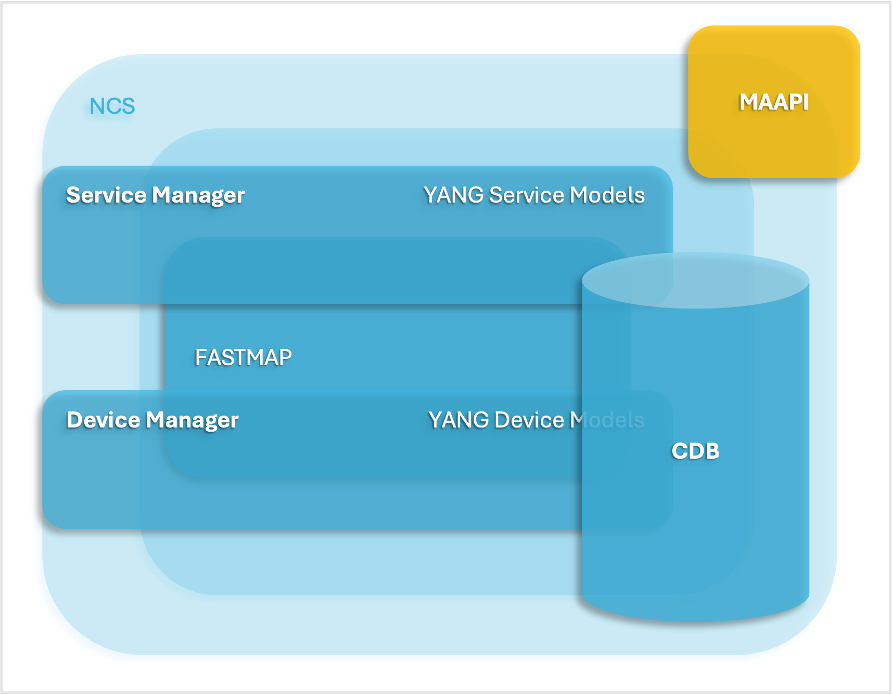
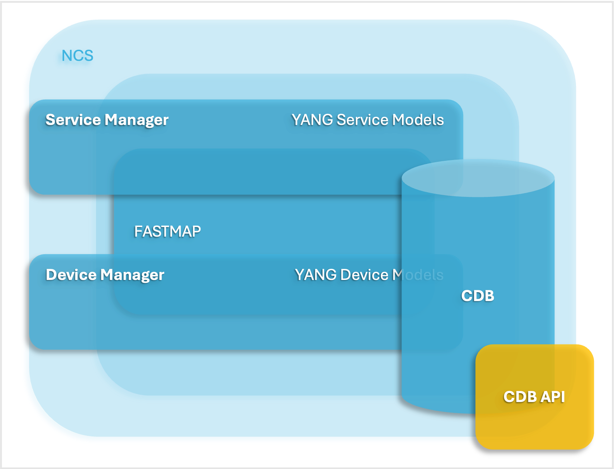
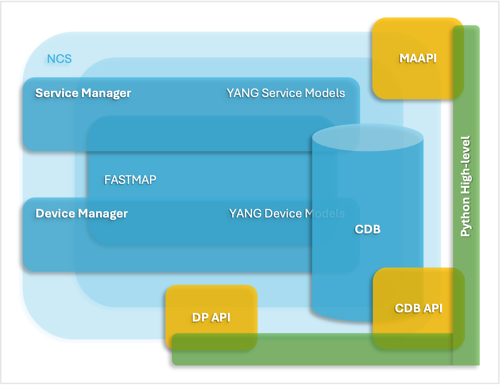

# Python API Overview

The NSO Python library contains a variety of APIs for different purposes. In this section, we introduce these and explain their usage. The NSO Python module deliverables are found in two variants, the low-level APIs and the high-level APIs.

The low-level APIs are a direct mapping of the NSO C APIs, CDB, and MAAPI. These will follow the evolution of the C APIs. See `man confd_lib_lib` for further information.

The high-level APIs are an abstraction layer on top of the low-level APIs to make them easier to use and to improve code readability and development rate for common use cases. E.g. services and action callbacks and common scripting towards NSO.

## Python API Overview <a href="#d5e4354" id="d5e4354"></a>

<table data-header-hidden data-full-width="false"><thead><tr><th width="350"></th><th></th></tr></thead><tbody><tr><td><strong>MAAPI (Management Agent API)</strong><br>Northbound interface that is transactional and user session-based. Using this interface, both configuration and operational data can be read. Configuration and operational data can be written and committed as one transaction. The API is complete in the way that it is possible to write a new northbound agent using only this interface. It is also possible to attach to ongoing transactions to read uncommitted changes and/or modify data in these transactions.</td><td></td></tr><tr><td><strong>Python low-level CDB API</strong><br>The Southbound interface provides access to the CDB configuration database. Using this interface, configuration data can be read. In addition, operational data that is stored in CDB can be read and written. This interface has a subscription mechanism to subscribe to changes. A subscription is specified on a path that points to an element in a YANG model or an instance in the instance tree. Any change under this point will trigger the subscription. CDB also has functions to iterate through the configuration changes when a subscription has been triggered.</td><td></td></tr><tr><td><strong>Python low-level DP API</strong><br>Southbound interface that enables callbacks, hooks, and transforms. This API makes it possible to provide the service callbacks that handle service-to-device mapping logic. Other usual cases are external data providers for operational data or action callback implementations. There are also transaction and validation callbacks, etc. Hooks are callbacks that are fired when certain data is written and the hook is expected to do additional modifications of data. Transforms are callbacks that are used when complete mediation between two different models is necessary.</td><td></td></tr><tr><td><strong>Python high-level API</strong>: API that resides on top of the MAAPI, CDB, and DP APIs. It provides schema model navigation and instance data handling (read/write). Uses a MAAPI context as data access and incorporates its functionality. It is used in service implementations, action handlers, and Python scripting.</td><td></td></tr></tbody></table>

## Python scripting <a href="#d5e4389" id="d5e4389"></a>

Scripting in Python is a very easy and powerful way of accessing NSO. This document has several examples of scripts showing various ways of accessing data and requesting actions in NSO.

The examples are directly executable with the Python interpreter after sourcing the `ncsrc` file in the NSO installation directory. This sets up the `PYTHONPATH` environment variable, which enables access to the NSO Python modules.

Edit a file and execute it directly on the command line like this:

```bash
$ python3 script.py
```

## High-level MAAPI API <a href="#d5e4398" id="d5e4398"></a>

The Python high-level MAAPI API provides an easy-to-use interface for accessing NSO. Its main targets are to encapsulate the sockets, transaction handles, data type conversions, and the possibility of using the Python `with` statement for proper resource cleanup.

The simplest way to access NSO is to use the `single_transaction` helper. It creates a MAAPI context and a transaction in one step.

This example shows its usage, connecting as user `admin` and `python` in the AAA context:


```python
import ncs

with ncs.maapi.single_write_trans('admin', 'python') as t:
    t.set_elem2('Kilroy was here', '/ncs:devices/device{ce0}/description')
    t.apply()

with ncs.maapi.single_read_trans('admin', 'python') as t:
    desc = t.get_elem('/ncs:devices/device{ce0}/description')
    print("Description for device ce0 = %s" % desc)
```



The example code here shows how to start a transaction but does not properly handle the case of concurrency conflicts when writing data. See [Handling Conflicts](../nso-concurrency-model.md#ncs.development.concurrency.handling) for details.



When only reading data, always start a `read` transaction to read directly from the CDB datastore and data providers. `write` transactions cache repeated reads done by the same transaction.


A common use case is to create a MAAPI context and reuse it for several transactions. This reduces the latency and increases the transaction throughput, especially for backend applications. For scripting the lifetime is shorter and there is no need to keep the MAAPI contexts alive.

This example shows how to keep a MAAPI connection alive between transactions:


```python
import ncs

with ncs.maapi.Maapi() as m:
    with ncs.maapi.Session(m, 'admin', 'python'):

        # The first transaction
        with m.start_read_trans() as t:
            address = t.get_elem('/ncs:devices/device{ce0}/address')
            print("First read: Address = %s" % address)

        # The second transaction
        with m.start_read_trans() as t:
            address = t.get_elem('/ncs:devices/device{ce1}/address')
            print("Second read: Address = %s" % address)
```


## Maagic API

Maagic is a module provided as part of the NSO Python APIs. It reduces the complexity of programming towards NSO, is used on top of the MAAPI high-level API, and addresses areas that require more programming. First, it helps in navigating the model, using standard Python object dot notation, giving very clear and easily read code. The context handlers remove the need to close sockets, user sessions, and transactions and the problems when they are forgotten and kept open. Finally, it removes the need to know the data types of the leafs, helping you to focus on the data to be set.

When using Maagic, you still do the same procedure of starting a transaction.

```python
with ncs.maapi.Maapi() as m:
  with ncs.maapi.Session(m, 'admin', 'python'):
    with m.start_write_trans() as t:
      # Read/write/request ...
```

To use the Maagic functionality, you get access to a Maagic object either pointing to the root of the CDB:

```
root = ncs.maagic.get_root(t)
```

In this case, it is a `ncs.maagic.Node` object with a `ncs.maapi.Transaction` backend.

From here, you can navigate in the model. In the table, you can see examples of how to navigate.

The table below lists Maagic object navigation.

| Action                                       | Returns             |
| -------------------------------------------- | ------------------- |
| `root.devices`                               | `Container`         |
| `root.devices.device`                        | `List`              |
| `root.devices.device['ce0']`                 | `ListElement`       |
| `root.devices.device['ce0'].device_type.cli` | `PresenceContainer` |
| `root.devices.device['ce0'].address`         | `str`               |
| `root.devices.device['ce0'].port`            | `int`               |

You can also get a Maagic object from a keypath:

```
node = ncs.maagic.get_node(t, '/ncs:devices/device{ce0}')
```

### Namespaces <a href="#d5e4469" id="d5e4469"></a>

Maagic handles namespaces by a prefix to the names of the elements. This is optional but recommended to avoid future side effects.

The syntax is to prefix the names with the namespace name followed by two underscores, e.g., `ns_name__ name`.

Examples of how to use namespaces:

```bash
# The examples are equal unless there is a namespace collision.
# For the ncs namespace it would look like this:

root.ncs__devices.ncs__device['ce0'].ncs__address
# equals
root.devices.device['ce0'].address
```

In cases where there is a name collision, the namespace prefix is required to access an entity from a module, except for the module that was first loaded. A namespace is always required for root entities when there is a collision. The module load order is found in the NCS log file: `logs/ncs.log`.

```bash
# This example have three namespaces referring to a leaf, value, with the same
# name and this load order: /ex/a:value=11, /ex/b:value=22 and /ex/c:value=33

root.ex.value # returns 11
root.ex.a__value # returns 11
root.ex.b__value # returns 22
root.ex.c__value # returns 33
```

### Reading Data <a href="#d5e4480" id="d5e4480"></a>

Reading data using Maagic is straightforward. You will just specify the leaf you are interested in and the data is retrieved. The data is returned in the nearest available Python data type.

For non-existing leafs, `None` is returned.

```
dev_name = root.devices.device['ce0'].name # 'ce0'
dev_address = root.devices.device['ce0'].address # '127.0.0.1'
dev_port = root.devices.device['ce0'].port # 10022
```

### Writing Data <a href="#d5e4486" id="d5e4486"></a>

Writing data using Maagic is straightforward. You will just specify the leaf you are interested in and assign a value. Any data type can sent as input, as the `str` function is called, converting it to a string. The format depends on the data type. If the type validation fails, an `Error` exception is thrown.

```
root.devices.device['ce0'].name  = 'ce0'
root.devices.device['ce0'].address  = '127.0.0.1'
root.devices.device['ce0'].port = 10022
root.devices.device['ce0'].port = '10022' # Also valid

# This will raise an Error exception
root.devices.device['ce0'].port = 'netconf'
```

### Deleting Data <a href="#d5e4492" id="d5e4492"></a>

Data is deleted the Python way of using the `del` function:

```
del root.devices.device['ce0'] # List element
del root.devices.device['ce0'].name # Leaf
del root.devices.device['ce0'].device_type.cli # Presence container
```

Some entities have a delete method, this is explained under the corresponding type.

### Object Deletion

The delete mechanism in Maagic is implemented using the `__delattr__` method on the `Node` class. This means that executing the del function on a local or global variable will only delete the object from the Python local or global namespaces. E.g., `del obj`.

### Containers <a href="#d5e4504" id="d5e4504"></a>

Containers are addressed using standard Python dot notation: `root.container1.container2`.

### Presence Containers <a href="#d5e4508" id="d5e4508"></a>

A presence container is created using the `create` method:

```
pc = root.container.presence_container.create()
```

Existence is checked with the `exists` or `bool` functions:

```
root.container.presence_container.exists() # Returns True or False
bool(root.container.presence_container) # Returns True or False
```

A presence container is deleted with the `del` or `delete` functions:

```
del root.container.presence_container
root.container.presence_container.delete()
```

### Choices <a href="#d5e4516" id="d5e4516"></a>

The case of a choice is checked by addressing the name of the choice in the model:

```
ne_type = root.devices.device['ce0'].device_type.ne_type
if ne_type == 'cli':
  # Handle CLI
elif ne_type == 'netconf':
  # Handle NETCONF
elif ne_type == 'generic':
  # Handle generic
else:
  # Don't handle
```

Changing a choice is done by setting a value in any of the other cases:

```
root.devices.device['ce0'].device_type.netconf.create()
str(root.devices.device['ce0'].device_type.ne_type) # Returns 'netconf'
```

### Lists and List Elements <a href="#d5e4522" id="d5e4522"></a>

List elements are created using the create method on the `List` class:

```bash
# Single value key
ce5 = root.devices.device.create('ce5')

# Multiple values key
o = root.container.list.create('foo', 'bar')
```

The objects `ce5` and _`o`_ above are of type `ListElement` which is actually an ordinary `container` object with a different name.

Existence is checked with the `exists` or `bool` functions `List` class:

```
'ce0' in root.devices.device # Returns True or False
```

A list element is deleted with the Python `del` function:

```bash
# Single value key
del root.devices.device['ce5']

# Multiple values key
del root.container.list['foo', 'bar']
```

To delete the whole list, use the Python `del` function or `delete()` on the list.

```bash
# use Python's del function
del root.devices.device

# use List's delete() method
root.container.list.delete()
```

### Unions <a href="#d5e4539" id="d5e4539"></a>

Unions are not handled in any specific way - you just read or write to the leaf and the data is validated according to the model.

### Enumeration <a href="#d5e4542" id="d5e4542"></a>

Enumerations are returned as an `Enum` object, giving access to both the integer and string values.

```
str(root.devices.device['ce0'].state.admin_state) # May return 'unlocked'
root.devices.device['ce0'].state.admin_state.string # May return 'unlocked'
root.devices.device['ce0'].state.admin_state.value # May return 1
```

Writing values to enumerations accepts both the string and integer values.

```
root.devices.device['ce0'].state.admin_state = 'locked'
root.devices.device['ce0'].state.admin_state = 0

# This will raise an Error exception
root.devices.device['ce0'].state.admin_state = 3 # Not a valid enum
```

### Leafref <a href="#d5e4549" id="d5e4549"></a>

Leafrefs are read as regular leafs and the returned data type corresponds to the referred leaf.

```bash
# /model/device is a leafref to /devices/device/name

dev = root.model.device # May return 'ce0'
```

Leafrefs are set as the leaf they refer to. The data type is validated as it is set. The reference is validated when the transaction is committed.

```bash
# /model/device is a leafref to /devices/device/name

root.model.device = 'ce0'
```

### Identityref <a href="#d5e4555" id="d5e4555"></a>

Identityrefs are read and written as string values. Writing an identityref without a prefix is possible, but doing so is error-prone and may stop working if another model is added which also has an identity with the same name. The recommendation is to always use a prefix when writing identityrefs. Reading an identityref will always return a prefixed string value.

```bash
# Read
root.devices.device['ce0'].device_type.cli.ned_id # May return 'ios-id:cisco-ios'

# Write when identity cisco-ios is unique throughout the system (not recommended)
root.devices.device['ce0'].device_type.cli.ned_id = 'cisco-ios'

# Write with unique identity
root.devices.device['ce0'].device_type.cli.ned_id = 'ios-id:cisco-ios'
```

### Instance Identifier <a href="#d5e4559" id="d5e4559"></a>

Instance identifiers are read as xpath formatted string values.

```bash
# /model/iref is an instance-identifier

root.model.iref # May return "/ncs:devices/ncs:device[ncs:name='ce0']"
```

Instance identifiers are set as xpath formatted strings. The string is validated as it is set. The reference is validated when the transaction is committed.

```bash
# /model/iref is an instance-identifier

root.devices.device['ce0'].device_type.cli.ned_id = "/ncs:devices/ncs:device[ncs:name='ce0']"
```

### Leaf-list <a href="#d5e4565" id="d5e4565"></a>

A leaf-list is represented by a `LeafList` object. This object behaves very much like a Python list. You may iterate it, check for the existence of a specific element using `in`, or remove specific items using the `del` operator. See examples below.


From NSO version 4.5 and onwards, a Yang leaf-list is represented differently than before. Reading a leaf-list using Maagic used to result in an ordinary Python list (or None if the leaf-list was non-existent). Now, reading a leaf-list will give back a `LeafList` object whether it exists or not. The `LeafList` object may be iterated like a Python list and you may check for existence using the `exists()` method or the `bool()` operator. A Maagic leaf-list node may be assigned using a Python list, just like before, and you may convert it to a Python list using the `as_list()` method or by doing `list(my_leaf_list_node)`.


```bash
# /model/ll is a leaf-list with the type string

# read a LeafList object
ll = root.model.ll

# iteration
for item in root.model.ll:
    do_stuff(item)

# check if the leaf-list exists (i.e. is non-empty)
if root.model.ll:
    do_stuff()
if root.model.ll.exists():
    do_stuff()

# check the leaf-list contains a specific item
if 'foo' in root.model.ll:
    do_stuff()

# length
len(root.model.ll)

# create a new item in the leaf-list
root.model.ll.create('bar')

# set the whole leaf-list in one operation
root.model.ll = ['foo', 'bar', 'baz']

# remove a specific item from the list
del root.model.ll['bar']
root.model.ll.remove('baz')

# delete the whole leaf-list
del root.model.ll
root.model.ll.delete()

# get the leaf-list as a Python list
root.model.ll.as_list()
```

### Binary <a href="#d5e4581" id="d5e4581"></a>

Binary values are read and written as byte strings.

```bash
# Read
root.model.bin # May return '\x00foo\x01bar'

# Write
root.model.bin = b'\x00foo\x01bar'
```

### Bits <a href="#d5e4585" id="d5e4585"></a>

Reading a `bits` leaf will give a Bits object back (or None if the `bits` leaf is non-existent). To get some useful information out of the Bits object, you can either use the `bytearray()` method to get a Python byte array object in return or the Python `str()` operator to get a space-separated string containing the bit names.

```bash
# read a bits leaf - a Bits object may be returned (None if non-existent)
root.model.bits

# get a bytearray
root.model.bits.bytearray()

# get a space separated string with bit names
str(root.model.bits)
```

There are four ways of setting a `bits` leaf: One is to set it using a string with space-separated bit names, the other one is to set it using a byte array, the third by using a Python binary string, and as a last option is it may be set using a Bits object. Note that updating a Bits object does not change anything in the database - for that to happen, you need to assign it to the Maagic node.

```bash
# set a bits leaf using a string of space separated bit names
root.model.bits = 'turboMode enableEncryption'

# set a bits leaf using a Python bytearray
root.model.bits = bytearray(b'\x11')

# set a bits leaf using a Python binary string
root.model.bits = b'\x11'

# read a bits leaf, update the Bits object and set it
b = x.model.bits
b.clr_bit(0)
x.model.bits = b
```

### Empty Leaf <a href="#d5e4591" id="d5e4591"></a>

An empty leaf is created using the `create` method. If the type empty leaf is part of a union, the leaf must be set to the `C_EMPTY` value instead.

```
pc = root.container.empty_leaf.create()
```

If the type empty leaf is part of a union, then you read the leaf to see if `empty` is the current value. Otherwise, existence is checked with the `exists` or `bool` functions:

```
root.container.empty_leaf.exists() # Returns True or False
bool(root.container.empty_leaf) # Returns True or False
```

An empty leaf is deleted with the `del` or `delete` functions:

```
del root.container.empty_leaf
root.container.empty_leaf.delete()
```

## Maagic Examples <a href="#d5e4599" id="d5e4599"></a>

### Action Requests <a href="#d5e4601" id="d5e4601"></a>

Requesting an action may not require an ongoing transaction and this example shows how to use Maapi as a transactionless back-end for Maagic.


```python
import ncs

with ncs.maapi.Maapi() as m:
    with ncs.maapi.Session(m, 'admin', 'python'):
        root = ncs.maagic.get_root(m)

        output = root.devices.check_sync()

        for result in output.sync_result:
            print('sync-result {')
            print('    device %s' % result.device)
            print('    result %s' % result.result)
            print('}')
```


This example shows how to request an action that requires an ongoing transaction. It is also valid to request an action that does not require an ongoing transaction.


```python
import ncs

with ncs.maapi.Maapi() as m:
    with ncs.maapi.Session(m, 'admin', 'python'):
        with m.start_read_trans() as t:
            root = ncs.maagic.get_root(t)

            output = root.devices.check_sync()

            for result in output.sync_result:
                print('sync-result {')
                print('    device %s' % result.device)
                print('    result %s' % result.result)
                print('}')
```


Providing parameters to an action with Maagic is very easy: You request an input object, with `get_input` from the Maagic action object, and set the desired (or required) parameters as defined in the model specification.


```python
import ncs

with ncs.maapi.Maapi() as m:
    with ncs.maapi.Session(m, 'admin', 'python'):
        root = ncs.maagic.get_root(m)

        input = root.action.double.get_input()
        input.number = 21
        output = root.action.double(input)

        print(output.result)
```


If you have a leaf-list, you need to prepare the input parameters


```python
import ncs

with ncs.maapi.Maapi() as m:
    with ncs.maapi.Session(m, 'admin', 'python'):
        root = ncs.maagic.get_root(m)

        input = root.leaf_list_action.llist.get_input()
        input.args = ['testing action']
        output = root.leaf_list_action.llist(input)

        print(output.result)
```


A common use case is to script the creation of devices. With the Python APIs, this is easily done without the need to generate set commands and execute them in the CLI.


```python
import argparse
import ncs


def parseArgs():
    parser = argparse.ArgumentParser()
    parser.add_argument('--name', help="device name", required=True)
    parser.add_argument('--address', help="device address", required=True)
    parser.add_argument('--port', help="device address", type=int, default=22)
    parser.add_argument('--desc', help="device description",
                        default="Device created by maagic_create_device.py")
    parser.add_argument('--auth', help="device authgroup", default="default")
    return parser.parse_args()


def main(args):
    with ncs.maapi.Maapi() as m:
        with ncs.maapi.Session(m, 'admin', 'python'):
            with m.start_write_trans() as t:
                root = ncs.maagic.get_root(t)

                print("Setting device '%s' configuration..." % args.name)

                # Get a reference to the device list
                device_list = root.devices.device

                device = device_list.create(args.name)
                device.address = args.address
                device.port = args.port
                device.description = args.desc
                device.authgroup = args.auth
                dev_type = device.device_type.cli
                dev_type.ned_id = 'cisco-ios-cli-3.0'
                device.state.admin_state = 'unlocked'

                print('Committing the device configuration...')
                t.apply()
                print("Committed")

                # This transaction is no longer valid

            #
            # fetch-host-keys and sync-from does not require a transaction
            # continue using the Maapi object
            #
            root = ncs.maagic.get_root(m)
            device = root.devices.device[args.name]

            print("Fetching SSH keys...")
            output = device.ssh.fetch_host_keys()
            print("Result: %s" % output.result)

            print("Syncing configuration...")
            output = device.sync_from()
            print("Result: %s" % output.result)
            if not output.result:
                print("Error: %s" % output.info)


if __name__ == '__main__':
    main(parseArgs())
```


## PlanComponent

This class is a helper to support service progress reporting using `plan-data` as part of a Reactive FASTMAP nano service. More info about `plan-data` is found in [Nano Services for Staged Provisioning](../nano-services.md).

The interface of the `PlanComponent` is identical to the corresponding Java class and supports the setup of plans and setting the transition states.

```python
class PlanComponent(object):
    """Service plan component.

    The usage of this class is in conjunction with a nano service that
    uses a reactive FASTMAP pattern.
    With a plan the service states can be tracked and controlled.

    A service plan can consist of many PlanComponent's.
    This is operational data that is stored together with the service
    configuration.
    """

    def __init__(self, service, name, component_type):
        """Initialize a PlanComponent."""

    def append_state(self, state_name):
        """Append a new state to this plan component.

        The state status will be initialized to 'ncs:not-reached'.
        """

    def set_reached(self, state_name):
        """Set state status to 'ncs:reached'."""

    def set_failed(self, state_name):
        """Set state status to 'ncs:failed'."""

    def set_status(self, state_name, status):
        """Set state status."""
```

See `pydoc3 ncs.application.PlanComponent` for further information about the Python class.

The pattern is to add an overall plan (self) for the service and separate plans for each component that builds the service.

```
self_plan = PlanComponent(service, 'self', 'ncs:self')
self_plan.append_state('ncs:init')
self_plan.append_state('ncs:ready')
self_plan.set_reached('ncs:init')

route_plan = PlanComponent(service, 'router', 'myserv:router')
route_plan.append_state('ncs:init')
route_plan.append_state('myserv:syslog-initialized')
route_plan.append_state('myserv:ntp-initialized')
route_plan.append_state('myserv:dns-initialized')
route_plan.append_state('ncs:ready')
route_plan.set_reached('ncs:init')
```

When appending a new state to a plan the initial state is set to `ncs:not-reached`. At the completion of a plan the state is set to `ncs:ready`. In this case when the service is completely setup:

```
self_plan.set_reached('ncs:ready')
```

## Python Packages <a href="#d5e4639" id="d5e4639"></a>

### Action Handler <a href="#d5e4641" id="d5e4641"></a>

The Python high-level API provides an easy way to implement an action handler for your modeled actions. The easiest way to create a handler is to use the `ncs-make-package` command. It creates some ready-to-use skeleton code.

```bash
$ cd packages
$ ncs-make-package --service-skeleton python pyaction --component-class
 action.Action \
 --action-example
```

The generated package skeleton:

```bash
$ tree pyaction
pyaction/
+-- README
+-- doc/
+-- load-dir/
+-- package-meta-data.xml
+-- python/
|   +-- pyaction/
|       +-- __init__.py
|       +-- action.py
+-- src/
|   +-- Makefile
|   +-- yang/
|       +-- action.yang
+-- templates/
```

This example action handler takes a number as input, doubles it, and returns the result.

When debugging Python packages refer to [Debugging of Python Packages](../nso-virtual-machines/nso-python-vm.md#debugging-of-python-packages).


```bash
# -*- mode: python; python-indent: 4 -*-

from ncs.application import Application
from ncs.dp import Action

# ---------------
# ACTIONS EXAMPLE
# ---------------
class DoubleAction(Action):
    @Action.action
    def cb_action(self, uinfo, name, kp, input, output):
        self.log.info('action name: ', name)
        self.log.info('action input.number: ', input.number)

        output.result = input.number * 2

class LeafListAction(Action):
    @Action.action
    def cb_action(self, uinfo, name, kp, input, output):
        self.log.info('action name: ', name)
        self.log.info('action input.args: ', input.args)
        output.result = [ w.upper() for w in input.args]

# ---------------------------------------------
# COMPONENT THREAD THAT WILL BE STARTED BY NCS.
# ---------------------------------------------
class Action(Application):
    def setup(self):
        self.log.info('Worker RUNNING')
        self.register_action('action-action', DoubleAction)
        self.register_action('llist-action', LeafListAction)

    def teardown(self):
        self.log.info('Worker FINISHED')
```


Test the action by doing a request from the NSO CLI:

```
admin@ncs> request action double number 21
result 42
[ok][2016-04-22 10:30:39]
```

The input and output parameters are the most commonly used parameters of the action callback method. They provide the access objects to the data provided to the action request and the returning result.

They are `maagic.Node` objects, which provide easy access to the modeled parameters.

The table below lists the action handler callback parameters:

<table><thead><tr><th width="141">Parameter</th><th width="201">Type</th><th>Description</th></tr></thead><tbody><tr><td><code>self</code></td><td><code>ncs.dp.Action</code></td><td>The action object.</td></tr><tr><td><code>uinfo</code></td><td><code>ncs.UserInfo</code></td><td>User information of the requester.</td></tr><tr><td><code>name</code></td><td><code>string</code></td><td>The tailf:action name.</td></tr><tr><td><code>kp</code></td><td><code>ncs.HKeypathRef</code></td><td>The keypath of the action.</td></tr><tr><td><code>input</code></td><td><code>ncs.maagic.Node</code></td><td>An object containing the parameters of the input section of the action yang model.</td></tr><tr><td><code>output</code></td><td><code>ncs.maagic.Node</code></td><td>The object where to put the output parameters as defined in the output section of the action yang model.</td></tr></tbody></table>

### Service Handler

The Python high-level API provides an easy way to implement a service handler for your modeled services. The easiest way to create a handler is to use the `ncs-make-package` command. It creates some skeleton code.

```bash
$ cd packages
$ ncs-make-package --service-skeleton python pyservice \
 --component-class service.Service
```

The generated package skeleton:

```bash
$ tree pyservice
pyservice/
+-- README
+-- doc/
+-- load-dir/
+-- package-meta-data.xml
+-- python/
|   +-- pyservice/
|       +-- __init__.py
|       +-- service.py
+-- src/
|   +-- Makefile
|   +-- yang/
|       +-- service.yang
+-- templates/
```

This example has some code added for the service logic, including a service template.

When debugging Python packages, refer to [Debugging of Python Packages](../nso-virtual-machines/nso-python-vm.md#debugging-of-python-packages).

Add some service logic to the `cb_create`:


```bash
# -*- mode: python; python-indent: 4 -*-

from ncs.application import Application
from ncs.application import Service
import ncs.template

# ------------------------
# SERVICE CALLBACK EXAMPLE
# ------------------------
class ServiceCallbacks(Service):
    @Service.create
    def cb_create(self, tctx, root, service, proplist):
        self.log.info('Service create(service=', service._path, ')')

        # Add this service logic >>>>>>>
        vars = ncs.template.Variables()
        vars.add('MAGIC', '42')
        vars.add('CE', service.device)
        vars.add('INTERFACE', service.unit)
        template = ncs.template.Template(service)
        template.apply('pyservice-template', vars)

        self.log.info('Template is applied')

        dev = root.devices.device[service.device]
        dev.description = "This device was modified by %s" % service._path
        # <<<<<<<<< service logic

    @Service.pre_modification
    def cb_pre_modification(self, tctx, op, kp, root, proplist):
        self.log.info('Service premod(service=', kp, ')')

    @Service.post_modification
    def cb_post_modification(self, tctx, op, kp, root, proplist):
        self.log.info('Service premod(service=', kp, ')')


# ---------------------------------------------
# COMPONENT THREAD THAT WILL BE STARTED BY NCS.
# ---------------------------------------------
class Service(Application):
    def setup(self):
        self.log.info('Worker RUNNING')
        self.register_service('service-servicepoint', ServiceCallbacks)

    def teardown(self):
        self.log.info('Worker FINISHED')
```


Add a template to `packages/pyservice/templates/service.template.xml`:

```xml
<config-template xmlns="http://tail-f.com/ns/config/1.0">
  <devices xmlns="http://tail-f.com/ns/ncs">
    <device tags="nocreate">
      <name>{$CE}</name>
      <config tags="merge">
      <interface xmlns="urn:ios">
        <FastEthernet>
          <name>0/{$INTERFACE}</name>
          <description>The maagic: {$MAGIC}</description>
        </FastEthernet>
      </interface>
      </config>
    </device>
  </devices>
</config-template>
```

The table below lists the service handler callback parameters:

<table><thead><tr><th width="160">Parameter</th><th width="272">Type</th><th>Description</th></tr></thead><tbody><tr><td><code>self</code></td><td><code>ncs.application.Service</code></td><td>The service object.</td></tr><tr><td><code>tctx</code></td><td><code>ncs.TransCtxRef</code></td><td>Transaction context.</td></tr><tr><td><code>root</code></td><td><code>ncs.maagic.Node</code></td><td>An object pointing to the root with the current transaction context, using shared operations (<code>create</code>, <code>set_elem</code>, ...) for configuration modifications.</td></tr><tr><td><code>service</code></td><td><code>ncs.maagic.Node</code></td><td>An object pointing to the service with the current transaction context, using shared operations (<code>create</code>, <code>set_elem</code>, ...) for configuration modifications.</td></tr><tr><td><code>proplist</code></td><td>list(tuple(str, str))</td><td>The opaque object for the service configuration used to store hidden state information between invocations. It is updated by returning a modified list.</td></tr></tbody></table>

### Validation Point Handler

The Python high-level API provides an easy way to implement a validation point handler. The easiest way to create a handler is to use the `ncs-make-package` command. It creates ready-to-use skeleton code.

```bash
$ cd packages
$ ncs-make-package --service-skeleton python pyvalidation --component-class
 validation.ValidationApplication \
 --disable-service-example --validation-example
```

The generated package skeleton:

```bash
$ tree pyaction
pyaction/
+-- README
+-- doc/
+-- load-dir/
+-- package-meta-data.xml
+-- python/
|   +-- pyaction/
|       +-- __init__.py
|       +-- validation.py
+-- src/
|   +-- Makefile
|   +-- yang/
|       +-- validation.yang
+-- templates/
```

This example validation point handler accepts all values except `invalid`.

When debugging Python packages refer to [Debugging of Python Packages](../nso-virtual-machines/nso-python-vm.md#debugging-of-python-packages).


```bash
# -*- mode: python; python-indent: 4 -*-
import ncs
from ncs.dp import ValidationError, ValidationPoint


# ---------------
# VALIDATION EXAMPLE
# ---------------
class Validation(ValidationPoint):
    @ValidationPoint.validate
    def cb_validate(self, tctx, keypath, value, validationpoint):
        self.log.info('validate: ', str(keypath), '=', str(value))
        if value == 'invalid':
            raise ValidationError('invalid value')
        return ncs.CONFD_OK


# ---------------------------------------------
# COMPONENT THREAD THAT WILL BE STARTED BY NCS.
# ---------------------------------------------
class ValidationApplication(ncs.application.Application):
    def setup(self):
        # The application class sets up logging for us. It is accessible
        # through 'self.log' and is a ncs.log.Log instance.
        self.log.info('ValidationApplication RUNNING')

        # When using actions, this is how we register them:
        #
        self.register_validation('pyvalidation-valpoint', Validation)

        # If we registered any callback(s) above, the Application class
        # took care of creating a daemon (related to the service/action point).

        # When this setup method is finished, all registrations are
        # considered done and the application is 'started'.

    def teardown(self):
        # When the application is finished (which would happen if NCS went
        # down, packages were reloaded or some error occurred) this teardown
        # method will be called.

        self.log.info('ValidationApplication FINISHED')
```


Test the validation by setting the value to invalid and validating the transaction from the NSO CLI:

```cli
admin@ncs% set validation validate-value invalid
admin@ncs% validate
Failed: 'validation validate-value': invalid value
[ok][2016-04-22 10:30:39]
```

The table below lists the validation point handler callback parameters:

<table><thead><tr><th width="203">Parameter</th><th width="256">Type</th><th>Description</th></tr></thead><tbody><tr><td><code>self</code></td><td><code>ncs.dp.ValidationPoint</code></td><td>The validation point object.</td></tr><tr><td><code>tctx</code></td><td><code>ncs.TransCtxRef</code></td><td>Transaction context.</td></tr><tr><td><code>kp</code></td><td><code>ncs.HKeypathRef</code></td><td>The keypath of the node being validated.</td></tr><tr><td><code>value</code></td><td><code>ncs.Value</code></td><td>Current value of the node being validated.</td></tr><tr><td><code>validationpoint</code></td><td><code>string</code></td><td>The validation point that triggered the validation.</td></tr></tbody></table>

## Low-level APIs

The Python low-level APIs are a direct mapping of the C-APIs. A C call has a corresponding Python function entry. From a programmer's point of view, it wraps the C data structures into Python objects and handles the related memory management when requested by the Python garbage collector. Any errors are reported as `error.Error`.

The low-level APIs will not be described in detail in this document, but you will find a few examples showing their usage in the coming sections.

See `pydoc3 _ncs` and `man confd_lib_lib` for further information.

### Low-level MAAPI API <a href="#d5e4852" id="d5e4852"></a>

This API is a direct mapping of the NSO MAAPI C API. See `pydoc3 _ncs.maapi` and `man confd_lib_maapi` for further information.

Note that additional care must be taken when using this API in service code, as it also exposes functions that do not perform reference counting (see [Reference Counting Overlapping Configuration](../../advanced-development/developing-services/services-deep-dive.md#ch\_svcref.refcount)).

In the service code, you should use the `shared_*` set of functions, such as:

```
shared_apply_template
shared_copy_tree
shared_create
shared_insert
shared_set_elem
shared_set_elem2
shared_set_values
```

And, avoid the non-shared variants:

```
load_config()
load_config_cmds()
load_config_stream()
apply_template()
copy_tree()
create()
insert()
set_elem()
set_elem2()
set_object
set_values()
```

The following example is a script to read and de-crypt a password using the Python low-level MAAPI API.

<pre data-title="Example: Setting of Configuration Data using MAAPI"><code>import socket
import _ncs
from _ncs import maapi

sock_maapi = socket.socket()

maapi.connect(sock_maapi,
              ip='127.0.0.1',
              port=_ncs.NCS_PORT)

maapi.load_schemas(sock_maapi)

maapi.start_user_session(
                  sock_maapi,
                  'admin',
                  'python',
                  [],
                  '127.0.0.1',
                  _ncs.PROTO_TCP)

maapi.install_crypto_keys(sock_maapi)


th = maapi.start_trans(sock_maapi, _ncs.RUNNING, _ncs.READ)

<strong>path = "/devices/authgroups/group{default}/umap{admin}/remote-password"
</strong>encrypted_password = maapi.get_elem(sock_maapi, th, path)

decrypted_password = _ncs.decrypt(str(encrypted_password))

maapi.finish_trans(sock_maapi, th)
maapi.end_user_session(sock_maapi)
sock_maapi.close()

print("Default authgroup admin password = %s" % decrypted_password)
</code></pre>

This example is a script to do a `check-sync` action request using the low-level MAAPI API.


```python
import socket
import _ncs
from _ncs import maapi

sock_maapi = socket.socket()

maapi.connect(sock_maapi,
              ip='127.0.0.1',
              port=_ncs.NCS_PORT)

maapi.load_schemas(sock_maapi)

_ncs.maapi.start_user_session(
                  sock_maapi,
                  'admin',
                  'python',
                  [],
                  '127.0.0.1',
                  _ncs.PROTO_TCP)

ns_hash = _ncs.str2hash("http://tail-f.com/ns/ncs")

results = maapi.request_action(sock_maapi, [], ns_hash, "/devices/check-sync")
for result in results:
    v = result.v
    t = v.confd_type()
    if t == _ncs.C_XMLBEGIN:
        print("sync-result {")
    elif t == _ncs.C_XMLEND:
        print("}")
    elif t == _ncs.C_BUF:
        tag = result.tag
        print("    %s %s" % (_ncs.hash2str(tag), str(v)))
    elif t == _ncs.C_ENUM_HASH:
        tag = result.tag
        text = v.val2str((ns_hash, '/devices/check-sync/sync-result/result'))
        print("    %s %s" % (_ncs.hash2str(tag), text))

maapi.end_user_session(sock_maapi)
sock_maapi.close()
```


### Low-level CDB API

This API is a direct mapping of the NSO CDB C API. See `pydoc3 _ncs.cdb` and `man confd_lib_cdb` for further information.

Setting of operational data has historically been done using one of the CDB APIs (Python, Java, C). This example shows how to set a value and trigger subscribers for operational data using the Python low-level API. API.


```python
import socket
import _ncs
from _ncs import cdb

sock_cdb = socket.socket()

cdb.connect(
    sock_cdb,
    type=cdb.DATA_SOCKET,
    ip='127.0.0.1',
    port=_ncs.NCS_PORT)

cdb.start_session2(sock_cdb, cdb.OPERATIONAL, cdb.LOCK_WAIT | cdb.LOCK_REQUEST)

path = "/operdata/value"
cdb.set_elem(sock_cdb, _ncs.Value(42, _ncs.C_UINT32), path)

new_value = cdb.get(sock_cdb, path)

cdb.end_session(sock_cdb)
sock_cdb.close()

print("/operdata/value is now %s" % new_value)
```


## Advanced Topics

### Schema Loading - Internals <a href="#ncs.development.python_api_overview.advanced.schema_loading" id="ncs.development.python_api_overview.advanced.schema_loading"></a>

When schemas are loaded, either upon direct request or automatically by methods and classes in the `maapi` module, they are statically cached inside the Python VM. This fact presents a problem if one wants to connect to several different NSO nodes with diverging schemas from the same Python VM.

Take for example the following program that connects to two different NSO nodes (with diverging schemas) and shows their ned-id's.


```python
            import ncs


            def print_ned_ids(port):
                with ncs.maapi.single_read_trans('admin', 'system', db=ncs.OPERATIONAL, port=port) as t:
                dev_ned_id = ncs.maagic.get_node(t, '/devices/ned-ids/ned-id')
                for id in dev_ned_id.keys():
                    print(id)


            if __name__ == '__main__':
                print('=== lsa-1 ===')
                print_ned_ids(4569)
                print('=== lsa-2 ===')
                print_ned_ids(4570)
```


Running this program may produce output like this:

```bash
            $ python3 read_nedids.py
            === lsa-1 ===
            {ned:lsa-netconf}
            {ned:netconf}
            {ned:snmp}
            {cisco-nso-nc-5.5:cisco-nso-nc-5.5}
            === lsa-2 ===
            {ned:lsa-netconf}
            {ned:netconf}
            {ned:snmp}
            {"[<_ncs.Value type=C_IDENTITYREF(44) value='idref<211668964'...>]"}
            {"[<_ncs.Value type=C_IDENTITYREF(44) value='idref<151824215'>]"}
            {"[<_ncs.Value type=C_IDENTITYREF(44) value='idref<208856485'...>]"}
```

The output shows identities in string format for the active NEDs on the different nodes. Note that for `lsa-2`, the last three lines do not show the name of the identity but instead the representation of a `_ncs.Value`. The reason for this is that `lsa-2` has different schemas which do not include these identities. Schemas for this Python VM were loaded and cached during the first call to `ncs.maapi.single_read_trans()` so no schema loading occurred during the second call.

The way to make the program above work as expected is to force the reloading of schemas by passing an optional argument to `single_read_trans()` like so:

```python
with ncs.maapi.single_read_trans('admin', 'system', db=ncs.OPERATIONAL, port=port,
    load_schemas=ncs.maapi.LOAD_SCHEMAS_RELOAD) as t:
```

Running the program with this change may produce something like this:

```
          === lsa-1 ===
          {ned:lsa-netconf}
          {ned:netconf}
          {ned:snmp}
          {cisco-nso-nc-5.5:cisco-nso-nc-5.5}
          === lsa-2 ===
          {ned:lsa-netconf}
          {ned:netconf}
          {ned:snmp}
          {cisco-asa-cli-6.13:cisco-asa-cli-6.13}
          {cisco-ios-cli-6.72:cisco-ios-cli-6.72}
          {router-nc-1.0:router-nc-1.0}
```

Now, this was just an example of what may happen when wrong schemas are loaded. Implications may be more severe though, especially if maagic nodes are kept between reloads. In such cases, accessing an "invalid" maagic object may in the best case result in undefined behavior making the program not work, but might even crash the program. So care needs to be taken to not reload schemas in a Python VM if there are dependencies to other parts in the same VM that need previous schemas.

Functions and methods that accept the `load_schemas` argument:

* `ncs.maapi.Maapi() constructor`
* `ncs.maapi.single_read_trans()`
* `ncs.maapi.single_write_trans()`

### The way of using `multiprocessing.Process`
When using multiprocessing in NSO, the default start method is now `spawn` instead of `fork`.
With the `spawn` method, a new Python interpreter process is started, and all arguments passed to `multiprocessing.Process` must be picklable.

If you pass Python objects that reference low-level C structures (for example `_ncs.dp.DaemonCtxRef` or `_ncs.UserInfo`), Python will raise an error like:

```python
TypeError: cannot pickle '<object>' object
```


```python
import ncs
import _ncs
from ncs.dp import Action
from multiprocessing import Process
import multiprocessing

def child(uinfo, self):
    print(f"uinfo: {uinfo}, self: {self}")

class DoAction(Action):
    @Action.action
    def cb_action(self, uinfo, name, kp, input, output, trans):
          t1 = multiprocessing.Process(target=child, args=(uinfo, self))
          t1.start()

class Main(ncs.application.Application):
    def setup(self):
        self.log.info('Main RUNNING')
        self.register_action('sleep', DoAction)

    def teardown(self):
        self.log.info('Main FINISHED')
```


This happens because `self` and `uinfo` contain low-level C references that cannot be serialized (pickled) and sent to the child process.

To fix this, avoid passing entire objects such as `self` or `uinfo` to the process.
Instead, pass only simple or primitive data types (like strings, integers, or dictionaries) that can be pickled.


```python
import ncs
import _ncs
from ncs.dp import Action
from multiprocessing import Process
import multiprocessing

def child(usid, th, action_point):
    print(f"uinfo: {usid}, th: {th}, action_point: {action_point}")

class DoAction(Action):
    @Action.action
    def cb_action(self, uinfo, name, kp, input, output, trans):
          usid = uinfo.usid
          th = uinfo.actx_thandle
          action_point = self.actionpoint
          t1 = multiprocessing.Process(target=child, args=(usid,th,action_point,))
          t1.start()

class Main(ncs.application.Application):
    def setup(self):
        self.log.info('Main RUNNING')
        self.register_action('sleep', DoAction)

    def teardown(self):
        self.log.info('Main FINISHED')
```
