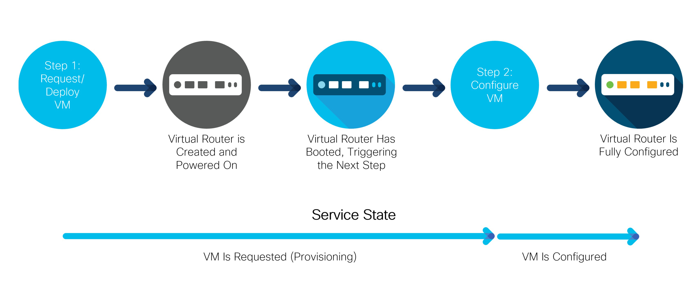
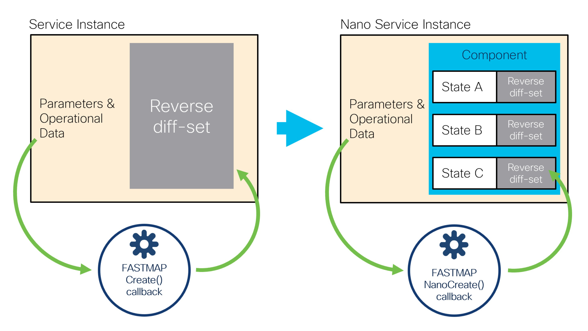
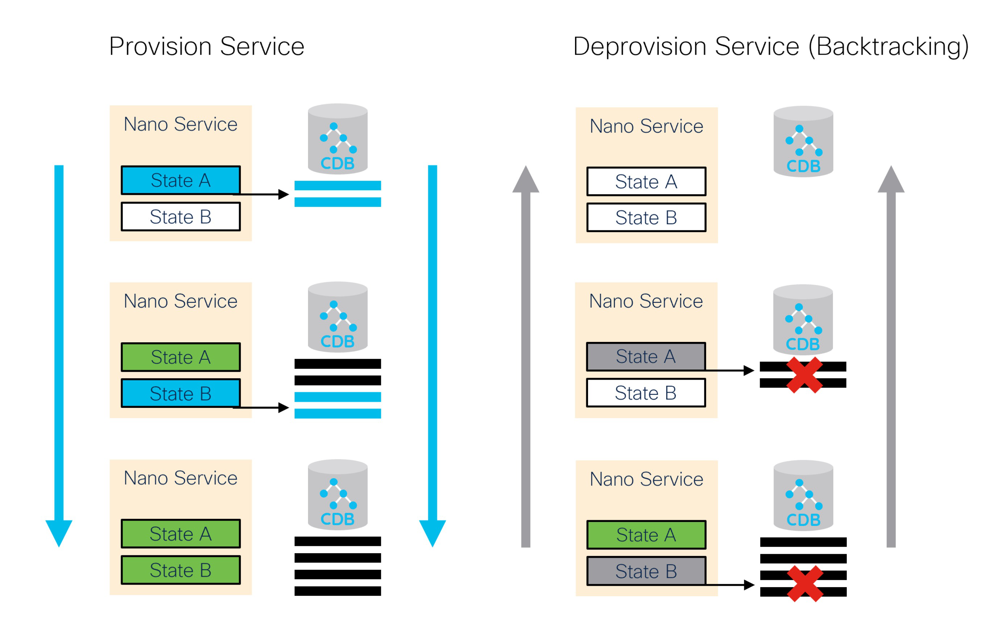
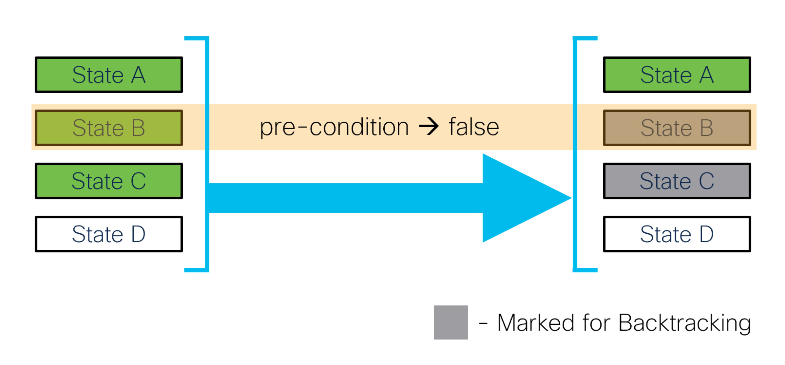
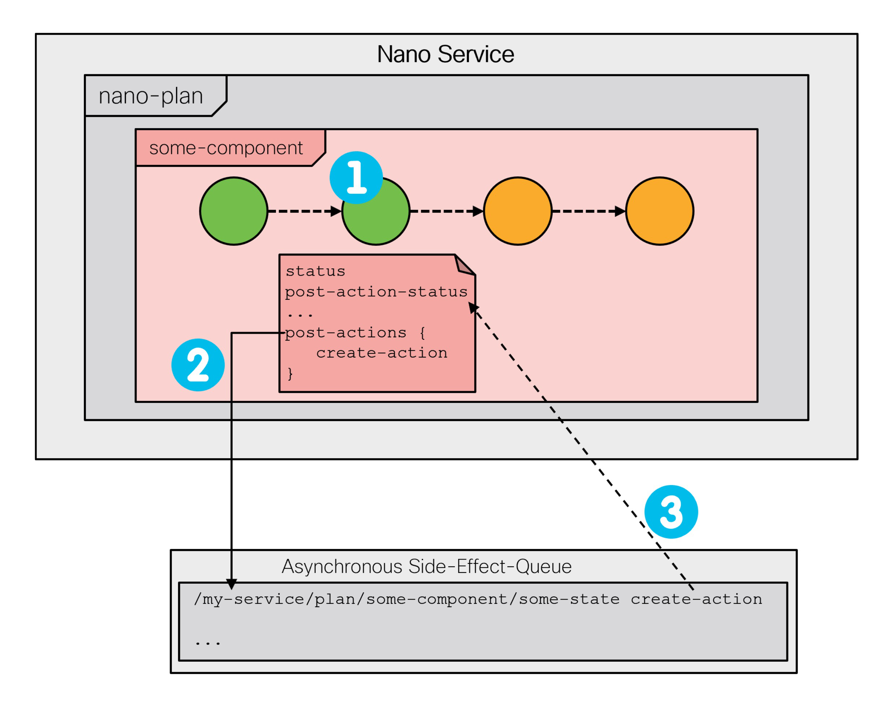
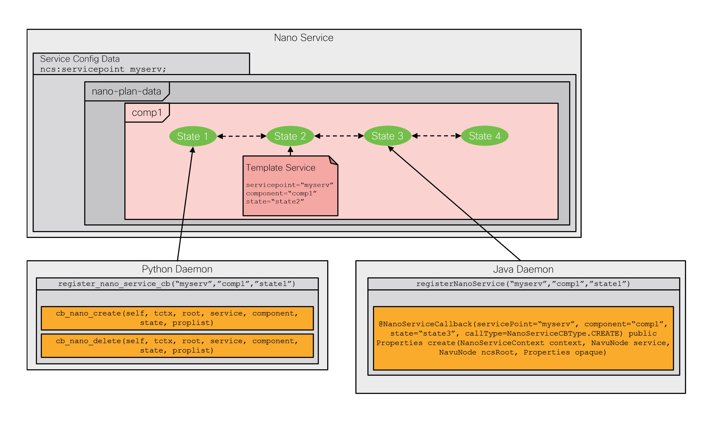

# Nano Services

Typical NSO services perform the necessary configuration by using the `create()` callback, within a transaction tracking the changes. This approach greatly simplifies service implementation, but it also introduces some limitations. For example, all provisioning is done at once, which may not be possible or desired in all cases. In particular, network functions implemented by containers or virtual machines often require provisioning in multiple steps.

Another limitation is that the service mapping code must not produce any side effects. Side effects are not tracked by the transaction and therefore cannot be automatically reverted. For example, imagine that there is an API call to allocate an IP address from an external system as part of the `create()` code. The same code runs for every service change or a service re-deploy, even during a `commit dry-run`, unless you take special precautions. So, a new IP address would be allocated every time, resulting in a lot of waste, or worse, provisioning failures.

Nano services help you overcome these limitations. They implement a service as several smaller (nano) steps or stages, by using a technique called reactive FASTMAP (RFM), and provide a framework to safely execute actions with side effects. Reactive FASTMAP can also be implemented directly, using the CDB subscribers, but nano services offer a more streamlined and robust approach for staged provisioning.

The section starts by gradually introducing the nano service concepts in a typical use case. To aid readers working with nano services for the first time, some of the finer points are omitted in this part and discussed later on, in [Implementation Reference](nano-services.md#ug.nano_services.impl). The latter is designed as a reference to aid you during implementation, so it focuses on recapitulating the workings of nano services at the expense of examples. The rest of the chapter covers individual features with associated use cases and the complete working examples, which you may find in the [examples.ncs/nano-services](https://github.com/NSO-developer/nso-examples/tree/6.6/nano-services) folder.

## Basic Concepts <a href="#d5e9577" id="d5e9577"></a>

Services ideally perform the configuration all at once, with all the benefits of a transaction, such as automatic rollback and cleanup on errors. For nano services, this is not possible in the general case. Instead, a nano service performs as much configuration as possible at the moment and leaves the rest for later. When an event occurs that allows more work to be done, the nano service instance restarts provisioning, by using a re-deploy action called `reactive-re-deploy`. It allows the service to perform additional configuration that was not possible before. The process of automatic re-deploy, called reactive FASTMAP, is repeated until the service is fully provisioned.

This is most evident with, for example, virtual machine (VM) provisioning, during virtual network function (VNF) orchestration. Consider a service that deploys and configures a router in a VM. When the service is first instantiated, it starts provisioning a router VM. However, it will likely take some time before the router has booted up and is ready to accept a new configuration. In turn, the service cannot configure the router just yet. The service must wait for the router to become ready. That is the event that triggers a re-deploy and the service can finish configuring the router, as the following figure illustrates:

<div data-with-frame="true"><figure><figcaption><p>Virtual Router Provisioning Steps</p></figcaption></figure></div>

While each step of provisioning happens inside a transaction and is still atomic, the whole service is not. Instead of a simple fully-provisioned or not-provisioned-at-all status, a nano service can be in a number of other _states_, depending on how far in the provisioning process it is.

The figure shows that the router VM goes through multiple states internally, however, only two states are important for the service. These two are shown as arrows, in the lower part of the figure. When a new service is configured, it requests a new VM deployment. Having completed this first step, it enters the “VM is requested but still provisioning” state. In the following step, the VM is configured and so enters the second state, where the router VM is deployed and fully configured. The states obviously follow individual provisioning steps and are used to report progress. What is more, each state tracks if an error occurred during provisioning.

For these reasons, service states are central to the design of a nano service. A list of different states, their order, and transitions between them is called a plan outline and governs the service behavior.

### Plan Outline <a href="#d5e9593" id="d5e9593"></a>

By default, the plan outline consists of a single component, the `self` component, with the two states `init` and `ready`. It can be used to track the progress of the service as a whole. You can add any number of additional components and states to form the nano service.

The following YANG snippet, also part of the [examples.ncs/nano-services/basic-vrouter](https://github.com/NSO-developer/nso-examples/tree/6.6/nano-services/basic-vrouter) example, shows a plan outline with the two VM-provisioning states presented above:

```yang
module vrouter {
  prefix vr;

  identity vm-requested {
    base ncs:plan-state;
  }

  identity vm-configured {
    base ncs:plan-state;
  }

  identity vrouter {
    base ncs:plan-component-type;
  }

  ncs:plan-outline vrouter-plan {
    description "Plan for configuring a VM-based router";

    ncs:component-type "vr:vrouter" {
      ncs:state "vr:vm-requested";
      ncs:state "vr:vm-configured";
    }
  }
}
```

The first part contains a definition of states as identities, deriving from the `ncs:plan-state` base. These identities are then used with the `ncs:plan-outline`, inside an `ncs:component-type` statement. Also, note that it is customary to use past tense for state names, for example, `configured-vm` or `vm-configured` instead of `configure-vm` and `configuring-vm`.

At present, the plan contains one component and two states but no logic. If you wish to do any provisioning for a state, the state must declare a special nano create callback, otherwise, it just acts as a checkpoint. The nano create callback is similar to an ordinary create service callback, allowing service code or templates to perform configuration. To add a callback for a state, extend the definition in the plan outline:

```
ncs:state "vr:vm-requested" {
  ncs:create {
    ncs:nano-callback;
  }
}
```

The service automatically enters each state one by one when a new service instance is configured. However, for the `vm-configured` state, the service should wait until the router VM has had the time to boot and is ready to accept a new configuration. An `ncs:pre-condition` statement in YANG provides this functionality. Until the condition becomes fulfilled, the service will not advance to that state.

The following YANG code instructs the nano service to check the value of the `vm-up-and-running` leaf, before entering and performing the configuration for a state.

```
ncs:state "vr:vm-configured" {
  ncs:create {
    ncs:nano-callback;
    ncs:pre-condition {
      ncs:monitor "$SERVICE" {
        ncs:trigger-expr "vm-up-and-running = 'true'";
      }
    }
  }
}
```

### Per-State Configuration <a href="#d5e9614" id="d5e9614"></a>

The main reason for defining multiple nano service states is to specify what part of the overall configuration belongs in each state. For the VM-router example, that entails splitting the configuration into a part for deploying a VM on a virtual infrastructure and a part for configuring it. In this case, a router VM is requested simply by adding an entry to a list of VM requests, while making the API calls is left to an external component, such as the VNF Manager.

If a state defines a nano callback, you can register a configuration template to it. The XML template file is very similar to an ordinary service template but requires additional `componenttype` and `state` attributes in the `config-template` root element. These attributes identify which component and state in the plan outline the template belongs to, for example:

```xml
<config-template xmlns="http://tail-f.com/ns/config/1.0"
                 servicepoint="vrouter-servicepoint"
                 componenttype="vr:vrouter"
                 state="vr:vm-configured">
  <devices xmlns="http://tail-f.com/ns/ncs">
    <!-- ... -->
  </devices>
</config-template>
```

Likewise, you can implement a callback in the service code. The registration requires you to specify the component and state, as the following Python example demonstrates:

```python
class NanoApp(ncs.application.Application):
    def setup(self):
        self.register_nano_service('vrouter-servicepoint',  # Service point
                                   'vr:vrouter',            # Component
                                   'vr:vm-requested',       # State
                                   NanoServiceCallbacks)
```

The selected `NanoServiceCallbacks` class then receives callbacks in the `cb_nano_create()` function:

```python
class NanoServiceCallbacks(ncs.application.NanoService):
    @ncs.application.NanoService.create
    def cb_nano_create(self, tctx, root, service, plan, component, state,
                       proplist, component_proplist):
        ...
```

The `component` and `state` parameters allow the function to distinguish calls for different callbacks when registered for more than one.

For most flexibility, each state defines a separate callback, allowing you to implement some with a template and others with code, all as part of the same service. You may even use Java instead of Python, as explained in [Nano Service Callbacks](nano-services.md#ug.nano_services.callbacks).

### Link Plan Outline to Service <a href="#d5e9633" id="d5e9633"></a>

The set of states used in the plan outline describes the stages that a service instance goes through during provisioning. Naturally, these are service-specific, which presents a problem if you just want to tell whether a service instance is still provisioning or has already finished. It requires the knowledge of which state is the last, final one, making it hard to check in a generic way.

That is why each service component must have the built-in `ncs:init` state as the first state and `ncs:ready` as the last state. Using the two built-in states allows for interoperability with other services and tools. The following is a complete four-state plan outline for the VM-based router service, with the two states added:

```
ncs:plan-outline vrouter-plan {
  description "Plan for configuring a VM-based router";

  ncs:component-type "vr:vrouter" {
    ncs:state "ncs:init";
    ncs:state "vr:vm-requested" {
      ncs:create {
        ncs:nano-callback;
      }
    }
    ncs:state "vr:vm-configured" {
      ncs:create {
        ncs:nano-callback;
        ncs:pre-condition {
          ncs:monitor "$SERVICE" {
            ncs:trigger-expr "vm-up-and-running = 'true'";
          }
        }
      }
    }
    ncs:state "ncs:ready";
  }
}
```

For the service to use it, the plan outline must be linked to a service point with the help of a `behavior tree`. The main purpose of a behavior tree is to allow a service to dynamically instantiate components, based on service parameters. Dynamic instantiation is not always required and the behavior tree for a basic, static, single-component scenario boils down to the following:

```
ncs:service-behavior-tree vrouter-servicepoint {
  description "A static, single component behavior tree";
  ncs:plan-outline-ref "vr:vrouter-plan";
  ncs:selector {
    ncs:create-component "'vrouter'" {
      ncs:component-type-ref "vr:vrouter";
    }
  }
}
```

This behavior tree always creates a single `“vrouter”` component for the service. The service point is provided as an argument to the `ncs:service-behavior-tree` statement, while the `ncs:plan-outline-ref` statement provides the name for the plan outline to use.

The following figure visualizes the resulting service plan and its states.

<div data-with-frame="true"><figure><figcaption><p>Virtual Router Provisioning Plan</p></figcaption></figure></div>

Along with the behavior tree, a nano service also relies on the `ncs:nano-plan-data` grouping in its service model. It is responsible for storing state and other provisioning details for each service instance. Other than that, the nano service model follows the standard YANG definition of a service:

```yang
list vrouter {
  description "Trivial VM-based router nano service";

  uses ncs:nano-plan-data;
  uses ncs:service-data;
  ncs:servicepoint vrouter-servicepoint;

  key name;
  leaf name {
    type string;
  }

  leaf vm-up-and-running {
    type boolean;
    config false;
  }
}
```

This model includes the operational `vm-up-and-running` leaf, that the example plan outline depends on. In practice, however, a plan outline is more likely to reference values provided by another part of the system, such as the actual, externally provided, state of the provisioned VM.

### Service Instantiation <a href="#d5e9658" id="d5e9658"></a>

A nano service does not directly use its service point for configuration. Instead, the service point invokes a behavior tree to generate a plan, and the service starts executing according to this plan. As it reaches a certain state, it performs the relevant configuration for that state.

For example, when you create a new instance of the VM-router service, the `vm-up-and-running` leaf is not set, so only the first part of the service runs. Inspecting the service instance plan reveals the following:

```cli
admin@ncs# show vrouter vr-01 plan
                                                                                     POST
                  BACK                                                               ACTION
TYPE     NAME     TRACK  GOAL  STATE          STATUS       WHEN                 ref  STATUS
---------------------------------------------------------------------------------------------
self     self     false  -     init           reached      2023-08-11T07:45:20  -    -
                               ready          not-reached  -                    -    -
vrouter  vrouter  false  -     init           reached      2023-08-11T07:45:20  -    -
                               vm-requested   reached      2023-08-11T07:45:20  -    -
                               vm-configured  not-reached  -                    -    -
                               ready          not-reached  -                    -    -
```

Since neither the `init` nor the `vm-requested` states have any pre-conditions, they are reached right away. In fact, NSO can optimize it into a single transaction (this behavior can be disabled if you use forced commits, discussed later on).

But the process has stopped at the `vm-configured` state, denoted by the `not-reached` status in the output. It is waiting for the pre-condition to become fulfilled with the help of a kicker. The job of the kicker is to watch the value and perform an action, the reactive re-deploy, when the conditions are satisfied. The kickers are managed by the nano service subsystem: when an unsatisfied precondition is encountered, a kicker is configured, and when the precondition becomes satisfied, the kicker is removed.

You may also verify, through the `get-modifications` action, that only the first part, the creation of the VM, was performed:

```cli
admin@ncs# vrouter vr-01 get-modifications
cli {
    local-node {
        data +vm-instance vr-01 {
              +    type csr-small;
              +}

    }
}
```

At the same time, a kicker was installed under the `kickers` container but you may need to use the `unhide debug` command to inspect it. More information on kickers in general is available in [Kicker](../advanced-development/kicker.md).

At a later point in time, the router VM becomes ready, and the `vm-up-and-running` leaf is set to a `true` value. The installed kicker notices the change and automatically calls the `reactive-re-deploy` action on the service instance. In turn, the service gets fully deployed.

```cli
admin@ncs# show vrouter vr-01 plan
                                                                                 POST
                  BACK                                                           ACTION
TYPE     NAME     TRACK  GOAL  STATE          STATUS   WHEN                 ref  STATUS
-----------------------------------------------------------------------------------------
self     self     false  -     init           reached  2023-08-11T07:45:20  -    -
                               ready          reached  2023-08-11T07:47:36  -    -
vrouter  vrouter  false  -     init           reached  2023-08-11T07:45:20  -    -
                               vm-requested   reached  2023-08-11T07:45:20  -    -
                               vm-configured  reached  2023-08-11T07:47:36  -    -
                               ready          reached  2023-08-11T07:47:36  -    -
```

The `get-modifications` output confirms this fact. It contains the additional IP address configuration, performed as part of the `vm-configured` step:

```cli
admin@ncs# vrouter vr-01 get-modifications
cli {
    local-node {
        data +vm-instance vr-01 {
             +    type    csr-small;
             +    address 198.51.100.1;
             +}
    }
}
```

The `ready` state has no additional pre-conditions, allowing NSO to reach it along with the `vm-configured` state. This effectively breaks the provisioning process into two steps. To break it down further, simply add more states with corresponding pre-conditions and create logic.

Other than staged provisioning, nano services act the same as other services, allowing you to use the service check-sync and similar actions, for example. But please note the un-deploy and re-deploy actions may behave differently than expected, as they deal with provisioning. Chiefly, a re-deploy reevaluates the pre-conditions, possibly generating a different configuration if a pre-condition depends on operational values that have changed. The un-deploy action, on the other hand, removes all of the recorded modifications, along with the generated plan.

## Benefits and Use Cases <a href="#d5e9694" id="d5e9694"></a>

Every service in NSO has a YANG definition of the service parameters, a service point name, and an implementation of the service point `create()` callback. Normally, when a service is committed, the FASTMAP algorithm removes all previous data changes internally and presents the service data to the `create()` callback as if this was the initial create. When the `create()` callback returns, the FASTMAP algorithm compares the result and calculates a reverse diff-set from the data changes. This reverse diff-set contains the operations that are needed to restore the configuration data to the state as it was before the service was created. The reverse diff-set is required, for instance, if the service is deleted or modified.

This fundamental principle is what makes the implementation of services and the `create()` callback simple. In turn, a lot of the NSO functionality relies on this mechanism.

However, in the reactive FASTMAP pattern, the `create()` callback is re-entered several times by using the subsequent `reactive-re-deploy` calls. Storing all changes in a single reverse diff-set then becomes an impediment. For instance, if a staged delete is necessary, there is no way to single out which changes each RFM step performed.

A nano service abandons the single reverse diff-set by introducing `nano-plan-data` and a new `NanoCreate()` callback. The `nano-plan-data` YANG grouping represents an executable plan that the system can follow to provision the service. It has additional storage for reverse diff-set and pre-conditions per state, for each component of the plan.

This is illustrated in the following figure:

<figure><figcaption><p>Per-state FASTMAP with nano services</p></figcaption></figure>

You can still use the service `get-modifications` action to visualize all data changes performed by the service as an aggregate. In addition, each state also has its own `get-modifications` action that visualizes the data changes for that particular state. It allows you to more easily identify the state and, by extension, the code that produced those changes.

Before nano services became available, RFM services could only be implemented by creating a CDB subscriber. With the subscriber approach, the service can still leverage the plan-data grouping, which `nano-plan-data` is based on, to report the progress of the service under the resulting `plan` container. But the `create()` callback becomes responsible for creating the plan components, their states, and setting the status of the individual states as the service creation progresses.

Moreover, implementing a staged delete with a subscriber often requires keeping the configuration data outside of the service. The code is then distributed between the service `create()` callback and the correlated CDB subscriber. This all results in several sources that potentially contain errors that are complicated to track down. Nano services, on the other hand, do not require any use of CDB subscribers or other mechanisms outside of the service code itself to support the full-service life cycle.

## Backtracking and Staged Delete <a href="#d5e9725" id="d5e9725"></a>

Resource de-provisioning is an important part of the service life cycle. The FASTMAP algorithm ensures that no longer needed configuration changes in NSO are removed automatically but that may be insufficient by itself. For example, consider the case of a VM-based router, such as the one described earlier. Perhaps provisioning of the router also involves assigning a license from a central system to the VM and that license must be returned when the VM is decommissioned. If releasing the license must be done by the VM itself, simply destroying it will not work.

Another example is the management of a web server VM for a web application. Here, each VM is part of a larger pool of servers behind a load balancer that routes client requests to these servers. During de-provisioning, simply stopping the VM interrupts the currently processing requests and results in client timeouts. This can be avoided with a graceful shutdown, which stops the load balancer from sending new connections to the server and waits for the current ones to finish, before removing the VM.

Both examples require two distinct steps for de-provisioning. Can nano services be of help in this case? Certainly. In addition to the state-by-state provisioning of the defined components, the nano service system in NSO is responsible for back-tracking during their removal. This process traverses all reached states in the reverse order, removing the changes previously done for each state one by one.

<figure><figcaption><p>Staged Delete with Backtracking</p></figcaption></figure>

In doing so, the back-tracking process checks for a 'delete pre-condition' of a state. A delete pre-condition is similar to the create pre-condition, but only relevant when back-tracking. If the condition is not fulfilled, the back-tracking process stops and waits until it becomes satisfied. Behind the scenes, a kicker is configured to restart the process when that happens.

If the state's delete pre-condition is fulfilled, back-tracking first removes the state's 'create' changes recorded by FASTMAP and then invokes the nano `delete()` callback, if defined. The main use of the callback is to override or veto the default status calculation for a back-tracking state. That is why you can't implement the `delete()` callback with a template, for example. Very importantly, `delete()` changes are not kept in a service's reverse diff-set and may stay even after the service is completely removed. In general, you are advised to avoid writing any configuration data because this callback is called under a removal phase of a plan component where new configuration is seldom expected.

Since the 'create' configuration is automatically removed, without the need for a separate `delete()` callback, these callbacks are used only in specific cases and are not very common. Regardless, the `delete()` callback may run as part of the `commit dry-run` command, so it must not invoke further actions or cause side effects.

Backtracking is invoked when a component of a nano service is removed, such as when deleting a service. It is also invoked when evaluating a plan and a reached state's 'create' pre-condition is no longer satisfied. In this case, the affected component is temporarily set to a back-tracking mode for as long as it contains such nonconforming states. It allows the service to recover and return to a well-defined state.

<div data-with-frame="true"><figure><figcaption><p>Backtracking on no longer satisfied pre-condition</p></figcaption></figure></div>

To implement the delete pre-condition or the `delete()` callback, you must add the `ncs:delete` statement to the relevant state in the plan outline. Applying it to the web server example above, you might have:

```
    ncs:state "vr:vm-requested" {
      ncs:create { ... }
      ncs:delete {
        ncs:pre-condition {
          ncs:monitor "$SERVICE" {
            ncs:trigger-expr "requests-in-processing = '0'";
          }
        }
      }
    }
    ncs:state "vr:vm-configured" {
      ncs:create { ... }
      ncs:delete {
        ncs:nano-callback;
      }
    }
```

While, in general, the `delete()` callback should not produce any configuration, the graceful shutdown scenario is one of the few exceptional cases where this may be required. Here, the `delete()` callback allows you to re-configure the load balancer to remove the server from actively accepting new connections, such as marking it 'under maintenance'. The 'delete' pre-condition allows you to further delay the VM removal until the ongoing requests are completed.

Similar to the `create()` callback, the `ncs:nano-callback` statement instructs NSO to also process a `delete()` callback. A Python class that you have registered for the nano service must then implement the following method:

```python
    @NanoService.delete
    def cb_nano_delete(self, tctx, root, service, plan, component, state,
                       proplist, component_proplist):
        ...
```

As explained, there are some uncommon cases where additional configuration with the `delete()` callback is required. However, a more frequent use of the `ncs:delete` statement is in combination with side-effect actions.

## Managing Side Effects <a href="#d5e9769" id="d5e9769"></a>

In some scenarios, side effects are an integral part of the provisioning process and cannot be avoided. The aforementioned example on license management may require calling a specific device action. Even so, the `create()` or `delete()` callbacks, nano service or otherwise, are a bad fit for such work. Since these callbacks are invoked during the transaction commit, no RPCs or other access outside of the NSO datastore are allowed. If allowed, they would break the core NSO functionality, such as a dry run, where side effects are not expected.

A common solution is to perform these actions outside of the configuration transaction. Nano services provide this functionality through the post-actions mechanism, using a `post-action-node` statement for a state. It is a definition of an action that should be invoked after the state has been reached and the commit performed. To ensure the latter, NSO will commit the current transaction before executing the post-action and advancing to the next state.

The service's plan state data also carries a post-action status leaf, which reflects whether the action was executed and if it was successful. The leaf will be set to `not-reached`, `create-reached`, `delete-reached`, or `failed`, depending on the case and result. If the action is still executing, then the leaf will show either a `create-init` or `delete-init` status instead.

Moreover, post actions can be run either asynchronously (default) or synchronously. To run them synchronously, add a `sync` statement to the post-action statement. When a post action is run asynchronously, further states will not wait for the action to finish, unless you define an explicit `post-action-status` precondition. While for a synchronous post action, later states in the same component will be invoked only after the post action is run successfully.

The exception to this setting is when a component switches to a backtracking mode. In that case, the system will not wait for any create post action to complete (synchronous or not) but will start executing backtracking right away. It means a delete callback or a delete post action for a state may run before its synchronous create post action has finished executing.

The side-effect-queue and a corresponding kicker are responsible for invoking the actions on behalf of the nano service and reporting the result in the respective state's post-action-status leaf. The following figure shows an entry is made in the side-effect-queue (2) after the state is reached (1) and its post-action status is updated (3) once the action finishes executing.

<div data-with-frame="true"><figure><figcaption><p>Post-action Execution Through side-effect-queue</p></figcaption></figure></div>

You can use the `show side-effect-queue` command to inspect the queue. The queue will run multiple actions in parallel and keep the failed ones for you to inspect. Please note that High Availability (HA) setups require special consideration: the side effect queue is disabled when High Availability is enabled and the High Availability mode is `NONE`. See [Mode of Operation](../../administration/management/high-availability.md#ha.moo) for more details.

In case of a failure, a post action sets the post-action-status accordingly and, if the action is synchronous, the nano service stops progressing. To retry the failed action, you can perform the action `reschedule`.

```bash
$ ncs_cli -u admin
admin@ncs> show side-effect-queue side-effect status
ID  STATUS
------------
2   failed

[ok][2023-08-15 11:01:10]
admin@ncs> request side-effect-queue side-effect 2 reschedule
side-effect-id 2
[ok][2023-08-15 11:01:18]
```

Or, execute a (reactive) re-deploy, which will also restart the nano service if it was stopped.

Using the post-action mechanism, it is possible to define side effects for a nano service in a safe way. A post-action is only executed one time. That is if the post-action-status is already at the `create-reached` in the create case or `delete-reached` in the delete case, then new calls of the post-actions are suppressed. In dry-run operations, post-actions are never called.

These properties make post actions useful in a number of scenarios. A widely applicable use case is invoking a service self-test as part of initial service provisioning.

Another example, requiring the use of post-actions, is the IP address allocation scenario from the chapter introduction. By its nature, the allocation or assignment call produces a side effect in an external system: it marks the assigned IP address in use. The same is true for releasing the address. Since NSO doesn't know how to reverse these effects on its own, they can't be part of any `create()` callback. Instead, the API calls can be implemented as post-actions.

The following snippet of a plan outline defines a `create` and `delete` post-action to handle IP management:

```
      ncs:state "ncs:init" {
        ncs:create {
          ncs:post-action-node "$SERVICE" {
            ncs:action-name "allocate-ip";
            ncs:sync;
          }
        }
      }
      ncs:state "vr:ip-allocated" {
        ncs:delete {
          ncs:post-action-node "$SERVICE" {
            ncs:action-name "release-ip";
          }
        }
      }
```

Let's see how this plan manifests during provisioning. After the first (`init`) state is reached and committed, it fires off an allocation action on the service instance, called `allocate-ip`. The job of the `allocate-ip` action is to communicate with the external system, the IP Address Management (IPAM), and allocate an address for the service instance. This process may take a while, however, it does not tie up NSO, since it runs outside of the configuration transaction and other configuration sessions can proceed in the meantime.

The `$SERVICE` XPath variable is automatically populated by the system and allows you to easily reference the service instance. There are other automatic variables defined. You can find the complete list inside the `tailf-ncs-plan.yang` submodule, in the `$NCS_DIR/src/ncs/yang/` folder.

Due to the `ncs:sync` statement, service provisioning can continue only after the allocation process (the action) completes. Once that happens, the service resumes processing in the `ip-allocated` state, with the IP value now available for configuration.

On service deprovisioning, the back-tracking mechanism works backwards through the states. When it is the ip-allocated state's turn to deprovision, NSO reverts any configuration done as part of this state, and then runs the `release-ip` action, defined inside the `ncs:delete` block. Of course, this only happens if the state previously had a reached status. Implemented as a post-action, `release-ip` can safely use the external IPAM API to deallocate the IP address, without impacting other sessions.

The actions, as defined in the example, do not take any parameters. When needed, you may pass additional parameters from the service's `opaque` and `component_proplist` object. These parameters must be set in advance, for example in some previous create callback. For details, please refer to the YANG definition of `post-action-input-params` in the `tailf-ncs-plan.yang` file.

### Multiple and Dynamic Plan Components <a href="#d5e9827" id="d5e9827"></a>

The discussion on basic concepts briefly mentions the role of a nano behavior tree but it does not fully explore its potential. Let's now consider in which situations you may find a non-trivial behavior tree beneficial.

Suppose that you are implementing a service that requires not one but two VMs. While you can always add more states to the component, these states are processed sequentially. However, you might want to provision the two VMs in parallel, since they take a comparatively long time, and it makes little sense having to wait until the first one is finished before starting with the second one. Nano services provide an elegant solution to this challenge in the form of multiple plan components: provisioning of each VM can be tracked by a separate plan component, allowing the two to advance independently, in parallel.

If the two VMs go through the same states, you can use a single component type in the plan outline for both. It is the job of the behavior tree to create or synthesize actual components for each service instance. Therefore, you could use a behavior tree similar to the following example:

```
ncs:service-behavior-tree multirouter-servicepoint {
  description "A 2-VM behavior tree";
  ncs:plan-outline-ref "vr:multirouter-plan";
  ncs:selector {
    ncs:create-component "'vm1'" {
      ncs:component-type-ref "vr:router-vm";
    }
    ncs:create-component "'vm2'" {
      ncs:component-type-ref "vr:router-vm";
    }
  }
}
```

The two `ncs:create-component` statements instruct NSO to create two components, named `vm1` and `vm2`, of the same `vr:router-vm` type. Note the required use of single quotes around component names, because the value is actually an XPath expression. The quotes ensure the name is used verbatim when the expression is evaluated.

With multiple components in place, the implicit `self` component reflects the cumulative status of the service. The `ready` state of the `self` component will never have its status set to `reached` until all other components have the `ready` state status set to `reached` and all post-actions have been run, too. Likewise, during backtracking, the `init` state will never be set to `not-reached` until all other components have been fully backtracked and all delete post actions have been run. Additionally, the `self` `ready` or `init` state status will be set to `failed` if any other state has a `failed` status or a failed post-action, thus signaling that something has failed while executing the service instance.

As you can see, all the `ncs:create-component` statements are placed inside an `ncs:selector` block. A selector is a so-called control flow node. It selects a group of components and allows you to decide whether they are created or not, based on a pre-condition. The pre-condition can reference a service parameter, which in turn controls if the relevant components are provisioned for this service instance. The mechanism enables you to dynamically produce just the necessary plan components.

The pre-condition is not very useful on the top selector node, but selectors can also be nested. For example, having a `use-virtual-devices` configuration leaf in the service YANG model, you could modify the behavior tree to the following:

```
ncs:service-behavior-tree multirouter-servicepoint {
  description "A conditional 2-VM behavior tree";
  ncs:plan-outline-ref "vr:multirouter-plan";
  ncs:selector {
    ncs:create-component "'router'" { ... }
    ncs:selector {
      ncs:pre-condition {
        ncs:monitor "$SERVICE" {
          ncs:trigger-expr "use-virtual-devices = 'true'";
        }
      }
      ncs:create-component "'vm1'" { ... }
      ncs:create-component "'vm2'" { ... }
    }
  }
}
```

The described behavior tree always synthesizes the `router` component and evaluates the child selector. However, the child selector only synthesizes the two VM components if the service configuration requested so by setting the `use-virtual-devices` to `true`.

What is more, if the pre-condition value changes, the system re-evaluates the behavior tree and starts the backtracking operation for any removed components.

For even more complex cases, where a variable number of components needs to be synthesized, the `ncs:multiplier` control flow node becomes useful. Its `ncs:foreach` statement selects a set of elements and each element is processed in the following way:

* If the optional `when` statement is not satisfied, the element is skipped.
* All `variable` statements are evaluated as XPath expressions for this element, to produce a unique name for the component and any other element-specific values.
* All `ncs:create-component` and other control flow nodes are processed, creating the necessary components for this element.

The multiplier node is often used to create a component for each item in a list. For example, if the service model contains a list of VMs, with a key `name`, then the following code creates a component for each of the items:

```
ncs:multiplier {
  ncs:foreach "vms" {
    ncs:variable "NAME" {
      ncs:value-expr "concat('vm-', name)";
    }
    ncs:create-component "$NAME" { ... }
  }
}
```

In this particular case, it might be possible to avoid the variable altogether, by using the expression for the `create-component` statement directly. However, defining a variable also makes it available to service `create()` callbacks.

This is extremely useful, since you can access these values, as well as the ones from the service opaque object, directly in the nano service XML templates. The opaque, especially, allows you to separate the logic in code from applying the XML templates.

## Netsim Router Provisioning Example <a href="#d5e9876" id="d5e9876"></a>

The [examples.ncs/nano-services/netsim-vrouter](https://github.com/NSO-developer/nso-examples/tree/6.6/nano-services/netsim-vrouter) folder contains a complete implementation of a service that provisions a netsim device instance, onboards it to NSO, and pushes a sample interface configuration to the device. Netsim device creation is neither instantaneous nor side-effect-free and thus requires the use of a nano service. It more closely resembles a real-world use case for nano services.

To see how the service is used through a prearranged scenario, execute the `make demo` command from the example folder. The scenario provisions and de-provisions multiple netsim devices to show different states and behaviors, characteristic of nano services.

The service, called `vrouter`, defines three component types in the `src/yang/vrouter.yang` file:

* `vr:vrouter`: A “day-0” component that creates and initializes a netsim process as a virtual router device.
* `vr:vrouter-day1`: A “day-1” component for configuring the created device and tracking NETCONF notifications.

As the name implies, the day-0 component must be provisioned before the day-1 component. Since the two provision in sequence, in general, a single component would suffice. However the components are kept separate to illustrate component dependencies.

The behavior tree synthesizes each of the components for a service instance using some service-specific names. To do so, the example defines three variables to hold different names:

```
      // vrouter name
      ncs:variable "NAME" {
        ncs:value-expr "current()/name";
      }
      // vrouter component name
      ncs:variable "D0NAME" {
        ncs:value-expr "concat(current()/name, '-day0')";
      }
      // vrouter day1 component name
      ncs:variable "D1NAME" {
        ncs:value-expr "concat(current()/name, '-day1')";
      }
```

The `vr:vrouter` (day-0) component has a number of plan states that it goes through during provisioning:

* ncs:init
* vr:requested
* vr:onboarded
* ncs:ready

The init and ready states are required as the first and last state in all components for correct overall state tracking in `ncs:self`. They have no additional logic tied to them.

The `vr:requested` state represents the first step in virtual router provisioning. While it does not perform any configuration itself (no nano-callback statement), it calls a post-action that does all the work. The following is a snippet of the plan outline for this state:

```
      ncs:state "vr:requested" {
        ncs:create {
          // Call a Python action to create and start a netsim vrouter
          ncs:post-action-node "$SERVICE" {
            ncs:action-name "create-vrouter";
            ncs:result-expr "result = 'true'";
            ncs:sync;
          }
        }
      }
```

The `create-router` action calls the Python code inside the `python/vrouter/main.py` file, which runs a couple of system commands, such as the `ncs-netsim create-device` and the `ncs-netsim start` commands. These commands do the same thing as you would if you performed the task manually from the shell.

The `vr:requested` state also has a `delete` post-action, analogous to `create`, which stops and removes the netsim device during service de-provisioning or backtracking.

Inspecting the Python code for these post actions will reveal that a semaphore is used to control access to the common netsim resource. It is needed because multiple `vrouter` instances may run the create and delete action callbacks in parallel. The Python semaphore is shared between the delete and create action processes using a Python multiprocessing manager, as the example configures the NSO Python VM to start the actions in multiprocessing mode. See [The Application Component](nso-virtual-machines/nso-python-vm.md#ncs.development.pythonvm.cthread) for details.

In `vr:onboarded`, the nano Python callback function from the `main.py` file adds the relevant NSO device entry for a newly created netsim device. It also configures NSO to receive notifications from this device through a NETCONF subscription. When the NSO configuration is complete, the state transitions into the `reached` status, denoting the onboarding has completed successfully.

The `vr:vrouter` component handles so-called day-0 provisioning. Alongside this component, the `vr:vrouter-day1` component starts provisioning in parallel. During provisioning, it transitions through the following states:

* `ncs:init`
* `vr:configured`
* `vr:deployed`
* `ncs:ready`

The component reaches the `init` state right away. However, the `vr:configured` state has a precondition:

```
      ncs:state "vr:configured" {
        ncs:create {
          // Wait for the onboarding to complete
          ncs:pre-condition {
            ncs:monitor  "$SERVICE/plan/component[type='vr:vrouter']" +
                         "[name=$D0NAME]/state[name='vr:onboarded']" {
              ncs:trigger-expr "post-action-status = 'create-reached'";
            }
          }
          // Invoke a service template to configure the vrouter
          ncs:nano-callback;
        }
      }
```

Provisioning can continue only after the first component, `vr:vrouter`, has executed its `vr:onboarded` post-action. The precondition demonstrates how one component can depend on another component reaching some particular state or successfully executing a post-action.

The `vr:onboarded` post-action performs a `sync-from` command for the new device. After that happens, the `vr:configured` state can push the device configuration according to the service parameters, by using an XML template, `templates/vrouter-configured.xml`. The service simply configures an interface with a VLAN ID and a description.

Similarly, the `vr:deployed` state has its own precondition, which makes use of the `ncs:any` statement. It specifies either (any) of the two monitor statements will satisfy the precondition.

One of them checks the last received NETCONF notification contains a `link-status` value of `up` for the configured interface. In other words, it will wait for the interface to become operational.

However, relying solely on notifications in the precondition can be problematic, as the received notifications list in NSO can be cleared and would result in unintentional backtracking on a service re-deploy. For this reason, there is the other monitor statement, checking the device live-status.

Once either of the conditions is satisfied, it marks the end of provisioning. Perhaps the use of notifications in this case feels a little superficial but it illustrates a possible approach to waiting for the steady state, such as routing adjacencies to form and alike.

Altogether, the example shows how to use different nano service mechanisms in a single, complex, multistage service that combines configuration and side effects. The example also includes a Python script that uses the RESTCONF protocol to configure a service instance and monitor its provisioning status. You are encouraged to configure a service instance yourself and explore the provisioning process in detail, including service removal. Regarding removal, have you noticed how nano services can de-provision in stages, but the service instance is gone from the configuration right away?

## Zombie Services <a href="#d5e9953" id="d5e9953"></a>

By removing the service instance configuration from NSO, you start a service de-provisioning process. For an ordinary service, a stored reverse diff-set is applied, ensuring that all of the service-induced configuration is removed in the same transaction. For nano services, having a staged, multistep service delete operation, is not possible. The provisioned states must be backtracked one by one, often across multiple transactions. With the service instance deleted, NSO must track the de-provisioning progress elsewhere.

For this reason, NSO mutates a nano service instance when it is removed. The instance is transformed into a zombie service, which represents the original service that still requires de-provisioning. Once the de-provisioning is complete, with all the states backtracked, the zombie is automatically removed.

Zombie service instances are stored with their service data, their plan states, and diff-sets in a `/ncs:zombies/services` list. When a service mutates to a zombie, all plan components are set to back-tracking mode and all service pre-condition kickers are rewritten to reference the zombie service instead. Also, the nano service subsystem now updates the zombie plan states as de-provisioning progresses. You can use the `show zombies service` command to inspect the plan.

Under normal conditions, you should not see any zombies, except for the service instances that are actively de-provisioning. However, if an error occurs, the de-provisioning process will stop with an error status and a zombie will remain. With a zombie present, NSO will not allow creating the same service instance in the configuration tree. The zombie must be removed first.

After addressing the underlying problem, you can restart the de-provisioning process with the `re-deploy` or the `reactive-re-deploy` actions. The difference between the two is which user the action uses. The `re-deploy` uses the current user that initiated the action whilst the `reactive-re-deploy` action keeps using the same user that last modified the zombie service.

These zombie actions behave a bit differently than their normal service counterparts. In particular, the zombie variants perform the following steps to better serve the de-provisioning process:

1. Start a temporary transaction in which the service is reinstated (created). The service plan will have the same status as it had when it mutated.
2. Back-track plan components in a normal fashion, that is, removing device changes for states with delete pre-conditions satisfied.
3. If all components are completely back-tracked, the zombie is removed from the zombie list. Otherwise, the service and the current plan states are stored back into the zombie list, with new kickers waiting to activate the zombie when some delete pre-condition is satisfied.

In addition, zombie services support the `resurrect` action. The action reinstates the zombie back in the configuration tree as a real service, with the current plan status, and reverts plan components back from back-tracking to normal mode. It is an “undo” for a nano service delete.

In some situations, especially during nano service development, a zombie may get stuck because of a misconfigured precondition or similar issues. A re-deploy is unlikely to help in that case and you may need to forcefully remove the problematic plan component. The `force-back-track` action performs this job and allows you to backtrack to a specific state if specified. But beware that using the action avoids calling any post-actions or delete callbacks for the forcefully backtracked states, even though the recorded configuration modifications are reverted. It can and will leave your systems in an inconsistent or broken state if you are not careful.

## Using Notifications to Track the Plan and its Status <a href="#d5e9981" id="d5e9981"></a>

When a service is provisioned in stages, as nano services are, the success of the initial commit no longer indicates the service is provisioned. Provisioning may take a while and may fail later, requiring you to consult the service plan to observe the service status. This makes it harder to tell when a service finishes provisioning, for example. Fortunately, services provide a set of notifications that indicate important events in the service's life-cycle, including a successful completion. These events enable NETCONF and RESTCONF clients to subscribe to events instead of polling the plan and commit queue status.

The built-in service-state-changes NETCONF/RESTCONF stream is used by NSO to generate northbound notifications for services, including nano services. The event stream is enabled by default in `ncs.conf`, however, individual notification events must be explicitly configured to be sent.

### The `plan-state-change` Notification <a href="#d5e9986" id="d5e9986"></a>

When a service's plan component changes state, the `plan-state-change` notification is generated with the new state of the plan. It includes the status, which indicates one of not-reached, reached, or failed. The notification is sent when the state is `created`, `modified`, or `deleted`, depending on the configuration. For reference on the structure and all the fields present in the notification, please see the YANG model in the `tailf-ncs-plan.yang` file.

As a common use case, an event with status `reached` for the `self` component `ready` state signifies that all nano service components have reached their `ready` state and provisioning is complete. A simple example of this scenario is included in the [examples.ncs/nano-services/netsim-vrouter](https://github.com/NSO-developer/nso-examples/tree/6.6/nano-services/netsim-vrouter) `demo_rc.py` Python script, using RESTCONF.

To enable the plan-state-change notifications to be sent, you must enable them for a specific service in NSO. For example, can load the following configuration into the CDB as an XML initialization file:

```xml
<services xmlns="http://tail-f.com/ns/ncs">
  <plan-notifications>
    <subscription>
      <name>nano1</name>
      <service-type>/vr:vrouter</service-type>
      <component-type>self</component-type>
      <state>ready</state>
      <operation>modified</operation>
    </subscription>
    <subscription>
      <name>nano2</name>
      <service-type>/vr:vrouter</service-type>
      <component-type>self</component-type>
      <state>ready</state>
      <operation>created</operation>
    </subscription>
  </plan-notifications>
</services>
```

This configuration enables notifications for the self component's ready state when created or modified.

### The `service-commit-queue-event` Notification <a href="#d5e10003" id="d5e10003"></a>

When a service is committed through the commit queue, this notification acts as a reference regarding the state of the service. Notifications are sent when the service commit queue item is waiting to run, executing, waiting to be unlocked, completed, failed, or deleted. More details on the `service-commit-queue-event` notification content can be found in the YANG model inside `tailf-ncs-services.yang` .

For example, the `failed` event can be used to detect that a nano service instance deployment failed because a configuration change committed through the commit queue has failed. Measures to resolve the issue can then be taken and the nano service instance can be re-deployed. A simple example of this scenario is included in the [examples.ncs/nano-services/netsim-vrouter](https://github.com/NSO-developer/nso-examples/tree/6.6/nano-services/netsim-vrouter) `demo_rc.py` Python script where the service is committed through the commit queue, using RESTCONF. By design, the configuration commit to a device fails, resulting in a `commit-queue-notification` with the `failed` event status for the commit queue item.

To enable the service-commit-queue-event notifications to be sent, you can load the following example configuration into NSO, as an XML initialization file or some other way:

```xml
<services xmlns="http://tail-f.com/ns/ncs">
  <commit-queue-notifications>
    <subscription>
      <name>nano1</name>
      <service-type>/vr:vrouter</service-type>
    </subscription>
  </commit-queue-notifications>
</services>
```

### Examples of `service-state-changes` Stream Subscriptions <a href="#d5e10016" id="d5e10016"></a>

The following examples demonstrate the usage and sample events for the notification functionality, described in this section, using RESTCONF, NETCONF, and CLI northbound interfaces.

RESTCONF subscription request using `curl`:

```bash
$ curl -isu admin:admin -X GET -H "Accept: text/event-stream"
    http://localhost:8080/restconf/streams/service-state-changes/json

data: {
data:   "ietf-restconf:notification": {
data:     "eventTime": "2021-11-16T20:36:06.324322+00:00",
data:     "tailf-ncs:service-commit-queue-event": {
data:       "service": "/vrouter:vrouter[name='vr7']",
data:       "id": 1637135519125,
data:       "label": "vr7",
data:       "status": "completed",
data:       "trace-id": "5a7a892655db7056290ec0135506cfc8"
data:     }
data:   }
data: }

data: {
data:   "ietf-restconf:notification": {
data:     "eventTime": "2021-11-16T20:36:06.728911+00:00",
data:     "tailf-ncs:plan-state-change": {
data:       "service": "/vrouter:vrouter[name='vr7']",
data:       "component": "self",
data:       "state": "tailf-ncs:ready",
data:       "operation": "modified",
data:       "status": "reached",
data:       "trace-id": "5a7a892655db7056290ec0135506cfc8"
data:     }
data:   }
data: }
```

See [Streams](northbound-apis/#ncs.northbound.restconf.streams) in Northbound APIs for further reference.

NETCONF creates subscription using `netconf-console`:

```
$ netconf-console create-subscription=service-state-changes

<?xml version="1.0" encoding="UTF-8"?>
<notification xmlns="urn:ietf:params:xml:ns:netconf:notification:1.0">
  <eventTime>2021-11-16T20:36:06.324322+00:00</eventTime>
  <service-commit-queue-event xmlns="http://tail-f.com/ns/ncs">
    <service xmlns:vr="http://com/example/vrouter">/vr:vrouter[vr:name='vr7']</service>
    <id>1637135519125</id>
    <label>vr7</label>
    <status>completed</status>
    <trace-id>5a7a892655db7056290ec0135506cfc8</trace-id>
  </service-commit-queue-event>
</notification>
<?xml version="1.0" encoding="UTF-8"?>
<notification xmlns="urn:ietf:params:xml:ns:netconf:notification:1.0">
  <eventTime>2021-11-16T20:36:06.728911+00:00</eventTime>
  <plan-state-change xmlns="http://tail-f.com/ns/ncs">
    <service xmlns:vr="http://com/example/vrouter">/vr:vrouter[vr:name='vr7']</service>
    <component>self</component>
    <state>ready</state>
    <operation>modified</operation>
    <status>reached</status>
    <trace-id>5a7a892655db7056290ec0135506cfc8</trace-id>
  </plan-state-change>
</notification>
```

See [Notification Capability](northbound-apis/#ug.netconf_agent.notif) in Northbound APIs for further reference.

CLI shows received notifications using `ncs_cli`:

```bash
$ ncs_cli -u admin -C <<<'show notification stream service-state-changes'

notification
 eventTime 2021-11-16T20:36:06.324322+00:00
 service-commit-queue-event
  service /vrouter[name='vr7']
  id 1637135519125
  label vr7
  status completed
  trace-id 5a7a892655db7056290ec0135506cfc8
 !
!
notification
 eventTime 2021-11-16T20:36:06.728911+00:00
 plan-state-change
  service /vrouter[name='vr7']
  component self
  state ready
  operation modified
  status reached
  trace-id 5a7a892655db7056290ec0135506cfc8
 !
!
```

### The `label` and `trace-id` in the Notification <a href="#d5e10037" id="d5e10037"></a>

You have likely noticed the `label` and `trace-id` fields in the example notifications above. The `label` is an optional but very useful parameter when committing the service configuration and the [Trace ID](../../administration/management/system-management/#d5e2587) is generated by NSO for each commit. They helps you correlate events from the commit in the emitted log messages and the `service-state-changes` stream notifications. The above notifications, taken from the [examples.ncs/nano-services/netsim-vrouter](https://github.com/NSO-developer/nso-examples/tree/6.6/nano-services/netsim-vrouter) example, are emitted after applying a RESTCONF plain patch:

```
$ curl -isu admin:admin -X PATCH
  -H "Content-type: application/yang-data+json"
  'http://localhost:8080/restconf/data?commit-queue=sync&label=vr7'
  -d '{ "vrouter:vrouter": [ { "name": "vr7" } ] }'
```

Note that the `label` is specified as part of the URL. NSO will generate and assign the Trace ID on its own. See [Trace ID](../../administration/management/system-management/#d5e2587) for more information.

## Developing and Updating a Nano Service <a href="#d5e10046" id="d5e10046"></a>

At times, especially when you use an iterative development approach or simply due to changing requirements, you might need to update (change) an existing nano service and its implementation. In addition to other service update best practices, such as model upgrades, you must carefully consider the nano-service-specific aspects. The following discussion mostly focuses on migrating an already provisioned service instance to a newer version; however, the same concepts also apply while you are initially developing the service.

In the simple case, updating the model of a nano service and getting the changes to show up in an already created instance is a matter of executing a normal re-deploy. This will synthesize any new components and provision them, along with the new configuration, just like you would expect from a non-nano service.

A major difference occurs if a service instance is deleted and is in a zombie state when the nano service is updated. You should be aware that no synthetization is done for that service instance. The only goal of a deleted service is to revert any changes made by the service instance. Therefore, in that case, the synthetization is not needed. It means that, if you've made changes to callbacks, post-actions, or pre-conditions, those changes will not be applied to zombies of the nano service. If a service instance requires the new changes to be applied, you must re-deploy it before it is deleted.

When updating nano services, you also need to be aware that any old callbacks, post actions and any other models that the service depends on, need to be available in the new nano service package until all service instances created before the update have either been updated (through a re-deploy) or fully deleted. Therefore, you must take great care with any updates to a service if there are still zombies left in the system.

### Adding Components <a href="#d5e10052" id="d5e10052"></a>

Adding new components to the behavior tree will create the new components during the next re-deploy (synthetization) and execute the states in the new components as is normally done.

### Removing Components <a href="#d5e10055" id="d5e10055"></a>

When removing components from the behavior tree, the components that are removed are set to backtracking and are backtracked fully before they are removed from the plan.

When you remove a component, do so carefully so that any callbacks, post actions or any other model data that the component depends on are not removed until all instances of the old component are removed.

If the identity for a component type is removed, then NSO removes the component from the database when upgrading the package. If this happens, the component is not backtracked and the reverse diffsets are not applied.

### Replacing Components <a href="#d5e10060" id="d5e10060"></a>

Replacing components in the behavior tree is the same as having unrelated components that are deleted and added in the same update. The deleted components are backtracked as far as possible, and then the added components are created and their states executed in order.

In some cases, this is not the desired behavior when replacing a component. For example, if you only want to rename a component, backtracking and then adding the component again might make NSO push unnecessary changes to the network or run delete callbacks and post actions that should not be run. To remedy this, you might add the `ncs:deprecates-component` statements to the new component, detailing which components it replaces. NSO then skips the backtracking of the old component and just applies all reverse diffsets of the deprecated component. In the same re-deploy, it then executes the new component as usual. Therefore, if the new component produces the same configuration as the old component, nothing is pushed to the network.

If any of the deprecated components are backtracking, the backtracking will be handled before the component is removed. When there are multiple components that are deprecated in the same update, the components will not be removed, as detailed above, until all of them are done backtracking (if any one of them are backtracking).

### Adding and Removing States <a href="#d5e10066" id="d5e10066"></a>

When adding or removing states in a component, the component is backtracked before a new component with the new states is added and executed. If the updated component produces the same configuration as the old one (and no preconditions halt the execution), this should lead to no configuration being pushed to the network. So, if changes to the states are done, you need to take care when writing the preconditions and post actions for a component if no new changes should be pushed to the network.

Any changes to the already present states that are kept in the updated component will not have their configuration updated until the new component is created, which happens after the old one has been fully backtracked.

### Modifying States <a href="#d5e10070" id="d5e10070"></a>

For a component where only the configuration for one or more states have changed, the synthetization process will update the component with the new configuration and make sure that any new callbacks or similar are called during future execution of the component.

## Implementation Reference <a href="#ug.nano_services.impl" id="ug.nano_services.impl"></a>

The text in this section sums up as well as adds additional detail on the way nano services operate, which you will hopefully find beneficial during implementation.

To reiterate, the purpose of a nano service is to break down an RFM service into its isolated steps. It extends the normal `ncs:servicepoint` YANG mechanism and requires the following:

* A YANG definition of the service input parameters, with a service point name and the additional nano-plan-data grouping.
* A YANG definition of the plan component types and their states in a plan outline.
* A YANG definition of a behavior tree for the service. The behavior tree defines how and when to instantiate components in the plan.
* Code or templates for individual state transfers in the plan.

When a nano service is committed, the system evaluates its behavior tree. The result of this evaluation is a set of components that form the current plan for the service. This set of components is compared with the previous plan (before the commit). If there are new components, they are processed one by one.

For each component in the plan, it is executed state by state in the defined order. Before entering a new state, the create pre-condition for the state is evaluated if it exists. If a create pre-condition exists and if it is not satisfied, the system stops progressing this component and jumps to the next one. A kicker is then defined for the pre-condition that was not satisfied. Later, when this kicker triggers and the pre-condition is satisfied, it performs a `reactive-re-deploy` and the kicker is removed. This kicker mechanism becomes a self-sustained RFM loop.

If a state's pre-conditions are met, the callback function or template associated with the state is invoked, if it exists. If the callback is successful, the state is marked as `reached`, and the next state is executed.

A component, that is no longer present but was in the previous plan, goes into back-tracking mode, during which the goal is to remove all reached states and eventually remove the component from the plan. Removing state data changes is performed in a strict reverse order, beginning with the last reached state and taking into account a delete pre-condition if defined.

A nano service is expected to have a component. All components are expected to have `ncs:init` as its first state and `ncs:ready` as its last state. A component-type can have any number of specific states in between `ncs:init` and `ncs:ready`.

### Back-Tracking <a href="#d5e10107" id="d5e10107"></a>

Back-tracking is completely automatic and occurs in the following scenarios:

* **State pre-condition not satisfied**: A `reached` state's pre-condition is no longer satisfied, and there are subsequent states that are reached and contain reverse diff-sets.
* **Plan component is removed**: When a plan component is removed and has reached states that contain reverse diff-sets.
* **Service is deleted**: When a service is deleted, NSO will set all plan components to back-tracking mode before deleting the service.

For each RFM loop, NSO traverses each component and state in order. For each non-satisfied create pre-condition, a kicker is started that monitors and triggers when the pre-condition becomes satisfied.

<div data-with-frame="true"><figure><figcaption></figcaption></figure></div>

While traversing the states, a `create` pre-condition that was previously satisfied may become unsatisfied. If there are subsequent reached states that contain reverse diff-sets, then the component must be set to back-tracking mode. The back-tracking mode has as its goal to revert all changes up to the state that originally failed to satisfy its `create` pre-condition. While back-tracking, the delete pre-condition for each state is evaluated, if it exists. If the delete pre-condition is satisfied, the state's reverse diff-set is applied, and the next state is considered. If the delete pre-condition is not satisfied, a kicker is created to monitor this delete pre-condition. When the kicker triggers, a `reactive-re-deploy` is called and the back-tracking will continue until the goal is reached.

<div data-with-frame="true"><figure><figcaption></figcaption></figure></div>

When the back-tracking plan component has reached its goal state, the component is set to normal mode again. The state's create pre-condition is evaluated and if it is satisfied the state is entered or otherwise a kicker is created as described above.

<div data-with-frame="true"><figure><figcaption></figcaption></figure></div>

In some circumstances, a complete plan component is removed (for example, if the service input parameters are changed). If this happens, the plan component is checked if it contains reached states that contain reverse diff-sets.

<div data-with-frame="true"><figure><figcaption></figcaption></figure></div>

If the removed component contains reached states with reverse diff-sets, the deletion of the component is deferred and the component is set to back-tracking mode.

<div data-with-frame="true"><figure><figcaption></figcaption></figure></div>

In this case, there is no specified goal state for the back-tracking. This means that when all the states have been reverted, the component is automatically deleted.

<div data-with-frame="true"><figure><figcaption></figcaption></figure></div>

If a service is deleted, all components are set to back-tracking mode. The service becomes a zombie, storing away its plan states so that the service configuration can be removed.

All components of a deleted service are set in backtracking mode.

<div data-with-frame="true"><figure><figcaption></figcaption></figure></div>

When a component becomes completely back-tracked, it is removed.

<div data-with-frame="true"><figure><figcaption></figcaption></figure></div>

When all components in the plan are deleted, the service is removed.

<div data-with-frame="true"><figure><figcaption></figcaption></figure></div>

### Behavior Tree <a href="#d5e10173" id="d5e10173"></a>

A nano service behavior tree is a data structure defined for each service type. Without a behavior tree defined for the service point, the nano service cannot execute. It is the behavior tree that defines the currently executing nano-plan with its components.


This is in stark contrast to plan-data used for logging purposes where the programmer needs to write the plan and its components in the `create()` callback. For nano services, it is not allowed to define the nano plan in any other way than by a behavior tree.


The purpose of a behavior tree is to have a declarative way to specify how the service's input parameters are mapped to a set of component instances.

A behavior tree is a directed tree in which the nodes are classified as control flow nodes and execution nodes. For each pair of connected nodes, the outgoing node is called parent and the incoming node is called child. A control flow node has zero or one parent and at least one child and the execution nodes have one parent and no children.

There is exactly one special control flow node called the root, which is the only control flow node without a parent.

This definition implies that all interior nodes are control flow nodes, and all leaves are execution nodes. When creating, modifying, or deleting a nano service, NSO evaluates the behavior tree to render the current nano plan for the service. This process is called synthesizing the plan.

The control flow nodes have a different behavior, but in the end, they all synthesize its children in zero or more instances. When the a control flow node is synthesized, the system executes its rules for synthesizing the node's children. Synthesizing an execution node adds the corresponding plan component instance to the nano service's plan.

All control flow and execution nodes may define pre-conditions, which must be satisfied to synthesize the node. If a pre-condition is not satisfied, a kicker is started to monitor the pre-condition.

All control flow and execution nodes may define an observe monitor which results in a kicker being started for the monitor when the node is synthesized.

If an invocation of an RFM loop (for example, a re-deploy) synthesizes the behavior tree and a pre-condition for a child is no longer satisfied, the sub-tree with its plan-components is removed (that is, the plan-components are set to back-tracking mode).

The following control flow nodes are defined:

* **Selector**: A selector node has a set of children which are synthesized as described above.
* **Multiplier**: A multiplier has a 'foreach\_'\_ mechanism that produces a list of elements. For each resulting element, the children are synthesized as described above. This can be used, for example, to create several plan-components of the same type.

There is just one type of execution node:

* **Create component**: The create-component execution node creates an instance of the component type that it refers to in the plan.

It is recommended to keep the behavior tree as flat as possible. The most trivial case is when the behavior tree creates a static nano-plan, that is, all the plan-components are defined and never removed. The following is an example of such a behavior tree:

<figure><figcaption><p>Behavior Tree with a Static nano-plan</p></figcaption></figure>

Having a selector on root implies that all plan-components are created if they don't have any pre-conditions, or for which the pre-conditions are satisfied.

An example of a more elaborated behavior tree is the following:

<figure><figcaption><p>Elaborated Behavior Tree</p></figcaption></figure>

This behavior tree has a selector node as the root. It will always synthesize the "base-config" plan component and then evaluate then pre-condition for the selector child. If that pre-condition is satisfied, it then creates four other plan-components.

The multiplier control flow node is used when a plan component of a certain type should be cloned into several copies depending on some service input parameters. For this reason, the multiplier node defines a `foreach`, a `when`, and a `variable`. The `foreach` is evaluated and for each node in the nodeset that satisfies the `when`, the `variable` is evaluated as the outcome. The value is used for parameter substitution to a unique name for a duplicated plan component.

<div data-with-frame="true"><figure><figcaption></figcaption></figure></div>

The value is also added to the nano service opaque which enables the individual state nano service `create()` callbacks to retrieve the value.

Variables might also have “when” expressions, which are used to decide if the variable should be added to the list of variables or not.

### Nano Service Pre-Condition <a href="#d5e10234" id="d5e10234"></a>

Pre-conditions are what drive the execution of a nano service. A pre-condition is a prerequisite for a state to be executed or a component to be synthesized. If the pre-condition is not satisfied, it is then turned into a kicker which in turn re-deploys the nano service once the condition is fulfilled.

When working with pre-conditions, you need to be aware that they work a bit differently when used as a kicker to redeploy the service and when they are used in the execution of the service. When the pre-condition is used in the re-deploy kicker, it then works as explained in the kicker documentation (that is, the trigger expression is evaluated before and after the change-set of the commit when the monitored nodeset is changed). When used during the execution of a nano service, you can only evaluate it on the current state of the database, which means that it only checks that the monitor returns a nodeset of one or more nodes and that trigger expression (if there is one) is fulfilled for any of the nodes in the nodeset.

Support for pre-conditions checking, if a node has been deleted, is handled a bit differently due to the difference in how the pre-condition is evaluated. Kickers always trigger for changed nodes (add, deleted, or modified) and can check that the node was deleted in the commit that triggered the kicker. While in the nano service evaluation, you only have the current state of the database and the monitor expression will not return any nodes for evaluation of the trigger expression, consequently evaluating the pre-condition to false. To support deletes in both cases, you can create a pre-condition with a monitor expression and a child node `ncs:trigger-on-delete` which then both create a kicker that checks for deletion of the monitored node and also does the right thing in the nano service evaluation of the pre-condition. For example, you could have the following component:

```
            ncs:component "base-config" {
              ncs:state "init" {
                ncs:delete {
                  ncs:pre-condition {
                    ncs:monitor "/devices/device[name='test']" {
                      ncs:trigger-on-delete;
                    }
                  }
                }
              }
              ncs:state "ready";
            }
```

The component would only trigger the init states delete pre-condition when the device named test is deleted.

It is possible to add multiple monitors to a pre-condition by using the `ncs:all` or `ncs:any` extensions. Both extensions take one or multiple monitors as argument. A pre-condition using the `ncs:all` extension is satisfied if all monitors given as arguments evaluate to true. A pre-condition using the `ncs:any` extension is satisfied if at least one of the monitors given as argument evaluates to true. The following component uses the `ncs:all` and `ncs:any` extensions for its self state's create and delete pre-condition, respectively:

```
          ncs:component "base-config" {
            ncs:state "init" {
              ncs:create {
                ncs:pre-condition {
                  ncs:all {
                    ncs:monitor $SERVICE/syslog {
                      ncs:trigger-expr: "current() = true"
                    }
                    ncs:monitor $SERVICE/dns {
                      ncs:trigger-expr: "current() = true"
                      }
                    }
                  }
                }
              }
              ncs:delete {
                ncs:pre-condition {
                  ncs:any {
                    ncs:monitor $SERVICE/syslog {
                      ncs:trigger-expr: "current() = false"
                    }
                    ncs:monitor $SERVICE/dns {
                      ncs:trigger-expr: "current() = false"
                      }
                    }
                  }
                }
              }
            }
            ncs:state "ready";
          }
```

### Nano Service Opaque and Component Properties <a href="#d5e10252" id="d5e10252"></a>

The service opaque is a name-value list that can optionally be created/modified in some of the service callbacks, and then travels the chain of callbacks (pre-modification, create, post-modification). It is returned by the callbacks and stored persistently in the service private data. Hence, the next service invocation has access to the current opaque and can make subsequent read/write operations to the same object. The object is usually called `opaque` in Java and `proplist` in Python callbacks.

The nano services handle the opaque in a similar fashion, where a callback for every state has access to and can modify the opaque. However, the behavior tree can also define variables, which you can use in preconditions or to set component names. These variables are also available in the callbacks, as component properties. The mechanism is similar but separate from the opaque. While the opaque is a single service-instance-wide object set only from the service code, component variables are set in and scoped according to the behavior tree. That is, component properties contain only the behavior tree variables which are in scope when a component is synthesized.

For example, take the following behavior tree snippet:

```
     ncs:selector {
      ncs:variable "VAR1" {
        ncs:value-expr "'value1'";
      }
      ncs:create-component "'base-config'" {
        ncs:component-type-ref "t:base-config";
      }
      ncs:selector {
        ncs:variable "VAR2" {
          ncs:value-expr "'value2'";
        }
        ncs:create-component "'component1'" {
          ncs:component-type-ref "t:my-component";
        }
      }
    }
```

The callbacks for states in the `“base-config”` component only see the `VAR1` variable, while those in “component1” see both `VAR1` and `VAR2` as component properties.

Additionally, both the service opaque and component variables (properties) are used to look up substitutions in nano service XML templates and in the behavior tree. If used in the behavior tree, the same rules apply for the opaque as for component variables. So, a value needs to contain single quotes if you wish to use it verbatim in preconditions and similar constructs, for example:

```
proplist.append(('VARX', "'some value'"))
```

Using this scheme at an early state, such as the `“base-config”` component's `“ncs:init”`, you can have a callback that sets name-value pairs for all other states that are then implemented solely with templates and preconditions.

### Nano Service Callbacks <a href="#ug.nano_services.callbacks" id="ug.nano_services.callbacks"></a>

The nano service can have several callback registrations, one for each plan component state. But note that some states may have no callbacks at all. The state may simply act as a checkpoint, that some condition is satisfied, using pre-condition statements. A component's `ncs:ready` state is a good example of this.

The drawback with this flexible callback registration is that there must be a way for the NSO Service Manager to know if all expected nano service callbacks have been registered. For this reason, all nano service plan component states that require callbacks are marked with this information. When the plan is executed and the callback markings in the plan mismatch with the actual registrations, this results in an error.

All callback registrations in NSO require a daemon to be instantiated, such as a Python or Java process. For nano services, it is allowed to have many daemons where each daemon is responsible for a subset of the plan state callback registrations. The neat thing here is that it becomes possible to mix different callback types (Template/Python/Java) for different plan states.

<div data-with-frame="true"><figure><figcaption></figcaption></figure></div>

The mixed callback feature caters to the case where most of the callbacks are templates and only some are Java or Python. This works well because nano services try to resolve the template parameters using the nano service opaque when applying a template. This is a unique functionality for nano services that makes Java or Python apply-template callbacks unnecessary.

You can implement nano service callbacks as Templates as well as Python, Java, Erlang, and C code. The following examples cover the implementation of Template, Python and Java.

A plan state template, if defined, replaces the need of a `create()` callback. In this case, there are no `delete()` callbacks and the status definitions must in this case be handled by the states delete pre-condition. The template must in addition to the `servicepoint` attribute, have a `componenttype` and a `state` attribute to be registered on the plan state:

```xml
<config-template xmlns="http://tail-f.com/ns/config/1.0"
                 servicepoint="my-servicepoint"
                 componenttype="my:some-component"
                 state="my:some-state">
  <devices xmlns="http://tail-f.com/ns/ncs">
    <!-- ... -->
  </devices>
</config-template>
```

Specific to nano services, you can use parameters, such as `$SOMEPARAM` in the template. The system searches for the parameter value in the service opaque and in the component properties. If it is not defined, applying the template will fail.

A Python `create()` callback is very similar to its ordinary service counterpart. The difference is that it has additional arguments. `plan` refers to the synthesized plan, while `component` and `state` specify the component and state for which it is invoked. The `proplist` argument is the nano service opaque (same naming as for ordinary services) and `component_proplist` contains component variables, along with their values.

```python
class NanoServiceCallbacks(ncs.application.NanoService):

    @ncs.application.NanoService.create
    def cb_nano_create(self, tctx, root, service, plan, component, state,
                       proplist, component_proplist):
        ...

    @ncs.application.NanoService.delete
    def cb_nano_delete(self, tctx, root, service, plan, component, state,
                       proplist, component_proplist):
        ...
```

In the majority of cases, you should not need to manage the status of nano states yourself. However, should you need to override the default behavior, you can set the status explicitly, in the callback, using code similar to the following :

```
plan.component[component].state[state].status = 'failed'
```

The Python nano service callback needs a registration call for the specific service point, `componentType`, and state that it should be invoked for.

```python
class Main(ncs.application.Application):

    def setup(self):
        ...
        self.register_nano_service('my-servicepoint',
                                   'my:some-component',
                                   'my:some-state',
                                   NanoServiceCallbacks)
```

For Java, annotations are used to define the callbacks for the component states. The registration of these callbacks is performed by the ncs-java-vm. The `NanoServiceContext` argument contains methods for retrieving the component and state for the invoked callback as well as methods for setting the resulting plan state status.

```java
public class myRFS {

    @NanoServiceCallback(servicePoint="my-servicepoint",
                         componentType="my:some-component",
                         state="my:some-state",
                         callType=NanoServiceCBType.CREATE)
    public Properties createSomeComponentSomeState(
                                    NanoServiceContext context,
                                    NavuNode service,
                                    NavuNode ncsRoot,
                                    Properties opaque,
                                    Properties componentProperties)
                                    throws DpCallbackException {
        // ...
    }

    @NanoServiceCallback(servicePoint="my-servicepoint",
                         componentType="my:some-component",
                         state="my:some-state",
                         callType=NanoServiceCBType.DELETE)
    public Properties deleteSomeComponentSomeState(
                                    NanoServiceContext context,
                                    NavuNode service,
                                    NavuNode ncsRoot,
                                    Properties opaque,
                                    Properties componentProperties)
                                    throws DpCallbackException {
        // ...
    }
```

Several `componentType` and state callbacks can be defined in the same Java class and are then registered by the same `daemon`.

#### Generic Service Callbacks <a href="#d5e10312" id="d5e10312"></a>

In some scenarios, there is a need to be able to register a callback for a certain state in several components with different component types. For this reason, it is possible to register a callback with a wildcard, using “\*” as the component type. The invoked state sends the actual component name to the callback, allowing the callback to still distinguish component types if required.

In Python, the component type is provided as an argument to the callback (`component`) and a generic callback is registered with an asterisk for a component, such as:

```python
self.register_nano_service('my-servicepoint', '*', state, ServiceCallbacks)
```

In Java, you can perform the registration in the method annotation, as before. To retrieve the calling component type, use the `NanoServiceContext.getComponent()` method. For example:

```java
    @NanoServiceCallback(servicePoint="my-servicepoint",
                         componentType="*", state="my:some-state",
                         callType=NanoServiceCBType.CREATE)
    public Properties genericNanoCreate(NanoServiceContext context,
                                        NavuNode service,
                                        NavuNode ncsRoot,
                                        Properties opaque,
                                        Properties componentProperties)
                                        throws DpCallbackException {

        String currentComponent = context.getComponent();
        // ...
    }
```

The generic callback can then act for the registered state in any component type.

#### Nano Service Pre/Post Modifications <a href="#d5e10323" id="d5e10323"></a>

The ordinary service pre/post modification callbacks still exist for nano services. They are registered as for an ordinary service and are invoked before the behavior tree synthetization and after the last component/state invocation.

Registration of the ordinary `create()` will not fail for a nano service. But they will never be invoked.

### Forced Commits <a href="#d5e10328" id="d5e10328"></a>

When implementing a nano service, you might end up in a situation where a commit is needed between states in a component to make sure that something has happened before the service can continue executing. One example of such behavior is if the service is dependent on the notifications from a device. In such a case, you can set up a notification kicker in the first state and then trigger a forced commit before any later states can proceed, therefore making sure that all future notifications are seen by the later states of the component.

To force a commit in between two states of a component, add the `ncs:force-commit` tag in a `ncs:create` or `ncs:delete` tag. See the following example:

```
              ncs:component "base-config" {
                ncs:state "init" {
                  ncs:create {
                    ncs:force-commit;
                  }
                }
                ncs:state "ready" {
                  ncs:delete {
                    ncs:force-commit;
                  }
                }
              }
```

### Plan Location <a href="#d5e10337" id="d5e10337"></a>

When defining a nano service, it is assumed that the plan is stored under the service path, as `ncs:plan-data` is added to the service definition. When the service instance is deleted, the plan is moved to the zombie instead, since the instance has been removed and the plan cannot be stored under it anymore. When writing other services or when working with a nano service in general, you need to be aware that the plan for a service might be in one of these two places depending on if the service instance has been deleted or not.

To make it easier to work with a service, you can define a custom location for the plan and its history. In the `ncs:service-behaviour-tree`, you can specify that the plan should be stored outside of the service by setting the `ncs:plan-location` tag to a custom location. The location where the plan should be stored must be either a list or a container and include the `ncs:plan-data` tag. The plan data is then created in this location, no matter if the service instance has been deleted (turned into a zombie) or not, making it easy to base decisions on the state of the service as all plan queries can query the same plan.

You can use XPath with the `ncs:plan-location` statement. The XPath is evaluated based on the nano service context. When the list or container, which contains the plan, is nested under another list, the outer list instance must exist before creating the nano service. At the same time, the outer list instance of the plan location must also remain intact for further service's life-cycle management, such as redeployment, deletion, etc. Otherwise, an error will be returned and logged, and any service interaction (create, re-deploy, delete, etc.) won't succeed.


```
    identity base-config {
    base ncs:plan-component-type;
  }

  list custom {
    description "Custom plan location example service.";

    key name;
    leaf name {
      tailf:info "Unique service id";
      tailf:cli-allow-range;
      type string;
    }

    uses ncs:service-data;
    ncs:servicepoint custom-plan-servicepoint;
  }

  list custom-plan {
    description "Custom plan location example plan.";

    key name;
    leaf name {
      tailf:info "Unique service id";
      tailf:cli-allow-range;
      type string;
    }

    uses ncs:nano-plan-data;
  }

  ncs:plan-outline custom-plan {
    description
      "Custom plan location example outline";

    ncs:component-type "p:base-config" {
      ncs:state "ncs:init";
      ncs:state "ncs:ready";
    }
  }

  ncs:service-behavior-tree custom-plan-location-servicepoint {
    description
      "Custom plan location example service behaviour three.";

    ncs:plan-outline-ref custom:custom-plan;
    ncs:plan-location "/custom-plan";

    ncs:selector {
      ncs:create-component "'base-config'" {
        ncs:component-type-ref "p:base-config";
      }
    }
  }
```


### Nano Services and Commit Queue

The commit queue feature, described in [Commit Queue](../../operation-and-usage/operations/nso-device-manager.md#user_guide.devicemanager.commit-queue), allows for increased overall throughput of NSO by committing configuration changes into an outbound queue item instead of directly to affected devices. Nano services are aware of the commit queue and will make use of it, however, this interaction requires additional consideration.

When the commit queue is enabled and there are outstanding commit queue items, the network is lagging behind the CDB. The CDB is forward-looking and shows the desired state of the network. Hence, the nano plan shows the desired state as well, since changes to reach this state may not have been pushed to the devices yet.

To keep the convergence of the nano service in sync with the commit queue, nano services behave more asynchronously:

* A nano service state does not make any progression while the service has an outstanding commit queue item. The outstanding item is listed under `plan/commit-queue` for the service, in normal or in zombie mode.
* On completion of the commit queue item, the nano plan comes in sync with the network. The outstanding commit queue item is removed from the list above and the system issues a `reactive-re-deploy` action to resume the progression of the nano service.
* Post-actions are delayed, while there is an outstanding commit queue item.
* Deleting a nano service always (even without a commit queue) creates a zombie and schedules its re-deploy to perform backtracking. Again, the re-deploy and, consequently, removal will not take place while there is an outstanding commit queue item.

The reason for such behavior is that commit queue items can fail. In case of a failure, the CDB and the network have diverged. In turn, the nano plan may have diverged and not reflect the actual network state if the failed commit queue item contained changes related to the nano service.

What is worse, the network may be left in an inconsistent state. To counter that, NSO supports multiple recovery options for the commit queue. Since NSO release 5.7, using the `rollback-on-error` is the recommended option, as it undoes all the changes that are part of the same transaction. If the transaction includes the initial service instance creation, the instance is removed as well. That is usually not desired for nano services. A nano service will avoid such removal by only committing the service intent (the instance configuration) in the initial transaction. In this case, the service avoids potential rollback, as it does not perform any device configuration in the same transaction but progresses solely through (reactive) re-deploy.

While error recovery helps keeping the network consistent, the end result remains that the requested change was not deployed. If a commit queue item with nano service-related changes fails, that signifies a failure for the nano service and NSO does the following:

* Service progression stops.
* The nano plan is marked as failed by creating the `failed` leaf under the plan.
* The scheduled post-actions are canceled. Canceled post actions stay in the `side-effect-queue` with status `canceled` and are not going to be executed.

After such an event, manual intervention is required. If not using the `rollback-on-error` option or the rollback transaction fails, consult [Commit Queue](../../operation-and-usage/operations/nso-device-manager.md#user_guide.devicemanager.commit-queue) for the correct procedure to follow. Once the cause of the commit queue failure is resolved, you can manually resume the service progression by invoking the `reactive-re-deploy` action on a nano service or a zombie.

The `service-commit-queue-event` helps detect that a nano service instance deployment failed because a configuration change committed through the commit queue has failed. See [The service-commit-queue-event Notification](nano-services.md#d5e10003) section for details.

## Graceful Link Migration Example <a href="#d5e10385" id="d5e10385"></a>

You can find another nano service example under [examples.ncs/nano-services/link-migration](https://github.com/NSO-developer/nso-examples/tree/6.6/nano-services/link-migration). The example illustrates a situation with a simple VPN link that should be set up between two devices. The link is considered established only after it is tested and a `test-passed` leaf is set to `true`. If the VPN link changes, the new endpoints must be set up before removing the old endpoints, to avoid disturbing customer traffic during the operation.

The package named `link` contains the nano service definition. The service has a list containing at most one element, which constitutes the VPN link and is keyed on a-device a-interface b-device b-interface. The list element corresponds to a component type `link:vlan-link` in the nano service plan.


```
  identity vlan-link {
    base ncs:plan-component-type;
  }

  identity dev-setup {
    base ncs:plan-state;
  }

  ncs:plan-outline link:link-plan {
    description
      "Make before brake vlan plan";

    ncs:component-type "link:vlan-link" {
      ncs:state "ncs:init";
      ncs:state "link:dev-setup" {
        ncs:create {
          ncs:nano-callback;
        }
      }
      ncs:state "ncs:ready" {
        ncs:create {
          ncs:pre-condition {
            ncs:monitor "$SERVICE/endpoints" {
              ncs:trigger-expr "test-passed = 'true'";
            }
          }
        }
        ncs:delete {
          ncs:pre-condition {
            ncs:monitor "$SERVICE/plan" {
              ncs:trigger-expr
                "component[type = 'vlan-link'][back-track = 'false']"
              + "/state[name = 'ncs:ready'][status = 'reached']"
              + " or not(component[back-track = 'false'])";
            }
          }
        }
      }
    }
  }
```


In the plan definition, note that there is only one nano service callback registered for the service. This callback is defined for the `link:dev-setup` state in the `link:vlan-link` component type. In the plan, it is represented as follows:

```
        ncs:state "link:dev-setup" {
          ncs:create {
            ncs:nano-callback;
          }
        }
```

The callback is a template. You can find it under packages/link/templates as `link-template.xml`.

For the state `ncs:ready` in the `link:vlan-link` component type there are both a `create` and a `delete` pre-condition. The `create` pre-condition for this state is as follows:

```
        ncs:create {
          ncs:pre-condition {
            ncs:monitor "$SERVICE/endpoints" {
              ncs:trigger-expr "test-passed = 'true'";
            }
          }
        }
```

This pre-condition implies that the components based on this component type are not considered finished until the `test-passed` leaf is set to a `true` value. The pre-condition implements the requirement that after the initial setup of a link configured by the `link:dev-setup` state, a manual test and setting of the `test-passed` leaf is performed before the link is considered finished.

The `delete` pre-condition for the same state is as follows:

```
        ncs:delete {
          ncs:pre-condition {
            ncs:monitor "$SERVICE/plan" {
              ncs:trigger-expr
                "component[type = 'vlan-link'][back-track = 'false']"
              + "/state[name = 'ncs:ready'][status = 'reached']"
              + " or not(component[back-track = 'false'])";
            }
          }
        }
```

This pre-condition implies that before you start deleting (back-tracking) an old component, the new component must have reached the `ncs:ready` state, that is, after being successfully tested. The first part of the pre-condition checks the status of the `vlan-link` components. Since there can be at most one link configured in the service instance, the only non-backtracking component, other than self, is the new link component. However, that condition on its own prevents the component to be deleted when deleting the service. So, the second part, after the `or` statement, checks if all components are back-tracking, which signifies service deletion. This approach illustrates a "create-before-break" scenario where the new link is created first, and only when it is set up, the old one is removed.


```
  ncs:service-behavior-tree link-servicepoint {
    description
      "Make before brake vlan example";

    ncs:plan-outline-ref "link:link-plan";

    ncs:selector {
      ncs:multiplier {
        ncs:foreach "endpoints" {
          ncs:variable "VALUE" {
            ncs:value-expr "concat(a-device, '-', a-interface,
                                   '-', b-device, '-', b-interface)";
          }
        }
        ncs:create-component "$VALUE" {
          ncs:component-type-ref "link:vlan-link";
        }
      }
    }
```


The `ncs:service-behavior-tree` is registered on the servicepoint `link-servicepoint` that is defined by the nano service. It refers to the plan definition named `link:link-plan`. The behavior tree has a selector on top, which chooses to synthesize its children depending on their pre-conditions. In this tree, there are no pre-conditions, so all children will be synthesized.

The `multiplier` control node chooses a node set. A variable named `VALUE` is created with a unique value for each node in that node-set and creates a component of the `link:vlan-link` type for each node in the chosen node-set. The name for each individual component is the value of the variable `VALUE`.

Since the chosen node-set is the "endpoints" list that can contain at most one element, it produces only one component. However, if the link in the service is changed, that is, the old list entry is deleted and a new one is created, then the multiplier creates a component with a new name.

This forces the old component (which is no longer synthesized) to be back-tracked and the plan definition above handles the "create-before-break" behavior of the back-tracking.

To run the example, do the following:

Build the example:

```bash
$ cd examples.ncs/nano-services/link-migration
$ make all
```

Start the example:

```bash
$ cd ncs-netsim restart
$ ncs
```

Run the example:

```bash
$ ncs_cli -C -u admin
admin@ncs(config)# devices sync-from
sync-result {
    device ex0
    result true
}
sync-result {
    device ex1
    result true
}
sync-result {
    device ex2
    result true
}
admin@ncs(config)# config
Entering configuration mode terminal
```

Now you create a service that sets up a VPN link between devices `ex1` and `ex2`, and is completed immediately since the `test-passed` leaf is set to `true`.

```bash
admin@ncs(config)# link t2 unit 17 vlan-id 1
admin@ncs(config-link-t2)# link t2 endpoints ex1 eth0 ex2 eth0 test-passed true
admin@ncs(config-endpoints-ex1/eth0/ex2/eth0)# commit
admin@ncs(config-endpoints-ex1/eth0/ex2/eth0)# top
```

You can inspect the result of the commit:

```cli
admin@ncs(config)# exit
admin@ncs# link t2 get-modifications
cli  devices {
          device ex1 {
              config {
                  r:sys {
                      interfaces {
                          interface eth0 {
     +                        unit 17 {
     +                            vlan-id 1;
     +                        }
                          }
                      }
                  }
              }
          }
          device ex2 {
              config {
                  r:sys {
                      interfaces {
                          interface eth0 {
     +                        unit 17 {
     +                            vlan-id 1;
     +                        }
                          }
                      }
                  }
              }
          }
      }
```

The service sets up the link between the devices. Inspect the plan:

```cli
admin@ncs# show link t2 plan component * state * status
NAME               STATE      STATUS
---------------------------------------
self               init       reached
                   ready      reached
ex1-eth0-ex2-eth0  init       reached
                   dev-setup  reached
                   ready      reached
```

All components in the plan have reached their `ready` state.

Now, change the link by changing the interface on one of the devices. To do this, you must remove the old list entry in "endpoints" and create a new one.

```bash
admin@ncs# config
Entering configuration mode terminal
admin@ncs(config)# no link t2 endpoints ex1 eth0 ex2 eth0
admin@ncs(config)# link t2 endpoints ex1 eth0 ex2 eth1
```

Commit a dry-run to inspect what happens:

```cli
admin@ncs(config-endpoints-ex1/eth0/ex2/eth1)# commit dry-run
cli  devices {
         device ex1 {
             config {
                 r:sys {
                     interfaces {
                         interface eth0 {
                         }
                     }
                 }
             }
         }
         device ex2 {
             config {
                 r:sys {
                     interfaces {
    +                    interface eth1 {
    +                        unit 17 {
    +                            vlan-id 1;
    +                        }
    +                    }
                     }
                 }
             }
         }
     }
     link t2 {
    -    endpoints ex1 eth0 ex2 eth0 {
    -        test-passed true;
    -    }
    +    endpoints ex1 eth0 ex2 eth1 {
    +    }
     }
```

Upon committing, the service just adds the new interface and does not remove anything at this point. The reason is that the `test-passed` leaf is not set to `true` for the new component. Commit this change and inspect the plan:

```bash
admin@ncs(config-endpoints-ex1/eth0/ex2/eth1)# commit
admin@ncs(config-endpoints-ex1/eth0/ex2/eth1)# top
admin@ncs(config)# exit
admin@ncs# show link t2 plan
                                                                   ...
                              BACK                                 ...
NAME               TYPE       TRACK  GOAL  STATE      STATUS       ...
-------------------------------------------------------------------...
self               self       false  -     init       reached      ...
                                           ready      reached      ...
ex1-eth0-ex2-eth1  vlan-link  false  -     init       reached      ...
                                           dev-setup  reached      ...
                                           ready      not-reached  ...
ex1-eth0-ex2-eth0  vlan-link  true   -     init       reached      ...
                                           dev-setup  reached      ...
                                           ready      reached      ...
```

Notice that the new component `ex1-eth0-ex2-eth1` has not reached its `ready` state yet. Therefore, the old component `ex1-eth0-ex2-eth0` still exists in back-track mode but is still waiting for the new component to finish.

If you check what the service has configured at this point, you get the following:

```cli
admin@ncs# link t2 get-modifications
cli  devices {
          device ex1 {
              config {
                  r:sys {
                      interfaces {
                          interface eth0 {
     +                        unit 17 {
     +                            vlan-id 1;
     +                        }
                          }
                      }
                  }
              }
          }
          device ex2 {
              config {
                  r:sys {
                      interfaces {
                          interface eth0 {
     +                        unit 17 {
     +                            vlan-id 1;
     +                        }
                          }
     +                    interface eth1 {
     +                        unit 17 {
     +                            vlan-id 1;
     +                        }
     +                    }
                      }
                  }
              }
          }
      }
```

Both the old and the new link exist at this point. Now, set the `test-passed` leaf to `true` to force the new component to reach its ready state.

```bash
admin@ncs(config)# link t2 endpoints ex1 eth0 ex2 eth1 test-passed true
admin@ncs(config-endpoints-ex1/eth0/ex2/eth1)# commit
```

If you now check the service plan, you see the following:

```bash
admin@ncs(config-endpoints-ex1/eth0/ex2/eth1)# top
admin@ncs(config)# exit
admin@ncs# show link t2 plan
                                                               ...
                              BACK                             ...
NAME               TYPE       TRACK  GOAL  STATE      STATUS   ...
---------------------------------------------------------------...
self               self       false  -     init       reached  ...
                                           ready      reached  ...
ex1-eth0-ex2-eth1  vlan-link  false  -     init       reached  ...
                                           dev-setup  reached  ...
                                           ready      reached  ...
```

The old component has been completely backtracked and is removed because the new component is finished. You should also check the service modifications. You should see that the old link endpoint is removed:

```cli
admin@ncs# link t2 get-modifications
cli  devices {
          device ex1 {
              config {
                  r:sys {
                      interfaces {
                          interface eth0 {
     +                        unit 17 {
     +                            vlan-id 1;
     +                        }
                          }
                      }
                  }
              }
          }
          device ex2 {
              config {
                  r:sys {
                      interfaces {
     +                    interface eth1 {
     +                        unit 17 {
     +                            vlan-id 1;
     +                        }
     +                    }
                      }
                  }
              }
          }
      }
```
