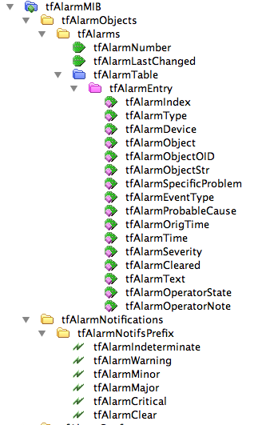

# NSO SNMP Agent

The SNMP agent in NSO is used mainly for monitoring and notifications. It supports SNMPv1, SNMPv2c, and SNMPv3.

The following standard MIBs are supported by the SNMP agent:

* SNMPv2-MIB [RFC 3418](https://www.ietf.org/rfc/rfc3418.txt)
* SNMP-FRAMEWORK-MIB [RFC 3411](https://www.ietf.org/rfc/rfc3411.txt)
* SNMP-USER-BASED-SM-MIB [RFC 3414](https://www.ietf.org/rfc/rfc3414.txt)
* SNMP-VIEW-BASED-ACM-MIB [RFC 3415](https://www.ietf.org/rfc/rfc3415.txt)
* SNMP-COMMUNITY-MIB [RFC 3584](https://www.ietf.org/rfc/rfc3584.txt)
* SNMP-TARGET-MIB and SNMP-NOTIFICATION-MIB [RFC 3413](https://www.ietf.org/rfc/rfc3413.txt)
* SNMP-MPD-MIB [RFC 3412](https://www.ietf.org/rfc/rfc3412.txt)
* TRANSPORT-ADDRESS-MIB [RFC 3419](https://www.ietf.org/rfc/rfc3419.txt)
* SNMP-USM-AES-MIB [RFC 3826](https://www.ietf.org/rfc/rfc3826.txt)
* IPV6-TC [RFC 2465](https://www.ietf.org/rfc/rfc2465.txt)


The usmHMACMD5AuthProtocol authentication protocol and the usmDESPrivProtocol privacy protocol specified in SNMP-USER-BASED-SM-MIB are not supported, since they are not considered secure. The usmHMACSHAAuthProtocol authentication protocol specified in SNMP-USER-BASED-SM-MIB and the usmAesCfb128Protocol privacy protocol specified in SNMP-USM-AES-MIB are supported.


## Configuring the SNMP Agent <a href="#d5e2459" id="d5e2459"></a>

The SNMP agent is configured through any of the normal NSO northbound interfaces. It is possible to control most aspects of the agent through for example the CLI.

The YANG models describing all configuration capabilities of the SNMP agent reside under `$NCS_DIR/src/ncs/snmp/snmp-agent-config/*.yang` in the NSO distribution.

An example session configuring the SNMP agent through the CLI may look like:

```cli
admin@ncs# config
Entering configuration mode terminal
admin@ncs(config)# snmp agent udp-port 3457
admin@ncs(config)# snmp community public name foobaz
admin@ncs(config-community-public)# commit
Commit complete.
admin@ncs(config-community-public)# top
admin@ncs(config)# show full-configuration snmp
snmp agent enabled
snmp agent ip    0.0.0.0
snmp agent udp-port 3457
snmp agent version v1
snmp agent version v2c
snmp agent version v3
snmp agent engine-id enterprise-number 32473
snmp agent engine-id from-text testing
snmp agent max-message-size 50000
snmp system contact ""
snmp system name ""
snmp system location ""
snmp usm local user initial
 auth sha password GoTellMom
 priv aes password GoTellMom
!
snmp target monitor
 ip       127.0.0.1
 udp-port 162
 tag      [ monitor ]
 timeout  1500
 retries  3
 v2c sec-name public
!
snmp community public
 name     foobaz
 sec-name public
!
snmp notify foo
 tag  monitor
 type trap
!
snmp vacm group initial
 member initial
  sec-model [ usm ]
 !
 access usm no-auth-no-priv
  read-view   internet
  notify-view internet
 !
 access usm auth-no-priv
  read-view   internet
  notify-view internet
 !
 access usm auth-priv
  read-view   internet
  notify-view internet
 !
!
snmp vacm group public
 member public
  sec-model [ v1 v2c ]
 !
 access any no-auth-no-priv
  read-view   internet
  notify-view internet
 !
!
snmp vacm view internet
 subtree 1.3.6.1
  included
 !
!
snmp vacm view restricted
 subtree 1.3.6.1.6.3.11.2.1
  included
 !
 subtree 1.3.6.1.6.3.15.1.1
  included
 !
!
```

The SNMP agent configuration data is stored in CDB as any other configuration data, but is handled as a transformation between the data shown above and the data stored in the standard MIBs.

If you want to have a default configuration of the SNMP agent, you must provide that in an XML file. The initialization data of the SNMP agent is stored in an XML file that has precisely the same format as CDB initialization XML files, but it is not loaded by CDB, rather it is loaded at first startup by the SNMP agent. The XML file must be called `snmp_init.xml` and it must reside in the load path of NSO. In the NSO distribution, there is such an initialization file in `$NCS_DIR/etc/ncs/snmp/snmp_init.xml`. It is strongly recommended that this file be customized with another engine ID and other community strings and v3 users.

If no `snmp_init.xml` file is found in the load path a default configuration with the agent disabled is loaded. Thus, the easiest way to start NSO without the SNMP agent is to ensure that the directory `$NCS_DIR/etc/ncs/snmp/` is not part of the NSO load path.

Note, that this only relates to initialization the first time NSO is started. On subsequent starts, all the SNMP agent configuration data is stored in CDB and the `snmp_init.xml` is never used again.

## Alarm MIB <a href="#d5e2482" id="d5e2482"></a>

The NSO SNMP alarm MIB is designed for ease of use in alarm systems. It defines a table of alarms and SNMP alarm notifications corresponding to alarm state changes. Based on the alarm model in NSO (see [NSO Alarms](../../../administration/management/system-management/README.md#nso-alarms)), the notifications as well as the alarm table contain the parameters that are required for alarm standards compliance (X.733 and 3GPP). The MIB files are located in `$NCS_DIR/src/ncs/snmp/mibs`.

* **TAILF-TOP-MIB.mib**\
  **T**he tail-f enterprise OID.
* **TAILF-TC-MIB.mib**\
  Textual conventions for the alarm mib.
* **TAILF-ALARM-MIB.mib**\
  **T**he actual alarm MIB.
* **IANA-ITU-ALARM-TC-MIB.mib**\
  Import of IETF mapping of X.733 parameters.
* **ITU-ALARM-TC-MIB.mib**\
  Import of IETF mapping of X.733 parameters.

<figure><figcaption><p>The NSO Alarm MIB</p></figcaption></figure>

The alarm table has the following columns:

* **tfAlarmIndex**\
  An imaginary index for the alarm row that is persistent between restarts.
* **tfAlarmType**\
  This provides an identification of the alarm type and together with tfAlarmSpecificProblem forms a unique identification of the alarm.
* **tfAlarmDevice**\
  The alarming network device - can be NSO itself.
* **tfAlarmObject**\
  The alarming object within the device.
* **tfAlarmObjectOID**\
  In case the original alarm notification was an SNMP notification this column identifies the alarming SNMP object.
* **tfAlarmObjectStr**\
  Name of alarm object based on any other naming.
* **tfAlarmSpecificProblem**\
  This object is used when the 'tfAlarmType' object cannot uniquely identify the alarm type.
* **tfAlarmEventType**\
  The event type according to X.733 and based on the mapping of the alarm type in the NSO alarm model.
* **tfAlarmProbableCause**\
  The probable cause to X.733 and based on the mapping of the alarm type in the NSO alarm model. Note that you can configure this to match the probable cause values in the receiving alarm system.
* **tfAlarmOrigTime**\
  The time for the first occurrence of this alarm.
* **tfAlarmTime**\
  The time for the last state change of this alarm.
* **tfAlarmSeverity**\
  The latest severity (non-clear) reported for this alarm.
* **tfAlarmCleared**\
  Boolean indicated if the latest state change reports a clear.
* **tfAlarmText**\
  The latest alarm text.
* **tfAlarmOperatorState**\
  The latest operator alarm state such as ack.
* **tfAlarmOperatorNote**\
  The latest operator note.

The MIB defines separate notifications for every severity level to support SNMP managers that only can map severity levels to individual notifications. Every notification contains the parameters of the alarm table.

### SNMP Object Identifiers <a href="#d5e2580" id="d5e2580"></a>


```
 tfAlarmMIB             node         1.3.6.1.4.1.24961.2.103
 tfAlarmObjects         node         1.3.6.1.4.1.24961.2.103.1
 tfAlarms               node         1.3.6.1.4.1.24961.2.103.1.1
 tfAlarmNumber          scalar       1.3.6.1.4.1.24961.2.103.1.1.1
 tfAlarmLastChanged     scalar       1.3.6.1.4.1.24961.2.103.1.1.2
 tfAlarmTable           table        1.3.6.1.4.1.24961.2.103.1.1.5
 tfAlarmEntry           row          1.3.6.1.4.1.24961.2.103.1.1.5.1
 tfAlarmIndex           column       1.3.6.1.4.1.24961.2.103.1.1.5.1.1
 tfAlarmType            column       1.3.6.1.4.1.24961.2.103.1.1.5.1.2
 tfAlarmDevice          column       1.3.6.1.4.1.24961.2.103.1.1.5.1.3
 tfAlarmObject          column       1.3.6.1.4.1.24961.2.103.1.1.5.1.4
 tfAlarmObjectOID       column       1.3.6.1.4.1.24961.2.103.1.1.5.1.5
 tfAlarmObjectStr       column       1.3.6.1.4.1.24961.2.103.1.1.5.1.6
 tfAlarmSpecificProblem column       1.3.6.1.4.1.24961.2.103.1.1.5.1.7
 tfAlarmEventType       column       1.3.6.1.4.1.24961.2.103.1.1.5.1.8
 tfAlarmProbableCause   column       1.3.6.1.4.1.24961.2.103.1.1.5.1.9
 tfAlarmOrigTime        column       1.3.6.1.4.1.24961.2.103.1.1.5.1.10
 tfAlarmTime            column       1.3.6.1.4.1.24961.2.103.1.1.5.1.11
 tfAlarmSeverity        column       1.3.6.1.4.1.24961.2.103.1.1.5.1.12
 tfAlarmCleared         column       1.3.6.1.4.1.24961.2.103.1.1.5.1.13
 tfAlarmText            column       1.3.6.1.4.1.24961.2.103.1.1.5.1.14
 tfAlarmOperatorState   column       1.3.6.1.4.1.24961.2.103.1.1.5.1.15
 tfAlarmOperatorNote    column       1.3.6.1.4.1.24961.2.103.1.1.5.1.16
 tfAlarmNotifications   node         1.3.6.1.4.1.24961.2.103.2
 tfAlarmNotifsPrefix    node         1.3.6.1.4.1.24961.2.103.2.0
 tfAlarmNotifsObjects   node         1.3.6.1.4.1.24961.2.103.2.1
 tfAlarmStateChangeText scalar       1.3.6.1.4.1.24961.2.103.2.1.1
 tfAlarmIndeterminate   notification 1.3.6.1.4.1.24961.2.103.2.0.1
 tfAlarmWarning         notification 1.3.6.1.4.1.24961.2.103.2.0.2
 tfAlarmMinor           notification 1.3.6.1.4.1.24961.2.103.2.0.3
 tfAlarmMajor           notification 1.3.6.1.4.1.24961.2.103.2.0.4
 tfAlarmCritical        notification 1.3.6.1.4.1.24961.2.103.2.0.5
 tfAlarmClear           notification 1.3.6.1.4.1.24961.2.103.2.0.6
 tfAlarmConformance     node         1.3.6.1.4.1.24961.2.103.10
 tfAlarmCompliances     node         1.3.6.1.4.1.24961.2.103.10.1
 tfAlarmCompliance      compliance   1.3.6.1.4.1.24961.2.103.10.1.1
 tfAlarmGroups          node         1.3.6.1.4.1.24961.2.103.10.2
 tfAlarmNotifs          group        1.3.6.1.4.1.24961.2.103.10.2.1
 tfAlarmObjs            group        1.3.6.1.4.1.24961.2.103.10.2.2
```


### Using the SNMP Alarm MIB

Alarm Managers should subscribe to the notifications and read the alarm table to synchronize the alarm list. To do this you need an access view that matches the alarm MIB and creates a SNMP target. Default SNMP settings in NSO let you read the alarm MIB with v2c and community public. A target is set up in the following way, (assuming the SNMP Alarm Manager has IP address 192.168.1.1 and wants community string public in the v2c notifications):


```bash
$ ncs_cli -u admin -C
admin@ncs# config
Entering configuration mode terminal
admin@ncs(config)# snmp notify monitor type trap tag monitor
admin@ncs(config-notify-monitor)# snmp target alarm-system ip 192.168.1.1 udp-port 162 \
        tag monitor v2c sec-name public
admin@ncs(config-target-alarm-system)# commit
Commit complete.
admin@ncs(config-target-alarm-system)# show full-configuration snmp target
snmp target alarm-system
 ip       192.168.1.1
 udp-port 162
 tag      [ monitor ]
 timeout  1500
 retries  3
 v2c sec-name public
!
snmp target monitor
 ip       127.0.0.1
 udp-port 162
 tag      [ monitor ]
 timeout  1500
 retries  3
 v2c sec-name public
!
admin@ncs(config-target-alarm-system)#
```

