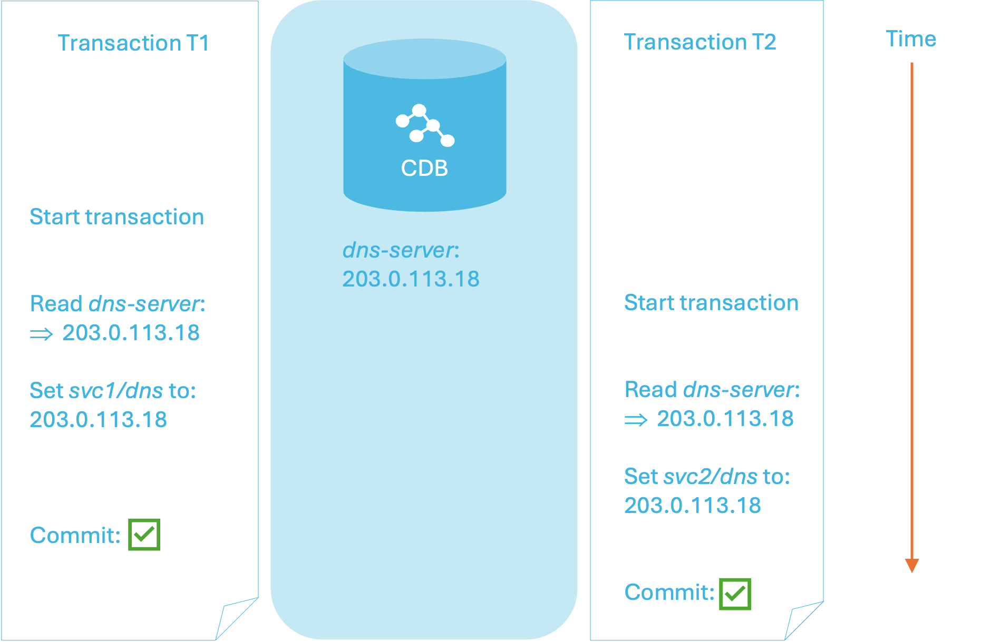
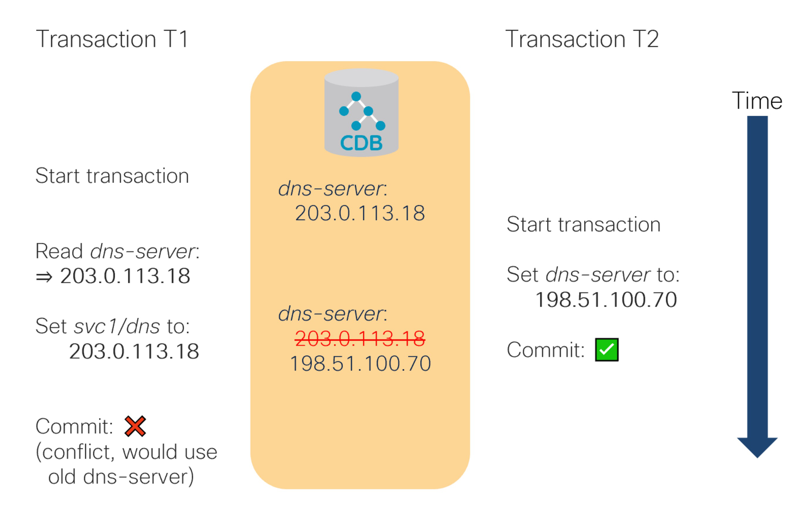
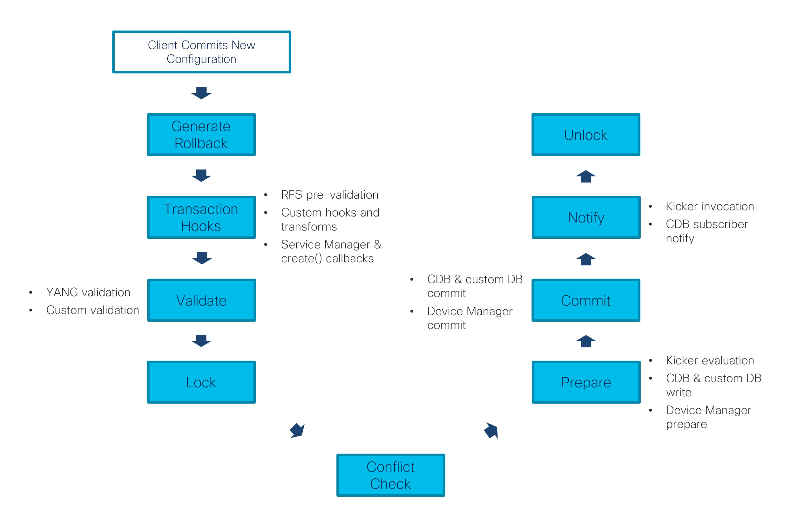

# NSO Concurrency Model

From version 6.0, NSO uses the so-called 'optimistic concurrency', which greatly improves parallelism. With this approach, NSO avoids the need for serialization and a global lock to run user code which would otherwise limit the number of requests the system can process in a given time unit.

Using this concurrency model, your code, such as a service mapping or custom validation code, can run in parallel, either with another instance of the same service or an entirely different service (or any other provisioning code, for that matter). As a result, the system can take better advantage of available resources, especially the additional CPU cores, making it a lot more performant.

## Optimistic Concurrency <a href="#d5e8425" id="d5e8425"></a>

Transactional systems, such as NSO, must process each request in a way that preserves what are known as the ACID properties, such as atomicity and isolation of requests. A traditional approach to ensure this behavior is by using locking to apply requests or transactions one by one. The main downside is that requests are processed sequentially and may not be able to fully utilize the available resources.

Optimistic concurrency, on the other hand, allows transactions to run in parallel. It works on the premise that data conflicts are rare, so most of the time the transactions can be applied concurrently and will retain the required properties. NSO ensures this by checking that there are no conflicts with other transactions just before each transaction is committed. In particular, NSO will verify that all the data accessed as part of the transaction is still valid when applying changes. Otherwise, the system will reject the transaction.

Such a model makes sense because a lot of the time concurrent transactions deal with separate sets of data. Even if multiple transactions share some data in a read-only fashion, it is fine as they still produce the same result.

<figure><figcaption><p>Nonconflicting Concurrent Transactions</p></figcaption></figure>

In the figure, `svc1` in the `T1` transaction and `svc2` in the `T2` transaction both read (but do not change) the same, shared piece of data and can proceed as usual, unperturbed.

On the other hand, a conflict is when a piece of data, that has been read by one transaction, is changed by another transaction before the first transaction is committed. In this case, at the moment the first transaction completes, it is already working with stale data and must be rejected, as the following figure shows.

<figure><figcaption><p>Conflicting Concurrent Transactions</p></figcaption></figure>

In the figure, the transaction `T1` reads `dns-server` to use in the provisioning of `svc1` but transaction `T2` changes `dns-server` value in the meantime. The two transactions conflict and `T1` is rejected because `T2` completed first.

To be precise, for a transaction to experience a conflict, both of the following has to be true:

1. It reads some data that is changed after being read and before the transaction is completed.
2. It commits a set of changes in NSO.

This means a set of read-only transactions or transactions, where nothing is changed, will never conflict. It is also possible that multiple write-only transactions won't conflict even when they update the same data nodes.

Allowing multiple concurrent transactions to write (and only write, not read) to the same data without conflict may seem odd at first. But from a transaction's standpoint, it does not depend on the current value because it was never read. Suppose the value changed the previous day, the transaction would do the exact same thing and you wouldn't consider it a conflict. So, the last write wins, regardless of the time elapsed between the two transactions.


It is extremely important that you do not mix multiple transactions, because it will prevent NSO from detecting conflicts properly. For example, starting multiple separate transactions and using one to write data, based on what was read from a different one, can result in subtle bugs that are hard to troubleshoot.


While the optimistic concurrency model allows transactions to run concurrently most of the time, ultimately some synchronization (a global lock) is still required to perform the conflict checks and serialize data writes to the CDB and devices. The following figure shows everything that happens after a client tries to apply a configuration change, including acquiring and releasing the lock. This process takes place, for example, when you enter the **commit** command on the NSO CLI or when a PUT request of the RESTCONF API is processed.

<figure><figcaption><p>Stages of a Transaction Commit</p></figcaption></figure>

As the figure shows (and you can also observe it in the progress trace output), service mapping, validation, and transforms all happen in the transaction before taking a (global) transaction lock.

At the same time, NSO tracks all of the data reads and writes from the start of the transaction, right until the lock and conflict check. This includes service mapping callbacks and XML templates, as well as transform and custom validation hooks if you are using any. It even includes reads done as part of the YANG validation and rollback creation that NSO performs automatically.

If reads do not overlap with writes from other transactions, the conflict check passes. The change is written to the CDB and disseminated to the affected network devices, through the _prepare_ and _commit_ phases. Kickers and subscribers are called and, finally, the global lock can be released.

On the other hand, if there is overlap and the system detects a conflict, the transaction obviously cannot proceed. To recover if this happens, the transaction should be retried. Sometimes the system can do it automatically and sometimes the client itself must be prepared to retry it.


An ingenious developer might consider avoiding the need for retries by using explicit locking, in the way the NETCONF `lock` command does. However, be aware that such an approach is likely to significantly degrade the throughput of the whole system and is discouraged. If explicit locking is required, it should be considered with caution and sufficient testing.


In general, what affects the chance of conflict is the actual data that is read and written by each transaction. So, if there is more data, the surface for potential conflict is bigger. But you can minimize this chance by accounting for it in the application design.

## Identifying Conflicts <a href="#d5e8475" id="d5e8475"></a>

When a transaction conflict occurs, NSO logs an entry in the developer log, often found at `logs/devel.log` or a similar path. Suppose you have the following code in Python:

```python
with ncs.maapi.single_write_trans('admin', 'system') as t:
    root = ncs.maagic.get_root(t)
    # Read a value that can change during this transaction
    dns_server = root.mysvc_dns
    # Now perform complex work... or time.sleep(10) for testing
    # Finally, write the result
    root.some_data = 'the result'
    t.apply()
```

If the `/mysvc-dns` leaf changes while the code is executing, the `t.apply()` line fails and the developer log contains an entry similar to the following example:

```
<INFO> 23-Aug-2022::03:31:17.029 linux-nso ncs[<0.18350.3>]: ncs writeset collector:
   check conflict tid=3347 min=234 seq=237 wait=0ms against=[3346] elapsed=1ms
   -> conflict on: /mysvc-dns read: <<"10.1.2.2">> (op: get_delem tid: 3347)
   write: <<"10.1.1.138">> (op: write tid: 3346 user: admin) phase(s): work
   write tids: 3346
```

Here, the transaction with id 3347 reads a value of `/mysvc-dns` as “10.1.2.2” but that value was changed by the transaction with id 3346 to “10.1.1.138” by the time the first transaction called `t.apply()`. The entry also contains some additional data, such as the user that initiated the other transaction and the low-level operations that resulted in the conflict.

At the same time, the Python code raises an `ncs.error.Error` exception, with `confd_errno` set to the value of `ncs.ERR_TRANSACTION_CONFLICT` and error text, such as the following:

```
Conflict detected (70): Transaction 3347 conflicts with transaction 3346 started by
   user admin: /mysvc:mysvc-dns read-op get_delem write-op write in work phase(s)
```

In Java code, a matching `com.tailf.conf.ConfException` is thrown, with `errorCode` set to the `com.tailf.conf.ErrorCode.ERR_TRANSACTION_CONFLICT` value.

A thing to keep in mind when examining conflicts is that the transaction that performed the read operations is the one that gets the error and causes the log entry, while the other transaction, performing the write operations to the same path, is already completed successfully.

The error includes a reference to the `work` phase. The phase tells which part of the transaction encountered a conflict. The `work` phase signifies changes in an open transaction before it is applied. In practice, this is a direct read in the code that started the transaction before calling the `apply()` or `applyTrans()` function: the example reads the value of the leaf into `dns_server`.

On the other hand, if two transactions configure two service instances and the conflict arises in the mapping code, then the phase shows `transform` instead. It is also possible for a conflict to occur in more than one place, such as the phase `transform,work` denoting a conflict in both, the service mapping code as well as the initial transaction.

The complete list of conflict sources, that is, the possible values for the phase, is as follows:

* `work`: read in an open transaction before it is applied
* `rollback`: read during rollback file creation
* `pre-transform`: read while validating service input parameters according to the service YANG model
* `transform`: read during service (FASTMAP) or another transform invocation
* `validation`: read while validating the final configuration (YANG validation)

For example, `pre-transform` indicates that the service YANG model validation is the source of the conflict. This can help tremendously when you try to narrow down the conflicting code in complex scenarios. In addition, the phase information is useful when you troubleshoot automatic transaction retries in case of conflict: when the phase includes `work`, automatic retry is not possible.

## Automatic Retries <a href="#d5e8528" id="d5e8528"></a>

In some situations, NSO can retry a transaction that first failed to apply due to a conflict. A prerequisite is that NSO knows which code caused the conflict and that it can run that code again.

Changes done in the work phase are changes made directly by an external agent, such as a Python script connecting to the NSO or a remote NETCONF client. Since NSO is not in control of and is not aware of the logic in the external agent, it can only reject the conflicting transaction.

However, for the phases that follow the work phase, all the logic is implemented in NSO and NSO can run it on demand. For example, NSO is in charge of calling the service mapping code and the code can be run as many times as needed (a requirement for service re-deploy and similar). So, in case of a conflict, NSO can rerun all of the necessary logic to provision or de-provision a service.

NSO keeps checkpoints for each transaction, to restart it from the conflicting phase and save itself from redoing the work from the preceding phases if possible. NSO automatically checks if the transaction checkpoint read- or write-set grows too large. This allows for larger transactions to go through without memory exhaustion. When all checkpoints are skipped, no transaction retries are possible, and the transaction fails. When later-stage checkpoints are skipped, the transaction retry will take more time.

The read-set and write-set size limits that NSO uses for transaction checkpoints are configurable in `ncs.conf` under:

* /ncs-config/checkpoint/max-read-set-size
* /ncs-config/checkpoint/max-write-set-size
* /ncs-config/checkpoint/total-size-limit

See [ncs.conf(5) ](../../resources/man/#section-5-file-formats-and-syntax)for details.

A transaction checkpoint reaching a size limit will result in a log entry:

```
not creating rollback checkpoint, write-set size limit exceeded
```

If checkpoints are skipped, we might miss retry points/attempts if the transaction fails due to conflicts.

Moreover, in case of conflicts during service mapping, NSO optimizes the process even further. It tracks the conflicting services to not schedule them concurrently in the future. This automatic retry behavior is enabled by default.

For services, retries can be configured further or even disabled under `/services/global-settings`. You can also find the service conflicts NSO knows about by running the `show services scheduling conflict` command. For example:

```
admin@ncs# unhide debug
admin@ncs# show services scheduling conflict | notab
services scheduling conflict mysvc-servicepoint mysvc-servicepoint
 type           dynamic
 first-seen     2022-08-27T17:15:10+00:00
 inactive-after 2022-08-27T17:15:09+00:00
 expires-after  2022-08-27T18:05:09+00:00
 ttl-multiplier 1
admin@ncs#
```

Since a given service may not always conflict and can evolve over time, NSO reverts to default scheduling after expiry time, unless new conflicts occur.

Sometimes, you know in advance that a service will conflict, either with itself or another service. You can encode this information in the service YANG model using the `conflicts-with` parameter under the `servicepoint` definition:

```yang
list mysvc {
  uses ncs:service-data;
  ncs:servicepoint mysvc-servicepoint {
    ncs:conflicts-with "mysvc-servicepoint";
    ncs:conflicts-with "some-other-servicepoint";
  }
  // ...
}
```

The parameter ensures that NSO will never schedule and execute this service concurrently with another service using the specified `servicepoint`. It adds a non-expiring `static` scheduling conflict entry. This way, you can avoid the unnecessary occasional retry when the dynamic scheduling conflict entry expires.

Declaring a conflict with itself is especially useful when you have older, non-thread-safe service code that cannot be easily updated to avoid threading issues.

For the NSO CLI and JSON-RPC (WebUI) interfaces, a commit of a transaction that results in a conflict will trigger an automatic rebase and retry when the resulting configuration is the same despite the conflict. If the rebase does not resolve the conflict, the transaction will fail. The conflict can, in some CLI cases, be resolved manually. A successful automatic rebase and a retry will generate something like the following pseudo-log entries in the developer log (trace log level):

```
<INFO> … check for read-write conflicts: conflict found
<INFO> … rebase transaction
…
<INFO> … rebase transaction: ok
<INFO> … retrying transaction after rebase
```

## Handling Conflicts <a href="#ncs.development.concurrency.handling" id="ncs.development.concurrency.handling"></a>

When a transaction fails to apply due to a read-write conflict in the work phase, NSO rejects the transaction and returns a corresponding error. In such a case, you must start a new transaction and redo all the changes.

Why is this necessary? Suppose you have code, let's say as part of a CDB subscriber or a standalone program, similar to the following Python snippet:

```python
with ncs.maapi.single_write_trans('admin', 'system') as t:
    if t.get_elem('/mysvc-use-dhcp') == True:
        # do something
    else:
        # do something entirely different that breaks
        # your network if mysvc-use-dhcp happens to be true
    t.apply()
```

If `mysvc-use-dhcp` has one value when your code starts provisioning but is changed mid-process, your code needs to restart from the beginning or you can end up with a broken system. To guard against such a scenario, NSO needs to be conservative and return an error.

Since there is a chance of a transaction failing to apply due to a conflict, robust code should implement a retry scheme. You can implement the retry algorithm yourself, or you can use one of the provided helpers.

In Python, `Maapi` class has a `run_with_retry()` method, which creates a new transaction and calls a user-supplied function to perform the work. On conflict, `run_with_retry()` will recreate the transaction and call the user function again. For details, please see the relevant API documentation.

The same functionality is available in Java as well, as the `Maapi.ncsRunWithRetry()` method. Where it differs from the Python implementation is that it expects the function to be implemented inside a `MaapiRetryableOp` object.

As an alternative option, available only in Python, you can use the `retry_on_conflict()` function decorator.

Example code for each of these approaches is shown next. In addition, the [examples.ncs/scaling-performance/conflict-retry](https://github.com/NSO-developer/nso-examples/tree/6.5/scaling-performance/conflict-retry) example showcases this functionality as part of a concrete service.

## Example Retrying Code in Python <a href="#d5e8569" id="d5e8569"></a>

Suppose you have some code in Python, such as the following:

```python
with ncs.maapi.single_write_trans('admin', 'python') as t:
    root = ncs.maagic.get_root(t)
    # First read some data, then write some too.
    # Finally, call apply.
    t.apply()
```

Since the code performs reads and writes of data in NSO through a newly established transaction, there is a chance of encountering a conflict with another, concurrent transaction.

On the other hand, if this was a service mapping code, you wouldn't be creating a new transaction yourself because the system would already provide one for you. You wouldn't have to worry about the retry because, again, the system would handle it for you through the automatic mechanism described earlier.

Yet, you may find such code in CDB subscribers, standalone scripts, or action implementations. As a best practice, the code should handle conflicts.

If you have an existing `ncs.maapi.Maapi` object already available, the simplest option might be to refactor the actual logic into a separate function and call it through `run_with_retry()`. For the current example, this might look like the following:

```python
def do_provisioning(t):
    """Function containing the actual logic"""
    root = ncs.maagic.get_root(t)
    # First read some data, then write some too.
    # ...
    # Finally, return True to signal apply() has to be called.
    return True

# Need to replace single_write_trans() with a Maapi object
with ncs.maapi.Maapi() as m:
    with ncs.maapi.Session(m, 'admin', 'python'):
        m.run_with_retry(do_provisioning)
```

If the new function is not entirely independent and needs additional values passed as parameters, you can wrap it inside an anonymous (lambda) function:

```
m.run_with_retry(lambda t: do_provisioning(t, one_param, another_param))
```

An alternative implementation with a decorator is also possible and might be easier to implement if the code relies on the `single_write_trans()` or similar function. Here, the code does not change unless it has to be refactored into a separate function. The function is then adorned with the `@ncs.maapi.retry_on_conflict()` decorator. For example:

```python
from ncs.maapi import retry_on_conflict

@retry_on_conflict()
def do_provisioning():
    # This is the same code as before but in a function
    with ncs.maapi.single_write_trans('admin', 'python') as t:
        root = ncs.maagic.get_root(t)
        # First read some data, then write some too.
        # ...
        # Finally, call apply().
        t.apply()

do_provisioning()
```

The major benefit of this approach is when the code is already in a function and only a decorator needs to be added. It can also be used with methods of the `Action` class and alike.

```python
class MyAction(ncs.dp.Action):
    @ncs.dp.Action.action
    @retry_on_conflict()
    def cb_action(self, uinfo, name, kp, input, output, trans):
        with ncs.maapi.single_write_trans('admin', 'python') as t:
            ...
```

For actions in particular, please note that the order of decorators is important and the decorator is only useful when you start your own write transaction in the wrapped function. This is what `single_write_trans()` does in the preceding example because the old transaction cannot be used any longer in case of conflict.

## Example Retrying Code in Java <a href="#d5e8591" id="d5e8591"></a>

Suppose you have some code in Java, such as the following:

```java
public class MyProgram {
    public static void main(String[] arg) throws Exception {
        Socket socket = new Socket("127.0.0.1", Conf.NCS_PORT);
        Maapi maapi = new Maapi(socket);
        maapi.startUserSession("admin", "system");
        NavuContext context = new NavuContext(maapi);
        int tid = context.startRunningTrans(Conf.MODE_READ_WRITE);

        // Your code here that reads and writes data.

        // Finally, call apply.
        context.applyClearTrans();
        maapi.endUserSession();
        socket.close();
    }
}
```

To read and write some data in NSO, the code starts a new transaction with the help of `NavuContext.startRunningTrans()` but could have called `Maapi.startTrans()` directly as well. Regardless of the way such a transaction is started, there is a chance of encountering a read-write conflict. To handle those cases, the code can be rewritten to use `Maapi.ncsRunWithRetry()`.

The `ncsRunWithRetry()` call creates and manages a new transaction, then delegates work to an object implementing the `com.tailf.maapi.MaapiRetryableOp` interface. So, you need to move the code that does the work into a new class, let's say `MyProvisioningOp`:

```java
public class MyProvisioningOp implements MaapiRetryableOp {
    public boolean execute(Maapi maapi, int tid)
        throws IOException, ConfException, MaapiException
    {
        // Create context for the provided, managed transaction;
        // note the extra parameter compared to before and no calling
        // context.startRunningTrans() anymore.
        NavuContext context = new NavuContext(maapi, tid);

        // Your code here that reads and writes data.

        // Finally, return true to signal apply() has to be called.
        return true;
    }
}
```

This class does not start its own transaction any more but uses the transaction handle `tid`, provided by the `ncsRunWithRetry()` wrapper.

You can create the `MyProvisioningOp` as an inner or nested class if you wish so but note that, depending on your code, you may need to designate it as a `static class` to use it directly as shown here.

If the code requires some extra parameters when called, you can also define additional properties on the new class and use them for this purpose. With the new class ready, you instantiate and call into it with the `ncsRunWithRetry()` function. For example:

```java
public class MyProgram {
    public static void main(String[] arg) throws Exception {
        Socket socket = new Socket("127.0.0.1", Conf.NCS_PORT);
        Maapi maapi = new Maapi(socket);
        maapi.startUserSession("admin", "system");
        // Deletegate work to MyProvisioningOp, with retry.
        maapi.ncsRunWithRetry(new MyProvisioningOp());
        // No more calling applyClearTrans() or friends,
        // ncsRunWithRetry() does that for you.
        maapi.endUserSession();
        socket.close();
    }
}
```

And what if your use case requires you to customize how the transaction is started or applied? `ncsRunWithRetry()` can take additional parameters that allow you to control those aspects. Please see the relevant API documentation for the full reference.

## Designing for Concurrency <a href="#ncs.development.concurrency.designing" id="ncs.development.concurrency.designing"></a>

In general, transaction conflicts in NSO cannot be avoided altogether, so your code should handle them gracefully with retries. Retries are required to ensure correctness but do take up additional time and resources. Since a high percentage of retries will notably decrease the throughput of the system, you should endeavor to construct your data models and logic in a way that minimizes the chance of conflicts.

A conflict arises when one transaction changes a value that one or more other ongoing transactions rely on. From this, you can make a couple of observations that should help guide your implementation.

First, if the shared data changes infrequently, it will rarely cause a conflict (regardless of the number of reads) because it only affects the transactions happening at the time it is changed. Conversely, a frequent change can clash with other transactions much more often and warrants spending some effort to analyze and possibly make conflict-free.

Next, if a transaction runs a long time, a greater number of other write transactions can potentially run in the meantime, increasing the chances of a conflict. For this reason, you should avoid long-running read-write transactions.

Likewise, the more data nodes and the different parts of the data tree the transaction touches, the more likely it is to run into a conflict. Limiting the scope and the amount of the changes to shared data is an important design aspect.

Also, when considering possible conflicts, you must account for all the changes in the transaction. This includes changes propagated to other parts of the data model through dependencies. For example, consider the following YANG snippet. Changing a single `provision-dns` leaf also changes every `mysvc` list item because of the `when` statement.

```yang
leaf provision-dns {
  type boolean;
}
list mysvc {
  container dns {
    when "../../provision-dns";
    // ...
  }
}
```

Ultimately, what matters is the read-write overlap with other transactions. Thus, you should avoid needless reads in your code: if there are no reads of the changed values, there can't be any conflicts.

### Avoiding Needless Reads

A technique used in some existing projects, in service mapping code and elsewhere, is to first prepare all the provisioning parameters by reading a number of things from the CDB. But some of these parameters, or even most, may not really be needed for that particular invocation.

Consider the following service mapping code:

```python
def cb_create(self, tctx, root, service, proplist):
    device = root.devices.device[service.device]

    # Search device interfaces and CDB for mgmt IP
    device_ip = find_device_ip(device)

    # Find the best server to use for this device
    ntp_servers = root.my_settings.ntp_servers
    use_ntp_server = find_closest_server(device_ip, ntp_servers)

    if service.do_ntp:
        device.ntp.servers.append(use_ntp_server)
```

Here, a service performs NTP configuration when enabled through the `do_ntp` switch. But even if the switch is off, there are still a lot of reads performed. If one of the values changes during provisioning, such as the list of the available NTP servers in `ntp_servers`, it will cause a conflict and a retry.

An improved version of the code only calculates the NTP server value if it is actually needed:

```python
def cb_create(self, tctx, root, service, proplist):
    device = root.devices.device[service.device]

    if service.do_ntp:
        # Search device interfaces and CDB for mgmt IP
        device_ip = find_device_ip(device)

        # Find the best server to use for this device
        ntp_servers = root.my_settings.ntp_servers
        use_ntp_server = find_closest_server(device_ip, ntp_servers)

        device.ntp.servers.append(use_ntp_server)
```

### Handling Dependent Services <a href="#d5e8638" id="d5e8638"></a>

Another thing to consider in addition to the individual service implementation is the placement and interaction of the service within the system. What happens if one service is used to generate input for another service? If the two services run concurrently, writes of the first service will invalidate reads of the other one, pretty much guaranteeing a conflict. Then it is wasteful to run both services concurrently and they should really run serially.

A way to achieve this is through a design pattern called stacked services. You create a third service that instantiates the first service (generating the input data) before the second one (dependent on the generated data).

### Searching and Enumerating Lists <a href="#d5e8642" id="d5e8642"></a>

When there is a need to search or filter a list for specific items, you will often find for-loops or similar constructs in the code. For example, to configure NTP, you might have the following:

```
for ntp_server in root.my_settings.ntp_servers:
    # Only select active servers
    if ntp_server.is_active:
        # Do something
```

This approach is especially prevalent in ordered-by-user lists since the order of the items and their processing is important.

The interesting bit is that such code reads every item in the list. If the list is changed while the transaction is ongoing, you get a conflict with the message identifying the `get_next` operation (which is used for list traversal). This is not very surprising: if another active item is added or removed, it changes the result of your algorithm. So, this behavior is expected and desirable to ensure correctness.

However, you can observe the same conflict behavior in less obvious scenarios. If the list model contains a `unique` YANG statement, NSO performs the same kind of enumeration of list items for you to verify the unique constraint. Likewise, a `must` or `when` statement can also trigger the evaluation of every item during validation, depending on the XPath expression.

NSO knows how to discern between access to specific list items based on the key value, where it tracks reads only to those particular items, and enumerating the list, where no key value is supplied and a list with all elements is treated as a single item. This works for your code as well as for the XPath expressions (in YANG and otherwise). As you can imagine, adding or removing items in the first case doesn't cause conflicts, while in the second one, it does.

In the end, it depends on the situation whether list enumeration can affect throughput or not. In the example, the NTP servers could be configured manually, by the operator, so they would rarely change, making it a non-issue. But your use case might differ.

### Python Assigning to Self

As several service invocations may run in parallel, Python self-assignment in service handling code can cause difficult-to-debug issues. Therefore, NSO checks for such patterns and issues an alarm (default) or a log entry containing a warning and a keypath to the service instance that caused the warning. See [NSO Python VM](nso-virtual-machines/nso-python-vm.md) for details.

### **Controlling `no-overwrite` Behavior in Concurrent Environments**

The `no-overwrite` commit parameter mechanism prevents NSO from applying configuration changes that conflict with the device's current state. Since NSO 6.4, the `no-overwrite` mechanism has been enhanced to include configurable compare scopes using a new `compare` parameter. This enables fine-grained control over how NSO validates device state consistency before applying changes.

You can choose from the following three `compare` scopes:

<table><thead><tr><th valign="top">Scope</th><th valign="top">Description</th><th valign="top">Use Case and Considerations</th></tr></thead><tbody><tr><td valign="top"><code>write-set-only</code></td><td valign="top">Only modified data is checked (pre-6-4 behavior).</td><td valign="top"><p>Minimizes the amount of data fetched from the device, thus, reducing overhead.</p><p>Suitable for scenarios where performance is critical, and the device is trusted to validate its own configuration constraints.<br><br>Use this scope for devices with simple YANG models or when minimal validation is sufficient.</p></td></tr><tr><td valign="top"><code>write-and-full-read-set</code></td><td valign="top">Both modified and read data are checked (introduced in NSO 6.4).</td><td valign="top"><p>Provides the highest level of consistency by ensuring that all dependent data matches NSO’s CDB. Recommended for critical devices or complex configurations where data integrity is paramount.</p><p>Can be resource-intensive, especially for devices with third-party YANG models containing extensive dependencies (<code>when</code>, <code>must</code>, or <code>leafref</code> expressions).<br><br>Use this scope for devices requiring strict configuration alignment with NSO’s CDB.</p></td></tr><tr><td valign="top"><code>write-and-service-read-set</code></td><td valign="top">Checks only modified data and reads during the transform phase (new default introduced in 6.4).</td><td valign="top"><p>Offers improved performance over <code>write-and-full-read-set</code> by limiting the scope to service-related reads, while still ensuring consistency for service-driven configurations.</p><p>Avoids performance penalties from validation-phase reads in complex device models.<br><br>Balances performance and accuracy for devices with complex YANG models, such as those used in 3PY NEDs, where validation-phase reads can significantly increase the read-set size.<br><br>Use this scope for multi-vendor environments with third-party devices where services drive configuration changes.</p></td></tr></tbody></table>

These compare scopes are critical when designing for concurrency, as they determine the risk of conflicting changes and impact service transaction performance.
