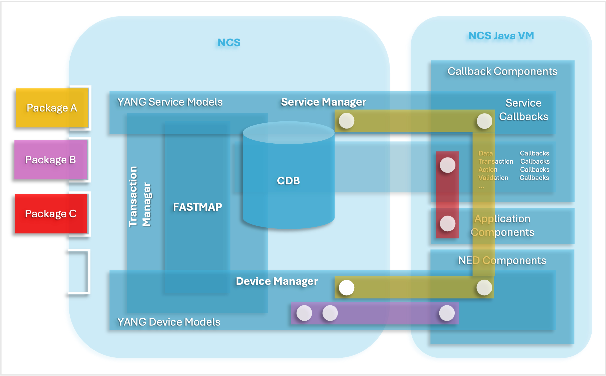
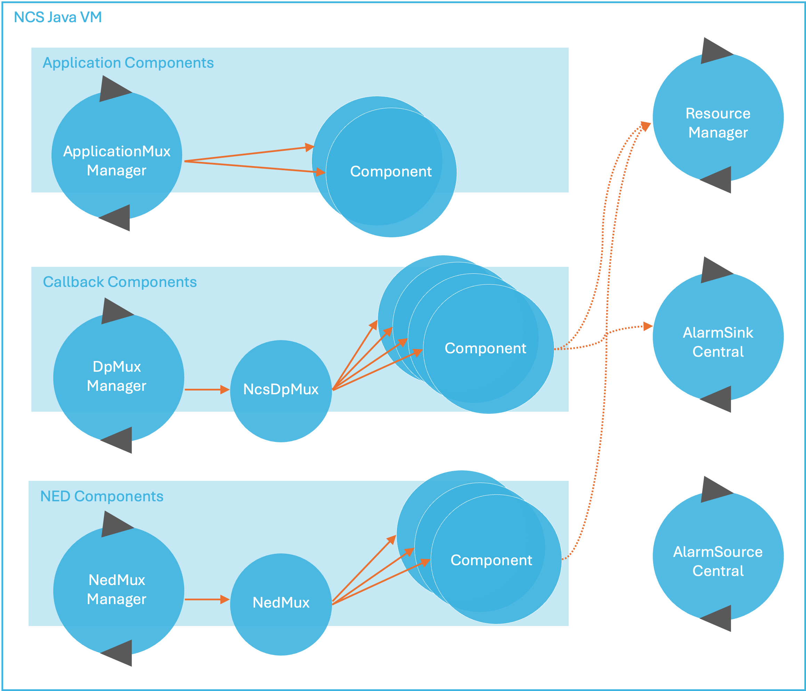

# NSO Java VM

The NSO Java VM is the execution container for all Java classes supplied by deployed NSO packages.

The classes, and other resources, are structured in `jar` files and the specific use of these classes is described in the `component` tag in the respective `package-meta-data.xml` file. Also as a framework, it starts and controls other utilities for the use of these components. To accomplish this, a main class `com.tailf.ncs.NcsMain`, implementing the `Runnable` interface is started as a thread. This thread can be the main thread (running in a java `main()`) or be embedded into another Java program.

When the `NcsMain` thread starts it establishes a socket connection towards NSO. This is called the NSO Java VM control socket. It is the responsibility of `NcsMain` to respond to command requests from NSO and pass these commands as events to the underlying finite state machine (FSM). The `NcsMain` FSM will execute all actions as requested by NSO. This includes class loading and instantiation as well as registration and start of services, NEDs, etc.

<figure><figcaption><p>NSO Service Manager</p></figcaption></figure>

When NSO detects the control socket connection from the NSO Java VM, it starts an initialization process:

1. First, NSO sends a `INIT_JVM` request to the NSO Java VM. At this point, the NSO Java VM will load schemas i.e. retrieve all known YANG module definitions. The NSO Java VM responds when all modules are loaded.
2. Then, NSO sends a `LOAD_SHARED_JARS` request for each deployed NSO package. This request contains the URLs for the jars situated in the `shared-jar` directory in the respective NSO package. The classes and resources in these jars will be globally accessible for all deployed NSO packages.
3. The next step is to send a `LOAD_PACKAGE` request for each deployed NSO package. This request contains the URLs for the jars situated in the `private-jar` directory in the respective NSO package. These classes and resources will be private to the respective NSO package. In addition, classes that are referenced in a `component` tag in the respective NSO package `package-meta-data.xml` file will be instantiated.
4. NSO will send a `INSTANTIATE_COMPONENT` request for each component in each deployed NSO package. At this point, the NSO Java VM will register a start method for the respective component. NSO will send these requests in a proper start phase order. This implies that the `INSTANTIATE_COMPONENT` requests can be sent in an order that mixes components from different NSO packages.
5. Lastly, NSO sends a `DONE_LOADING` request which indicates that the initialization process is finished. After this, the NSO Java VM is up and running.

See [Debugging Startup](nso-java-vm.md#ug.javavm.debug) for tips on customizing startup behavior and debugging problems when the Java VM fails to start

## YANG Model <a href="#d5e1181" id="d5e1181"></a>

The file `tailf-ncs-java-vm.yang` defines the `java-vm` container which, along with `ncs.conf`, is the entry point for controlling the NSO Java VM functionality. Study the content of the YANG model in the example below (The Java VM YANG model). For a full explanation of all the configuration data, look at the YANG file and man `ncs.conf`.

Many of the nodes beneath `java-vm` are by default invisible due to a hidden attribute. To make everything under `java-vm` visible in the CLI, two steps are required:

1.  First, the following XML snippet must be added to `ncs.conf`:\\

    ```xml
    <hide-group>
        <name>debug</name>
    </hide-group>
    ```
2.  Next, the `unhide` command may be used in the CLI session:

    ```cli
    admin@ncs(config)# unhide debug
    admin@ncs(config)#
    ```


```cli
        > yanger -f tree tailf-ncs-java-vm.yang
          submodule: tailf-ncs-java-vm (belongs-to tailf-ncs)
  +--rw java-vm
     +--rw stdout-capture
     |  +--rw enabled?   boolean
     |  +--rw file?      string
     |  +--rw stdout?    empty
     +--rw connect-time?                     uint32
     +--rw initialization-time?              uint32
     +--rw synchronization-timeout-action?   enumeration
     +--rw exception-error-message
     |  +--rw verbosity?   error-verbosity-type
     +--rw java-logging
     |  +--rw logger* [logger-name]
     |     +--rw logger-name    string
     |     +--rw level          log-level-type
     +--rw jmx!
     |  +--rw jndi-address?   inet:ip-address
     |  +--rw jndi-port?      inet:port-number
     |  +--rw jmx-address?    inet:ip-address
     |  +--rw jmx-port?       inet:port-number
     +--ro start-status?                     enumeration
     +--ro status?                           enumeration
     +---x stop
     |  +--ro output
     |     +--ro result?   string
     +---x start
     |  +--ro output
     |     +--ro result?   string
     +---x restart
        +--ro output
           +--ro result?   string
```


## Java Packages and the Class Loader

Each NSO package will have a specific java classloader instance that loads its private jar classes. These package classloaders will refer to a single shared classloader instance as its parent. The shared classloader will load all shared jar classes for all deployed NSO packages.


The `jar`'s in the `shared-jar` and `private-jar` directories should NOT be part of the Java classpath.


The purpose of this is first to keep integrity between packages which should not have access to each other's classes, other than the ones that are contained in the shared jars. Secondly, this way it is possible to hot redeploy the private jars and classes of a specific package while keeping other packages in a run state.

Should this class loading scheme not be desired, it is possible to suppress it by starting the NSO Java VM with the system property `TAILF_CLASSLOADER` set to false.

```
java -DTAILF_CLASSLOADER=false ...
```

This will force NSO Java VM to use the standard Java system classloader. For this to work, all `jar`'s from all deployed NSO packages need to be part of the classpath. The drawback of this is that all classes will be globally accessible and hot redeploy will have no effect.

There are four types of components that the NSO Java VM can handle:

* The `ned` type. The NSO Java VM will handle NEDs of sub-type `cli` and `generic` which are the ones that have a Java implementation.
* The `callback` type. These are any forms of callbacks that are defined by the DP API.
* The `application` type. These are user-defined daemons that implement a specific `ApplicationComponent` Java interface.
* The `upgrade` type. This component type is activated when deploying a new version of a NSO package and the NSO automatic CDB data upgrade is not sufficient. See [Writing an Upgrade Package Component](../using-cdb.md#ncs.cdb.upgrade.comp) for more information.

In some situations, several NSO packages are expected to use the same code base, e.g. when third-party libraries are used or the code is structured with some common parts. Instead of duplicate jars in several NSO packages, it is possible to create a new NSO package, add these jars to the `shared-jar` directory, and let the `package-meta-data.xml` file contains no component definitions at all. The NSO Java VM will load these shared jars and these will be accessible from all other NSO packages.

Inside the NSO Java VM, each component type has a specific Component Manager. The responsibility of these Managers is to manage a set of component classes for each NSO package. The Component Manager acts as an FSM that controls when a component should be registered, started, stopped, etc.

<figure><figcaption><p>Component Managers</p></figcaption></figure>

For instance, the `DpMuxManager` controls all callback implementations (services, actions, data providers, etc). It can load, register, start, and stop such callback implementations.

## The NED Component Type <a href="#d5e1240" id="d5e1240"></a>

NEDs can be of type `netconf`, `snmp`, `cli`_,_ or `generic`. Only the `cli` and `generic` types are relevant for the NSO Java VM because these are the ones that have a Java implementation. Normally these NED components come in self-contained and prefabricated NSO packages for some equipment or class of equipment. It is however possible to tailor make NEDs for any protocol. For more information on this see [Network Element Drivers (NEDs)](../../advanced-development/developing-neds/) and [Writing a data model for a CLI NED](../../advanced-development/developing-neds/#writing-a-data-model-for-a-cli-ned) in NED Development

### The Callback Component Type <a href="#d5e1251" id="d5e1251"></a>

Callbacks are the collective name for a number of different functions that can be implemented in Java. One of the most important is the service callbacks, but also actions, transaction control, and data provision callbacks are in common use in an NSO implementation. For more on how to program callback using the DP API, see [DP API](../api-overview/java-api-overview.md#ug.java\_api\_overview.dp).

### The Application Component Type <a href="#d5e1255" id="d5e1255"></a>

For programs that are none of the above types but still need to access NSO as a daemon process, it is possible to use the `ApplicationComponent` Java interface. The `ApplicationComponent` interface expects the implementing classes to implement a `init()`, `finish()` and a `run()` method.

The NSO Java VM will start each class in a separate thread. The `init()` is called before the thread is started. The `run()` runs in a thread similar to the `run()` method in the standard Java `Runnable` interface. The `finish()` method is called when the NSO Java VM wants the application thread to stop. It is the responsibility of the programmer to stop the application thread i.e., stop the execution in the `run()` method when `finish()` is called. Note, that making the thread stop when `finish()` is called is important so that the NSO Java VM will not be hanging at a `STOP_VM` request.


```java
package com.tailf.ncs;

/**
 * User defined Applications should implement this interface that
 * extends Runnable, hence also the run() method has to be implemented.
 * These applications are registered as components of type
 * "application" in a Ncs packages.
 *
 * Ncs Java VM will start this application in a separate thread.
 * The init() method is called before the thread is started.
 * The finish() method is expected to stop the thread. Hence stopping
 * the thread is user responsibility
 *
 */
public interface ApplicationComponent extends Runnable {

    /**
     * This method is called by the Ncs Java vm before the
     * thread is started.
     */
    public void init();

    /**
     * This method is called by the Ncs Java vm when the thread
     * should be stopped. Stopping the thread is the responsibility of
     * this method.
     */
    public void finish();

}
```


An example of an application component implementation is found in [SNMP Notification Receiver](../../connected-topics/snmp-notification-receiver.md).

## The Resource Manager <a href="#ncs.ug.javavm.resman" id="ncs.ug.javavm.resman"></a>

User Implementations typically need resources like Maapi, Maapi Transaction, Cdb, Cdb Session, etc. to fulfill their tasks. These resources can be instantiated and used directly in the user code. This implies that the user code needs to handle connection and close of additional sockets used by these resources. There is however another recommended alternative, and that is to use the Resource manager. The Resource manager is capable of injecting these resources into the user code. The principle is that the programmer will annotate the field that should refer to the resource rather than instantiate it.


```java
@Resource(type=ResourceType.MAAPI, scope=Scope.INSTANCE)
public Maapi m;
```


This way the NSO Java VM and the Resource manager can keep control over used resources and also can intervene e.g. close sockets at forced shutdowns.

The Resource manager can handle two types of resources: `MAAPI` and `CDB`.


```java
package com.tailf.ncs.annotations;

/**
 * ResourceType set by the Ncs ResourceManager
 */
public enum ResourceType {

    MAAPI(1),
    CDB(2);
}
```


For both the Maapi and Cdb resource types a socket connection is opened towards NSO by the Resource manager. At a stop, the Resource manager will disconnect these sockets before ending the program. User programs can also tell the resource manager when its resources are no longer needed with a call to `ResourceManager.unregisterResources()`.

The resource annotation has three attributes:

* `type` defines the resource type.
* `scope` defines if this resource should be unique for each instance of the Java class (`Scope.INSTANCE`) or shared between different instances and classes (`Scope.CONTEXT`). For CONTEXT scope the sharing is confined to the defining NSO package, i.e., a resource cannot be shared between NSO packages.
* `qualifier` is an optional string to identify the resource as a unique resource. All instances that share the same context-scoped resource need to have the same qualifier. If the qualifier is not given it defaults to the value `DEFAULT` i.e., shared between all instances that have the `DEFAULT` qualifier.


```java
package com.tailf.ncs.annotations;

/**
 * Annotation class for Action Callbacks Attributes are callPoint and callType
 */
@Retention(RetentionPolicy.RUNTIME)
@Target(ElementType.FIELD)
public @interface Resource {

    public ResourceType type();

    public Scope scope();

    public String qualifier() default "DEFAULT";

}
```



```java
package com.tailf.ncs.annotations;

/**
 * Scope for resources managed by the Resource Manager
 */
public enum Scope {

    /**
     * Context scope implies that the resource is
     * shared for all fields having the same qualifier in any class.
     * The resource is shared also between components in the package.
     * However sharing scope is confined to the package i.e sharing cannot
     * be extended between packages.
     * If the qualifier is not given it becomes "DEFAULT"
     */
    CONTEXT(1),
    /**
     * Instance scope implies that all instances will
     * get new resource instances. If the instance needs
     * several resources of the same type they need to have
     * separate qualifiers.
     */
    INSTANCE(2);
}
```


When the NSO Java VM starts it will receive component classes to load from NSO. Note, that the component classes are the classes that are referred to in the `package-meta-data.xml` file. For each component class, the Resource Manager will scan for annotations and inject resources as specified.

However, the package jars can contain lots of classes in addition to the component classes. These will be loaded at runtime and will be unknown by the NSO Java VM and therefore not handled automatically by the Resource Manager. These classes can also use resource injection but need a specific call to the Resource Manager for the mechanism to take effect. Before the resources are used for the first time the resource should be used, a call of `ResourceManager.registerResources(...)` will force the injection of the resources. If the same class is registered several times the Resource manager will detect this and avoid multiple resource injections.


```
MyClass myclass = new MyClass();
try {
    ResourceManager.registerResources(myclass);
} catch (Exception e) {
    LOGGER.error("Error injecting Resources", e);
}
```


## The Alarm Centrals

The `AlarmSourceCentral` and `AlarmSinkCentral`, which is part of the NSO Alarm API, can be used to simplify reading and writing alarms. The NSO Java VM will start these centrals at initialization. User implementations can therefore expect this to be set up without having to handle the start and stop of either the `AlarmSinkCentral` or the `AlarmSourceCentral`. For more information on the alarm API, see [Alarm Manager](../../../operation-and-usage/operations/alarm-manager.md).

## Embedding the NSO Java VM <a href="#d5e1325" id="d5e1325"></a>

As stated above the NSO Java VM is executed in a thread implemented by the `NcsMain`. This implies that somewhere a java `main()` must be implemented that launches this thread. For NSO this is provided by the `NcsJVMLauncher` class. In addition to this, there is a script named `ncs-start-java-vm` that starts Java with the `NcsJVMLauncher.main()`. This is the recommended way of launching the NSO Java VM and how it is set up in a default installation. If there is a need to run the NSO Java VM as an embedded thread inside another program. This can be done simply by instantiating the class `NcsMain` and starting this instance in a new thread.


```
NcsMain ncsMain   = NcsMain.getInstance(host);
Thread  ncsThread = new Thread(ncsMain);

ncsThread.start();
```


However, with the embedding of the NSO Java VM comes the responsibility to manage the life cycle of the NSO Java VM thread. This thread cannot be started before NSO has started and is running or else the NSO Java VM control socket connection will fail. Also, running NSO without the NSO Java VM being launched will render runtime errors as soon as NSO needs NSO Java VM functionality.

To be able to control an embedded NSO Java VM from another supervising Java thread or program an optional JMX interface is provided. The main functionality in this interface is listing, starting, and stopping the NSO Java VM and its Component Managers.

## Logging

NSO has extensive logging functionality. Log settings are typically very different for a production system compared to a development system. Furthermore, the logging of the NSO daemon and the NSO Java VM is controlled by different mechanisms. During development, we typically want to turn on the `developer-log`. The sample `ncs.conf` that comes with the NSO release has log settings suitable for development, while the `ncs.conf` created by a System Install are suitable for production deployment.

The NSO Java VM uses Log4j for logging and will read its default log settings from a provided `log4j2.xml` file in the `ncs.jar`. Following that, NSO itself has `java-vm` log settings that are directly controllable from the NSO CLI. We can do:

```cli
admin@ncs(config)# java-vm java-logging logger com.tailf.maapi level level-trace
admin@ncs(config-logger-com.tailf.maapi)# commit
Commit complete.
```

This will dynamically reconfigure the log level for package `com.tailf.maapi` to be at the level `trace`. Where the Java logs end up is controlled by the `log4j2.xml` file. By default, the NSO Java VM writes to stdout. If the NSO Java VM is started by NSO, as controlled by the `ncs.conf` parameter `/java-vm/auto-start`, NSO will pick up the stdout of the service manager and write it to:

```cli
admin@ncs(config)# show full-configuration java-vm stdout-capture
java-vm stdout-capture file /var/log/ncs/ncs-java-vm.log
```

(The `details` pipe command also displays default values)

## The NSO Java VM Timeouts <a href="#d5e1406" id="d5e1406"></a>

The section `/ncs-config/japi` in `ncs.conf` contains a number of very important timeouts. See `$NCS_DIR/src/ncs/ncs_config/tailf-ncs-config.yang` and [ncs.conf(5)](https://developer.cisco.com/docs/nso-guides-6.3/#!ncs-man-pages-volume-5/man.5.ncs.conf) in Manual Pages for details.

* `new-session-timeout` controls how long NSO will wait for the NSO Java VM to respond to a new session.
* `query-timeout` controls how long NSO will wait for the NSO Java VM to respond to a request to get data.
* `connect-timeout` controls how long NSO will wait for the NSO Java VM to initialize a DP connection after the initial socket connect.

Whenever any of these timeouts trigger, NSO will close the sockets from NSO to the NSO Java VM. The NSO Java VM will detect the socket close and exit. If NSO is configured to start (and restart) the NSO Java VM, the NSO Java VM will be automatically restarted. If the NSO Java VM is started by some external entity, if it runs within an application server, it is up to that entity to restart the NSO Java VM.

## Debugging Startup <a href="#ug.javavm.debug" id="ug.javavm.debug"></a>

When using the `auto-start` feature (the default), NSO will start the NSO Java VM (as outlined in the start of this section), there are a number of different settings in the `java-vm` YANG model (see `$NCS_DIR/src/ncs/yang/tailf-ncs-java-vm.yang`) that controls what happens when something goes wrong during the startup.

The two timeout configurations `connect-time` and `initialization-time` are most relevant during startup. If the Java VM fails during the initial stages (during `INIT_JVM`, `LOAD_SHARED_JARS`, or `LOAD_PACKAGE`) either because of a timeout or because of a crash, NSO will log `The NCS Java VM synchronization failed` in `ncs.log`.


The synchronization error message in the log will also have a hint as to what happened:

* `closed` usually means that the Java VM crashed (and closed the socket connected to NSO)
* `timeout` means that it failed to start (or respond) within the time limit. For example, if the Java VM runs out of memory and crashes, this will be logged as `closed`.


After logging, NSO will take action based on the `synchronization-timeout-action` setting:

* `log`: NSO will log the failure, and if `auto-restart` is set to true NSO will try to restart the Java VM
* `log-stop` (default): NSO will log the failure, and if the Java VM has not stopped already NSO will also try to stop it. No restart action is taken.
* `exit`: NSO will log the failure, and then stop NSO itself.

If you have problems with the Java VM crashing during startup, a common pitfall is running out of memory (either total memory on the machine, or heap in the JVM). If you have a lot of Java code (or a loaded system) perhaps the Java VM did not start in time. Try to determine the root cause, check ncs.log and `ncs-java-vm.log`, and if needed increase the timeout.

For complex problems, for example with the class loader, try logging the internals of the startup:

```cli
admin@ncs(config)# java-vm java-logging logger com.tailf.ncs level level-all
admin@ncs(config-logger-com.tailf.maapi)# commit
Commit complete.
```

Setting this will result in a lot more detailed information in `ncs-java-vm.log` during startup.

When the `auto-restart` setting is `true` (the default), it means that NSO will try to restart the Java VM when it fails (at any point in time, not just during startup). NSO will at most try three restarts within 30 seconds, i.e., if the Java VM crashes more than three times within 30 seconds NSO gives up. You can check the status of the Java VM using the `java-vm` YANG model. For example in the CLI:

```cli
admin@ncs# show java-vm
java-vm start-status started
java-vm status running
```

The `start-status` can have the following values:

* `auto-start-not-enabled`: Autostart is not enabled.
* `stopped`: The Java VM has been stopped or is not yet started.
* `started`: The Java VM has been started. See the leaf 'status' to check the status of the Java application code.
* `failed`: The Java VM has been terminated. If `auto-restart` is enabled, the Java VM restart has been disabled due to too frequent restarts.

The `status` can have the following values:

* `not-connected`: The Java application code is not connected to NSO.
* `initializing`: The Java application code is connected to NSO, but not yet initialized.
* `running`: The Java application code is connected and initialized.
* `timeout`: The Java application connected to NSO, but failed to initialize within the stipulated timeout 'initialization-time'.
