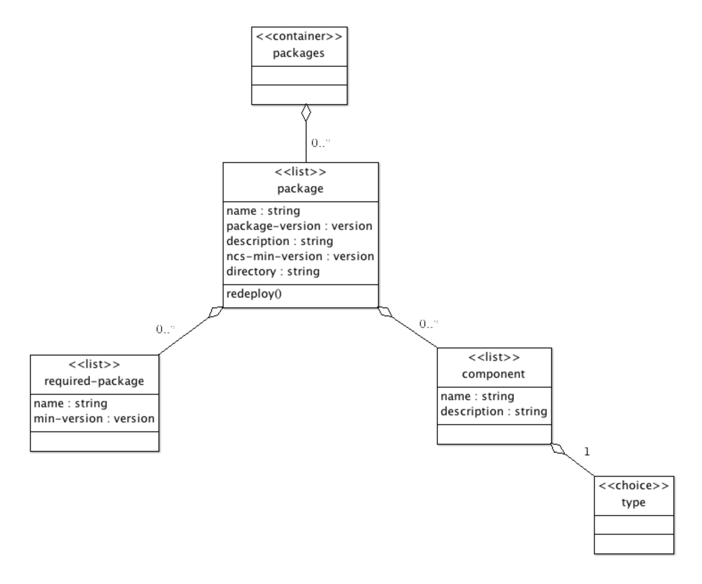

# Packages

All user code that needs to run in NSO must be part of a package. A package is basically a directory of files with a fixed file structure. A package consists of code, YANG modules, custom Web UI widgets, etc., that are needed to add an application or function to NSO. Packages are a controlled way to manage the loading and versions of custom applications.

A package is a directory where the package name is the same as the directory name. At the top level of this directory, a file called `package-meta-data.xml` must exist. The structure of that file is defined by the YANG model `$NCS_DIR/src/ncs/yang/tailf-ncs-packages.yang`. A package may also be a tar archive with the same directory layout. The tar archive can be either uncompressed with the suffix `.tar`, or gzip-compressed with the suffix `.tar.gz` or `.tgz`. The archive file should also follow some naming conventions. There are two acceptable naming conventions for archive files, one is that after the introduction of CDM in the NSO 5.1, it can be named by `ncs-<ncs-version>-<package-name>-<package-version>.<suffix>`, e.g. `ncs-5.3-my-package-1.0.tar.gz` and the other is `<package-name>-<package-version>.<suffix>`, e.g. `my-package-1.0.tar.gz`.

* `package-name`: should use letters, and digits and may include underscores (`_`) or dashes (`-`), but no additional punctuation, and digits can not follow underscores or dashes immediately.
* `package-version`: should use numbers and dot (`.`).

<figure><figcaption><p>Package Model</p></figcaption></figure>

Packages are composed of components. The following types of components are defined: NED, Application, and Callback.

The file layout of a package is:

```xml
           <package-name>/package-meta-data.xml
                    load-dir/
                    shared-jar/
                    private-jar/
                    webui/
                    templates/
                    src/
                    doc/
                    netsim/
```

The `package-meta-data.xml` defines several important aspects of the package, such as the name, dependencies on other packages, the package's components, etc. This will be thoroughly described later in this section.

When NSO starts, it needs to search for packages to load. The `ncs.conf` parameter `/ncs-config/load-path` defines a list of directories. At initial startup, NSO searches these directories for packages and copies the packages to a private directory tree in the directory defined by the `/ncs-config/state-dir` parameter in `ncs.conf`, and loads and starts all the packages found. All .fxs (compiled YANG files) and .ccl (compiled CLI spec files) files found in the directory `load-dir` in a package are loaded. On subsequent startups, NSO will by default only load and start the copied packages - see [Loading Packages](../advanced-development/developing-packages.md#loading-packages) for different ways to get NSO to search the load path for changed or added packages.

A package usually contains Java code. This Java code is loaded by a class loader in the NSO Java VM. A package that contains Java code must compile the Java code so that the compilation results are divided into .jar files where code, that is supposed to be shared among multiple packages, is compiled into one set of .jar files, and code that is private to the package itself is compiled into another set of .jar files. The shared and the common jar files shall go into the `shared-jar` directory and the `private-jar` directory, respectively. By putting for example the code for a specific service in a private jar, NSO can dynamically upgrade the service without affecting any other service.

The optional `webui` directory contains the WEB UI customization files.

## An Example Package <a href="#d5e4949" id="d5e4949"></a>

The NSO example collection for contains a number of small self-contained examples. The collection resides at `$NCS_DIR/examples.ncs` Each of these examples defines a package. Let's take a look at some of these packages. The example [examples.ncs/device-management/aggregated-stats](https://github.com/NSO-developer/nso-examples/tree/6.4/device-management/aggregated-stats) has a package `./packages/stats`. The `package-meta-data.xml` file for that package looks like this:


```xml
<ncs-package xmlns="http://tail-f.com/ns/ncs-packages">
  <name>stats</name>
  <package-version>1.0</package-version>
  <description>Aggregating statistics from the network</description>
  <ncs-min-version>3.0</ncs-min-version>
  <required-package>
    <name>router-nc-1.0</name>
  </required-package>
  <component>
    <name>stats</name>
    <callback>
      <java-class-name>com.example.stats.Stats</java-class-name>
    </callback>
  </component>
</ncs-package>
```


The file structure in the package looks like this:

```
|----package-meta-data.xml
|----private-jar
|----shared-jar
|----src
|    |----Makefile
|    |----yang
|    |    |----aggregate.yang
|    |----java
|         |----build.xml
|         |----src
|              |----com
|                   |----example
|                        |----stats
|                             |----namespaces
|                             |----Stats.java
|----doc
|----load-dir
```

## The `package-meta-data.xml` File <a href="#d5e4962" id="d5e4962"></a>

The `package-meta-data.xml` file defines the name of the package, additional settings, and one component. Its settings are defined by the `$NCS_DIR/src/ncs/yang/tailf-ncs-packages.yang` YANG model, where the _package_ list name gets renamed to `ncs-package`. See the `tailf-ncs-packages.yang` module where all options are described in more detail. To get an overview, use the IETF RFC 8340-based YANG tree diagram.

```bash
$ yanger -f tree tailf-ncs-packages.yang
```

```
submodule: tailf-ncs-packages (belongs-to tailf-ncs)
  +--ro packages
     +--ro package* [name] <-- renamed to "ncs-package" in package-meta-data.xml
        +--ro name                      string
        +--ro package-version           version
        +--ro display-name?             string
        +--ro description?              string
        +--ro ncs-min-version*          version
        +--ro ncs-max-version*          version
        +--ro single-sign-on-url?       string
        +--ro python-package!
        |  +--ro vm-name?           string
        |  +--ro callpoint-model?   enumeration
        +--ro directory?                string
        +--ro templates*                string
        +--ro template-loading-mode?    enumeration
        +--ro supported-ned-id*         union
        +--ro supported-ned-id-match*   string
        +--ro required-package* [name]
        |  +--ro name           string
        |  +--ro min-version?   version
        |  +--ro max-version?   version
        +--ro component* [name]
           +--ro name                 string
           +--ro description?         string
           +--ro entitlement-tag?     string
           +--ro (type)
              +--:(ned)
              |  +--ro ned
              |     +--ro (ned-type)
              |     |  +--:(netconf)
              |     |  |  +--ro netconf
              |     |  |     +--ro ned-id?   identityref
              |     |  +--:(snmp)
              |     |  |  +--ro snmp
              |     |  |     +--ro ned-id?   identityref
              |     |  +--:(cli)
              |     |  |  +--ro cli
              |     |  |     +--ro ned-id             identityref
              |     |  |     +--ro java-class-name    string
              |     |  +--:(generic)
              |     |     +--ro generic
              |     |        +--ro ned-id                 identityref
              |     |        +--ro java-class-name        string
              |     |        +--ro management-protocol?   string
              |     +--ro device
              |     |  +--ro vendor              string
              |     |  +--ro product-family*     string
              |     |  +--ro operating-system*   string
              |     +--ro option* [name]
              |        +--ro name     string
              |        +--ro value?   string
              +--:(upgrade)
              |  +--ro upgrade
              |     +--ro (type)
              |        +--:(java)
              |        |  +--ro java-class-name?     string
              |        +--:(python)
              |           +--ro python-class-name?   string
              +--:(callback)
              |  +--ro callback
              |     +--ro java-class-name*   string
              +--:(application)
                 +--ro application
                    +--ro (type)
                    |  +--:(java)
                    |  |  +--ro java-class-name      string
                    |  +--:(python)
                    |     +--ro python-class-name    string
                    +--ro start-phase?               enumeration
```


The order of the XML entries in a `package-meta-data.xml` must be in the same order as the model shown above.


A sample package configuration is taken from the [examples.ncs/nano-services/netsim-vrouter](https://github.com/NSO-developer/nso-examples/tree/6.4/nano-services/netsim-vrouter) example:

```bash
$ ncs_load -o -Fp -p /packages
```

```xml
<config xmlns="http://tail-f.com/ns/config/1.0">
  <packages xmlns="http://tail-f.com/ns/ncs">
    <package>
      <name>router-nc-1.1</name>
      <package-version>1.1</package-version>
      <description>Generated netconf package</description>
      <ncs-min-version>5.7</ncs-min-version>
      <directory>./state/packages-in-use/1/router</directory>
      <component>
        <name>router</name>
        <ned>
          <netconf>
            <ned-id xmlns:router-nc-1.1="http://tail-f.com/ns/ned-id/router-nc-1.1">
            router-nc-1.1:router-nc-1.1</ned-id>
          </netconf>
          <device>
            <vendor>Acme</vendor>
          </device>
        </ned>
      </component>
      <oper-status>
        <up/>
      </oper-status>
    </package>
    <package>
      <name>vrouter</name>
      <package-version>1.0</package-version>
      <description>Nano services netsim virtual router example</description>
      <ncs-min-version>5.7</ncs-min-version>
      <python-package>
        <vm-name>vrouter</vm-name>
        <callpoint-model>threading</callpoint-model>
      </python-package>
      <directory>./state/packages-in-use/1/vrouter</directory>
      <templates>vrouter-configured</templates>
      <template-loading-mode>strict</template-loading-mode>
      <supported-ned-id xmlns:router-nc-1.1="http://tail-f.com/ns/ned-id/router-nc-1.1">
      router-nc-1.1:router-nc-1.1</supported-ned-id>
      <required-package>
        <name>router-nc-1.1</name>
        <min-version>1.1</min-version>
      </required-package>
      <component>
        <name>nano-app</name>
        <description>Nano service callback and post-actions example</description>
        <application>
          <python-class-name>vrouter.nano_app.NanoApp</python-class-name>
          <start-phase>phase2</start-phase>
        </application>
      </component>
      <oper-status>
        <up/>
      </oper-status>
    </package>
  </packages>
</config>
```

Below is a brief list of the configurables in the `tailf-ncs-packages.yang` YANG model that applies to the metadata file. A more detailed description can be found in the YANG model:

* `name` - the name of the package. All packages in the system must have unique names.
* `package-version` - the version of the package. This is for administrative purposes only, NSO cannot simultaneously handle two versions of the same package.
* `ncs-min-version` - the oldest known NSO version where the package works.
* `ncs-max-version` - the latest known NSO version where the package works.
* `python-package` - Python-specific package data.
  * `vm-name` - the Python VM name for the package. Default is the package `vm-name`. Packages with the same `vm-name` run in the same Python VM. Applicable only when `callpoint-model = threading`.
  * `callpoint-model` - A Python package runs Services, Nano Services, and Actions in the same OS process. If the `callpoint-model` is set to `multiprocessing` each will get a separate worker process. Running Services, Nano Services, and Actions in parallel can, depending on the application, improve the performance at the cost of complexity. See [The Application Component](nso-virtual-machines/nso-python-vm.md#ncs.development.pythonvm.cthread) for details.
* `directory` - the path to the directory of the package.
* `templates` - the templates defined by the package.
* `template-loading-mode` - control if the templates are interpreted in strict or relaxed mode.
*   `supported-ned-id` - the list of ned-ids supported by this package. An example of the expected format taken from the [examples.ncs/nano-services/netsim-vrouter](https://github.com/NSO-developer/nso-examples/tree/6.4/nano-services/netsim-vrouter) example:

    ```xml
    <supported-ned-id xmlns:router-nc-1.1="http://tail-f.com/ns/ned-id/router-nc-1.1">
    router-nc-1.1:router-nc-1.1</supported-ned-id>
    ```
*   `supported-ned-id-match` - the list of regular expressions for ned-ids supported by this package. Ned-ids in the system that matches at least one of the regular expressions in this list are added to the `supported-ned-id` list. The following example demonstrates how all minor versions with a major number of 1 of the `router-nc` NED can be added to a package's list of supported ned-ids:

    ```xml
    <supported-ned-id-match>router-nc-1.\d+:router-nc-1.\d+</supported-ned-id-match>
    ```
* `required-package` - a list of names of other packages that are required for this package to work.
* `component` - Each package defines zero or more components.

## Components <a href="#d5e5042" id="d5e5042"></a>

Each component in a package has a name. The names of all the components must be unique within the package. The YANG model for packages contains:

```
....
list component {
  key name;
  leaf name {
    type string;
  }
  ...
  choice type {
    mandatory true;
    case ned {
      ...
    }
    case callback {
      ...
    }
    case application {
      ...
    }
    case upgrade {
      ...
    }
    ....
  }
  ....
```

Lots of additional information can be found in the YANG module itself. The mandatory choice that defines a component must be one of `ned`, `callback`, `application`, or `upgrade`.

### Component Types

#### **NED**

A Network Element Driver component is used southbound of NSO to communicate with managed devices (described in [Network Element Drivers (NEDs](../advanced-development/developing-neds/)). The easiest NED to understand is the NETCONF NED which is built into NSO.

There are four different types of NEDs:

* **NETCONF**: used for NETCONF-enabled devices such as Juniper routers, ConfD-powered devices, or any device that speaks proper NETCONF and also has YANG models. Plenty of packages in the NSO example collection have NETCONF NED components, for example, [examples.ncs/device-management/router-network](https://github.com/NSO-developer/nso-examples/tree/6.4/device-management/router-network) under `packages/router`.
*   **SNMP**: Used for SNMP devices.

    The example [examples.ncs/device-management/snmp-ned](https://github.com/NSO-developer/nso-examples/tree/6.4/device-management/snmp-ned) has a package that has an SNMP NED component.
* **CLI**: used for CLI devices. The [examples.ncs/device-management/cli-ned](https://github.com/NSO-developer/nso-examples/tree/6.4/device-management/cli-ned) example has a package called `router-cli-1.0` that defines a NED component of type CLI.
* **Generic**: used for generic NED devices. The example [examples.ncs/device-management/](https://github.com/NSO-developer/nso-examples/tree/6.4/device-management/xmlrpc-device)[generic-ned](https://github.com/NSO-developer/nso-examples/tree/6.4/device-management/generic-ned) has a package called `xml-rpc` which defines a NED component of type generic.

A CLI NED and a generic NED component must also come with additional user-written Java code, whereas a NETCONF NED and an SNMP NED have no Java code.

#### Callback

This defines a component with one or many Java classes that implement callbacks using the Java callback annotations.

If we look at the components in the `stats` package above, we have:

```xml
  <component>
    <name>stats</name>
    <callback>
      <java-class-name>
        com.example.stats.Stats
      </java-class-name>
    </callback>
  </component>
```

The `Stats` class here implements a read-only data provider. See [DP API](api-overview/java-api-overview.md#ug.java_api_overview.dp).

The `callback` type of component is used for a wide range of callback-type Java applications, where one of the most important are the Service Callbacks. The following list of Java callback annotations applies to callback components.

* `ServiceCallback` to implement service-to-device mappings. See the example: [examples.ncs/service-management/rfs-service](https://github.com/NSO-developer/nso-examples/tree/6.4/service-management/rfs-service) See [Developing NSO Services](../advanced-development/developing-services/) for a thorough introduction to services.
* `ActionCallback` to implement user-defined `tailf:actions` or YANG RPC and actions. See the examples: [examples.ncs/sdk-api/actions-python](https://github.com/NSO-developer/nso-examples/tree/6.4/sdk-api/actions-py) and [examples.ncs/sdk-api/actions-java](https://github.com/NSO-developer/nso-examples/tree/6.4/sdk-api/actions-java).
* `DataCallback` to implement the data getters and setters for a data provider. See the example [examples.ncs/device-management/aggregated-stats](https://github.com/NSO-developer/nso-examples/tree/6.4/device-management/aggregated-stats).
* `TransCallback` to implement the transaction portions of a data provider callback. See the example [examples.ncs/device-management/aggregated-stats](https://github.com/NSO-developer/nso-examples/tree/6.4/device-management/aggregated-stats).
* `DBCallback` to implement an external database. See the example: [examples.ncs/sdk-api/external-db](https://github.com/NSO-developer/nso-examples/tree/6.4/sdk-api/external-db).
* `SnmpInformResponseCallback` to implement an SNMP listener - See the example [examples.ncs/device-management/snmp-notification-receiver](https://github.com/NSO-developer/nso-examples/tree/6.4/device-management/snmp-notification-receiver).
* `TransValidateCallback`_,_ `ValidateCallback` to implement a user-defined validation hook that gets invoked on every commit.
* `AuthCallback` to implement a user hook that gets called whenever a user is authenticated by the system.
* `AuthorizationCallback` to implement an authorization hook that allows/disallows users to do operations and/or access data. Note, that this callback should normally be avoided since, by nature, invoking a callback for any operation and/or data element is a performance impairment.

A package that has a `callback` component usually has some YANG code and then also some Java code that relates to that YANG code. By convention, the YANG and the Java code reside in a src directory in the component. When the source of the package is built, any resulting `fxs` files (compiled YANG files) must reside in the `load-dir` of package and any resulting Java compilation results must reside in the `shared-jar` and `private-jar` directories. Study the [examples.ncs/device-management/aggregated-stats](https://github.com/NSO-developer/nso-examples/tree/6.4/device-management/aggregated-stats) example to see how this is achieved.

#### Application

Used to cover Java applications that do not fit into the callback type. Typically this is functionality that should be running in separate threads and work autonomously.

The example [examples.ncs/sdk-api/cdb-java](https://github.com/NSO-developer/nso-examples/tree/6.4/sdk-api/cdb-java) contains three components that are of type `application`. These components must also contain a `java-class-name` element. For application components, that Java class must implement the `ApplicationComponent` Java interface.

#### Upgrade

Used to migrate data for packages where the yang model has changed and the automatic CDB upgrade is not sufficient. The upgrade component consists of a Java class with a main method that is expected to run one time only.

The example [examples.ncs/service-management/upgrade-service](https://github.com/NSO-developer/nso-examples/tree/6.4/service-management/upgrade-service) illustrates user CDB upgrades using `upgrade` components.

## Creating Packages <a href="#ug.packages.creating" id="ug.packages.creating"></a>

NSO ships with a tool `ncs-make-package` that can be used to create packages. [Package Development](../advanced-development/developing-packages.md) discusses in depth how to develop a package.

### Creating a NETCONF NED Package <a href="#d5e5156" id="d5e5156"></a>

This use case applies if we have a set of YANG files that define a managed device. If we wish to develop an EMS solution for an existing device _and_ that device has YANG files and also speaks NETCONF, we need to create a package for that device to be able to manage it. Assuming all YANG files for the device are stored in `./acme-router-yang-files`, we can create a package for the router as:

```bash
  $ ncs-make-package --netconf-ned ./acme-router-yang-files acme
  $ cd acme/src; make
```

The above command will create a package called `acme` in `./acme`. The `acme` package can be used for two things; managing real `acme` routers, and as input to the `ncs-netsim` tool to simulate a network of `acme` routers.

In the first case, managing real acme routers, all we need to do is to put the newly generated package in the load-path of NSO, start NSO with package reload (see [Loading Packages](../advanced-development/developing-packages.md#loading-packages)), and then add one or more acme routers as managed devices to NSO. The `ncs-setup` tool can be used to do this:

```bash
 $ ncs-setup --ned-package ./acme --dest ./ncs-project
```

The above command generates a directory `./ncs-project` which is suitable for running NSO. Assume we have an existing router at the IP address `10.2.3.4` and that we can log into that router over the NETCONF interface using the username `bob`, and password `secret`. The following session shows how to set up NSO to manage this router:

```bash
 $ cd ./ncs-project
 $ ncs
 $ ncs_cli -u admin
 > configure
 > set devices authgroups group southbound-bob umap admin \
        remote-name bob remote-password secret
 > set devices device acme1 authgroup southbound-bob address 10.2.3.4
 > set devices device acme1 device-type netconf
 > commit
```

We can also use the newly generated `acme` package to simulate a network of `acme` routers. During development, this is especially useful. The `ncs-netsim` tool can create a simulated network of `acme` routers as:

```bash
 $ ncs-netsim create-network ./acme 5 a --dir ./netsim
 $ ncs-netsim start
DEVICE a0 OK STARTED
DEVICE a1 OK STARTED
DEVICE a2 OK STARTED
DEVICE a3 OK STARTED
DEVICE a4 OK STARTED
 $
```

Finally, `ncs-setup` can be used to initialize an environment where NSO is used to manage all devices in an `ncs-netsim` network:

```bash
 $ ncs-setup --netsim-dir ./netsim --dest ncs-project
```

### Creating an SNMP NED Package <a href="#d5e5190" id="d5e5190"></a>

Similarly, if we have a device that has a set of MIB files, we can use `ncs-make-package` to generate a package for that device. An SNMP NED package can, similarly to a NETCONF NED package, be used to both manage real devices and also be fed to `ncs-netsim` to generate a simulated network of SNMP devices.

Assuming we have a set of MIB files in `./mibs`, we can generate a package for a device with those mibs as:

```bash
 $ ncs-make-package --snmp-ned ./mibs acme
 $ cd acme/src; make
```

### Creating a CLI NED Package or a Generic NED Package <a href="#d5e5199" id="d5e5199"></a>

For CLI NEDs and Generic NEDs, we cannot (yet) generate the package. Probably the best option for such packages is to start with one of the examples. A good starting point for a CLI NED is the [examples.ncs/device-management/cli-ned](https://github.com/NSO-developer/nso-examples/tree/6.4/device-management/cli-ned) and a good starting point for a Generic NED is the example [examples.ncs/device-management/generic-ned](https://github.com/NSO-developer/nso-examples/tree/6.4/device-management/generic-ned).

### Creating a Service Package or a Data Provider Package <a href="#d5e5204" id="d5e5204"></a>

The `ncs-make-package` can be used to generate empty skeleton packages for a data provider and a simple service. The flags `--service-skeleton` and `--data-provider-skeleton`.

Alternatively, one of the examples can be modified to provide a good starting point. For example [examples.ncs/service-management/rfs-service](https://github.com/NSO-developer/nso-examples/tree/6.4/service-management/rfs-service).
