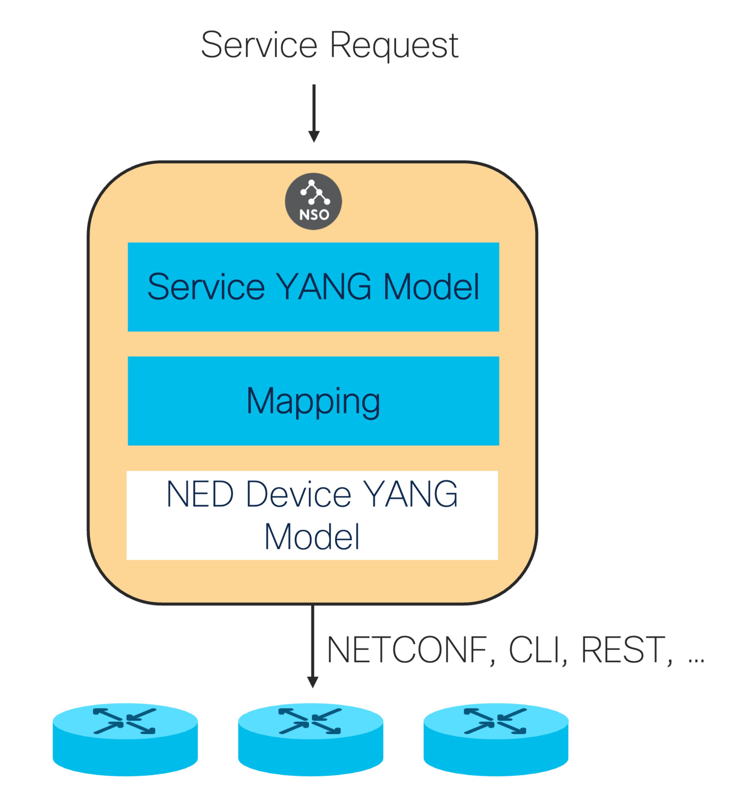

# Services

Services are the cornerstone of network automation with NSO. A service is not just a reusable recipe for provisioning network configurations; it allows you to manage the full configuration life cycle with minimal effort.

This section examines in greater detail how services work, how to design them, and the different ways to implement them.


For a quicker introduction and a simple showcase of services, see [Develop a Simple Service](../introduction-to-automation/develop-a-simple-service.md).


In NSO, the term service has a special meaning and represents an automation construct that orchestrates the 'create', 'modify', and 'delete' of a service instance into the resulting native commands to devices in the network. In its simplest form, a service takes some input parameters and maps them to device-specific configurations. It is a recipe or a set of instructions.

Much like you can bake many cakes using a single cake recipe, you can create many service instances using the same service. But unlike cakes, having the recipe produce exactly the same output, is not very useful. That is why service instances define a set of input parameters, which the service uses to customize the produced configuration.

A network engineer on the CLI, or an API call from a northbound system, provides the values for input parameters when requesting a new service instance, and NSO uses the service recipe, called a 'service mapping', to configure the network.

<figure><figcaption>
A High-level View of Services in NSO
</figcaption></figure>

A similar process takes place when deleting the service instance or modifying the input parameters. The main task of a service is therefore: from a given set of input parameters, calculate the minimal set of device operations to achieve the desired service change. Here, it is very important that the service supports any change; create, delete, and update of any service parameter.

Device configuration is usually the primary goal of a service. However, there may be other supporting functions that are expected from the service, such as service-specific actions. The complete service application, implementing all the service functionality, is packaged in an NSO service package.

The following definitions are used throughout this section:

* **Service type**: Often referred to simply as a service; denotes a specific type of service, such as "L2 VPN", "L3 VPN", "Firewall", or "DNS".
* **Service instance**: A specific instance of a service type, such as "L3 VPN for ACME" or "Firewall for user X".
* **Service model**: The schema definition for a service type, defined in YANG. It specifies the names and format of input parameters for the service.
* **Service mapping**: The instructions that implement a service by mapping the input parameters for a service instance to device configuration.
* **Device configuration**: Network devices are configured to perform network functions. A service instance results in corresponding device configuration changes.
* **Service application**: The code and models implementing the complete service functionality, including service mapping, actions, models for auxiliary data, and so on.

## Service Mapping 

Developing a service that transforms a service instance request to the relevant device configurations is done differently in NSO than in most other tools on the market. As a service developer, you create a mapping from a YANG service model to the corresponding device YANG model.

This is a declarative, model-to-model mapping. Irrespective of the underlying device type and its native device interface, the mapping is towards a YANG device model and not the native CLI (or any other protocol/API). As you write the service mapping, you do not have to worry about the syntax of different CLI commands or in which order these commands are sent to the device. It is all taken care of by the NSO device manager and device NEDs. Implementing a service in NSO is reduced to transforming the input data structure, described in YANG, to device data structures, also described in YANG.

Who writes the models?

* Developing the service model is part of developing the service application and is covered later in this section.
* Every device NED comes with a corresponding device YANG model. This model has been designed by the NED developer to capture the configuration data that is supported by the device.

A service application then has two primary artifacts: a YANG service model and a mapping definition to the device YANG, as illustrated in the following figure.

<figure><figcaption>
Service Model and Mapping
</figcaption></figure>

To reiterate:

* The mapping is not defined using workflows, or sequences of device commands.
* The mapping is not defined in the native device interface language.

This approach may seem somewhat unorthodox at first but allows NSO to streamline and greatly simplify how you implement services.

A common problem for traditional automation systems is that a set of instructions needs to be defined for every possible service instance change. Take, for example, a VPN service. During a service life cycle, you want to:

1. Create the initial VPN.
2. Add a new site or leg to the VPN.
3. Remove a site or leg from the VPN.
4. Modify the parameters of a VPN leg, such as the IP addresses used.
5. Change the interface used for the VPN on a device.
6. ...
7. Delete the VPN.

The possible run-time changes for an existing service instance are numerous. If a developer must define instructions for every possible change, such as a script or a workflow, the task is daunting, error-prone, and never-ending.

NSO reduces this problem to a single data-mapping definition for the "create" scenario. At run-time, NSO renders the minimum resulting change for any possible change in the service instance. It achieves this with the FASTMAP algorithm.

Another challenge in traditional systems is that a lot of code goes into managing error scenarios. The NSO built-in transaction manager takes that burden away from the developer of the service application by providing automatic rollback of incomplete changes.

Another benefit of this approach is that NSO can automatically generate the northbound APIs and database schema from the YANG models, enabling a true DevOps way of working with service models. A new service model can be defined as part of a package and loaded into NSO. An existing service model can be modified, and the package upgraded, and all northbound APIs and user interfaces are automatically regenerated to reflect the new or updated models.
