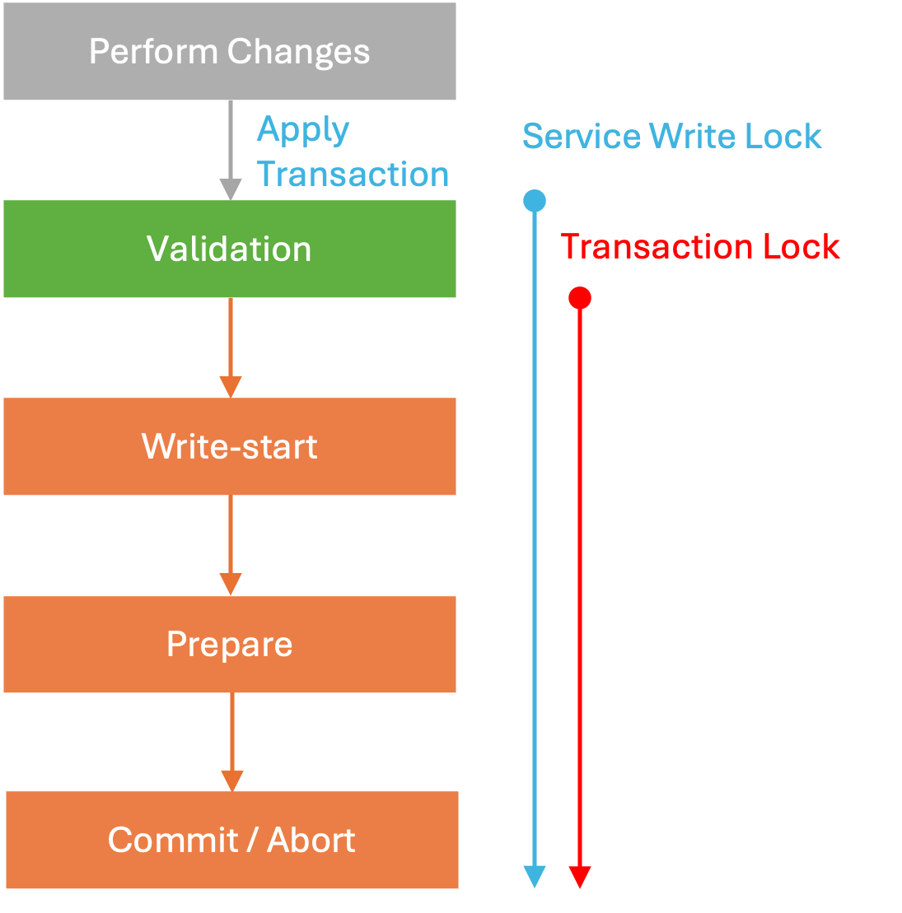
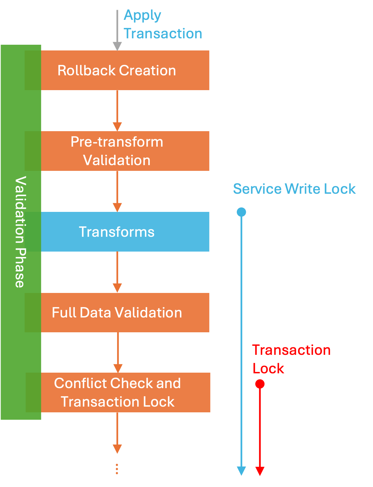
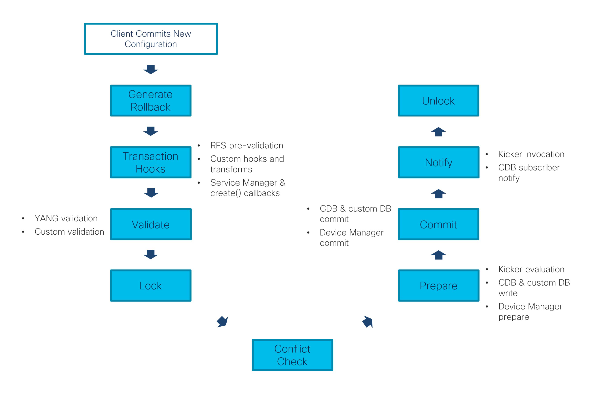

# Transactions

Similar to relational database systems, transactions are at the core of NSO. Transactions ensure consistency and avoid race conditions where simultaneous access by multiple clients could result in data corruption. NSO even extends the concept of transactions to the network, enabling better error recovery during provisioning and simplifying network automation.

Transactions are used for both reads and writes: for reads, they provide a consistent view that does not change half-way through the transaction; for writes, they guarantee all-or-nothing behavior, so partial updates are never persisted. NSO transactions provide ([ACID](https://en.wikipedia.org/wiki/ACID)) properties.

When dealing with operational data in NSO, you can choose to use transactions or not. However, all configuration changes for managed devices and the NSO system itself must go through transactions.

A normal NSO transaction has multiple phases:

* **Creation**: A new transaction is created (opened). This can be a result of an API call, a northbound interface (NBI) request, or some internal process.
* **Reading and writing data**: Also called the "work" phase, this is where the client can safely access the data. If the transaction was created as a read-write one (and not a read-only one), the client can make the desired changes. These changes are temporary and local to the transaction; if the transaction is aborted or client disconnects, the changes are lost. Some of the changes are validated as they are made and client can request a full validation. In the end, all changes must satisfy all model constraints.
* **Commit/Apply**: To persist the changes, the client commits the transaction. NSO ensures the changes are valid and enacts the changes on the affected systems.
* **Closing**: The transaction is closed and cannot be used any longer. Transaction-specific resources are freed.

A transaction generally only advances forward through these phases, not back; for example, once it is committed, you must start a new one to make further changes.

## Transaction Lifetime

Transactions can start explicitly or implicitly. They are meant to be relatively short-lived, since they take up resources.

You can start a transaction explictly with a MAAPI call, such as `ncs.maapi.single_write_trans()` / `com.tailf.maapi.Maapi.startTrans()`, or with JSON-RPC `new_trans`. Each transaction gets a unique identifier, called `th` (for transaction handle). You must close the transaction when you are done, e.g. by using the `with` statement (Python) or calling `Maapi.finishTrans()` (Java) / `delete_trans` (JSON-RPC).

NSO also starts and closes transactions implicitly in certain situations, for example:

* For configure mode in the CLI.
* Advancing a nano service with redeploy.
* For each NBI RESTCONF operation, such as a `PATCH` request.
* For each NBI NETCONF operation, such as `edit-config`.


As an exception, NSO recognizes the proprietary `:transactions` NETCONF capability, used in LSA setups and netsim devices, which defines a separate `start-transaction` NETCONF operation and allows explicit management of transaction lifecycle.


A CLI configure session can live for a relatively long time and so can the transaction (though a new transaction is started after every successful commit). If a transaction runs into a conflict with other concurrent transactions, NSO tries to restart it from a checkpoint. In case that is not possible, the transaction must restart with the latest datastore state and reapply all the changes. The CLI keeps track of the entered commands and tries to reapply them automatically, but other clients (e.g. a Python script) must [retry](nso-concurrency-model.md#ncs.development.concurrency.handling) with a new transaction.

## Transaction Commit

When a client commits (applies) a transaction, it starts a complex process in NSO that needs to ensure valid and consistent data across concurrent transactions and multiple systems (managed devices). This process goes through multiple stages, as shown by the progress trace (e.g. using `commit | details` in the CLI). The detailed output breaks up the transaction into four distinct phases:

1. validate phase
2. write-start phase
3. prepare phase
4. commit phase

These phases deal with how the network-wide transactions work:

The validate phase prepares and validates the new configuration (including NSO copy of device configurations), then the CDB processes the changes and prepares them for local storage in the write-start phase.

The prepare phase sends out the changes to the network through the Device Manager and the HA system. The changes are staged and validated. This process uses the candidate data store if the device supports it. Otherwise, the changes are activated immediately.

If all systems acknowledge that they have received the new configuration successfully, enter the commit phase, marking the new NSO configuration as active and activating or committing the staged configuration on remote devices. Otherwise, enter the abort phase, discarding changes, and ask NEDs to revert activated changes on devices that do not support transactions (e.g. without candidate data store).

<figure><figcaption><p>Typical Transaction Phases</p></figcaption></figure>

There are also two types of locks involved with the transaction that are of interest to the NSO developer; the service write lock and the transaction lock. The latter is an exclusive (global) lock, required to serialize transactions, while the former is a per-service-type lock for serializing services that cannot be run in parallel. See [Scaling and Performance Optimization](../advanced-development/scaling-and-performance-optimization.md) for more details and their impact on performance.


Note that transaction lock is distinct from [global running-datastore locks](../../administration/advanced-topics/locks.md), which are managed by the client agents and not tied to the transaction lifetime. For example, a NETCONF client can acquire a global lock via `lock` operation without starting a transaction.


The first phase, historically called validation, does more than just validate data. When the transaction starts applying, NSO captures the initial intent and creates a rollback file, which allows one to reverse (or roll back) the intent. For example, the rollback file might contain the information that you changed a service instance parameter but it would not contain the service-produced device changes.

Then the first, partial validation takes place. It ensures the service input parameters are valid according to the service YANG model, so the service code can safely use provided parameter values.

Next, NSO runs transaction hooks and performs the necessary transforms, which alter the data before it is saved, for example encrypting passwords. This is also where the Service Manager invokes FASTMAP and service mapping callbacks, recording the resulting changes. NSO takes service write locks in this stage, too.

After transforms, there are no more changes to the configuration data, and the full validation starts, including YANG model constraints over the complete configuration, custom validation through validation points, and configuration policies (see [Policies](../../operation-and-usage/operations/basic-operations.md#d5e319) in Operation and Usage).

<figure><figcaption><p>Stages of Transaction Validation Phase</p></figcaption></figure>

Throughout the phase, the transaction engine makes checkpoints, so it can restart the transaction faster in case of concurrency conflicts. The check for conflicts happens at the end of this first phase when NSO also takes the global transaction lock. Concurrency is further discussed in [NSO Concurrency Model](nso-concurrency-model.md).

Similarly, we can further break down the other phases to get the main transaction commit steps:

1. **Generate rollback**: NSO first generates a rollback file, capturing and reversing the intent of the work phase, allowing the system to later undo the transaction if required.
2. **Transaction hooks**: Define transaction extension points for code to prepare the final complete data. This includes:
  * Pre-transform validation for service input data.
  * Custom hooks and transforms to update existing and fill in additional data.
  * Service Manager callbacks for service mapping logic, calling service `create()` code and similar.
3. **Validation**: Complete validation of the final change against the YANG models and custom validation logic.
4. **Lock**: Takes an exclusive transaction lock, required for resolving concurrent transaction conflicts. Since only one transaction can acquire such a lock at a time, it affects transactional throughput. The parts that run inside the transaction lock are collectively called the critical section.
5. **Conflict check**: Checks if other transactions that run in parallel carry conflicting operations. The transaction may abort if conflicts cannot be automatically resolved.
6. **Write-start** and **Prepare**: Notifies all participating systems of the changes. In particular:
  * Send all changes to CDB and any custom data provider.
  * Evaluate relevant kickers.
  * Perform Device Manager prepare, sending device-related changes to the NEDs or commit queue. If a live device rejects the new configuration, transaction is aborted and no changes at all are persisted.
7. **Commit**: First commits (persists) the CDB and data provider changes, then invokes Device Manager commit to commit (persist) the new configuration on devices.
8. **Notify**: Invokes kickers and notifies CDB subscribers.
9. **Unlock**: First service, then transaction lock is released and critical section ends.

<figure><figcaption><p>Stages of a Transaction Commit</p></figcaption></figure>

The following is a partial, annotated progress trace, demonstrating these steps for a sample service instantiation.

```
# --- Transaction applies due to `commit` in CLI ---
applying transaction for running datastore usid=64 tid=249 trace-id=2b3...
 2026-06-09T10:49:29.266 waiting to apply... ok (0.000 s)
entering validate phase
 # --- Generate rollback ---
 2026-06-09T10:49:29.267 creating rollback file... ok (0.004 s)
 ...
 # --- Pre-validation for service input ---
 2026-06-09T10:49:29.273 run pre-transform validation: ok (0.001 s)
 ...
 # --- Custom hooks and transforms ---
 2026-06-09T10:49:29.273 run transforms and transaction hooks...
 ...
 # --- Service mapping logic ---
 2026-06-09T10:49:29.276 service /test: creating service... ok (0.010 s)
 2026-06-09T10:49:29.287 run transforms and transaction hooks: ok (0.013 s)
 ...
 # --- Validation ---
 2026-06-09T10:49:29.289 run validation over the changeset... ok (0.001 s)
 2026-06-09T10:49:29.291 run dependency-triggered validation... ok (0.000 s)
 ...
 # --- Lock ---
 2026-06-09T10:49:29.293 taking transaction lock... ok (0.000 s)
 2026-06-09T10:49:29.293 holding transaction lock...
 # --- Conflict check ---
 2026-06-09T10:49:29.293 check for read-write conflicts... ok (0.000 s)
 ...
leaving validate phase (0.028 s)
entering write-start phase
 # --- Send changes to CDB ---
 2026-06-09T10:49:29.297 cdb: write changeset... ok (0.000 s)
 # --- Evaluate relevant kickers ---
 2026-06-09T10:49:29.297 check data kickers... ok (0.000 s)
leaving write-start phase (0.004 s)
entering prepare phase
 ...
 # --- Send device-related changes ---
 2026-06-09T10:49:29.299 device-manager: prepare
 2026-06-09T10:49:29.417 device c1: push configuration...
 ...
leaving prepare phase (0.153 s)
entering commit phase
 # --- Commit ---
 2026-06-09T10:49:29.452 cdb: commit
 2026-06-09T10:49:29.452 cdb: switch to new running... ok (0.000 s)
 2026-06-09T10:49:29.453 device-manager: commit
 2026-06-09T10:49:29.456 device c1: push configuration: ok (0.038 s)
 ...
 # --- Notify ---
 2026-06-09T10:49:29.461 invoking data kickers... ok (0.000 s)
 # --- Unlock ---
 2026-06-09T10:49:29.462 holding transaction lock: ok (0.169 s)
 ...
applying transaction for running datastore usid=64 tid=249 trace-id=2b3... (0.196 s)
Commit complete.
```

You can additionally observe from the start of the output that a transaction might have to wait before being allowed to proceed due to `transaction-limits` settings in the `ncs.conf`.

## Extension Points

NSO transactions support three main extension points for implementing custom functionality using callbacks, as listed in [Overview of Extension Points](../introduction-to-automation/applications-in-nso.md#overview-of-extension-points):

* Service: for implementation of classic and nano service provisioning logic.
* Validation: for constraining data beyond the capabilities of YANG.
* Data provider: for components that supply or process data and integrate tightly with NSO transactions. Enables storage of data outside NSO and similar use cases.

Of the three, only data providers are aware of the transaction lifecycle and support callbacks for transaction state transitions (phases). NSO uses the two-phase commit protocol to ensure that all participants perform the requested operations, which is required to ensure transactional properties.

In addition, NSO supports some specific callbacks from internal systems, such as the transaction or the authorization engine. These may be called during processing of transactions, but have very narrow use (and require careful consideration as they can easily negatively affect performance).
