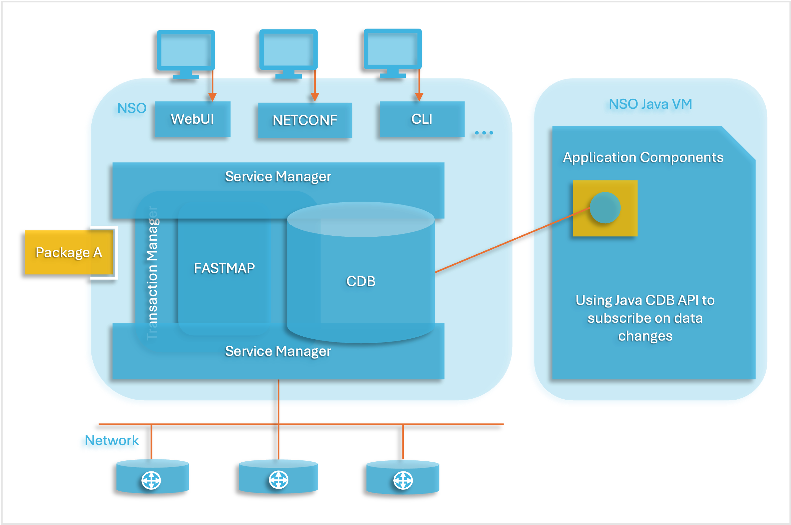
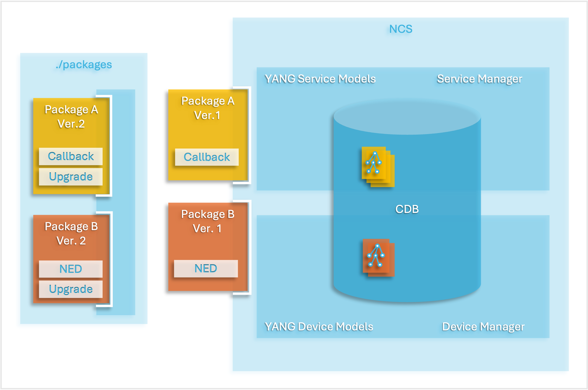
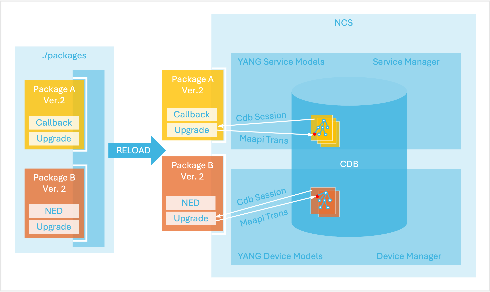
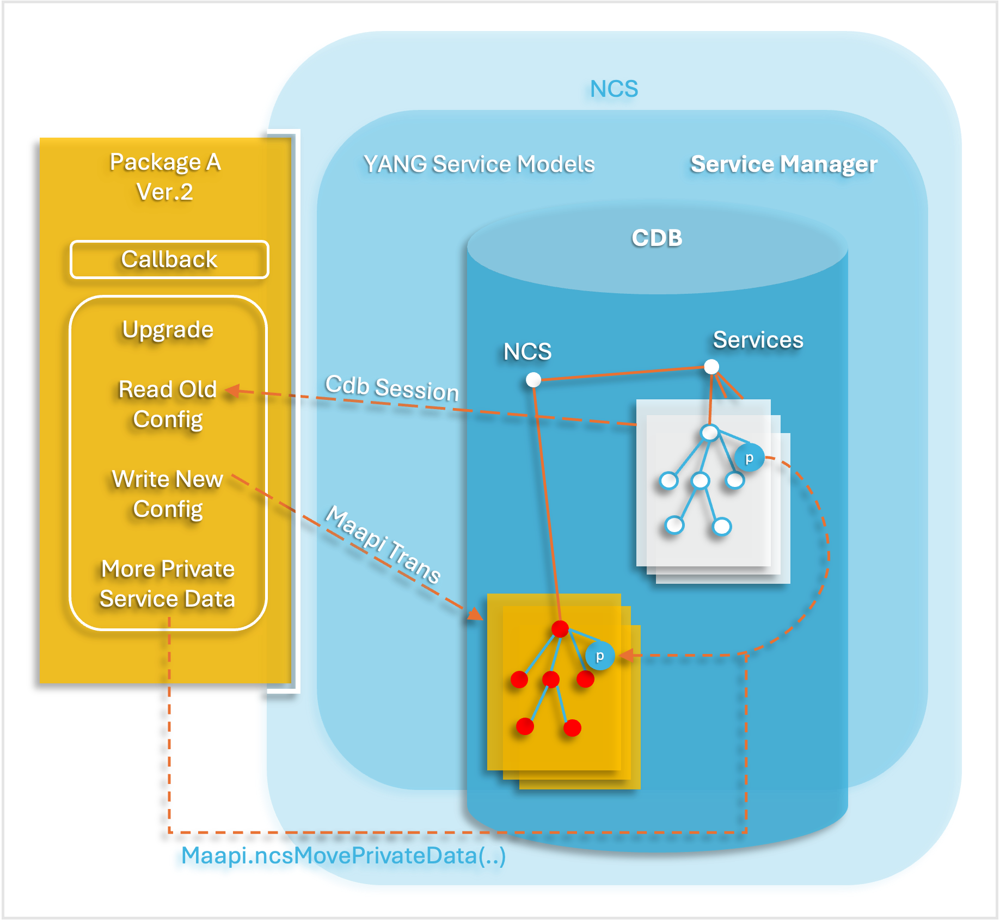

# Using CDB

When using CDB to store the configuration data, the applications need to be able to:

1. Read configuration data from the database.
2. React to changes to the database. There are several possible writers to the database, such as the CLI, NETCONF sessions, the Web UI, either of the NSO sync commands, alarms that get written into the alarm table, NETCONF notifications that arrive at NSO or the NETCONF agent.

The figure below illustrates the architecture of when the CDB is used. The Application components read configuration data and subscribe to changes to the database using a simple RPC-based API. The API is part of the Java library and is fully documented in the Javadoc for CDB.

<div data-with-frame="true"><figure><figcaption><p>NSO CDB Architecture Scenario</p></figcaption></figure></div>

While CDB is the default data store for configuration data in NSO, it is possible to use an external database, if needed. See the example [examples.ncs/sdk-api/external-db](https://github.com/NSO-developer/nso-examples/tree/6.6/sdk-api/external-db) for details.

In the following, we will use the files in [examples.ncs/service-management/mpls-vpn-java](https://github.com/NSO-developer/nso-examples/tree/6.6/service-management/mpls-vpn-java) as a source for our examples. Refer to `README` in that directory for additional details.

## The NSO Data Model <a href="#ncs.ug.architecture.im" id="ncs.ug.architecture.im"></a>

NSO is designed to manage devices and services. NSO uses YANG as the overall modeling language. YANG models describe the NSO configuration, the device configurations, and the configuration of services. Therefore it is vital to understand the data model for NSO including these aspects. The YANG models are available in `$NCS_DIR/src/ncs/yang` and are structured as follows.

`tailf-ncs.yang` is the top module that includes the following sub-modules:

* `tailf-ncs-common.yang`: common definitions.
* `tailf-ncs-packages.yang`: this sub-module defines the management of packages that are run by NSO. A package contains custom code, models, and documentation for any function added to the NSO platform. It can for example be a service application or a southbound integration to a device.
* `tailf-ncs-devices.yang`: This is a core model of NSO. The device model defines everything a user can do with a device that NSO speaks to via a Network Element Driver, NED.
* `tailf-ncs-services.yang`: Services represent anything that spans across devices. This can for example be MPLS VPN, MEF e-line, BGP peer, or website. NSO provides several mechanisms to handle services in general which are specified by this model. Also, it defines placeholder containers under which developers, as an option, can augment their specific services.
* `tailf-ncs-snmp-notification-receiver.yang`: NSO can subscribe to SNMP notifications from the devices. The subscription is specified by this model.
* `tailf-ncs-java-vm.yang`: Custom code that is part of a package is loaded and executed by the NSO Java VM. This is managed by this model. Further, when browsing `$NCS_DIR/src/ncs/yang` you will find models for all aspects of NSO functionality, for example
* `tailf-ncs-alarms.yang`: This model defines how NSO manages alarms. The source of an alarm can be anything like an NSO state change, SNMP, or NETCONF notification.
* `tailf-ncs-snmp.yang`: This model defines how to configure the NSO northbound SNMP agent.
* `tailf-ncs-config.yang`: This model describes the layout of the NSO config file, usually called `ncs.conf`
* `tailf-ncs-packages.yang:` This model describes the layout of the file `package-meta-data.xml`. All user code, data models MIBS, and Java code are always contained in an NSO package. The `package-meta-data.xml` file must always exist in a package and describe the package.

These models will be illustrated and briefly explained below. Note that the figures only contain some relevant aspects of the model and are far from complete. The details of the model are explained in the respective sections.

A good way to learn the model is to start the NSO CLI and use tab completion to navigate the model. Note that depending if you are in operation mode or configuration mode different parts of the model will show up. Also try using TAB to get a list of actions at the level you want, for example, `devices TAB`.

Another way to learn and explore the NSO model is to use the Yanger tool to render a tree output from the NSO model: `yanger -f tree --tree-depth=3 tailf-ncs.yang`. This will show a tree for the complete model. Below is a truncated example:


```bash
$ yanger -f tree --tree-depth=3 tailf-ncs.yang
module: tailf-ncs
   +--rw ssh
   |  +--rw host-key-verification?   ssh-host-key-verification-level
   |  +--rw private-key* [name]
   |     +--rw name          string
   |     +--rw key-data      ssh-private-key
   |     +--rw passphrase?   tailf:aes-256-cfb-128-encrypted-string
   +--rw cluster
   |  +--rw remote-node* [name]
   |  |  +--rw name             node-name
   |  |  +--rw address?         inet:host
   |  |  +--rw port?            inet:port-number
   |  |  +--rw ssh
   |  |  +--rw authgroup        -> /cluster/authgroup/name
   |  |  +--rw trace?           trace-flag
   |  |  +--rw username?        string
   |  |  +--rw notifications
   |  |  +--ro device* [name]
   |  +--rw authgroup* [name]
   |  |  +--rw name           string
   |  |  +--rw default-map!
   |  |  +--rw umap* [local-user]
   |  +--rw commit-queue
   |  |  +--rw enabled?   boolean
   |  +--ro enabled?        boolean
   |  +--ro connection*
   |     +--ro remote-node?   -> /cluster/remote-node/name
   |     +--ro address?       inet:ip-address
   |     +--ro port?          inet:port-number
   |     +--ro channels?      uint32
   |     +--ro local-user?    string
   |     +--ro remote-user?   string
   |     +--ro status?        enumeration
   |     +--ro trace?         enumeration
...
```


## Addressing Data Using Keypaths

As CDB stores hierarchical data as specified by a YANG model, data is addressed by a path to the key. We call this a keypath. A keypath provides a path through the configuration data tree. A keypath can be either absolute or relative. An absolute keypath starts from the root of the tree, while a relative path starts from the "current position" in the tree. They are differentiated by the presence or absence of a leading `/`. Navigating the configuration data tree is thus done in the same way as a directory structure. It is possible to change the current position with for example the `CdbSession.cd()` method. Several of the API methods take a keypath as a parameter.

YANG elements that are lists of other YANG elements can be traversed using two different path notations. Consider the following YANG model fragment:


```yang
module l3vpn {

  namespace "http://com/example/l3vpn";
  prefix l3vpn;


        ...

  container topology {
    list role {
      key "role";
      tailf:cli-compact-syntax;
      leaf role {
        type enumeration {
          enum ce;
          enum pe;
          enum p;
        }
      }

      leaf-list device {
        type leafref {
          path "/ncs:devices/ncs:device/ncs:name";
        }
      }
    }

    list connection {
      key "name";
      leaf name {
        type string;
      }
      container endpoint-1 {
        tailf:cli-compact-syntax;
        uses connection-grouping;
      }
      container endpoint-2 {
        tailf:cli-compact-syntax;
        uses connection-grouping;
      }
      leaf link-vlan {
        type uint32;
      }
    }
  }
```


We can use the method `CdbSession.getNumberOfInstances()` to find the number of elements in a list has, and then traverse them using a standard index notation, i.e., `<path to list>[integer]`. The children of a list are numbered starting from 0. Looking at the example above (L3 VPN YANG Extract) the path `/l3vpn:topology/connection[2]/endpoint-1` refers to the `endpoint-1` leaf of the third `connection`. This numbering is only valid during the current CDB session. CDB is always locked for writing during a read session.

We can also refer to list instances using the values of the keys of the list. In a YANG model, you specify which leafs (there can be several) are to be used for keys by using the `key <name>` statement at the beginning of the list. In our case a `connection` has the `name` leaf as the key. So the path `/l3vpn:topology/connection{c1}/endpoint-2` refers to the `endpoint-2` leaf of the `connection` whose name is “c1”.

A YANG list may have more than one key. The syntax for the keys is a space-separated list of key values enclosed within curly brackets: `{Key1 Key2 ...}`

Which version of the list element referencing to use depends on the situation. Indexing with an integer is convenient when looping through all elements. As a convenience all methods expecting keypaths accept formatting characters and accompanying data items. For example, you can use `CdbSession.getElem("server[%d]/ifc{%s}/mtu", 2, "eth0")` to fetch the MTU of the third server instance's interface named "eth0". Using relative paths and `CdbSession.pushd()` it is possible to write code that can be re-used for common sub-trees.

The current position also includes the namespace. To read elements from a different namespace use the prefix qualified tag for that element like in `l3vpn:topology`.

## Subscriptions <a href="#ug.cdb.subscriptions" id="ug.cdb.subscriptions"></a>

The CDB subscription mechanism allows an external program to be notified when some part of the configuration changes. When receiving a notification it is also possible to iterate through the changes written to CDB. Subscriptions are always towards the running data store (it is not possible to subscribe to changes to the startup data store). Subscriptions towards operational data (see [Operational Data in CDB](using-cdb.md#ug.cdb.opdata)) kept in CDB are also possible, but the mechanism is slightly different.

The first thing to do is to inform CDB which paths we want to subscribe to. Registering a path returns a subscription point identifier. This is done by acquiring a subscriber instance by calling `CdbSubscription Cdb.newSubscription()` method. For the subscriber (or `CdbSubscription` instance) the paths are registered with the `CdbSubscription.subscribe()` that that returns the actual subscription point identifier. A subscriber can have multiple subscription points, and there can be many different subscribers. Every point is defined through a path - similar to the paths we use for read operations, with the exception that instead of fully instantiated paths to list instances we can selectively use tagpaths.

When a client is done defining subscriptions it should inform NSO that it is ready to receive notifications by calling `CdbSubscription.subscribeDone()`, after which the subscription socket is ready to be polled.

We can subscribe either to specific leaves, or entire subtrees. Explaining this by example we get:

* `/ncs:devices/global-settings/trace`: Subscription to a leaf. Only changes to this leaf will generate a notification.
* `/ncs:devices`: Subscription to the subtree rooted at `/ncs:devices`. Any changes to this subtree will generate a notification. This includes additions or removals of `device` instances, as well as changes to already existing `device` instances.
* `/ncs:devices/device{"ex0"}/address`: Subscription to a specific element in a list. A notification will be generated when the device `ex0` changes its IP address.
* `/ncs:devices/device/address`: Subscription to a leaf in a list. A notification will be generated leaf `address` is changed in any device instance.

When adding a subscription point the client must also provide a priority, which is an integer (a smaller number means a higher priority). When data in CDB is changed, this change is part of a transaction. A transaction can be initiated by a `commit` operation from the CLI or an `edit-config` operation in NETCONF resulting in the running database being modified. As the last part of the transaction CDB will generate notifications in lock-step priority order. First, all subscribers at the lowest numbered priority are handled, once they all have replied and synchronized by calling `CdbSubscription.sync()` the next set - at the next priority level - is handled by CDB. Not until all subscription points have been acknowledged is the transaction complete. This implies that if the initiator of the transaction was for example a **commit** command in the CLI, the command will hang until notifications have been acknowledged.

Note that even though the notifications are delivered within the transaction, a subscriber can't reject the changes (since this would break the two-phase commit protocol used by the NSO backplane towards all data providers).

As a subscriber has read its subscription notifications using `CdbSubscription.read()`, it can iterate through the changes that caused the particular subscription notification using the `CdbSubscription.diffIterate()` method. It is also possible to start a new read-session to the `CdbDBType.CDB_PRE_COMMIT_RUNNING` database to read the running database as it was before the pending transaction.

To view registered subscribers use the `ncs --status` command.

## Sessions <a href="#d5e2708" id="d5e2708"></a>

It is important to note that CDB is locked for writing during a read session using the Java API. A session starts with `CdbSession Cdb.startSession()` and the lock is not released until the `CdbSession.endSession()` (or the `Cdb.close()`) call. CDB will also automatically release the lock if the socket is closed for some other reason, such as program termination.

## Loading Initial Data into CDB <a href="#ug.cdb.init" id="ug.cdb.init"></a>

When NSO starts for the first time, the CDB database is empty. The location of the database files used by CDB is given in `ncs.conf`. At first startup, when CDB is empty, i.e., no database files are found in the directory specified by `<db-dir>` (`./ncs-cdb` as given by the example below (CDB Init)), CDB will try to initialize the database from all XML documents found in the same directory.


```xml
<!-- Where the database (and init XML) files are kept -->
<cdb>
    <db-dir>./ncs-cdb</db-dir>
</cdb>
```


This feature can be used to reset the configuration to factory settings.

Given the YANG model in the example above (L3 VPN YANG Extract), the initial data for `topology` can be found in `topology.xml` as seen in the example below (Initial Data for Topology).


```xml
<config xmlns="http://tail-f.com/ns/config/1.0">
  <topology xmlns="http://com/example/l3vpn">
    <role>
      <role>ce</role>
      <device>ce0</device>
      <device>ce1</device>
      <device>ce2</device>
    ...
    </role>
    <role>
      <role>pe</role>
      <device>pe0</device>
      <device>pe1</device>
      <device>pe2</device>
      <device>pe3</device>
    </role>
    ...
    <connection>
      <name>c0</name>
      <endpoint-1>
        <device>ce0</device>
        <interface>GigabitEthernet0/8</interface>
        <ip-address>192.168.1.1/30</ip-address>
      </endpoint-1>
      <endpoint-2>
        <device>pe0</device>
        <interface>GigabitEthernet0/0/0/3</interface>
        <ip-address>192.168.1.2/30</ip-address>
      </endpoint-2>
      <link-vlan>88</link-vlan>
    </connection>
    <connection>
      <name>c1</name>
    ...
```


Another example of using these features is when initializing the AAA database. This is described in [AAA infrastructure](../../administration/management/aaa-infrastructure.md).

All files ending in `.xml` will be loaded (in an undefined order) and committed in a single transaction when CDB enters start phase 1 (see [Starting NSO](../../administration/management/system-management/#ug.sys_mgmt.starting_ncs) for more details on start phases). The format of the init files is rather lax in that it is not required that a complete instance document following the data model is present, much like the NETCONF `edit-config` operation. It is also possible to wrap multiple top-level tags in the file with a surrounding config tag, as shown in the example below (Wrapper for Multiple Top-Level Tags) like this:


```xml
<config xmlns="http://tail-f.com/ns/config/1.0">
  ...
</config>
```



The actual names of the XML files do not matter, i.e., they do not need to correspond to the part of the YANG model being initialized.


## Operational Data in CDB <a href="#ug.cdb.opdata" id="ug.cdb.opdata"></a>

In addition to handling configuration data, CDB can also take care of operational data such as alarms and traffic statistics. By default, operational data is not persistent and thus not kept between restarts. In the YANG model annotating a node with `config false` will mark the subtree rooted at that node as operational data. Reading and writing operational data is done similarly to ordinary configuration data, with the main difference being that you have to specify that you are working against operational data. Also, the subscription model is different.

### Subscriptions <a href="#d5e2749" id="d5e2749"></a>

Subscriptions towards the operational data in CDB are similar to the above, but because the operational data store is designed for light-weight access, does not have transactions, and normally avoids the use of any locks, there are several differences - in particular:

* Subscription notifications are only generated if the writer obtains the “subscription lock”, by using the `Cdb.startSession()` method with the CdbLockType.LOCK\_REQUEST flag.
* Subscriptions are registered with the `CdbSubscription.subscribe()` method with the flag `CdbSubscriptionType.SUB_OPERATIONAL` rather than `CdbSubscriptionType.SUB_RUNNING`.
* No priorities are used.
* Neither the writer that generated the subscription notifications nor other writes to the same data are blocked while notifications are being delivered. However, the subscription lock remains in effect until notification delivery is complete.
* The previous value for the modified leaf is not available when using the `CdbSubscriber.diffIterate()` method.

Essentially a write operation towards the operational data store, combined with the subscription lock, takes on the role of a transaction for configuration data as far as subscription notifications are concerned. This means that if operational data updates are done with many single-element write operations, this can potentially result in a lot of subscription notifications. Thus it is a good idea to use the multi-element `CdbSession.setObject()` etc methods for updating operational data that applications subscribe to.

Since write operations that do not attempt to obtain the subscription lock are allowed to proceed even during notification delivery, it is the responsibility of the applications using the operational data store to obtain the lock as needed when writing. If subscribers should be able to reliably read the exact data that resulted from the write that triggered their subscription, the subscription lock must always be obtained when writing that particular set of data elements. One possibility is of course to obtain the lock for all writes to operational data, but this may have an unacceptable performance impact.

## Example <a href="#d5e2773" id="d5e2773"></a>

We will take a first look at the [examples.ncs/sdk-api/cdb-java](https://github.com/NSO-developer/nso-examples/tree/6.6/sdk-api/cdb-java) example. This example is an NSO project with two packages: `cdb` and `router`.

### Example packages

* `router`: A NED package with a simple but still realistic model of a network device. The only component in this package is the NED component that uses NETCONF to communicate with the device. This package is used in many NSO examples including [examples.ncs/device-management/router-network](https://github.com/NSO-developer/nso-examples/tree/6.6/device-management/router-network) which is an introduction to NSO device manager, NSO netsim, and this router package.
* `cdb`: This package has an even simpler YANG model to illustrate some aspects of CDB data retrieval. The package consists of five application components:
  * Plain CDB Subscriber: This CDB subscriber subscribes to changes under the path `/devices/device{ex0}/config`. Whenever a change occurs there, the code iterates through the change and prints the values.
  * CdbCfgSubscriber: A more advanced CDB subscriber that subscribes to changes under the path `/devices/device/config/sys/interfaces/interface`.
  * OperSubscriber: An operational data subscriber that subscribes to changes under the path `/t:test/stats-item`.

The [examples.ncs/sdk-api/cdb-py](https://github.com/NSO-developer/nso-examples/tree/6.6/sdk-api/cdb-py) and [examples.ncs/sdk-api/cdb-java](https://github.com/NSO-developer/nso-examples/tree/6.6/sdk-api/cdb-java) examples `packages/cdb` package includes the YANG model in the in the example below:.


```yang
module test {
  namespace "http://example.com/test";
  prefix t;

  import tailf-common {
    prefix tailf;
  }

  description "This model is used as a simple example model
               illustrating some aspects of CDB subscriptions
               and CDB operational data";

  revision 2012-06-26 {
    description "Initial revision.";
  }

  container test {
    list config-item {
      key ckey;
      leaf ckey {
        type string;
      }
      leaf i {
        type int32;
      }
    }
    list stats-item {
      config false;
      tailf:cdb-oper;
      key skey;
      leaf skey {
        type string;
      }
      leaf i {
        type int32;
      }
      container inner {
        leaf  l {
          type string;
        }
      }
    }
  }
}
```


Let us now populate the database and look at the Plain CDB Subscriber and how it can use the Java API to react to changes to the data. This component subscribes to changes under the path `/devices/device{ex0}/config` which is configuration changes for the device named `ex0` which is a device connected to NSO via the router NED.

Being an application component in the `cdb` package implies that this component is realized by a Java class that implements the `com.tailf.ncs.ApplicationComponent` Java interface. This interface inherits the Java standard `Runnable` interface which requires the `run()` method to be implemented. In addition to this method, there is a `init()` and a `finish()` method that has to be implemented. When the NSO Java-VM starts this class will be started in a separate thread with an initial call to `init()` before the thread starts. When the package is requested to stop execution a call to `finish()` is performed and this method is expected to end thread execution.


```java
public class PlainCdbSub implements ApplicationComponent  {
    private static final Logger LOGGER
            = LogManager.getLogger(PlainCdbSub.class);

    @Resource(type = ResourceType.CDB, scope = Scope.INSTANCE,
              qualifier = "plain")
    private Cdb cdb;

    private CdbSubscription sub;
    private int subId;
    private boolean requestStop;

    public PlainCdbSub() {
    }

    public void init() {
        try {
            LOGGER.info(" init cdb subscriber ");
            sub = new CdbSubscription(cdb);
            String str = "/devices/device{ex0}/config";
            subId = sub.subscribe(1, new Ncs(), str);
            sub.subscribeDone();
            LOGGER.info("subscribeDone");
            requestStop = false;
        } catch (Exception e) {
            throw new RuntimeException("FAIL in init", e);
        }
    }

    public void run() {
        try {
            while (!requestStop) {
                try {
                    sub.read();
                    sub.diffIterate(subId, new Iter());
                } finally {
                    sub.sync(CdbSubscriptionSyncType.DONE_SOCKET);
                }
            }
        } catch (ConfException e) {
            if (e.getErrorCode() == ErrorCode.ERR_EOF) {
                // Triggered by finish method
                // if we throw further NCS JVM will try to restart
                // the package
                LOGGER.warn(" Socket Closed!");
            } else {
                throw new RuntimeException("FAIL in run", e);
            }
        } catch (Exception e) {
            LOGGER.warn("Exception:" + e.getMessage());
            throw new RuntimeException("FAIL in run", e);
        } finally {
            requestStop = false;
            LOGGER.warn(" run end ");
        }
    }

    public void finish() {
        requestStop = true;
        LOGGER.warn(" PlainSub in finish () =>");
        try {
            // ResourceManager will close the resource (cdb) used by this
            // instance that triggers ConfException with ErrorCode.ERR_EOF
            // in run method
            ResourceManager.unregisterResources(this);
        } catch (Exception e) {
            throw new RuntimeException("FAIL in finish", e);
        }
        LOGGER.warn(" PlainSub in finish () => ok");
    }

    private class Iter implements CdbDiffIterate  {
        public DiffIterateResultFlag iterate(ConfObject[] kp,
                                             DiffIterateOperFlag op,
                                             ConfObject oldValue,
                                             ConfObject newValue,
                                             Object state) {
            try {
                String kpString = Conf.kpToString(kp);
                LOGGER.info("diffIterate: kp= " + kpString + ", OP=" + op
                            + ", old_value=" + oldValue + ", new_value="
                            + newValue);
                return DiffIterateResultFlag.ITER_RECURSE;
            } catch (Exception e) {
                return DiffIterateResultFlag.ITER_CONTINUE;
            }
        }
    }
}
```


We will walk through the code and highlight different aspects. We start with how the `Cdb` instance is retrieved in this example. It is always possible to open a socket to NSO and create the `Cdb` instance with this socket. But with this comes the responsibility to manage that socket. In NSO, there is a resource manager that can take over this responsibility. In the code, the field that should contain the `Cdb` instance is simply annotated with a `@Resource` annotation. The resource manager will find this annotation and create the `Cdb` instance as specified. In this example below (Resource Annotation) `Scope.INSTANCE` implies that new instances of this example class should have unique `Cdb` instances (see more in [The Resource Manager](nso-virtual-machines/nso-java-vm.md#ncs.ug.javavm.resman)).


```java
    @Resource(type = ResourceType.CDB, scope = Scope.INSTANCE,
              qualifier = "plain")
    private Cdb cdb;
```


The `init()` method (shown in the example below, (Plain Subscriber Init) is called before this application component thread is started. For this subscriber, this is the place to set up the subscription. First, an `CdbSubscription` instance is created and in this instance, the subscription points are registered (one in this case). When all subscription points are registered a call to `CdbSubscriber.subscribeDone()` will indicate that the registration is finished and the subscriber is ready to start.


```java
    public void init() {
        try {
            LOGGER.info(" init cdb subscriber ");
            sub = new CdbSubscription(cdb);
            String str = "/devices/device{ex0}/config";
            subId = sub.subscribe(1, new Ncs(), str);
            sub.subscribeDone();
            LOGGER.info("subscribeDone");
            requestStop = false;
        } catch (Exception e) {
            throw new RuntimeException("FAIL in init", e);
        }
    }
```


The `run()` method comes from the standard Java API Runnable interface and is executed when the application component thread is started. For this subscriber (see example below (Plain CDB Subscriber)) a loop over the `CdbSubscription.read()` method drives the subscription. This call will block until data has changed for some of the subscription points that were registered, and the IDs for these subscription points will then be returned. In our example, since we only have one subscription point, we know that this is the one stored as `subId`. This subscriber chooses to find the changes by calling the `CdbSubscription.diffIterate()` method. Important is to acknowledge the subscription by calling `CdbSubscription.sync()` or else this subscription will block the ongoing transaction.


```java
    public void run() {
        try {
            while (!requestStop) {
                try {
                    sub.read();
                    sub.diffIterate(subId, new Iter());
                } finally {
                    sub.sync(CdbSubscriptionSyncType.DONE_SOCKET);
                }
            }
        } catch (ConfException e) {
            if (e.getErrorCode() == ErrorCode.ERR_EOF) {
                // Triggered by finish method
                // if we throw further NCS JVM will try to restart
                // the package
                LOGGER.warn(" Socket Closed!");
            } else {
                throw new RuntimeException("FAIL in run", e);
            }
        } catch (Exception e) {
            LOGGER.warn("Exception:" + e.getMessage());
            throw new RuntimeException("FAIL in run", e);
        } finally {
            requestStop = false;
            LOGGER.warn(" run end ");
        }
    }
```


The call to the `CdbSubscription.diffIterate()` requires an object instance implementing an `iterate()` method. To do this, the `CdbDiffIterate` interface is implemented by a suitable class. In our example, this is done by a private inner class called `Iter` (Example below (Plain Subscriber Iterator Implementation)). The `iterate()` method is called for all changes and the path, type of change, and data are provided as arguments. In the end, the `iterate()` should return a flag that controls how further iteration should prolong, or if it should stop. Our example `iterate()` method just logs the changes.


```java
    private class Iter implements CdbDiffIterate  {
        public DiffIterateResultFlag iterate(ConfObject[] kp,
                                             DiffIterateOperFlag op,
                                             ConfObject oldValue,
                                             ConfObject newValue,
                                             Object state) {
            try {
                String kpString = Conf.kpToString(kp);
                LOGGER.info("diffIterate: kp= " + kpString + ", OP=" + op
                            + ", old_value=" + oldValue + ", new_value="
                            + newValue);
                return DiffIterateResultFlag.ITER_RECURSE;
            } catch (Exception e) {
                return DiffIterateResultFlag.ITER_CONTINUE;
            }
        }
    }
```


The `finish()` method (Example below (Plain Subscriber `finish`)) is called when the NSO Java-VM wants the application component thread to stop execution. An orderly stop of the thread is expected. Here the subscription will stop if the subscription socket and underlying `Cdb` instance are closed. This will be done by the `ResourceManager` when we tell it that the resources retrieved for this Java object instance could be unregistered and closed. This is done by a call to the `ResourceManager.unregisterResources()` method.


```java
    public void finish() {
        requestStop = true;
        LOGGER.warn(" PlainSub in finish () =>");
        try {
            // ResourceManager will close the resource (cdb) used by this
            // instance that triggers ConfException with ErrorCode.ERR_EOF
            // in run method
            ResourceManager.unregisterResources(this);
        } catch (Exception e) {
            throw new RuntimeException("FAIL in finish", e);
        }
        LOGGER.warn(" PlainSub in finish () => ok");
    }
```


We will now compile and start the [examples.ncs/sdk-api/cdb-java](https://github.com/NSO-developer/nso-examples/tree/6.6/sdk-api/cdb-java) example, populate some config data, and look at the result. The example below (Plain Subscriber Startup) shows how to do this.


```bash
$ make clean all
$ ncs-netsim start
DEVICE ex0 OK STARTED
DEVICE ex1 OK STARTED
DEVICE ex2 OK STARTED

$ ncs
```


By far, the easiest way to populate the database with some actual data is to run the CLI (see the example below (Populate Data using CLI)).


```bash
$ ncs_cli -u admin
admin connected from 127.0.0.1 using console on ncs
admin@ncs# config exclusive
Entering configuration mode exclusive
Warning: uncommitted changes will be discarded on exit
admin@ncs(config)# devices sync-from
sync-result {
    device ex0
    result true
}
sync-result {
    device ex1
    result true
}
sync-result {
    device ex2
    result true
}

admin@ncs(config)# devices device ex0 config r:sys syslog server 4.5.6.7 enabled
admin@ncs(config-server-4.5.6.7)# commit
Commit complete.
admin@ncs(config-server-4.5.6.7)# top
admin@ncs(config)# exit
admin@ncs# show devices device ex0 config r:sys syslog
NAME
----------
4.5.6.7
10.3.4.5
```


We have now added a server to the Syslog. What remains is to check what our 'Plain CDB Subscriber' `ApplicationComponent` got as a result of this update. In the `logs` directory of the [examples.ncs/sdk-api/cdb-java](https://github.com/NSO-developer/nso-examples/tree/6.6/sdk-api/cdb-java) example there is a file named `PlainCdbSub.out` which contains the log data from this application component. At the beginning of this file, a lot of logging is performed which emanates from the `sync-from` of the device. At the end of this file, we can find the three log rows that come from our update. See the extract in the example below (Plain Subscriber Output) (with each row split over several to fit on the page).


```
<INFO> 05-Feb-2015::13:24:55,760  PlainCdbSub$Iter
  (cdb-examples:Plain CDB Subscriber) -Run-4: - diffIterate:
  kp= /ncs:devices/device{ex0}/config/r:sys/syslog/server{4.5.6.7},
  OP=MOP_CREATED, old_value=null, new_value=null
<INFO> 05-Feb-2015::13:24:55,761  PlainCdbSub$Iter
  (cdb-examples:Plain CDB Subscriber) -Run-4: - diffIterate:
  kp= /ncs:devices/device{ex0}/config/r:sys/syslog/server{4.5.6.7}/name,
  OP=MOP_VALUE_SET, old_value=null, new_value=4.5.6.7
<INFO> 05-Feb-2015::13:24:55,762  PlainCdbSub$Iter
  (cdb-examples:Plain CDB Subscriber) -Run-4: - diffIterate:
  kp= /ncs:devices/device{ex0}/config/r:sys/syslog/server{4.5.6.7}/enabled,
  OP=MOP_VALUE_SET, old_value=null, new_value=true
```


We will turn to look at another subscriber which has a more elaborate diff iteration method. In our example `cdb` package, we have an application component named `CdbCfgSubscriber`. This component consists of a subscriber for the subscription point `/ncs:devices/device/config/r:sys/interfaces/interface`. The iterate() method is here implemented as an inner class called `DiffIterateImpl`.

The code for this subscriber is left out but can be found in the file `ConfigCdbSub.java`.

The example below (Run CdbCfgSubscriber Example) shows how to build and run the example.


```bash
$ make clean all
$ ncs-netsim start
DEVICE ex0 OK STARTED
DEVICE ex1 OK STARTED
DEVICE ex2 OK STARTED

$ ncs

$ ncs_cli -u admin
admin@ncs# devices sync-from suppress-positive-result
admin@ncs# config
admin@ncs(config)# no devices device ex* config r:sys interfaces
admin@ncs(config)# devices device ex0 config r:sys interfaces \
> interface en0 mac 3c:07:54:71:13:09 mtu 1500 duplex half unit 0 family inet \
> address 192.168.1.115 broadcast 192.168.1.255 prefix-length 32
admin@ncs(config-address-192.168.1.115)# commit
Commit complete.
admin@ncs(config-address-192.168.1.115)# top
admin@ncs(config)# exit
```


If we look at the file `logs/ConfigCdbSub.out`, we will find log records from the subscriber (see the example below (Subscriber Output)). At the end of this file the last `DUMP DB` will show only one remaining interface.


```
...
<INFO> 05-Feb-2015::16:10:23,346  ConfigCdbSub
 (cdb-examples:CdbCfgSubscriber)-Run-1: -  Device {ex0}
<INFO> 05-Feb-2015::16:10:23,346  ConfigCdbSub
 (cdb-examples:CdbCfgSubscriber)-Run-1: -     INTERFACE
<INFO> 05-Feb-2015::16:10:23,346  ConfigCdbSub
 (cdb-examples:CdbCfgSubscriber)-Run-1: -       name: {en0}
<INFO> 05-Feb-2015::16:10:23,346  ConfigCdbSub
 (cdb-examples:CdbCfgSubscriber)-Run-1: -       description:null
<INFO> 05-Feb-2015::16:10:23,350  ConfigCdbSub
 (cdb-examples:CdbCfgSubscriber)-Run-1: -       speed:null
<INFO> 05-Feb-2015::16:10:23,354  ConfigCdbSub
 (cdb-examples:CdbCfgSubscriber)-Run-1: -       duplex:half
<INFO> 05-Feb-2015::16:10:23,354  ConfigCdbSub
 (cdb-examples:CdbCfgSubscriber)-Run-1: -       mtu:1500
<INFO> 05-Feb-2015::16:10:23,354  ConfigCdbSub
 (cdb-examples:CdbCfgSubscriber)-Run-1: -       mac:<<60,7,84,113,19,9>>
<INFO> 05-Feb-2015::16:10:23,354  ConfigCdbSub
 (cdb-examples:CdbCfgSubscriber)-Run-1: -       UNIT
<INFO> 05-Feb-2015::16:10:23,354  ConfigCdbSub
 (cdb-examples:CdbCfgSubscriber)-Run-1: -        name: {0}
<INFO> 05-Feb-2015::16:10:23,355  ConfigCdbSub
 (cdb-examples:CdbCfgSubscriber)-Run-1: -        descripton: null
<INFO> 05-Feb-2015::16:10:23,355  ConfigCdbSub
 (cdb-examples:CdbCfgSubscriber)-Run-1: -        vlan-id:null
<INFO> 05-Feb-2015::16:10:23,355  ConfigCdbSub
 (cdb-examples:CdbCfgSubscriber)-Run-1: -         ADDRESS-FAMILY
<INFO> 05-Feb-2015::16:10:23,355  ConfigCdbSub
 (cdb-examples:CdbCfgSubscriber)-Run-1: -           key: {192.168.1.115}
<INFO> 05-Feb-2015::16:10:23,355  ConfigCdbSub
 (cdb-examples:CdbCfgSubscriber)-Run-1: -           prefixLength: 32
<INFO> 05-Feb-2015::16:10:23,355  ConfigCdbSub
 (cdb-examples:CdbCfgSubscriber)-Run-1: -           broadCast:192.168.1.255
<INFO> 05-Feb-2015::16:10:23,356  ConfigCdbSub
 (cdb-examples:CdbCfgSubscriber)-Run-1: -  Device {ex1}
<INFO> 05-Feb-2015::16:10:23,356  ConfigCdbSub
 (cdb-examples:CdbCfgSubscriber)-Run-1: -  Device {ex2}
```


### Operational Data

We will look once again at the YANG model for the CDB package in the [examples.ncs/sdk-api/cdb-java](https://github.com/NSO-developer/nso-examples/tree/6.6/sdk-api/cdb-java) example. Inside the `test.yang` YANG model, there is a `test` container. As a child in this container, there is a list `stats-item` (see the example below (CDB Simple Operational Data).


```yang
    list stats-item {
      config false;
      tailf:cdb-oper;
      key skey;
      leaf skey {
        type string;
      }
      leaf i {
        type int32;
      }
      container inner {
        leaf  l {
          type string;
        }
      }
    }
```


Note the list `stats-item` has the substatement `config false;` and below it, we find a `tailf:cdb-oper;` statement. A standard way to implement operational data is to define a callpoint in the YANG model and write instrumentation callback methods for retrieval of the operational data (see more on data callbacks in [DP API](api-overview/java-api-overview.md#ug.java_api_overview.dp)). Here on the other hand we use the `tailf:cdb-oper;` statement which implies that these instrumentation callbacks are automatically provided internally by NSO. The downside is that we must populate this operational data in CDB from the outside.

An example of Java code that creates operational data using the Navu API is shown in the example below (Creating Operational Data using Navu API)).


```java
    public static void createEntry(String key)
            throws  IOException, ConfException {

        Socket socket = new Socket("127.0.0.1", Conf.NCS_PORT);
        Maapi maapi = new Maapi(socket);
        maapi.startUserSession("system", InetAddress.getByName(null),
                               "system", new String[]{},
                               MaapiUserSessionFlag.PROTO_TCP);
        NavuContext operContext = new NavuContext(maapi);
        int th = operContext.startOperationalTrans(Conf.MODE_READ_WRITE);
        NavuContainer mroot = new NavuContainer(operContext);
        LOGGER.debug("ROOT --> " + mroot);

        ConfNamespace ns = new test();
        NavuContainer testModule = mroot.container(ns.hash());
        NavuList list =  testModule.container("test").list("stats-item");
        LOGGER.debug("LIST: --> " + list);

        List<ConfXMLParam> param = new ArrayList<>();
        param.add(new ConfXMLParamValue(ns, "skey", new ConfBuf(key)));
        param.add(new ConfXMLParamValue(ns, "i",
                new ConfInt32(key.hashCode())));
        param.add(new ConfXMLParamStart(ns, "inner"));
        param.add(new ConfXMLParamValue(ns, "l", new ConfBuf("test-" + key)));
        param.add(new ConfXMLParamStop(ns, "inner"));
        list.setValues(param.toArray(new ConfXMLParam[0]));
        maapi.applyTrans(th, false);
        maapi.finishTrans(th);
        maapi.endUserSession();
        socket.close();
    }
```


An example of Java code that deletes operational data using the CDB API is shown in the example below (Deleting Operational Data using CDB API).


```java
    public static void deleteEntry(String key)
            throws IOException, ConfException {
        Socket s = new Socket("127.0.0.1", Conf.NCS_PORT);
        Cdb c = new Cdb("writer", s);

        CdbSession sess = c.startSession(CdbDBType.CDB_OPERATIONAL,
                                         EnumSet.of(CdbLockType.LOCK_REQUEST,
                                                    CdbLockType.LOCK_WAIT));
        ConfPath path = new ConfPath("/t:test/stats-item{%x}",
                                     new ConfKey(new ConfBuf(key)));
        sess.delete(path);
        sess.endSession();
        s.close();
    }
```


In the [examples.ncs/sdk-api/cdb-java](https://github.com/NSO-developer/nso-examples/tree/6.6/sdk-api/cdb-java) example the `cdb` package, there is also an application component with an operational data subscriber that subscribes to data from the path `"/t:test/stats-item"` (see the example below (CDB Operational Subscriber Java code)).


```java
public class OperCdbSub implements ApplicationComponent, CdbDiffIterate {
    private static final Logger LOGGER = LogManager.getLogger(OperCdbSub.class);

    // let our ResourceManager inject Cdb sockets to us
    // no explicit creation of creating and opening sockets needed
    @Resource(type = ResourceType.CDB, scope = Scope.INSTANCE,
              qualifier = "sub-sock")
    private Cdb cdbSub;
    @Resource(type = ResourceType.CDB, scope = Scope.INSTANCE,
              qualifier = "data-sock")
    private Cdb cdbData;

    private boolean requestStop;
    private int point;
    private CdbSubscription cdbSubscription;

    public OperCdbSub() {
    }

    public void init() {
        LOGGER.info(" init oper subscriber ");
        try {
            cdbSubscription = cdbSub.newSubscription();
            String path = "/t:test/stats-item";
            point = cdbSubscription.subscribe(
                    CdbSubscriptionType.SUB_OPERATIONAL,
                    1, test.hash, path);
            cdbSubscription.subscribeDone();
            LOGGER.info("subscribeDone");
            requestStop = false;
        } catch (Exception e) {
            LOGGER.error("Fail in init", e);
        }
    }

    public void run() {
        try {
            while (!requestStop) {
                try {
                    int[] points = cdbSubscription.read();
                    CdbSession cdbSession
                            = cdbData.startSession(CdbDBType.CDB_OPERATIONAL);
                    EnumSet<DiffIterateFlags> diffFlags
                            = EnumSet.of(DiffIterateFlags.ITER_WANT_PREV);
                    cdbSubscription.diffIterate(points[0], this, diffFlags,
                                                cdbSession);
                    cdbSession.endSession();
                } finally {
                    cdbSubscription.sync(
                                    CdbSubscriptionSyncType.DONE_OPERATIONAL);
                }
            }
        } catch (Exception e) {
            LOGGER.error("Fail in run shouldrun", e);
        }
        requestStop = false;
    }

    public void finish() {
        requestStop = true;
        try {
            ResourceManager.unregisterResources(this);
        } catch (Exception e) {
            LOGGER.error("Fail in finish", e);
        }
    }

    @Override
    public DiffIterateResultFlag iterate(ConfObject[] kp,
                                         DiffIterateOperFlag op,
                                         ConfObject oldValue,
                                         ConfObject newValue,
                                         Object initstate) {
        LOGGER.info(op + " " + Arrays.toString(kp) + " value: " + newValue);
        switch (op) {
            case MOP_DELETED:
                break;
            case MOP_CREATED:
            case MOP_MODIFIED: {
                break;
            }
            default:
                break;
        }
        return DiffIterateResultFlag.ITER_RECURSE;
    }
}
```


Notice that the `CdbOperSubscriber` is very similar to the `CdbConfigSubscriber` described earlier.

In the [examples.ncs/sdk-api/cdb-py](https://github.com/NSO-developer/nso-examples/tree/6.6/sdk-api/cdb-py) and [examples.ncs/sdk-api/cdb-java](https://github.com/NSO-developer/nso-examples/tree/6.6/sdk-api/cdb-java) examples, there are two shell scripts `setoper` and `deloper` that will execute the above `CreateEntry()` and `DeleteEntry()` respectively. We can use these to populate the operational data in CDB for the `test.yang` YANG model (see the example below (Populating Operational Data)).


```bash
$ make clean all
$ ncs
$ ./setoper eth0
$ ./setoper ethX
$ ./deloper ethX
$ ncs_cli -u admin

admin@ncs# show test
SKEY  I        L
--------------------------
eth0  3123639  test-eth0
```


And if we look at the output from the 'CDB Operational Subscriber' that is found in the `logs/OperCdbSub.out`, we will see output similar to the example below (Operational subscription Output).


```
<INFO> 05-Feb-2015::16:27:46,583  OperCdbSub
 (cdb-examples:OperSubscriber)-Run-0:
 - MOP_CREATED [{eth0}, t:stats-item, t:test] value: null
<INFO> 05-Feb-2015::16:27:46,584  OperCdbSub
 (cdb-examples:OperSubscriber)-Run-0:
 - MOP_VALUE_SET [t:skey, {eth0}, t:stats-item, t:test] value: eth0
<INFO> 05-Feb-2015::16:27:46,584  OperCdbSub
 (cdb-examples:OperSubscriber)-Run-0:
 - MOP_VALUE_SET [t:l, t:inner, {eth0}, t:stats-item, t:test] value: test-eth0
<INFO> 05-Feb-2015::16:27:46,585  OperCdbSub
 (cdb-examples:OperSubscriber)-Run-0:
 - MOP_VALUE_SET [t:i, {eth0}, t:stats-item, t:test] value: 3123639
<INFO> 05-Feb-2015::16:27:52,429  OperCdbSub
 (cdb-examples:OperSubscriber)-Run-0:
 - MOP_CREATED [{ethX}, t:stats-item, t:test] value: null
<INFO> 05-Feb-2015::16:27:52,430  OperCdbSub
 (cdb-examples:OperSubscriber)-Run-0:
 - MOP_VALUE_SET [t:skey, {ethX}, t:stats-item, t:test] value: ethX
<INFO> 05-Feb-2015::16:27:52,430  OperCdbSub
 (cdb-examples:OperSubscriber)-Run-0:
 - MOP_VALUE_SET [t:l, t:inner, {ethX}, t:stats-item, t:test] value: test-ethX
<INFO> 05-Feb-2015::16:27:52,431  OperCdbSub
 (cdb-examples:OperSubscriber)-Run-0:
 - MOP_VALUE_SET [t:i, {ethX}, t:stats-item, t:test] value: 3123679
<INFO> 05-Feb-2015::16:28:00,669  OperCdbSub
 (cdb-examples:OperSubscriber)-Run-0:
 - MOP_DELETED [{ethX}, t:stats-item, t:test] value: null
```


## Automatic Schema Upgrades and Downgrades <a href="#ug.cdb.upgrade" id="ug.cdb.upgrade"></a>

Software upgrades and downgrades represent one of the main problems in managing the configuration data of network devices. Each software release for a network device is typically associated with a certain version of configuration data layout, i.e., a schema. In NSO the schema is the data model stored in the `.fxs` files. Once CDB has initialized, it also stores a copy of the schema associated with the data it holds.

Every time NSO starts, CDB will check the current contents of the `.fxs` files with its own copy of the schema files. If CDB detects any changes in the schema, it initiates an upgrade transaction. In the simplest case, CDB automatically resolves the changes and commits the new data before NSO reaches start-phase one.

The CDB upgrade can be followed by checking the `devel.log`. The development log is meant to be used as support while the application is developed. It is enabled in `ncs.conf` as shown in the example below (Enabling Developer Logging).


```xml
    <developer-log>
      <enabled>true</enabled>
      <file>
        <name>./logs/devel.log</name>
        <enabled>true</enabled>
      </file>
      <syslog>
        <enabled>true</enabled>
      </syslog>
    </developer-log>
    <developer-log-level>trace</developer-log-level>
```


CDB can automatically handle the following changes to the schema:

* **Deleted elements**: When an element is deleted from the schema, CDB simply deletes it (and any children) from the database.
* **Added elements**: If a new element is added to the schema it needs to either be optional, dynamic, or have a default value. New elements with a default are added and set to their default value. New dynamic or optional elements are simply noted as a schema change.
* **Re-ordering elements**: An element with the same name, but in a different position on the same level, is considered to be the same element. If its type hasn't changed it will retain its value, but if the type has changed it will be upgraded as described below.
* **Type changes**: If a leaf is still present but its type has changed, automatic coercions are performed, so for example integers may be transformed to their string representation if the type changed from e.g. int32 to string. Automatic type conversion succeeds as long as the string representation of the current value can be parsed into its new type. (Which of course also implies that a change from a smaller integer type, e.g. int8, to a larger type, e.g., int32, succeeds for any value - while the opposite will not hold, but might!).\
  \
  If the coercion fails, any supplied default value will be used. If no default value is present in the new schema, the automatic upgrade will fail and the leaf will be deleted after the CDB upgrade.\
  \
  Note: The conversion between the `empty` and `boolean` types deviate from the aforementioned rule. Let's consider a scenario where a leaf of type `boolean` is being upgraded to a leaf of type `empty`. If the original leaf is set to `true`, it will be upgraded to a `set` empty leaf. Conversely, if the original leaf is set to `false`, it will be deleted after the upgrade. On the other hand, a `set` empty leaf will be upgraded to a leaf of type `boolean` and will be set to `true`.\
  \
  Type changes when user-defined types are used are also handled automatically, provided that some straightforward rules are followed for the type definitions. Read more about user-defined types in the confd\_types(3) manual page, which also describes these rules.
* **Node type changes**: CDB can handle automatic type changes between a container and a list. When converting from a container to a list, the child nodes of the container are mapped to the child nodes of the list, applying type coercion on the nodes when necessary. Conversely, a list can be automatically transformed into a container provided the list contains at most one list entry. Node attributes will remain intact, with the exception of the list key entry. Attributes set on a container will be transferred to the list key entry and vice versa. However, attributes on the container child node corresponding to the list key value will be lost in the upgrade.\
  \
  Additionally, type changes between leaf and leaf-list are allowed, and the data is kept intact if the number of entries in the leaf-list is exactly one. If a leaf-list has more than one entry, all entries will be deleted when upgrading to leaf.\
  \
  Type changes to and from empty leaf are possible to some extent. A type change from any type is allowed to empty leaf, but an empty leaf can only be changed to a presence container. Node attributes will only be preserved for node changes between empty leaf and container.
* **Hash changes**: When a hash value of a particular element has changed (due to an addition of, or a change to, a `tailf:id-value` statement) CDB will update that element.
* **Key changes**: When a key of a list is modified, CDB tries to upgrade the key using the same rules as explained above for adding, deleting, re-ordering, change of type, and change of hash value. If an automatic upgrade of a key fails the entire list entry will be deleted.\
  \
  When individual entries upgrade successfully but result in an invalid list, all list entries will be deleted. This can happen, e.g., when an upgrade removes a leaf from the key, resulting in several entries having the same key.
* **Default values**: If a leaf has a default value, that has not been changed from its default, then the automatic upgrade will use the new default value (if any). If the leaf value has been changed from the old default, then that value will be kept.
* **Adding / Removing namespaces**: If a namespace no longer is present after an upgrade, CDB removes all data in that namespace. When CDB detects a new namespace, it is initialized with default values.
* **Changing to/from operational**: Elements that previously had `config false` set that are changed into database elements will be treated as added elements. In the opposite case, where data elements in the new data model are tagged with `config false`, the elements will be deleted from the database.
* **Callpoint changes**: CDB only considers the part of the data model in YANG modules that do not have external data callpoints. But while upgrading, CDB handles moving subtrees into CDB from a callpoint and vice versa. CDB simply considers these as added and deleted schema elements.\
  \
  Thus an application can be developed using CDB in the first development cycle. When the external database component is ready it can easily replace CDB without changing the schema.

Should the automatic upgrade fail, exit codes and log entries will indicate the reason (see [Disaster Management](../../administration/management/system-management/#ug.ncs_sys_mgmt.disaster)).

## Using Initialization Files for Upgrade <a href="#d5e3066" id="d5e3066"></a>

As described earlier, when NSO starts with an empty CDB database, CDB will load all instantiated XML documents found in the CDB directory and use these to initialize the database. We can also use this mechanism for CDB upgrade since CDB will again look for files in the CDB directory ending in `.xml` when doing an upgrade.

This allows for handling many of the cases that the automatic upgrade can not do by itself, e.g., the addition of mandatory leaves (without default statements), or multiple instances of new dynamic containers. Most of the time we can probably simply use the XML init file that is appropriate for a fresh install of the new version and also for the upgrade from a previous version.

When using XML files for the initialization of CDB, the complete contents of the files are used. On upgrade, however, doing this could lead to modification of the user's existing configuration - e.g., we could end up resetting data that the user has modified since CDB was first initialized. For this reason, two restrictions are applied when loading the XML files on upgrade:

* Only data for elements that are new as of the upgrade, i.e., elements that did not exist in the previous schema, will be considered.
* The data will only be loaded if all old, i.e., previously existing, optional/dynamic parent elements and instances exist in the current configuration.

To clarify this, let's make up the following example. Some `ServerManager` package was developed and delivered. It was realized that the data model had a serious shortcoming in that there was no way to specify the protocol to use, TCP or UDP. To fix this, in a new version of the package, another leaf was added to the `/servers/server` list, and the new YANG module can be seen in the example below (New YANG module for the ServerManager Package).


```yang
module servers {
  namespace "http://example.com/ns/servers";
  prefix servers;

  import ietf-inet-types {
    prefix inet;
  }

  revision "2007-06-01" {
      description "added protocol.";
  }

  revision "2006-09-01" {
      description "Initial servers data model";
  }

  /*  A set of server structures  */
  container servers {
    list server {
      key name;
      max-elements 64;
      leaf name {
        type string;
      }
      leaf ip {
        type inet:ip-address;
        mandatory true;
      }
      leaf port {
        type inet:port-number;
        mandatory true;
      }
      leaf protocol {
        type enumeration {
            enum tcp;
            enum udp;
        }
        mandatory true;
      }
    }
  }
}
```


The differences from the earlier version of the YANG module can be seen in the example below (Difference between YANG Modules).


```diff
diff ../servers1.4.yang ../servers1.5.yang

9,12d8
>   revision "2007-06-01" {
>       description "added protocol.";
>   }
>
31,37d26
>         mandatory true;
>       }
>       leaf protocol {
>         type enumeration {
>             enum tcp;
>             enum udp;
>         }
```


Since it was considered important that the user explicitly specified the protocol, the new leaf was made mandatory. The XML init file must include this leaf, and the result can be seen in the example below (Protocol Upgrade Init File) like this:


```xml
<servers:servers xmlns:servers="http://example.com/ns/servers">
  <servers:server>
    <servers:name>www</servers:name>
    <servers:ip>192.168.3.4</servers:ip>
    <servers:port>88</servers:port>
    <servers:protocol>tcp</servers:protocol>
  </servers:server>
  <servers:server>
    <servers:name>www2</servers:name>
    <servers:ip>192.168.3.5</servers:ip>
    <servers:port>80</servers:port>
    <servers:protocol>tcp</servers:protocol>
  </servers:server>
  <servers:server>
    <servers:name>smtp</servers:name>
    <servers:ip>192.168.3.4</servers:ip>
    <servers:port>25</servers:port>
    <servers:protocol>tcp</servers:protocol>
  </servers:server>
  <servers:server>
    <servers:name>dns</servers:name>
    <servers:ip>192.168.3.5</servers:ip>
    <servers:port>53</servers:port>
    <servers:protocol>udp</servers:protocol>
  </servers:server>
</servers:servers>
```


We can then just use this new init file for the upgrade, and the existing server instances in the user's configuration will get the new `/servers/server/protocol` leaf filled in as expected. However some users may have deleted some of the original servers from their configuration, and in those cases, we do not want those servers to get re-created during the upgrade just because they are present in the XML file - the above restrictions make sure that this does not happen. The configuration after the upgrade can be seen in the example below (Configuration After Upgrade).

Here is what the configuration looks like after the upgrade if the `smtp` server has been deleted before the upgrade:


```xml
    <servers xmlns="http://example.com/ns/servers">
      <server>
        <name>dns</name>
        <ip>192.168.3.5</ip>
        <port>53</port>
        <protocol>udp</protocol>
      </server>
      <server>
        <name>www</name>
        <ip>192.168.3.4</ip>
        <port>88</port>
        <protocol>tcp</protocol>
      </server>
      <server>
        <name>www2</name>
        <ip>192.168.3.5</ip>
        <port>80</port>
        <protocol>tcp</protocol>
      </server>
    </servers>
```


This example also implicitly shows a limitation of this method. If the user has created additional servers, the new XML file will not specify what protocol to use for those servers, and the upgrade cannot succeed unless the package upgrade component method is used, see below. However, the example is a bit contrived. In practice, this limitation is rarely a problem. It does not occur for new lists or optional elements, nor for new mandatory elements that are not children of old lists. In fact, correctly adding this `protocol` leaf for user-created servers would require user input; it cannot be done by any fully automated procedure.


Since CDB will attempt to load all `*.xml` files in the CDB directory at the time of upgrade, it is important to not leave XML init files from a previous version that are no longer valid there.


It is always possible to write a package-specific upgrade component to change the data belonging to a package before the upgrade transaction is committed. This will be explained in the following section.

## New Validation Points <a href="#cdb.upgrade-add-vp" id="cdb.upgrade-add-vp"></a>

One case the system does not handle directly is the addition of new custom validation points using the `tailf:validate` statement during an upgrade. The issue that surfaces is that the schema upgrade is performed before the (new) user code gets deployed and therefore the code required for validation is not yet available. It results in an error similar to `no registration found for callpoint NEW-VALIDATION/validate` or simply `application communication failure`.

One way to solve this problem is to first redeploy the package with the custom validation code and then perform the schema upgrade through the full `packages reload` action. For example, suppose you are upgrading the package `test-svc`. Then you first perform `packages package test-svc redeploy`, followed by `packages reload`. The main downside to this approach is that the new code must work with the old data model, which may require extra effort when there are major data model changes.

An alternative is to temporarily disable the validation by starting the NSO with the `--ignore-initial-validation` option. In this case, you should stop the `ncs` process and start it using `--ignore-initial-validation` and `--with-package-reload` options to perform the schema upgrade without custom validation. However, this may result in data in the CDB that would otherwise not pass custom validation. If you still want to validate the data, you can write an upgrade component to do this one-time validation.

## Writing an Upgrade Package Component <a href="#ncs.cdb.upgrade.comp" id="ncs.cdb.upgrade.comp"></a>

In previous sections, we showed how automatic upgrades and XML initialization files can help in upgrading CDB when YANG models have changed. In some situations, this is not sufficient. For instance, if a YANG model is changed and new mandatory leaves are introduced that need calculations to set the values then a programmatic upgrade is needed. This is when the upgrade component of a package comes into play.

An `upgrade` component is a Java or Python class with a standard `main()` method that becomes a standalone program that is run as part of the package `reload` action.

As with any package component type, the `upgrade` component has to be defined in the `package-meta-data.xml` file for the package (see the example below (Upgrade Package Components)).


```xml
<ncs-package xmlns="http://tail-f.com/ns/ncs-packages">
    ....
  <component>
    <name>do-upgrade</name>
    <upgrade>
      <java-class-name>com.example.DoUpgrade</java-class-name>
    </upgrade>
  </component>
</ncs-package>
```


Let's recapitulate how packages are loaded and reloaded. NSO can search the `/ncs-config/load-path` for packages to run and will copy these to a private directory tree under `/ncs-config/state-dir` with root directory `packages-in-use.cur`. However, NSO will only do this search when `packages-in-use.cur` is empty or when a `reload` is requested. This scheme makes package upgrades controlled and predictable, for more on this, see [Loading Packages](../../administration/management/package-mgmt.md#ug.package_mgmt.loading).

<div data-with-frame="true"><figure><figcaption><p>NSO Package before Reload</p></figcaption></figure></div>

So in preparation for a package upgrade, the new packages replace the old ones in the load path. In our scenario, the YANG model changes are such that the automatic schema upgrade that CDB performs is not sufficient, therefore the new packages also contain `upgrade` components. At this point, NSO is still running with the old package definitions.

<div data-with-frame="true"><figure><figcaption><p>NSO Package at Reload</p></figcaption></figure></div>

When the package reload is requested, the packages in the load path are copied to the state directory. The old state directory is scratched, so that packages that no longer exist in the load path are removed and new packages are added. Unchanged packages will be unchanged. Automatic schema CDB upgrades will be performed, and afterward, for all packages that have an upgrade component and for which at least one YANG model was changed, this upgrade component will be executed. Also for added packages that have an upgrade component, this component will be executed. Hence the upgrade component needs to be programmed in such a way that care is taken for both the `new` and `upgrade` package scenarios.

So how should an upgrade component be implemented? In the previous section, we described how CDB can perform an automatic upgrade. But this means that CDB has deleted all values that are no longer part of the schema. Well, not quite yet. At the initial phase of the NSO startup procedure (called start-phase0), it is possible to use all the CDB Java/Python API calls to access the data using the schema from the database as it looked before the automatic upgrade. That is, the complete database as it stood before the upgrade is still available to the application. It is under this condition that the upgrade components are executed and this is the reason why they are standalone programs and not executed by the NSO Java/Python-VM as all other Java/Python code for components are.

So the CDB Java/Python API can be used to read data defined by the old YANG models. To write new config data Maapi has a specific method `Maapi.attachInit()`. This method attaches a Maapi instance to the upgrade transaction (or init transaction) during `phase0`. This special upgrade transaction is only available during `phase0`. NSO will commit this transaction when the `phase0` is ended, so the user should only write config data (not attempt to commit, etc.).

We take a look at the example [examples.ncs/service-management/upgrade-service](https://github.com/NSO-developer/nso-examples/tree/6.6/service-management/upgrade-service) to see how an upgrade component can be implemented. Here the _vlan_ package has an original version which is replaced with a version `vlan_v2`. See the `vlan_v2-py` package for a Python variant. See the `README` and play with examples to get acquainted.


The `upgrade-service` is a `service` package upgrade example. But the upgrade components here described work equally well and in the same way for any package type. The only requirement is that the package contain at least one YANG model for the upgrade component to have meaning. If not the upgrade component will never be executed.


The complete YANG model for the version 2 of the VLAN service looks as follows:


```yang
module vlan-service {
  namespace "http://example.com/vlan-service";
  prefix vl;

  import tailf-common {
    prefix tailf;
  }
  import tailf-ncs {
    prefix ncs;
  }

  description
    "This service creates a vlan iface/unit on all routers in our network. ";

  revision 2013-08-30 {
    description
      "Added mandatory leaf global-id.";
  }
  revision 2013-01-08 {
    description
      "Initial revision.";
  }

  augment /ncs:services {
    list vlan {
      key name;
      leaf name {
        tailf:info "Unique service id";
        tailf:cli-allow-range;
        type string;
      }

      uses ncs:service-data;
      ncs:servicepoint vlanspnt_v2;

      tailf:action self-test {
        tailf:info "Perform self-test of the service";
        tailf:actionpoint vlanselftest;
        output {
          leaf success {
            type boolean;
          }
          leaf message {
            type string;
            description
              "Free format message.";
          }
        }
      }

      leaf global-id {
        type string;
        mandatory true;
      }
      leaf iface {
        type string;
        mandatory true;
      }
      leaf unit {
        type int32;
        mandatory true;
      }
      leaf vid {
        type uint16;
        mandatory true;
      }
      leaf description {
        type string;
        mandatory true;
      }
    }
  }
}
```


If we `diff` the changes between the two YANG models for the service, we see that in version 2, a new mandatory leaf has been added (see the example below (YANG Service diff)).


```bash
$ diff vlan/src/yang/vlan-service.yang \
                     vlan_v2/src/yang/vlan-service.yang
16a18,22
>   revision 2013-08-30 {
>     description
>       "Added mandatory leaf global-id.";
>   }
>
48a55,58
>       leaf global-id {
>         type string;
>         mandatory true;
>       }
68c78
```


We need to create a Java class with a `main()` method that connects to CDB and MAAPI. This main will be executed as a separate program and all private and shared jars defined by the package will be in the classpath. To upgrade the VLAN service, the following Java code is needed:


```java
public class UpgradeService {

    public UpgradeService() {
    }

    public static void main(String[] args) throws Exception {
        Socket s1 = new Socket("localhost", Conf.NCS_PORT);
        Cdb cdb = new Cdb("cdb-upgrade-sock", s1);
        cdb.setUseForCdbUpgrade();
        CdbUpgradeSession cdbsess =
            cdb.startUpgradeSession(
                    CdbDBType.CDB_RUNNING,
                    EnumSet.of(CdbLockType.LOCK_SESSION,
                               CdbLockType.LOCK_WAIT));


        Socket s2 = new Socket("localhost", Conf.NCS_PORT);
        Maapi maapi = new Maapi(s2);
        int th = maapi.attachInit();

        int no = cdbsess.getNumberOfInstances("/services/vlan");
        for(int i = 0; i < no; i++) {
            Integer offset = Integer.valueOf(i);
            ConfBuf name = (ConfBuf)cdbsess.getElem("/services/vlan[%d]/name",
                                                    offset);
            ConfBuf iface = (ConfBuf)cdbsess.getElem("/services/vlan[%d]/iface",
                                                    offset);
            ConfInt32 unit =
                (ConfInt32)cdbsess.getElem("/services/vlan[%d]/unit",
                                           offset);
            ConfUInt16 vid =
                (ConfUInt16)cdbsess.getElem("/services/vlan[%d]/vid",
                                            offset);

            String nameStr = name.toString();
            System.out.println("SERVICENAME = " + nameStr);

            String globId = String.format("%1$s-%2$s-%3$s", iface.toString(),
                                          unit.toString(), vid.toString());
            ConfPath gidpath = new ConfPath("/services/vlan{%s}/global-id",
                                            name.toString());
            maapi.setElem(th, new ConfBuf(globId), gidpath);
        }

        s1.close();
        s2.close();
    }
}
```


Let's go through the code and point out the different aspects of writing an `upgrade` component. First (see the example below (Upgrade Init)) we open a socket and connect to NSO. We pass this socket to a Java API `Cdb` instance and call `Cdb.setUseForCdbUpgrade()`. This method will prepare `cdb` sessions for reading old data from the CDB database, and it should only be called in this context. At the end of this first code fragment, we start the CDB upgrade session:


```java
        Socket s1 = new Socket("localhost", Conf.NCS_PORT);
        Cdb cdb = new Cdb("cdb-upgrade-sock", s1);
        cdb.setUseForCdbUpgrade();
        CdbUpgradeSession cdbsess =
            cdb.startUpgradeSession(
                    CdbDBType.CDB_RUNNING,
                    EnumSet.of(CdbLockType.LOCK_SESSION,
                               CdbLockType.LOCK_WAIT));
```


We then open and connect a second socket to NSO and pass this to a Java API Maapi instance. We call the `Maapi.attachInit()` method to get the init transaction (see the example below (Upgrade Get Transaction)).


```java
        Socket s2 = new Socket("localhost", Conf.NCS_PORT);
        Maapi maapi = new Maapi(s2);
        int th = maapi.attachInit();
```


Using the `CdbSession` instance we read the number of service instance that exists in the CDB database. We will work on all these instances. Also, if the number of instances is zero the loop will not be entered. This is a simple way to prevent the upgrade component from doing any harm in the case of this being a new package that is added to NSO for the first time:

```java
        int no = cdbsess.getNumberOfInstances("/services/vlan");
        for(int i = 0; i < no; i++) {
```

Via the `CdbUpgradeSession`, the old service data is retrieved:

```java
            ConfBuf name = (ConfBuf)cdbsess.getElem("/services/vlan[%d]/name",
                                                    offset);
            ConfBuf iface = (ConfBuf)cdbsess.getElem("/services/vlan[%d]/iface",
                                                    offset);
            ConfInt32 unit =
                (ConfInt32)cdbsess.getElem("/services/vlan[%d]/unit",
                                           offset);
            ConfUInt16 vid =
                (ConfUInt16)cdbsess.getElem("/services/vlan[%d]/vid",
                                            offset);
```

The value for the new leaf introduced in the new version of the YANG model is calculated, and the value is set using Maapi and the init transaction:

```java
            String globId = String.format("%1$s-%2$s-%3$s", iface.toString(),
                                          unit.toString(), vid.toString());
            ConfPath gidpath = new ConfPath("/services/vlan{%s}/global-id",
                                            name.toString());
            maapi.setElem(th, new ConfBuf(globId), gidpath);
```

At the end of the program, the sockets are closed. Important to note is that no commits or other handling of the init transaction is done. This is NSO's responsibility:

```java
        s1.close();
        s2.close();
```

<div data-with-frame="true"><figure><figcaption><p>NSO Advanced Service Upgrade</p></figcaption></figure></div>

In the [examples.ncs/service-management/upgrade-service](https://github.com/NSO-developer/nso-examples/tree/6.6/service-management/upgrade-service) example, this more complicated scenario is illustrated with the `tunnel` package. See the `tunnel-py` package for a Python variant. The `tunnel` package YANG model maps the `vlan_v2` package one-to-one but is a complete rename of the model containers and all leafs:


```yang
module tunnel-service {
  namespace "http://example.com/tunnel-service";
  prefix tl;

  import tailf-common {
    prefix tailf;
  }
  import tailf-ncs {
    prefix ncs;
  }

  description
    "This service creates a tunnel assembly on all routers in our network. ";

  revision 2013-01-08 {
    description
      "Initial revision.";
  }

  augment /ncs:services {
    list tunnel {
      key tunnel-name;
      leaf tunnel-name {
        tailf:info "Unique service id";
        tailf:cli-allow-range;
        type string;
      }

      uses ncs:service-data;
      ncs:servicepoint tunnelspnt;

      tailf:action self-test {
        tailf:info "Perform self-test of the service";
        tailf:actionpoint tunnelselftest;
        output {
          leaf success {
            type boolean;
          }
          leaf message {
            type string;
            description
              "Free format message.";
          }
        }
      }

      leaf gid {
        type string;
        mandatory true;
      }
      leaf interface {
        type string;
        mandatory true;
      }
      leaf assembly {
        type int32;
        mandatory true;
      }
      leaf tunnel-id {
        type uint16;
        mandatory true;
      }
      leaf descr {
        type string;
        mandatory true;
      }
    }
  }
}
```


To upgrade from the `vlan_v2` to the `tunnel` package, a new upgrade component for the `tunnel` package has to be implemented:


```java
public class UpgradeService {

    public UpgradeService() {
    }

    public static void main(String[] args) throws Exception {
        ArrayList<ConfNamespace> nsList = new ArrayList<ConfNamespace>();
        nsList.add(new vlanService());
        Socket s1 = new Socket("localhost", Conf.NCS_PORT);
        Cdb cdb = new Cdb("cdb-upgrade-sock", s1);
        cdb.setUseForCdbUpgrade(nsList);
        CdbUpgradeSession cdbsess =
            cdb.startUpgradeSession(
                    CdbDBType.CDB_RUNNING,
                    EnumSet.of(CdbLockType.LOCK_SESSION,
                               CdbLockType.LOCK_WAIT));


        Socket s2 = new Socket("localhost", Conf.NCS_PORT);
        Maapi maapi = new Maapi(s2);
        int th = maapi.attachInit();

        int no = cdbsess.getNumberOfInstances("/services/vlan");
        for(int i = 0; i < no; i++) {
            ConfBuf name =(ConfBuf)cdbsess.getElem("/services/vlan[%d]/name",
                                                   Integer.valueOf(i));
            String nameStr = name.toString();
            System.out.println("SERVICENAME = " + nameStr);

            ConfCdbUpgradePath oldPath =
                new ConfCdbUpgradePath("/ncs:services/vl:vlan{%s}",
                                       name.toString());
            ConfPath newPath = new ConfPath("/services/tunnel{%x}", name);
            maapi.create(th, newPath);

            ConfXMLParam[] oldparams = new ConfXMLParam[] {
                new ConfXMLParamLeaf("vl", "global-id"),
                new ConfXMLParamLeaf("vl", "iface"),
                new ConfXMLParamLeaf("vl", "unit"),
                new ConfXMLParamLeaf("vl", "vid"),
                new ConfXMLParamLeaf("vl", "description"),
            };
            ConfXMLParam[] data =
                cdbsess.getValues(oldparams, oldPath);

            ConfXMLParam[] newparams = new ConfXMLParam[] {
                new ConfXMLParamValue("tl", "gid",       data[0].getValue()),
                new ConfXMLParamValue("tl", "interface", data[1].getValue()),
                new ConfXMLParamValue("tl", "assembly",  data[2].getValue()),
                new ConfXMLParamValue("tl", "tunnel-id", data[3].getValue()),
                new ConfXMLParamValue("tl", "descr",     data[4].getValue()),
            };
            maapi.setValues(th, newparams, newPath);

            maapi.ncsMovePrivateData(th, oldPath, newPath);
        }

        s1.close();
        s2.close();
    }
}
```


We will walk through this code also and point out the aspects that differ from the earlier more simple scenario. First, we want to create the `Cdb` instance and get the CdbSession. However, in this scenario, the old namespace is removed and the Java API cannot retrieve it from NSO. To be able to use CDB to read and interpret the old YANG Model, the old generated and removed Java namespace classes have to be temporarily reinstalled. This is solved by adding a jar (Java archive) containing these removed namespaces to the `private-jar` directory of the tunnel package. The removed namespace can then be instantiated and passed to Cdb via an overridden version of the `Cdb.setUseForCdbUpgrade()` method:

```java
        ArrayList<ConfNamespace> nsList = new ArrayList<ConfNamespace>();
        nsList.add(new vlanService());
        Socket s1 = new Socket("localhost", Conf.NCS_PORT);
        Cdb cdb = new Cdb("cdb-upgrade-sock", s1);
        cdb.setUseForCdbUpgrade(nsList);
        CdbUpgradeSession cdbsess =
            cdb.startUpgradeSession(
                    CdbDBType.CDB_RUNNING,
                    EnumSet.of(CdbLockType.LOCK_SESSION,
                               CdbLockType.LOCK_WAIT));
```

As an alternative to including the old namespace file in the package, a `ConfNamespaceStub` can be constructed for each old model that is to be accessed:

```java
nslist.add(new ConfNamespaceStub(500805321,
                                 "http://example.com/vlan-service",
                                 "http://example.com/vlan-service",
                                 "vl"));
```

Since the old YANG model with the service point is removed, the new service container with the new service has to be created before any config data can be written to this position:

```java
            ConfPath newPath = new ConfPath("/services/tunnel{%x}", name);
            maapi.create(th, newPath);
```

The complete config for the old service is read via the `CdbUpgradeSession`. Note in particular that the path `oldPath` is constructed as a `ConfCdbUpgradePath`. These are the paths that allow access to nodes that are not available in the current schema (i.e., nodes in deleted models).

```java
            ConfXMLParam[] oldparams = new ConfXMLParam[] {
                new ConfXMLParamLeaf("vl", "global-id"),
                new ConfXMLParamLeaf("vl", "iface"),
                new ConfXMLParamLeaf("vl", "unit"),
                new ConfXMLParamLeaf("vl", "vid"),
                new ConfXMLParamLeaf("vl", "description"),
            };
            ConfXMLParam[] data =
                cdbsess.getValues(oldparams, oldPath);
```

The new data structure with the service data is created and written to NSO via Maapi and the init transaction:

```java
            ConfXMLParam[] newparams = new ConfXMLParam[] {
                new ConfXMLParamValue("tl", "gid",       data[0].getValue()),
                new ConfXMLParamValue("tl", "interface", data[1].getValue()),
                new ConfXMLParamValue("tl", "assembly",  data[2].getValue()),
                new ConfXMLParamValue("tl", "tunnel-id", data[3].getValue()),
                new ConfXMLParamValue("tl", "descr",     data[4].getValue()),
            };
            maapi.setValues(th, newparams, newPath);
```
