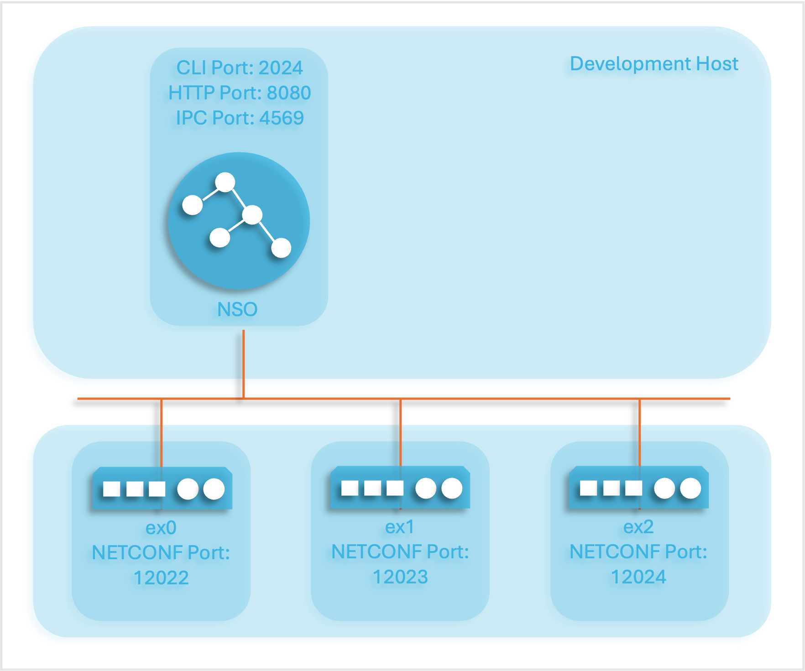
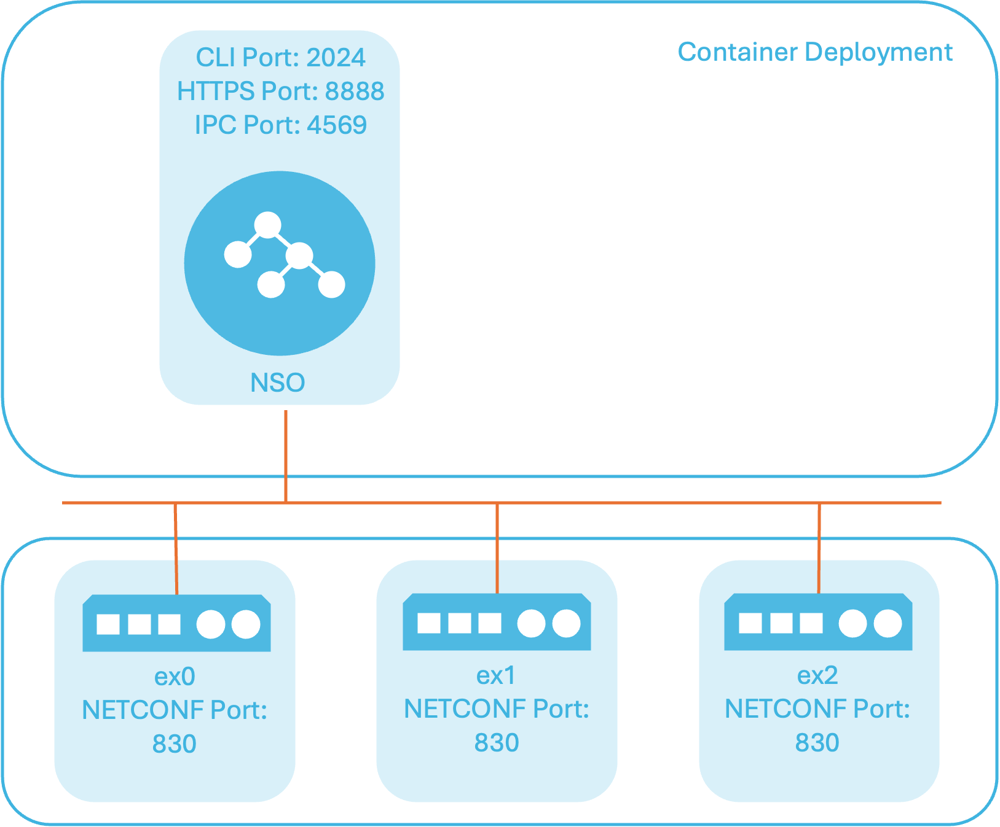

# Developing and Deploying a Nano Service

This section shows how to develop and deploy a simple NSO nano service for managing the provisioning of SSH public keys for authentication. For more details on nano services, see [Nano Services for Staged Provisioning](../concepts/nano-services-staged-provisioning.md) in Development. The example showcasing development is available under `$NCS_DIR/examples.ncs/development-guide/nano-services/netsim-sshkey`. In addition, there is a reference from the `README` in the example's directory to the deployment version of the example.

## Development <a href="#d5e1323" id="d5e1323"></a>

<figure><figcaption><p>The Development Host Topology</p></figcaption></figure>

After installing NSO with the [Local Install](../../administration/deployment/local-install.md) option, development often begins with either retrieving an existing YANG model representing what the managed network element (a virtual or physical device, such as a router) can do or constructing a new YANG model that at least covers the configuration of interest to an NSO service. To enable NSO service development, the network element's YANG model can be used with NSO's netsim tool that uses ConfD (Configuration Daemon) to simulate the network elements and their management interfaces like NETCONF. Read more about netsim in [Network Simulator](../../operation-and-usage/cli/network-simulator-netsim.md).

The simple network element YANG model used for this example is available under `packages/ne/src/yang/ssh-authkey.yang`. The `ssh-authkey.yang` model implements a list of SSH public keys for identifying a user. The list of keys augments a list of users in the ConfD built-in `tailf-aaa.yang` module that ConfD uses to authenticate users.

```
module ssh-authkey {
  yang-version 1.1;
  namespace "http://example.com/ssh-authkey";
  prefix sa;

  import tailf-common {
    prefix tailf;
  }

  import tailf-aaa {
    prefix aaa;
  }

  description
    "List of SSH authorized public keys";

  revision 2023-02-02 {
    description
      "Initial revision.";
  }

  augment "/aaa:aaa/aaa:authentication/aaa:users/aaa:user" {
    list authkey {
      key pubkey-data;
      leaf pubkey-data {
        type string;
      }
    }
  }
}
```

On the network element, a Python application subscribes to ConfD to be notified of configuration changes to the user's public keys and updates the user's authorized\_keys file accordingly. See `packages/ne/netsim/ssh-authkey.py` for details.

The first step is to create an NSO package from the network element YANG model. Since NSO will use NETCONF over SSH to communicate with the device, the package will be a NETCONF NED. The package can be created using the `ncs-make-package` command or the NETCONF NED builder tool. The `ncs-make-package` command is typically used when the YANG models used by the network element are available. Hence, the packages/ne package for this example was generated using the `ncs-make-package` command.

As the `ssh-authkey.yang` model augments the users list in the ConfD built-in `tailf-aaa.yang` model, NSO needs a representation of that YANG model too to build the NED. However, the service will only configure the user's public keys, so only a subset of the `tailf-aaa.yang` model that only includes the user list is sufficient. To compare, see the `packages/ne/src/yang/tailf-aaa.yang` in the example vs. the network element's version under `$NCS_DIR/netsim/confd/src/confd/aaa/tailf-aaa.yang`.

Now that the network element package is defined, next up is the service package, beginning with finding out what steps are required for NSO to authenticate with the network element using SSH public key authentication:

1. First, generate private and public keys using, for example, the `ssh-keygen` OpenSSH authentication key utility.
2. Distribute the public keys to the ConfD-enabled network element's list of authorized keys.
3. Configure NSO to use public key authentication with the network element.
4. Finally, test the public key authentication by connecting NSO with the network element.

The outline above indicates that the service will benefit from implementing several smaller (nano) steps:

* The first step only generates private and public key files with no configuration. Thus, the first step should be implemented by an action before the second step runs, not as part of the second step transaction `create()` callback code configuring the network elements. The `create()` callback runs multiple times, for example, for service configuration changes, re-deploy, or commit dry-run. Therefore, generating keys should only happen when creating the service instance.
* The third step cannot be executed before the second step is complete, as NSO cannot use the public key for authenticating with the network element before the network element has it in its list of authorized keys.
* The fourth step uses the NSO built-in `connect()` action and should run after the third step finishes.

What configuration input do the above steps need?

* The name of the network element that will authenticate a user with an SSH public key.
* The name of the local NSO user that maps to the remote network element user the public key authenticates.
* The name of the remote network element user.
* A passphrase is used for encrypting the private key, guarding its privacy. The passphrase should be encrypted when storing it in the CDB, just like any other password.
* The name of the NSO authentication group to configure for public-key authentication with the NSO-managed network element.

A service YANG model that implements the above configuration:

```
  container pubkey-dist {
    list key-auth {
      key "ne-name local-user";

      uses ncs:nano-plan-data;
      uses ncs:service-data;
      ncs:servicepoint "distkey-servicepoint";

      leaf ne-name {
        type leafref {
          path "/ncs:devices/ncs:device/ncs:name";
        }
      }
      leaf local-user {
        type leafref {
          path "/ncs:devices/ncs:authgroups/ncs:group/ncs:umap/ncs:local-user";
          require-instance false;
        }
      }
      leaf remote-name {
        type leafref {
          path "/ncs:devices/ncs:authgroups/ncs:group/ncs:umap/ncs:remote-name";
          require-instance false;
        }
        mandatory true;
      }
      leaf authgroup-name {
        type leafref {
          path "/ncs:devices/ncs:authgroups/ncs:group/ncs:name";
          require-instance false;
        }
        mandatory true;
      }
      leaf passphrase {
        // Leave unset for no passphrase
        tailf:suppress-echo true;
        type tailf:aes-256-cfb-128-encrypted-string {
          length "10..max" {
            error-message "The passphrase must be at least 10 characters long";
          }
          pattern ".*[a-z]+.*" {
            error-message "The passphrase must have at least one lower case alpha";
          }
          pattern ".*[A-Z]+.*" {
            error-message "The passphrase must have at least one upper case alpha";
          }
          pattern ".*[0-9]+.*" {
            error-message "The passphrase must have at least one digit";
          }
          pattern ".*[<>~;:!@#/$%^&*=-]+.*" {
            error-message "The passphrase must have at least one of these" +
                          " symbols: [<>~;:!@#/$%^&*=-]+";
          }
          pattern ".* .*" {
            modifier invert-match;
            error-message "The passphrase must have no spaces";
          }
        }
      }
      ...
    }
  }
```

For details on the YANG statements used by the YANG model, such as `leaf`, `container`, `list`, `leafref`, `mandatory`, `length`, `pattern`, etc., see the [IETF RFC 7950](https://www.rfc-editor.org/rfc/rfc7950) that documents the YANG 1.1 Data Modeling Language. The `tailf:xyz` are YANG extension statements documented by [tailf\_yang\_extensions(5)](https://developer.cisco.com/docs/nso-guides-6.1/#!ncs-man-pages-volume-5/man.5.tailf\_yang\_extensions) in Manual Pages.

The service configuration is implemented in YANG by a `key-auth` list where the network element and local user names are the list keys. In addition, the list has a `distkey-servicepoint` service point YANG extension statement to enable the list parameters used by the Python service callbacks that this example implements. Finally, the used `service-data` and `nano-plan-data` groupings add the common definitions for a service and the plan data needed when the service is a nano service.

For the nano service YANG part, an NSO YANG nano service behavior tree extension that references a plan outline extension implements the above steps for setting up SSH public key authentication with a network element:

```
    ncs:plan-outline distkey-plan {
    description "Plan for distributing a public key";
    ncs:component-type "dk:ne" {
      ncs:state "ncs:init";
      ncs:state "dk:generated" {
        ncs:create {
          // Request the generate-keys action
          ncs:post-action-node "$SERVICE" {
            ncs:action-name "generate-keys";
            ncs:result-expr "result = 'true'";
            ncs:sync;
          }
        }
        ncs:delete {
          // Request the delete-keys action
          ncs:post-action-node "$SERVICE" {
            ncs:action-name "delete-keys";
            ncs:result-expr "result = 'true'";
          }
        }
      }
      ncs:state "dk:distributed" {
        ncs:create {
          // Invoke a Python program to distribute the authorized public key to
          // the network element
          ncs:nano-callback;
          ncs:force-commit;
        }
      }
      ncs:state "dk:configured" {
        ncs:create {
          // Invoke a Python program that in turn invokes a service template to
          // configure NSO to use public key authentication with the network
          // element
          ncs:nano-callback;
          // Request the connect action to test the public key authentication
          ncs:post-action-node "/ncs:devices/device[name=$NE-NAME]" {
            ncs:action-name "connect";
            ncs:result-expr "result = 'true'";
          }
        }
      }
      ncs:state "ncs:ready";
    }
  }
  ncs:service-behavior-tree distkey-servicepoint {
    description "One component per distkey behavior tree";
    ncs:plan-outline-ref "dk:distkey-plan";
    ncs:selector {
      // The network element name used with this component
      ncs:variable "NE-NAME" {
        ncs:value-expr "current()/ne-name";
      }
      // The unique component name
      ncs:variable "NAME" {
        ncs:value-expr "concat(current()/ne-name, '-', current()/local-user)";
      }
      // Component for setting up public key authentication
      ncs:create-component "$NAME" {
        ncs:component-type-ref "dk:ne";
      }
    }
  }
```

The nano `service-behavior-tree` for the service point creates a nano service component for each list entry in the `key-auth` list. The last connection verification step of the nano service, the `connected` state, uses the `NE-NAME` variable. The `NAME` variable concatenates the `ne-name` and `local-user` keys from the `key-auth` list to create a unique nano service component name.

The only step that requires both a create and delete part is the `generated` state action that generates the SSH keys. If a user deletes a service instance and another network element does not currently use the generated keys, this deletes the keys too. NSO will revert the configuration automatically as part of the FASTMAP algorithm. Hence, the service list instances also need actions for generating and deleting keys.

```
  container pubkey-dist {
    list key-auth {
      key "ne-name local-user";
      ...
      action generate-keys {
        tailf:actionpoint generate-keys;
        output {
          leaf result {
            type boolean;
          }
        }
      }
      action delete-keys {
        tailf:actionpoint delete-keys;
        output {
          leaf result {
            type boolean;
          }
        }
      }
    }
  }
```

The actions have no input statements, as the input is the configuration in the service instance list entry.

The `generated` state uses the `ncs:sync` statement to ensure that the keys exist before the `distributed` state runs. Similarly, the `distributed` state uses the `force-commit` statement to commit the configuration to the NSO CDB and the network elements before the `configured` state runs.

See the `packages/distkey/src/yang/distkey.yang` YANG model for the nano service behavior tree, plan outline, and service configuration implementation.

Next, handling the key generation, distributing keys to the network element, and configuring NSO to authenticate using the keys with the network element requires some code, here written in Python, implemented by the `packages/distkey/python/distkey/distkey-app.py` script application.

The Python script application defines a Python `DistKeyApp` class specified in the `packages/distkey/package-meta-data.xml` file that NSO starts in a Python thread. This Python class inherits  `ncs.application.Application` and implements the `setup()` and `teardown()` methods. The `setup()` method registers the nano service `create()` callbacks and the action handlers for generating and deleting the key files. Using the nano service state to separate the two nano service `create()` callbacks for the distribution and NSO configuration of keys, only one Python class, the `DistKeyServiceCallbacks` class, is needed to implement them.

```
class DistKeyApp(ncs.application.Application):
    def setup(self):
        # Nano service callbacks require a registration for a service point,
        # component, and state, as specified in the corresponding data model
        # and plan outline.
        self.register_nano_service('distkey-servicepoint',  # Service point
                                    'dk:ne',                 # Component
                                    'dk:distributed',        # State
                                    DistKeyServiceCallbacks)
        self.register_nano_service('distkey-servicepoint',  # Service point
                                    'dk:ne',                 # Component
                                    'dk:configured',         # State
                                    DistKeyServiceCallbacks)

        # Side effect action that uses ssh-keygen to create the keyfiles
        self.register_action('generate-keys', GenerateActionHandler)
        # Action to delete the keys created by the generate keys action
        self.register_action('delete-keys', DeleteActionHandler)

    def teardown(self):
        self.log.info('DistKeyApp FINISHED')
```

The action for generating keys calls the OpenSSH `ssh-keygen` command to generate the private and public key files. Calling `ssh-keygen` is kept out of the service `create()` callback to avoid the key generation running multiple times, for example, for service changes, re-deploy, or dry-run commits. Also, NSO encrypts the passphrase used when generating the keys for added security, see the YANG model, so the Python code decrypts it before using it with the `ssh-keygen` command.

```
class GenerateActionHandler(Action):
    @Action.action
    def cb_action(self, uinfo, name, keypath, ainput, aoutput, trans):
        '''Action callback'''
        service = ncs.maagic.get_node(trans, keypath)
        # Install the crypto keys used to decrypt the service passphrase leaf
        # as input to the key generation.
        with ncs.maapi.Maapi() as maapi:
            _maapi.install_crypto_keys(maapi.msock)
        # Decrypt the passphrase leaf for use when generating the keys
        encrypted_passphrase = service.passphrase
        decrypted_passphrase = _ncs.decrypt(str(encrypted_passphrase))
        aoutput = True
        # If it does not exist already, generate a private and public key
        if os.path.isfile(f'./{service.local_user}_ed25519') == False:
            result = subprocess.run(['ssh-keygen', '-N',
                                    f'{decrypted_passphrase}', '-t', 'ed25519',
                                    '-f', f'./{service.local_user}_ed25519'],
                                    stdout=subprocess.PIPE, check=True,
                                    encoding='utf-8')
            if "has been saved" not in result.stdout:
                aoutput = False
```

The `DeleteActionHandler` action deletes the key files if no more network elements use the user's keys:

```
class DeleteActionHandler(Action):
    @Action.action
    def cb_action(self, uinfo, name, keypath, ainput, aoutput, trans):
        '''Action callback'''
        service = ncs.maagic.get_node(trans, keypath)
        # Only delete the key files if no more network elements use this
        # user's keys
        cur = trans.cursor('/pubkey-dist/key-auth')
        remove_key = True
        while True:
            try:
                value = next(cur)
                if value[0] != service.ne_name and value[1] == service.local_user:
                    remove_key = False
                    break
            except StopIteration:
                break
        aoutput = True
        if remove_key is True:
            try:
                os.remove(f'./{service.local_user}_ed25519.pub')
                os.remove(f'./{service.local_user}_ed25519')
            except OSError as e:
                if e.errno != errno.ENOENT:
                    aoutput = False
```

The Python class for the nano service `create()` callbacks handles both the distribution and NSO configuration of the keys. The `dk:distributed` state `create()` callback code adds the public key data to the network element's list of authorized keys. For the `create()` call for the `dk:configured` state, a template is used to configure NSO to use public key authentication with the network element. The template can be called directly from the nano service, but in this case, it needs to be called from the Python code to input the current working directory to the template:

```
class DistKeyServiceCallbacks(NanoService):
    @NanoService.create
    def cb_nano_create(self, tctx, root, service, plan, component, state,
                        proplist, component_proplist):
        '''Nano service create callback'''
        if state == 'dk:distributed':
            # Distribute the public key to the network element's authorized
            # keys list
            with open(f'./{service.local_user}_ed25519.pub', 'r') as f:
                pubkey_data = f.read()
                config = root.devices.device[service.ne_name].config
                users = config.aaa.authentication.users
                users.user[service.local_user].authkey.create(pubkey_data)
        elif state == 'dk:configured':
            # Configure NSO to use a public key for authentication with
            # the network element
            template_vars = ncs.template.Variables()
            template_vars.add('CWD', os.getcwd())
            template = ncs.template.Template(service)
            template.apply('distkey-configured', template_vars)
```

The template to configure NSO to use public key authentication with the network element is available under `packages/distkey/templates/distkey-configured.xml`:

```
<config-template xmlns="http://tail-f.com/ns/config/1.0">
  <devices xmlns="http://tail-f.com/ns/ncs" tags="merge">
    <authgroups>
      <group>
        <name>{authgroup-name}</name>
        <umap>
          <local-user>{local-user}</local-user>
          <remote-name>{remote-name}</remote-name>
          <public-key>
            <private-key>
              <file>
                <name>{$CWD}/{local-user}_ed25519</name>
                <passphrase>{passphrase}</passphrase>
              </file>
            </private-key>
          </public-key>
        </umap>
      </group>
    </authgroups>
    <device>
      <name>{ne-name}</name>
      <authgroup>{authgroup-name}</authgroup>
    </device>
  </devices>
</config-template>}
```

The example uses three scripts to showcase the nano service:

* A shell script, `showcase.sh`, which uses the `ncs_cli` program to run CLI commands via the NSO IPC port.
* A Python script, `showcase-rc.sh`, which uses the `requests` package for RESTCONF edit operations and receiving event notifications.
* A Python script that uses NSO MAAPI, `showcase-maapi.sh`, via the NSO IPC port.

The `ncs_cli` program identifies itself with NSO as the `admin` user without authentication, and the RESTCONF client uses plain HTTP and basic user password authentication. All three scripts demonstrate the service by generating keys, distributing the public key, and configuring NSO for public key authentication with the network elements. To run the example, see the instructions in the `README` file of the example.

## Deployment <a href="#d5e1474" id="d5e1474"></a>

See the `README` in the `netsim-sshkey` example's directory for a reference to an NSO system installation in a container deployment variant.

<figure><figcaption><p>The Deployment Container Topology</p></figcaption></figure>

The deployment variant differs from the development example by:

* Installing NSO with a system installation for deployment instead of a local installation suitable for development
* Addressing NSO security by running NSO as the `admin` user and authenticating using a public key and token.
* Rotating NSO logs to avoid running out of disk space
* Installing the `distkey` service package and `ne` NED package at startup
* The NSO CLI showcase script uses SSH with public key authentication instead of the **ncs\_cli** program over unsecured IPC
* There is no Python MAAPI showcase script. Use RESTCONF over HTTPS with Python instead of Python MAAPI over unsecured IPC.
* Having NSO and the network elements (simulated by the ConfD subscriber application) run in separate containers
* NSO is either pre-installed in the NSO production container image or installed in a generic Linux container.

The deployment example sets up a minimal production installation where the NSO process runs as the `admin` OS user, relying on PAM authentication for the `admin` and `oper` NSO users. The `admin` user is authenticated over SSH using a public key for CLI and NETCONF access and over RESTCONF HTTPS using a token. The read-only `oper` user uses password authentication. The `oper` user can access the NSO WebUI over HTTPS port 443 from the container host.

A modified version of the NSO configuration file `ncs.conf` from the example running with a local install NSO is located in the `$NCS_CONFIG_DIR` (`/etc/ncs`) directory. The `packages`, `ncs-cdb`, `state`, and `scripts` directories are now under the `$NCS_RUN_DIR` (`/var/opt/ncs`) directory. The log directory is now the `$NCS_LOG_DIR` (`/var/log/ncs`) directory. Finally, the `$NCS_DIR` variable points to `/opt/ncs/current`.

Two scripts showcase the nano service:

* A shell script that runs NSO CLI commands over SSH.
* A Python script that uses the `requests` package to perform edit operations and receive event notifications.

As with the development version, both scripts will demo the service by generating keys, distributing the public key, and configuring NSO for public key authentication with the network elements.

To run the example and for more details, see the instructions in the `README` file of the deployment example.
