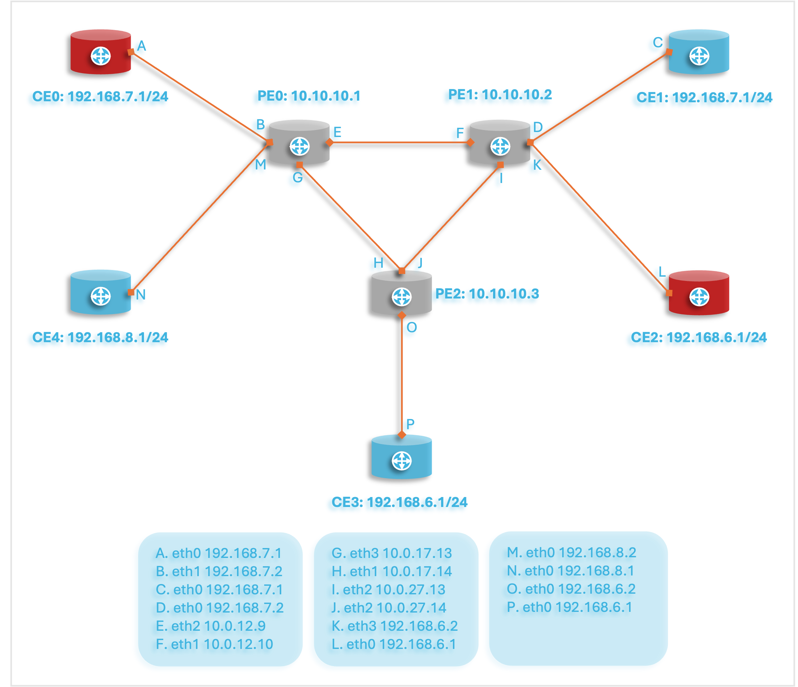

# Developing Packages

When setting up an application project, there are several things to think about. A service package needs a service model, NSO configuration files, and mapping code. Similarly, NED packages need YANG files and NED code. We can either copy an existing example and modify that, or we can use the tool `ncs-make-package` to create an empty skeleton for a package for us. The `ncs-make-package` tool provides a good starting point for a development project. Depending on the type of package, we use `ncs-make-package` to set up a working development structure.

As explained in [NSO Packages](../concepts/packages.md), NSO runs all user Java code and also loads all data models through an NSO package. Thus, a development project is the same as developing a package. Testing and running the package is done by putting the package in the NSO load-path and running NSO.

There are different kinds of packages; NED packages, service packages, etc. Regardless of package type, the structure of the package as well as the deployment of the package into NSO is the same. The script `ncs-make-package` creates the following for us:

* A Makefile to build the source code of the package. The package contains source code and needs to be built.
* If it's a NED package, a `netsim` directory that is used by the `ncs-netsim` tool to simulate a network of devices.
* If it is a service package, skeleton YANG and Java files that can be modified are generated.

In this section, we will develop an MPLS service for a network of provider edge routers (PE) and customer equipment routers (CE). The assumption is that the routers speak NETCONF and that we have proper YANG modules for the two types of routers. The techniques described here work equally well for devices that speak other protocols than NETCONF, such as Cisco CLI or SNMP.

We first want to create a simulation environment where ConfD is used as a NETCONF server to simulate the routers in our network. We plan to create a network that looks like this:

<figure><figcaption><p>MPLS Network</p></figcaption></figure>

To create the simulation network, the first thing we need to do is create NSO packages for the two router models. The packages are also exactly what NSO needs to manage the routers.

Assume that the yang files for the PE routers reside in `./pe-yang-files` and the YANG files for the CE routers reside in `./ce-yang-files` The `ncs-make-package` tool is used to create two device packages, one called `pe` and the other `ce`.

```
 $ ncs-make-package --netconf-ned ./pe-yang-files pe
 $ ncs-make-package --netconf-ned ./ce-yang-files ce
 $ (cd pe/src; make)
 $ (cd pe/src; make)
```

At this point, we can use the `ncs-netsim` tool to create a simulation network. `ncs-netsim` will use the Tail-f ConfD daemon as a NETCONF server to simulate the managed devices, all running on localhost.

```
 $ ncs-netsim create-network ./ce 5 ce create-network ./pe 3 pe
```

The above command creates a network with 8 routers, 5 running the YANG models for a CE router and 3 running a YANG model for the PE routers. `ncs-netsim` can be used to stop, start, and manipulate this network. For example:

```
$ ncs-netsim start
DEVICE ce0 OK STARTED
DEVICE ce1 OK STARTED
DEVICE ce2 OK STARTED
DEVICE ce3 OK STARTED
DEVICE ce4 OK STARTED
DEVICE pe0 OK STARTED
DEVICE pe1 OK STARTED
DEVICE pe2 OK STARTED
```

## `ncs-setup` <a href="#d5e5258" id="d5e5258"></a>

In the previous section, we described how to use `ncs-make-package` and `ncs-netsim` to set up a simulation network. Now, we want to use NCS to control and manage precisely the simulated network. We can use the `ncs-setup` tool setup a directory suitable for this. `ncs-setup` has a flag to set up NSO initialization files so that all devices in a `ncs-netsim` network are added as managed devices to NSO. If we do:

```
 $ ncs-setup --netsim-dir ./netsim --dest NCS;
 $ cd NCS
 $ cat README.ncs
 .......
 $ ncs
```

The above commands, db, log, etc., directories and also create an NSO XML initialization file in `./NCS/ncs-cdb/netsim_devices_init.xml`. The `init` file is important; it is created from the content of the netsim directory and it contains the IP address, port, auth credentials, and NED type for all the devices in the netsim environment. There is a dependency order between `ncs-setup` and `ncs-netsim` since `ncs-setup` creates the XML init file based on the contents in the netsim environment; therefore we must run the `ncs-netsim create-network` command before we execute the `ncs-setup` command. Once `ncs-setup` has been run, and the `init` XML file has been generated, it is possible to manually edit that file.

If we start the NSO CLI, we have for example :

```
$ ncs_cli -u admin
admin connected from 127.0.0.1 using console on zoe
admin@zoe> show configuration devices device ce0
address   127.0.0.1;
port      12022;
authgroup default;
device-type {
    netconf;
}
state {
    admin-state unlocked;
}
```

## The netsim Part of a NED Package <a href="#d5e5273" id="d5e5273"></a>

If we take a look at the directory structure of the generated NETCONF NED packages, we have in `./ce`

```
|----package-meta-data.xml
|----private-jar
|----shared-jar
|----netsim
|----|----start.sh
|----|----confd.conf.netsim
|----|----Makefile
|----src
|----|----ncsc-out
|----|----Makefile
|----|----yang
|----|----|----interfaces.yang
|----|----java
|----|----|----build.xml
|----|----|----src
|----|----|----|----com
|----|----|----|----|----example
|----|----|----|----|----|----ce
|----|----|----|----|----|----|----namespaces
|----doc
|----load-dir
```

It is a NED package, and it has a directory called `netsim` at the top. This indicates to the `ncs-netsim` tool that `ncs-netsim` can create simulation networks that contain devices running the YANG models from this package. This section describes the `netsim` directory and how to modify it. `ncs-netsim` uses ConfD to simulate network elements, and to fully understand how to modify a generated `netsim` directory, some knowledge of how ConfD operates may be required.

The `netsim` directory contains three files:

* `confd.conf.netsim` is a configuration file for the ConfD instances. The file will be `/bin/sed` substituted where the following list of variables will be substituted for the actual value for that ConfD instance:
  1. `%IPC_PORT%` for `/confdConfig/confdIpcAddress/port`
  2. `%NETCONF_SSH_PORT%` - for `/confdConfig/netconf/transport/ssh/port`
  3. `%NETCONF_TCP_PORT%` - for `/confdConfig/netconf/transport/tcp/port`
  4. `%CLI_SSH_PORT%` - for `/confdConfig/cli/ssh/port`
  5. `%SNMP_PORT%` - for `/confdConfig/snmpAgent/port`
  6. `%NAME%` - for the name of the ConfD instance.
  7. `%COUNTER%` - for the number of the ConfD instance
* The `Makefile` should compile the YANG files so that ConfD can run them. The `Makefile` should also have an `install` target that installs all files required for ConfD to run one instance of a simulated network element. This is typically all `fxs` files.
* An optional `start.sh` file where additional programs can be started. A good example of a package where the netsim component contains some additional C programs is the `webserver` package in the NSO website example `$NCS_DIR/web-server-farm`.

Remember the picture of the network we wish to work with, there the routers, PE and CE, have an IP address and some additional data. So far here, we have generated a simulated network with YANG models. The routers in our simulated network have no data in them, we can log in to one of the routers to verify that:

```
$    ncs-netsim cli pe0
admin connected from 127.0.0.1 using console on zoe
admin@zoe> show configuration interface
No entries found.
[ok][2012-08-21 16:52:19]
admin@zoe> exit
```

The ConfD devices in our simulated network all have a Juniper CLI engine, thus we can, using the command `ncs-netsim cli [devicename]`, log in to an individual router.

To achieve this, we need to have some additional XML initializing files for the ConfD instances. It is the responsibility of the `install` target in the netsim Makefile to ensure that each ConfD instance gets initialized with the proper init data. In the NSO example collection, the example `$NCS_DIR/examples.ncs/mpls` contains precisely the two above-mentioned PE and CE packages but modified, so that the network elements in the simulated network get initialized properly.

If we run that example in the NSO example collection we see:

```
  $ cd $NCS_DIR/examples.ncs/mpls/mpls-devices
  $ make all
    ....
  $ ncs-netsim start
    .....
  $ ncs
  $ ncs_cli -u admin

admin connected from 127.0.0.1 using console on zoe
admin@zoe> show status packages package pe
package-version 1.0;
description     "Generated netconf package";
ncs-min-version 2.0;
component pe {
    ned {
        netconf;
        device {
            vendor "Example Inc.";
        }
    }
}
oper-status {
    up;
}
[ok][2012-08-22 14:45:30]
admin@zoe> request devices sync-from
sync-result {
    device ce0
    result true
}
sync-result {
    device ce1
    result true
}
sync-result {
   .......
admin@zoe> show configuration devices device pe0 config if:interface
interface eth2 {
    ip   10.0.12.9;
    mask 255.255.255.252;
}
interface eth3 {
    ip   10.0.17.13;
    mask 255.255.255.252;
}
interface lo {
    ip   10.10.10.1;
    mask 255.255.0.0;
}
```

A fully simulated router network loaded into NSO, with ConfD simulating the 7 routers.

## Plug-and-play Scripting <a href="#ug.scripting_devel" id="ug.scripting_devel"></a>

With the scripting mechanism, an end-user can add new functionality to NSO in a plug-and-play-like manner. See [Plug-and-play Scripting](../../operation-and-usage/ops/plug-and-play-scripting.md) about the scripting concept in general. It is also possible for a developer of an NSO package to enclose scripts in the package.

Scripts defined in an NSO package work pretty much as system-level scripts configured with the `/ncs-config/scripts/dir` configuration parameter. The difference is that the location of the scripts is predefined. The scripts directory must be named `scripts` and must be located in the top directory of the package.

In this complete example `examples.ncs/getting-started/developing-with-ncs/11-scripting`, there is a `README` file and a simple post-commit script `packages/scripting/scripts/post-commit/show_diff.sh` as well as a simple command script `packages/scripting/scripts/command/echo.sh`.

## Creating a Service Package <a href="#d5e5354" id="d5e5354"></a>

So far we have only talked about packages that describe a managed device, i.e., `ned` packages. There are also `callback`, `application`, and `service` packages. A service package is a package with some YANG code that models an NSO service together with Java code that implements the service. See [Implementing Services](developing-services/implementing-services.md).

We can generate a service package skeleton, using `ncs-make-package`, as:

```
  $ ncs-make-package --service-skeleton java myrfs
  $ cd test/src; make
```

Make sure that the package is part of the load path, and we can then create test service instances that do nothing.

```
admin@zoe> show status packages package myrfs
package-version 1.0;
description     "Skeleton for a resource facing service - RFS";
ncs-min-version 2.0;
component RFSSkeleton {
    callback {
        java-class-name [ com.example.myrfs.myrfs ];
    }
}
oper-status {
    up;
}
[ok][2012-08-22 15:30:13]
admin@zoe> configure
Entering configuration mode private
[ok][2012-08-22 15:32:46]

[edit]
admin@zoe% set services myrfs s1 dummy 3.4.5.6
[ok][2012-08-22 15:32:56]
```

The `ncs-make-package` will generate skeleton files for our service models and for our service logic. The package is fully buildable and runnable even though the service models are empty. Both CLI and Webui can be run. In addition to this, we also have a simulated environment with ConfD devices configured with YANG modules.

Calling `ncs-make-package` with the arguments above will create a service skeleton that is placed in the root in the generated service model. However, services can be augmented anywhere or can be located in any YANG module. This can be controlled by giving an argument `--augment NAME` where `NAME` is the path to where the service should be augmented, or in the case of putting the service as a root container in the service YANG this can be controlled by giving the argument `--root-container NAME`.

Services created using `ncs-make-package` will be of type `list`. However, it is possible to have services that are of type `container` instead. A container service needs to be specified as a _presence_ container.

## Java Service Implementation <a href="#d5e5382" id="d5e5382"></a>

The service implementation logic of a service can be expressed using the Java language. For each such service, a Java class is created. This class should implement the `create()` callback method from the `ServiceCallback` interface. This method will be called to implement the service-to-device mapping logic for the service instance.

We declare in the component for the package, that we have a callback component. In the `package-meta-data.xml` for the generated package, we have:

```
  <component>
    <name>RFSSkeleton</name>
    <callback>
      <java-class-name>com.example.myrfs.myrfs</java-class-name>
    </callback>
  </component>
```

When the package is loaded, the NSO Java VM will load the jar files for the package, and register the defined class as a callback class. When the user creates a service of this type, the `create()` method will be called.

## Developing our First Service Application <a href="#d5e5392" id="d5e5392"></a>

In the following sections, we are going to show how to write a service application through several examples. The purpose of these examples is to illustrate the concepts described in previous chapters.

* Service Model - a model of the service you want to provide.
* Service Validation Logic - a set of validation rules incorporated into your model.
* Service Logic - a Java class mapping the service model operations onto the device layer.

If we take a look at the Java code in the service generated by `ncs-make-package`, first we have the `create()` which takes four parameters. The ServiceContext instance is a container for the current service transaction, with this e.g. the transaction timeout can be controlled. The container `service` is a `NavuContainer` holding a read/write reference to the path in the instance tree containing the current service instance. From this point, you can start accessing all nodes contained within the created service. The `root` container is a `NavuContainer` holding a reference to the NSO root. From here you can access the whole data model of the NSO. The `opaque` parameter contains a `java.util.Properties` object instance. This object may be used to transfer additional information between consecutive calls to the create callback. It is always null in the first callback method when a service is first created. This Properties object can be updated (or created if null) but should always be returned.


```
    @ServiceCallback(servicePoint="myrfsspnt",
        callType=ServiceCBType.CREATE)
    public Properties create(ServiceContext context,
                             NavuNode service,
                             NavuNode root,
                             Properties opaque)
                             throws DpCallbackException {
        String servicePath = null;
        try {
            servicePath = service.getKeyPath();

            //Now get the single leaf we have in the service instance
            // NavuLeaf sServerLeaf = service.leaf("dummy");

            //..and its value (which is a ipv4-address )
            // ConfIPv4 ip = (ConfIPv4)sServerLeaf.value();

            //Get the list of all managed devices.
            NavuList managedDevices = root.container("devices").list("device");

            // iterate through all manage devices
            for(NavuContainer deviceContainer : managedDevices.elements()){

                // here we have the opportunity to do something with the
                // ConfIPv4 ip value from the service instance,
                // assume the device model has a path /xyz/ip, we could
                // deviceContainer.container("config").
                //         .container("xyz").leaf(ip).set(ip);
                //
                // remember to use NAVU sharedCreate() instead of
                // NAVU create() when creating structures that may be
                // shared between multiple service instances
            }
        } catch (NavuException e) {
            throw new DpCallbackException("Cannot create service " +
                                          servicePath, e);
        }
        return opaque;
    }
```


The opaque object is extremely useful for passing information between different invocations of the `create()` method. The returned `Properties` object instance is stored persistently. If the create method computes something on its first invocation, it can return that computation to have it passed in as a parameter on the second invocation.

This is crucial to understand, the Mapping Logic fastmap mode relies on the fact that a modification of an existing service instance can be realized as a full deletion of what the service instance created when the service instance was first created, followed by yet another create, this time with slightly different parameters. The NSO transaction engine will then compute the minimal difference and send southbound to all involved managed devices. Thus a good service instance `create()` method will - when being modified - recreate exactly the same structures it created the first time.

The best way to debug this and to ensure that a modification of a service instance really only sends the minimal NETCONF diff to the southbound managed devices, is to turn on NETCONF trace in the NSO, modify a service instance, and inspect the XML sent to the managed devices. A badly behaving `create()` method will incur large reconfigurations of the managed devices, possibly leading to traffic interruptions.

It is highly recommended to also implement a `selftest()` action in conjunction with a service. The purpose of the `selftest()` action is to trigger a test of the service. The `ncs-make-package` tool creates an `selftest()` action that takes no input parameters and has two output parameters.


```
      tailf:action self-test {
        tailf:info "Perform self-test of the service";
        tailf:actionpoint myrfsselftest;
        output {
          leaf success {
            type boolean;
          }
          leaf message {
            type string;
            description
              "Free format message.";
          }
        }
```


The `selftest()` implementation is expected to do some diagnosis of the service. This can possibly include the use of testing equipment or probes.


```
    /**
     * Init method for selftest action
     */
    @ActionCallback(callPoint="myrfsselftest", callType=ActionCBType.INIT)
    public void init(DpActionTrans trans) throws DpCallbackException {
    }

    /**
     * Selftest action implementation for service
     */
    @ActionCallback(callPoint="myrfsselftest", callType=ActionCBType.ACTION)
    public ConfXMLParam[] selftest(DpActionTrans trans, ConfTag name,
                                   ConfObject[] kp, ConfXMLParam[] params)
    throws DpCallbackException {
        try {
            // Refer to the service yang model prefix
            String nsPrefix = "myrfs";
            // Get the service instance key
            String str = ((ConfKey)kp[0]).toString();

          return new ConfXMLParam[] {
              new ConfXMLParamValue(nsPrefix, "success", new ConfBool(true)),
              new ConfXMLParamValue(nsPrefix, "message", new ConfBuf(str))};

        } catch (Exception e) {
            throw new DpCallbackException("selftest failed", e);
        }
    }
```


## Tracing Within the NSO Service Manager

The NSO Java VM logging functionality is provided using LOG4J. The logging is composed of a configuration file (`log4j2.xml`) where static settings are made i.e. all settings that could be done for LOG4J (see [LOG4J](https://logging.apache.org/log4j/2.x/) for more comprehensive log settings). There are also dynamically configurable log settings under `/java-vm/java-logging`.

When we start the NSO Java VM in `main()` the `log4j2.xml` log file is parsed by the LOG4J framework and it applies the static settings to the NSO Java VM environment. The file is searched for in the Java CLASSPATH.

NSO Java VM starts several internal processes or threads. One of these threads executes a service called `NcsLogger` which handles the dynamic configurations of the logging framework. When `NcsLogger` starts, it initially reads all the configurations from `/java-vm/java-logging` and applies them, thus overwriting settings that were previously parsed by the LOG4J framework.

After it has applied the changes from the configuration it starts to listen to changes that are made under `/java-vm/java-logging`.

The LOG4J framework has 8 verbosity levels: `ALL`,`DEBUG`,`ERROR`,`FATAL`,`INFO`,`OFF`,`TRACE`, and `WARN`. They have the following relations: `ALL` > `TRACE` > `DEBUG` > `INFO` > `WARN` > `ERROR` > `FATAL` > `OFF`. This means that the highest verbosity that we could have is the level `ALL` and the lowest is no traces at all, i.e., `OFF`. There are corresponding enumerations for each LOG4J verbosity level in `tailf-ncs.yang`, thus the `NcsLogger` does the mapping between the enumeration type: `log-level-type` and the LOG4J verbosity levels.


```
 typedef log-level-type {
    type enumeration {
      enum level-all {
        value 1;
      }
      enum level-debug {
        value 2;
      }
      enum level-error {
        value 3;
      }
      enum level-fatal {
        value 4;
      }
      enum level-info {
        value 5;
      }
      enum level-off {
        value 6;
      }
      enum level-trace {
        value 7;
      }
      enum level-warn {
        value 8;
      }
    }
    description
      "Levels of logging for Java packages in log4j.";
  }

  ....

  container java-vm {
    ....
    container java-logging {
      tailf:info "Configure Java Logging";
      list logger {
        tailf:info "List of loggers";
        key "logger-name";
        description
          "Each entry in this list holds one representation of a logger with
           a specific level defined by log-level-type. The logger-name
           is the name of a Java package.  logger-name can thus be for
           example com.tailf.maapi, or com.tailf etc.";

        leaf logger-name {
          tailf:info "The name of the Java package";
          type string;
          mandatory true;
          description
            "The name of the Java package for which this logger
             entry applies.";
        }
        leaf level {
          tailf:info "Log-level for this logger";
          type log-level-type;
          mandatory true;
          description
            "Corresponding log-level for a specific logger.";
        }
      }
    }
```


To change a verbosity level one needs to create a logger. A logger is something that controls the logging of certain parts of the NSO Java API.

The loggers in the system are hierarchically structured which means that there is one root logger that always exists. All descendants of the root logger inherit their settings from the root logger if the descendant logger doesn't overwrite its settings explicitly.

The LOG4J loggers are mapped to the package level in NSO Java API so the root logger that exits has a direct descendant which is the package: `com` and it has in turn a descendant `com.tailf`.

The `com.tailf` logger has a direct descendant that corresponds to every package in the system for example: `com.tailf.cdb, com.tailf.maapi` etc.

As in the default case, one could configure a logger in the static settings that is in a `log4j2.properties` file this would mean that we need to explicitly restart the NSO Java VM,or one could alternatively configure a logger dynamically if an NSO restart is not desired.

Recall that if a logger is not configured explicitly then it will inherit its settings from its predecessors. To overwrite a logger setting we create a logger in NSO.

To create a logger, for example, let's say that one uses Maapi API to read and write configuration changes in NSO. We want to show all traces including `INFO` level traces. To enable INFO traces for Maapi classes (located in the package `com.tailf.maapi`) during runtime we start for example a CLI session and create a logger called c`om.tailf.maapi`.

```
ncs@admin% set java-vm java-logging logger com.tailf.maapi level level-info
[ok][2010-11-05 15:11:47]
ncs@admin% commit
Commit complete.
```

When we commit our changes to CDB the NcsLogger will notice that a change has been made under `/java-vm/java-logging`, it will then apply the logging settings to the logger `com.tailf.maapi` that we just created. We explicitly set the `INFO` level to that logger. All the descendants from `com.tailf.maapi` will automatically inherit their settings from that logger.

So where do the traces go? The default configuration (in `log4j2.properties`): `appender.dest1.type=Console` the LOG4J framework forwards all traces to stdout/stderr.

In NSO, all `stdout`/`stderr` goes first through the service manager. The service manager has a configuration under `/java-vm/stdout-capture` that controls where the `stdout`/`stderr` will end up.

The default setting is in a file called `./ncs-java-vm.log`.


```
    container stdout-capture {
      tailf:info "Capture stdout and stderr";
      description
        "Capture stdout and stderr from the Java VM.

         Only applicable if auto-start is 'true'.";
      leaf enabled {
        tailf:info "Enable stdout and stderr capture";
        type boolean;
        default true;
      }
      leaf file {
        tailf:info "Write Java VM output to file";
        type string;
        default "./ncs-java-vm.log";
        description
          "Write Java VM output to filename.";
      }
      leaf stdout {
        tailf:info "Write output to stdout";
        type empty;
        description
          "If present write output to stdout, useful together
           with the --foreground flag to ncs.";
      }
    }
```


It is important to consider that when creating a logger (in this case `com.tailf.maapi`) the name of the logger has to be an existing package known by NSO classloader.

One could also create a logger named `com.tailf` with some desired level. This would set all packages (`com.tailf.*`) to the same level. A common usage is to set `com.tailf` to level `INFO` which would set all traces, including `INFO` from all packages to level `INFO`.

If one would like to turn off all available traces in the system (quiet mode), then configure `com.tailf` or (`com`) to level `OFF`.

There are `INFO` level messages in all parts of the NSO Java API. `ERROR` levels when an exception occurs and some warning messages (level `WARN`) for some places in packages.

There are also protocol traces between the Java API and NSO which could be enabled if we create a logger `com.tailf.conf` with `DEBUG` trace level.

## Controlling Error Messages Info Level from Java <a href="#d5e5501" id="d5e5501"></a>

When processing in the `java-vm` fails, the exception error message is reported back to NCS. This can be more or less informative depending on how elaborate the message is in the thrown exception. Also, the exception can be wrapped one or several times with the original exception indicated as the root cause of the wrapped exception.

In debugging and error reporting, these root cause messages can be valuable to understand what actually happens in the Java code. On the other hand, in normal operations, just a top-level message without too many details is preferred. The exceptions are also always logged in the `java-vm` log but if this log is large it can be troublesome to correlate a certain exception to a specific action in NCS. For this reason, it is possible to configure the level of details shown by NCS for an `java-vm` exception. The leaf `/ncs:java-vm/exception-error-message/verbosity` takes one of three values:

* `standard`: Show the message from the top exception. This is the default.
* `verbose`: Show all messages for the chain of cause exceptions, if any.
* `trace`: Show messages for the chain of cause exceptions with exception class and the trace for the bottom root cause.

Here is an example of how this can be used. In the `web-site` service example, we try to create a service without the necessary pre-preparations:


```
admin@ncs% set services web-site s1 ip 1.2.3.4 port 1111 url x.se
[ok][2013-03-25 10:46:46]

[edit]
admin@ncs% commit
Aborted: Service create failed
[error][2013-03-25 10:46:48]

This is a very generic error message with does not describe what really
happens in the java code. Here the java-vm log has to be analyzed to find
the problem. However, with this cli session open we can from another cli
set the error reporting level to trace:

$ ncs_cli -u admin
admin@ncs> configure
admin@ncs% set java-vm exception-error-message verbosity trace
admin@ncs% commit

If we now in the original cli session issue the commit again we get the
following error message that pinpoint the problem in the code:

admin@ncs% commit
Aborted: [com.tailf.dp.DpCallbackException] Service create failed
Trace : [java.lang.NullPointerException]
        com.tailf.conf.ConfKey.hashCode(ConfKey.java:145)
        java.util.HashMap.getEntry(HashMap.java:361)
        java.util.HashMap.containsKey(HashMap.java:352)
        com.tailf.navu.NavuList.refreshElem(NavuList.java:1007)
        com.tailf.navu.NavuList.elem(NavuList.java:831)
        com.example.websiteservice.websiteservice.WebSiteServiceRFS.crea...
        com.tailf.nsmux.NcsRfsDispatcher.applyStandardChange(NcsRfsDispa...
        com.tailf.nsmux.NcsRfsDispatcher.dispatch(NcsRfsDispatcher.java:...
        sun.reflect.NativeMethodAccessorImpl.invoke0(Native Method)
        sun.reflect.NativeMethodAccessorImpl.invoke(NativeMethodAccessor...
        sun.reflect.DelegatingMethodAccessorImpl.invoke(DelegatingMethod...
        java.lang.reflect.Method.invoke(Method.java:616)
        com.tailf.dp.annotations.DataCallbackProxy.writeAll(DataCallback...
        com.tailf.dp.DpTrans.protoCallback(DpTrans.java:1357)
        com.tailf.dp.DpTrans.read(DpTrans.java:571)
        com.tailf.dp.DpTrans.run(DpTrans.java:369)
        java.util.concurrent.ThreadPoolExecutor.runWorker(ThreadPoolExec...
        java.util.concurrent.ThreadPoolExecutor$Worker.run(ThreadPoolExe...
        java.lang.Thread.run(Thread.java:679)
        com.tailf.dp.DpThread.run(DpThread.java:44)
[error][2013-03-25 10:47:09]
```


## Loading Packages

NSO will, at first start to take the packages found in the load path and copy these into a directory under the supervision of NSO located at `./state/package-in-use`. Later starts of NSO will not take any new copies from the packages `load-path` so changes will not take effect by default. The reason for this is that in normal operation, changing package definition as a side-effect of a restart is an unwanted behavior. Instead, these types of changes are part of an NSO installation upgrade.

During package development as opposed to operations, it is usually desirable that all changes to package definitions in the package load-path take effect immediately. There are two ways to make this happen. Either start `ncs` with the `--with-reload-packages` directive:

```
$ ncs --with-reload-packages
```

Or, set the environment variable `NCS_RELOAD_PACKAGES`, for example like this:

```
$ export NCS_RELOAD_PACKAGES=true
```

It is a strong recommendation to use the `NCS_RELOAD_PACKAGES` environment variable approach since it guarantees that the packages are updated in all situations.

It is also possible to request a running NSO to reload all its packages.

```
admin@iron> request packages reload
```

This request can only be performed in operational mode, and the effect is that all packages will be updated, and any change in YANG models or code will be effectuated. If any YANG models are changed an automatic CDB data upgrade will be executed. If manual (user code) data upgrades are necessary the package should contain an `upgrade` component. This `upgrade` component will be executed as a part of the package reload. See [Writing an Upgrade Package Component](../concepts/using-cdb.md#ncs.cdb.upgrade.comp) for information on how to develop an upgrade component.

If the change in a package does not affect the data model or shared Java code, there is another command:

```
admin@iron> request packages package mypack redeploy
```

This will redeploy the private JARs in the Java VM for the Java package, restart the Python VM for the Python package, and reload the templates associated with the package. However, this command will not be sensitive to changes in the YANG models or shared JARs for the Java package.

## Debugging the Service and Using Eclipse IDE <a href="#d5e5539" id="d5e5539"></a>

By default, NCS will start the Java VM by invoking the command `$NCS_DIR/bin/ncs-start-java-vm` That script will invoke:

```
 $ java com.tailf.ncs.NcsJVMLauncher
```

The class `NcsJVMLauncher` contains the `main()` method. The started Java VM will automatically retrieve and deploy all Java code for the packages defined in the load path in the `ncs.conf` file. No other specification than the `package-meta-data.xml` for each package is needed.

In the NSO CLI, there exist several settings and actions for the NSO Java VM, if we do:

```
$ ncs_cli -u admin

admin connected from 127.0.0.1 using console on iron.local
admin@iron> show configuration java-vm | details
stdout-capture {
    enabled;
    file    ./logs/ncs-java-vm.log;
}
connect-time                   30;
initialization-time            20;
synchronization-timeout-action log-stop;
java-thread-pool {
    pool-config {
        cfg-core-pool-size    5;
        cfg-keep-alive-time   60;
        cfg-maximum-pool-size 256;
    }
}
jmx {
    jndi-address 127.0.0.1;
    jndi-port    9902;
    jmx-address  127.0.0.1;
    jmx-port     9901;
}
[ok][2012-07-12 10:45:59]
```

We see some of the settings that are used to control how the NSO Java VM runs. In particular, here we're interested in `/java-vm/stdout-capture/file`

The NSO daemon will, when it starts, also start the NSO Java VM, and it will capture the stdout output from the NSO Java VM and send it to the file `./logs/ncs-java-vm.log`. For more details on the Java VM settings, see the [NSO Java VM](../concepts/nso-vms/nso-java-vm.md).

Thus if we `tail -f` that file, we get all the output from the Java code. That leads us to the first and most simple way of developing Java code. If we now:

1. Edit our Java code.
2. Recompile that code in the package, e.g `cd ./packages/myrfs/src; make`
3.  Restart the Java code, either through telling NSO to restart the entire NSO Java VM from the NSO CLI (Note, this requires an env variable `NCS_RELOAD_PACKAGES=true`):

    ```
       admin@iron% request java-vm restart
       result Started
       [ok][2012-07-12 10:57:08]
    ```

    \
    Or instructing NSO to just redeploy the package we're currently working on.

    ```
       admin@iron% request packages package stats redeploy
       result true
       [ok][2012-07-12 10:59:01]
    ```

We can then do `tail -f logs/ncs-java-vm.log` to check for printouts and log messages. Typically there is quite a lot of data in the NSO Java VM log. It can sometimes be hard to find our own printouts and log messages. Therefore it can be convenient to use the command below which will make the relevant exception stack traces visible in the CLI.

```
admin@iron% set java-vm exception-error-message verbosity trace
```

It's also possible to dynamically, from the CLI control the level of logging as well as which Java packages that shall log. Say that we're interested in Maapi calls, but don't want the log cluttered with what is really NSO Java library internal calls. We can then do:

```
   admin@iron% set java-vm java-logging logger com.tailf.ncs level level-error
   [ok][2012-07-12 11:10:50]
   admin@iron% set java-vm java-logging logger com.tailf.conf level level-error
   [ok][2012-07-12 11:11:15]
   admin@iron% commit
   Commit complete.
```

Now, considerably less log data will come. If we want these settings to always be there, even if we restart NSO from scratch with an empty database (no `.cdb` file in `./ncs-cdb`) we can save these settings as XML, and put that XML inside the `ncs-cdb` directory, that way `ncs` will use this data as initialization data on a fresh restart. We do:

```
   $ ncs_load -F p -p /ncs:java-vm/java-logging > ./ncs-cdb/loglevels.xml
   $ ncs-setup --reset
   $ ncs
```

The `ncs-setup --reset` command stops the NSO daemon and resets NSO back to factory defaults. A restart of NSO will reinitialize NSO from all XML files found in the CDB directory.

### Running the NSO Java VM Standalone <a href="#d5e5580" id="d5e5580"></a>

It's possible to tell NSO to not start the NSO Java VM at all. This is interesting in two different scenarios. First is if want to run the NSO Java code embedded in a larger application, such as a Java Application Server (JBoss), the other is when debugging a package.

First, we configure NSO to not start the NSO Java VM at all by adding the following snippet to `ncs.conf`:

```
<java-vm>
    <auto-start>false</auto-start>
</java-vm>
```

Now, after a restart or a configuration reload, no Java code is running, if we do:

```
  admin@iron> show status packages
```

We will see that the `oper-status` of the packages is `java-uninitialized`. We can also do:

```
 admin@iron> show status java-vm
 start-status auto-start-not-enabled;
 status       not-connected;
 [ok][2012-07-12 11:27:28]
```

This is expected since we've told NSO to not start the NSO Java VM. Now, we can do that manually, at the UNIX shell prompt.

```
$ ncs-start-java-vm
.....
.. all stdout from NCS Java VM
```

So, now we're in a position where we can manually stop the NSO Java VM, recompile the Java code, and restart the NSO Java VM. This development cycle works fine. However, even though we're running the NSO Java VM standalone, we can still redeploy packages from the NSO CLI to reload and restart just our Java code, (no need to restart the NSO Java VM).

```
   admin@iron% request packages package stats redeploy
   result true
   [ok][2012-07-12 10:59:01]
```

### Using Eclipse to Debug the Package Java Code <a href="#ug.package_dev.java_debugger" id="ug.package_dev.java_debugger"></a>

Since we can run the NSO Java VM standalone in a UNIX Shell, we can also run it inside Eclipse. If we stand in a NSO project directory, like `NCS` generated earlier in this section, we can issue the command:

```
$ ncs-setup --eclipse-setup
```

This will generate two files, `.classpath` and `.project`. If we add this directory to Eclipse as a **File** -> **New** -> **Java Project**, uncheck the **Use default location** and enter the directory where the `.classpath` and `.project` have been generated. We're immediately ready to run this code in Eclipse. All we need to do is to choose the `main()` routine in the `NcsJVMLauncher` class.

The Eclipse debugger works now as usual, and we can at will, start and stop the Java code. One caveat here that is worth mentioning is that there are a few timeouts between NSO and the Java code that will trigger when we sit in the debugger. While developing with the Eclipse debugger and breakpoints, we typically want to disable all these timeouts.

First, we have three timeouts in `ncs.conf` that matter. Copy the system `ncs.conf` and set the three values of the following to a large value. See man page [ncs.conf(5)](https://developer.cisco.com/docs/nso-guides-6.1/#!ncs-man-pages-volume-5/ncs-conf) for a detailed description of what those values are.

```
/ncs-config/japi/new-session-timeout
/ncs-config/japi/query-timeout
/ncs-config/japi/connect-timeout
```

If these timeouts are triggered, NSO will close all sockets to the Java VM and all bets are off.

```
$ cp $NCS_DIR/etc/ncs/ncs.conf .
```

Edit the file and enter the following XML entry just after the Web UI entry.

```
  <japi>
    <new-session-timeout>PT1000S</new-session-timeout>
    <query-timeout>PT1000S</query-timeout>
    <connect-timeout>PT1000S</connect-timeout>
  </japi>
```

Now, restart NCS.

We also have a few timeouts that are dynamically reconfigurable from the CLI. We do:

```
$ ncs_cli -u admin

admin connected from 127.0.0.1 using console on iron.local
admin@iron> configure
Entering configuration mode private
[ok][2012-07-12 12:54:13]
admin@iron% set devices global-settings connect-timeout 1000
[ok][2012-07-12 12:54:31]

[edit]
admin@iron% set devices global-settings read-timeout 1000
[ok][2012-07-12 12:54:39]

[edit]
admin@iron% set devices global-settings write-timeout 1000
[ok][2012-07-12 12:54:44]

[edit]
admin@iron% commit
Commit complete.
```

Then, to save these settings so that NCS will have them again on a clean restart (no CDB files):

```
$ ncs_load -F p -p /ncs:devices/global-settings > ./ncs-cdb/global-settings.xml
```

### Remote Connecting with Eclipse to the NSO Java VM <a href="#d5e5619" id="d5e5619"></a>

The Eclipse Java debugger can connect remotely to an NSO Java VM and debug that NSO Java VM This requires that the NSO Java VM has been started with some additional flags. By default, the script in `$NCS_DIR/bin/ncs-start-java-vm` is used to start the NSO Java VM. If we provide the `-d` flag, we will launch the NSO Java VM with:

```
"-Xdebug -Xrunjdwp:transport=dt_socket,address=9000,server=y,suspend=n"
```

This is what is needed to be able to remotely connect to the NSO Java VM, in the `ncs.conf` file:

```
<java-vm>
    <start-command>ncs-start-java-vm -d</start-command>
</java-vm>
```

Now, if we in Eclipse, add a debug configuration and connect to port 9000 on localhost, we can attach the Eclipse debugger to an already running system and debug it remotely.

## Working with the `ncs-project` <a href="#d5e5627" id="d5e5627"></a>

An NSO project is a complete running NSO installation. It contains all the needed packages and the config data that is required to run the system.

By using the `ncs-project` commands, the project can be populated with the necessary packages and kept updated. This can be used for encapsulating NSO demos or even a full-blown turn-key system.

For a developer, the typical workflow looks like this:

1. Create a new project using the `ncs-project create` command.
2. Define what packages to use in the `project-meta-data.xml` file.
3. Fetch any remote packages with the `ncs-project update` command.
4. Prepare any initial data and/or config files.
5. Run the application.
6. Possibly export the project for somebody else to run.

### Create a New Project <a href="#d5e5649" id="d5e5649"></a>

Using the `ncs-project create` command, a new project is created. The file `project-meta-data.xml` should be updated with relevant information as will be described below. The project will also get a default `ncs.conf` configuration file that can be edited to better match different scenarios. All files and directories should be put into a version control system, such as Git.


```
$ ncs-project create test_project
Creating directory: /home/developer/dev/test_project
Using NCS 5.7 found in /home/developer/ncs_dir
wrote project to /home/developer/dev/test_project
```


A directory called `test_project` is created containing the files and directories of an NSO project as shown below:

```
test_project/
|-- init_data
|-- logs
|-- Makefile
|-- ncs-cdb
|-- ncs.conf
|-- packages
|-- project-meta-data.xml
|-- README.ncs
|-- scripts
|-- |-- command
|-- |-- post-commit
|-- setup.mk
|-- state
|-- test
|-- |-- internal
|-- |-- |-- lux
|-- |-- |-- basic
|-- |-- |-- |-- Makefile
|-- |-- |-- |-- run.lux
|-- |-- |-- Makefile
|-- |-- Makefile
|-- Makefile
|-- pkgtest.env
```

The `Makefile` contains targets for building, starting, stopping, and cleaning the system. It also contains targets for entering the CLI as well as some useful targets for dealing with any Git packages. Study the `Makefile` to learn more.

Any initial CDB data can be put in the `init_data` directory. The `Makefile` will copy any files in this directory to the `ncs-cdb` before starting NSO.

There is also a test directory created with a directory structure used for automatic tests. These tests are dependent on the test tool [Lux](https://github.com/hawk/lux.git).

### Project Setup <a href="#d5e5672" id="d5e5672"></a>

To fill this project with anything meaningful, the `project-meta-data.xml` file needs to be edited.

The project version number is configurable, the version we get from the `create` command is 1.0. The description should also be changed to a small text explaining what the project is intended for. Our initial content of the `project-meta-data.xml` may now look like this:


```
<project-meta-data xmlns="http://tail-f.com/ns/ncs-project">
  <name>test_project</name>
  <project-version>1.0</project-version>
  <description>Skeleton for a NCS project</description>

  <!-- More things to be added here -->

</project-meta-data>
```


For this example, let's say we have a released package: `ncs-4.1.2-cisco-ios-4.1.5.tar.gz`, a package located in a remote git repository `foo.git`, and a local package that we have developed ourselves: `mypack`. The relevant part of our `project-meta-data.xml` file would then look like this:


```
  <!-- we will add a package-store section here -->
  <!-- we will add a netsim section here -->

  <package>
    <name>cisco-ios</name>
    <url>file:///tmp/ncs-4.1.2-cisco-ios-4.1.5.tar.gz</url>
  </package>

  <package>
    <name>foo</name>
    <git>
      <repo>ssh://git@my-repo.com/foo.git</repo>
      <branch>stable</branch>
    </git>
  </package>

  <package>
    <name>mypack</name>
    <local/>
  </package>
```


By specifying netsim devices in the `project-meta-data.xml` file, the necessary commands for creating the netsim configuration will be generated in the `setup.mk` file that `ncs-project update` creates. The `setup.mk` file is included in the top `Makefile`, and provides some useful make targets for creating and deleting our netsim setup.


```
  <netsim>
    <device>
      <name>cisco-ios</name>
      <prefix>ce</prefix>
      <num-devices>2</num-devices>
    </device>
  </netsim>
```


When done editing the `project-meta-data.xml`, run the command `ncs-project update`. Add the `-v` switch to see what the command does.


```
   $ ncs-project update -v
   ncs-project: installing packages...
   ncs-project: found local installation of "mypack"
   ncs-project: unpacked tar file: /tmp/ncs-4.1.2-cisco-ios-4.1.5.tar.gz
   ncs-project: git clone "ssh://git@my-repo.com/foo.git" "/home/developer/dev/test_project/packages/cisco-ios"
   ncs-project: git checkout -q "stable"
   ncs-project: installing packages...ok
   ncs-project: resolving package dependencies...
   ncs-project: resolving package dependencies...ok
   ncs-project: determining build order...
   ncs-project: determining build order...ok
   ncs-project: determining ncs-min-version...
   ncs-project: determining ncs-min-version...ok
   The file 'setup.mk' will be overwritten, Continue (y/n)?
```


Answer `yes` when asked to overwrite the `setup.mk`. After this, a new runtime directory is created with NCS and simulated devices configured. You are now ready to compile your system with: `make all`.

If you have a lot of packages, all located in the same Git repository, it is convenient to specify the repository just once. This can be done by adding a `packages-store` section as shown below:


```
    <packages-store>
      <git>
        <repo>ssh://git@my-repo.com</repo>
        <branch>stable</branch>
      </git>
    </packages-store>

    <!-- then it is enough to specify the package like this: -->
    <package>
      <name>foo</name>
      <git/>
    </package>
```


This means that if a package does not have a git repository defined, the repository and branch in the `packages-store` is used.


If a package has specified that it is dependent on some other packages in its `package-meta-data.xml` file, `ncs-project update` will try to clone those packages from any of the specified `packages-store`. To override this behavior, specify explicitly all packages in your `project-meta-data.xml` file.


### Export <a href="#d5e5722" id="d5e5722"></a>

When the development is done the project can be bundled together and distributed further. The `ncs-project` comes with a command, `export`used for this purpose. The `export` command creates a tarball of the required files and any extra files as specified in the `project-meta-data.xml` file.


Developers are encouraged to distribute the project, either via some Source Code Management system, like Git or by exporting bundles using the export command.


When using `export`, a subset of the packages should be configured for exporting. The reason for not exporting all packages in a project is if some of the packages are used solely for testing or similar. When configuring the bundle the packages included in the bundle are leafrefs to the packages defined at the root of the model, see the example below (The NSO Project YANG model). We can also define a specific tag, commit, or branch, even a different location for the packages, different from the one used while developing. For example, we might develop against an experimental branch of a repository, but bundle with a specific release of that same repository.


Bundled packages specified as of type `file://` or `url://` will not be built, they will simply be included as is by the export command.


The bundle also has a name and a list of included files. Unless another name is specified from the command line, the final compressed file will be named using the configured bundle name and project version.

We create the tar-ball by using the `export` command:


```
$ ncs-project export
```


There are two ways to make use of a bundle:

* Together with the `ncs-project create --from-bundle=<bundlefile>` command.
* Extract the included packages using tar for manual installation in an NSO deployment.

In the first scenario, it is possible to create an NSO project, populated with the packages from the bundle, to create a ready-to-run NSO system. The optional `init_data` part makes it possible to prepare CDB with configuration, before starting the system the very first time. The `project-meta-data.xml` file will specify all the packages as local to avoid any dangling pointers to non-accessible git repositories.

The second scenario is intended for the case when you want to install the packages manually, or via a custom process, into your running NSO systems.

The switch `--snapshot` will add a timestamp in the name of the created bundle file to make it clear that it is not a proper version numbered release.

To import our exported project we would do an `ncs-project create` and point out where the bundle is located.


```
$ ncs-project create --from-bundle=test_project-1.0.tar.gz
```


### NSO Project Manual Pages

`ncs-project` has a full set of man pages that describe its usage and syntax. Below is an overview of the commands which will be explained in more detail further down below.


```
$ ncs-project --help

Usage: ncs-project <command>

  COMMANDS

  create    Create a new ncs-project

  update    Update the project with any changes in the
            project-meta-data.xml

  git       For each git package repo: execute an arbitrary git
            command.

  export    Export a project, including init-data and configuration.

  help      Display the man page for <command>

  OPTIONS

  -h, --help                      Show this help text.

  -n, --ncs-min-version           Display the NCS version(s) needed
                                  to run this project

  --ncs-min-version-non-strict    As -n, but include the non-matching
                                  NCS version(s)

See manpage for ncs-project(1) for more info.
```


### The `project-meta-data.xml` File

The `project-meta-data.xml` file defines the project metadata for an NSO project according to the `$NCS_DIR/src/ncs/ncs_config/tailf-ncs-project.yang` YANG model. See the `tailf-ncs-project.yang` module where all options are described in more detail. To get an overview, use the IETF RFC 8340-based YANG tree diagram.


```
$ yanger -f tree tailf-ncs-project.yang
module: tailf-ncs-project
  +--rw project-meta-data
     +--rw name               string
     +--rw project-version?   version
     +--rw description?       string
     +--rw packages-store
     |  +--rw directory* [name]
     |  |  +--rw name    string
     |  +--rw git* [repo]
     |     +--rw repo            string
     |     +--rw (git-type)?
     |        +--:(branch)
     |        |  +--rw branch?   string
     |        +--:(tag)
     |        |  +--rw tag?      string
     |        +--:(commit)
     |           +--rw commit?   string
     +--rw netsim
     |  +--rw device* [name]
     |     +--rw name           -> /project-meta-data/package/name
     |     +--rw prefix         string
     |     +--rw num-devices    int32
     +--rw bundle!
     |  +--rw name?       string
     |  +--rw includes
     |  |  +--rw file* [path]
     |  |     +--rw path    string
     |  +--rw package* [name]
     |     +--rw name           -> ../../../package/name
     |     +--rw (package-location)?
     |        +--:(local)
     |        |  +--rw local?   empty
     |        +--:(url)
     |        |  +--rw url?     string
     |        +--:(git)
     |           +--rw git
     |              +--rw repo?           string
     |              +--rw (git-type)?
     |                 +--:(branch)
     |                 |  +--rw branch?   string
     |                 +--:(tag)
     |                 |  +--rw tag?      string
     |                 +--:(commit)
     |                    +--rw commit?   string
     +--rw package* [name]
        +--rw name           string
        +--rw (package-location)?
           +--:(local)
           |  +--rw local?   empty
           +--:(url)
           |  +--rw url?     string
           +--:(git)
              +--rw git
                 +--rw repo?           string
                 +--rw (git-type)?
                    +--:(branch)
                    |  +--rw branch?   string
                    +--:(tag)
                    |  +--rw tag?      string
                    +--:(commit)
                       +--rw commit?   string
```



```
<project-meta-data xmlns="http://tail-f.com/ns/ncs-project">
  <name>l3vpn-demo</name>
  <project-version>1.0</project-version>
  <description>l3vpn demo</description>
  <bundle>
    <!-- filename default -->
    <name>example_bundle</name>
    <package>
      <name>my-package-1</name>
      <local/>
    </package>
    <!-- The same package as used by the project, but with a specific URL -->
    <package>
      <name>my-package-2</name>
      <url>http://localhost:9999/my-local.tar.gz</url>
    </package>
    <package>
      <name>my-package-3</name>
      <git>
        <repo>ssh://git@example.com/pkg/resource-manager.git</repo>
        <tag>1.2</tag>
      </git>
    </package>
  </bundle>
  <package>
    <name>my-package-1</name>
    <local/>
  </package>
  <package>
    <name>my-package-2</name>
    <local/>
  </package>
  <package>
    <name>my-package-3</name>
    <git>
      <repo>ssh://git@example.com/pkg/resource-manager.git</repo>
      <tag>1.2</tag>
    </git>
  </package>
</project-meta-data>
```


Below is a list of the settings in the `tailf-ncs-project.yang` that is configured through the metadata file. A detailed description can be found in the YANG model.


The order of the XML entries in a `project-meta-data.xml` must be in the same order as the model.


* `name`: Unique name of the project.
* `project-version`: The version of the project. This is for administrative purposes only.
* `packages-store`:
  * `directory`: Paths for package dependencies.
  * `git`
    * `repo`: Default git package repositories.
    * `branch`, `tag`, or `commit` ID.
* `netsim`: List netsim devices used by the project to generate a proper Makefile running the `ncs-project setup` script.
  * `device`
  * `prefix`
  * `num-devices`
* `bundle`: Information to collect files and packages to pack them in a tarball bundle.
  * `name`: tarball filename.
  * `includes`: Files to include.
  * `package`: Packages to include (leafref to the package list below).
    * `name`: Name of the package.
    * `local, url, or git`: Where to get the package. The Git option needs a `branch`, `tag`, or `commit` ID.
* `package`: Packages used by the project.
  * `name`: Name of the package.
  * `local`, `url`, or `git`: Where to get the package. The Git option needs a `branch`, tag`,` or `commit` ID.
