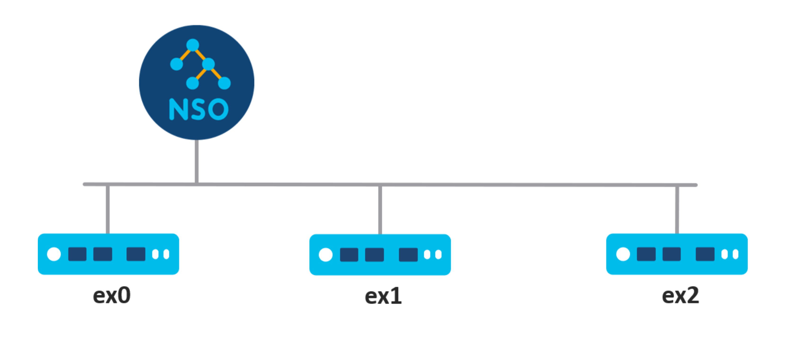

# Basic Automation with Python

You can manipulate data in the CDB with the help of XML files or the UI, however, these approaches are not well suited for programmatic access. NSO includes libraries for multiple programming languages, providing a simpler way for scripts and programs to interact with it. The Python Application Programming Interface (API) is likely the easiest to use.

This section will show you how to read and write data using the Python programming language. With this approach, you will learn how to do basic network automation in just a few lines of code.

## Setup <a href="#d5e305" id="d5e305"></a>

The environment setup that happens during the sourcing of the `ncsrc` file also configures the `PYTHONPATH` environment variable. It allows the Python interpreter to find the NSO modules, which are packaged with the product. This approach also works with Python virtual environments and does not require installing any packages.

Since the `ncsrc` file takes care of setting everything up, you can directly start the Python interactive shell and import the main `ncs` module. This module is a wrapper around a low-level C `_ncs` module that you may also need to reference occasionally. Documentation for both of the modules is available through the built-in `help()` function or separately in the HTML format.

If the `import ncs` statement fails, please verify that you are using a supported Python version and that you have sourced the `ncsrc` beforehand.

Generally, you can run the code from the Python interactive shell but we recommend against it. The code uses nested blocks, which are hard to edit and input interactively. Instead, we recommend you save the code to a file, such as `script.py`, which you can then easily run and rerun with the `python3 script.py` command. If you would still like to interactively inspect or alter the values during the execution, you can use the `import pdb; pdb.set_trace()` statements at the location of interest.

## Transactions <a href="#d5e322" id="d5e322"></a>

With NSO, data reads and writes normally happen inside a transaction. Transactions ensure consistency and avoid race conditions, where simultaneous access by multiple clients could result in data corruption, such as reading half-written data. To avoid this issue, NSO requires you to first start a transaction with a call to `ncs.maapi.single_read_trans()` or `ncs.maapi.single_write_trans()`, depending on whether you want to only read data or read and write data. Both of them require you to provide the following two parameters:

* `user`: The username (string) of the user you wish to connect as
* `context`: Method of access (string), allowing NSO to distinguish between CLI, web UI, and other types of access, such as Python scripts

These parameters specify security-related information that is used for auditing, access authorization, and so on. Please refer to [AAA infrastructure](../../administration/management/aaa-infrastructure.md) for more details.

As transactions use up resources, it is important to clean up after you are done using them. Using a Python `with` code block will ensure that cleanup is automatically performed after a transaction goes out of scope. For example:

```
with ncs.maapi.single_read_trans('admin', 'python') as t:
    ...
```

In this case, the variable `t` stores the reference to a newly started transaction. Before you can actually access the data, you also need a reference to the root element in the data tree for this transaction. That is, the top element, under which all of the data is located. The `ncs.maagic.get_root()` function, with transaction `t` as a parameter, achieves this goal.

## Read and Write Values <a href="#d5e344" id="d5e344"></a>

Once you have the reference to the root element, say in a variable named `root`, navigating the data model becomes straightforward. Accessing a property on `root` selects a child data node with the same name as the property. For example, `root.nacm` gives you access to the `nacm` container, used to define fine-grained access control. Since `nacm` is itself a container node, you can select one of its children using the same approach. So, the code `root.nacm.enable_nacm` refers to another node inside `nacm`, called `enable-nacm`. This node is a leaf, holding a value, which you can print out with the Python `print()` function. Doing so is conceptually the same as using the `show running-config nacm enable-nacm` command in the CLI.

There is a small difference, however. Notice that in the CLI the `enable-nacm` is hyphenated, as this is the actual node name in YANG. But names must not include the hyphen (minus) sign in Python, so the Python code uses an underscore instead.

The following is the full source code that prints the value:


```python
import ncs

with ncs.maapi.single_read_trans('admin', 'python') as t:
    root = ncs.maagic.get_root(t)
    print(root.nacm.enable_nacm)
```


As you can see in this example, it is necessary to import only the `ncs` module, which automatically imports all the submodules. Depending on your NSO instance, you might also notice that the value printed is `True`, without any quotation marks. As a convenience, the value gets automatically converted to the best-matching Python type, which in this case is a boolean value (`True` or `False`).

Moreover, if you start a read/write transaction instead of a read-only one, you can also assign a new value to the leaf. Of course, the same validation rules apply as using the CLI and you need to explicitly commit the transaction if you want the changes to persist. A call to the `apply()` method on the transaction object `t` performs this function. Here is an example:


```python
import ncs

with ncs.maapi.single_write_trans('admin', 'python') as t:
    root = ncs.maagic.get_root(t)
    root.nacm.enable_nacm = True
    t.apply()
```


## Lists

You can access a YANG list node like how you access a leaf. However, working with a list more resembles working with Python `dict` than a list, even though the name would suggest otherwise. The distinguishing feature is that YANG lists have keys that uniquely identify each list item. So, lists are more naturally represented as a kind of dictionary in Python.

Let's say there is a list of customers defined in NSO, with a YANG schema such as:

```yang
container customers {
  list customer {
    key "id";
    leaf id {
      type string;
    }
  }
}
```

To simplify the code, you might want to assign the value of `root.customers.customer` to a new variable `our_customers`. Then you can easily access individual customers (list items) by their `id`. For example, `our_customers['ACME']` would select the customer with `id` equal to `ACME`. You can check for the existence of an item in a list using the Python `in` operator, for example, `'ACME' in our_customers`. Having selected a specific customer using the square bracket syntax, you can then access the other nodes of this item.

Compared to dictionaries, making changes to YANG lists is quite a bit different. You cannot just add arbitrary items because they must obey the YANG schema rules. Instead, you call the `create()` method on the list object and provide the value for the key. This method creates and returns a new item in the list if it doesn't exist yet. Otherwise, the method returns the existing item. And for item removal, use the Python built-in `del` function with the list object and specify the item to delete. For example, `del our_customers['ACME']` deletes the ACME customer entry.

In some situations, you might want to enumerate all of the list items. Here, the list object can be used with the Python `for` syntax, which iterates through each list item in turn. Note that this differs from standard Python dictionaries, which iterate through the keys. The following example demonstrates this behavior.


```python
import ncs

with ncs.maapi.single_write_trans('admin', 'python') as t:
    root = ncs.maagic.get_root(t)
    our_customers = root.customers.customer

    new_customer = our_customers.create('ACME')
    new_customer.status = 'active'

    for c in our_customers:
      print(c.id)

    del our_customers['ACME']
    t.apply()
```


Now let's see how you can use this knowledge for network automation.

## Showcase - Configuring DNS with Python <a href="#d5e399" id="d5e399"></a>


See [examples.ncs/getting-started/basic-automation](https://github.com/NSO-developer/nso-examples/tree/6.6/getting-started/basic-automation) for an example implementation.


### **Prerequisites**

* No previous NSO or netsim processes are running. Use the `ncs --stop and ncs-netsim stop` commands to stop them if necessary.

### Step 1 - Start the Routers <a href="#d5e407" id="d5e407"></a>

Leveraging one of the examples included with the NSO installation allows you to quickly gain access to an NSO instance with a few devices already onboarded. The [examples.ncs/device-management](https://github.com/NSO-developer/nso-examples/tree/6.6/device-management) set of examples contains three simulated routers that you can configure.

<div data-with-frame="true"><figure><figcaption><p>The Lab Topology</p></figcaption></figure></div>

1.  Navigate to the [router-network](https://github.com/NSO-developer/nso-examples/tree/6.6/device-management/router-network) directory with the following command.

    ```bash
    $ cd $NCS_DIR/examples.ncs/device-management/router-network
    ```
2.  You can prepare and start the routers by running the `make` and `netsim` commands from this directory.

    ```bash
    $ make clean all && ncs-netsim start
    ```
3.  With the routers running, you should also start the NSO instance that will allow you to manage them.

    ```bash
    $ ncs
    ```

In case the `ncs` command reports an error about an address already in use, you have another NSO instance already running that you must stop first (`ncs --stop`).

### Step 2 - Inspect the Device Data Model <a href="#d5e431" id="d5e431"></a>

Before you can use Python to configure the router, you need to know what to configure. The simplest way to find out how to configure the DNS on this type of router is by using the NSO CLI.

```bash
$ ncs_cli -C -u admin
```

1.  In the CLI, you can verify that the NSO is managing three routers and check their names with the following command:

    ```cli
    admin@ncs# show devices list
    ```
2.  To make sure that the NSO configuration matches the one deployed on routers, also perform a `sync-from` action.

    ```cli
    admin@ncs# devices sync-from
    ```
3.  Let's say you would like to configure the DNS server `192.0.2.1` on the `ex1` router. To do this by hand, first enter the configuration mode.

    ```cli
    admin@ncs# config
    ```
4.  Then navigate to the NSO copy of the `ex1` configuration, which resides under the `devices device ex1 config` path, and use the `?` and `TAB` keys to explore the available configuration options. You are looking for the DNS configuration.\
    ...

    ```cli
    admin@ncs(config)# devices device ex1 config
    ```
5. Once you have found it, you see the full DNS server configuration path: `devices device ex1 config sys dns server`.


As an alternative to using the CLI approach to find this path, you can also consult the data model of the router in the `packages/router/src/yang/` directory.


6.  As you won't be configuring `ex1` manually at this point, exit the configuration mode.

    ```cli
    admin@ncs(config)# abort
    ```
7.  Instead, you will create a Python script to do it, so exit the CLI as well.

    ```cli
    admin@ncs# exit
    ```

### Step 3 - Create the Script <a href="#d5e463" id="d5e463"></a>

You will place the script into the `ex1-dns.py` file.

1.  In a text editor, create a new file and add the following text at the start.\\

    ```python
    import ncs
    with ncs.maapi.single_write_trans('admin', 'python') as t:
        root = ncs.maagic.get_root(t)
    ```

    \
    The `root` variable allows you to access configuration in the NSO, much like entering the configuration mode on the CLI does.
2.  Next, you will need to navigate to the `ex1` router. It makes sense to assign it to the `ex1_device` variable, which makes it more obvious what it refers to and easier to access in the script.

    ```
        ex1_device = root.devices.device['ex1']
    ```
3.  In NSO, each managed device, such as the `ex1` router, is an entry inside the `device` list. The list itself is located in the `devices` container, which is a common practice for lists. The list entry for `ex1` includes another container, `config`where the copy of `ex1` configuration is kept. Assign it to the `ex1_config` variable.

    ```
        ex1_config = ex1_device.config
    ```

    \
    Alternatively, you can assign to `ex1_config` directly, without referring to `ex1_device`, like so:

    ```
        ex1_config = root.devices.device['ex1'].config
    ```

    \
    This is the equivalent of using `devices device ex1 config` on the CLI.
4.  For the last part, keep in mind the full configuration path you found earlier. You have to keep navigating to reach the `server` list node. You can do this through the `sys` and `dns` nodes on the `ex1_config` variable.

    ```
        dns_server_list = ex1_config.sys.dns.server
    ```
5.  DNS configuration typically allows specifying multiple servers for redundancy and is therefore modeled as a list. You add a new DNS server with the `create()` method on the list object.

    ```
         dns_server_list.create('192.0.2.1')
    ```
6.  Having made the changes, do not forget to commit them with a call to `apply()` or they will be lost.

    ```
        t.apply()
    ```

    \
    Alternatively, you can use the `dry-run` parameter with the `apply_params()` to, for example, preview what will be sent to the device.

    ```
        params = t.get_params()
        params.dry_run_native()
        result = t.apply_params(True, params)
        print(result['device']['ex1'])
        t.apply_params(True, t.get_params())
    ```
7.  Lastly, add a simple `print` statement to notify you when the script is completed.

    ```
        print('Done!')
    ```

### Step 4 - Run and Verify the Script <a href="#d5e503" id="d5e503"></a>

1.  Save the script file as `ex1-dns.py` and run it with the `python3` command.

    ```bash
    $ python3 ex1-dns.py
    ```
2.  You should see `Done!` printed out. Then start the NSO CLI to verify the configuration change.

    ```bash
    $ ncs_cli -C -u admin
    ```
3.  Finally, you can check the configured DNS servers on `ex1` by using the `show running-config` command.

    ```cli
    admin@ncs# show running-config devices device ex1 config sys dns server
    ```

    \
    If you see the 192.0.2.1 address in the output, you have successfully configured this device using Python!

## A Note on Robustness <a href="#d5e519" id="d5e519"></a>

The code in this chapter is intentionally kept simple to demonstrate the core concepts and lacks robustness in error handling. In particular, it is missing the retry mechanism in case of concurrency conflicts as described in [Handling Conflicts](../core-concepts/nso-concurrency-model.md#ncs.development.concurrency.handling).

## The Magic Behind the API <a href="#d5e523" id="d5e523"></a>

Perhaps you've wondered about the unusual name of Python `ncs.maagic` module? It is not a typo but a portmanteau of the words Management Agent API (MAAPI) and magic. The latter is used in the context of so-called magic methods in Python. The purpose of magic methods is to allow custom code to play nicely with the Python language. An example you might have come across in the past is the `__init__()` method in a class, which gets called whenever you create a new object. This one and similar methods are called magic because they are invoked automatically and behind the scenes (implicitly).

The NSO Python API makes extensive use of such magic methods in the `ncs.maagic` module. Magic methods help this module translate an object-based, user-friendly programming interface into low-level function calls. In turn, the high-level approach to navigating the data hierarchy with `ncs.maagic` objects is called the Python Maagic API.
