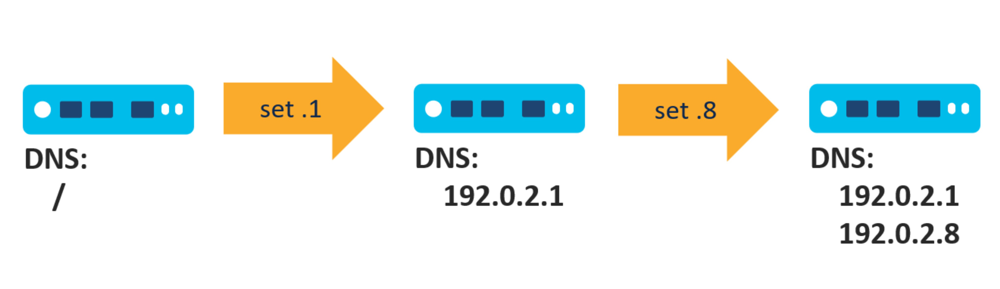
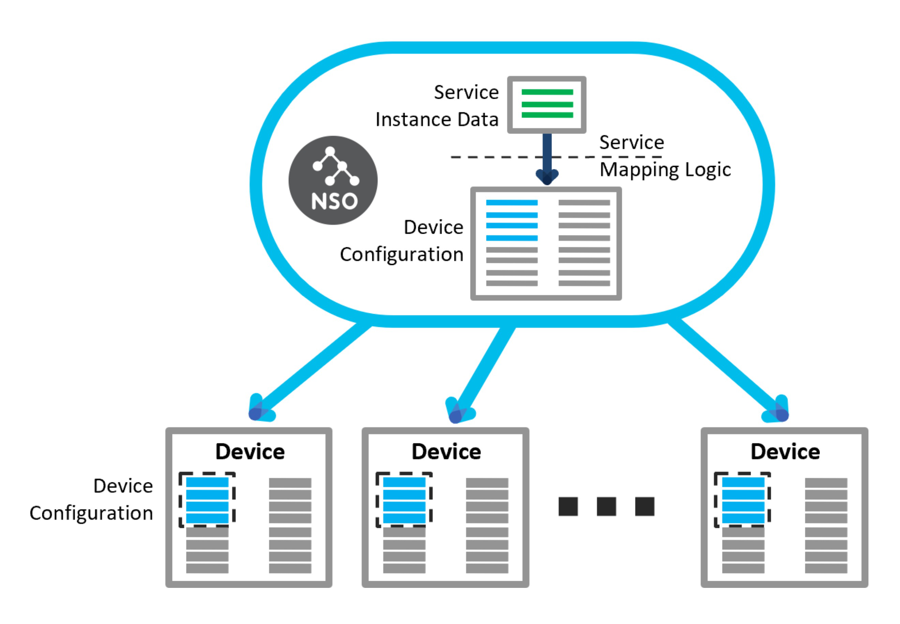

# Develop a Simple Service

The device YANG models contained in the Network Element Drivers (NEDs) enable NSO to store device configurations in the CDB and expose a uniform API to the network for automation, such as by Python scripts. The concept of NSO services builds on top of this network API and adds the ability to store service-specific parameters with each service instance.

This section introduces the main service building blocks and shows you how to build one yourself.

## Why Services? <a href="#d5e536" id="d5e536"></a>

Network automation includes provisioning and de-provisioning configuration, even though the de-provisioning part often doesn't get as much attention. It is nevertheless significant since leftover, residual configuration can cause hard-to-diagnose operational problems. Even more importantly, without proper de-provisioning, seemingly trivial changes may prove hard to implement correctly.

Consider the following example. You create a simple script that configures a DNS server on a router, by adding the IP address of the server to the DNS server list. This should work fine for initial provisioning. However, when the IP address of the DNS server changes, the configuration on the router should be updated as well.

Can you still use the same script in this case? Most likely not, since you need to remove the old server from the configuration and add the new one. The original script would just add the new IP address after the old one, resulting in both entries on the device. In turn, the device may experience slow connectivity as the system periodically retries the old DNS IP address and eventually times out.

The following figure illustrates this process, where a simple script first configures the IP address 192.0.2.1 (“.1”) as the DNS server, then later configures 192.0.2.8 (“.8”), resulting in a leftover old entry (“.1”).

<figure><figcaption><p>DNS Configuration with a Simple Script</p></figcaption></figure>

In such a situation, the script could perhaps simply replace the existing configuration, by removing all existing DNS server entries before adding the new one. But is this a reliable practice? What if a device requires an additional DNS server that an administrator configured manually? It would be overwritten and lost.

In general, the safest approach is to keep track of the previous changes and only replace the parts that have changed. This, however, is a lot of work and nontrivial to implement yourself. Fortunately, NSO provides such functionality through the FASTMAP algorithm, which is used when deploying services.

The other major benefit of using NSO services for automation is the service interface definition using YANG, which specifies the name and format of the service parameters. Many new NSO users wonder why use a service YANG model when they could just use the Python code or templates directly. While it might be difficult to see the benefits without much prior experience, YANG allows you to write better, more maintainable code, which simplifies the solution in the long run.

Many, if not most, security issues and provisioning bugs stem from unexpected user input. You must always validate user input (service parameter values) and YANG compels you to think about that when writing the service model. It also makes it easy to write the validation rules by using a standardized syntax, specifically designed for this purpose.

Moreover, the separation of concerns into the user interface, validation, and provisioning code allows for better organization, which becomes extremely important as the project grows. It also gives NSO the ability to automatically expose the service functionality through its APIs for integration with other systems.

For these reasons, services are the preferred way of implementing network automation in NSO.

## Service Package <a href="#d5e556" id="d5e556"></a>

As you may already know, services are added to NSO with packages. Therefore, you need to create a package if you want to implement a service of your own. NSO ships with an `ncs-make-package` utility that makes creating packages effortless. Adding the `--service-skeleton python` option creates a service skeleton, that is, an empty service, which you can tailor to your needs. As the last argument, you must specify the package name, which in this case is the service name. The command then creates a new directory with that name and places all the required files in the appropriate subdirectories.

The package contains the two most important parts of the service:

* the service YANG model and
* the service provisioning code also called the mapping logic.

Let's first look at the provisioning part. This is the code that performs the network configuration necessary for your service. The code often includes some parameters, for example, the DNS server IP address or addresses to use if your service is in charge of DNS configuration. So, we say that the code maps the service parameters into the device parameters, which is where the term mapping logic originates from. NSO, with the help of the NED, then translates the device parameters to the actual configuration. This simple tree-to-tree mapping describes how to create the service and NSO automatically infers how to update, remove, or re-deploy the service, hence the name FASTMAP.

<figure><figcaption><p>Transformation of Service Parameters into Device Configurations</p></figcaption></figure>

How do you create the provisioning code and where do you place it? Is it similar to a stand-alone Python script? Indeed, the code is mostly the same. The main difference is that now you don't have to create a session and a transaction yourself because NSO already provides you with one. Through this transaction, the system tracks the changes to the configuration made by your code.

The package skeleton contains a directory called `python`. It holds a Python package named after your service. In the package, the `ServiceCallbacks` class (the `main.py` file) is used for provisioning code. The same file also contains the `Main` class, which is responsible for registering the `ServiceCallbacks` class as a service provisioning code with NSO.

Of the most interest is the `cb_create()` method of the `ServiceCallbacks` class:

```python
def cb_create(self, tctx, root, service, proplist)
```

NSO calls this method for service provisioning. Now, let's see how to evolve a stand-alone automation script into a service. Suppose you have Python code for DNS configuration on a router, similar to the following:

```python
with ncs.maapi.single_write_trans('admin', 'python') as t:
    root = ncs.maagic.get_root(t)

    ex1_device = root.devices.device['ex1']
    ex1_config = ex1_device.config
    dns_server_list = ex1_config.sys.dns.server
    dns_server_list.create('192.0.2.1')

    t.apply()
```

Taking into account the `cb_create()` signature and the fact that the NSO manages the transaction for a service, you won't need the transaction and `root` variable setup. The NSO service framework already takes care of setting up the `root` variable with the right transaction. There is also no need to call `apply()` because NSO does that automatically.

You only have to provide the core of the code (the middle portion in the above stand-alone script) to the `cb_create()`:

```python
def cb_create(self, tctx, root, service, proplist):
    ex1_device = root.devices.device['ex1']
    ex1_config = ex1_device.config
    dns_server_list = ex1_config.sys.dns.server
    dns_server_list.create('192.0.2.1')
```

You can run this code by adding the service package to NSO and provisioning a service instance. It will achieve the same effect as the stand-alone script but with all the benefits of a service, such as tracking changes.

## Service Parameters <a href="#d5e597" id="d5e597"></a>

In practice, all services have some variable parameters. Most often parameter values change from service instance to service instance, as the desired configuration is a little bit different for each of them. They may differ in the actual IP address that they configure or in whether the switch for some feature is on or off. Even the DNS configuration service requires a DNS server IP address, which may be the same across the whole network but could change with time if the DNS server is moved elsewhere. Therefore, it makes sense to expose the variable parts of the service as service parameters. This allows a service operator to set the parameter value without changing the service provisioning code.

With NSO, service parameters are defined in the service model, written in YANG. The YANG module describing your service is part of the service package, located under the `src/yang` path, and customarily named the same as the package. In addition to the module-related statements (description, revision, imports, and so on), a typical service module includes a YANG `list`, named after the service. Having a list allows you to configure multiple service instances with slightly different parameter values. For example, in a DNS configuration service, you might have multiple service instances with different DNS servers. The reason is, that some devices, such as those in the Demilitarized Zone (DMZ), might not have access to the internal DNS servers and would need to use a different set.

The service model skeleton already contains such a list statement. The following is another example, similar to the one in the skeleton:

```yang
list my-svc {
  description "This is an RFS skeleton service";

  key name;
  leaf name {
    tailf:info "Unique service id";
    tailf:cli-allow-range;
    type string;
  }

  uses ncs:service-data;
  ncs:servicepoint my-svc-servicepoint;

  // Devices configured by this service instance
  leaf-list device {
    type leafref {
      path "/ncs:devices/ncs:device/ncs:name";
    }
  }

  // An example generic parameter
  leaf server-ip {
    type inet:ipv4-address;
  }
}
```

Along with the description, the service specifies a key, `name`to uniquely identify each service instance. This can be any free-form text, as denoted by its type (string). The statements starting with `tailf:` are NSO-specific extensions for customizing the user interface NSO presents for this service. After that come two lines, the `uses` and `ncs:servicepoint`, which tells NSO this is a service and not just some ordinary list. At the end, there are two parameters defined, `device` and `server-ip`.

NSO then allows you to add the values for these parameters when configuring a service instance, as shown in the following CLI transcript:

```cli
admin@ncs(config)# my-svc instance1 ?
Possible completions:
  check-sync           Check if device config is according to the service
  commit-queue
  deep-check-sync      Check if device config is according to the service
  device
  < ... output omitted ... >
  server-ip
  < ... output omitted ... >
```

Finally, your Python script can read the supplied values inside the `cb_create()` method via the provided `service` variable. This variable points to the currently-provisioning service instance, allowing you to use code such as `service.server_ip` for the value of the `server-ip` parameter.

## Showcase - A Simple DNS Configuration Service <a href="#d5e620" id="d5e620"></a>

### Prerequisites

* No previous NSO or netsim processes are running. Use the `ncs --stop` and `ncs-netsim stop` commands to stop them if necessary.
* NSO Local Install with a fresh runtime directory has been created by the `ncs-setup --dest ~/nso-lab-rundir` or a similar command.
* The environment variable `NSO_RUNDIR` points to this runtime directory, such as set by the `export NSO_RUNDIR=~/nso-lab-rundir` command. It enables the below commands to work as-is, without additional substitution needed.

### Step 1 - Prepare Simulated Routers <a href="#d5e635" id="d5e635"></a>

The `getting-started/developing-with-ncs` set of examples contains three simulated routers that you can use for this scenario. The `0-router-network` directory holds the data necessary for starting the routers and connecting them to your NSO instance.

First, change the current working directory:

```bash
$ cd $NCS_DIR/examples.ncs/getting-started/developing-with-ncs/0-router-network
```

From this directory, you can start a fresh set of routers by running the following `make` command:

```bash
$ make showcase-clean-start
< ... output omitted ... >
DEVICE ex0 OK STARTED
DEVICE ex1 OK STARTED
DEVICE ex2 OK STARTED
make: Leaving directory 'examples.ncs/getting-started/developing-with-ncs/0-router-network'
```

The routers are now running. The required NED package and a CDB initialization file `ncs-cdb/ncs_init.xml`were also added to your NSO instance. The latter contains connection details for the routers and will be automatically loaded on the first NSO start.

In case you're not using a fresh working directory, you may need to use the `ncs_load` command to load the file manually. Older versions of the system may also be missing the above `make` target, which you can add to the `Makefile` yourself:

```
showcase-clean-start:
        $(MAKE) clean all
        cp ncs-cdb/ncs_init.xml ${NSO_RUNDIR}/ncs-cdb/
        cp -a ../packages/router ${NSO_RUNDIR}/packages/
        ncs-netsim start
```

### Step 2 - Create a Service Package <a href="#d5e653" id="d5e653"></a>

You create a new service package with the `ncs-make-package` command. Without the `--dest` option, the package is created in the current working directory. Normally you run the command without this option, as it is shorter. For NSO to find and load this package, it has to be placed (or referenced via a symbolic link) in the `packages` subfolder of the NSO running directory.

Change the current working directory before creating the package:

```bash
$ cd $NSO_RUNDIR/packages
```

You need to provide two parameters to `ncs-make-package`. The first is the `--service-skeleton python` option, which selects the Python programming language for scaffolding code. The second parameter is the name of the service. As you are creating a service for DNS configuration, `dns-config` is a fitting name for it. Run the final, full command:

```bash
$ ncs-make-package --service-skeleton python dns-config
```

If you look at the file structure of the newly created package, you will see it contains a number of files.

```
dns-config/
+-- package-meta-data.xml
+-- python
|   '-- dns_config
|       +-- __init__.py
|       '-- main.py
+-- README
+-- src
|   +-- Makefile
|   '-- yang
|       '-- dns-config.yang
+-- templates
'-- test
    +-- < ... output omitted ... >
```

The `package-meta-data.xml` describes the package and tells NSO where to find the code. Inside the `python` folder is a service-specific Python package, where you add your own Python code (to `main.py` file). There is also a `README` file that you can update with the information relevant to your service. The `src` folder holds the source code that you must compile before you can use it with NSO. That's why there is also a `Makefile` that takes care of the compilation process. In the `yang` subfolder is the service YANG module. The `templates` folder can contain additional XML files, discussed later. Lastly, there's the `test` folder where you can put automated testing scripts, which won't be discussed here.

### Step 3 - Add the DNS Server Parameter <a href="#d5e679" id="d5e679"></a>

While you can always hard-code the desired parameters, such as the DNS server IP address, in the Python code, it means you have to change the code every time the parameter value (the IP address) changes. Instead, you can define it as an input parameter in the YANG file. Fortunately, the skeleton already has a leaf called a dummy that you can rename and use for this purpose.

Open the `dns-config.yang`, located inside `dns-config/src/yang/`, in a text or code editor and find the following line:

```yang
    leaf dummy {
```

Replace the word `dummy` with the word `dns-server`, save the file, and return to the shell. Run the `make` command in the `dns-config/src` folder to compile the updated YANG file.

```bash
$ make -C dns-config/src
make: Entering directory 'dns-config/src'
mkdir -p ../load-dir
mkdir -p java/src//
bin/ncsc  `ls dns-config-ann.yang  > /dev/null 2>&1 && echo "-a dns-config-ann.yang"` \
              -c -o ../load-dir/dns-config.fxs yang/dns-config.yang
make: Leaving directory 'dns-config/src'
```

### Step 4 - Add Python Code <a href="#d5e693" id="d5e693"></a>

In a text or code editor, open the `main.py` file, located inside `dns-config/python/dns_config/`. Find the following snippet:

```python
    @Service.create
    def cb_create(self, tctx, root, service, proplist):
        self.log.info('Service create(service=', service._path, ')')
```

Right after the `self.log.info()` call, read the value of the `dns-server` parameter into a `dns_ip` variable:

```
        dns_ip = service.dns_server
```

Mind the 8 spaces in front to make sure that the line is correctly aligned. After that, add the code that configures the `ex1` router:

```
        ex1_device = root.devices.device['ex1']
        ex1_config = ex1_device.config
        dns_server_list = ex1_config.sys.dns.server
        dns_server_list.create(dns_ip)
```

Here, you are using the `dns_ip` variable that contains the operator-provided IP address instead of a hard-coded value. Also, note that there is no need to check if the entry for this DNS server already exists in the list.

In the end, the `cb_create()` method should look like the following:

```python
    @Service.create
    def cb_create(self, tctx, root, service, proplist):
        self.log.info('Service create(service=', service._path, ')')
        dns_ip = service.dns_server
        ex1_device = root.devices.device['ex1']
        ex1_config = ex1_device.config
        dns_server_list = ex1_config.sys.dns.server
        dns_server_list.create(dns_ip)
```

Save the file and let's see the service in action!

### Step 5 - Deploy the Service <a href="#d5e711" id="d5e711"></a>

Start the NSO from the running directory:

```bash
$ cd $NSO_RUNDIR; ncs
```

Then, start the NSO CLI:

```bash
$ ncs_cli -C -u admin
```

If you have started a fresh NSO instance, the packages are loaded automatically. Still, there's no harm in requesting a `package reload` anyway:

```cli
admin@ncs# packages reload
reload-result {
    package dns-config
    result true
}
reload-result {
    package router-nc-1.0
    result true
}
```

As you will be making changes on the simulated routers, make sure NSO has their current configuration with the `devices sync-from` command.

```cli
admin@ncs# devices sync-from
sync-result {
    device ex0
    result true
}
sync-result {
    device ex1
    result true
}
sync-result {
    device ex2
    result true
}
```

Now you can test out your service package by configuring a service instance. First, enter the configuration mode.

```cli
admin@ncs# config
```

Configure a test instance and specify the DNS server IP address:

```cli
admin@ncs(config)# dns-config test dns-server 192.0.2.1
```

The easiest way to see configuration changes from the service code is to use the `commit dry-run` command.

```cli
admin@ncs(config-dns-config-test)# commit dry-run
cli {
    local-node {
        data  devices {
                  device ex1 {
                      config {
                          sys {
                              dns {
             +                    # after server 10.2.3.4
             +                    server 192.0.2.1;
                              }
                          }
                      }
                  }
              }
             +dns-config test {
             +    dns-server 192.0.2.1;
             +}
    }
}
```

The output tells you the new DNS server is being added in addition to an existing one already there. Commit the changes:

```cli
admin@ncs(config-dns-config-test)# commit
```

Finally, change the IP address of the DNS server:

```cli
admin@ncs(config-dns-config-test)# dns-server 192.0.2.8
```

With the help of `commit dry-run` observe how the old IP address gets replaced with the new one, without any special code needed for provisioning.

```cli
admin@ncs(config-dns-config-test)# commit dry-run
cli {
    local-node {
        data  devices {
                  device ex1 {
                      config {
                          sys {
                              dns {
             -                    server 192.0.2.1;
             +                    # after server 10.2.3.4
             +                    server 192.0.2.8;
                              }
                          }
                      }
                  }
              }
              dns-config test {
             -    dns-server 192.0.2.1;
             +    dns-server 192.0.2.8;
              }
    }
}
```

## Service Templates <a href="#d5e746" id="d5e746"></a>

The DNS configuration example intentionally performs very little configuration, a single line really, to focus on the service concepts. In practice, services can become more complex in two different ways. First, the DNS configuration service takes the IP address of the DNS server as an input parameter, supplied by the operator. Instead, the provisioning code could leverage another system, such as an IP Address Management (IPAM), to get the required information. In such cases, you have to add additional logic to your service code to generate the parameters (variables) to be used for configuration.

Second, generating the configuration from the parameters can become more complex when it touches multiple subsystems or spans across multiple devices. An example would be a service that adds a new VLAN, configures an IP address and a DHCP server, and adds the new route to a routing protocol. Or perhaps the service has to be duplicated on two separate devices for redundancy.

An established approach to the second challenge is to use a templating system for configuration generation. Templates separate the process of constructing parameter values from how they are used, adding a degree of flexibility and decoupling. NSO uses XML-based configuration _(config)_ templates, which you can invoke from provisioning code or link directly to services. In the latter case, you don't even have to write any Python code.

XML templates are snippets of configuration, similar to the CDB init files, but more powerful. Let's see how you could implement the DNS configuration service using a template instead of navigating the YANG model with Python.

While it is possible to write an XML template from scratch, it has to follow the target YANG model. Fortunately, the NSO CLI can help with generating most parts of the template from changes to the currenly open transaction. First, you'll need a sample instance with the desired configuration. As you are configuring the DNS server on a router and the ex1 device already has one configured, you can reuse that one. Otherwise, you might configure one by hand, using the CLI. You do that by displaying the existing configuration in the format of an XML template and saving it to a file, by piping it through the `display xml-template` and `save` filters, as shown here:

```cli
admin@ncs# show running-config devices device ex1 config sys dns | display xml-template
<config-template xmlns="http://tail-f.com/ns/config/1.0">
  <devices xmlns="http://tail-f.com/ns/ncs">
    <device>
      <name>ex1</name>
      <config>
        <sys xmlns="http://example.com/router">
          <dns>
            <server>
              <address>192.0.2.1</address>
            </server>
          </dns>
        </sys>
      </config>
    </device>
  </devices>
</config-template>
admin@ncs# show running-config devices device ex1 config sys dns | \
    display xml-template | save template.xml
```

The file structure of a package usually contains a `templates` folder and that is where the template belongs. When loading packages, NSO will scan this folder and process any `.xml` files it finds as templates.

Of course, a template with hard-coded values is of limited use, as it would always produce the exact same configuration. It becomes a lot more useful with variable substitution. In its simplest form, you define a variable value in the provisioning (Python) code and reference it from the XML template, by using curly braces and a dollar sign: `{$VARIABLE}`. Also, many users prefer to keep the variable name uppercased to make it stand out more from the other XML elements in the file. For example, in the template XML file for the DNS service, you would likely replace the IP address `192.0.2.1` with the variable `{$DNS_IP}` to control its value from the Python code.

You apply the template by creating a new `ncs.template.Template` object and calling its `apply()` method. This method takes the name of the XML template as the first parameter (no trailing `.xml`), and an object of type `ncs.template.Variables` as the second parameter. Using the `Variables` object, you provide values for the variables in the template.

```
template_vars = ncs.template.Variables()
template_vars.add('VARIABLE', 'some value')

template = ncs.template.Template(service)
template.apply('template', template_vars)
```

Variables in a template can take a more complex form of an XPath expression, where the parameter for the `Template` constructor comes into play. This parameter defines the root node (starting point) when evaluating XPath paths. Use the provided `service` variable, unless you specifically need a different value. It is what the so-called template-based services use as well.

Template-based services are no-code, pure template services that only contain a YANG model and an XML template. Since there is no code to set the variables, they must rely on XPath for the dynamic parts of the template. Such services still have a YANG data model with service parameters, that XPath can access. For example, if you have a parameter leaf defined in the service YANG file by the name `dns-server`, you can refer to its value with the `{/dns-server}` code in the XML template.

Likewise, you can use the same XPath in a template of a Python service. Then you don't have to add this parameter to the variables object but can still access its value in the template, saving you a little bit of Python code.

## Showcase - DNS Configuration Service with Templates <a href="#d5e780" id="d5e780"></a>

### Prerequisites

* No previous NSO or netsim processes are running. Use the `ncs --stop` and `ncs-netsim stop` commands to stop them if necessary.
* NSO local install with a fresh runtime directory has been created by the `ncs-setup --dest ~/nso-lab-rundir` or similar command.
* The environment variable `NSO_RUNDIR` points to this runtime directory, such as set by the `export NSO_RUNDIR=~/nso-lab-rundir` command. It enables the below commands to work as-is, without additional substitution needed.

### Step 1 - Prepare Simulated Routers <a href="#d5e795" id="d5e795"></a>

The `getting-started/developing-with-ncs` set of examples contains three simulated routers that you can use for this scenario. The `0-router-network` directory holds the data necessary for starting the routers and connecting them to your NSO instance.

First, change the current working directory:

```bash
$ cd $NCS_DIR/examples.ncs/getting-started/developing-with-ncs/0-router-network
```

From this directory, you can start a fresh set of routers by running the following `make` command:

```bash
$ make showcase-clean-start
< ... output omitted ... >
DEVICE ex0 OK STARTED
DEVICE ex1 OK STARTED
DEVICE ex2 OK STARTED
make: Leaving directory 'examples.ncs/getting-started/developing-with-ncs/0-router-network'
```

The routers are now running. The required NED package and a CDB initialization file, `ncs-cdb/ncs_init.xml`, were also added to your NSO instance. The latter contains connection details for the routers and will be automatically loaded on the first NSO start.

In case you're not using a fresh working directory, you may need to use the `ncs_load` command to load the file manually. Older versions of the system may also be missing the above `make` target, which you can add to the `Makefile` yourself:

```
showcase-clean-start:
        $(MAKE) clean all
        cp ncs-cdb/ncs_init.xml ${NSO_RUNDIR}/ncs-cdb/
        cp -a ../packages/router ${NSO_RUNDIR}/packages/
        ncs-netsim start
```

### Step 2 - Create a Service <a href="#d5e813" id="d5e813"></a>

The DNS configuration service that you are implementing will have three parts: the YANG model, the service code, and the XML template. You will put all of these in a package named `dns-config`. First, navigate to the `packages` subdirectory:

```bash
$ cd $NSO_RUNDIR/packages
```

Then, run the following command to set up the service package:

```bash
$ ncs-make-package --build --service-skeleton python dns-config
bin/ncsc  `ls dns-config-ann.yang  > /dev/null 2>&1 && echo "-a dns-config-ann.yang"` \
              -c -o ../load-dir/dns-config.fxs yang/dns-config.yang
```

In case you are building on top of the previous showcase, the package folder may already exist and will be updated.

You can leave the YANG model as is for this scenario but you need to add some Python code that will apply an XML template during provisioning. In a text or code editor open the `main.py` file, located inside `dns-config/python/dns_config/`, and find the definition of the `cb_create()` function:

```python
    @Service.create
    def cb_create(self, tctx, root, service, proplist):
        ...
```

You will define one variable for the template, the IP address of the DNS server. To pass its value to the template, you have to create the `Variables` object and add each variable, along with its value. Replace the body of the `cb_create()` function with the following:

```
        template_vars = ncs.template.Variables()
        template_vars.add('DNS_IP', '192.0.2.1')
```

The `template_vars` object now contains a value for the `DNS_IP` template variable, to be used with the `apply()` method that you are adding next:

```
        template = ncs.template.Template(service)
        template.apply('dns-config-tpl', template_vars)
```

Here, the first argument to `apply()` defines the template to use. In particular, using `dns-config-tpl`, you are requesting the template from the `dns-config-tpl.xml` file, which you will be creating shortly.

This is all the Python code that is required. The final, complete `cb_create` method is as follows:

```python
    @Service.create
    def cb_create(self, tctx, root, service, proplist):
        template_vars = ncs.template.Variables()
        template_vars.add('DNS_IP', '192.0.2.1')
        template = ncs.template.Template(service)
        template.apply('dns-config-tpl', template_vars)
```

### Step 3 - Create a Template

The most straightforward way to create an XML template is by using the NSO CLI. Return to the running directory and start the NSO:

```bash
$ cd $NSO_RUNDIR && ncs --with-package-reload
```

The `--with-package-reload` option will make sure that NSO loads any added packages and save a `packages reload` command on the NSO CLI.

Next, start the NSO CLI:

```bash
$ ncs_cli -C -u admin
```

As you are starting with a new NSO instance, first invoke the `sync-from` action.

```cli
admin@ncs# devices sync-from
sync-result {
    device ex0
    result true
}
sync-result {
    device ex1
    result true
}
sync-result {
    device ex2
    result true
}
```

Next, make sure that the ex1 router already has an existing entry for a DNS server in its configuration.

```cli
admin@ncs# show running-config devices device ex1 config sys dns
devices device ex1
 config
  sys dns server 10.2.3.4
  !
 !
!
```

Pipe the command through the `display xml-template` and `save` CLI filters to save this configuration as an XML template. According to the Python code, you need to create a template file `dns-config-tpl.xml`. Use `packages/dns-config/templates/dns-config-tpl.xml` for the full file path.

```cli
admin@ncs# show running-config devices device ex1 config sys dns \
| display xml-template | save packages/dns-config/templates/dns-config-tpl.xml
```

At this point, you have created a complete template that will provision the 10.2.3.4 as the DNS server on the ex1 device. The only problem is, that the IP address is not the one you have specified in the Python code. To correct that, open the `dns-config-tpl.xml` file in a text editor and replace the line that reads `<address>10.2.3.4</address>` with the following:

```xml
<address>{$DNS_IP}</address>
```

The only static part left in the template now is the target device and it's possible to parameterize that, too. The skeleton, created by the `ncs-make-package` command, already contains a node `device` in the service YANG file. It is there to allow the service operator to choose the target device to be configured.

```
leaf-list device {
  type leafref {
    path "/ncs:devices/ncs:device/ncs:name";
  }
}
```

One way to use the `device` service parameter is to read its value in the Python code and then set up the template parameters accordingly. However, there is a simpler way with XPath. In the template, replace the line that reads `<name>ex1</name>` with the following:

```xml
<name>{/device}</name>
```

The XPath expression inside the curly braces instructs NSO to get the value for the device name from the service instance's data, namely the node called `device`. In other words, when configuring a new service instance, you have to add the device parameter, which selects the router for provisioning. The final XML template is then:

```xml
<config-template xmlns="http://tail-f.com/ns/config/1.0">
  <devices xmlns="http://tail-f.com/ns/ncs">
    <device>
      <name>{/device}</name>
      <config>
        <sys xmlns="http://example.com/router">
          <dns>
            <server>
              <address>{$DNS_IP}</address>
            </server>
          </dns>
        </sys>
      </config>
    </device>
  </devices>
</config-template>
```

### Step 4 - Test the Service <a href="#d5e884" id="d5e884"></a>

Remember to save the template file and return to the NSO CLI. Because you have updated the service code, you have to redeploy it for NSO to pick up the changes:

```cli
admin@ncs# packages package dns-config redeploy
result true]
```

Alternatively, you could call the `packages reload` command, which does a full reload of all the packages.

Next, enter the configuration mode:

```cli
admin@ncs# config
```

As you are using the device node in the service model for target router selection, configure a service instance for the `ex2` router in the following way:

```cli
admin@ncs(config)# dns-config dns-for-ex2 device ex2
```

Finally, using the `commit dry-run` command, observe the `ex2` router being configured with an additional DNS server.

```cli
admin@ncs(config-dns-config-dns-for-ex2)# commit dry-run
```

As a bonus for using an XPath expression to a leaf-list in the service template, you can actually select multiple router devices in a single service instance and they will all be configured.

***

**Next Steps**


[implementing-services.md](../core-concepts/implementing-services.md)

