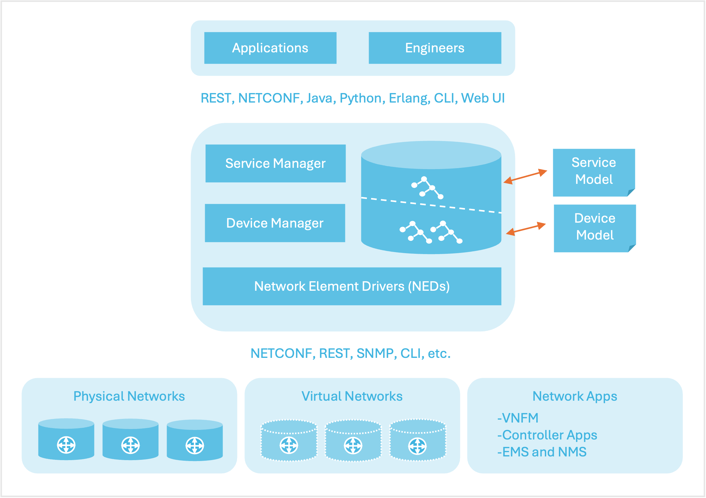
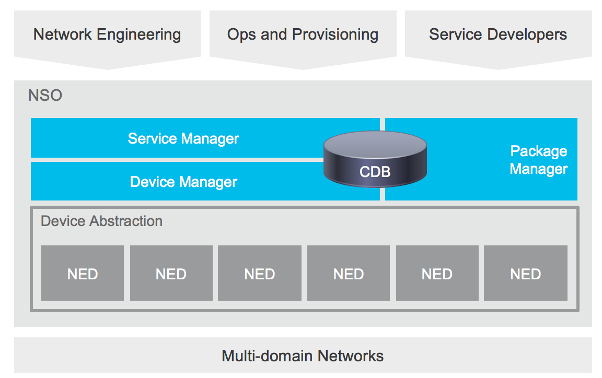
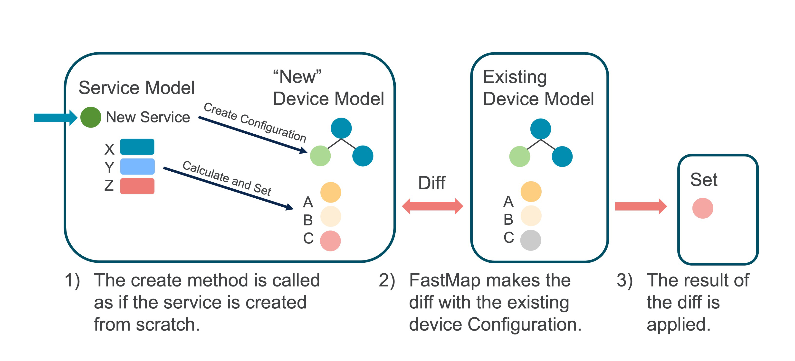

# NSO at a Glance

***

**Welcome to Cisco Crosswork NSO documentation**

On this page, you'll find a brief introduction to NSO to help you learn the basics of the product, its features, architecture, components, and how it helps you tackle network management challenges.

***

## What is NSO?

Cisco Crosswork Network Services Orchestrator (NSO) enabled by Tail-f is an industry-leading orchestration platform for hybrid networks. As a Linux application, it allows fine-grained control of physical and virtual network devices and can powerfully orchestrate the configuration life cycle of networks they live in. It provides comprehensive lifecycle service automation to enable you to design and deliver high-quality services faster and easier.


The terms 'ncs' and 'tail-f' are used extensively in file names, command-line command names, YANG models, application programming interfaces (API), etc. Throughout this documentation, we use NSO to refer to the product.


## Key Features

At its heart, NSO makes network orchestration possible by leveraging the following features:

* **Multi-vendor device configuration management:** Uses the native protocols of the network devices to manage a wide variety of network devices.
* **Configuration Database (CDB):** Manages synchronized configurations for all devices and services in the network domain.
* **A rich set of northbound interfaces:** Includes human interfaces like web UI and a CLI, programmable interfaces including RESTCONF, NETCONF, JSON-RPC, and language bindings including Java, Python, and Erlang.
* **A central point of access to manage NSO:** Manages entire networks for network engineers using the NSO CLI or web UI. Although this documentation illustrates the use cases using CLI examples, it is important to understand that any northbound interface can be used to achieve the same functionality.
* **Network Element Drivers (NEDs):** Used as software packages to facilitate telnet, SSH, or API interactions with the devices that it manages.

## Background: The Orchestration Challenge

The industry is rapidly moving towards a service-oriented approach to network management, where multi-vendor devices, physical and virtual, support complex services. To manage these, operators are starting a transition from manually managing devices towards a situation where an operator is actively managing the various aspects of services.

Configuring the services and the affected devices is among the largest cost drivers in provider networks. Still, the common orchestration and configuration management practice involves pervasive manual work or ad hoc scripting. Why do we still apply these sorts of techniques to the configuration management problem? Two primary reasons are the variations of services and the constant change of devices. These two underlying characteristics are, to some degree, blocking automated solutions, since it takes too long to update the solution to cope with daily changes.

Time-to-market requirements are critical for a new service to be deployed quickly and the delay in configuring the corresponding tools has a significant impact on revenue. There is an unserved need in provider networks for tools that address these complex and sometimes contradictory challenges while constructing service configurations.

### How NSO Addresses the Orchestration Challenge 

Creating and configuring network services is a complex task that often requires multiple configuration changes to all devices participating in the service. Additionally, changes generally need to be made concurrently across all devices with the changes being either completely successful or rolled back to the starting configuration. And, configurations need to be kept in sync across the system and the network devices. NSO approaches these challenges by acting as an interface between people or software that want to configure the network and the devices in the network.

NSO enables service providers to dynamically adopt the orchestration solution according to changes in the offered service portfolio. This is enabled by using a model-driven architecture where service definitions can be changed on the fly. Rather than a hard-coded orchestrator, NSO learns from the service models. Service models are written in YANG (RFC 6020).

NSO delivers an automated orchestration solution toward a hybrid multi-vendor network. The network can be a mix of traditional equipment, virtual devices, and SDN Controllers. This flexibility is managed by a Network Element Driver, NED, layer that abstracts the device interfaces and the Device Manager which enables generic device configuration functions.

At the core of NSO is the configuration datastore, CDB, that is in sync with the actual device and service configuration. It also manages relationships between services and devices and can handle revisions of device interfaces.

All devices and services in the network can be accessed and configured using the NSO CLI, making it a powerful tool for network engineers. The CLI also provides an easy way to define roles and associated authorization policies limiting the engineer's view of the devices under NSO control. Policies and integrity constraints can also be defined to ensure the configuration adheres to operator standards.

The typical workflow when using the NSO CLI is as follows:

1. The user logs in to the CLI and thereby starts a new session. The session provides a (logical) copy of the running configuration of CDB as a scratch pad for edits.
2. Changes made to the scratch pad are optionally validated at any time against policies and schemas using the "validate" command. Changes can always be viewed and verified before committing them.
3. The changes are committed, meaning that the changes are copied to the NSO database and deltas are pushed out to the network devices that are affected by the change. Changes that violate integrity constraints or network policies will not be committed but produce validation errors. The changes to the devices are done in a distributed and atomic transaction across all devices in parallel.
4. Changes either succeed and remain committed to device configuration or fail and are rolled back as a whole returning the entire network to the prior state.

## NSO Architecture

***

**Related Learning**: Building Blocks of NSO


**Building Blocks of NSO**


***

NSO has two main layers, the Device Manager and the Service Manager. They serve different purposes but are tightly integrated with a transactional engine and database.

<figure><figcaption>
NSO Architecture
</figcaption></figure>

NSO uses a dedicated built-in storage Configuration Database (CDB) for all configuration data. NSO keeps the CDB in sync with the real network device configurations. Audit, to ensure configuration consistency, and reconciliation, to synchronize configuration with the devices, functions are supported. It also maintains the runtime relationships between service instances and the corresponding device configurations.

NSO uses Network Element Drivers, NEDs, to communicate with devices. NEDs are not closed hard-coded adapters. Rather, the device interface is modeled in a data model using the YANG data modeling language. NSO can render the required commands or operations directly from this model. This includes support for legacy configuration interfaces like device CLIs. This means that the NEDs can easily be updated to support new commands just by extending the data models with the appropriate model constructs which avoid any programming tasks as part of the change cycle.

NSO also comes with tooling for simulating the configuration aspects of a network. The netsim tool is used to simulate management interfaces like Cisco CLI and NETCONF for NSO examples and service development.

The main components of NSO are described below.

### **Service Manager**

The Service Manager makes it possible for an operator to manage high-level aspects of the network that are not supported by the devices directly or are supported in a cumbersome way. With the appropriate service definition running in the Service Manager, an operator could for example configure the VLANs that should exist in the network in a single place, and the Service Manager compute the specific configuration changes required for each device in the network and push them out. This covers the whole life cycle for a service: creation, modification, and deletion. NSO has an intelligent and easy way to use a mapping layer so that network engineers can define how a service should be deployed in the network.

The Service Manager addresses the following challenges:

* Transaction-safe activation of services across different multi-vendor devices.
* What-if scenarios, (dry-run), showing the effects on the network for a service creation/change.
* Maintaining relationships between services and corresponding device configurations and vice versa.
* Modeling of services
* Short development and turn-around time for new services.
* Mapping the service model to device models.

### Device Manager

The purpose of the Device Manager is to manage device configurations in a transactional manner. It supports features like fine-grained configuration commands, bidirectional device configuration synchronization, device groups and templates, and compliance reporting.

The Device Manager supports the following overall features:

* Deploy configuration changes to multiple devices in a fail-safe way using distributed transactions.
* Validate the integrity of configurations before deploying to the network.
* Apply configuration changes to named device groups.
* Apply templates (with variables) to named device groups.
* Easily roll back changes, if needed.
* Configuration audits: Check if device configurations are in sync with the NSO database. If they are not, what is the diff?
* Synchronize the NSO database and the configurations on devices, in case they are not in sync. This can be done in either direction (import the diff to the NSO database or deploy the diff on devices).

### Network Element Drivers (NEDs)

NED, or Network Element Driver, represents a key NSO component that makes it possible for the NSO's core system to communicate southbound with the network devices in most deployments. NSO has a built-in client that can be used to communicate southbound with NETCONF-enabled devices. The vast majority of existing network devices are, however, not NETCONF-enabled. There are two main categories of NEDs: the CLI NEDs, and the Generic NEDs. Both categories have the same basic components in common. A Cisco-provided NED is an NSO package containing a bundle of YANG models together with a driver element implemented in Java.

### UI and APIs

NSO provides user interfaces as well as northbound APIs for integration into other systems. The main user interface is the NSO network-wide CLI which gives a unified CLI towards the complete network including the network services. This User Guide will illustrate most of the functions using the CLI. NSO also provides a Web UI.

The northbound APIs are available in different language bindings (Java, Python), and as protocols, like NETCONF and REST.

To support dynamic updates of functionality as added or modified service models, support for a new device type, etc, NSO manages extensions as well-defined packages. Every NED is its own package with its own release life cycle. Every service model with the corresponding mapping is also a package of its own. These can be upgraded without upgrading NSO itself.

When running NSO against real devices, (not just the NSO network simulator for educational purposes), make sure you have the correct NED package version from the delivery repository.

To learn how to use NSO and also to simplify development using NSO, NSO comes with a network simulator, `ncs-netsim`. Many of the examples will use netsim as the network.

### HA and Clustering

NSO supports a 1:N high-availability mode. One NSO system can be primary and can have any number of secondaries. Any configuration write has to go through the primary node. The configuration changes are replicated to the read-only secondaries. The replication can be done in asynchronous or synchronous mode. In the synchronous mode, the transaction returns when the secondaries are in sync.

For large networks, the network devices can be clustered across NSO systems. Say you have 100,000 devices split into two continents. You may choose to have 50,000 devices in one NSO and 50,000 in another. There are several options on how to configure clusters to see the whole network. The most common is a top NSO where services are provisioned, and the top NSO sees the whole network.

## Core Concepts

These are some of the core concepts that make NSO special. The following picture gives a high-level view of the components involved.

<figure><figcaption>
NSO Components
</figcaption></figure>

### NETCONF/YANG 

As network programmability was starting to grow in importance it [was realized](https://tools.ietf.org/html/rfc3535) that configuration of network elements needed a modern model-driven interface to enable that programmability. This led to the development of [YANG](https://tools.ietf.org/html/rfc6020), a modeling language for configuration.

NSO uses YANG as the overall modeling language to manage devices and services.\
YANG models describe all NSO configurations, including device configuration and service configuration. This means that everything that is done in NSO is model-driven, this allows all interfaces to be automatically rendered.

YANG was originally paired with [NETCONF](https://tools.ietf.org/html/rfc6241), but as REST became a more popular interface\
[RESTCONF](https://tools.ietf.org/html/rfc8040) was standardized as well. Both of the protocols let you define your API using YANG, giving you a model-driven interface; this means that the basic working of the protocol is defined by the standards and the application-specific details can be derived from the loaded YANG models. The RESTCONF protocol provides a compatible subset of the functionality of the NETCONF protocol but does not provide the full transactional interface of the latter.

### Configuration Database (CDB) 

At the core of NSO is the Configuration Database (CDB). This is a tree-structured database that is defined by a YANG schema. This means that all of the information stored inside of NSO is validated against the schema.

Every transaction towards CDB exhibits [ACID](https://en.wikipedia.org/wiki/ACID) properties, which among other things means either the transaction as a whole ends up on all participating devices (as well as in the NSO CDB), or otherwise, the whole transaction is aborted and all changes are automatically rolled back.

The CDB always contains NSO's view of the complete network configuration. To handle out-of-band changes operations are available to check if a device is in sync, write NSO's view to the device, or read the device configuration into NSO.

### Service Algorithm - FastMap 

As a Service Developer, you need to express the mapping from a YANG service model to the corresponding device YANG models. This is a declarative mapping in the sense that no sequencing is defined. Observe that irrespective of the underlying device type and corresponding native device interface, the mapping is towards a YANG device model, not the native CLI for example. This means that as you write the service mapping, you do not have to worry about the syntax of different devices' CLI commands or in which order these commands are sent to the devices. This is all taken care of by the NSO device manager.

NSO reduces this problem to a single data-mapping definition for the "create" scenario. At run-time\
NSO will render the minimum change for any possible change like all the ones mentioned below. This is managed by the FASTMAP algorithm.

FASTMAP covers the complete service life-cycle: creating, changing, and deleting the service. The solution requires a minimum amount of code for mapping from a service model to a device model.

FASTMAP is based on generating changes from an initial 'create'. When the service instance is created the reverse of the resulting device configuration is stored together with the service instance. If an NSO user later changes the service instance, NSO first applies (in a transaction) the reverse diff of the service, effectively undoing the previous results of the service creation code. Then it runs the logic to create the service again and finally executes a diff to the current configuration. This diff is then sent to the devices.

<figure><figcaption>
The Service Algorithm - FastMap
</figcaption></figure>

### Accessing the Network (NEDs) 

The NSO device manager is the center of NSO. The device manager maintains a flat list of all managed devices. NSO serves as a "source of truth" and keeps a copy of the configuration for each managed device in the CDB. Whenever a change is done to the device configuration copies in the CDB, the device manager will partition this "network configuration change" into the corresponding changes for the actually managed devices. The device manager passes on the required changes to the NEDs, Network Element Drivers. A NED needs to be installed for every type of device OS, like Cisco IOS NED, Cisco XR NED, Juniper JUNOS NED, etc. The NEDs communicate through the native device protocol southbound. The NEDs fall into the following categories:

* NETCONF capable device. The Device Manager will produce NETCONF edit-configuration\
  RPC operations for each participating device.
* SNMP device. The Device Manager translates the changes made to the configuration into the\
  corresponding SNMP SET PDUs
* A device with Cisco CLI. The device has a CLI with the same structure as Cisco IOS or XR routers. The Device Manager and a CLI NED are used to produce the correct sequence of CLI commands which reflects the changes made to the configuration.
* For other devices that do not fit into any of the above-mentioned categories, a corresponding Generic NED is invoked. Generic NEDs are used for proprietary protocols like REST and for CLI flavors that are not resembling IOS or XR. The Device Manager will inform the Generic NED about the made changes and the NED will translate these to the appropriate operations toward the device.
