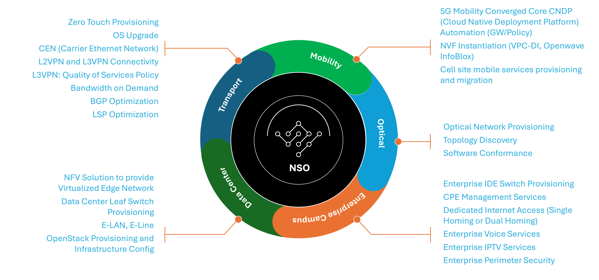

# Common Use Cases

Cisco Network Services Orchestrator (NSO) is a model-driven, vendor-agnostic automation and orchestration platform used to design, deploy, and operate network and service infrastructure across physical, virtual, and cloud environments.

NSO abstracts device- and vendor-specific complexity through YANG-based service and device models, enabling consistent service lifecycle management across multi-vendor and multi-domain networks. It integrates with existing OSS/BSS systems, domain controllers, and DevOps toolchains, acting as a central automation and orchestration engine rather than a solution tied to a specific technology or product.

The following sections describe automation as well as other use cases and deployment patterns for NSO.

***

## Automation Use Cases Across Network and Service Domains

Cisco NSO is commonly deployed as a cross-domain orchestration layer, enabling consistent automation patterns across different network technologies and operational domains.

Figure below illustrates example automation use cases across multiple domains orchestrated by NSO. The following sections highlight representative scenarios.

<figure><figcaption></figcaption></figure>

***

### Transport Network Automation

NSO is widely used to automate IP and transport networks.

Representative use cases include:

* Zero-touch provisioning of transport devices
* L2VPN and L3VPN service provisioning
* QoS policy application for VPN services
* Bandwidth-on-demand and service modification
* BGP and LSP optimization workflows
* Coordinated OS and software upgrades

***

### Data Center and Virtualized Infrastructure Automation

NSO orchestrates both physical and virtual infrastructure components in data center environments.

Common scenarios include:

* Leaf–spine switch provisioning
* Virtualized edge and gateway services
* E-LAN and E-Line service orchestration
* Infrastructure configuration for private cloud environments
* Integration with virtualization and cloud platforms

***

### Enterprise and Campus Services Automation

NSO supports scalable service deployment and lifecycle management for enterprise and managed service environments.

Typical use cases include:

* Enterprise switch and CPE provisioning
* Dedicated Internet Access (single-homing and dual-homing)
* Enterprise voice and IPTV services
* Perimeter security and access policy enforcement

***

### Optical Network Automation

NSO integrates with optical network elements and controllers to orchestrate services alongside IP and transport layers.

Representative use cases include:

* Optical service provisioning
* Topology discovery and inventory synchronization
* Software version compliance and lifecycle management
* Coordinated IP-over-optical workflows

***

### Mobility and 5G Service Automation

NSO is used as an orchestration layer in mobility and 5G environments.

Representative scenarios include:

* Automation of cloud-native deployment platforms
* Gateway and policy service configuration
* Virtual network function and cloud service instantiation
* Cell site service provisioning and migration workflows
* Integration with external IPAM and infrastructure systems

***

### Integration with DevOps and Automation Ecosystems

NSO integrates with external systems through APIs and event mechanisms, enabling its use within modern DevOps and automation workflows.

Common scenarios include:

* Git-driven service definitions
* Automated testing and validation
* CI/CD-driven infrastructure and service deployment

This allows network automation to follow the same principles used for application infrastructure.

***

## Other Common Use Cases

### Automated Device Onboarding and Turnup (Day-0 / Day-1)

Simplify the deployment of new network devices such as routers, switches, and virtual network elements.

NSO automates device onboarding by generating configurations from reusable service models and templates. Device-specific parameters are applied to a common model, ensuring consistency across vendors and platforms.

Key capabilities include:

* Day-0 and Day-1 configuration generation
* Configuration preview and validation before deployment
* Transactional configuration delivery with rollback on failure
* Bulk onboarding of multiple devices in a single operation
* Support for greenfield and brownfield environments

This approach reduces manual configuration effort and minimizes deployment risk.

***

### Service Lifecycle Orchestration

Orchestrate the full lifecycle of network and service offerings, including creation, modification, repair, and decommissioning.

NSO uses declarative service models to describe the desired end state of a service. Its orchestration engine automatically computes and applies the minimal set of changes required to converge the infrastructure to that state.

Services can span:

* Physical network devices
* Virtualized network functions
* Cloud and container-based environments
* External controllers and management systems

This enables rapid, repeatable service delivery while maintaining consistency and control across domains.

***

### SD-WAN and Overlay Service Orchestration

Automate the lifecycle of Software-Defined Wide Area Network (SD-WAN) and overlay network services across multi-vendor environments.

NSO orchestrates configurations and workflows across devices and external SD-WAN controllers, abstracting vendor-specific differences through NEDs and integration packages. A single service definition can be applied across heterogeneous SD-WAN solutions.

Typical use cases include:

* Hub and branch service provisioning
* Policy updates and service modification
* Lifecycle operations at scale
* Integration with existing SD-WAN management systems

NSO acts as a lifecycle orchestration layer rather than replacing domain-specific SD-WAN controllers.

***

### Policy-Based Configuration and Governance (ACLs, QoS, and More)

Simplify the management of network-wide policies such as Access Control Lists (ACLs), Quality of Service (QoS), and standardized configuration rules.

NSO allows operators to define high-level policy intent using service models. These policies are translated into the appropriate vendor-specific configuration syntax and applied consistently across the network.

Examples include:

* Security and access policies
* QoS shaping and policing rules
* Standardized configuration blocks by device role

This ensures policy consistency while reducing operational complexity.

***

### Unified Interfaces for Network Automation (CLI, API, UI)

Provide consistent operational interfaces across multi-vendor environments.

Network engineers and automation systems interact with NSO using:

* A model-driven CLI
* Northbound APIs (JSON-RPC, RESTCONF, NETCONF)
* Web-based user interfaces

NSO’s APIs enable seamless integration into external automation systems and CI/CD pipelines, allowing network services to be programmatically deployed, validated, and modified as part of broader automation workflows.

Operators work with service abstractions instead of device-specific CLIs. NSO ensures the correct syntax is generated for each device using the appropriate NED.

***

### Configuration Compliance and Drift Management

Ensure that device configurations conform to defined network-wide standards.

NSO continuously compares the running configuration of devices with intended state definitions (often referred to as _golden configurations_). Deviations caused by manual or out-of-band changes can be detected, reported, and optionally remediated.

Key capabilities include:

* Configuration audits across large device fleets
* Detection of configuration drift
* Centralized compliance reporting
* Automated reconciliation to intended state

This helps maintain operational consistency and reduce configuration-related incidents.

***

### Software and OS Lifecycle Management

Centralize and automate software and operating system upgrades across network infrastructure.

NSO can be used by customers as a framework for building software maintenance workflows. Common implementations include:

* Coordinated upgrades during maintenance windows
* Parallel execution across large device sets
* Transactional execution with rollback on failure
* Integration with external inventory and lifecycle systems

This reduces operational overhead and improves reliability during maintenance activities.

## Summary

Cisco NSO is not tied to any specific vendor, device type, or network architecture. Its strength lies in its ability to abstract complexity, enforce consistency, and automate service lifecycles across diverse environments.

The use cases described on this page represent common deployment patterns. NSO’s extensible architecture allows organizations to tailor automation to their specific operational and business requirements.
