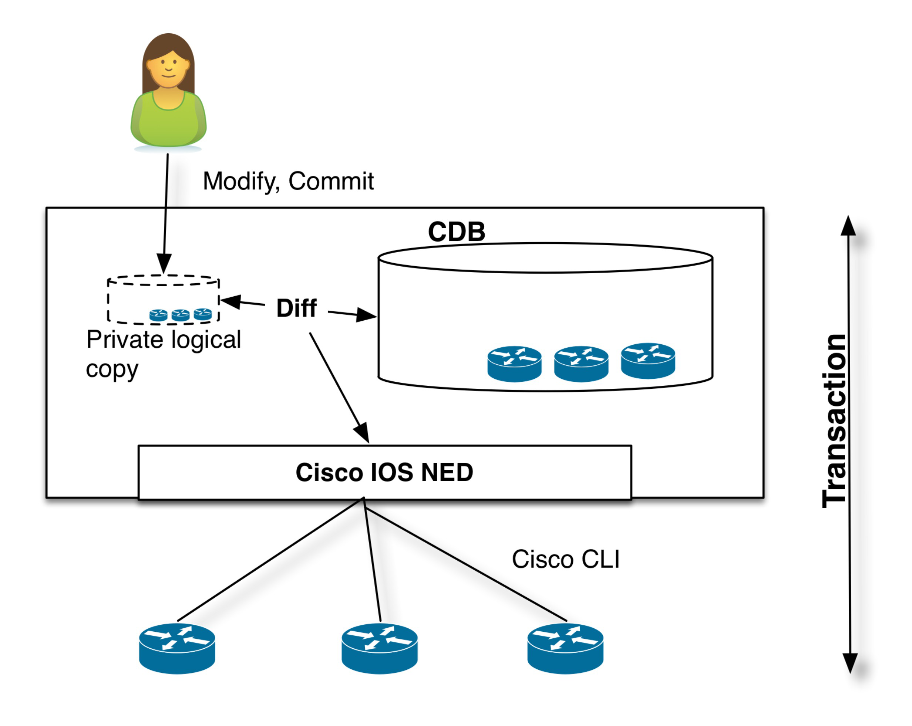

# Basic Operations

This section helps you to get started with NSO, learn basic operational scenarios, and get acquainted with the most common CLI commands.

## Setup <a href="#d5e47" id="d5e47"></a>

Make sure that you have installed NSO and that you have sourced the `ncsrc` file in `$NCS_DIR`. This sets up the paths and environment variables to run NSO. As this must be done every time before running NSO, it is recommended to add it to your profile.

We will use the NSO network simulator to simulate three Cisco IOS routers. NSO will talk Cisco CLI to those devices. You will use the NSO CLI and Web UI to perform the tasks. Sometimes you will use the native Cisco device CLI to inspect configuration or do out-of-band changes.

<div data-with-frame="true"><figure><figcaption><p>The First Example</p></figcaption></figure></div>

\
Note that both the NSO software (NCS) and the simulated network devices run on your local machine.

## Starting the Simulator <a href="#d5e59" id="d5e59"></a>

To start the simulator:

1. Go to [examples.ncs/device-management/simulated-cisco-ios](https://github.com/NSO-developer/nso-examples/tree/6.6/device-management/simulated-cisco-ios). First of all, we will generate a network simulator with three Cisco devices. They will be called `c0`, `c1`, and `c2`.


Most of this section follows the procedure in the `README` file, so it is useful to have it opened as well.


Perform the following command:

```bash
$ ncs-netsim create-network $NCS_DIR/packages/neds/cisco-ios 3 c
```

This creates three simulated devices all running Cisco IOS and they will be named `c0`, `c1`, `c2`.

2. Start the simulator.

```bash
$ ncs-netsim start
DEVICE c0 OK STARTED
DEVICE c1 OK STARTED
DEVICE c2 OK STARTED
```

3. Run the CLI toward one of the simulated devices.

```bash
$ ncs-netsim cli-i c1
admin connected from 127.0.0.1 using console *

c1> enable
c1# show running-config
class-map m
match mpls experimental topmost 1
match packet length max 255
match packet length min 2
match qos-group 1
!
...
c1# exit
```

This shows that the device has some initial configurations.

## Starting NSO and Reading Device Configuration <a href="#d5e80" id="d5e80"></a>

The previous step started the simulated Cisco devices. It is now time to start NSO.

1. The first action is to prepare directories needed for NSO to run and populate NSO with information on the simulated devices. This is all done with the `ncs-setup` command. Make sure that you are in the [examples.ncs/device-management/simulated-cisco-ios](https://github.com/NSO-developer/nso-examples/tree/6.6/device-management/simulated-cisco-ios) directory. (Again, ignore the details for the time being).

```bash
$ ncs-setup --netsim-dir ./netsim --dest .
```


Note the `.` at the end of the command referring to the current directory. What the command does is to create directories needed for NSO in the current directory and populate NSO with devices that are running in netsim. We call this the "run-time" directory.


2. Start NSO.

```bash
$ ncs
```

3. Start the NSO CLI as the user `admin` with a Cisco XR-style CLI.

```bash
$ ncs_cli -C -u admin
```

NSO also supports a J-style CLI, that is started by using a -J modification to the command like this.

```bash
$ ncs_cli -J -u admin
```

Throughout this user guide, we will show the commands in Cisco XR style.

4. At this point, NSO only knows the address, port, and authentication information of the devices. This management information was loaded to NSO by the setup utility. It also tells NSO how to communicate with the devices by using NETCONF, SNMP, Cisco IOS CLI, etc. However, at this point, the actual configuration of the individual devices is unknown.

```bash
admin@ncs# show running-config devices device
devices device c0
 address   127.0.0.1
 port      10022
...
 authgroup default
 device-type cli ned-id cisco-ios
 state admin-state unlocked
 config
  no ios:service pad
  no ios:ip domain-lookup
  no ios:ip http secure-server
  ios:ip source-route
 !
!  ...
```

Let us analyze the above CLI command. First of all, when you start the NSO CLI it starts in operational mode, so to show configuration data, you have to explicitly run `show running-config`.

NSO manages a list of devices, each device is reached by the path `devices device "name"` . You can use standard tab completion in the CLI to learn this.

The `address` and `port` fields tells NSO where to connect to the device. For now, they all live in local host with different ports. The `device-type` structure tells NSO it is a CLI device and the specific CLI is supported by the Network Element Driver (NED) `cisco-ios`. A more detailed explanation of how to configure the device-type structure and how to choose NEDs will be addressed later in this guide.

So now NSO can try to connect to the devices:

```bash
admin@ncs# devices connect
connect-result {
    device c0
    result true
    info (admin) Connected to c0 - 127.0.0.1:10022
}
connect-result {
    device c1
    result true
    info (admin) Connected to c1 - 127.0.0.1:10023
}
connect-result {
    device c2
    result true
    info (admin) Connected to c2 - 127.0.0.1:10024
}....
```

NSO does not need to have the connections active continuously, instead, NSO will establish a connection when needed and connections are pooled to conserve resources. At this time, NSO can read the configurations from the devices and populate the configuration database, CDB.

The following command will synchronize the configurations of the devices with the CDB and respond with `true` if successful:

```bash
admin@ncs# devices sync-from
sync-result {
    device c0
    result true
}....
```

The NSO data store, CDB, will store the configuration for every device at the path `devices device "name" config` . Everything after this path is the configuration in the device. Normally, NSO keeps this synchronized with the device. The synchronization is managed with the following principles:

1. At initialization, NSO can discover the configuration as shown above.
2. In day-to-day operations on the network, the network engineer uses NSO (CLI, WebUI, REST,...) to modify the representation of device configuration in the NSO CDB. The changes are committed to the network as a transaction that includes the actual devices. Only if all changes happen on the actual devices, they are committed to the NSO data store. The transaction also covers the devices, so if any device participating in the transaction fails, NSO will roll back the configuration changes on all modified devices. This works even in the case of devices that do not natively support roll-back, such as Cisco IOS CLI.
3. NSO can detect out-of-band changes and reconcile them by either updating the CDB or modifying the configuration on the devices to reflect the currently stored configuration.

NSO only needs to be synchronized with the devices in the event of a change being made outside of NSO. Changes made using NSO are reflected in both the CDB and the devices. The following actions do not need to be taken:

1. Perform configuration change via NSO.
2. Perform sync-from action.

The above incorrect (or not necessary) sequence stems from the assumption that the NSO CLI talks directly to the devices. This is not the case; the northbound interfaces in NSO modify the configuration in the NSO data store, NSO calculates a minimum difference between the current configuration and the new configuration, giving only the changes to the configuration to the NEDs that runs the commands to the devices. All this is done as one single change-set.

The one exception to the above are devices that change their own configuration. For example, you only configure A but also B appears in the device configuration. These are so-called "auto-configs". In this case, the NED needs to implement special code to handle each such scenario individually. If the NED does not fully cover all of these device quirks, the device may get out of sync when you make configuration changes through NSO.

<div data-with-frame="true"><figure><figcaption><p>Device Transaction</p></figcaption></figure></div>

View the configuration of the `c0` device using the command:

```bash
admin@ncs# show running-config devices device c0 config
devices device c0
 config
  no ios:service pad
  ios:ip vrf my-forward
   bgp next-hop Loopback 1
  !
...
```

Or, show a particular piece of configuration from several devices:

```bash
admin@ncs# show running-config devices device c0..2 config ios:router
devices device c0
 config
  ios:router bgp 64512
   aggregate-address 10.10.10.1 255.255.255.251
   neighbor 1.2.3.4 remote-as 1
   neighbor 1.2.3.4 ebgp-multihop 3
   neighbor 2.3.4.5 remote-as 1
   neighbor 2.3.4.5 activate
   neighbor 2.3.4.5 capability orf prefix-list both
   neighbor 2.3.4.5 weight 300
  !
 !
!
devices device c1
 config
  ios:router bgp 64512
...
```

Or, show a particular piece of configuration from all devices:

```bash
admin@ncs# show running-config devices device config ios:router
```

The CLI can pipe commands, try <kbd>TAB</kbd> after `|` to see various pipe targets:

```bash
admin@ncs# show running-config devices device config ios:router \
                     | display xml | save router.xml
```

The above command shows the router config of all devices as XML and then saves it to a file `router.xml`.

## Writing Device Configuration <a href="#d5e156" id="d5e156"></a>

1. To change the configuration, enter configure mode.

```bash
admin@ncs# config
Entering configuration mode terminal
admin@ncs(config)#
```

2. Change or add some configuration across the devices, for example:

```bash
 admin@ncs(config)# devices device c0..2 config ios:router bgp 64512
                       neighbor 10.10.10.0 remote-as 64502
admin@ncs(config-router)#
```

### Transaction Commit

It is important to understand how NSO applies configuration changes to the network. At this point, the changes are local to NSO, no configurations have been sent to the devices yet. Since the NSO Configuration Database, CDB is in sync with the network, NSO can calculate the minimum diff to apply the changes to the network.

The command below compares the ongoing changes with the running database:

```bash
admin@ncs(config-router)# top
admin@ncs(config)# show configuration
devices device c0
 config
  ios:router bgp 64512
   neighbor 10.10.10.0 remote-as 64502
...
```

It is possible to dry-run the changes to see the native Cisco CLI output (in this case almost the same as above):

```bash
admin@ncs(config)# commit dry-run outformat native
native {
    device {
        name c0
        data router bgp 64512
              neighbor 10.10.10.0 remote-as 64502
             !
...
```

The changes can be committed to the devices and the NSO CDB simultaneously with a single commit. In the commit command below, we pipe to details to understand the actions being taken.

```bash
admin@ncs% commit | details
```

### Transaction Rollback

Changes are committed to the devices and the NSO database as one transaction. If any of the device configurations fail, all changes will be rolled back and the devices will be left in the state that they were in before the commit and the NSO CDB will not be updated.

There are numerous options to the commit command which will affect the behavior of the atomic transactions:

```bash
admin@ncs(config)# commit TAB
Possible completions:
  and-quit               Exit configuration mode
  check                  Validate configuration
  comment                Add a commit comment
  commit-queue           Commit through commit queue
  label                  Add a commit label
  no-confirm             No confirm
  no-networking          Send nothing to the devices
  no-out-of-sync-check   Commit even if out of sync
  no-overwrite           Do not overwrite modified data on the device
  no-revision-drop       Fail if device has too old data model
  save-running           Save running to file
  ---
  dry-run                Show the diff but do not perform commit
```

As seen by the details output, NSO stores a roll-back file for every commit so that the whole transaction can be rolled back manually. The following is an example of a rollback file:

```bash
admin@ncs(config)# do file show logs/rollback1000
Possible completions:
     rollback10001  rollback10002  rollback10003  \
                           rollback10004  rollback10005
admin@ncs(config)# do file show logs/rollback10005
# Created by: admin
# Date: 2014-09-03 14:35:10
# Via: cli
# Type: delta
# Label:
# Comment:
# No: 10005

ncs:devices {
    ncs:device c0 {
        ncs:config {
            ios:router {
                ios:bgp 64512 {
                    delete:
                    ios:neighbor 10.10.10.0;
                }
            }
        }
    }
```

(Viewing files as an operational command, prefixing a command in configuration mode with `do` executes in operational mode.) To perform a manual rollback, first load the rollback file:

```bash
admin@ncs(config)# rollback-files apply-rollback-file fixed-number 10005
```

`apply-rollback-file` by default restores to that saved configuration, adding `selective` as a parameter allows you to just roll back the delta in that specific rollback file. Show the differences:

```bash
admin@ncs(config)# show configuration
devices device c0
 config
  ios:router bgp 64512
   no neighbor 10.10.10.0 remote-as 64502
  !
 !
!
devices device c1
 config
  ios:router bgp 64512
   no neighbor 10.10.10.0 remote-as 64502
  !
 !
!
devices device c2
 config
  ios:router bgp 64512
   no neighbor 10.10.10.0 remote-as 64502
  !
 !
!
```

Commit the rollback:

```bash
admin@ncs(config)# commit
Commit complete.
```

### Trace Log

A trace log can be created to see what is going on between NSO and the device CLI enable trace. Use the following command to enable trace:

```bash
admin@ncs(config)# devices global-settings trace raw trace-dir logs
admin@ncs(config)# commit
Commit complete.
admin@ncs(config)# devices disconnect
```

Note that the trace settings only take effect for new connections, so is important to disconnect the current connections. Make a change to for example `c0`:

```bash
admin@ncs(config)# devices device c0 config ios:interface FastEthernet
                                1/2 ip address  192.168.1.1 255.255.255.0
admin@ncs(config-if)# commit dry-run outformat native
admin@ncs(config-if)# commit
```

Note the use of the command `commit dry-run outformat native`. This will display the net result device commands that will be generated over the native interface without actually committing them to the CDB or the devices. In addition, there is the possibility to append the `reverse` flag that will display the device commands for getting back to the current running state in the network if the commit is successfully executed.

Exit from the NSO CLI and return to the Unix Shell. Inspect the CLI trace:

```bash
 less logs/ned-cisco-ios-c0.trace
```

## More on Device Management <a href="#d5e207" id="d5e207"></a>

### Device Groups <a href="#d5e209" id="d5e209"></a>

As seen above, ranges can be used to send configuration commands to several devices. Device groups can be created to allow for group actions that do not require naming conventions. A group can reference any number of devices. A device can be part of any number of groups, and groups can be hierarchical.

The command sequence below creates a group of core devices and a group with all devices. Note that you can use tab completion when adding the device names to the group. Also, note that it requires configuration mode. (If you are still in the Unix Shell from the steps above, do `$ncs_cli -C -u admin`).

```bash
admin@ncs(config)# devices device-group core device-name [ c0 c1 ]
admin@ncs(config-device-group-core)# commit

admin@ncs(config)# devices device-group all device-name c2 device-group core
admin@ncs(config-device-group-all)# commit

admin@ncs(config)# show full-configuration devices device-group
devices device-group all
 device-name  [ c2 ]
 device-group [ core ]
!
devices device-group core
 device-name [ c0 c1 ]
!

admin@ncs(config)# do show devices device-group
NAME  MEMBER        INDETERMINATES  CRITICALS  MAJORS  MINORS  WARNINGS
-------------------------------------------------------------------------
all   [ c0 c1 c2 ]  0               0          0       0       0
core  [ c0 c1 ]     0               0          0       0       0
```

Note well the `do show` which shows the operational data for the groups. Device groups have a member attribute that shows all member devices, flattening any group members.

Device groups can contain different devices as well as devices from different vendors. Configuration changes will be committed to each device in its native language without needing to be adjusted in NSO.

You can, for example, at this point use the group to check if all `core` are in sync:

```bash
admin@ncs# devices device-group core check-sync
sync-result {
    device c0
    result in-sync
}
sync-result {
    device c1
    result in-sync
}
```

### Device Templates <a href="#d5e228" id="d5e228"></a>

Assume that we would like to manage permit lists across devices. This can be achieved by defining templates and applying them to device groups. The following CLI sequence defines a tiny template, called `community-list` :

```bash
admin@ncs(config)# devices template community-list
                                ned-id cisco-ios-cli-3.0
                                config ios:ip
                                community-list standard test1
                                permit permit-list 64000:40

admin@ncs(config-permit-list-64000:40)# commit
Commit complete.
admin@ncs(config-permit-list-64000:40)# top

admin@ncs(config)# show full-configuration devices template
devices template community-list
 config
  ios:ip community-list standard test1
   permit permit-list 64000:40
   !
  !
 !
!
[ok][2013-08-09 11:27:28]
```

This can now be applied to a device group:

```bash
admin@ncs(config)# devices device-group core apply-template \
                                 template-name community-list
admin@ncs(config)# show configuration
devices device c0
 config
  ios:ip community-list standard test1 permit 64000:40
 !
!
devices device c1
 config
  ios:ip community-list standard test1 permit 64000:40
 !
!
admin@ncs(config)# commit dry-run outformat native
native {
    device {
        name c0
        data ip community-list standard test1 permit 64000:40
    }
    device {
        name c1
        data ip community-list standard test1 permit 64000:40
    }
}
admin@ncs(config)# commit
Commit complete.
```

What if the device group `core` contained different vendors? Since the configuration is written in IOS the above template would not work on Juniper devices. Templates can be used on different device types (read NEDs) by using a prefix for the device model. The template would then look like:

```
template community-list {
  config {
    junos:configuration {
    ...
    }
    ios:ip {
    ...
    }
```

The above indicates how NSO manages different models for different device types. When NSO connects to the devices, the NED checks the device type and revision and returns that to NSO. This can be inspected (note, in operational mode):

```bash
admin@ncs# show devices device module
NAME  NAME                       REVISION    FEATURES  DEVIATIONS
-------------------------------------------------------------------
c0    tailf-ned-cisco-ios        2014-02-12  -         -
      tailf-ned-cisco-ios-stats  2014-02-12  -         -
c1    tailf-ned-cisco-ios        2014-02-12  -         -
      tailf-ned-cisco-ios-stats  2014-02-12  -         -
c2    tailf-ned-cisco-ios        2014-02-12  -         -
      tailf-ned-cisco-ios-stats  2014-02-12  -         -
```

So here we see that `c0` uses a `tailf-ned-cisco-ios` module which tells NSO which data model to use for the device. Every NED package comes with a YANG data model for the device (except for third-party YANG NED for which the YANG device model must be downloaded and fixed before it can be used). This renders the NSO data store (CDB) schema, the NSO CLI, WebUI, and southbound commands.

The model introduces namespace prefixes for every configuration item. This also resolves issues around different vendors using the same configuration command for different configuration elements. Note that every item is prefixed with `ios`:

```bash
admin@ncs# show running-config devices device c0 config ios:ip community-list
devices device c0
 config
  ios:ip community-list 1 permit
  ios:ip community-list 2 deny
  ios:ip community-list standard s permit
  ios:ip community-list standard test1 permit 64000:40
 !
!
```

Another important question is how to control if the template merges the list or replaces the list. This is managed via tags. The default behavior of templates is to merge the configuration. Tags can be inserted at any point in the template. Tag values are `merge`, `replace`, `delete`, `create` and `nocreate`.

Assume that `c0` has the following configuration:

```bash
admin@ncs# show running-config devices device c0 config ios:ip community-list
devices device c0
 config
  ios:ip community-list 1 permit
  ios:ip community-list 2 deny
  ios:ip community-list standard s permit}
```

If we apply the template the default result would be:

```bash
admin@ncs# show running-config devices device c0 config ios:ip community-list
devices device c0
 config
  ios:ip community-list 1 permit
  ios:ip community-list 2 deny
  ios:ip community-list standard s permit
  ios:ip community-list standard test1 permit 64000:40
 !
!
```

We could change the template in the following way to get a result where the permit list would be replaced rather than merged. When working with tags in templates, it is often helpful to view the template as a tree rather than a command view. The CLI has a display option for showing a curly-braces tree view that corresponds to the data-model structure rather than the command set. This makes it easier to see where to add tags.

```bash
admin@ncs(config)# show full-configuration devices template
devices template community-list
 config
  ios:ip community-list standard test1
   permit permit-list 64000:40
   !
  !
 !
!
admin@ncs(config)# show full-configuration devices \
                                 template | display curly-braces
template community-list {
    config {
        ios:ip {
            community-list {
                standard test1 {
                    permit {
                        permit-list 64000:40;
                    }
                }
            }
        }
    }
}


admin@ncs(config)# tag add devices template community-list
                                ned-id cisco-ios-cli-3.0
                                config ip community-list replace
admin@ncs(config)# commit
Commit complete.
admin@ncs(config)# show full-configuration devices
                                 template | display curly-braces
template community-list {
    config {
        ios:ip {
            /* Tags: replace */
            community-list {
                standard test1 {
                    permit {
                        permit-list 64000:40;
                    }
                }
            }
        }
    }
}
```

Different tags can be added across the template tree. If we now apply the template to the device `c0` which already have community lists, the following happens:

```bash
admin@ncs(config)# show full-configuration devices device c0 \
                                 config ios:ip community-list
devices device c0
 config
  ios:ip community-list 1 permit
  ios:ip community-list 2 deny
  ios:ip community-list standard s permit
  ios:ip community-list standard test1 permit 64000:40
 !
!
admin@ncs(config)# devices device c0 apply-template \
                                 template-name community-list
admin@ncs(config)# show configuration
devices device c0
 config
  no ios:ip community-list 1 permit
  no ios:ip community-list 2 deny
  no ios:ip community-list standard s permit
 !
!
```

Any existing values in the list are replaced in this case. The following tags are available:

* `merge` (default): the template changes will be merged with the existing template.
* `replace`: the template configuration will be replaced by the new configuration.
* `create`: the template will create those nodes that do not exist. If a node already exists this will result in an error.
* `nocreate`: the merge will only affect configuration items that already exist in the template. It will never create the configuration with this tag, or any associated commands inside it. It will only modify existing configuration structures.
* `delete`: delete anything from this point.

Note that a template can have different tags along the tree nodes.

A problem with the above template is that every value is hard-coded. What if you wanted a template where the `community-list` name and `permit-list` value are variables passed to the template when applied? Any part of a template can be a variable, (or actually an XPATH expression). We can modify the template to use variables in the following way:

```bash
admin@ncs(config)# no devices template community-list config ios:ip \
                                community-list standard test1
admin@ncs(config)# devices template community-list config ios:ip \
                                community-list standard \
                                {$LIST-NAME} permit permit-list {$AS}

admin@ncs(config-permit-list-{$AS})# commit
Commit complete.

admin@ncs(config-permit-list-{$AS})# top
admin@ncs(config)# show full-configuration devices template
devices template community-list
 config
  ios:ip community-list standard {$LIST-NAME}
   permit permit-list {$AS}
   !
  !
 !
!
```

The template now requires two parameters when applied (<kbd>tab</kbd> completion will prompt for the variable):

```bash
admin@ncs(config)# devices device-group all apply-template
template-name community-list variable { name LIST-NAME value 'test2' }
variable { name AS value '60000:30' }

admin@ncs(config)# commit
```

Note, that the `replace` tag was still part of the template and it would delete any existing community lists, which is probably not the desired outcome in the general case.

The template mechanism described so far is "fire-and-forget". The templates do not have any memory of what happened to the network, or which devices they touched. A user can modify the templates without anything happening to the network until an explicit `apply-template` action is performed. (Templates are of course, as all configuration changes, applied as a transaction). NSO also supports service templates that are more advanced in many ways, more information on this will be presented later in this guide.

Also, note that device templates have some additional restrictions on the values that can be supplied when applying the template. In particular, a value must either be a number or a single-quoted string. It is currently not possible to specify a value that contains a single quote (`'`).

### Policies <a href="#d5e319" id="d5e319"></a>

To make sure that configuration is applied according to site or corporate rules, you can use policies. Policies are validated at every commit, they can be of type `error` that implies that the change cannot go through or a `warning` which means that you have to confirm a configuration that gives a warning.

A policy is composed of:

1. Policy name.
2. Iterator: loop over a path in the model, for example, all devices, all services of a specific type.
3. Expression: a boolean expression that must be true for every node returned from the iterator, for example, SNMP must be turned on.
4. Warning or error: a message displayed to the user. If it is of the type warning, the user can still commit the change, if of type error the change cannot be made.

An example is shown below:

```bash
admin@ncs(config)# policy rule class-map
Possible completions:
  error-message     Error message to print on expression failure
  expr              XPath 1.0 expression that returns a boolean
  foreach           XPath 1.0 expression that returns a node set
  warning-message   Warning message to print on expression failure

admin@ncs(config)# policy rule class-map foreach /devices/device \
       expr config/ios:class-map[name='a'] \
       warning-message "Device {name} must have a class-map a"

admin@ncs(config-rule-class-map)# top

admin@ncs(config)# commit
Commit complete.

admin@ncs(config)# show full-configuration policy
policy rule class-map
 foreach         /devices/device
 expr            config/ios:class-map[ios:name='a']
 warning-message "Device {name} must have a class-map a"
!
```

Now, if we try to delete a `class-map` `a`, we will get a policy violation:

```bash
admin@ncs(config)# no devices device c2 config ios:class-map match-all a
admin@ncs(config)# validate
Validation completed with warnings:
  Device c2 must have a class-map a

admin@ncs(config)# commit
The following warnings were generated:
  Device c2 must have a class-map a
Proceed? [yes,no] yes
Commit complete.

admin@ncs(config)# validate
Validation completed with warnings:
  Device c2 must have a class-map a
```

The `{name}` variable refers to the node set from the iterator. This node-set will be the list of devices in NSO and the devices have an attribute called 'name'.

To understand the syntax for the expressions a pipe target in the CLI can be used:

```bash
admin@ncs(config)# show full-configuration devices device c2 config \
                                 ios:class-map | display xpath
/ncs:devices/ncs:device[ncs:name='c2']/ncs:config/ \
ios:class-map[ios:name='cmap1']/ios:prematch match-all
...
```

To debug policies look at the end of `logs/xpath.trace`. This file will show all validated XPATH expressions and any errors.

```log
4-Sep-2014::11:05:30.103 Evaluating XPath for policy: class-map:
  /devices/device
get_next(/ncs:devices/device) = {c0}
XPath policy match: /ncs:devices/device{c0}
get_next(/ncs:devices/device{c0}) = {c1}
XPath policy match: /ncs:devices/device{c1}
get_next(/ncs:devices/device{c1}) = {c2}
XPath policy match: /ncs:devices/device{c2}
get_next(/ncs:devices/device{c2}) = false
exists("/ncs:devices/device{c2}/config/class-map{a}") = true
exists("/ncs:devices/device{c1}/config/class-map{a}") = true
exists("/ncs:devices/device{c0}/config/class-map{a}") = true
```

Validation scripts can also be defined in Python, see more about that in [Plug-and-Play Scripting](plug-and-play-scripting.md).

### Out-of-band Changes, Transactions, and Pre-Provisioning <a href="#d5e363" id="d5e363"></a>

In reality, network engineers might still modify configurations using other tools like out-of-band CLI or other management interfaces. It is important to understand how NSO manages this.

The NSO network simulator supports CLI towards the devices. For example, we can use the IOS CLI on say `c0` and delete a `permit-list`.

From the UNIX shell, start a CLI session towards `c0`.

```bash
$ ncs-netsim cli-i c0

c0> enable
c0# configure
Enter configuration commands, one per line. End with CNTL/Z.

c0(config)# show full-configuration ip community-list
ip community-list standard test1 permit
ip community-list standard test2 permit 60000:30
c0(config)# no ip community-list standard test2
c0(config)#
c0# exit
$
```

Start the NSO CLI again:

```bash
$ ncs_cli -C -u admin
```

NSO detects if its configuration copy in CDB differs from the configuration in the device. Various strategies are used depending on device support: transaction IDs, time stamps, and configuration hash-sums. For example, an NSO user can request a `check-sync` operation:

```bash
admin@ncs# devices check-sync
sync-result {
    device c0
    result out-of-sync
    info got: e54d27fe58fda990797d8061aa4d5325 expected: 36308bf08207e994a8a83af710effbf0

}
sync-result {
    device c1
    result in-sync
}
sync-result {
    device c2
    result in-sync
}

admin@ncs# devices device-group core check-sync
sync-result {
    device c0
    result out-of-sync
    info got: e54d27fe58fda990797d8061aa4d5325 expected: 36308bf08207e994a8a83af710effbf0

}
sync-result {
    device c1
    result in-sync
}
```

NSO can also compare the configurations with the CDB and show the difference:

```bash
admin@ncs# devices device c0 compare-config
diff
 devices {
     device c0 {
         config {
             ios:ip {
                 community-list {
+                    standard test1 {
+                        permit {
+                        }
+                    }
-                    standard test2 {
-                        permit {
-                            permit-list 60000:30;
-                        }
-                    }
                 }
             }
         }
     }
 }
```

At this point, we can choose if we want to use the configuration stored in the CDB as the valid configuration or the configuration on the device:

```bash
admin@ncs# devices sync-
Possible completions:
  sync-from   Synchronize the config by pulling from the devices
  sync-to     Synchronize the config by pushing to the devices

admin@ncs# devices sync-to
```

In the above example, we chose to overwrite the device configuration from NSO.

NSO will also detect out-of-sync when committing changes. In the following scenario, a local `c0` CLI user adds an interface. Later the NSO user tries to add an interface:

```bash
$ ncs-netsim cli-i c0

c0> enable
c0# configure
Enter configuration commands, one per line. End with CNTL/Z.
c0(config)#  interface FastEthernet 1/0 ip address 192.168.1.1 255.255.255.0
c0(config-if)#
c0# exit

$ ncs_cli -C -u admin

admin@ncs# config
Entering configuration mode terminal

admin@ncs(config)# devices device c0 config ios:interface \
       FastEthernet1/1 ip address 192.168.1.1 255.255.255.0

admin@ncs(config-if)# commit
Aborted: Network Element Driver: device c0: out of sync
```

At this point, we have two diffs:

1. The device and NSO CDB (`devices device compare-config`).
2. The ongoing transaction and CDB (`show configuration`).

```bash
admin@ncs(config)# devices device c0 compare-config
diff
 devices {
     device c0 {
         config {
             ios:interface {
                 FastEthernet 1/0 {
                     ip {
                         address {
                             primary {
+                                mask 255.255.255.0;
+                                address 192.168.1.1;
                             }
                         }
                     }
                 }
             }
         }
     }
 }

admin@ncs(config)# show configuration
devices device c0
 config
  ios:interface FastEthernet1/1
   ip address 192.168.1.1 255.255.255.0
  exit
 !
!
```

To resolve this, you can choose to synchronize the configuration between the devices and the CDB before committing. In setups where it is normal for engineers or other systems to make out-of-band changes, you may want to configure NSO to automatically bring in these changes, so you can avoid performing `sync-to` or `sync-from` explicitly. See [Out-of-band Interoperation](out-of-band-interoperation.md) section for details.

There is also an option to override the out-of-sync check but beware that this could result in NSO inadvertently overwriting some device configuration:

```bash
admin@ncs(config)# commit no-out-of-sync-check
```

Or:

```bash
admin@ncs(config)# devices global-settings out-of-sync-commit-behaviour
Possible completions:
  accept  reject
```

As noted before, all changes are applied as complete transactions of all configurations on all of the devices. Either all configuration changes are completed successfully or all changes are removed entirely. Consider a simple case where one of the devices is not responding. For the transaction manager, an error response from a device or a non-responding device, are both errors and the transaction should automatically rollback to the state before the commit command was issued.

Stop `c0`:

```bash
$ ncs-netsim stop c0
DEVICE c0 STOPPED
```

Go back to the NSO CLI and perform a configuration change over `c0` and `c1`:

```bash
admin@ncs(config)# devices device c0 config ios:ip community-list \
                                 standard test3 permit 50000:30
admin@ncs(config-config)# devices device c1 config ios:ip \
                                community-list standard test3 permit 50000:30

admin@ncs(config-config)# top
admin@ncs(config)# show configuration
devices device c0
 config
  ios:ip community-list standard test3 permit 50000:30
 !
!
devices device c1
 config
  ios:ip community-list standard test3 permit 50000:30
 !
!

admin@ncs(config)# commit
Aborted: Failed to connect to device c0: connection refused: Connection refused
admin@ncs(config)# *** ALARM connection-failure: Failed to connect to
device c0: connection refused: Connection refused
```

NSO sends commands to all devices in parallel, not sequentially. If any of the devices fail to accept the changes or report an error, NSO will issue a rollback to the other devices. Note, that this works also for non-transactional devices like IOS CLI and SNMP. This works even for non-symmetrical cases where the rollback command sequence is not just the reverse of the commands. NSO does this by treating the rollback as it would any other configuration change. NSO can use the current configuration and previous configuration and generate the commands needed to roll back from the configuration changes.

The diff configuration is still in the private CLI session, it can be restored, modified (if the error was due to something in the config), or in some cases, fix the device.

NSO is not a best-effort configuration management system. The error reporting coupled with the ability to completely rollback failed changes to the devices, ensures that the configurations stored in the CDB and the configurations on the devices are always consistent and that no failed or orphan configurations are left on the devices.

First of all, if the above was not a multi-device transaction, meaning that the change should be applied independently device per device, then it is just a matter of performing the commit between the devices.

Second, NSO has a commit flag `commit-queue async` or `commit-queue sync`. The commit queue should primarily be used for throughput reasons when doing configuration changes in large networks. Atomic transactions come with a cost, the critical section of the database is locked when committing the transaction on the network. So, in cases where there are northbound systems of NSO that generate many simultaneous large configuration changes these might get queued. The commit queue will send the device commands after the lock has been released, so the database lock is much shorter. If any device fails, an alarm will be raised.

```bash
admin@ncs(config)# commit commit-queue async
commit-queue-id 2236633674
Commit complete.

admin@ncs(config)# do show devices commit-queue | notab
devices commit-queue queue-item 2236633674
 age       11
 status    executing
 devices   [ c0 c1 c2 ]
 transient c0
  reason "Failed to connect to device c0: connection refused"
 is-atomic true
```

Go to the UNIX shell, start the device, and monitor the commit queue:

```bash
$ncs-netsim start c0
DEVICE c0 OK STARTED

$ncs_cli -C -u admin

admin@ncs# show devices commit-queue
devices commit-queue queue-item 2236633674
 age       11
 status    executing
 devices   [ c0 c1 c2 ]
 transient c0
  reason "Failed to connect to device c0: connection refused"
 is-atomic true

admin@ncs# show devices commit-queue
devices commit-queue queue-item 2236633674
 age       11
 status    executing
 devices   [ c0 c1 c2 ]
 is-atomic true

admin@ncs# show devices commit-queue
% No entries found.
```

Devices can also be pre-provisioned, this means that the configuration can be prepared in NSO and pushed to the device when it is available. To illustrate this, we can start by adding a new device to NSO that is not available in the network simulator:

```bash
admin@ncs(config)# devices device c3 address 127.0.0.1 port 10030 \
                                authgroup default device-type cli
                                ned-id cisco-ios
admin@ncs(config-device-c3)# state admin-state southbound-locked
admin@ncs(config-device-c3)# commit
```

Above, we added a new device to NSO with an IP address local host, and port 10030. This device does not exist in the network simulator. We can tell NSO not to send any commands southbound by setting the `admin-state` to `southbound-locked` (actually the default). This means that all configuration changes will succeed, and the result will be stored in CDB. At any point in time when the device is available in the network, the state can be changed and the complete configuration pushed to the new device. The CLI sequence below also illustrates a powerful copy configuration command that can copy any configuration from one device to another. The from and to paths are separated by the keyword `to`.

```bash
admin@ncs(config)# copy cfg merge devices device c0 config \
                                ios:ip community-list to \
                                devices device c3 config ios:ip community-list
admin@ncs(config)# show configuration
devices device c3
 config
  ios:ip community-list standard test2 permit 60000:30
  ios:ip community-list standard test3 permit 50000:30
 !
!


admin@ncs(config)# commit

admin@ncs(config)# devices check-sync
...

sync-result {
    device c3
    result locked
}
```

As shown above, `check-sync` operations will tell the user that the device is southbound locked. When the device is available in the network, the device can be synchronized with the current configuration in the CDB using the `sync-to` action.

### About Conflicts <a href="#d5e462" id="d5e462"></a>

Different users or management tools can of course run parallel sessions to NSO. All ongoing sessions have a logical copy of CDB. An important case needs to be understood if there is a conflict when multiple users attempt to modify the same device configuration at the same time with different changes. First, let's look at the CLI sequence below, user `admin` to the left, user `joe` to the right.

```bash
admin@ncs(config)# devices device c0 config ios:snmp-server community fozbar

      joe@ncs(config)# devices device c0 config ios:snmp-server community fezbar

admin@ncs(config-config)# commit

      System message at 2014-09-04 13:15:19...
      Commit performed by admin via console using cli.
      joe@ncs(config-config)# commit
      joe@ncs(config)# show full-configuration devices device c0 config ios:snmp-server
      devices device c0
        config
          ios:snmp-server community fezbar
          ios:snmp-server community fozbar
        !
      !
```

There is no conflict in the above sequence, `community` is a list so both `joe` and `admin` can add items to the list. Note that user `joe` gets information about the user `admin` committing.

On the other hand, if two users modify an ordered-by user list in such a way that one user rearranges the list, along with other non-conflicting modifications, and one user deletes the entire list, the following happens:

```bash
admin@ncs(config)# no devices device c0 config access-list 10

      joe@ncs(config)# move devices device c0 config access-list 10 permit 168.215.202.0 0.0.0.255 first
      joe@ncs(config)# devices device c0 config logging history informational
      joe@ncs(config)# devices device c0 config logging source-interface Vlan512
      joe@ncs(config)# devices device c0 config logging 10.1.22.122
      joe@ncs(config)# devices device c0 config logging 66.162.108.21
      joe@ncs(config)# devices device c0 config logging 50.58.29.21

admin@ncs% commit

      System message at 2022-09-01 14:17:59...
      Commit performed by admin via console using cli.
      joe@ncs(config-config)# commit
      Aborted: Transaction 542 conflicts with transaction 562 started by user admin: 'devices device c0 config access-list 10' read-op on-descendant write-op delete in work phase(s)
      --------------------------------------------------------------------------
      This transaction is in a non-resolvable state.
      To attempt to reapply the configuration changes made in the CLI,
      in a new transaction, revert the current transaction by running
      the command 'revert' followed by the command 'reapply-commands'.
      --------------------------------------------------------------------------
```

In this case, `joe` commits a change to `access-list` after `admin` and a conflict message is displayed. Since the conflict is non-resolvable, the transaction has to be reverted. To reapply the changes made by `joe` to `logging` in a new transaction, the following commands are entered:

```bash
      joe@ncs(config)# revert no-confirm
      joe@ncs(config)# reapply-commands best-effort
      move devices device c0 config access-list 10 permit 168.215.202.0 0.0.0.255 first
      Error: on line 1: move devices device c0 config access-list 10 permit 168.215.202.0 0.0.0.255 first
      devices device c0 config
      logging history informational
      logging facility local0
      logging source-interface Vlan512
      logging 10.1.22.122
      logging 66.162.108.21
      logging 50.58.29.21
      joe@ncs(config-config)# show config
      logging facility local0
      logging history informational
      logging 10.1.22.122
      logging 50.58.29.21
      logging 66.162.108.21
      logging source-interface Vlan512
      joe@ncs(config-config)# commit
      Commit complete.
```

In this case, `joe` tries to reapply the changes made in the previous transaction and since `access-list 10` has been removed, the move command will fail when applied by the `reapply-commands` command. Since the mode is `best-effort`, the next command will be processed. The changes to `logging` will succeed and `joe` then commits the transaction.
