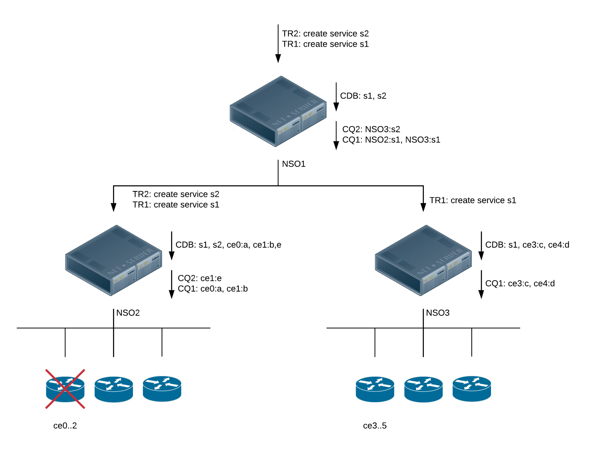
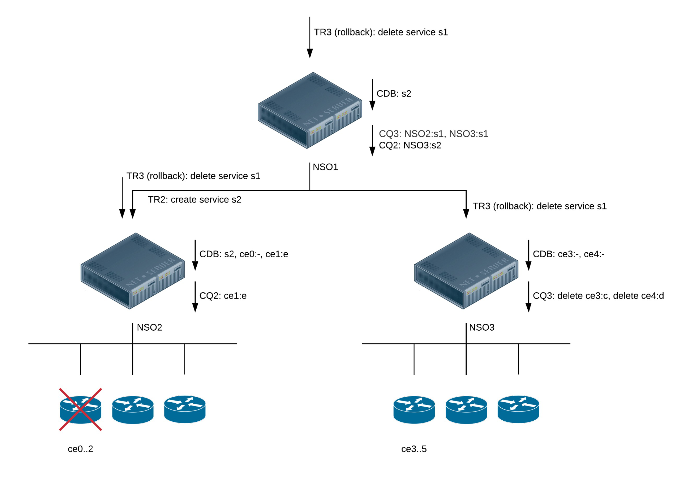

# Device Manager

The NSO device manager is the center of NSO. The device manager maintains a flat list of all managed devices. Normally NSO keeps the primary copy of the configuration for each managed device in the CDB. Whenever a configuration change is done to the list of device configuration primary copies, the device manager will partition this network configuration change into the corresponding changes for the managed devices. The device manager passes on the required changes to the NEDs (Network Element Drivers). A NED needs to be installed for every type of device OS, like Cisco IOS NED, Cisco XR NED, Juniper JUNOS NED, etc. The NEDs communicate through the native device protocol southbound.

The NEDs fall into the following categories:

* **NETCONF-capable device**: The Device Manager will produce NETCONF `edit-config` RPC operations for each participating device.
* **SNMP device**: The Device Manager translates the changes made to the configuration into the corresponding SNMP SET PDUs.
* **Device with Cisco CLI**: The device has a CLI with the same structure as Cisco IOS or XR routers. The Device Manager and a CLI NED are used to produce the correct sequence of CLI commands which reflects the changes made to the configuration.
* **Other devices**: For devices that do not fit into any of the above-mentioned categories, a corresponding Generic NED is invoked. Generic NEDs are used for proprietary protocols like REST and for CLI flavors that do not resemble IOS or XR. The Device Manager will inform the Generic NED about the made changes and the NED will translate these to the appropriate operations toward the device.

NSO orchestrates an atomic transaction that has the very desirable characteristic of either the transaction as a whole ending up on all participating devices and in the NSO primary copy, or alternatively, the whole transaction getting aborted and resultingly, all changes getting automatically rolled back.

The architecture of the NETCONF protocol is the enabling technology making it possible to push out configuration changes to managed devices and then in the case of other errors, roll back changes. Devices that do not support NETCONF, i.e., devices that do not have transactional capabilities can also participate, however depending on the device, error recovery may not be as good as it is for a proper NETCONF-enabled device.

To understand the main idea behind the NSO device manager it is necessary to understand the NSO data model and how NSO incorporates the YANG data models from the different managed devices.

The NEDs will publish YANG data models even for non-NETCONF devices. In the case of SNMP the YANG models are generated from the MIBs. For JunOS devices the JunOS NED generates a YANG from the JunOS XML Schema. For Schema-less devices like CLI devices, the NED developer writes YANG models corresponding to the CLI structure. The result of this is the device manager and NSO CDB has YANG data models for all devices independent of the underlying protocol.

Throughout this section, we will use the [examples.ncs/service-management/mpls-vpn-java](https://github.com/NSO-developer/nso-examples/tree/6.4/service-management/mpls-vpn-java) example. The example network consists of Cisco ASR 9k and Juniper core routers (P and PE) and Cisco IOS-based CE routers.

<figure><figcaption><p>NSO Example Network</p></figcaption></figure>

## Managed Device Tree <a href="#user_guide.devicemanager.device-tree" id="user_guide.devicemanager.device-tree"></a>

The central part of the NSO YANG model, in the file `tailf-ncs-devices.yang`, has the following structure:


```yang
submodule tailf-ncs-devices {
  belongs-to tailf-ncs {
    prefix ncs;
  }
  ...
  container devices {
    ......
    list device {
      key name;

      description
        "This list contains all devices managed by NCS.";

      leaf name {
        type string;
        description
          "A string uniquely identifying the managed device.";
      }

      leaf address {
        type inet:host;
        mandatory true;
        description
          "IP address or host name for the management interface on
           the device.";
      }
      leaf port {
        type inet:port-number;
        description
          "Port for the management interface on the device.  If this leaf
           is not configured, NCS will use a default value based on the
           type of device.  For example, a NETCONF device uses port 830,
           a CLI device over SSH uses port 22, and a SNMP device uses
           port 161.";
      }
      ....
      leaf authgroup {
        ....
      }
      container device-type {
      .......
      container config {
         ...
      }
  }
}
```


Each managed device is uniquely identified by its name, which is a free-form text string. This is typically the DNS name of the managed device but could equally well be the string format of the IP address of the managed device or anything else. Furthermore, each managed device has a mandatory address/port pair that together with the `authgroup` leaf provides information to NSO on how to connect and authenticate over SSH/NETCONF to the device. Each device also has a mandatory parameter `device-type` that specifies which southbound protocol to use for communication with the device.

The following device types are available:

* NETCONF
* CLI: A corresponding CLI NED is needed to communicate with the device. This requires YANG models with the appropriate annotations for the device CLI.
* SNMP: The device speaks SNMP, preferably in read-write mode.
* Generic NED: A corresponding Generic NED is needed to communicate with the device. This requires YANG models and Java code.

The NSO CLI command below lists the NED types for the devices in the example network.

```cli
ncs(config)# show full-configuration devices device device-type
devices device ce0
 device-type cli ned-id cisco-ios-cli-3.8
!
...
devices device p0
 device-type cli ned-id cisco-iosxr-cli-3.5
!
devices device p1
 device-type cli ned-id cisco-iosxr-cli-3.5
!
...
devices device pe2
 device-type netconf ned-id juniper-junos-nc-3.0
!
```

The empty container `/ncs:devices/device/config` is used as a mount point for the YANG models from the different managed devices.

As previously mentioned, NSO needs the following information to manage a device:

* The IP/Port of the device and authentication information.
* Some or all of the YANG data models for the device.

In the example setup, the address and authentication information are provided in the NSO database (CDB) initialization file. There are many different ways to add new managed devices. All of the NSO northbound interfaces can be used to manipulate the set of managed devices. This will be further described later.

Once NSO has started you can inspect the meta information for the managed devices through the NSO CLI. This is an example session:


```cli
ncs(config)# show full-configuration devices device
devices device ce0
 address   127.0.0.1
 port      10022
 ssh host-key ssh-dss
 ...
 authgroup default
 device-type cli ned-id cisco-ios-cli-3.8
 state admin-state unlocked
 config
 ...
 !
!
devices device ce1
 address   127.0.0.1
 port      10023
 ssh host-key ssh-dss
...
 !
 authgroup default
 device-type cli ned-id cisco-ios-cli-3.8
 state admin-state unlocked
 config
 ...
 !
!
```


Alternatively, this information could be retrieved from the NSO northbound NETCONF interface by running the simple Python-based netconf-console program towards the NSO NETCONF server.


```bash
$ netconf-console --get-config -x "/devices/device[name='ce0']"
<?xml version="1.0" encoding="UTF-8"?>
<rpc-reply xmlns="urn:ietf:params:xml:ns:netconf:base:1.0" message-id="1">
  <data>
    <devices xmlns="http://tail-f.com/ns/ncs">
      <device>
        <name>ce0</name>
        <address>127.0.0.1</address>
        <port>10022</port>
        <ssh>
          <host-key>
            <algorithm>ssh-dss</algorithm>

            ...

        <authgroup>default</authgroup>
        <device-type>
          <cli>
          <ned-id xmlns:cisco-ios-cli-3.8="http://tail-f.com/ns/ned-id/cisco-ios-cli-3.8">
            cisco-ios-cli-3.8:cisco-ios-cli-3.8
          </ned-id>
          </cli>
        </device-type>
        <state>
          <admin-state>unlocked</admin-state>
        </state>
        <config>

        ...

        </config>
      </device>
    </devices>
  </data>
</rpc-reply>
```


All devices in the above two examples (Show Device Configuration in NSO CLI and Show Device Configuration in NETCONF) have `/devices/device/state/admin-state` set to `unlocked`, this will be described later in this section.

## The NED Packages <a href="#user_guide.devicemanager.ned-packages" id="user_guide.devicemanager.ned-packages"></a>

To communicate with a managed device, a NED for that device type needs to be loaded by NSO. A NED contains the YANG model for the device and corresponding driver code to talk CLI, REST, SNMP, etc. NEDs are distributed as packages.


```cli
ncs# show packages
packages package cisco-ios-cli-3.8
 package-version 3.8.0.1
 description     "NED package for Cisco IOS"
 ncs-min-version [ 3.2.2 3.3 3.4 ]
 directory       ./state/packages-in-use/1/cisco-ios-cli-3.8
 component IOSDp2
  callback java-class-name [ com.tailf.packages.ned.ios.IOSDp2 ]
 component IOSDp
  callback java-class-name [ com.tailf.packages.ned.ios.IOSDp ]
 component cisco-ios
  ned cli ned-id  cisco-ios-cli-3.8
  ned cli java-class-name com.tailf.packages.ned.ios.IOSNedCli
  ned device vendor Cisco
 ...
 oper-status up
packages package cisco-iosxr-cli-3.5
 package-version 3.5.0.7
 description     "NED package for Cisco IOS XR"
 ncs-min-version [ 3.2.2 3.3 ]
 directory       ./state/packages-in-use/1/cisco-iosxr-cli-3.5
 component cisco-ios-xr
  ned cli ned-id  cisco-iosxr-cli-3.5
  ned cli java-class-name com.tailf.packages.ned.iosxr.IosxrNedCli
  ned device vendor Cisco
 ...
 oper-status up
packages package juniper-junos-nc-3.0
 package-version 3.0.14.2
 description     "NED package for all JunOS based Juniper routers"
 ncs-min-version [ 3.0.0.1 3.1 3.2 3.3 3.4 ]
 directory       ./state/packages-in-use/1/juniper-junos-nc-3.0
 component junos
  ned netconf ned-id juniper-junos-nc-3.0
  ned device vendor Juniper
 oper-status up
 ...
```


The CLI command in the above example (Installed Packages) shows all the loaded packages. NSO loads packages at startup and can reload packages at run-time. By default, the packages reside in the `packages` directory in the NSO run-time directory.

<pre><code>$ ls -l $NCS_DIR/examples.ncs/service-management/mpls-vpn-java
total 160
...
drwxr-xr-x   8 stefan  staff    272 Oct  1 16:57 packages
...
<strong>$ ls -l $NCS_DIR/examples.ncs/service-management/mpls-vpn-java/packages
</strong>total 24
cisco-ios
cisco-iosxr
juniper-junos
...
</code></pre>

## Starting the NSO Daemon <a href="#user_guide.devicemanager.starting-ncs" id="user_guide.devicemanager.starting-ncs"></a>

Once you have access to the network information for a managed device, its IP address and authentication information, as well as the data models of the device, you can actually manage the device from NSO.

You start the `ncs` daemon in a terminal like:

```cli
% ncs
```

Which is the same as, NSO loads it config from a `ncs.conf` file

```cli
% ncs -c ./ncs.conf
```

During development, it is sometimes convenient to run `ncs` in the foreground as:

```cli
% ncs -c ./ncs.conf --foregound --verbose
```

Once the daemon is running, you can issue the command:

```cli
% ncs --status
vsn: 7.1
SMP support: yes, using 8 threads
Using epoll: yes
available modules: backplane,netconf,cdb,cli,snmp,webui
...
... lots of output
```

To get more information about options to `ncs` do:

```cli
% ncs --help
```

The `ncs --status` command produces a lengthy list describing for example which YANG modules are loaded in the system. This is a valuable debug tool.

The same information is also available in the NSO CLI (and thus through all available northbound interfaces, including Maapi for Java programmers)

```cli
ncs# show ncs-state
ncs-state version 7.1
ncs-state smp number-of-threads 8
ncs-state epoll true
ncs-state daemon-status started
...
```

## Synchronizing Devices <a href="#user_guide.devicemanager.sync" id="user_guide.devicemanager.sync"></a>

When the NSO daemon is running and has been initialized with IP/Port and authentication information, as well as imported all modules, you can start to manage devices through NSO.

NSO provides the ability to synchronize the configuration to or from the device. If you know that the device has the correct configuration you can choose to synchronize from a managed device whereas if you know NSO has the correct device configuration and the device is incorrect, you can choose to synchronize from NSO to the device.

In the normal case, the configuration on the device and the copy of the configuration inside NSO should be identical.

In a cold start situation like in the [examples.ncs/service-management/mpls-vpn-java](https://github.com/NSO-developer/nso-examples/tree/6.4/service-management/mpls-vpn-java) example, where NSO is empty and there are network devices to talk to, it makes sense to synchronize from the devices. You can choose to synchronize from one device at a time or from all devices at once. Here is a CLI session to illustrate this.


```cli
ncs(config)# devices sync-from
sync-result {
    device ce0
    result true
}
sync-result {
    device ce1
    result true
}
sync-result {
    device ce2
    result true
...
ncs(config)# show full-configuration devices device ce0
devices device ce0
...
 config
  no ios:service pad
  no ios:ip domain-lookup
  no ios:ip http secure-server
  ios:ip source-route
  ios:interface GigabitEthernet0/1
  exit
  ios:interface GigabitEthernet0/10
  exit
  ios:interface GigabitEthernet0/11
  exit
...
[ok][2010-04-13 16:29:15]
```


The command `devices sync-from`, in example (Synchronize from Devices), is an action that is defined in the NSO data model. It is important to understand the model-driven nature of NSO. All devices are modeled in YANG, network services like MPLS VPN are also modeled in YANG, and the same is true for NSO itself. Anything that can be performed over the NSO CLI or any north-bound is defined in the YANG files. The NSO YANG files are located here:

```
$ls $NCS_DIR/src/ncs/yang/
```

Packages can add other YANG files as well. For example the directory `packages/cisco-ios/src/yang/` contains the YANG definition of an IOS device.

The `tailf-ncs.yang` file defines the main NSO YANG data model; it includes parts of the model from many different submodule files.

The actions `sync-from` and `sync-to` are modeled in the file `tailf-ncs-devices.yang`. The sync action(s) are defined as:


```
  grouping sync-from-output {
    list sync-result {
      key device;
      leaf device {
        type leafref {
          path "/devices/device/name";
        }
      }
      uses sync-result;
    }
  }

  grouping sync-result {
    description
      "Common result data from a 'sync' action.";

    choice outformat {
      leaf result {
        type boolean;
      }
      anyxml result-xml;
      leaf cli {
        tailf:cli-preformatted;
        type string;
      }
    }
    leaf info {
      type string;
      description
        "If present, contains additional information about the result.";
    }
  }

  ...

  container devices {

    ...

    tailf:action sync-from {
      description
        "Synchronize the configuration by pulling from all unlocked
         devices.";
      tailf:info "Synchronize the config by pulling from the devices";
      tailf:actionpoint ncsinternal {
        tailf:internal;
      }
      input {
        leaf suppress-positive-result {
          type empty;
          description
            "Use this additional parameter to only return
             devices that failed to sync.";
        }
        container dry-run {
          presence "";
          leaf outformat {
            type outformat2;
            description
              "Report what would be done towards CDB, without
               actually doing anything.";
          }
        }
      }
      output {
        uses sync-from-output;
      }
    }

    ...

    tailf:action sync-to {
      ...
    }

    ...

    list device {
      description
        "This list contains all devices managed by NCS.";

      key name;

      leaf name {
        description "A string uniquely identifying the managed device";
        type string;
      }

      ...

      tailf:action sync-from {
        description
          "Synchronize the configuration by pulling from the device.";
        tailf:info "Synchronize the config by pulling from the device";
        tailf:actionpoint ncsinternal {
          tailf:internal;
        }
        input {
          container dry-run {
            presence "";
            leaf outformat {
              type outformat2;
              description
                "Report what would be done towards CDB, without
                 actually doing anything.";
            }
          }
        }
        output {
          uses sync-result;
        }
      }
      tailf:action sync-to {

      ...
```


Synchronizing from NSO to the device is common when a device has been configured out-of-band. NSO has no means to enforce that devices are not directly reconfigured behind the scenes of NSO; however, once an out-of-band configuration has been performed, NSO can detect the fact. When this happens, it may (or may not, depending on the situation at hand) make sense to synchronize from NSO to the device, i.e. undo the rogue reconfigurations.

The command to do that is:

```cli
ncs# devices device ce0 sync-to
result true
```

A `dry-run` option is available for the action `sync-to`.

```cli
ncs# devices device ce0 sync-to dry-run
data {
    ...
}
```

This makes it possible to investigate the changes before they are transmitted to the devices.

### Partial `sync-from` <a href="#d5e2872" id="d5e2872"></a>

It is possible to synchronize a part of the configuration (a certain subtree) from the device using the `partial-sync-from` action located under /devices. While it is primarily intended to be used by service developers as described in [Partial Sync](../../development/advanced-development/developing-services/services-deep-dive.md#ch_svcref.partialsync), it is also possible to use directly from the NSO CLI (or any other northbound interface). The example below (Example of Running partial-sync-from Action via CLI) illustrates using this action via CLI, using a router device from the [examples.ncs/device-management/router-network](https://github.com/NSO-developer/nso-examples/tree/6.4/device-management/router-network) example.


```bash
$ ncs_cli -C -u admin
ncs# devices partial-sync-from path [ \
/devices/device[name='ex0']/config/r:sys/interfaces/interface[name='eth0'] \
/devices/device[name='ex1']/config/r:sys/dns/server ]
sync-result {
    device ex0
    result true
}
sync-result {
    device ex1
    result true
}
ncs# show running-config devices device ex0..1 config
devices device ex0
 config
  r:sys interfaces interface eth0
   unit 0
    enabled
   !
   unit 1
    enabled
   !
   unit 2
    enabled
    description "My Vlan"
    vlan-id     18
   !
  !
 !
!
devices device ex1
 config
  r:sys dns server 10.2.3.4
  !
 !
!
```


## Configuring Devices

It is now possible to configure several devices through the NSO inside the same network transaction. To illustrate this, start the NSO CLI from a terminal application.


```bash
$ ncs_cli -C -u admin
ncs# config
Entering configuration mode terminal
ncs(config)# devices device pe1 config cisco-ios-xr:snmp-server \
     community public RO
ncs(config-config)# top
ncs(config)# devices device ce0 config ios:snmp-server community public RO
ncs(config-config)# devices device pe2 config junos:configuration \
      snmp community public view RO
ncs(config-community-public)# top
ncs(config)# show configuration
devices device ce0
 config
  ios:snmp-server community public RO
 !
!
devices device pe1
 config
  cisco-ios-xr:snmp-server community public RO
 !
!
devices device pe2
 config
  ! first
  junos:configuration snmp community public
   view RO
  !
 !
!
ncs(config)# commit dry-run outformat native
native {
    device {
        name ce0
        data snmp-server community public RO
    }
    device {
        name pe1
        data snmp-server community public RO
    }
    device {
        name pe2
        data <rpc xmlns="urn:ietf:params:xml:ns:netconf:base:1.0"
                  message-id="1">
               <edit-config xmlns:nc="urn:ietf:params:xml:ns:netconf:base:1.0">
                 <target>
                   <candidate/>
                 </target>
                 <test-option>test-then-set</test-option>
                 <error-option>rollback-on-error</error-option>
                 <config>
                   <configuration xmlns="http://xml.juniper.net/xnm/1.1/xnm">
                     <snmp>
                       <community>
                         <name>public</name>
                         <view>RO</view>
                       </community>
                     </snmp>
                   </configuration>
                 </config>
               </edit-config>
             </rpc>
    }
}
ncs(config)# commit
```


The example above (Configure Devices) illustrates a multi-host transaction. In the same transaction, three hosts were re-configured. Had one of them failed, or been non-operational, the transaction as a whole would have failed.

As seen from the output of the command `commit dry-run outformat native`, NSO generates the native CLI and NETCONF commands which will be sent to each device when the transaction is committed.

Since the `/devices/device/config` path contains different models depending on the augmented device model NSO uses the data model prefix in the CLI names; `ios`, `cisco-ios-xr` and `junos`. Different data models might use the same name for elements and the prefix avoids name clashes.

NSO uses different underlying techniques to implement the atomic transactional behavior in case of any error. NETCONF devices are straightforward using confirmed commit. For CLI devices like IOS NSO calculates the reverse diff to restore the configuration to the state before the transaction was applied.

## Connection Management <a href="#user_guide.devicemanager.connection-mgmt" id="user_guide.devicemanager.connection-mgmt"></a>

Each managed device needs to be configured with the IP address and the port where the CLI, NETCONF server, etc. of the managed device listens for incoming requests.

Connections are established on demand as they are needed. It is possible to explicitly establish connections, but that functionality is mostly there for troubleshooting connection establishment. We can, for example, do:

```cli
ncs# devices connect
connect-result {
    device ce0
    result true
    info (admin) Connected to ce0 - 127.0.0.1:10022
}
connect-result {
    device ce1
    result true
    info (admin) Connected to ce1 - 127.0.0.1:10023
}
...
```

We were able to connect to all managed devices. It is also possible to explicitly attempt to test connections to individual managed devices:

```cli
ncs# devices device ce0 connect
result true
info (admin) Connected to ce0 - 127.0.0.1:10022
```

Established connections are typically not closed right away when not needed, but rather pooled according to the rules described in [Device Session Pooling](nso-device-manager.md#user_guide.devicemanager.pooling). This applies to NETCONF sessions as well as sessions established by CLI or generic NEDs via a connection-oriented protocol. In addition to session pooling, underlying SSH connections for NETCONF devices are also reused. Note that a single NETCONF session occupies one SSH channel inside an SSH connection, so multiple NETCONF sessions can co-exist in a single connection. When an SSH connection has been idle (no SSH channels open) for 2 minutes, the SSH connection is closed. If a new connection is needed later, a connection is established on demand.

Three configuration parameters can be used to control the connection establishment: `connect-timeout`, `read-timeout`, and `write-timeout`. In the NSO data model file `tailf-ncs-devices.yang`, these timeouts are modeled as:

```yang
submodule tailf-ncs-devices {
  ...
  container devices {
    ...
    grouping timeouts {
      description
        "Timeouts used when communicating with a managed device.";

      leaf connect-timeout {
        type uint32;
        units "seconds";
        description
          "The timeout in seconds for new connections to managed
           devices.";
      }
      leaf read-timeout {
        type uint32;
        units "seconds";
        description
          "The timeout in seconds used when reading data from a
           managed device.";
      }
      leaf write-timeout {
        type uint32;
        units "seconds";
        description
          "The timeout in seconds used when writing data to a
           managed device.";
      }
    }
    ...
    container global-settings {
      ...
      uses timeouts {
        description
          "These timeouts can be overridden per device.";

        refine connect-timeout {
          default 20;
        }
        refine read-timeout {
          default 20;
        }
        refine write-timeout {
          default 20;
        }
      }
      ....
```

Thus, to change these parameters (globally for all managed devices) you do:

```cli
ncs(config)# devices global-settings connect-timeout 30
ncs(config)# devices global-settings read-timeout 30
ncs(config)# commit
```

Or, to use a profile:

```cli
ncs(config)# devices profiles profile slow-devices connect-timeout 60
ncs(config-profile-slow-devices)# read-timeout 60
ncs(config-profile-slow-devices)# write-timeout 60
ncs(config-profile-slow-devices)# commit

ncs(config)# devices device ce3 device-profile slow-devices
ncs(config-device-ce3)# commit
```

## Authentication Groups <a href="#user_guide.devicemanager.authgroups" id="user_guide.devicemanager.authgroups"></a>

When NSO connects to a managed device, it requires authentication information for that device. The `authgroups` are modeled in the NSO data model:


```yang
submodule tailf-ncs-devices {
  ...
  container devices {
    ...

    container authgroups {
      description
        "Named authgroups are used to decide how to map a local NCS user to
         remote authentication credentials on a managed device.

         The list 'group' is used for NETCONF and CLI managed devices.

         The list 'snmp-group' is used for SNMP managed devices.";

      list group {
        key name;

        description
          "When NCS connects to a managed device, it locates the
           authgroup configured for that device.  Then NCS looks up
           the local NCS user name in the 'umap' list.  If an entry is
           found, the credentials configured is used when
           authenticating to the managed device.

           If no entry is found in the 'umap' list, the credentials
           configured in 'default-map' are used.

           If no 'default-map' has been configured, and the local NCS
           user name is not found in the 'umap' list, the connection
           to the managed device fails.";

        grouping remote-user-remote-auth {
          description
            "Remote authentication credentials.";

          choice login-credentials {
            mandatory true;
            case stored {
              choice remote-user {
                mandatory true;
                leaf same-user {
                  type empty;
                  description
                    "If this leaf exists, the name of the local NCS user is used
                     as the remote user name.";
                }
                leaf remote-name {
                  type string;
                  description
                    "Remote user name.";
                }
              }

              choice remote-auth {
                mandatory true;
                leaf same-pass {
                  type empty;
                  description
                    "If this leaf exists, the password used by the local user
                     when logging in to NCS is used as the remote password.";
                }
                leaf remote-password {
                  type tailf:aes-256-cfb-128-encrypted-string;
                  description
                    "Remote password.";
                }
                case public-key {
                  uses public-key-auth;
                }
              }
              leaf remote-secondary-password {
                type tailf:aes-256-cfb-128-encrypted-string;
                description
                  "Some CLI based devices require a second
                   additional password to enter config mode";
              }
            }
            case callback {
              leaf callback-node {
                description
                  "Invoke a standalone action to retrieve login credentials for
                  managed devices on the 'callback-node' instance.

                  The 'action-name' action is invoked on the callback node that
                  is specified by an instance identifer.";
                mandatory true;
                type instance-identifier;
              }
              leaf action-name {
                description
                  "The action to call when a notification is received.

                  The action must use 'authgroup-callback-input-params'
                  grouping for input and 'authgroup-callback-output-params'
                  grouping for output from tailf-ncs-devices.yang.";
                type yang:yang-identifier;
                mandatory true;
                tailf:validate ncs {
                   tailf:internal;
                   tailf:dependency "../callback-node";
                }
              }
            }
          }
        }

        grouping mfa-grouping {
          container mfa {
            presence "MFA";
            description
              "Settings for handling multi-factor authentication towards
               the device";
            leaf executable {
              description "Path to the external executable handling MFA";
              type string;
              mandatory true;
            }
            leaf opaque {
              description
                "Opaque data for the external MFA executable.
                 This string will be base64 encoded and passed to the MFA
                 executable along with other parameters";
              type string;
            }
          }
        }

        leaf name {
          type string;
          description
            "The name of the authgroup.";
        }

        container default-map {
          presence "Map unknown users";
          description
            "If an authgroup has a default-map, it is used if a local
             NCS user is not found in the umap list.";
          tailf:info "Remote authentication parameters for users not in umap";
          uses remote-user-remote-auth;
          uses mfa-grouping;
        }

        list umap {
          key local-user;
          description
            "The umap is a list with the local NCS user name as key.
             It maps the local NCS user name to remote authentication
             credentials.";
          tailf:info "Map NCS users to remote authentication parameters";
          leaf local-user {
            type string;
            description
              "The local NCS user name.";
          }
          uses remote-user-remote-auth;
          uses mfa-grouping;
        }
      }
```


Each managed device must refer to a named authgroup. The purpose of an authentication group is to map local users to remote users together with the relevant SSH authentication information.

Southbound authentication can be done in two ways. One is to configure the stored user and credential components as shown in the example below (Configured authgroup) and the next example (authgroup default-map). The other way is to configure a callback to retrieve user and credentials on demand as shown in the example below (authgroup-callback).


```cli
ncs(config)# show full-configuration devices authgroups
devices authgroups group default
 umap admin
  remote-name     admin
  remote-password $4$wIo7Yd068FRwhYYI0d4IDw==
 !
 umap oper
  remote-name     oper
  remote-password $4$zp4zerM68FRwhYYI0d4IDw==
 !
!
devices authgroups snmp-group default
 default-map community-name public
 umap admin
  usm remote-name admin
  usm security-level auth-priv
  usm auth md5 remote-password $4$wIo7Yd068FRwhYYI0d4IDw==
  usm priv des remote-password $4$wIo7Yd068FRwhYYI0d4IDw==
 !
!
```


In the example above (Configured authgroup) in the auth group named `default`, the two local users `oper` and `admin` shall use the remote users' name `oper` and `admin` respectively with identical passwords.

Inside an authgroup, all local users need to be enumerated. Each local user name must have credentials configured which should be used for the remote host. In centralized AAA environments, this is usually a bad strategy. You may also choose to instantiate a `default-map`. If you do that it probably only makes sense to specify the same user name/password pair should be used remotely as the pair that was used to log into NSO.


```cli
ncs(config)# devices authgroups group default default-map same-user same-pass
ncs(config-group-default)# commit
Commit complete.
ncs(config-group-default)# top
ncs(config)# show full-configuration devices authgroups
devices authgroups group default
 default-map same-user
 default-map same-pass
 umap admin
  remote-name     admin
  remote-password $4$wIo7Yd068FRwhYYI0d4IDw==
 !
 umap oper
  remote-name     oper
  remote-password $4$zp4zerM68FRwhYYI0d4IDw==
 !
!
devices authgroups snmp-group default
 default-map community-name public
 umap admin
  usm remote-name admin
  usm security-level auth-priv
  usm auth md5 remote-password $4$wIo7Yd068FRwhYYI0d4IDw==
  usm priv des remote-password $4$wIo7Yd068FRwhYYI0d4IDw==
 !
!
```


In the example (Configured authgroup), only two users `admin` and `oper` were configured. If the `default-map` in example (authgroup default-map) is configured, all local users not found in the `umap` list will end up in the `default-map`. For example, if the user `rocky` logs in to NSO with the password `secret`. Since NSO has a built-in SSH server and also a built-in HTTPS server, NSO will be able to pick up the clear text passwords and can then reuse the same password when NSO attempts to establish southbound SSH connections. The user `rocky` will end up in the `default-map` and when NSO attempts to propagate `rocky`'s changes towards the managed devices, NSO will use the remote user name `rocky` with whatever password `rocky` used to log into NSO.

Authenticating southbound using stored configuration has two main components to define remote user and remote credentials. This is defined by the authgroup. As for the southbound user, there exist two options, the same user logged in to NSO or another user, as specified in the authgroup. As for the credentials, there are three options.

1. Regular password.
2. Public key. This means that a private key, either from a file in the user's SSH key directory, or one that is configured in the /ssh/private-key list in the NSO configuration, is used for authentication. Refer to [Publickey Authentication](ssh-key-management.md#d5e4113) for the details on how the private key is selected.
3. Finally, an interesting option is to use the 'same-pass' option. Since NSO runs its own SSH server and its own SSL server, NSO can pick up the password of a user in clear text. Hence, if the 'same-pass' option is chosen for an authgroup, NSO will reuse the same password when attempting to connect southbound to a managed device.

### Connecting Using SSH Keyboard-Interactive (Multi-Factor) Authentication

NSO can connect to a device that is using multi-factor authentication. For this, the `authgroup` must be configured with an executable for handling the keyboard-interactive part, and optionally some opaque data that is passed to the executable. i.e., the `/devices/authgroups/group/umap/mfa/executable` and `/devices/authgroups/group/umap/mfa/opaque` (or under `default-map` for users that are not in `umap`) must be configured.

The prompts from the SSH server (including the password prompt and any additional challenge prompts) are passed to the `stdin` of the executable along with some other relevant data. The executable must write a single line to its `stdout` as the reply to the prompt. This is the reply that NSO sends to the SSH server.


```
admin@ncs(config)# devices authgroups group mfa umap admin
admin@ncs(config-umap-admin)# remote-name admin remote-password
(<AES encrypted string>): *********
admin@ncs(config-umap-admin)# mfa executable ./handle_mfa.py opaque foobar
admin@ncs(config-umap-admin)# commit
Commit complete.
```


For example, with the above configured for the authgroup, if the user `admin` is trying to log in to the device `dev0` with password `admin`, this is the line that is sent to the `stdin` of the `handle_mfa.py` script:

```
[ZGV2MA==;YWRtaW4=;YWRtaW4=;Zm9vYmFy;;;YWRtaW5AbG9jYWxob3N0J3MgcGFzc3dvcmQ6IA==;]
```

The input to the script is the device, username, password, opaque data, as well as the name, instruction, and prompt from the SSH server. All these fields are base64 encoded, and separated by a semi-colon (`;`). So, the above line in effect encodes the following:

```
[dev0;admin;admin;foobar;;;admin@localhost's password:;]
```

A small Python program can be used to implement the keyboard-interactive authentication towards a device, such as:

```python
#!/usr/bin/env python3
import base64
line = input()
(device, user, passwd, opaque, name, instr, prompt, _) = map(
        lambda x: base64.b64decode(x).decode('utf-8'),
        line.strip('[]').split(';'))
if prompt == "admin@localhost's password: ":
    print(passwd)
elif prompt == "Enter SMS passcode:":
    print("secretSMScode")
else:
    print("2")
```

This script will then be invoked with the above fields for every prompt from the server, and the corresponding output from the script will be sent as the reply to the server.

### Using a Callback to Provide Device Credentials

In the case of authenticating southbound using a callback, remote user and remote credentials are obtained by an action invocation. The action is defined by the `callback-node` and `action-name` as in the example below (authgroup-callback) and supported credentials are remote password and optionally a secondary password for the provided local user, authgroup, and device.

With remote passwords, you may encounter issues if you use special characters, such as quotes (`"`) and backslash (`\`) in your password. See [Configure Mode](../cli/introduction-to-nso-cli.md#d5e2199) for recommendations on how to avoid running into password issues.


```cli
ncs(config)# devices authgroups group default umap oper
ncs(config-umap-oper)# callback-node /callback action-name auth-cb
ncs(config-group-oper)# commit
Commit complete.
ncs(config-group-oper)# top
ncs(config)# show full-configuration devices authgroups
devices authgroups group default
 default-map same-user
 default-map same-pass
 umap admin
  remote-name     admin
  remote-password $4$wIo7Yd068FRwhYYI0d4IDw==
 !
 umap oper
  callback-node /callback
  action-name   auth-cb
 !
!
devices authgroups snmp-group default
 default-map community-name public
 umap admin
  usm remote-name admin
  usm security-level auth-priv
  usm auth md5 remote-password $4$wIo7Yd068FRwhYYI0d4IDw==
  usm priv des remote-password $4$wIo7Yd068FRwhYYI0d4IDw==
 !
!
```



```yang
module authgroup-callback {
  namespace "http://com/example/authgroup-callback";
  prefix authgroup-callback;

  import tailf-common {
    prefix tailf;
  }

  import tailf-ncs {
    prefix ncs;
  }

  container callback {
    description
      "Example callback that defines an action to retrieve
       remote authentication credentials";
    tailf:action auth-cb {
      tailf:actionpoint auth-cb-point;
      input {
        uses ncs:authgroup-callback-input-params;
      }
      output {
        uses ncs:authgroup-callback-output-params;
      }
    }
  }
}
```


In the example above (`authgroup-callback`), the configuration for the `umap` entry of the `oper` user is changed to use a callback to retrieve southbound authentication credentials. Thus, NSO is going to invoke the action `auth-cb` defined in the callback-node `callback`. The callback node is of type `instance-identifier` and refers to the container called `callback` defined in the example, (`authgroup-callback.yang`), which includes an action defined by action-name `auth-cb` and uses groupings `authgroup-callback-input-params` and `authgroup-callback-output-params` for input and output parameters respectively. In the example, (authgroup-callback), `authgroup-callback` module was loaded in NSO within an example package. Package development and action callbacks are not described here but more can be read in [Package Development](../../development/advanced-development/developing-packages.md), the section called [DP API](../../development/core-concepts/api-overview/java-api-overview.md#ug.java_api_overview.dp) and [Python API Overview](../../development/core-concepts/api-overview/python-api-overview.md).

### Caveats <a href="#d5e3032" id="d5e3032"></a>

Authentication groups and the functionality they bring come with some limitations on where and how it is used.

* The callback option that enables `authgroup-callback` feature is not applicable for members of `snmp-group` list.
* Generic devices that implement their own authentication scheme do not use any mapping or callback functionality provided by Authgroups.
* Cluster nodes use their own authgroups and mapping model, thus functionality differs, e.g. callback option is not applicable.

## Device Session Pooling <a href="#user_guide.devicemanager.pooling" id="user_guide.devicemanager.pooling"></a>

Opening a session towards a managed device is potentially time and resource-consuming. Also, the probability that a recently accessed device is still subject to further requests is reasonably high. These are motives for having a managed devices session pool in NSO.

The NSO device session pool is by default active and normally needs no maintenance. However, under certain circumstances, it might be of interest to modify its behavior. Examples can be when some device type has characteristics that make session pooling undesired, or when connections to a specific device are very costly, and therefore the time that open sessions can stay in the pool should increase.


Changes from the default configuration of the NSO session pool should only be performed when absolutely necessary and when all effects of the change are understood.


NSO presents operational data that represent the current state of the session pool. To visualize this, we use the CLI to connect to NSO and force connection to all known devices:

```bash
$ ncs_cli -C -u admin

admin connected from 127.0.0.1 using console on ncs
ncs# devices connect suppress-positive-result
```

We can now list all open sessions in the `session-pool`. But note that this is a live pool. Sessions will only remain open for a certain amount of time, the idle time.

```cli
ncs# show devices session-pool
        DEVICE            MAX        IDLE
DEVICE  TYPE    SESSIONS  SESSIONS   TIME
-------------------------------------------
ce0     cli     1         unlimited  30
ce1     cli     1         unlimited  30
ce2     cli     1         unlimited  30
ce3     cli     1         unlimited  30
ce4     cli     1         unlimited  30
ce5     cli     1         unlimited  30
pe0     cli     1         unlimited  30
pe1     cli     1         unlimited  30
pe2     cli     1         unlimited  30
```

In addition to the idle time for sessions, we can also see the type of device, current number of pooled sessions, and maximum number of pooled sessions.

We can close pooled sessions for specific devices.

```cli
ncs# devices session-pool pooled-device pe0 close
ncs# devices session-pool pooled-device pe1 close
ncs# devices session-pool pooled-device pe2 close
ncs# show devices session-pool
        DEVICE            MAX        IDLE
DEVICE  TYPE    SESSIONS  SESSIONS   TIME
-------------------------------------------
ce0     cli     1         unlimited  30
ce1     cli     1         unlimited  30
ce2     cli     1         unlimited  30
ce3     cli     1         unlimited  30
ce4     cli     1         unlimited  30
ce5     cli     1         unlimited  30
```

And we can close all pooled sessions in the session pool.

```cli
ncs# devices session-pool close
ncs# show devices session-pool
% No entries found.
```

The session pool configuration is found in the `tailf-ncs-devices.yang` submodel. The following part of the YANG device-profile-parameters grouping controls how the session pool is configured:

```
grouping device-profile-parameters {

  ...

    container session-pool {
      tailf:info "Control how sessions to related devices can be pooled.";
      description
        "NCS uses NED sessions when performing transactions, actions
         etc towards a device. When such a task is completed the NED
         session can either be closed or pooled.

         Pooling a NED session means that the session to the
         device is kept open for a configurable amount of
         time. During this time the session can be re-used for a new
         task. Thus the pooling concept exists to reduce the number
         of new connections needed towards a device that is often
         used.

         By default NCS uses pooling for all device types except
         SNMP. Normally there is no need to change the default
         values.";

      leaf max-sessions {
        type union {
          type enumeration {
            enum unlimited;
          }
          type uint32;
        }
        description
          "Controls the maximum number of open sessions in the pool for
           a specific device. When this threshold is exceeded the oldest
           session in the pool will be closed.
           A Zero value will imply that pooling is disabled for
           this specific device. The label 'unlimited' implies that no
           upper limit exists for this specific device";
      }

      leaf idle-time {
        tailf:info
          "The maximum time that a session is kept open in the pool";
        type uint32 {
          range "1 .. max";
        }
        units "seconds";
        description
          "The maximum time that a session is kept open in the pool.
           If the session is not requested and used before the
           idle-time has expired, the session is closed.
           If no idle-time is set the default is 30 seconds.";
      }
    }
  }
}
```

This grouping can be found in the NSO model under `/ncs:devices/global-settings/session-pool`, `/ncs:devices/profiles/profile/session-pool` and `/ncs:devices/device/session-pool` to be able to control session pooling for all devices, a group of devices, and a specific device respectively.

In addition under `/ncs:devices/global-settings/session-pool/default` it is possible to control the global max size of the session pool, as defined by the following yang snippet:

```yang
container global-settings {
  tailf:info "Global settings for all managed devices.";
  description
    "Global settings for all managed devices. Some of these
     settings can be overridden per managed device.";

  uses device-profile-parameters {

    ...

    augment session-pool {
      leaf pool-max-sessions {
        type union {
          type enumeration {
            enum unlimited;
          }
          type uint32;
        }
        description
          "Controls the grand total session count in the pool.
           Independently on how different devices are pooled the grand
           total session count can never exceed this value.
           A Zero value will imply that pooling is disabled for all devices.
           The label 'unlimited' implies that no upper limit exists for
           the number open sessions in the pool";
      }
    }
  }
}
```

Let's illustrate the possibilities with an example configuration of the session pool:

```cli
ncs# configure
ncs(config)# devices global-settings session-pool idle-time 100
ncs(config)# devices profiles profile small session-pool max-sessions 3
ncs(config-profile-small)# top
ncs(config)# devices device ce* device-profile small
ncs(config-device-ce*)# top
ncs(config)# devices device pe0 session-pool max-sessions 0
ncs(config-device-pe0)# top
ncs(config)# commit
Commit complete.
ncs(config)# exit
```

In the above configuration, the default idle time is set to 100 seconds for all devices. A device profile called `small` is defined which contains a max-session value of 3 sessions, this profile is set on all `ce*` devices. The devices `pe0` has a max-sessions 0 which implies that this device cannot be pooled. Let's connect all devices and see what happens in the session pool:

```cli
ncs# devices connect suppress-positive-result
ncs# show devices session-pool
        DEVICE            MAX        IDLE
DEVICE  TYPE    SESSIONS  SESSIONS   TIME
-------------------------------------------
ce0     cli     1         3          100
ce1     cli     1         3          100
ce2     cli     1         3          100
ce3     cli     1         3          100
ce4     cli     1         3          100
ce5     cli     1         3          100
pe1     cli     1         unlimited  100
pe2     cli     1         unlimited  100
```

Now, we set an upper limit to the maximum number of sessions in the pool. Setting the value to 4 is too small for a real situation but serves the purpose of illustration:

```cli
ncs# configure
ncs(config)# devices global-settings session-pool pool-max-sessions 4
ncs(config)# commit
Commit complete.
ncs(config)# exit
```

The number of open sessions in the pool will be adjusted accordingly:

```cli
ncs# show devices session-pool
        DEVICE            MAX        IDLE
DEVICE  TYPE    SESSIONS  SESSIONS   TIME
-------------------------------------------
ce4     cli     1         3          100
ce5     cli     1         3          100
pe1     cli     1         unlimited  100
pe2     cli     1         unlimited  100
```

## Device Session Limits <a href="#user_guide.devicemanager.session_limits" id="user_guide.devicemanager.session_limits"></a>

Some devices only allow a small number of concurrent sessions, in the extreme case it only allows one (for example through a terminal server). For this reason, NSO can limit the number of concurrent sessions to a device and make operations wait if the maximum number of sessions has been reached.

In other situations, we need to limit the number of concurrent connect attempts made by NSO. For example, the devices managed by NSO talk to the same server for authentication which can only handle a limited number of connections at a time.

The configuration for session limits is found in the `tailf-ncs-devices.yang` submodel. The following part of the YANG device-profile-parameters grouping controls how the session limits are configured:

```
grouping device-profile-parameters {

  ...

    container session-limits {
      tailf:info "Parameters for limiting concurrent access to the device.";
      leaf max-sessions {
        type union {
          type enumeration {
            enum unlimited;
          }
          type uint32 {
            range "1..max";
          }
        }
        default unlimited;
        description
          "Puts a limit to the total number of concurrent sessions
           allowed for the device. The label 'unlimited' implies that no
           upper limit exists for this device.";
      }
    }

  ...

  }
```

This grouping can be found in the NSO model under `/ncs:devices/global-settings/session-limits`, `/ncs:devices/profiles/profile/session-limits` and `/ncs:devices/device/session-limits` to be able to control session limits for all devices, a group of devices, and a specific device respectively.

In addition, under `/ncs:devices/global-settings/session-limits`, it is possible to control the number of concurrent connect attempts allowed and the maximum time to wait for a device to be available to connect.

```yang
container global-settings {
  tailf:info "Global settings for all managed devices.";
  description
    "Global settings for all managed devices. Some of these
     settings can be overridden per managed device.";

  uses device-profile-parameters {

  ...

    augment session-limits {
      description
        "Parameters for limiting concurrent access to devices.";
      container connect-rate {
        leaf burst {
          type union {
            type enumeration {
              enum unlimited;
            }
            type uint32 {
              range "1..max";
            }
          }
          default unlimited;
          description
            "The number of concurrent connect attempts allowed.
             For example, the devices managed by NSO talk to the same
             server for authentication which can only handle a limited
             number of connections at a time. Then we can limit
             the concurrency of connect attempts with this setting.";
        }
      }
      leaf max-wait-time {
        tailf:info
          "Max time in seconds to wait for device to be available.";
        type union {
          type enumeration {
            enum unlimited;
          }
          type uint32 {
            range "0..max";
          }
        }
        units "seconds";
        default 10;
        description
          "Max time in seconds to wait for a device being available
           to connect. When the maximum time is reached an error
           is returned. Setting this to 0 means that the error is
           returned immediately.";
      }
    }

  ...

}
```

## Tracing Device Communication <a href="#user_guide.devicemanager.tracing" id="user_guide.devicemanager.tracing"></a>

It is possible to turn on and off NED traffic tracing. This is often a good way to troubleshoot problems. To understand the trace output, a basic prerequisite is a good understanding of the native device interface. For NETCONF devices, an understanding of NETCONF RPC is a prerequisite. Similarly for CLI NEDs, a good understanding of the CLI capabilities of the managed devices is required.

To turn on southbound traffic tracing, we need to enable the feature and we must also configure a directory where we want the trace output to be written. It is possible to have the trace output in two different formats, `pretty` and `raw`. The format of the data depends on the type of the managed device. For NETCONF devices, the `pretty` mode indents all the XML data for enhanced readability and the `raw` mode does not. Sometimes when the XML is broken, `raw` mode is required to see all the data received. Tracing in `raw` mode will also signal to the corresponding NED to log more verbose tracing information.

To enable tracing, do:

```cli
ncs(config)# devices global-settings trace raw trace-dir .logs
ncs(config)# commit
```

The trace setting only affects new NED connections, so to ensure that we get any tracing data, we can do:

```cli
ncs(config)# devices disconnect
```

The above command terminates all existing connections.

At this point, if you execute a transaction towards one or several devices and then view the trace data.

```cli
ncs(config)# do file show logs/ned-cisco-ios-ce0.trace
>> 8-Oct-2014::18:23:18.512 CLI CONNECT to ce0-127.0.0.1:10022 as admin (Trace=true)

  *** output 8-Oct-2014::18:23:18.514 ***
-- SSH connecting to host: 127.0.0.1:10022 --
-- SSH initializing session --

  *** input 8-Oct-2014::18:23:18.547 ***

admin connected from 127.0.0.1 using ssh on ncs
...
ce0(config)#
  *** output 8-Oct-2014::18:23:19.428 ***
snmp-server community topsecret RW
```

It is possible to clear all existing trace files through the command

```cli
ncs(config)# devices clear-trace
```

Finally, it is worth mentioning the trace functionality does not come for free. It is fairly costly to have the trace turned on. Also, there exists no trace log wrapping functionality.

## Checking Device Configuration <a href="#user_guide.devicemanager.cheap-synch-check" id="user_guide.devicemanager.cheap-synch-check"></a>

When managing large networks with NSO, a good strategy is to consider the NSO copy of the network configuration to be the main primary copy. All device configuration changes must go through NSO and all other device re-configurations are considered rogue.

NSO does not contain any functionality which disallows rogue re-configurations of managed devices, however, it does contain a mechanism whereby it is a very cheap operation to discover if one or several devices have been configured out-of-band.

The underlying mechanism for cheap `check-sync` is to compare time stamps, transaction IDs, hash-sums, etc., depending on what the device supports. This is in order not to have to read the full configuration to check if the NSO copy is in sync.

The transaction IDs are stored in CDB and can be viewed as:

```cli
ncs# show devices device state last-transaction-id
NAME  LAST TRANSACTION ID
----------------------------------------
ce0   ef3bbd344ef94b3fecec5cb93ac7458c
ce1   48e91db163e294bf5c3978d154922c9
ce2   48e91db163e294bf5c3978d154922c9
ce3   48e91db163e294bf5c3978d154922c9
ce4   48e91db163e294bf5c3978d154922c9
ce5   48e91db163e294bf5c3978d154922c9
ce6   48e91db163e294bf5c3978d154922c9
ce7   48e91db163e294bf5c3978d154922c9
ce8   48e91db163e294bf5c3978d154922c9
p0    -
p1    -
p2    -
p3    -
pe0   -
pe1   -
pe2   1412-581909-661436
pe3   -
```

Some of the devices do not have a transaction ID, this is the case where the NED has not implemented the cheap `check-sync` mechanism. Although it is called transaction-id, the underlying value in the device can be anything to detect a config change, like for example a time-stamp.

To check for consistency, we execute:

```cli
ncs# devices check-sync
sync-result {
    device ce0
    result in-sync
}
...
sync-result {
    device p1
    result unsupported
}
...
```

Alternatively for all (or a subset) managed devices:

```cli
ncs# devices device ce0..3 check-sync
devices device ce0 check-sync
    result in-sync
devices device ce1 check-sync
    result in-sync
devices device ce2 check-sync
    result in-sync
devices device ce3 check-sync
    result in-sync
```

The following YANG grouping is used for the return value from the `check-sync` command:

```
grouping check-sync-result {
    description
      "Common result data from a 'check-sync' action.";

    leaf result {
      type enumeration {
        enum unknown {
          description
            "NCS have no record, probably because no
             sync actions have been executed towards the device.
             This is the initial state for a device.";
        }
        enum locked {
          tailf:code-name 'sync_locked';
          description
            "The device is administratively locked, meaning that NCS
             cannot talk to it.";
        }
        enum in-sync {
          tailf:code-name 'in-sync-result';
          description
            "The configuration on the device is in sync with NCS.";
        }
        enum out-of-sync {
          description
            "The device configuration is known to be out of sync, i.e.,
             it has been reconfigured out of band.";
        }
        enum unsupported {
          description
            "The device doesn't support the tailf-netconf-monitoring
             module.";
        }
        enum error {
          description
            "An error occurred when NCS tried to check the sync status.
             The leaf 'info' contains additional information.";
        }
      }
    }
  }
```

### Comparing Device Configurations <a href="#user_guide.devicemanager.comparing" id="user_guide.devicemanager.comparing"></a>

In the previous section, we described how we can easily check if a managed device is in sync. If the device is not in sync, we are interested to know what the difference is. The CLI sequence below shows how to modify `ce0` out-of-band using the ncs-netsim tool. Finally, the sequence shows how to do an explicit configuration comparison.

```bash
$ ncs-netsim cli-i ce0
admin connected from 127.0.0.1 using console on ncs
ce0> enable
ce0# configure
Enter configuration commands, one per line. End with CNTL/Z.
ce0(config)# snmp-server community foobar RW
ce0(config)# exit
ce0# exit
$ ncs_cli -C -u admin

admin connected from 127.0.0.1 using console on ncs
ncs# devices device ce0 check-sync
result out-of-sync
info got: 290fa2b49608df9975c9912e4306110 expected: ef3bbd344ef94b3fecec5cb93ac7458c

ncs# devices device ce0 compare-config
diff
 devices {
     device ce0 {
         config {
             ios:snmp-server {
+                community foobar {
+                    RW;
+                }
             }
         }
     }
 }
```

The diff in the above output should be interpreted as: what needs to be done in NSO to become in sync with the device.

Previously in the example (Synchronize from Devices), NSO was brought in sync with the devices by fetching configuration from the devices. In this case, where the device has a rogue re-configuration, NSO has the correct configuration. In such cases, you want to reset the device configuration to what is stored inside NSO.

When you decide to reset the configuration with the copy kept in NSO use the option `dry-run` in conjunction with `sync-to` and inspect what will be sent to the device:

```cli
ncs# devices device ce0 sync-to dry-run
data
      no snmp-server community foobar RW
ncs#
```

As this is the desired data to send to the device a `sync-to` can now safely be performed.

```cli
ncs# devices device ce0 sync-to
result true
ncs#
```

The device configuration should now be in sync with the copy in NSO and `compare-config` ought to yield an empty output:

```cli
ncs# devices device ce0 compare-config
ncs#
```

## Initialize Device <a href="#user_guide.devicemanager.initialize-device" id="user_guide.devicemanager.initialize-device"></a>

There exist several ways to initialize new devices. The two common ways are to initialize a device from another existing device or to use device templates.

### From Other <a href="#user_guide.devicemanager.initialize-from-other" id="user_guide.devicemanager.initialize-from-other"></a>

For example, another CE router has been added to our example network. You want to base the configuration of that host on the configuration of the managed device `ce0` which has a valid configuration:

```cli
ncs(config)# show full-configuration devices device ce0
devices device ce0
 address   127.0.0.1
 port      10022
 ssh host-key ssh-dss
  key-data "AAAAB3NzaC1kc3MAAACBAO9tkTdZgAqJMz8m...
 !
 authgroup default
 device-type cli ned-id cisco-ios-cli-3.8
 state admin-state unlocked
 config
  no ios:service pad
  no ios:ip domain-lookup
  no ios:ip http secure-server
  ios:ip source-route
  ios:interface GigabitEthernet0/1
  exit
  ios:interface GigabitEthernet0/10
  exit
  ios:interface GigabitEthernet0/11
  exit
  ios:interface GigabitEthernet0/12
  exit
  ios:interface GigabitEthernet0/13
  exit
  ios:interface GigabitEthernet0/14
  exit
....
```

If the configuration is accurate you can create a new managed device based on that configuration as:


```cli
ncs(config)# devices device ce9 address 127.0.0.1 port 10031
ncs(config-device-ce9)# device-type cli ned-id cisco-ios-cli-3.8
ncs(config-device-ce9)# authgroup default
ncs(config-device-ce9)# instantiate-from-other-device device-name ce0
ncs(config-device-ce9)# top
ncs(config)# show configuration
devices device ce9
 address   127.0.0.1
 port      10031
 authgroup default
 device-type cli ned-id cisco-ios-cli-3.8
 config
  no ios:service pad
  no ios:ip domain-lookup
  no ios:ip http secure-server
  ios:ip source-route
  ios:interface GigabitEthernet0/1
  exit
....
ncs(config)# commit
Commit complete.
```


In the example above (Instantiate Device from Other) the commands first create the new managed device, `ce9` and then populates the configuration of the new device based on the configuration of `ce0`.

This new configuration might not be entirely correct, you can modify any configuration before committing it.

The above concludes the instantiation of a new managed device. The new device configuration is committed and NSO returned OK without the device existing in the network (netsim). Try to force a sync to the device:

```cli
ncs(config)# devices device ce9 sync-to
result false
info Device ce9 is southbound locked
```

The device is `southbound locked`, this is a mode that is used where you can reconfigure a device, but any changes done to it are never sent to the managed device. This will be thoroughly described in the next section. Devices are by default created southbound locked. Default values are not shown if not explicitly requested:

```
(config)# show full-configuration devices device ce9 state | details
devices device ce9
 state admin-state southbound-locked
!
```

### By Template <a href="#user_guide.devicemanager.initialize-with-template" id="user_guide.devicemanager.initialize-with-template"></a>

Another alternative to instantiating a device from the actual working configuration of another device is to have a number of named device templates that manipulate the configuration.

The template tree looks like this:

```yang
submodule tailf-ncs-devices {
  namespace "http://tail-f.com/ns/ncs";
  ...
container devices {
    ........
    list template {
      description
        "This list is used to define named template configurations that
         can be used to either instantiate the configuration for new
         devices, or to apply snippets of configurations to existing
         devices.
         ...
         ";

      key name;
      leaf name {
        description "The name of a specific template configuration";
        type string;
      }
      list ned-id {
        key id;
        leaf id {
          type identityref {
            base ned:ned-id;
          }
        }
        container config {
          tailf:mount-point ncs-template-config;
          tailf:cli-add-mode;
          tailf:cli-expose-ns-prefix;
          description
            "This container is augmented with data models from the devices.";
        }
      }
    }
```

The tree for device templates is generated from all device YANG models. All constraints are removed and the data type of all leafs is changed to `string`. By default the schemas for device templates are not accessible from application client libraries such as MAAPI. This reduces the memory usage for large device data models. The schema can be made accessible with the `/ncs-config/enable-client-template-schemas` setting in `ncs.conf`.

A device template is created by setting the desired data in the configuration. The created device template is stored in NSO CDB.


```cli
ncs(config)# devices template ce-initialize ned-id cisco-ios-cli-3.8 config
ncs(config-config)# no ios:service pad
ncs(config-config)# no ios:ip domain-lookup
ncs(config-config)# ios:ip dns server
ncs(config-config)# no ios:ip http server
ncs(config-config)# no ios:ip http secure-server
ncs(config-config)# ios:ip source-route true
ncs(config-config)# ios:interface GigabitEthernet 0/1
ncs(config- GigabitEthernet-0/1)# exit
ncs(config-config)# ios:interface GigabitEthernet 0/2
ncs(config- GigabitEthernet-0/2)# exit
ncs(config-config)# ios:interface GigabitEthernet 0/3
ncs(config- GigabitEthernet-0/3)# exit
ncs(config-config)# ios:interface Loopback 0
ncs(config-Loopback-0)# exit
ncs(config-config)# ios:snmp-server community public RO
ncs(config-community-public)# exit
ncs(config-config)# ios:snmp-server trap-source GigabitEthernet 0/2
ncs(config-config)# top
ncs(config)# commit
```


The device template created in the example above (Create ce-initialize template) can now be used to initialize single devices or device groups, see [Device Groups](nso-device-manager.md#user_guide.devicemanager.device_groups).

In the following CLI session, a new device `ce10` is created:

```cli
ncs(config)# devices device ce10 address 127.0.0.1 port 10032
ncs(config-device-ce10)# device-type cli ned-id cisco-ios-cli-3.8
ncs(config-device-ce10)# authgroup default
ncs(config-device-ce10)# top
ncs(config)# commit
```

Initialize the newly created device `ce10` with the device template `ce-initialize`:

```cli
ncs(config)# devices device ce10 apply-template template-name ce-initialize
apply-template-result {
    device ce10
    result no-capabilities
    info No capabilities found for device: ce10. Has a sync-from the device
         been performed?
}
```

When initializing devices, NSO does not have any knowledge about the capabilities of the device, no connect has been done. This can be overridden by the option `accept-empty-capabilities`

```cli
ncs(config)# devices device ce10 \
apply-template template-name ce-initialize accept-empty-capabilities
apply-template-result {
    device ce10
    result ok
}
```

Inspect the changes made by the template `ce-initialize`:

```cli
ncs(config)# show configuration
devices device ce10
 config
  ios:ip dns server
  ios:interface GigabitEthernet0/1
  exit
  ios:interface GigabitEthernet0/2
  exit
  ios:interface GigabitEthernet0/3
  exit
  ios:interface Loopback0
  exit
  ios:snmp-server community public RO
  ios:snmp-server trap-source GigabitEthernet0/2
 !
!
```

## Device Templates <a href="#ncs.user_guide.devicemanager.device.templates" id="ncs.user_guide.devicemanager.device.templates"></a>

This section shows how device templates can be used to create and change device configurations. See [Introduction](../../development/core-concepts/templates.md#introduction) in Templates for other ways of using templates.

Device templates are part of the NSO configuration. Device templates are created and changed in the tree `/devices/template/config` the same way as any other configuration data and are affected by rollbacks and upgrades. Device templates can only manipulate configuration data in the `/devices/device/config` tree i.e., only device data.

The [examples.ncs/service-management/mpls-vpn-java](https://github.com/NSO-developer/nso-examples/tree/6.4/service-management/mpls-vpn-java) example comes with a pre-populated template for SNMP settings.

```cli
ncs(config)# show full-configuration devices template
devices template snmp1
 ned-id cisco-ios-cli-3.8
  config
   ios:snmp-server community {$COMMUNITY}
    RO
   !
  !
 !
 ned-id cisco-iosxr-cli-3.5
  config
   cisco-ios-xr:snmp-server community {$COMMUNITY}
    RO
   !
  !
 !
 ned-id juniper-junos-nc-3.0
  config
   junos:configuration snmp community {$COMMUNITY}
    authorization read-only
   !
  !
 !
!
```


The variable `$DEVICE` is used internally by NSO and can not be used in a template.


Templates can be created like any configuration data and use the CLI tab completion to navigate. Variables can be used instead of hard-coded values. In the template above the community string is a variable. The template can cover several device types/NEDs, by making use of the namespace information. This will make sure that only devices modeled with this particular namespace will be affected by this part of the template. Hence, it is possible for one template to handle a multitude of devices from various manufacturers.

A template can be applied to a device, a device group, and a range of devices. It can be used as shown in [By Template](nso-device-manager.md#user_guide.devicemanager.initialize-with-template) to create the day-zero config for a newly created device.

Applying the `snmp1` template, providing a value for the `COMMUNITY` template variable:

```cli
ncs(config)# devices device ce2 apply-template template-name \
      snmp1 variable { name COMMUNITY value 'FUZBAR' }
ncs(config)# show configuration
devices device ce2
 config
  ios:snmp-server community FUZBAR RO
 !
!
ncs(config)# commit dry-run outformat native
native {
    device {
        name ce2
        data snmp-server community FUZBAR RO
    }
}
ncs(config)# commit
Commit complete.
```

The result of applying the template:

```cli
ncs(config)# show full-configuration devices device ce2 config\
   ios:snmp-server
devices device ce2
 config
  ios:snmp-server community FUZBAR RO
 !
!
```

### Tags <a href="#d5e3344" id="d5e3344"></a>

The default operation for templates is to merge the configuration. Tags can be added to templates to have the template `merge`, `replace`, `delete`, `create` or `nocreate` configuration. A tag is inherited to its sub-nodes until a new tag is introduced.

* `merge`_:_ Merge with a node if it exists, otherwise create the node. This is the default operation if no operation is explicitly set.
* `replace`_:_ Replace a node if it exists, otherwise create the node.
* `create`_:_ Creates a node. The node can not already exist.
* `nocreate`_:_ Merge with a node if it exists. If it does not exist, it will _not_ be created.

Example of how to set a tag:

```cli
ncs(config)# tag add devices template snmp1 ned-id cisco-ios-cli-3.8 config\
 ios:snmp-server community {$COMMUNITY} replace
```

Displaying Tags information::

```cli
ncs(config)# show configuration
devices template snmp1
 ned-id cisco-ios-cli-3.8
  config
   ! Tags: replace
   ios:snmp-server community {$COMMUNITY}
   !
  !
 !
!
```

### Debug <a href="#d5e3374" id="d5e3374"></a>

By adding the CLI pipe flag `debug template` when applying a template, the CLI will output detailed information on what is happening when the template is being applied:

```cli
ncs(config)# devices device ce2 apply-template template-name \
      snmp1 variable { name COMMUNITY value 'FUZBAR' } | debug template
Operation 'merge' on existing node: /devices/device[name='ce2']
The device /devices/device[name='ce2'] does not support
namespace 'http://tail-f.com/ned/cisco-ios-xr' for node "'snmp-server'"
Skipping...
The device /devices/device[name='ce2'] does not support
namespace 'http://xml.juniper.net/xnm/1.1/xnm' for node "configuration"
Skipping...
Variable $COMMUNITY is set to "FUZBAR"
Operation 'merge' on non-existing node:
/devices/device[name='ce2']/config/ios:snmp-server/community[name='FUZBAR']
Operation 'merge' on non-existing node:
/devices/device[name='ce2']/config/ios:snmp-server/community[name='FUZBAR']/RO
```

## Generating Device Templates From Configuration

To simplify template creation, NSO features the `/devices/create-template` action that can initiate a template from a set of device configurations by finding common structural patterns. The resulting template can be used as as-is or as a starting point for further refinement.

The algorithm works by traversing the data depth-first, keeping track of the rate of occurrence of configuration nodes, and any values that compare equal. Values that do not compare equal are parameterized. For example:


```bash
admin@ncs(config)# devices create-template name syslog path [ /devices/device[device-type/netconf/ned-id='router-nc-1.0:router-nc-1.0']/config/sys/syslog ]
admin@ncs(config)# show configuration                                                                   devices template syslog
 ned-id router-nc-1.0
  config
   sys syslog server 10.3.4.5
    enabled
    selector 8
     facility [ "{$server-selector-facility}" ]
    !
   !
  !
 !
!
admin@ncs(config)# commit
Commit complete.
```


The action takes a number of arguments to control how the resulting template looks:

* `path` - A list of XPath 1.0 expressions pointing into `/devices/device/config` to create the template from. The template is only created from the paths that are common in the node-set.
* `match-rate` - Device configuration is included in the resulting template based on the rate of occurrence given by this setting.
* `exclude-service-config` - Exclude configuration that is already under service management.
* `collapse-list-keys` - Decides what lists to make variables of, either `all`, `automatic` (default), or those specified by the `list-path` parameter. The default is to find those lists that differ among the device configurations.

## Renaming Devices in NSO

The usual way to rename an instance in a list is to delete it and create a new instance. Aside from having to explicitly create all its children, an obvious problem with this method is the dependencies - if there is a leafref that refers to this instance, this method of deleting and recreating will fail unless the leafref is also explicitly reset to the value of the new instance.

The `/devices/device/rename` action renames an existing device and fixes the node/data dependencies in CDB. When renaming a device, the action fixes the following dependencies:

* Leafrefs and instance-identifiers (both config true and config false).
* Monitor and kick-node of kickers, if they refer to this device.
* Diff-sets and forward-diff-sets of services that touch this device (This includes nano-services and also zombies).

NSO maintains a history of past renames at `/devices/device/rename-history`.

### Examples <a href="#d5e3500" id="d5e3500"></a>

```
admin@ncs> request devices device ex0 rename new-name foo
result true
[ok][2024-04-16 20:51:51]
admin@ncs> show devices device foo rename-history | tab
FROM  TO   WHEN                              USER
----------------------------------------------------
ex0   foo  2024-04-16T18:51:51.578439+00:00  admin

[ok][2024-04-16 20:52:07]
admin@ncs> show configuration devices device ex0
---------------------------------------------^
syntax error: element does not exist
[error][2024-04-16 20:52:09]
admin@ncs> show configuration devices device foo
address   127.0.0.1;
port      12022;
...
```

The `rename` action takes a device lock to prevent modifications to the device while renaming it. Depending on the input parameters, the action will either immediately fail if it cannot get the device lock, or wait wait a specified amount of seconds before timing out.

```
admin@ncs> request devices commit-queue add-lock device [ ex1 ]
commit-queue-id 1713297244546
[ok][2024-04-16 21:54:04]
admin@ncs> request devices device ex1 rename new-name foo wait-for-lock { timeout 5 }
result false
info ex1: A timeout occured when trying to add device lock to the commit queue
[ok][2024-04-16 21:54:26]
```

The parameter `no-wait-for-lock` makes the action fail immediately if the device lock is unavailable, while a timeout of `infinity` can be used to make it wait indefinitely for the lock.

### Limitations <a href="#d5e3516" id="d5e3516"></a>

If a nano-service has components whose names are derived from the device name, and that device is renamed, the corresponding service components in its plan are not automatically renamed.

For example, let's say the nano-service has components with names matching device names.

```cli
admin@ncs% run show vlan-state test plan | tab
                                                                           POST
              BACK                                                         ACTION
TYPE  NAME  TRACK  GOAL  STATE        STATUS   WHEN                 ref  STATUS
---------------------------------------------------------------------------------
self  self  false  -     init         reached  2024-04-16T21:38:34  -    -
                         ready        reached  2024-04-16T21:38:34  -    -
vlan  ex1   false  -     init         reached  2024-04-16T21:38:34  -    -
                         router-init  reached  2024-04-16T21:38:34  -    -
                         ready        reached  2024-04-16T21:38:34  -    -
vlan  ex2   false  -     init         reached  2024-04-16T21:38:34  -    -
                         router-init  reached  2024-04-16T21:38:34  -    -
                         ready        reached  2024-04-16T21:38:34  -    -

[ok][2024-04-16 21:38:44]
```

If this device is renamed, the corresponding nano-service component is not renamed.

```cli
admin@ncs% request devices device ex1 rename new-name newex1
result true
[ok][2024-04-16 21:39:21]

[edit]
admin@ncs% run show vlan-state test plan | tab
                                                                           POST
              BACK                                                         ACTION
TYPE  NAME  TRACK  GOAL  STATE        STATUS   WHEN                 ref  STATUS
---------------------------------------------------------------------------------
self  self  false  -     init         reached  2024-04-16T21:38:34  -    -
                         ready        reached  2024-04-16T21:38:34  -    -
vlan  ex1   false  -     init         reached  2024-04-16T21:38:34  -    -
                         router-init  reached  2024-04-16T21:38:34  -    -
                         ready        reached  2024-04-16T21:38:34  -    -
vlan  ex2   false  -     init         reached  2024-04-16T21:38:34  -    -
                         router-init  reached  2024-04-16T21:38:34  -    -
                         ready        reached  2024-04-16T21:38:34  -    -

[ok][2024-04-16 21:39:24]
```

To handle this, the component with the old name must be force-back-tracked and the service re-deployed.

```cli
admin@ncs% request vlan-state test plan component vlan ex1 force-back-track
result true
[ok][2024-04-16 21:39:51]

[edit]
admin@ncs% run show vlan-state test plan | tab
                                                                         POST
            BACK                                                         ACTION
TYPE  NAME  TRACK  GOAL  STATE        STATUS   WHEN                 ref  STATUS
---------------------------------------------------------------------------------
self  self  false  -     init         reached  2024-04-16T21:38:34  -    -
                         ready        reached  2024-04-16T21:38:34  -    -
vlan  ex2   false  -     init         reached  2024-04-16T21:38:34  -    -
                         router-init  reached  2024-04-16T21:38:34  -    -
                         ready        reached  2024-04-16T21:38:34  -    -

[ok][2024-04-16 21:39:54]

[edit]
admin@ncs% request vlan test re-deploy
[ok][2024-04-16 21:40:02]

[edit]
admin@ncs% run show vlan-state test plan | tab
                                                                           POST
              BACK                                                         ACTION
TYPE  NAME    TRACK  GOAL  STATE        STATUS   WHEN                 ref  STATUS
-----------------------------------------------------------------------------------
self  self    false  -     init         reached  2024-04-16T21:38:34  -    -
                           ready        reached  2024-04-16T21:40:02  -    -
vlan  ex2     false  -     init         reached  2024-04-16T21:38:34  -    -
                           router-init  reached  2024-04-16T21:38:34  -    -
                           ready        reached  2024-04-16T21:38:34  -    -
vlan  newex1  false  -     init         reached  2024-04-16T21:40:02  -    -
                           router-init  reached  2024-04-16T21:40:02  -    -
                           ready        reached  2024-04-16T21:40:02  -    -

[ok][2024-04-17 08:40:05]
```

When a device is renamed, all components that derive their name from that device's name in all the service instances must be force-back-tracked.

## Auto-configuring Devices <a href="#user_guide.devicemanager.auto-configuring-devices" id="user_guide.devicemanager.auto-configuring-devices"></a>

Provisioning new devices in NSO requires the user to be familiar with the concept of Network Element Drivers and the unique ned-id they use to distinguish their schema. For an end user interacting with a northbound client of NSO, the concept of a ned-id might feel too abstract. It could be challenging to know what device type and ned-id to select when configuring a device for the first time in NSO. After initial configuration, there are also additional steps required before the device can be operated from NSO.

NSO can auto-configure devices during initial provisioning. Under `/devices/device/auto-configure`, a user can specify either the ned-id explicitly or a combination of the device vendor and `product-family` or `operating-system`. These are meta-data specified in the `package-meta-data.xml` file in the NED package. Based on the combination of this meta-data or using the ned-id explicitly configured, a ned-id from a matching NED package is selected from the currently loaded packages. If multiple packages match the given combination, the package with the latest version is selected.

When a transaction with a newly auto-configured device gets committed, NSO fetches the device host keys (if required) and synchronizes the configuration from the device. Depending on the NED used, additional transactions may be required. Also, if the device is unreachable, NSO will retry the operation at intervals, specified in the settings under `/devices/global-settings/auto-configure`. The `oper-state` leaf indicates when the device becomes `enabled`. Once the device is in sync, the auto-configuration stops. If the configured retry attempts are exhausted, NSO raises an `auto-configure-failed` alarm.

If several devices are committed simultaneously in the transaction with `auto-configure`, NSO will retry these immediately in separate transactions. This ensures that auto-configuration for a single device is not dependent on the success of the other devices.

### Examples <a href="#d5e3539" id="d5e3539"></a>

NSO will auto-configure a new device in a transaction if either `/devices/device/auto-configure/vendor` or `/devices/device/auto-configure/ned-id` is set in that transaction.

```cli
admin@ncs% show packages package component ned device
packages package router-nc-1.0
 component router
  ned device vendor "Acme Inc."
  ned device product-family [ "Acme Netconf router 1.0" ]
  ned device operating-system [ AcmeOS "AcmeOS 2.0" ]
[ok][2024-04-16 19:53:20]
admin@ncs% set devices device mydev address 127.0.0.1 port 12022 authgroup default
[ok][2024-04-16 19:53:34]

[edit]
admin@ncs% set devices device mydev auto-configure vendor "Acme Inc." operating-system AcmeOs
[ok][2024-04-16 19:53:36]

[edit]
admin@ncs% commit | details
...
 2024-04-16T19:53:37.655 device mydev: auto-configuring...
 2024-04-16T19:53:37.659 device mydev: configuring admin state... ok (0.000 s)
 2024-04-16T19:53:37.659 device mydev: fetching ssh host keys... ok (0.011 s)
 2024-04-16T19:53:37.671 device mydev: copying configuration from device... ok (0.054 s)
 2024-04-16T19:53:37.726 device mydev: auto-configuring: ok (0.070 s)
...
```

One can configure either `vendor` and `product-family`, or `vendor` and `operating-system` or just the `ned-id` explicitly.

```cli
admin@ncs% set devices device d1 auto-configure vendor "Acme Inc." product-family "Acme router"

admin@ncs% set devices device d2 auto-configure vendor "Acme Inc." operating-system AcmeOS

admin@ncs% set devices device d3 auto-configure ned-id router-nc-1.0
```

The `admin-state` for the device, if configured, will be honored. I.e., while auto-configuring a new device, if the `admin-state` is set to be southbound-locked, NSO will only pick the ned-id automatically. NSO will not fetch host keys and synchronize config from the device. NSO will not try again, even if the `admin-state` is changed.

```cli
admin@ncs% set devices device mydev2 auto-configure vendor "Acme Inc." operating-system AcmeOS
[ok][2024-04-16 20:03:05]

[edit]
admin@ncs% set devices device mydev2 state admin-state southbound-locked
[ok][2024-04-16 20:03:05]

[edit]
admin@ncs% commit | details
...
 2024-04-16T20:03:08.604 device mydev2: auto-configuring...
 2024-04-16T20:03:08.606 device mydev2: configuring admin state... ok (0.000 s)
 2024-04-16T20:03:08.606 device mydev2: fetching ssh host keys... skipped - 'southbound-locked' configured (0.001 s)
 2024-04-16T20:03:08.608 device mydev2: auto-configuring: ok (0.003 s)
...
```

Many NEDs require additional custom configuration to be operational. This applied in particular to Generic NEDs. Information about such additional configuration can be found in the files `README.md` and `README-ned-settings.md` bundled with the NED package.

## `oper-state` and `admin-state` <a href="#user_guide.devicemanager.state" id="user_guide.devicemanager.state"></a>

NSO differentiates between `oper-state` and `admin-state` for a managed device. `oper-state` is the actual state of the device. We have chosen to implement a very simple `oper-state` model. A managed device `oper-state` is either enabled or disabled. `oper-state` can be mapped to an alarm for the device. If the device is disabled, we may have additional error information. For example, the `ce9` device created from another device and `ce10` created with a device template in the previous section is disabled, and no connection has been established with the device, so its state is completely unknown:

```cli
ncs# show devices device ce9 state oper-state
state oper-state disabled
```

Or, a slightly more interesting CLI usage:

```cli
ncs# show devices device state oper-state
      OPER
NAME  STATE
----------------
ce0   enabled
ce1   enabled
ce10  disabled
ce2   enabled
ce3   enabled
ce4   enabled
ce5   enabled
ce6   enabled
ce7   enabled
ce8   enabled
ce9   disabled
p0    enabled
p1    enabled
p2    enabled
p3    enabled
pe0   enabled
pe1   enabled
pe2   enabled
pe3   enabled

ncs# show devices device ce0..9 state oper-state
      OPER
NAME  STATE
----------------
ce0   enabled
ce1   enabled
ce2   enabled
ce3   enabled
ce4   enabled
ce5   enabled
ce6   enabled
ce7   enabled
ce8   enabled
ce9   disabled
```

If you manually stop a managed device, for example `ce0`, NSO doesn't immediately indicate that. NSO may have an active SSH connection to the device, but the device may voluntarily choose to close its end of that (idle) SSH connection. Thus the fact that a socket from the device to NSO is closed by the managed device doesn't indicate anything. The only certain method NSO has to decide a managed device is non-operational - from the point of view of NSO - is NSO cannot SSH connect to it. If you manually stop managed device `ce0`, you still have:

```bash
$ ncs-netsim stop ce0
DEVICE ce0 STOPPED
$ ncs_cli -C -u admin
ncs# show devices device ce0 state oper-state
state oper-state enabled
```

NSO cannot draw any conclusions from the fact that a managed device closed its end of the SSH connection. It may have done so because it decided to time out an idle SSH connection. Whereas if NSO tried to initiate any operations towards the dead device, the device would be marked as `oper-state` `disabled`:

```cli
ncs(config)# devices device ce0 config ios:snmp-server contact joe@acme.com
ncs(config-config)# commit
Aborted: Failed to connect to device ce0: connection refused: Connection refused
ncs(config-config)# *** ALARM connection-failure: Failed to
connect to device ce0: connection refused: Connection refused
```

Now, NSO has failed to connect to it, NSO knows that `ce0` is dead:

```cli
ncs# show devices device ce0 state oper-state
state oper-state disabled
```

This concludes the `oper-state` discussion. The next state to be illustrated is the `admin-state`. The `admin-state` is what the operator configures, this is the desired state of the managed device.

In `tailf-ncs.yang` we have the following configuration definition for `admin-state`:


```yang
submodule tailf-ncs-devices {
  ....

  typedef admin-state {
    type enumeration {
      enum locked {
        description
          "When a device is administratively locked, it is not possible
           to modify its configuration, and no changes are ever
           pushed to the device.";
      }
      enum unlocked {
        description
          "Device is assumed to be operational.
           All changes are attempted to be sent southbound.";
      }
      enum southbound-locked {
        description
          "It is possible to configure the device, but
           no changes are sent to the device. Useful admin mode
           when pre provisioning devices. This is the default
           when a new device is created.";
      }
      enum config-locked {
        description
          "It is possible to send live-status commands or RPCs
           but it is not possible to modify the configuration
           of the device.";
      }
    }
  }

  ....
  container devices {
     ....
     container state {
        ....
        leaf admin-state {
          type admin-state;
          default southbound-locked;
        }

        leaf admin-state-description {
          type string;
          description
            "Reason for the admin state.";

        }
```


In the example above (tailf-ncs-devices.yang - admin-state), you can see the four different admin states for a managed device as defined in the YANG model.

* `locked` - This means that all changes to the device are forbidden. Any transaction which attempts to manipulate the configuration of the device will fail. It is still possible to read the configuration of the device.
* `unlocked` -This is the state a device is set into when the device is operational. All changes to the device are attempted to be sent southbound.
* `southbound-locked` - This is the default value. It means that it is possible to manipulate the configuration of the device but changes done to the device configuration are never pushed to the device. This mode is useful during e.g. pre-provisioning, or when we instantiate new devices.
* `config-locked` - This means that any transaction which attempts to manipulate the configuration of the device will fail. It is still possible to read the configuration of the device and send live-status commands or RPCs.

## Configuration Source <a href="#user_guide.devicemanager.source" id="user_guide.devicemanager.source"></a>

NSO manages a set of devices that are given to NSO through any means like CLI, inventory system integration through XML APIs, or configuration files at startup. The list of devices to manage in an overall integrated network management solution is shared between different tools and therefore it is important to keep an authoritative database of this and share it between different tools including NSO. The purpose of this part is to identify the source of the population of managed devices. The `source` attribute should indicate the source of the managed device like "inventory", "manual", or "EMS".


```yang
submodule tailf-ncs-devices {
  ...
      container source {
        tailf:info "How the device was added to NCS";
        leaf added-by-user {
          type string;
        }
        leaf context {
          type string;
        }
        leaf when {
          type yang:date-and-time;
        }
        leaf from-ip {
          type inet:ip-address;
        }
        leaf source {
          type string;
          reference "TMF518 NRB Network Resource Basics";
        }
      }
```


These attributes should be automatically set by the integration towards the inventory source, rather than manipulated manually.

* `added-by-user`: Identify the user who loaded the managed device.
* `context`: In what context was the device loaded.
* `when`: When the device was added to NSO.
* `from-ip`: From which IP the load activity was run.
* `source`: Identify the source of the managed device such as the inventory system name or the name of the source file.

### Capabilities, Modules, and Revision Management <a href="#user_guide.devicemanager.capas" id="user_guide.devicemanager.capas"></a>

The NETCONF protocol mandates that the first thing both the server and the client have to do is to send its list of NETCONF capabilities in the `<hello>` message. A capability indicates what the peer can do. For example the `validate:1.0` indicates that the server can validate a proposed configuration change, whereas the capability `http://acme.com/if` indicates the device implements the `http://acme.com` proprietary capability.

The NEDs report the capabilities of the devices at connection time. The NEDs also load the YANG modules for NSO. For a NETCONF/YANG device, all this is straightforward, for non-NETCONF devices the NEDs do the translation.

The capabilities announced by a device also contain the YANG version 1 modules supported. In addition to this, YANG version 1.1 modules are advertised in the YANG library module on the device. NSO checks both the capabilities and the YANG library to find out which YANG modules a device supports.

The capabilities and modules detected by NSO are available in two different lists, `/devices/device/capability` and `devices/device/module`. The `capability` list contains all capabilities announced and all YANG modules in the YANG library. The `module` list contains all YANG modules announced that are also supported by the NED in NSO.

```cli
ncs# show devices device ce0 capability
capability urn:ietf:params:netconf:capability:with-defaults:1.0?basic-mode=trim
capability urn:ios
 revision 2015-03-16
 module   tailf-ned-cisco-ios
capability urn:ios-stats
 revision 2015-03-16
 module   tailf-ned-cisco-ios-stats

ncs#  show devices device ce0 capability module
NAME                       REVISION    FEATURE  DEVIATION
-----------------------------------------------------------
tailf-ned-cisco-ios        2015-03-16  -        -
tailf-ned-cisco-ios-stats  2015-03-16  -        -
```

NSO can be used to handle all or some of the YANG configuration modules for a device. A device may announce several modules through its capability list which NSO ignores. NSO will only handle the YANG modules for a device which are loaded (and compiled through `ncsc --ncs-compile-bundle`) or `ncsc --ncs-compile-module`) all other modules for the device are ignored. If you require a situation where NSO is entirely responsible for a device so that complete device backup/configurations are stored in NSO you must ensure NSO indeed has support for all modules for the device. It is not possible to automate this process since a capability URI doesn't necessarily indicate actual configuration.

### Discovery of a NETCONF Device <a href="#d5e3479" id="d5e3479"></a>

When a device is added to NSO its NED ID must be set. For a NETCONF device, it is possible to configure the generic NETCONF NED id `netconf` (defined in the YANG module `tailf-ncs-ned`). If this NED ID is configured, we can then ask NSO to connect to the device and then check the `capability` list to see which modules this device implements.

```cli
ncs(config)# devices device foo address 127.0.0.1 port 12033 authgroup default
ncs(config-device-foo)# device-type netconf ned-id netconf
ncs(config-device-foo)# state admin-state unlocked
ncs(config-device-foo)# commit
Commit complete.
ncs(config-device-foo)# exit
ncs(config)# exit
ncs# devices fetch-ssh-host-keys device foo
fetch-result {
    device foo
    result updated
    fingerprint {
        algorithm ssh-rsa
        value 14:3c:79:87:69:8e:e2:f0:6d:43:07:8c:89:41:fd:7f
    }
}
ncs# devices device foo connect
result true
info (admin) Connected to foo - 127.0.0.1:12033
ncs# show devices device foo capability
capability :candidate:1.0
capability :confirmed-commit:1.0
...
capability http://xml.juniper.net/xnm/1.1/xnm
 module junos
capability urn:ietf:params:xml:ns:yang:ietf-yang-types
 revision 2013-07-15
 module   ietf-yang-types
capability urn:juniper-rpc
 module junos-rpc
...
```

We can also check which modules the loaded NEDs support. Then we can pick the most suitable NED and configure the device with this NED ID.

```cli
ncs# show devices ned-ids
ID                    NAME                          REVISION
--------------------------------------------------------------
cisco-ios-xr-v2       tailf-ned-cisco-ios-xr        -
                      tailf-ned-cisco-ios-xr-stats  -
lsa-netconf
netconf
snmp
alu-sr-cli-3.4        tailf-ned-alu-sr              -
                      tailf-ned-alu-sr-stats        -
cisco-ios-cli-3.8     tailf-ned-cisco-ios           -
                      tailf-ned-cisco-ios-stats     -
cisco-iosxr-cli-3.5   tailf-ned-cisco-ios-xr        -
                      tailf-ned-cisco-ios-xr-stats  -
juniper-junos-nc-3.0  junos                         -
                      junos-rpc                     -
ncs# config
Entering configuration mode terminal
ncs(config)# devices device foo device-type netconf ned-id juniper-junos-nc-3.0
ncs(config-device-foo)# commit
Commit complete.
```

## Configuration Datastore Support <a href="#user_guide.devicemanager.candidate" id="user_guide.devicemanager.candidate"></a>

NSO works best if the managed devices support the NETCONF candidate configuration datastore. However, NSO reads the capabilities of each managed device and executes different sequences of NETCONF commands towards different types of devices.

For implementations of the NETCONF protocol that do not support the candidate datastore, and in particular, devices that do not support NETCONF commit with a timeout, NSO tries to do the best of the situation.

NSO divides devices into the following groups.

* `start_trans_running`: This mode is used for devices that support the Tail-f proprietary transaction extension defined by `http://tail-f.com/ns/netconf/transactions/1.0`. Read more on this in the Tail-f ConfD user guide. In principle it's a means to - over the NETCONF interface - control transaction processing towards the running data store. This may be more efficient than going through the candidate data store. The downside is that it is Tail-f proprietary non-standardized technology.
* `lock_candidate`: This mode is used for devices that support the candidate data store but disallow direct writes to the running data store.
* `lock_reset_candidate`: This mode is used for devices that support the candidate data and also allow direct writes to the running data store. This is the default mode for Tail-f ConfD NETCONF server. Since the running data store is configurable, we must, before each configuration attempt, copy all of the running to the candidate. (ConfD has optimized this particular usage pattern, so this is a very cheap operation for ConfD)
* `startup`: This mode is used for devices that have writable running, no candidate but do support the startup data store. This is the typical mode for Cisco-like devices.
* `running-only`: This mode is used for devices that only support writable running.
* `NED`: The transaction is controlled by a Network Element Driver. The exact transaction mode depends on the type of the NED.

Which category NSO chooses for a managed device depends on which NETCONF capabilities the device sends to NSO in its NETCONF hello message. You can see in the CLI what NSO has decided for a device as in:

```cli
ncs# show devices device ce0 state transaction-mode
state transaction-mode ned
ncs# show devices device pe2 state transaction-mode
state transaction-mode lock-candidate
```

NSO talking to ConfD device running in its standard configuration, thus `lock-reset-candidate`.

Another important discriminator between managed devices is whether they support the confirmed commit with a timeout capability, i.e., the `confirmed-commit:1.0` standard NETCONF capability. If a device supports this capability, NSO utilizes it. This is the case with for example Juniper routers.

If a managed device does not support this capability, NSO attempts to do the best it can.

This is how NSO handles common failure scenarios:

* The operator aborts the transaction, or the NSO loses the SSH connection to another managed device which is also participating in the same network transaction. If the device does support the `confirmed-commit` capability, NSO aborts the outstanding yet-uncommitted transaction simply by closing the SSH connection. When the device does not support the `confirmed-commit` capability, NSO has the reverse diff and simply sends the precise undo information to the device instead.
* The device rejects the transaction in the first place, i.e. the NSO attempts to modify its running data store. This is an easy case since NSO then simply aborts the transaction as a whole in the initial `commit confirmed [time]` attempt.
* NSO loses SSH connectivity to the device during the timeout period. This is a real error case and the configuration is now in an unknown state. NSO will abort the entire transaction, but the configuration of the failing managed device is now probably in error. The correct procedure once network connectivity has been restored to the device is to sync it in the direction from NSO to the device. The NSO copy of the device configuration will be what was configured before the failed transaction.

Thus, even if not all participating devices have first-class NETCONF server implementations, NSO will attempt to fake the `confirmed-commit` capability.

## Action Proxy <a href="#user_guide.devicemanager.action_proxy" id="user_guide.devicemanager.action_proxy"></a>

When the managed device defines top-level NETCONF RPCs or alternatively, define `tailf:action` points inside the YANG model, these RPCs and actions are also imported into the data model that resides in NSO.

For example, the Juniper NED comes with a set of JunOS RPCs defined in: `$NCS_DIR/packages/neds/juniper-junos/src/yang/junos-rpc.yang`

```yang
module junos-rpc {
  ...
  rpc request-package-add {
  ...
  rpc request-reboot {
  ...
  rpc get-software-information {
  ...
  rpc ping {
```

Thus, since all RPCs and actions from the devices are accessible through the NSO data model, these actions are also accessible through all NSO northbound APIs, REST, JAVA MAAPI, etc. Hence it is possible to - from user scripts/code - invoke actions and RPCs on all managed devices. The RPCs are augmented below an RPC container:

```cli
ncs(config)# devices device pe2 rpc rpc-
Possible completions:
  rpc-get-software-information  rpc-idle-timeout  rpc-ping \
  rpc-request-package-add  rpc-request-reboot

ncs(config)# devices device pe2 rpc \
rpc-get-software-information get-software-information brief
```

In the simulated environment of the [examples.ncs/service-management/mpls-vpn-java](https://github.com/NSO-developer/nso-examples/tree/6.4/service-management/mpls-vpn-java) example, these RPCs might not have been implemented.

## Device Groups <a href="#user_guide.devicemanager.device_groups" id="user_guide.devicemanager.device_groups"></a>

The NSO device manager has a concept of groups of devices. A group is nothing more than a named group of devices. What makes this interesting is that we can invoke several different actions in the group, thus implicitly invoking the action on all members in the group. This is especially interesting for the `apply-template` action.

The definition of device groups resides at the same layer in the NSO data model as the device list, thus we have:


```yang
submodule tailf-ncs-devices {
  namespace "http://tail-f.com/ns/ncs";
  ...
  container devices {
     .....
    list device {
     ...
     }
    list device-group {
      key name;
      leaf name {
        type string;
      }
      description
        "A named group of devices, some actions can be
         applied to an entire  group of devices, for example
         apply-template, and the sync actions.";
      leaf-list device-name {
        type leafref {
          path "/devices/device/name";
        }
      }
      leaf-list device-group {
        type leafref {
          path "/devices/device-group/name";
        }
        description
          "A list of device groups contained in this device group.

           Recursive definitions are not valid.";
      }
      leaf-list member {
        type leafref {
          path "/devices/device/name";
        }
        config false;
        description
          "The current members of the device-group.  This is a flat list
           of all the devices in the group.";
      }
      uses connect-grouping ;
      uses sync-grouping;
      uses check-sync-grouping;
      uses apply-template-grouping;
    }
  }
}
```


The MPLS VPN example comes with a couple of pre-defined device-groups:

```cli
ncs(config)# show full-configuration devices device-group
devices device-group C
 device-name [ ce0 ce1 ce3 ce4 ce5 ce6 ce7 ce8 ]
!
devices device-group P
 device-name [ p0 p1 p2 p3 ]
!
devices device-group PE
 device-name [ pe0 pe1 pe2 pe3 ]
!
```

Device groups are created like below:


```cli
ncs(config)# devices device-group my-group device-name ce0
ncs(config-device-group-my-group)# device-name pe
Possible completions:
  pe0  pe1  pe2  pe3
ncs(config-device-group-my-group)# device-name pe0
ncs(config-device-group-my-group)# device-name p0
ncs(config-device-group-my-group)# commit
```


Device groups can reference other device groups. There is an operational attribute that flattens all members in the group. The CLI sequence below adds the `PE` group to `my-group`. Then it shows the configuration of that group followed by the status of this group. The status for the group contains a `members` attribute that lists all device members.

```
ncs(config-device-group-my-group)# device-group PE
ncs(config-device-group-my-group)# commit

ncs(config)# show full-configuration devices device-group my-group
devices device-group my-group
 device-name  [ ce0 p0 pe0 ]
 device-group [ PE ]
!
ncs(config)# exit

ncs# show devices device-group my-group
NAME      MEMBER                      INDETERMINATES  CRITICALS  MAJORS  MINORS  WARNINGS
-------------------------------------------------------------------------------------------
my-group  [ ce0 p0 pe0 pe1 pe2 pe3 ]  0               0          1       0       0
```

Once you have a group, you can sync and check-sync the entire group.

```cli
ncs# devices device-group C sync-to
```

However, what makes device groups really interesting is the ability to apply a template to a group. You can use the pre-populated templates to apply SNMP settings to device groups.

```cli
ncs(config)# devices device-group C apply-template \
template-name snmp1 variable { name COMMUNITY value 'cinderella' }
ncs(config)# show configuration
devices device ce0
 config
  ios:snmp-server community cinderella RO
 !
!
devices device ce1
 config
  ios:snmp-server community cinderella RO
 !
!
...
ncs(config)# commit
```

## Policies <a href="#user_guide.devicemanager.policies" id="user_guide.devicemanager.policies"></a>

Policies allow you to specify network-wide constraints that always must be true. If someone tries to apply a configuration change over any northbound interface that would be evaluated to false, the configuration change is rejected by NSO. Policies can be of type warning means that it is possible to override them, or error which cannot be overridden.

Assume you would like to enforce all CE routers to have a Gigabit interface `0/1`.

<pre data-title="Example: Policies"><code>ncs(config)# policy rule gb-one-zero
ncs(config-rule-gb-one-zero)# foreach /ncs:devices/device[starts-with(name,'ce')]/config
ncs(config-rule-gb-one-zero)# expr ios:interface/ios:GigabitEthernet[ios:name='0/1']
<strong>ncs(config-rule-gb-one-zero)# warning-message "{../name} should have 0/1 interface"
</strong>ncs(config-rule-gb-one-zero)# commit
zork(config-rule-gb-one-zero)# top
zork(config)# !
ncs(config)# show full-configuration policy
policy rule gb-one-zero
 foreach         /ncs:devices/device[starts-with(name,'ce')]/config
 expr            ios:interface/ios:GigabitEthernet[ios:name='0/1']
 warning-message "{../name} should have 0/1 interface"
!
ncs(config)# no devices device ce0 config ios:interface GigabitEthernet 0/1
ncs(config)# validate
Validation completed with warnings:
  ce0 should have 0/1 interface
ncs(config)# no devices device ce1 config ios:interface GigabitEthernet 0/1
ncs(config)# validate
Validation completed with warnings:
  ce1 should have 0/1 interface
  ce0 should have 0/1 interface
ncs(config)# commit
The following warnings were generated:
  ce1 should have 0/1 interface
  ce0 should have 0/1 interface
Proceed? [yes,no] yes
Commit complete.
</code></pre>

As seen in the example above (Policies) , a policy rule has (an optional) for each statement and a mandatory expression and error message. The `foreach` statement evaluates to a node set, and the expression is then evaluated on each node. So in this example, the expression would be evaluated for every device in NSO which begins with ce. The name variable in the warning message refers to a leaf available from the for-each node set.

Validation is always performed at commit but can also be requested interactively.

Note any configuration can be activated or deactivated. This means that to temporarily turn off a certain policy you can deactivate it. Note also that if the configuration was changed by any other means than NSO by local tools to the device like a CLI, a `devices sync-from` operation might fail if the device configuration violates the policy.

## Commit Queue <a href="#user_guide.devicemanager.commit-queue" id="user_guide.devicemanager.commit-queue"></a>

One of the strengths of NSO is the concept of network-wide transactions. When you commit data to NSO that spans multiple devices in the `/ncs:devices/device` tree, NSO will - within the NSO transaction - commit the data on all devices or none, keeping the network consistent with CDB. The NSO transaction doesn't return until all participants have acknowledged the proposed configuration change. The downside of this is that the slowest device in each transaction limits the overall transactional throughput in NSO. Such things as out-of-sync checks, network latency, calculation of changes sent southbound, or device deficiencies all affect the throughput.

Typically when automation software north of NSO generates network change requests it may very well be the case more requests arrive than what can be handled. In NSO deployment scenarios where you wish to have higher transactional throughput than what is possible using network-wide transactions, you can use the commit queue instead. The goal of the commit queue is to increase the transactional throughput of NSO while keeping an eventual consistency view of the database. With the commit queue, NSO will compute the configuration change for each participating device, put it in an outbound queue item, and immediately return. The queue is then independently run.

Another use case where you can use the commit queue is when you wish to push a configuration change to a set of devices and don't care about whether all devices accept the change or not. You do not want the default behavior for transactions which is to reject the transaction as a whole if one or more participating devices fail to process its part of the transaction.

An example of the above could be if you wish to set a new NTP server on all managed devices in our entire network, if one or more devices currently are non-operational, you still want to push out the change. You also want the change automatically pushed to the non-operational devices once they go live again.

The big upside of this scheme is that the transactional throughput through NSO is considerably higher. Also, transient devices are handled better. The downsides are:

1. If a device rejects the proposed change, NSO and the device are now _out of sync_ until any error recovery is performed. Whenever this happens, an NSO alarm (called commit-through-queue-failed) is generated.
2. While a transaction remains in the queue, i.e., it has been accepted for delivery by NSO but is not yet delivered, the view of the network in NSO is not (yet) correct. Eventually, though, the queued item will be delivered, thus achieving eventual consistency.

To facilitate the two use cases of the commit queue the outbound queue item can be either in an atomic or non-atomic mode.

In atomic mode the outbound queue item will push all configuration changes concurrently once there are no intersecting devices ahead in the queue. If any device rejects the proposed change, all device configuration changes in the queue item will be rejected as a whole, leaving the network in a consistent state. The atomic mode also allows for automatic error recovery to be performed by NSO.

In the non-atomic mode, the outbound queue item will push configuration changes for a device whenever all occurrences of it are completed or it doesn't exist ahead in the queue. The drawback to this mode is that there is no automatic error recovery that can be performed by NSO.

In the following sequences, the simulated device `ce0` is stopped to illustrate the commit queue. This can be achieved by the following sequence including returning to the NSO CLI config mode:

```bash
$ ncs-netsim stop ce0
DEVICE ce0 STOPPED
$ ncs_cli -C -u admin

admin connected from 127.0.0.1 using console on ncs
ncs# config
```

By default, the commit queue is turned off. You can configure NSO to run a transaction, device, or device group through the commit queue in a number of different ways, either by providing a flag to the `commit` command as:

```cli
ncs(config)# commit commit-queue
Possible completions:
  async    Commit through commit queue and return immediately
  bypass   Bypass commit-queue when queue is enabled by default
  sync     Commit through commit queue and wait for reply
ncs(config)# commit commit-queue async
```

Or, by configuring NSO to always run all transactions through the commit queue as in:

```cli
ncs(config)# devices global-settings commit-queue enabled-by-default
[false,true] (false): true
ncs(config)# commit
```

Or, by configuring a number of devices to run through the commit queue as default:

```cli
ncs(config)# devices device ce0..2 commit-queue enabled-by-default
[false,true] (false): true
ncs(config)# commit
```

When enabling the commit queue as default on a per device/device group basis, an NSO transaction will compute the configuration change for each participating device, put the devices enabled for the commit queue in the outbound queue, and then proceed with the normal transaction behavior for those devices not commit queue enabled. The transaction will still be successfully committed even if some of the devices added to the outbound queue will fail. If the transaction fails in the validation phase the entire transaction will be aborted, including the configuration change for those devices added to the commit queue. If the transaction fails after the validation phase, the configuration change for the devices in the commit queue will still be delivered.

Do some changes and commit through the commit queue:


```cli
ncs(config)# devices device ce0..2 config ios:snmp-server \
    trap-source GigabitEthernet 0/1
ncs(config-config)# commit
commit-queue-id 9494446997
Commit complete.
ncs(config-config)# *** ALARM connection-failure: Failed to
connect to device ce0: connection refused: Connection refused
```


### Commit Queue Scheduling

In the example above (Commit through Commit Queue), the commit affected three devices, `ce0`, `ce1` and `ce2`. If you immediately would have launched yet another transaction, as in the second one (see example below), manipulating an interface of `ce2`, that transaction would have been queued instead of immediately launched. The idea here is to queue entire transactions that touch any device that has anything queued ahead in the queue.

```cli
ncs(config)# devices device ce0 config ios:interface GigabitEthernet 0/25
ncs(config-if)# commit
commit-queue-id 9494530158
Commit complete.
ncs(config-if)# *** ALARM commit-through-queue-blocked:
Commit Queue item 9494530158 is blocked because qitem 9494446997
cannot connect to ce0
```

Each transaction committed through the queues becomes a queue item. A queue item has an ID number. A bigger number means that it's scheduled later. Each queue item waits for something to happen. A queue item is in either of three states.

1. `waiting`: The queue item is waiting for other queue items to finish. This is because the _waiting_ queue item has participating devices that are part of other queue items, ahead in the queue. It is waiting for a set of devices, to not occur ahead of itself in the queue.
2. `executing`: The queue item is currently being processed. Multiple queue items can run concurrently as long as they don't share any managed devices or if the atomic behaviour of the queue items are set to `false`. If NSO fails to connect to a device or the change is being rejected due to the device being locked, it is shown as a transient error in the `transient` list. NSO will retry aginast the device at intervals specified in `/ncs:devices/global-settings/commit-queue/retry-timeout`. Transient errors are potentially bad since the queue might grow if new items are added, waiting for the same device.
3. `locked`: This queue item is locked and will not be processed until it has been unlocked, see the action `/ncs:devices/commit-queue/queue-item/unlock`. A locked queue item will block all subsequent queue items that are using any device in the locked queue item.

### Viewing and Manipulating the Commit Queue <a href="#d5e3710" id="d5e3710"></a>

You can view the queue in the CLI. There are three different view modes, `summary`, `normal`_,_ and `detailed`. Depending on the output, both the `summary` and the `normal` look good:


```cli
ncs# show devices commit-queue | notab
devices commit-queue queue-item 9494446997
 age       144
 status    executing
 devices   [ ce0 ce1 ce2 ]
 transient ce0
  reason "Failed to connect to device ce0: connection refused"
 is-atomic true
devices commit-queue queue-item 9494530158
 age         61
 status      blocked
 devices     [ ce0 ]
 waiting-for [ ce0 ]
 is-atomic   true
```


The `age` field indicated how many seconds a queue item has been in the queue.

You can also view the queue items in detailed mode:

```cli
ncs# show devices commit-queue queue-item 9494530158 details | notab
devices commit-queue queue-item 9494530158
 age         278
 status      blocked
 devices     [ ce0 ]
 waiting-for [ ce0 ]
 is-atomic   true
 modification ce0
  data       <interface xmlns="urn:ios">
               <GigabitEthernet>
                 <name>0/25</name>
               </GigabitEthernet>
             </interface>

  local-user admin
```

The queue items are stored persistently, thus if NSO is stopped and restarted, the queue remains the same. Similarly, if NSO runs in HA (High Availability) mode, the queue items are replicated, ensuring the queue is processed even in case of failover.


The commit queue is disabled when both HA is enabled, and its HA role is `none`, i.e., not `primary` or `secondary`. See [Mode of Operation](../../administration/management/high-availability.md#ha.moo).


A number of useful actions are available to manipulate the queue:

1. `devices commit-queue add-lock device [ ... ]`. This adds a fictive queue item to the commit queue. Any queue item, affecting the same devices, which is entering the commit queue will have to wait for this lock item to be unlocked or deleted. If no devices are specified, all devices in NSO are locked.
2. `devices commit-queue clear`. This action clears the entire queue. All devices present in the commit queue will, after this action, have executed be out of sync. The `clear` action is a rather blunt tool and is not recommended to be used in any normal use case.
3. `devices commit-queue prune device [ ... ]` . This action prunes all specified devices from all queue items in the commit queue. The affected devices will, after this action has been executed, be out of sync. Devices that are currently being committed to will not be pruned unless the `force` option is used. Atomic queue items will not be affected, unless all devices in it are pruned. The `force` option will brutally kill an ongoing commit. This could leave the device in a bad state. It is not recommended in any normal use case.
4. `devices commit-queue set-atomic-behaviour atomic [ true,false ]`. This action sets the atomic behavior of all queue items. If these are set to false, the devices contained in these queue items can start executing if the same devices in other non-atomic queue items ahead of it in the queue are completed. If set to true, the atomic integrity of these queue items is preserved.
5. `devices commit-queue wait-until-empty`. This action waits until the commit queue is empty. The default is to wait `infinity`. A `timeout` can be specified to wait for a number of seconds. The result is `empty` if the queue is empty or `timeout` if there are still items in the queue to be processed.
6. `devices commit-queue queue-item [ id ] lock`. This action puts a lock on an existing queue item. A locked queue item will not start executing until it has been unlocked.
7. `devices commit-queue queue-item [ id ] unlock`. This action unlocks a locked queue item. Unlocking a queue item that is not locked is silently ignored.
8. `devices commit-queue queue-item [ id ] delete`. This action deletes a queue item from the queue. If other queue items are waiting for this (deleted) item, they will all automatically start to run. The devices of the deleted queue item will, after the action has been executed, be out of sync if they haven't started executing. Any error option set for the queue item will also be disregarded. The `force` option will brutally kill an ongoing commit. This could leave the device in a bad state. It is not recommended in any normal use case.
9. `devices commit-queue queue-item [ id ] prune device [ ... ]`. This action prunes the specified devices from the queue item. Devices that are currently being committed to will not be pruned unless the `force` option is used. Atomic queue items will not be affected, unless all devices in it are pruned. The `force` option will brutally kill an ongoing commit. This could leave the device in a bad state. It is not recommended in any normal use case.
10. `devices commit-queue queue-item [ id ] set-atomic-behaviour atomic [ true,false ]`. This action sets the atomic behavior of this queue item. If this is set to false, the devices contained in this queue item can start executing if the same devices in other non-atomic queue items ahead of it in the queue are completed. If set to true, the atomic integrity of the queue item is preserved.
11. `devices commit-queue queue-item [ id ] wait-until-completed`. This action waits until the queue item is completed. The default is to wait `infinity`. A `timeout` can be specified to wait for a number of seconds. The result is `completed` if the queue item is completed or `timeout` if the timer expired before the queue item was completed.
12. `devices commit-queue queue-item [ id ] retry`. This action retries devices with transient errors instead of waiting for the automatic retry attempt. The `device` option will let you specify the devices to retry.

A typical use scenario is where one or more devices are not operational. In the example above (Viewing Queue Items), there are two queue items, waiting for the device `ce0` to come alive. `ce0` is listed as a transient error, and this is blocking the entire queue. Whenever a queue item is blocked because another item ahead of it cannot connect to a specific managed device, an alarm is generated:

```cli
ncs# show alarms alarm-list alarm ce0 commit-through-queue-blocked
alarms alarm-list alarm ce0 commit-through-queue-blocked /devices/device[name='ce0'] 9494530158
 is-cleared              false
 last-status-change      2015-02-09T16:48:17.915+00:00
 last-perceived-severity warning
 last-alarm-text         "Commit queue item 9494530158 is blocked because item 9494446997 cannot connect to ce0"
 status-change 2015-02-09T16:48:17.915+00:00
  received-time      2015-02-09T16:48:17.915+00:00
  perceived-severity warning
  alarm-text         "Commit queue item 9494530158 is blocked because item 9494446997 cannot connect to ce0"
```

1.  Block other affecting device `ce0` from entering the commit queue:

    ```cli
    ncs(config)# devices commit-queue add-lock device [ ce0 ] block-others
    commit-queue-id 9577950918
    ncs# show devices commit-queue | notab
    devices commit-queue queue-item 9494446997
     age       1444
     status    executing
     devices   [ ce0 ce1 ce2 ]
     transient ce0
      reason "Failed to connect to device ce0: connection refused"
     is-atomic true
    devices commit-queue queue-item 9494530158
     age         1361
     status      blocked
     devices     [ ce0 ]
     waiting-for [ ce0 ]
     is-atomic   true
    devices commit-queue queue-item 9577950918
     age         55
     status      locked
     devices     [ ce0 ]
     waiting-for [ ce0 ]
     is-atomic   true
    ```

    \
    Now queue item `9577950918` is blocking other items using `ce0` from entering the queue.
2.  Prune the usage of the device `ce0` from all queue items in the commit queue:

    ```cli
    ncs(config)# devices commit-queue set-atomic-behaviour atomic false
    ncs(config)# devices commit-queue prune device [ ce0 ]
    num-affected-queue-items 2
    num-deleted-queue-items 1
    ncs(config)# show devices commit-queue | notab
    devices commit-queue queue-item 9577950918
     age              102
     status           locked
     kilo-bytes-size  1
     devices          [ ce0 ]
     is-atomic        true
    ```

    \
    The lock will be in the queue until it has been deleted or unlocked. Queue items affecting other devices are still allowed to enter the queue.
3.  Fix the problem with the device `ce0`, remove the lock item and sync from the device:

    ```cli
    ncs(config)# devices commit-queue queue-item 9577950918 delete
    ncs(config)# devices device ce0 sync-from
    result true
    ```

### Commit Queue in a Cluster Environment <a href="#d5e3826" id="d5e3826"></a>

In an LSA cluster, each remote NSO has its own commit queue. When committing through the commit queue on the upper node NSO will automatically create queue items on the lower nodes where the devices in the transaction reside. The progress of the lower node queue items is monitored through a queue item on the upper node. The remote NSO is treated as a device in the queue item and the remote queue items and devices are opaque to the user of the upper node.


```cli
ncs(config)# show configuration
vpn l3vpn volvo
 as-number 65101
 endpoint branch-office1
  ce-device    ce1
  ce-interface GigabitEthernet0/11
  ip-network   10.7.7.0/24
  bandwidth    6000000
 !
 endpoint main-office
  ce-device    ce0
  ce-interface GigabitEthernet0/11
  ip-network   10.10.1.0/24
  bandwidth    12000000
 !
!

ncs(config-if)# commit commit-queue async
commit-queue-id 9494530158

ncs# show devices commit-queue | notab
devices commit-queue queue-item 9494446997
 age       60
 status    executing
 devices   [ lsa-nso2 lsa-nso3 ]
 is-atomic true

ncs# show devices commit-queue | notab
devices commit-queue queue-item 9494446997
 age       66
 status    executing
 devices   [ lsa-nso2 ]
 completed [ lsa-nso3 ]
 is-atomic true

ncs# show devices commit-queue
% No entries found.
```



Generally, it is not recommended to interfere with the queue items of the lower nodes that have been created by an upper NSO. This can cause the upper queue item to not synchronize with the lower ones correctly.


### Configuring Commit Queue in a Cluster Environment <a href="#d5e3839" id="d5e3839"></a>

To be able to track the commit queue on the lower cluster nodes, NSO uses the built-in stream `ncs-events` that generates northbound notifications for internal events. This stream is required if running the commit queue in a clustered scenario. It is enabled in `ncs.conf`:


```xml
<stream>
  <name>ncs-events</name>
  <description>NCS event according to tailf-ncs-devices.yang</description>
  <replay-support>true</replay-support>
  <builtin-replay-store>
    <enabled>true</enabled>
    <dir>./state</dir>
    <max-size>S10M</max-size>
    <max-files>50</max-files>
  </builtin-replay-store>
</stream>
```


In addition, the commit queue needs to be enabled in the cluster configuration.

```cli
ncs(config)# cluster commit-queue enabled
ncs(config)# commit
```

For more detailed information on how to set up clustering, see [LSA Overview](../../administration/advanced-topics/layered-service-architecture.md).

### Error Recovery with Commit Queue <a href="#d5e3852" id="d5e3852"></a>

The goal of the commit queue is to increase the transactional throughput of NSO while keeping an eventual consistency view of the database. This means no matter if changes committed through the commit queue originate as pure device changes or as the effect of service manipulations the effects on the network should eventually be the same as if performed without a commit queue no matter if they succeed or not. This should apply to a single NSO node as well as NSO nodes in an LSA cluster.

Depending on the selected `error-option` NSO will store the reverse of the original transaction to be able to undo the transaction changes and get back to the previous state. This data is stored in the `/ncs:devices/commit-queue/completed` tree from where it can be viewed and invoked with the `rollback` action. When invoked the data will be removed.


```cli
ncs# show devices commit-queue completed | notab
devices commit-queue completed queue-item 9494446997
 when      2015-02-09T16:48:17.915+00:00
 succeeded false
 devices   [ ce0 ce1 ce2 ]
 failed ce0
  reason "Failed to connect to device ce0: closed"
devices commit-queue completed queue-item 9494530158
 when      2015-02-09T16:48:17.915+00:00
 succeeded false
 devices   [ ce0 ]
 failed ce0
  reason "Deleted by user"
```


The error option can be configured under `/ncs:devices/global-settings/commit-queue/error-option`. Possible values are: `continue-on-error`, `rollback-on-error`_,_ and `stop-on-error`. The `continue-on-error` value means that the commit queue will continue on errors. No rollback data will be created. The `rollback-on-error` value means that the commit queue item will roll back on errors. The commit queue will place a lock on the failed queue item, thus blocking other queue items with overlapping devices from being executed. The `rollback` action will then automatically be invoked when the queue item has finished its execution. The lock will be removed as part of the rollback. The `stop-on-error` means that the commit queue will place a lock on the failed queue item, thus blocking other queue items with overlapping devices from being executed. The lock must then either manually be released when the error is fixed or the `rollback` action under `/devices/commit-queue/completed` be invoked. The `rollback` action is as:


```cli
ncs(config)# devices commit-queue completed queue-item 9494446997 rollback
```


The error option can also be given as a commit parameter.


To guarantee service integrity NSO checks for overlapping service or device modifications against the items in the commit queue and returns an error if such exists. If a service instance does a shared set on the same data as a service instance in the queue actually changed, the reference count will be increased but no actual change is pushed to the device(s). This will give a false positive that the change is actually deployed in the network. The `rollback-on-error` and `stop-on-error` error options will automatically create a queue lock on the involved services and devices to prevent such a case.


In a clustered environment, different parts of the resulting configuration change set will end up on different lower nodes. This means on some nodes the queue item could succeed and on others, it could not.

The error option in a cluster environment will originate on the upper node. The reverse of the original transaction will be committed on this node and propagated through the cluster down to the lower nodes. The net effect of this is the state of the network will be the same as before the original change.


As the error option in a cluster environment will originate on the upper node, any configuration on the lower nodes will be meaningless.


When NSO is recovering from a failed commit, the rollback data of the failed queue items in the cluster is applied and committed through the commit queue. In the rollback, the no-networking flag will be set on the commits towards the failed lower nodes or devices to get CDB consistent with the network. Towards the successful nodes or devices, the commit is done as before. This is what the `rollback` action in `/ncs:devices/commit-queue/completed/queue-item` does.

<figure><figcaption><p>Error Recovery in a Single Node Deployment</p></figcaption></figure>

1. TR1; service `s1` creates `ce0:a` and `ce1:b`. The nodes `a` and `b` are created in CDB. In the changes of the queue item, `CQ1`, `a` and `b` are created.
2. TR2; service `s2` creates `ce1:c` and `ce2:d`. The nodes `c` and `d` are created in CDB. In the changes of the queue item, `CQ2`, `c`_,_ and `d` are created.
3. The queue item from `TR1`, `CQ1`, starts to execute. The node `a` cannot be created on the device. The node `b` was created on the device but that change is reverted as `a` failed to be created.

<figure><figcaption></figcaption></figure>

4. The reverse of `TR1`, the rollback of `CQ1`, `TR3`, is committed.
5. `TR3`; service `s1` is applied with the old parameters. Thus the effect of `TR1` is reverted. Nothing needs to be pushed towards the network, so no queue item is created.
6. `TR2`; as the queue item from `TR2`, `CQ2`, is not the same service instance and has no overlapping data on the `ce1` device, this queue item executes as normal.

<figure><figcaption><p>Error Recovery in an LSA Cluster</p></figcaption></figure>

1. `NSO1`:`TR1`; service `s1` dispatches the service to `NSO2` and `NSO3` through the queue item `NSO1`:`CQ1`. In the changes of `NSO1`:`CQ1`, `NSO2:s1` and `NSO3:s1` are created.
2. `NSO1`:`TR2`; service `s2` dispatches the service to `NSO2` through the queue item `NSO1`:`CQ2`. In the changes of `NSO1`:`CQ2`, `NSO2:s2` is created.
3. The queue item from `NSO2`:`TR1`, `NSO2`:`CQ1`, starts to execute. The node `a` cannot be created on the device. The node `b` was created on the device, but that change is reverted as `a` failed to be created.
4. The queue item from `NSO3`:`TR1`, `NSO3`:`CQ1`, starts to execute. The changes in the queue item are committed successfully to the network.

<figure><figcaption></figcaption></figure>

5. The reverse of `TR1`, rollback of `CQ1`, `TR3`, is committed on all nodes part of `TR1` that failed.
6. `NSO2`:`TR3`; service `s1` is applied with the old parameters. Thus the effect of `NSO2`:`TR1` is reverted. Nothing needs to be pushed towards the network, so no queue item is created.
7. `NSO1`:`TR3`; service `s1` is applied with the old parameters. Thus the effect of `NSO1`:`TR1` is reverted. A queue item is created to push the transaction changes to the lower nodes that didn't fail.
8. `NSO3`:`TR3`; service `s1` is applied with the old parameters. Thus the effect of `NSO3`:`TR1` is reverted. Since the changes in the queue item `NSO3`:`CQ1` was successfully committed to the network a new queue item `NSO3`:`CQ3` is created to revert those changes.

If for some reason the rollback transaction fails there are, depending on the failure, different techniques to reconcile the services involved:

* Make sure that the commit queue is blocked to not interfere with the error recovery procedure. Do a sync-from on the non-completed device(s) and then re-deploy the failed service(s) with the `reconcile` option to reconcile original data, i.e., take control of that data. This option acknowledges other services controlling the same data. The reference count will indicate how many services control the data. Release any queue lock that was created.
* Make sure that the commit queue is blocked to not interfere with the error recovery procedure. Use un-deploy with the no-networking option on the service and then do sync-from on the non-completed device(s). Make sure the error is fixed and then re-deploy the failed service(s) with the `reconcile` option. Release any queue lock that was created.

### Commit Queue Tuning <a href="#d5e3976" id="d5e3976"></a>

As the goal of the commit queue is to increase the transactional throughput of NSO it means that we need to calculate the configuration change towards the device(s) outside of the transaction lock. To calculate a configuration change NSO needs a pre-commit running and a running view of the database. The key enabler to support this in the commit queue is to allow different views of the database to live beyond the commit. In NSO, this is implemented by keeping a snapshot database of the configuration tree for devices and storing configuration changes towards this snapshot database on a per-device basis. The snapshot database is updated when a device in the queue has been processed. This snapshot database is stored on disk for persistence (the `S.cdb` file in the `ncs-cdb` directory).

The snapshot database could be populated in two ways. This is controlled by the `/ncs-config/cdb/snapshot/pre-populate` setting in the `ncs.conf` file. The parameter controls whether the snapshot database should be pre-populated during the upgrade or not. Switching this on or off implies different trade-offs.

If set to `false`, NSO is optimized for the default transaction behavior. The snapshot database is populated in a lazy manner (when a device is committed through the commit queue for the first time after an upgrade). The drawback is that this commit will suffer performance-wise, which is especially true for devices with large configurations. Subsequent commits on the same device will not have the same penalty.

If `true`, NSO is optimized for systems using the commit queue extensively. This will lead to better performance when committing using the commit queue with no additional penalty for first-time commits. The drawbacks are that the time to do upgrades will increase and also an almost twofold increase in NSO memory consumption.

## NETCONF Call Home <a href="#d5e3986" id="d5e3986"></a>

The NSO device manager has built-in support for the NETCONF Call Home client protocol operations over SSH as defined in [RFC 8071](https://www.ietf.org/rfc/rfc8071.txt).

With NETCONF SSH Call Home, the NETCONF client listens for TCP connection requests from NETCONF servers. The SSH client protocol is started when the connection is accepted. The SSH client validates the server's presented host key with credentials stored in NSO. If no matching host key is found the TCP connection is closed immediately. Otherwise, the SSH connection is established, and NSO is enabled to communicate with the device. The SSH connection is kept open until the device itself terminates the connection, an NSO user disconnects the device, or the idle connection timeout is triggered (configurable in the `ncs.conf` file).

NSO will generate an asynchronous notification event whenever there is a connection request. An application can subscribe to these events and, for example, add an unknown device to the device tree with the information provided, or invoke actions on the device if it is known.

If an SSH connection is established, any outstanding configuration in the commit queue for the device will be pushed. Any notification stream for the device will also be reconnected.

NETCONF Call Home is enabled and configured under `/ncs-config/netconf-call-home` in the `ncs.conf` file. By default NETCONF Call Home is disabled.

A device can be connected through the NETCONF Call Home client only if `/devices/device/state/admin-state` is set to `call-home`. This state prevents any southbound communication to the device unless the connection has already been established through the NETCONF Call Home client protocol.

See [examples.ncs/northbound-interfaces/netconf-call-home](https://github.com/NSO-developer/nso-examples/tree/6.4/northbound-interfaces/netconf-call-home) for an example.

## Notifications <a href="#d5e4000" id="d5e4000"></a>

The NSO device manager has built-in support for device notifications. Notifications are a means for the managed devices to send structured data asynchronously to the manager. NSO has native support for NETCONF event notifications (see RFC 5277) but could also receive notifications from other protocols implemented by the Network Element Drivers.

Notifications can be utilized in various use-case scenarios. It can be used to populate alarms in the Alarm manager, collect certain types of errors over time, build a network-wide audit log, react to configuration changes, etc.

The basic mode of operation is the manager subscribes to one or more _named_ notification channels which are announced by the managed device. The manager keeps an open SSH channel towards the managed device, and then, the managed device may asynchronously send structured XML data on the SSH channel.

The notification support in NSO is usable as is without any further programming. However, NSO cannot understand any semantics contained inside the received XML messages, thus for example a notification with a content of "Clear Alarm 456" cannot be processed by NSO without any additional programming.

When you add programs to interpret and act upon notifications, make sure that resulting operations are idempotent. This means that they should be able to be called any number of times while guaranteeing that side effects only occur once. The reason for this is that, for example, replaying notifications can sometimes mean that your program will handle the same notifications multiple times.

In the `tailf-ncs.yang` data model, you find a YANG data model that can be used to:

* Setup subscriptions. A subscription is configuration data from the point of view of NSO, thus if NSO is restarted, all configured subscriptions are automatically resumed.
* Inspect which named streams a managed device publishes.
* View all received notifications.


Notifications must be defined at the top level of a YANG module. NSO does currently not support defining notifications inside lists or containers as specified in section 7.16 in [RFC 7950](http://www.ietf.org/rfc/rfc7950.txt).


### An Example Session <a href="#d5e4020" id="d5e4020"></a>

In this section, we will use the [examples.ncs/device-management/web-server-basic](https://github.com/NSO-developer/nso-examples/tree/6.4/device-management/web-server-basic) example.

Let's dive into an example session with the NSO CLI. In the NSO example collection, the webserver publishes two NETCONF notification structures, indicating what they intend to send to any interested listeners. They all have the YANG module:


```yang
module notif {
  namespace "http://router.com/notif";
  prefix notif;

  import ietf-inet-types {
    prefix inet;
  }


  notification startUp {
    leaf node-id {
      type string;
    }
  }

  notification linkUp {
    leaf ifName {
      type string;
      mandatory true;
    }
    leaf extraId {
      type string;
    }
    list linkProperty {
      max-elements 64;
      leaf newlyAdded {
        type empty;
      }
      leaf flags {
        type uint32;
        default 0;
      }
      list extensions {
        max-elements 64;
        leaf name {
          type uint32;
          mandatory true;
        }
        leaf value {
          type uint32;
          mandatory true;
        }
      }
    }

    list address {
      key ip;
      leaf ip {
        type inet:ipv4-address;
      }
      leaf mask {
        type inet:ipv4-address;
      }
    }

    leaf-list iface-flags {
      type enumeration {
        enum UP;
        enum DOWN;
        enum BROADCAST;
        enum RUNNING;
        enum MULTICAST;
        enum LOOPBACK;
      }
    }
  }


  notification linkDown {
    leaf ifName {
      type string;
      mandatory true;
    }
  }
}
```


Follow the instructions in the README file if you want to run the example: build the example, start netsim, and start NCS.

```cli
admin@ncs# show devices device pe2 notifications stream | notab
notifications stream NETCONF
 description    "default NETCONF event stream"
 replay-support false
notifications stream tailf-audit
 description    "Tailf Commit Audit events"
 replay-support true
notifications stream interface
 description              "Example notifications"
 replay-support           true
 replay-log-creation-time 2014-10-14T11:21:12+00:00
 replay-log-aged-time     2014-10-14T11:53:19.649207+00:00
```

The above shows how we can inspect - as status data - which named streams the managed device publishes. Each stream also has some associated data. The data model for that looks like this:


```yang
module tailf-ncs {
  namespace "http://tail-f.com/ns/ncs";
  ...
  container devices {
     list device {
       ....
       container notifications {
          ....

          list stream {
             description "A list of the notification streams
                          provided by the device. NCS reads this list in
                          real time";

             config false;
             key name;
             leaf name {
               description "The name of the the stream";
               type string;
             }
             leaf description {
               description "A textual description of the stream";
               type string;
             }
             leaf replay-support {
               description "An indication of whether or not event replay
                            is available on this stream.";
               type boolean;
             }
             leaf replay-log-creation-time {
               description "The timestamp of the creation of the log
                           used to support the replay function on
                           this stream.
                           Note that this might be earlier then
                           the earliest available
                           notification in the log.  This object
                           is updated if the log resets
                           for some reason.";

               type yang:date-and-time;
             }
             leaf replay-log-aged-time {
               description "The timestamp of the last notification
                            aged out of the log";
               type yang:date-and-time;
             }
           }
```


Let's set up a subscription for the stream called `interface`. The subscriptions are NSO configuration data, thus to create a subscription we need to enter configuration mode:


```cli
admin@ncs(config)# devices device www0..2 notifications \
      subscription mysub stream interface
admin@ncs(config-subscription-mysub)# commit
```


The above example created subscriptions for the `interface` stream on all web servers, i.e. managed devices, `www0`, `www1`, and `www2`. Each subscription must have an associated stream to it, this is however not the key for an NSO notification, the key is a free-form text string. This is because we can have multiple subscriptions to the same stream. More on this later when we describe the filter that can be associated with a subscription. Once the notifications start to arrive, they are read by NSO and stored in stable storage as CDB operational data. they are stored under each managed device - and we can view them as:


```cli
admin@ncs# show devices device notifications | notab
devices device www0
 notifications subscription mysub
  local-user admin
  status     running
 notifications stream NETCONF
  description    "default NETCONF event stream"
  replay-support false
 notifications stream tailf-audit
  description    "Tailf Commit Audit events"
  replay-support true
 notifications stream interface
  description              "Example notifications"
  replay-support           true
  replay-log-creation-time 2014-10-14T11:21:12+00:00
  replay-log-aged-time     2014-10-14T11:56:45.755964+00:00
 notifications notification-name startUp
  uri http://router.com/notif
 notifications notification-name linkUp
  uri http://router.com/notif
 notifications notification-name linkDown
  uri http://router.com/notif
 notifications received-notifications notification 2014-10-14T11:54:43.692371+00:00 0
  user          admin
  subscription  mysub
  stream        interface
  received-time 2014-10-14T11:54:43.695191+00:00
  data linkUp ifName eth2
  data linkUp linkProperty
   newlyAdded
   flags      42
   extensions
    name  1
    value 3
   extensions
    name  2
    value 4668
  data linkUp address 192.168.128.55
   mask 255.255.255.0
```


Each received notification has some associated metadata, such as the time the event was received by NSO, which subscription and which stream is associated with the notification, and also which user created the subscription.

It is fairly instructive to inspect the XML that goes on the wire when we create a subscription and then also receive the first notification. We can do:

```cli
ncs(config)# devices global-settings trace pretty trace-dir ./logs
ncs(config)# commit

ncs(config)# devices disconnect

ncs(config)# devices device pe2 notifications \
     subscription foo stream interface
ncs(config-subscription-foo)# top
ncs(config)# exit

ncs# file show ./logs/netconf-pe2.trace
<<<<in 14-Oct-2014::13:59:52.295 device=pe2 session-id=14
<notification xmlns="urn:ietf:params:xml:ns:netconf:notification:1.0">
  <eventTime>2014-10-14T11:58:51.816077+00:00</eventTime>
  <linkUp xmlns="http://router.com/notif">
    <ifName>eth2</ifName>
    <linkProperty>
      <newlyAdded/>
      <flags>42</flags>
      <extensions>
        <name>1</name>
        <value>3</value>
      </extensions>
      <extensions>
        <name>2</name>
        <value>4668</value>
      </extensions>
    </linkProperty>
    <address>
      <ip>192.168.128.55</ip>
      <mask>255.255.255.0</mask>
    </address>
  </linkUp>
</notification>
 .........
```

Thus, once the subscription has been configured, NSO continuously receives, and stores in CDB oper persistent storage, the notifications sent from the managed device. The notifications are stored in a circular buffer, to set the size of the buffer, we can do:

```cli
ncs(config)# devices device www0 notifications \
   received-notifications max-size 100
admin@ncs(config-device-www0)# commit
```

The default value is 200. Once the size of the circular buffer is exceeded, the older notification is removed.

### Subscription Status <a href="#d5e4063" id="d5e4063"></a>

A running subscription can be in either of three states. The YANG model has:

```yang
module tailf-ncs {
  namespace "http://tail-f.com/ns/ncs";
  ...
  container devices {
     list device {
       ....
       container notifications {
          ....
          list subscription {
             .....
            leaf status {
            description "Is this subscription currently running";
            config false;
            type enumeration {
              enum running {
                description "The subscription is established and we should
                             be receiving notifications";
              }
              enum connecting {
                description "Attempting to establish the subscription";
              }
              enum failed {
                description
                "The subscription has failed, unless the failure is
                 in the connection establishing, i.e connect() failed
                 there will be no automatic re-connect";
              }
            }
          }
```

If a subscription is in the _failed_ state, an optional _failure-reason_ field indicates the reason for the failure. If a subscription fails due to, not being able to connect to the managed device or if the managed device closed its end of the SSH socket, NSO will attempt to automatically reconnect. The re-connect attempt interval is configurable.

```cli
ncs# show devices device notifications subscription
             LOCAL           FAILURE  ERROR
NAME  NAME   USER   STATUS   REASON   INFO
---------------------------------------------
www0  foo    admin  running  -        -
      mysub  admin  running  -        -
www1  mysub  admin  running  -        -
www2  mysub  admin  running  -        -
```

## SNMP Notifications <a href="#d5e4074" id="d5e4074"></a>

SNMP Notifications (v1, v2c, v3) can be received by NSO and acted upon. The SNMP receiver is a stand-alone process and by default, all notifications are ignored. IP addresses must be opted in and a handler must be defined to take actions on certain notifications. This can be used to for example listen to configuration change notifications and trigger a log action or a resync for example

These actions are programmed in Java, see the [SNMP Notification Receiver](../../development/connected-topics/snmp-notification-receiver.md) for how to do this.

## Inactive Configuration <a href="#d5e4079" id="d5e4079"></a>

NSO can configure inactive parameters on the devices that support inactive configuration. Currently, these devices include Juniper devices and devices that announce `http://tail-f.com/ns/netconf/inactive/1.0` capability. NSO itself implements `http://tail-f.com/ns/netconf/inactive/1.0` capability which is formally defined in `tailf-netconf-inactive` YANG module.

To recap, a node that is marked as inactive exists in the data store but is not used by the server. The nodes announced as inactive by the device will also be inactive in the device's configuration in NSO, and activating/deactivating a node in NSO will push the corresponding change to the device. This also means that for NSO to be able to manage inactive configuration, both `/ncs-config/enable-inactive` and `/ncs-config/netconf-north-bound/capabilities/inactive` need to be enabled in `ncs.conf`.

If the inactive feature is disabled in `ncs.conf`, NSO will still be able to manage devices that have inactive configuration in their datastore, but the inactive attribute will be ignored, so the data will appear as active in NSO and it would not be possible for NSO to activate/deactivate such nodes in the device.
