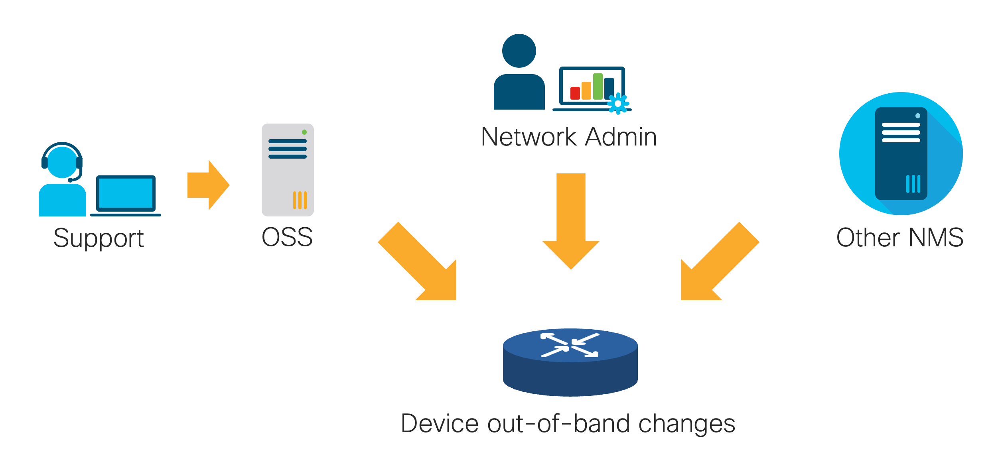
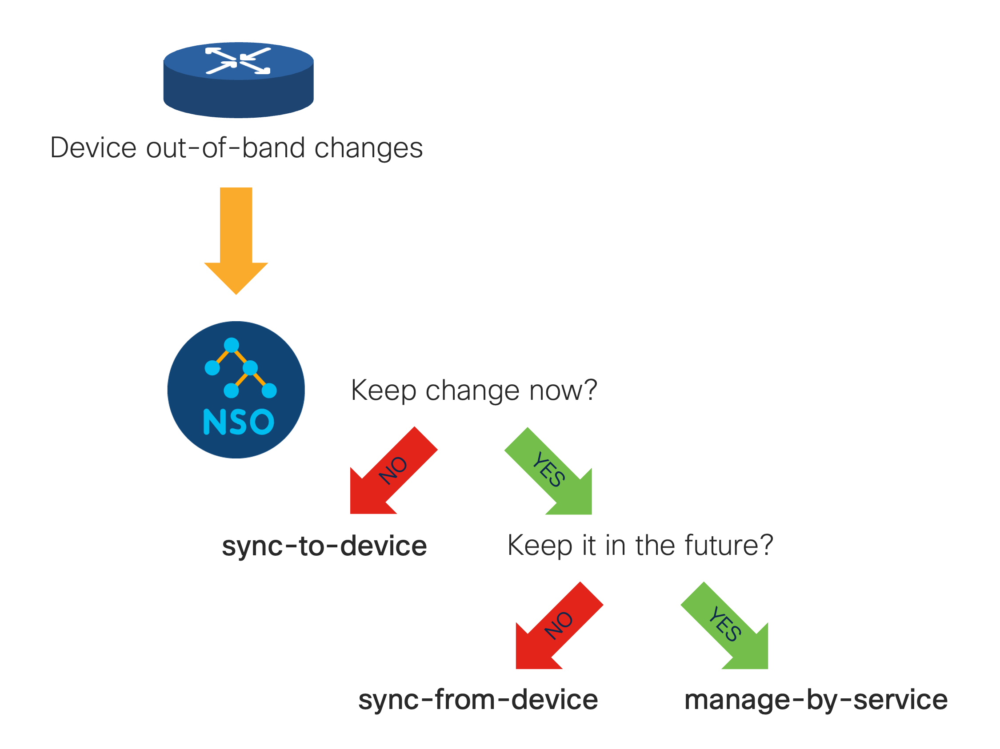

# Out-of-band Interoperation

The preferred way of making changes in the network is to perform all changes through NSO, which keeps the NSO copy of device configurations up-to-date (in sync) at all times. This approach has many benefits, as it allows NSO to:

* Avoid making provisioning decisions based on stale data
* Provide a single pane of glass to network configuration
* Act as a network source of truth
* Better aid in troubleshooting scenarios
* Provide improved performance, and
* Expose advanced compliance and reporting capabilities

However, in some situations, such setup is undesirable or not possible due to historic, organizational, or other reasons. While an organization may decide to forgo most of these benefits by managing the network through multiple systems, it is essential for NSO provisioning code to work with current data.



To better allow coexistence with other systems and processes that manage the same devices, NSO 6.5 introduces an innovative, patent-pending approach to the so-called "out-of-band" changes. Out-of-band changes are changes to NSO-managed devices not done through NSO. From a high-level perspective, this approach consists of:

* "Ships passing in the night" handling of configuration not relevant to NSO-managed parts
* Verification of data used in provisioning decisions prior to being pushed out to the network, and
* Policy-based retention of changes by other systems and agents on NSO-managed configuration

It now becomes possible to manage a network device by never doing a sync-from/sync-to operation (in practice the first sync-from may still be desirable to allow reading from NSO). At the same time, special-purpose pre-provisioning checks become unnecessary for the majority of cases, as NSO verifies the correctness of data used in the transaction.


Such an approach allows NSO to use targeted correctness checks that have another benefit when used with devices which have huge configurations, such as various controllers. If only small parts of the configuration are relevant to NSO, the checks can be optimized. Limiting the checks to only the required parts allows the system to scale with the extent of the change, not the size or time-complexity of producing the full device configurations.

## Introducing `confirm-network-state`

Handling out-of-band changes requires NSO to make additional checks and perform additional processing when provisioning network changes, so this functionality is opt-in. The first option to invoke the out-of-band processing machinery is to use the `commit confirm-network-state` commit variant, which takes effect for the current commit only.

This option is great for testing out different scenarios and getting familiar with the out-of-band features of NSO. In addition to `commit`, there are other commands that can also be `confirm-network-state` enabled, such as device`sync-from` and service `re-deploy`.

However, the recommended way for normal, day-to-day use is to enable`confirm-network-state` for a set of devices through device settings. For example:

```bash
admin@ncs(config)# devices device c1 confirm-network-state enabled-by-default true
```

Or:

```bash
admin@ncs(config)# devices profiles profile prod confirm-network-state enabled-by-default true
```

Or:

```bash
admin@ncs(config)# devices global-settings confirm-network-state enabled-by-default true
```

Commit and other operations then no longer require using the`confirm-network-state` option explicitly; it is enabled automatically for those devices.

Once NSO uses `confirm-network-state` for a device change, it no longer checks device sync status, so the commit may go through even if parts of device configuration are out-of-sync. But NSO keeps track of all reads in a given transaction and then verifies that these values (which were presumably used to influence the provisioning decisions) remain the same on the device. Behind the scenes, this mechanism uses the same transaction read-set that is also used for [concurrency checks](../../development/core-concepts/nso-concurrency-model.md).

For example, let's say you want to set interface MTU to at least 1520 with a Python script:

```python
import ncs
with ncs.maapi.single_write_trans('admin', 'python') as t:
    root = ncs.maagic.get_root(t)
    intf = root.devices.device['c1'].config.interface.GigabitEthernet['0/1']
    if intf.mtu is None or intf.mtu < 1520:
        intf.mtu = 1520
    params = t.get_params()
    params.confirm_network_state()
    t.apply_params(True, params)
```

Using the `confirm-network-state`-enabled commit ensures that the script does not overwrite values previously set out of band:

```bash
$ python3 update-mtu.py || echo 'inconsistency detected!'
...
inconsistency detected!
$ ncs_cli -Cu admin
admin@ncs# devices device c1 compare-config
diff
 devices {
     device c1 {
         config {
             interface {
                 GigabitEthernet 0/1 {
+                    mtu 9000;
                 }
             }
         }
     }
 }
```

Note that the failure of the script in this scenario is expected; the script should retry the operation once the out-of-band changes are inspected and either accepted with a (partial) sync-from, or rejected with a sync-to. If, instead, this was service code, NSO would retry the operation automatically with the updated data.

If the commit is successful, it includes the out-of-band changes that NSO found. For example, setting a value may trigger validating a YANG `must` expression, requiring NSO to read additional configuration from the device for the purpose of verification. If this configuration has changed out of band, NSO will validate the commit with the new data (the `must` expression must be satisfied) and include the change with the commit.

Including the out-of-band changes with the commit allows you to revert the whole operation, if necessary, and ensures CDB consistency. After commit, the CDB contains the updated configuration for the parts that affected provisioning, while safely ignoring other out-of-band changes.

It also enables you to preview the out-band-changes you are bringing in as part of the `commit dry-run`, illustrated in the following output.

```bash
admin@ncs(config)# no devices device c1 config interface GigabitEthernet 0/1\
 ip dhcp snooping trust
admin@ncs(config)# commit dry-run outformat cli-c confirm-network-state
...
        confirm-network-state {
            device {
                name c1
                out-of-band devices device c1
                             config
                              interface GigabitEthernet0/1
                               mtu 9000
                              exit
                             !
                            !
                data devices device c1
                      config
                       interface GigabitEthernet0/1
                        no ip dhcp snooping trust
                       exit
                      !
                     !
            }
        }
```

The not-overwriting functionality is shared with `commit no-overwrite` and ensures provisioning code in NSO works with up-to-date data. The difference between the two is that `confirm-network-state` also updates the CDB while evaluating service out-of-band policies for the relevant services.

## Service Out-of-band Policies

The `confirm-network-state` mode of operation shows its true power when used in combination with services. Services in NSO, through service mapping code and templates, manage the required network configuration. NSO knows what device configuration belongs to which service through the [backpointer references](../../development/advanced-development/developing-services/services-deep-dive.md) and can therefore detect when out-of-band changes are made to a configuration that belongs to a service.

When NSO detects such a change, the question becomes what to do with it. The answer depends on the service and on the kind of change; some changes need to be accepted and others rejected. The service out-of-band policy specifies how the change is to be handled for a specific case.

The service policy is defined per service type (servicepoint) and contains a set of rules. For example:

```
services out-of-band policy iface-servicepoint
 rule allow-mtu
  path         ios:interface/GigabitEthernet/mtu
  at-create    sync-from-device
  at-delete    sync-from-device
  at-value-set sync-from-device
 !
 rule reject-ip-address
  path         ios:interface/GigabitEthernet/ip/address
  at-create    sync-to-device
  at-delete    sync-to-device
  at-value-set sync-to-device
 !
!
```

Each rule defines an action NSO should take when encountering an out-of-band change at the given device path. The paths in the preceding printout are relative to `/devices/device/config` and tell NSO:

* We allow other systems or operators to change MTU for interfaces managed by the `iface` service; by specifying `sync-from-device`, NSO copies the new device value to CDB. This is a good choice for values that are mostly unrelated to the service and unlikely to break it.
* We reject changes to the IP address on the interface with `sync-to-device`, making NSO revert the change from the other system back to what is in the CDB (usually generated by the service mapping). This is a good choice for values that are vital for the correct operation of the service.

The example also shows how to differentiate between the type of change (operation); is the changed configuration node newly introduced (`at-create`), removed (`at-delete`), or has it gotten a new value (`at-value-set`)? The`at-create` operation makes little sense for configuration that is provisioned by the service (the configuration obviously already exists) but is useful when additional configuration parameters are introduced under service-created ones. Additionally, `at-create` might be used when a service deletes device configuration which is then introduced back out of band.

Using the type of change allows you to express more complicated policies. For example, suppose the `iface` service really requires just some IP address on the interface, not necessarily the one it initially provisioned. As it does not matter what particular IP address is used, it can be changed out of band, as long as there is one. You can describe this with a rule, such as:

```
 rule reject-no-ip-address
  path         ios:interface/GigabitEthernet/ip/address
  at-delete    sync-to-device
  at-value-set sync-from-device
 !
```



This, however, brings up another question: what should happen if you redeploy the service? Should NSO use the service-provided IP or should the out-of-band configured value be used instead? With the `sync-from-device` policy action, NSO overwrites the out-of-band value with the service-provided one. Instead, if the service should keep the out-of-band value, use the `manage-by-service` policy action, for example:

```
 rule reject-no-ip-address
  path         ios:interface/GigabitEthernet/ip/address
  at-delete    sync-to-device
  at-value-set manage-by-service
 !
```

Specifying `manage-by-service` not only updates device configuration in the CDB with the out-of-band value, it also adds the value under service instance's out-of-band changes (also called extra operations). NSO takes these changes into account when calculating service configuration after mapping code runs. It allows the service to preserve an out-of-band value during a redeploy. Additionally, it ties the value to the lifecycle of the service; if the service is deleted, so is the out-of-band configuration.

### Rule Behavior Example

Consider a setup from `$NCS_DIR/examples.ncs/service-management/confirm-network-state`, started by `make demo`, with the following out-of-band policy:

```
services out-of-band policy iface-servicepoint
 rule allow-mtu
  path         ios:interface/GigabitEthernet/mtu
  at-create    sync-from-device
  at-delete    sync-from-device
  at-value-set sync-from-device
 !
 rule reject-no-ip-address
  path         ios:interface/GigabitEthernet/ip/address
  at-delete    sync-to-device
  at-value-set manage-by-service
 !
!
```

Initially, the service provides some device configuration:

```bash
admin@ncs# iface instance1 get-modifications outformat cli-c
cli-c {
    local-node {
        data devices device c1
               config
                interface GigabitEthernet0/1
                 ip address 10.1.2.3 255.255.255.240
                exit
               !
              !
    }
}
```

At some later point in time, perhaps after a support call from a customer, a technician changes a number of things either directly on the device, or through some other system:

```bash
admin@ncs# devices device c1 compare-config
diff
 devices {
     device c1 {
         config {
             interface {
                 GigabitEthernet 0/1 {
                     ip {
                         address {
                             primary {
-                                address 10.1.2.3;
-                                mask 255.255.255.240;
                             }
                         }
                     }
+                    mtu 1520;
                 }
                 GigabitEthernet 0/2 {
                     ip {
                         address {
                             primary {
-                                address 10.2.2.3;
+                                address 10.2.2.8;
                             }
                         }
                     }
                 }
             }
         }
     }
 }
```

If you now perform sync-from, the out-of-band policy will get processed and do the following:

* Re-provision the GigabitEthernet0/1 IP address due to rule #2 `at-delete: sync-to-device`.
* Keep the MTU at 1520 due to rule #1 `at-create: sync-from-device`.
* Keep the GigabitEthernet0/2 IP address due to rule #2 `at-value-set: manage-by-service`.
* Tie the GigabitEthernet0/2 IP to the service lifecycle.

To see the last part take effect, you can inspect the service modifications:

```bash
admin@ncs# iface instance2 get-modifications forward { only-out-of-band }
cli {
    local-node {
        data  devices {
                   device c1 {
                       config {
                           interface {
              +                GigabitEthernet 0/2 {
              +                    ip {
              +                        address {
              +                            primary {
              +                                address 10.2.2.8;
              +                            }
              +                        }
              +                    }
              +                }
                           }
                       }
                   }
               }
    }
}
```

The difference between `sync-to-device` and `manage-by-service` is also pronounced when you remove the service:

```bash
admin@ncs(config)# no iface
admin@ncs(config)# commit and-quit
admin@ncs# show running-config devices device c1 config interface GigabitEthernet
devices device c1
 config
  interface GigabitEthernet0/1
   mtu 1520
  exit
 !
!
```

The MTU setting is left behind since it is not tied to the lifecycle of the service. But note that, if the service had initially created the container in which it is configured, it would get removed as well when the container would be removed.

On the other hand, the new IP address for instance2 GigabitEthernet0/2 is gone with the service, since it is tied to the service lifecycle according to the policy.

### Default Policy

The service out-of-band policy is part of the NSO dynamic configuration, allowing an operator to tailor it to their needs. However, a service designer may already foresee some common scenarios where out-of-band handling of data is beneficial and provide a default out-of-band policy for their service.

NSO populates the service point entry under `/services/out-of-band/policy` with the service package defined default policy unless an entry is already present. The operator is then free to change this policy as they see fit. (But note that policy changes take effect after the policy is committed, not during the same transaction.)

To revert back to the default service-provided policy, an operator must delete the whole service point entry from `/services/out-of-band/policy`. Note that this is different from deleting all the rules from policy for a service point, which actually represents an empty policy (effectively `sync-from-device`).

A service developer defines the default policy for their service type in YANG. It has almost the same structure as the policy configuration in NSO, but uses YANG statements and is defined on the top level of a YANG (sub)module. For example:

```yang
module iface-service {
  // ...

  ncs:out-of-band iface-servicepoint {
    ncs:policy {
      ncs:rule "reject-no-ip-address" {
        ncs:path "ios:interface/GigabitEthernet/ip/address";
        ncs:at-delete sync-to-device;
        ncs:at-value-set manage-by-service;
      }
    }
  }
}
```

## Policy Rule Evaluation

NSO processes the out-of-band data with the service policy when:

* NSO performs a device operation that is `confirm-network-state`-enabled (either through the command itself or participating device setting), and
* NSO finds out-of-band data that is related to the service.

This is an optimization that allows NSO to no longer request or process parts of device configuration which are not related to the current operation. To ensure all current out-of-band data for a device is processed, you can invoke a`confirm-network-state`-enabled sync-from for this device, such as:

```bash
admin@ncs# devices device c1 sync-from confirm-network-state
```

When NSO encounters out-of-band data, it checks if this data resides in a part of configuration that is managed by one or more services. If that is the case, NSO uses backpointer references to identify individual service instances and the corresponding servicepoints. For each service, NSO searches the out-of-band policy rules for that servicepoint and handles the change according to specified action.

In particular, NSO compares rules and checks for the best match rule, where:

* Rule's `path` matches node or one of its parents; longer matches are checked first. For example, path `ios:interface/GigabitEthernet/ip` is tested before its parent `ios:interface/GigabitEthernet`.
* Rule must define an action for the type of change (operation) to match. For example, a rule without `at-delete` does not match an out-of-band delete.
* If multiple rules are found, NSO checks their priority value; numerically lower values are matched first.
* If `filter-expr` of a rule is set, it must evaluate true to match.

If no matching rule is found at all, `sync-from-device` is used as a fallback.

For example, consider the following rule set:

```
services out-of-band policy iface-servicepoint
 rule 1-no-delete-address
  path         ios:interface/GigabitEthernet/ip/address
  at-delete    sync-to-device
 !
 rule 2-specific-address
  path         ios:interface/GigabitEthernet/ip/address
  filter-expr  ". = '10.1.1.1'"
  at-create    sync-to-device
  at-delete    sync-to-device
  at-value-set sync-to-device
 !
 rule 3-ip-for-specific-interface
  path         ios:interface/GigabitEthernet[name='0/2']/ip
  priority     2
  at-create    sync-from-device
  at-delete    sync-from-device
  at-value-set sync-from-device
 !
 rule 4-ip
  path         ios:interface/GigabitEthernet/ip
  priority     1
  at-create    manage-by-service
  at-delete    manage-by-service
  at-value-set manage-by-service
 !
!
```

When a device's GigabitEthernet0/2 IP address is changed (value-set), say from 10.2.2.3 to 10.2.2.5, and NSO starts processing the rule set, it selects the`manage-by-service` action for this change because:

* Rule 1 has a matching path but no `at-value-set` action, so it does not match.
* Rule 2 also has a matching path but `filter-expr` does not match.
* Rule 3 matches a parent path with priority 2.
* Rule 4 matches the same parent path with priority 1 and is selected over priority 2 rule.

To get more detailed information about how the running system processes out-of-band changes, you can enable and set the level for`out-of-band-policy-log` in `ncs.conf`.

### Policy Rule Filter Expression

Note that `path` in the policy rule definition is a special variant of YANG`instance-identifier` that may be absolute or relative to`/devices/device/config`. As such, it is limited to selecting data nodes, and predicates can only be used for selecting keys.

On the other hand, `filter-expr` can specify a full XPath 1.0 expression that allows fine-grained selection of which rule applies where. It also supports`filter-expr`-specific extensions to the XPath language in the form of predefined variables and additional functions.

The expression is evaluated with the path of the out-of-band-changed node as the current XPath context and NSO data root as XPath root. Note that the expression operates on the values in the current transaction, that is, values that NSO sees. If you wish to access the changed values, that is "new" device values, you need to use a special XPath function `oob:context()`.

Say an IP address changes from 10.2.2.3 to 10.2.2.8 out-of-band on the device. Then:

<table><thead><tr><th valign="top">Expression</th><th valign="top">Result</th></tr></thead><tbody><tr><td valign="top"><code>.</code></td><td valign="top">10.2.2.3</td></tr><tr><td valign="top"><code>oob:context()</code></td><td valign="top">10.2.2.8</td></tr></tbody></table>

Also note that `.` refers to the currently-processing changed node, which may be a sub-node of the rule's `path` value, for example it could be`ip/address/primary/address` even though `path` points to `ip/address`.

Additional variables supported by the filter expression:

<table><thead><tr><th valign="top">Variable</th><th valign="top">Description</th></tr></thead><tbody><tr><td valign="top"><code>SERVICE</code></td><td valign="top">Path to the service instance the rule is evaluating for. Example use: <code>$SERVICE/name = 'instance1'</code>.</td></tr><tr><td valign="top"><code>RULE_PATH</code></td><td valign="top"><code>path</code> value of the rule that is evaluating.</td></tr></tbody></table>

Additional functions supported by the filter expression:

<table><thead><tr><th valign="top">Function</th><th valign="top">Description</th></tr></thead><tbody><tr><td valign="top"><code>oob:is-leaf([nodeset])</code></td><td valign="top">Check if specified nodes, or the current node when <em><code>nodeset</code></em> is not specified, are leaves. Returns boolean.</td></tr><tr><td valign="top"><code>oob:is-service-data([nodeset])</code></td><td valign="top">Check if specified nodes, or the current node when <em><code>nodeset</code></em> is not specified, are configured by service. Allows to easily differentiate nodes that are in addition to what service provisions. Returns boolean.</td></tr><tr><td valign="top"><code>oob:rule-paths()</code></td><td valign="top">Rule's path selector evaluated for the current change. Useful for lists, where the rule's path typically refers to all list items, but <code>oob:rule-paths()</code> selects the one with the change. Returns nodeset with one node.</td></tr><tr><td valign="top"><code>oob:context([nodeset])</code></td><td valign="top">Use the out-of-band version of data when evaluating the specified nodes or the current node when <em><code>nodeset</code></em> is not specified.</td></tr></tbody></table>

`oob:rule-paths()` perhaps requires an example to explain fully. A typical use case for this function is to more easily reference one specific parent of a changed node. Suppose a service configures BGP routing and you want to distinguish between BGP neighbors that are owned by the service versus those that are added out of band. The following rule would match all kinds of out-of-band changes but only for service-provisioned BGP neighbors:

```
 rule service-owned-neighbors
  path         ios:router/bgp/neighbor
  filter-expr  "oob:is-service-data(oob:rule-paths())"
  at-create    manage-by-service
  at-delete    manage-by-service
  at-value-set manage-by-service
 !
```

For a change of `.../bgp[as-no='65000']/neighbor[id='192.168.1.1']/remote-as`, the `oob:rule-paths()` would produce a node`.../bgp[as-no='65000']/neighbor[id='192.168.1.1']`. The filter expression is similar to `oob:is-service-data(current()/..)` but also works for nested nodes under the BGP neighbor, not just direct children.

## Service-managed Out-of-band Data

Using `manage-by-service` in an out-of-band policy ties an out-of-band change to a service instance and instructs NSO FASTMAP algorithm to take the change into account. FASTMAP treats the out-of-band changes as additional configuration, applied on top of service mapping logic.

For example, when a service-defined value is changed out-of-band and the policy specifies `manage-by-service`, the change is preserved across service redeploys. To differentiate between data from service mapping and out-of-band data, additional parameters can be used with service `get-modifications forward` action:

* `only-out-of-band`: display service-managed out-of-band configuration only.
* `only-service`: display configuration produced by service mapping only.
* `with-out-of-band`: display complete configuration, combined with out-of-band part.

For a service, where DHCP snooping rate-limit was configured out of band, the combined configuration might be:

```bash
admin@ncs# iface instance1 get-modifications forward { with-out-of-band } outformat cli-c
cli-c {
    local-node {
        data devices device c1
               config
                interface GigabitEthernet0/1
                 ip address 10.1.2.3 255.255.255.240
                 ip dhcp snooping limit rate 10
                 ip dhcp snooping trust
                exit
               !
              !
    }
}
```

The same is reflected in the service-meta-data of device configuration, which also shows origin of each part (note the `Out-of-band:` reference):

```bash
admin@ncs# show running-config devices device c1 config interface GigabitEthernet 0/1\
 | display service-meta-data
devices device c1
 config
  ! Refcount: 2
  ! Backpointer: [ /iface:iface[iface:name='instance1'] ]
  interface GigabitEthernet0/1
   ! Refcount: 1
   ip address 10.1.2.3 255.255.255.240
   ! Refcount: 1
   ! Out-of-band: [ /iface:iface[iface:name='instance1'] ]
   ip dhcp snooping limit rate 10
   ! Refcount: 1
   ! Backpointer: [ /iface:iface[iface:name='instance1'] ]
   ip dhcp snooping trust
   mtu 1520
  exit
 !
!
```

The lifecycle of the out-of-band parts is tied to the service lifecycle and the change is deleted when the service instance is deleted. But it is not truly managed in the sense of how mapping-generated configuration is managed.

For example, observe what happens when service interface parameter changes:

```bash
admin@ncs(config)# iface instance1 interface 0/4
admin@ncs(config-iface-instance1)# commit dry-run outformat cli-c
cli-c {
    local-node {
        data iface instance1
              interface 0/4
             !
             devices device c1
              config
               interface GigabitEthernet0/4
                ip address 10.1.2.3 255.255.255.240
                ip dhcp snooping trust
               exit
               interface GigabitEthernet0/1
                no ip address 10.1.2.3 255.255.255.240
                no ip dhcp snooping trust
               exit
              !
             !
    }
}
```

The configuration produced by service mapping uses the new interface, however, the out-of-band configuration is not migrated along with it:

```bash
admin@ncs(config-iface-instance1)# commit and-quit
Commit complete.
admin@ncs# iface instance1 get-modifications forward { with-out-of-band } outformat cli-c
cli-c {
    local-node {
        data devices device c1
               config
                interface GigabitEthernet0/1
                 ip dhcp snooping limit rate 10
                exit
                interface GigabitEthernet0/4
                 ip address 10.1.2.3 255.255.255.240
                 ip dhcp snooping trust
                exit
               !
              !
    }
}
```

In general, NSO cannot migrate the out-of-band changes on its own, since they may be inapplicable or even break the new service configuration. But in this specific case, the rest of the service configuration is removed from the interface, and DHCP snooping part would not be picked up by the service out-of band policy (if the change was done after the service update). While you can manually remove the residual GigabitEthernet0/1 configuration, a service re-deploy would reprovision it (unless you also [detach](out-of-band-interoperation.md#attach-and-detach-out-of-band-data) out-of-band data). A simpler approach is to reevaluate out-of-band policy.

### Reevaluating Policy

To avoid leftover configuration, or catch up with an updated out-of-band policy, you can instruct NSO to recompute service out-of-band changes according to the policy.

NSO will reapply the relevant policies if you use the`commit confirm-network-state re-evaluate-policies` commit variant when updating the service instance. Continuing the previous example:

```bash
admin@ncs(config)# show configuration
iface instance1
 interface    0/4
!
admin@ncs(config-iface-instance1)# commit and-quit confirm-network-state re-evaluate-policies
admin@ncs# iface instance1 get-modifications forward { with-out-of-band } outformat cli-c
cli-c {
    local-node {
        data devices device c1
               config
                interface GigabitEthernet0/4
                 ip address 10.1.2.3 255.255.255.240
                 ip dhcp snooping trust
                exit
               !
              !
    }
}
```

Since the out-of-band policy was reapplied, and the old interface is no longer part of the configuration that is provisioned by the service, its out-of-band configuration is gone.

If you have already committed the updated service instance without`confirm-network-state re evaluate-policies`, or have just updated the out-of-band policy, you can perform the same through a service redeploy:

```bash
admin@ncs# iface instance1 re-deploy confirm-network-state { re-evaluate-policies }\
 dry-run { outformat cli-c }
cli-c {
    local-node {
        data devices device c1
               config
                interface GigabitEthernet0/1
                 no ip dhcp snooping limit rate 10
                exit
               !
              !
    }
}
admin@ncs# iface instance1 re-deploy confirm-network-state { re-evaluate-policies }
```

Another potential effect using `re-evaluate-policies` has, is bringing in existing configuration. Suppose the above service instance, instead of GigabitEthernet0/4, uses GigabitEthernet0/3 interface, which already has some pre-existing configuration (configuration before being provisioned for this service).

```bash
admin@ncs(config)# show full-configuration devices device c1 config\
 interface GigabitEthernet 0/3
devices device c1
 config
  interface GigabitEthernet0/3
   ip address 10.2.2.10 255.255.255.240
  exit
 !
!
admin@ncs(config)# ! Change the interface:
admin@ncs(config)# iface instance1 interface 0/3
admin@ncs(config-iface-instance1)# commit confirm-network-state re-evaluate-policies and-quit
Commit complete.
admin@ncs# iface instance1 get-modifications forward { only-out-of-band } outformat cli-c
cli-c {
    local-node {
        data devices device c1
               config
                interface GigabitEthernet0/3
                 ip address 10.2.2.10 255.255.255.240
                exit
               !
              !
    }
}
```

Observe that the IP address is not the one configured by the service mapping (10.1.2.3); the existing value is instead being treated as a service-managed out-of-band change (as defined by the policy).

Therefore, if you wish to retain out-of-band parts that are no longer under service-managed configuration, you need to migrate them manually first. But consider that updating the service to support this kind of configuration natively is a much better choice that will save you a lot of time and trouble in the future.

### Attach and Detach Out-of-band Data

An alternative to `confirm-network-state re-evaluate-policies` for updating service out-of-band data are two service `re-deploy reconcile` actions:`attach-non-service-config` and `detach-non-service-config`.

Detach makes all current service-managed out-of-band data unmanaged. That is, it keeps the out-of band data but removes the references to the service from it. The out-of-band data behaves like it had a policy `sync-from-device` instead of`manage-by-service`.

You can use detach, for example, before removing a service in order to keep out-of-band changes.

On the other hand, attach performs similarly as confirm-network-state-enabled commit would for detected out-of-band data. It looks at all the service-owned configuration and finds parts that would stay if the service was removed (they have non-service refcounts). Then it makes these parts service managed out-of-band data.

You should use attach, instead of a regular `re-deploy reconcile`, when [importing existing services to NSO](../../development/advanced-development/developing-services/services-deep-dive.md). Using attach ensures the service also picks up out-of-band data according to policy.

Likewise, you can use attach to reattach configuration that you have previously, perhaps mistakenly, detached.

In addition, reconcile also supports `discard-non-service-config`, which allows you to discard all non-service-managed out-of-band changes.

To drop all out-of-band changes, not just unmanaged ones, and return the service to its pristine state, with only service-mapping-generated configuration, first detach out-of-band data, followed by a discard. For example:

```bash
admin@ncs# show running-config devices device c1 config interface GigabitEthernet 0/1\
 | display service-meta-data
devices device c1
 config
  ! Refcount: 2
  ! Backpointer: [ /iface:iface[iface:name='instance1'] ]
  interface GigabitEthernet0/1
   ! Refcount: 1
   ip address 10.1.2.3 255.255.255.240
   ! Refcount: 1
   ! Out-of-band: [ /iface:iface[iface:name='instance1'] ]
   ip dhcp snooping limit rate 10
   ! Refcount: 1
   ! Backpointer: [ /iface:iface[iface:name='instance1'] ]
   ip dhcp snooping trust
   mtu 1520
  exit
 !
!
admin@ncs# iface instance1 re-deploy reconcile { detach-non-service-config }
admin@ncs# iface instance1 re-deploy reconcile { discard-non-service-config }\
 dry-run { outformat cli-c }
cli-c {
    local-node {
        data devices device c1
               config
                interface GigabitEthernet0/1
                 no ip dhcp snooping limit rate 10
                 no mtu 1520
                exit
               !
              !

    }
}
```

In the example, both managed (`ip dhcp snooping limit rate 10`) and unmanaged (`mtu 1520`) out of-band changes are going to be dropped.

## Configuration and Command Reference

To globally [enable out-of-band data processing](out-of-band-interoperation.md#introducing-confirm-network-state) described in this section, configure:

```bash
admin@ncs(config)# devices global-settings confirm-network-state enabled-by-default true
```

To enable it for a set of devices, use device profiles:

```bash
admin@ncs(config)# devices profiles profile <PROFILE> confirm-network-state\
 enabled-by-default true
```

To enable it per individual device, configure:

```bash
admin@ncs(config)# devices device <DEVICE> confirm-network-state enabled-by-default true
```

Inspect out-of-band changes on a device without updating the CDB configuration:

```bash
admin@ncs# devices device <DEVICE> compare-config
```

CDB is updated automatically with referenced out-of-band data during a confirm-network-state-enabled commit. To manually update the CDB and process all out-of-band changes for a device, use device `sync-from`.

```bash
admin@ncs# devices device <DEVICE> sync-from
```

Inspect [out-of-band policy](out-of-band-interoperation.md#service-out-of-band-policies) for a service:

```bash
admin@ncs# show running-config services out-of-band policy <SERVICEPOINT>
```

Inspect [service-managed out-of-band changes](out-of-band-interoperation.md#service-managed-out-of-band-data) for a service:

```bash
admin@ncs# <SERVICE INSTANCE> get-modifications forward { only-out-of-band }
```

[Reevaluate out-of-band policy](out-of-band-interoperation.md#reevaluating-policy) (when updating service instance):

```bash
admin@ncs(config)# commit confirm-network-state re-evaluate-policies
```

Reevaluate out-of-band policy during service redeploy:

```bash
admin@ncs# <SERVICE INSTANCE> re-deploy confirm-network-state { re-evaluate-policies }
```

[Attach, detach, and discard](out-of-band-interoperation.md#attach-and-detach-out-of-band-data) out-of-band changes for a service:

```bash
admin@ncs# <SERVICE INSTANCE> re-deploy reconcile { attach-non-service-config }
admin@ncs# <SERVICE INSTANCE> re-deploy reconcile { detach-non-service-config }
admin@ncs# <SERVICE INSTANCE> re-deploy reconcile { discard-non-service-config }
```
