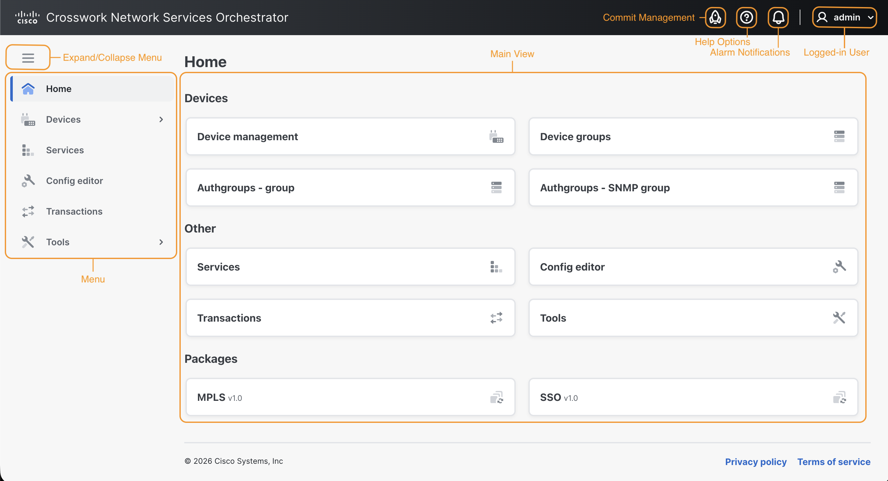

# Web UI

The NSO Web UI provides an intuitive northbound interface to your NSO deployment. The UI consists of individual views, each with a different purpose to perform operations such as device management, service management, commit handling, etc.

The main components of the Web UI are shown in the figure below.

<figure><figcaption>
NSO Web UI Overview
</figcaption></figure>

The UI works by auto-rendering the underlying device and service models. This gives the benefit that the Web UI is immediately updated when new devices or services are added to the system. For example, say you have added support for a new device vendor. Then, without any programming requirements, the NSO Web UI provides the capability to configure those devices.


It's important to understand that the bulk of concepts and configuration options in Web UI are shared with the NSO CLI. The rest of the documentation covers these in detail. You need to be familiar with the fundamental concepts to work with the Web UI.


## Browser Requirements 

All modern web browsers are supported, and no plug-ins are needed. The interface itself is a JavaScript client.

## Accessing the Web UI 

By default, the Web UI is accessible on port 8080 of the NSO server for an NSO Local Install and port 8888 for a System Install. The port can be changed in the `ncs.conf` file. Users are required to authenticate before accessing the Web UI.

## Basic Operations 

### **Log In**

Log in to the NSO Web UI by using the username and password provided by your administrator. SSO SAML or OIDC login is available if set up by your administrator. If applicable, use the SSO option to log in.

### **Log Out**

Log out by clicking your username on the top-right corner and choosing **Logout**.

### Theme

Apply a theme for the user interface by clicking your username and selecting from **Light**, **Dark**, or **System** **default**.

### **Help Options**

Access the help options by clicking the help options icon in the UI banner. The following options are available:

* **Online documentation**: Access the Web UI's online help.
* **Manage hidden groups**: Administer hidden groups, e.g., for debugging. Read more about hide groups in [CLI Commands](../cli/cli-commands.md).
* **NSO version**: Information about the version of NSO you are running.

In the Web UI, supplementary help text, whenever applicable, is available on the configuration fields and can be accessed by clicking the info icons.

## Dirty State

Anytime a configuration is changed in the Web UI (such as a device or service configuration change), the UI reflects the change with a so-called color-coded "dirty state" with the following meanings:

* <mark style="color:blue;">Blue</mark> color: An addition or a modification to an already-committed list element was made.
* <mark style="color:red;">Red</mark> color: A deletion was made.

## Commit Management 

Commit options are accessible at all times from the UI header. A number, corresponding to the number of changes in a transaction, is displayed next to the  icon when changes are available for review. These changes can be reviewed in the **Transactions** view. For certain actions, it is possible to skip the commit review and apply the changes directly.


**Transactions and Commits**

Take special note of commit management. Whenever a transaction has started, the active configuration data changes can be inspected and evaluated before they are committed and pushed to the network. The data is saved to the NSO datastore and pushed to the network when a user presses **Commit**.

Any network-wide configuration change can be picked up as a rollback file. The rollback can then be applied to undo whatever happened to the network.


### **Review a Configuration Change**

To review available configuration changes:

1. Access commit management by clicking its icon  in the banner.
2. Review the available changes by clicking the **Changes** or **Transactions** option. This action redirects you to the **Transactions** view.
3. Press **Validate** to check for errors. All changes must be validated before they can be committed.
4. Click **Revert** to undo or **Commit** to confirm the changes in the transaction.
5. If you are committing a change, **Commit Settings** are shown after pressing **Commit**. Examples of commit settings include: **No revision drop**, **No deploy**, **No networking**, etc. Commit options are described in detail in the JSON-RPC API documentation under [Methods - transaction - commit changes](../../development/advanced-development/web-ui-development/json-rpc-api.md#methods-transaction-commit-changes).

## AI Assistant

The WebUI integrates an AI Assistant to enhance your interaction and experience of NSO. The availability of the AI Assistant is controlled by your administrator and indicated by the AI Assistant icon () displayed in the UI header.


**Administrative Info on Enabling the AI Assistant**

The AI Assistant is enabled by use of a package. After installing the AI Assistant package, configure which backend to use under `/ai-assistant:ai-assistant/config` and enable it by setting `/ai-assistant:ai-assistant/enabled` to `true`. In the Web UI, the setting is accessible from the Config Editor. Once enabled, the AI Assistant button is added to the Web UI header.

