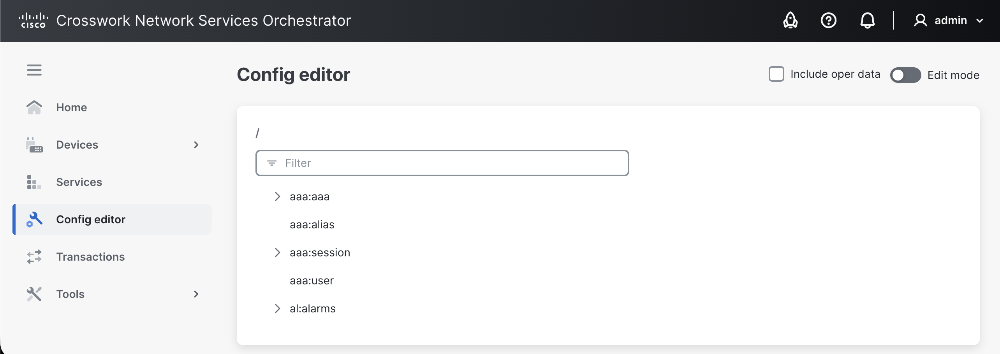

# Config Editor

The **Configuration editor** view is where you view and manage aspects of your NSO deployment using the underlying YANG model, for example, to configure devices, services, packages, etc.

<figure><figcaption>
Configuration Editor View
</figcaption></figure>

The Configuration Editor's home page shows all the currently loaded YANG modules in NSO, i.e., the database schema. In this view, you can also browse and manage the configuration defined by the YANG modules.

## Editing Configuration Data 

All NSO configuration is performed in this view. You can edit the configuration data defined by the YANG model directly in this view or, in some cases, get directed by the Web UI to this view.

## Configuration Navigator 

An important component of Configuration Editor is the Configuration Navigator, which you can use to traverse and edit the configuration defined by the YANG model in a hierarchical tree-like fashion. This provides an efficient way to browse and configure aspects of NSO. Let's say, for example, you want to access all the devices in your deployment and choose a specific one to view and configure. In the Configuration Editor, you can do this by typing in `ncs:devices` in the navigator, and then choosing further guided options (automatically suggested by the Web UI), e.g., `ncs:devices/device/ce0/config/...`.

<figure><figcaption>
Configuration Navigator
</figcaption></figure>

### **Using the Configuration Navigator**

As you navigate through the Web UI, the Configuration Navigator automatically displays and updates the path you are located at.

* To exit back to the home page from another path, click the home  button.
* Click the up arrow  to go back one step to the parent node.
* To fetch information about a property/component, click the info  button.
* Use the **TAB** key to complete the config path.

## Configuration Editor Tabs 

When accessing an item (e.g., a device, service, etc.) using the Configuration Editor, the following tabs are visible:

* **Edit Config** tab, to configure the item's configuration.
* **Config** tab, to view configured items.
* **Operdata** tab, to view the operational data relevant to the item (e.g., last sync time, last modified time, etc.).
* **Actions** tab, to apply an action to the item with specified options/parameters.

Depending on the selection of the tabs mentioned above, you may see four additional tabs in the **Configuration editor** view:

* **Widgets** tab, to view the data defined by YANG modules in different formats.
* **None** tab.
* **Containers** tab, to view container-specific information from the YANG model.
* **List** tab, to view list-specific information from the YANG model.
