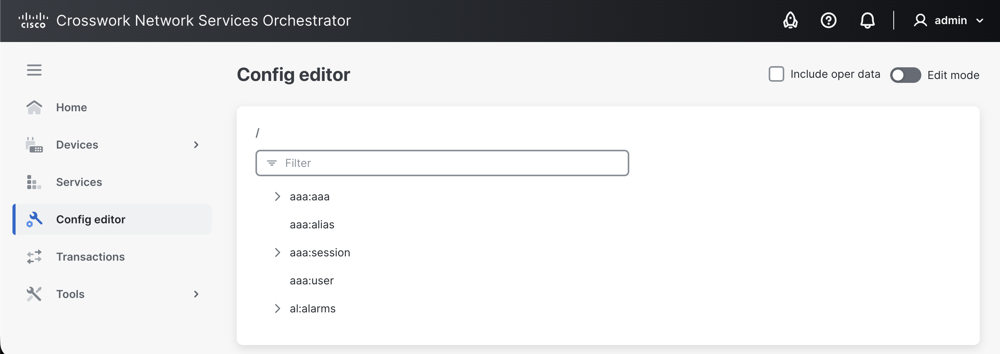
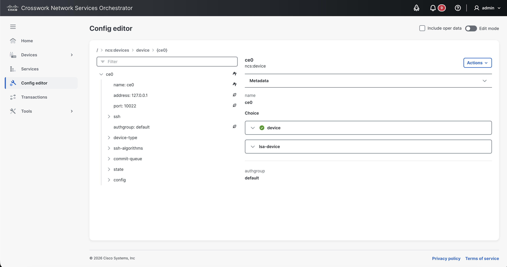

# Config Editor

The **Configuration editor** view is the main interface for browsing and managing NSO configuration using the underlying YANG model. It displays the loaded YANG modules and configuration data in a hierarchical tree and provides a form-based view of the selected node.&#x20;

In this view, you can browse configuration, inspect operational data, edit configurable nodes, invoke actions, and review metadata for the selected node. Depending on how you navigate in the Web UI, you may also be directed to the **Configuration editor** to continue viewing or editing a specific device, service, package, or other NSO object.

The **Configuration editor** consists of the following main parts:

* A navigation tree for browsing the YANG hierarchy.
* A form-based content area that renders the selected node.
* A metadata panel that shows details about the selected node.
* Context-sensitive actions for nodes that support actions or presence operations.

<figure><figcaption>
Configuration Editor Main View
</figcaption></figure>

## View Options

The following options are available in the **Configuration editor** view:

* **Include oper data**: Displays operational data together with the configuration tree. Use this option when you want to inspect runtime or status information in addition to configured data.
* **Edit mode**: Enables editing in the **Configuration editor**. When edit mode is enabled, configurable nodes can be modified directly in the rendered form or list view. When it is disabled, the view is read-only.

## Configuration Navigation

The Configuration Editor displays configuration defined by the YANG model in a hierarchical tree structure that you can browse and navigate. Expand nodes to reveal their child nodes, and use the filter field to narrow the visible nodes in the current tree.

Selecting a node in the tree updates the content area to show the selected node. The rendered view depends on the type of YANG node selected. The tree itself shows the hierarchy, while the content area shows the data and controls available for the selected node.

For example, to access a specific device, enter **devices** in the filter field, expand **ncs:devices**, select **device** to load the device list, and then select the **ce0** entry to view or configure it.

<figure><figcaption>
Configuration Navigation Example
</figcaption></figure>

### Breadcrumb

The breadcrumb above the tree shows the current navigation path, for example **/ > ncs:devices > device > {ce1}**. This helps identify the selected node and the current root of the rendered view as you move deeper into the YANG hierarchy.

### Tree Icons

The tree shows the following icons depending on the selection of view options:

| Icon                                                                                        | Meaning                                                  |
| ------------------------------------------------------------------------------------------- | -------------------------------------------------------- |
| Key icon              | A key leaf, meaning a value that identifies a list entry |
| Leaf icon            | A regular leaf node                                      |
| List icon            | A list and leaf-list node                                |
| Split/arrows icon  | A choice node                                            |
| Lightning icon   | An action node                                           |
| Database icon    | A node with operational data                             |

### Rendered Node View

When a node is selected, the content area on the right renders that node as a form or list-based view. Leaf values are shown directly as fields, while nested containers, lists, and leaf-lists must be selected from the tree to be rendered separately.

#### Input Fields and Behavior

Input fields in the rendered view depend on the YANG type of the selected node. For example, fields may be shown as text inputs, selection controls, or other widgets depending on the allowed values and schema definition.

Field descriptions and default values are shown in the rendered view where applicable. Additional node details, such as type and access information, are available in the **Metadata** panel.

Depending on the field type, changes are applied automatically when you update the value or when you leave the field. If a value is invalid or cannot be applied, the UI indicates the error on the relevant field so that you can correct it before committing the change.

#### Choice

YANG choices are rendered as grouped choice widgets in the content area. In the tree, a choice or case branch can be expanded for navigation, but selecting the parent context renders the choice as a whole widget, while selecting an individual child node renders only that specific node.

#### Metadata

The **Metadata** panel displays schema and node information for the currently selected tree node. Expand this panel to inspect additional details about the selected node.

Depending on the node, the metadata can include information such as node type, kind, access, description, default value, etc. The metadata panel is the primary way to inspect node details that are not shown directly in the rendered field view.

#### Actions

For selected container nodes that define actions, the **Actions** button is shown above the metadata panel and remains available even when **Edit mode** is disabled. In the tree, however, actions are shown only when **Edit mode** is enabled. If no actions are available for the selected container, the **Actions** button is hidden.

#### Presence Containers

If the selected node is a presence container, the rendered view provides controls to create or delete that container.
