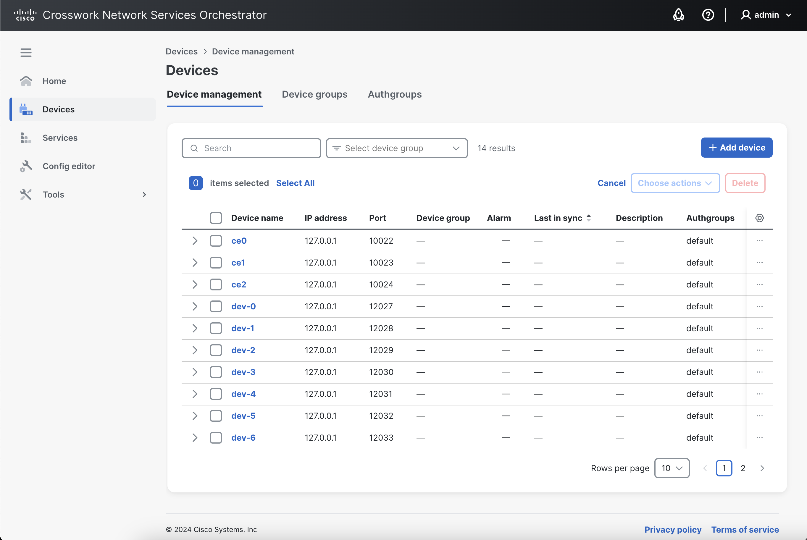
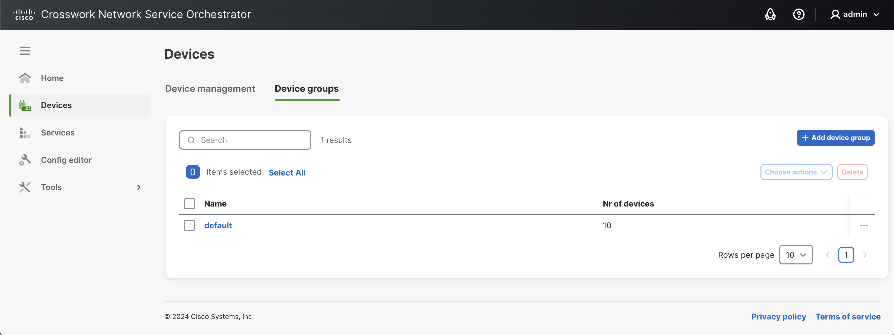
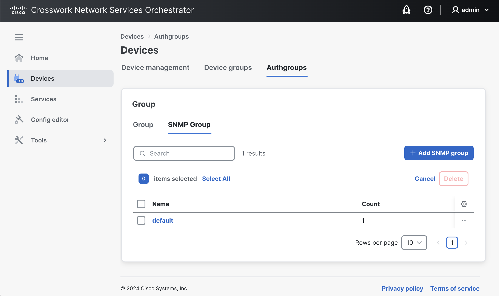

# Devices

The **Devices** view provides options to manage devices and device groups in the NSO network.

## Device Management 

The **Device management** view lists the devices in the network and provides options to manage them.

<figure><figcaption>
Device Management View
</figcaption></figure>

### **Search**

You can search for a device by its name, IP address, or other parameters. Narrow down the results by using the **Select device group** filter.

### **Add a Device**

To add a new device to NSO:

1. Click the **Add device** button.
2. In the **Add device** pop-up, specify the device name.
3. Click **Add**.
4. Configure the specifics of the device in the **Configuration editor**.
5. Review and commit the changes in the **Commit manager** when done.

### **Apply an Action on a Device**

Actions can be applied on a device from the **Device management** view or the **Configuration editor** -> **Actions** tab.



An action can be applied to a single or multiple devices at once.

1. Select the device(s) from the list using the checkbox.
2. Using the **Choose actions** button, select the desired action. The result of the action is returned immediately.


In the **Device management** view, you can also apply actions on a device using the more options  button.


**Actions Possible in the Device Management View**

Available actions include **Connect**, **Ping**, **Sync from**, **Sync to**, **Check sync**, **Compare config**, **Fetch ssh host keys**, **Apply template**, **Modify in Config editor**, and **Delete**.


The **Modify in Config Editor** and **Delete** actions are accessible by clicking the more options  button on the device row.


See [Lifecycle Operations](../operations/lifecycle-operations.md) for the details of these actions.



Additional actions are applied to an individual device. Use this option if you want to run an action with additional parameters.

1. Click the device name in the list.
2. Access the **Actions** tab in the **Configuration editor**.
3. Click the desired action in the list.
4.  At this point, you can configure different parameters.

    (To reset all the parameters to their default value, use the **Reset action parameters** option).
5. Run the action.


To fetch information about an action in the **Configuration editor** -> **Actions** tab, click the info  icon.


**Actions Possible in the Configuration Editor -> Actions Tab**

If you access the device in the **Configuration editor**, the following additional actions are available: **migrate**, **copy-capabilities**, **find-capabilities**, **add-capability**, **instantiate-from-other-device**, **check-yang-modules**, **disconnect**, **delete-config**, **scp-to scp-from**, **load-native-config**.

See [Lifecycle Operations](../operations/lifecycle-operations.md) for the details of these actions.



### **Edit Device Configuration**

To edit the device configuration of an existing device:

1. In the **Devices** view, click the desired device from the list.
2. In the **Configuration editor**, click the **Edit config** tab.
3.  Make the desired changes.

    (Press **Enter** to save the changes. An uncommitted change in a field's value is marked by a green color, and is referred to as a 'dirty state').
4. Review and commit the change in the **Commit manager**.


The other two tabs, i.e., **Config** and **Operdata** can be respectively used to:

* View the device configuration, and,
* View the device's operational data.


## Device Groups 

The **Device groups** view lists all the available groups and devices belonging to them. You can add new device groups in this view as well as carry out actions on devices belonging to a group.

<figure><figcaption>
Device Groups View
</figcaption></figure>

### **Create a Device Group**

Device groups allow for the grouping and collective management of devices.

1. Click **Add device group**.
2. In the **Create device group** pop-up, specify the group name.
   * If you want to place the new device group under a parent group, select the **Place under parent device group** option and specify the parent group.
3. Click **Create**. You will be redirected to the group's details page. Here, the following panes are available:
   * **Details**: Displays basic details of the group, i.e., its name and parent/subgroup information. To link a sub-group, use the **Connect sub device group** option.
   * **Devices in this group**: Displays currently added devices in the group and provides the option to remove them from the group.
   * **Add devices**: Displays all available NSO devices and provides the option to add them to the group.
4. In the **Add devices** pane, select the device(s) that you want to add to the new group and click **Add devices to group**. The added devices become visible under the **Devices in this group** pane.
5. Finally, click **Save**.

### **Remove Device(s) from a Device Group**

1. Click the desired device group to access the group's detail page.
2. In the **Devices in this group** pane, select the device(s) to be removed from the group.
3. Click **Remove from device group**. The devices are removed immediately (without a Commit Manager review).
4. Click **Save**.

### **Apply an Action on a Device Group**

Device group actions let you perform an action on all the devices belonging to a group.

1. Select the desired device group from the list. It is possible to select multiple groups at once.
2. Choose the desired action from the **Choose actions** button.


In the **Device groups** view, you can also apply actions on a device group using the more options  button.


**Actions Possible in the Device Groups View**

The available group actions are the same as in the section called [Apply an Action on a Device](devices.md#apply-an-action-on-a-device) (e.g., **Connect**, **Sync from**, **Sync to**, etc.) and are described in [Lifecycle Operations](../operations/lifecycle-operations.md).


The **Modify in Config editor** option is accessible by clicking the more options  button on a device group.


## Authgroups

The **Authgroups** view displays device authentication groups and provides ways to manage them. Concepts and settings involved in the authentication groups setup are discussed in [NSO Device Management](../operations/nso-device-manager.md#user\_guide.devicemanager.authgroups).

This view is further partitioned into the following two tabs for different device types:

* The **Group** tab
* The **SNMP Group** tab

### Groups

The **Group** tab is used to view, search, and manage device authentication groups for CLI and NETCONF-managed devices.

<figure><figcaption>
Authgroups View (Group)
</figcaption></figure>

#### Create an Authgroup

To create a new group:

1. Click the **Add authgroup** button.
2. Enter the **Authgroup name** and click **Continue**.
3.  In the group details page, add users to the newly created group:

    
    If a default map is desired for unknown/unmapped users, use the **Set default-map** option.
    

    1. Click the **Add user** button to bring up the **Add user** overlay window. Here, you have the option to add the user with the authentication type set to 'remote mapping' or 'callback':
       * Remote mapping: If remote mapping is desired, specify the **local-user** that is to be mapped to remote authentication credentials and configure the following settings:
         * **remote-user**: Choose between **same-user** or **remote-name** options.
         * **remote-auth**: Choose between **same-pass**, **remote-password**, or **public-key** options.
         * **remote-secondary-auth** (optional): Choose between **same-secondary-password** or **remote-secondary-password** options.
       * Callback: If a callback type authentication is desired to retrieve login credentials, specify the **local-user**, set the **Use callback** flag, and configure the following settings:
         * **callback-node**
         * **action-name**
    2. Click **Add**. This adds the newly created user to the group and displays it in the list.
4. Click **Create** **authgroup** to save and finish creating the group.

#### View/Edit Authgroup Details

To view/edit details of a group:

1. Click the group name to access the group details page.
2. Make the desired changes, such as adding/removing a user from the group, editing existing user settings, or configuring general group settings.
3. Click the **Save authgroup** button to save and apply the changes.

#### Delete an Authgroup

To delete a group:


Proceed with caution as the changes are applied immediately and the deleted groups cannot be recovered.


1. Select the desired group using the checkbox.
2. Click **Delete**.
3. Confirm the intent by pressing **Delete** in the pop-up.

### SNMP Groups

The **SNMP Group** tab is used to view, search, and manage device authentication groups for SNMP-managed devices.

<figure><figcaption>
Authgroups View (SNMP Group)
</figcaption></figure>

#### Create an SNMP Group

To add a new group:

1. Click the **Add SNMP group** button.
2. Enter the **SNMP group name** and click **Continue**.
3.  In the group details page, add users to the newly created group:

    
    If a default map is desired for unknown/unmapped users, use the **Set default-map** option.
    

    1. Click the **Add user** button to bring up the **Add user** overlay window.
    2. Specify the **local-user** and configure the following settings:
       * **community** (optional): Choose between **community-name** or **community-binary-name**.
       * **remote-user**: Choose between **same-user** or **remote-name** options.
       * **security-level**: Choose between **no-auth-no-priv**, **auth-no-priv**, or **auth-priv** options.
    3. Click **Add**. This adds the newly created user to the group and displays it in the list.
4. Click **Create** **SNMP** **group** to save and finish creating the group.

#### View/Edit SNMP Group Details

To view/edit details of a group:

1. Click the group name to access the group details page.
2. Make the desired changes, such as adding/removing a user from the group, editing existing user settings, or configuring general group settings.
3. Click the **Save SNMP group** button to save and apply the changes.

#### Delete an SNMP Group

To delete a group:


Proceed with caution as the changes are applied immediately and the deleted groups cannot be recovered.


1. Select the desired group using the checkbox.
2. Click **Delete**.
3. Confirm the intent by pressing **Delete** in the pop-up.
