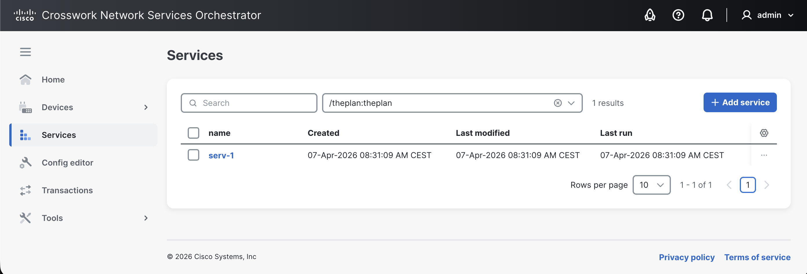

# Services

The **Services** view is used to view, create, and manage services in your NSO deployment. The default **Services** view displays the existing services.

<figure><figcaption>
Services View
</figcaption></figure>

## Search 

If you have multiple services configured, you can use the **Search** to filter down results to the service of your choice. The search filter matches the entered characters to the service name and shows the results accordingly. Results are shown only for the service point that you have selected.

To filter the service list:

1. In the **Select service type** drop-down, select the service point to populate all the services under it.
2. Enter a partial or full name of the service you are searching for.
3. Press **Enter**.

## Create a Service 

To create and deploy a service:

1. In the **Select service type** drop-down, select the service point.
2. Click the **Add service** button. You will be redirected to the **Configuration editor** view.
3. Click the  button.
4. In the pop-up, enter the name of the service that will identify it.
5. Click **Create**.
6. You can configure additional service data in the **Configuration editor**.
7. Review and commit the service to NSO in the **Transactions** view. Committing the service deploys it to NSO and displays it in the **Services** view.

## Edit Service Configuration 

Service configuration is viewed and carried out in the Configuration Editor. In the **Services** view, you can use the **Modify in Config Editor** option on the desired service to access its config in the Configuration Editor. You need to have **Edit mode** enabled to perform edits.


The **Configuration editor** view shows a host of options when configuring a service. You are expected to be well-versed with these options (and service concepts in general) before you delve into service configuration. Refer to the [Services](../../development/core-concepts/services.md) and [Developing Services](../../development/advanced-development/developing-services/) documentation for more information.


## Apply an Action on a Service 

You can apply actions on a service from the **Services** view or the **Configuration editor**.

Start by selecting the service point to populate all services under it and then follow the instructions below:



To apply an action on a service:

1. On the desired service in the list, click the more options  button.
2. Choose the preferred action from the list, i.e., **Re-deploy**, **Un-deploy**, **Check sync**, **Deep check sync**, or **get modifications**.


The **Check sync** action can be run on multiple services at once by selecting them using the checkbox and then running the action using the **Choose actions** button.


**Actions Possible in the Services View**

Available actions include **Re-deploy**, **Un-deploy**, **Check sync**, **Deep check sync**, and **get modifications**. See [Lifecycle Operations](../operations/lifecycle-operations.md) for the details of these actions.


The **Modify in Config Editor** and **Delete** are GUI-specific operations accessible on the service row.




Additional actions are applied to an individual service. Use this option if you want to run an action with additional parameters.

1. Access the service in the Configuration Editor by selecting the **Modify in Config Editor** option on a service.
2. Click the **Actions** button and select the desired action in the list.
3. Configure parameters to run.
4. Click **Run** to initiate the action.&#x20;

**Actions Possible in the Configuration Editor -> Actions Tab**

Access the service in the **Configuration editor** to run the following actions: **check-sync**, **reactive-re-deploy**, **un-deploy**, **deep-check-sync**, **touch**, **set-rank**, **re-deploy**, **get-modifications**, and **purge.** See [Lifecycle Operations](../operations/lifecycle-operations.md) for the details of these actions.



## View Service Details

To view details of a service:

1. In the **Select service type** drop-down, select the service point.
2. Click the desired service. This opens up the service details view.
3. Browse service details using the following tabs:
   * **Details**
   * **Plan** (hidden if no plan configured)
   * **Log**

## Delete a Service 

To delete a service instance:

1. In the **Select service type** drop-down list, select the service point.
2. Select, using the checkbox, the service to be deleted. You can select multiple services at once.
3. Click **Delete**.
4. Confirm the intent in the pop-up.
5. Review and commit the change in the **Transactions** view.


To skip the commit management (Transactions) review, use the **Commit changes directly** option in the **Delete service instance** pop-up.

