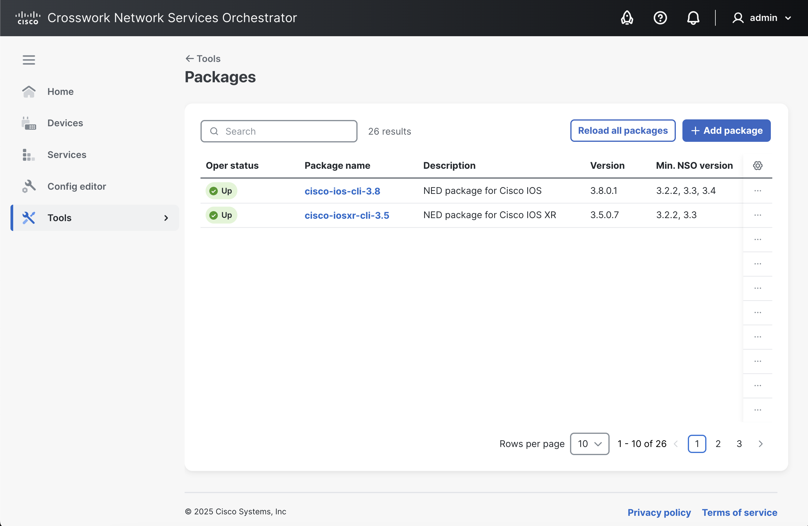
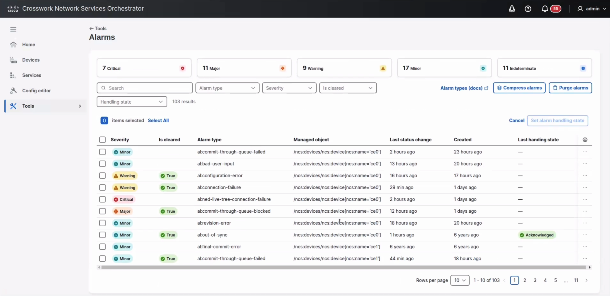
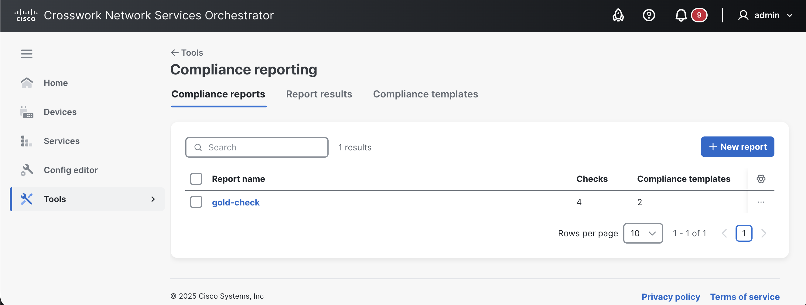
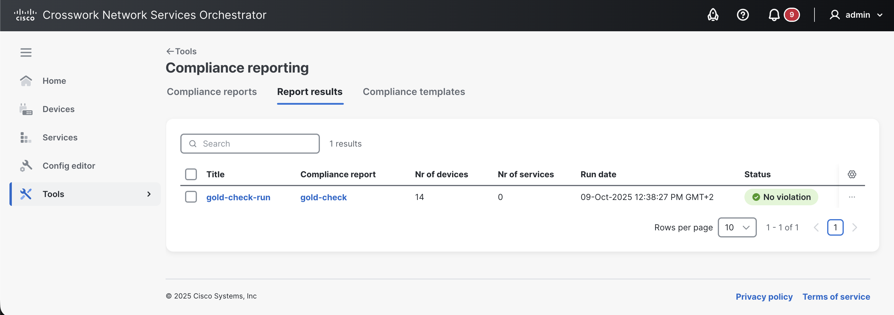

# Tools

The **Tools** view includes utilities that you can use to run specific tasks on your deployment, such as running compliance reports, etc.

<figure><figcaption>
Tools View
</figcaption></figure>

The following tools are available:

* [**Insights**](tools.md#d5e6470): Gathers and displays useful statistics of your deployment.
* [**Packages**](tools.md#d5e6487): Used to perform upgrades to the packages running in NSO.
* [**High availability**](tools.md#d5e6538): Used to manage a High Availability (HA) setup in your deployment.
* [**Alarms**](tools.md#d5e6565): Shows current alarms/events in your deployment and provides options to manage them.
* [**Commit manager**](tools.md#d5e6582): Shortcut to the Commit Manager.
* [**Compliance reports**](tools.md#sec.webui_compliance): Used to run compliance checks on your NSO network.

## Insights 

The **Insights** view collects and displays the following types of operational information using the `/ncs:metrics` data model to present useful statistics:

* Real-time data about transactions, commit queues, and northbound sessions.
* Sessions created and closed towards northbound interfaces since the last restart (CLI, JSON-RPC, NETCONF, RESTCONF, SNMP).
* Transactions since the last restart (committed, aborted, and conflicting). You can select between the running and operational data stores.
* Devices and their sync statuses.
* CDB info about its size, compaction, etc.

## Packages 

In the **Packages** view, you can upload, install, and view the operational state of custom packages in NSO.

<figure><figcaption>
Packages View
</figcaption></figure>

### Add a Package

Adding a new package via the Web UI entails uploading the package and then installing it after upload. You can add multiple packages at once. A package can be in one of the following operational states: **Up**, **Reload required**, **Not installed**, and **Error**.

To add a new package:

1. Click the **Add package** button.
2. Browse the package using the **Add** button in the **Add package** dialog. The file format must be .tar, .tar.gz, or .tgz. You can add multiple packages at once.
3. Click **Upload**. A result is shown whether the operation was successful or not.
4. Once the upload has finished successfully, select the packages to install.
5. Click **Install**. A result is shown whether the operation was successful or not. The trace offer more details on the action.

### View Package Details

To view package details:

* Click the package name. This reveals information about the package, such as its status, version, location, etc.

### Reload Packages

The reload action is the equivalent of the `packages reload` command in CLI and is used to load new/updated packages. If NSO is used in an HA or Raft setup, the `packages ha sync` action is invoked instead of the usual `packages reload` action, i.e., the packages will be synced in the cluster. Read more about the reload action in [NSO Packages](../operations/listing-packages.md) and for HA in [High Availability](../../administration/management/high-availability.md#packages-upgrades-in-raft-cluster). General package concepts are covered in [Package Management](../../administration/management/package-mgmt.md).

To reload the packages:

1. Click the **Reload all packages** button.
2. In the dialog, set the **Max wait time (sec)** for the commit queue to empty before proceeding with the reload. The default is 10 seconds if you leave the field unset.
3. Set the **Timeout action** behavior to define what happens after the maximum wait time is over, i.e., kill the open transactions and continue, or cancel (fail) the package reload operation altogether. The default for this setting is **fail**.
4. Apply additional action parameters from the following (optional): **Force** (to force package reload overriding issues or warnings), **Dry run** (to simulate the package reload process without making any actual changes), and **Wait commit queue empty** (to wait until the commit queue is empty before proceeding).
5. Click **Reload**. A live trace of the reload operation is displayed while the packages are being reloaded.
6. Click **Done** when the operation has finished.

### Uninstall a Package

To uninstall a package:

* Click the **Uninstall** button in the package details view, or use the more options  button in the packages list.

## High Availability 

The **High Availability** view is used to visualize your HA setup (rule-based or Raft).

Actions can be performed on the cluster using the **Configuration editor** -> **Actions** tab. Possible actions are further described in the High Availability documentation under [Actions](../../administration/management/high-availability.md#d5e5031).

## Alarms 

The **Alarms** view displays alerts in the system for your NSO-managed objects and provides options to manage them.

<figure><figcaption>
Alarms View
</figcaption></figure>

An alarm is raised when an NSO object undergoes a state change that requires attention. The alarms, depending on their severity, are categorized as **Critical**, **Major**, **Minor**, **Warning**, and **Indeterminate**. Detailed alarm management concepts are covered in [Alarm Manager](../../operation-and-usage/operations/alarm-manager.md) and different alarm types are described in [Alarm Types](../../administration/management/system-management/alarms.md).

### Viewing Options

You can search and sort the alarm list to display alarm results according to your need.

* To search for an alarm against an object, search for the object name (e.g., device name).
* To sort the alarms list, use one of the specified criteria from **Alarm type** , **Severity**, **Is cleared**, or **Handling state**.

**Alarm Details**

Individual alarm details are accessible by clicking the severity level icon on an alarm. This brings up the alarm's details, its status (severity) changes, and historical handling information.

### Compress and Purge Alarms

The Web UI provides additional options to compress and purge alarms.

* The **Compress alarms** action streamlines the alarm entries by deleting their historical state changes that occured before the last one (i.e., the only the latest state change is kept), while keeping the alarm entries intact.
* The **Purge alarms** action completely removes the alarm entries according to the specified criteria.

To utilize these features, click the respective button and follow the on-screen instructions.

### Alarm Handling

Alarm handling refers to attending to an alarm. This usually entails reviewing the alarm and setting a state on it, for example, **Acknowledged**. Historical handling state changes are accessible in alarm details.

To set an alarm handling state:

1. In the **Alarms** main view, click the more options  button on the desired alarm and click **Set alarm handling state**.
2. Set the alarm state to one of the following: **None**, **Acknowledged**, **Investigation**, **Observation**, and **Closed**.
3. Enter a description (optional).
4. Click **Set state**. This sets the alarm handling state as well as records the state change under the **Alarm handling** tab in alarm details.

## Commit Manager 

The **Commit manager** displays notifications about commits pending to be approved. Any time a change (a transaction) is made in NSO, the Commit Manager displays a notification to review the change. You can then choose to confirm or revert the commit.


**Transactions and Commits**

Take special note of the Commit Manager. Whenever a transaction has started, the active configuration data changes can be inspected and evaluated before they are committed and pushed to the network. The data is saved to the NSO datastore and pushed to the network when a user presses **Commit**.

Any network-wide configuration change can be picked up as a rollback file. The rollback can then be applied to undo whatever happened to the network.


### **Review a Configuration Change**

To review a configuration change:

1. Access the Commit Manager by clicking its icon  in the banner.
2. Review the available changes appearing as **Current transaction**. If there are errors in the change, the Commit Manager alerts you and suggests possible corrections. You can then fix them and press **Re-validate** to clear the errors.
3. Click **Revert** to undo or **Commit** to confirm the changes in the transaction.
   * **Commit Options**: When committing a transaction, you have the possibility to choose **Commit options** and perform a commit with the specified commit option(s). Examples of commit options are: **No revision drop**, **No deploy**, **No networking**, etc. Commit options are described in detail in the JSON-RPC API documentation under [Methods - transaction - commit changes](../../development/advanced-development/web-ui-development/json-rpc-api.md#methods-transaction-commit-changes).


In the **Commit manager** view, you can fetch additional information about the leaf by enabling **more node options**  and clicking the info  button.


#### **Load/Save Configuration Data**

Start a transaction to load or save configuration data using the **Load/Save** option, which you can then review for commit. The following tabs are available:

* **Rollback**: To load data that reverts an earlier change.
* **Files**: To load data from a local file on your disk.
* **Paste**: To load data by pasting it in.
* **Save**: To save loaded data to a file on your local disk.

#### **Commit Manager Tabs**

In the **Commit manager** view, the following tabs are shown.

* **changes** tab: To list the changes and actions done in the system, e.g., deleting a device or changing its properties.
* **errors** tab: To list the errors encountered while making changes. You can review the errors, make changes, and revalidate the error using the **Re-validate** option.
* **warnings** tab: To list the warnings encountered while making changes.
* **config** tab: To list the configuration changes associated with the change.
* **native config** tab: To list the device configuration data in the native config.
* **commit queue** tab: To manage commit queues. See [Commit Queue](../operations/nso-device-manager.md#user_guide.devicemanager.commit-queue) for more information.

## Compliance Reporting 

The **Compliance reporting** view is used to create and run compliance reports to check the current situation, check historical events, or both. The conceptual aspects of the compliance reporting feature are discussed in greater depth in the [Compliance Reports](../operations/compliance-reporting.md) section.


Web UI is the recommended way of running the compliance reports.


The following tabs are available in this view:

* **Compliance reports**
* **Report results**

### Compliance Reports

The **Compliance reports** tab is used to view, create, run, and manage the existing compliance reports.

<figure><figcaption>
Compliance Reports View
</figcaption></figure>

#### **Create a Compliance Report**

To create a new compliance report:

1. In the **Compliance reporting** view -> **Compliance reports** tab, click **New report**.
2. In the **Create new report** pop-up, enter the report name and click **Create**.
3. Next, set up the compliance report using the following tabs. For a more detailed description of Compliance Reporting concepts and related configuration options, see [Compliance Reporting](../operations/compliance-reporting.md).
   * **General** tab: to configure the report name. Configuration options include:
     * **Report name**: Displays the report name and allows editing of the report name.
   * **Devices** tab: to configure device compliance checks. Configuration options include:
     * **Device choice**: Include **All devices** or only **Some devices** to include in compliance checks. If **Some devices** is selected, specify the devices using a device group, an XPath expression, or individual devices.
     * **Current out of sync**: Check the device's current status and report if the device is in sync or out of sync. Possible values are **true** (yes, request a check-sync) and **false** (no, do not request a check-sync).
     * **Historic changes**: Include or exclude previous changes to devices using the commit log. Possible values are **true** (yes, include) and **false** (no, exclude).
     * **Compliance templates**: If a compliance template should be used to check for compliance (see [Device Configuration Checks](../operations/compliance-reporting.md#device-configuration-checks)). You have the option to add a compliance template using the **Add template** option or convert an existing device template into a compliance template by using the **Create from device template** option (which can then be added using the **Add template** option). To enforce devices to comply exactly with the template's configuration, use **Strict** mode; see [Additional Configuration Checks](../operations/compliance-reporting.md#additional-configuration-checks) for more information.
   * **Services** tab: to configure service compliance checks. Configuration options include:
     * **Service choice**: Include **All services** or only **Some services**. If **Some services** is selected, specify the services using service type, an XPath expression, or individual service instances.
     * **Current out of sync**: Check the service's current status and report if the service is in sync or out of sync. Possible values are **true** (yes, request a check-sync) and **false** (no, do not request a check-sync).
     * **Historic changes**: Include or exclude previous changes to services using the commit log. Possible values are **true** (yes, include) and **false** (no, exclude).
4. Click **Create report** when the report setup is complete. The changes are saved and applied immediately.


In the **Compliance reports** tab, you can apply the following actions on the report by selecting it using the checkbox and using the more options  button.

* **Copy as new report**: Copy an existing report as a new report.
* **Run**: Run the report.
* **Delete**: Delete the report.&#x20;
* **Edit name**: Edit the report name.


#### **Run a Compliance Report**

To run a compliance report:

1. In the **Compliance reports** tab, click the desired report and then click **Run report**.
2. Specify the following in the **Run report** pop-up:
   * **Report title**: A title for this specific report run.
   * **Historical time interval**. Select the time range. The report runs with the maximum possible interval if you do not specify an interval.
3. Click **Run report**.

### Report Results

The **Reports results** tab is used to view the status and results of the compliance reports that have been run.

<figure><figcaption>
Report Results View
</figcaption></figure>

#### View Compliance Report Results

The report's results show if the devices/services included in the report are compliant/in-sync or have violations. A summary of the report status is readily available in the **Report results** tab. To fetch detailed information on the report, click the report name. The following information panes are then available:

* **Details**: Includes specifics about the report that was run, such as report name, date/time it was run, time range, and contents analyzed (i.e., services, devices, and rollback files).
* **Results overview**: Shows a summary of results with visuals on the number of devices and services that are presently compliant/in-sync.
* **Historic compliance**: Shows a history of compliance (in percentages) for the devices and services that were included in the report run. The graph is presented based on the previous report runs and you can narrow down the graph to show data from specific periods (e.g., last 10 runs only). Predefined time ranges include last 30 days, last month, last 6 months, and last year, whereas custom time ranges allow users to define their own time ranges. The default preset is set to last 30 days.
* **Devices**/**Services**/**Errors**: Displays individual compliance and error information for analyzed devices and services. In case of non-compliance, a 'diff view' is available.


Use the **Export to file** button to export the report results to a downloadable file (PDF).

