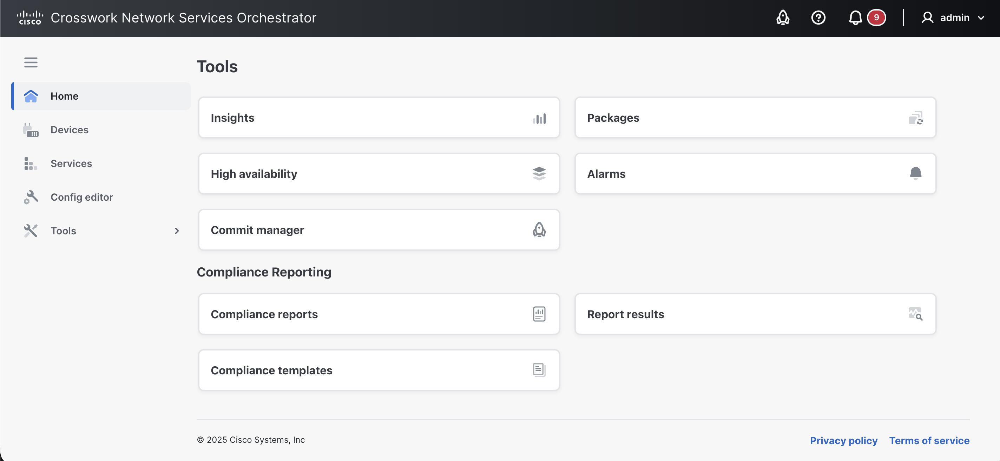

# Tools

The **Tools** view includes utilities that you can use to run specific tasks on your deployment, such as running compliance reports, etc.

<figure><figcaption>
Tools View
</figcaption></figure>

The following tools are available:

* [**Insights**](tools.md#d5e6470): Gathers and displays useful statistics of your deployment.
* [**Package upgrade**](tools.md#d5e6487): Used to perform upgrades to the packages running in NSO.
* [**High availability**](tools.md#d5e6538): Used to manage a High Availability (HA) setup in your deployment.
* [**Alarms**](tools.md#d5e6565): Shows current alarms/events in your deployment and provides options to manage them.
* [**Commit manager**](tools.md#d5e6582): Shortcut to the Commit Manager.
* [**Compliance reports**](tools.md#sec.webui\_compliance): Used to run compliance checks on your NSO network.

## Insights 

The **Insights** view collects and displays the following types of operational information using the `/ncs:metrics` data model to present useful statistics:

* Real-time data about transactions, commit queues, and northbound sessions.
* Sessions created and closed towards northbound interfaces since the last restart (CLI, JSON-RPC, NETCONF, RESTCONF, SNMP).
* Transactions since last restart (committed, aborted, and conflicting). You can select between the running and operational data stores.
* Devices and their sync statuses.
* CDB info about its size, compaction, etc.

## Package Upgrade 

In the **Package upgrade** view, you can load custom packages in NSO.

The **Reload** button on the **Packages** pane is the equivalent of the **packages reload** command in CLI. Read more about the **reload** action in [NSO Packages](../operations/listing-packages.md).

### **Install a Package**

To install a new package:

1. In the **Package upgrade** view, click **Browse files** to select a new package (`.tar`) from your local disk.
2. Click **Upload**. The package becomes visible under the **Available** pane.\
   (The **Progress Trace** shows the real-time progress of the upload).
3. Click **Install**.
4. On the **Loaded** pane, click **Reload** and confirm the intent.

### **Uninstall a Package**

To uninstall an existing package:

* To uninstall a package, simply click **Deinstall** next to the package in the **Loaded packages** list.

## High Availability 

The **High Availability** view is used to visualize your HA setup (rule-based or Raft).

Actions can be performed on the cluster using the **Configuration editor** -> **Actions** tab. Possible actions are further described in the High Availability documentation under [Actions](../../administration/management/high-availability.md#d5e5031)).

## Alarms 

The **Alarm manager** view displays current alarms in the system. The alarms are categorized as **criticals**, **majors**, and **minors** and can be filtered by the device.

You can run actions on an alarm by selecting it and using the **run action**  button.

## Commit Manager 

The **Commit manager** displays notifications about commits pending to be approved. Any time a change (a transaction) is made in NSO, the Commit Manager displays a notification to review the change. You can then choose to confirm or revert the commit.


**Transactions and Commits**

Take special note of the Commit Manager. Whenever a transaction has started, the active configuration data changes can be inspected and evaluated before they are committed and pushed to the network. The data is saved to the NSO datastore and pushed to the network when a user presses **Commit**.

Any network-wide configuration change can be picked up as a rollback file. The rollback can then be applied to undo whatever happened to the network.


### **Review a Configuration Change**

To review a configuration change:

1. Access the Commit Manager by clicking its icon  in the banner.
2. Review the available changes appearing as **Current transaction**. If there are errors in the change, the Commit Manager alerts you and suggests possible corrections. You can then fix them and press **Re-validate** to clear the errors.
3. Click **Revert** to undo or **Commit** to confirm the changes in the transaction.
   * **Commit Options**: When committing a transaction, you have the possibility to choose **Commit options** and perform a commit with the specified commit option(s). Examples of commit options are: **No revision drop**, **No deploy**, **No networking**, etc. Commit options are described in detail in the JSON-RPC API documentation under [Methods - transaction - commit changes](https://developer.cisco.com/docs/nso-guides-6.3/the-json-rpc-api/#methods-transaction-commit-changes).


In the **Commit manager** view, you can fetch additional information about the leaf by enabling **more node options**  and clicking the info  button.


#### **Load/Save Configuration Data**

Start a transaction to load or save configuration data using the **Load/Save** option which you can then review for commit. The following tabs are available:

* **Rollback**, to load data that reverts an earlier change.
* **Files**, to load data from a local file on your disk.
* **Paste**, to load data by pasting it in.
* **Save**, to save loaded data to a file on your local disk.

#### **Commit Manager Tabs**

In the **Commit manager** view, the following tabs are shown.

* **changes** tab, to list the changes and actions done in the system, e.g., deleting a device or changing its properties.
* **errors** tab, to list the errors encountered while doing changes. You can review the errors, make changes, and revalidate the error using the **Re-validate** option.
* **warnings** tab, to list the warnings encountered while doing changes.
* **config** tab, to list the configuration changes associated with the change.
* **native config** tab, to list the device configuration data in the native config.
* **commit queue** tab, to manage commit queues. See [Commit Queue](../operations/nso-device-manager.md#user\_guide.devicemanager.commit-queue) for more information.

## Compliance Reporting 

The **Compliance reporting** view is used to create and run compliance reports to check the current situation, check historical events, or both. The conceptual aspects of the compliance reporting feature are discussed in greater depth in the [Compliance Reports](../operations/compliance-reporting.md) section.


Web UI is the recommended way of running the compliance reports.


The following tabs are available in this view:

* **Compliance reports**
* **Report results**

### Compliance Reports

The **Compliance reports** tab is used to view, create, run, and manage the existing compliance reports.

#### **Create a Compliance Report**

To create a new compliance report:

1. In the **Compliance reporting** view -> **Compliance reports** tab, click **New report**.
2. In the **Create new report** pop-up, enter the report name and click **Create**.
3. Next, set up the compliance report using the following tabs. For a more detailed description of Compliance Reporting concepts and related configuration options, see [Lifecycle Operations](../operations/lifecycle-operations.md) documentation.
   * **General** tab: to configure the report name. Configuration options include:
     * **Report name**: Displays the report name and allows editing of the report name.
   * **Devices** tab: to configure device compliance checks. Configuration options include:
     * **Device choice**: Include **All devices** or only **Some devices** to include in compliance checks. If **Some devices** is selected, specify the devices using a device group, an XPath expression, or individual devices.
     * **Current out of sync**: Check the device's current status and report if the device is in sync or out of sync. Possible values are **true** (yes, request a check-sync) and **false** (no, do not request a check-sync).
     * **Historic changes**: Include or exclude previous changes to devices using the commit log. Possible values are **true** (yes, include), and **false** (no, exclude).
     * **Compliance templates**: If a compliance template should be used to check for compliance (see [Device Configuration Checks](../operations/compliance-reporting.md#device-configuration-checks)). You have the option to add a compliance template using the **Add template** option or convert an existing device template into a compliance template by using the **Create from device template** option (which can then be added using the **Add template** option). To enforce devices to comply exactly with the template's configuration, use **Strict** mode; see [Additional Configuration Checks](../operations/compliance-reporting.md#additional-configuration-checks) for more information.
   * **Services** tab: to configure service compliance checks. Configuration options include:
     * **Service choice**: Include **All services** or only **Some services**. If **Some services** is selected, specify the services using service type, an XPath expression, or individual service instances.
     * **Current out of sync**: Check the service's current status and report if the service is in sync or out of sync. Possible values are **true** (yes, request a check-sync) and **false** (no, do not request a check-sync).
     * **Historic changes**: Include or exclude previous changes to services using the commit log. Possible values are **true** (yes, include), and **false** (no, exclude).
4. Click **Create report** when the report setup is complete. The changes are saved and applied immediately.


In the **Compliance reports** tab, you can apply the following actions on the report by selecting it using the checkbox and using the more options  button.

* **Copy as new report**: Copy an existing report as a new report.
* **Run**: Run the report.
* **Delete**: Delete the report.
* **Edit name**: Edit the report name.


#### **Run a Compliance Report**

To run a compliance report:

1. In the **Compliance reports** tab, click the desired report and then click **Run report**.
2. Specify the following in the **Run report** pop-up:
   * **Report title**
   * **Historical time interval**. Select the time range. The report runs with the maximum possible interval if you do not specify an interval.
3. Click **Run report**.

### Report Results

The **Reports results** tab is used to view the status and results of the compliance reports that have been run.

#### View Compliance Report Results

The report's results show if the devices/services included in the report are compliant or have violations. A summary of the report status is available readily in the **Report results** tab. &#x20;

To fetch detailed information of the report, click the report name. The following information panes are then available:&#x20;

* **Details**: Includes specifics about the report that was run, such as report name, date/time it was run, time range, and devices/services analyzed.
* **Results overview**: Shows a summary of the results with information on compliant and non-compliant devices and services.
* **Devices**/**Services**/**Errors**: Displays compliance information individually for included devices and services.


Use the **Export to file** button to export the report results to a downloadable file (PDF).

