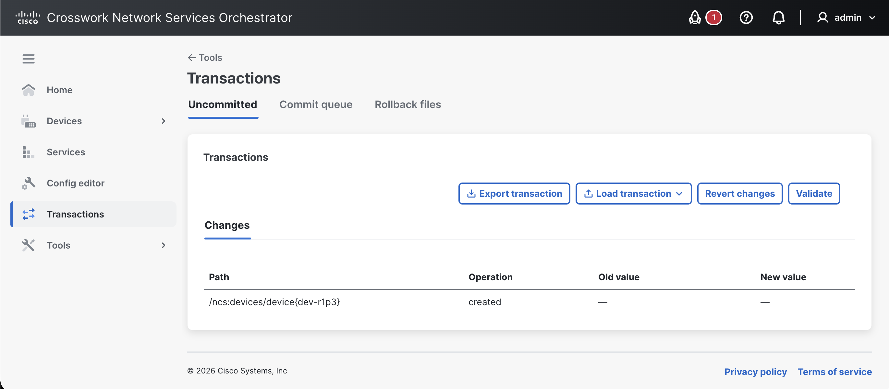

# Transactions

The **Transactions** view lets you view and manage current NSO transactions. It provides a centralized way to inspect and manage configuration changes in your NSO deployment. You can review uncommitted changes, monitor commit queue activity, validate or revert active changes, and work with rollback files.

<figure><figcaption></figcaption></figure>

The **Transactions** view is further divided into the following tabs:

* **Uncommitted**: Shows the changes currently present in the active transaction and provides options to validate, export, load, or revert them.
* **Commit queue**: Displays queued commit operations and their status.
* **Rollback files**: Lists rollback files created for committed changes so that earlier transactions can be inspected or undone.

## Uncommitted Changes

The **Uncommitted** tab shows the configuration changes currently made in NSO but not yet committed. The changes are presented with their path, operation, old value, and new value.

From this view, you can review the active transaction before committing it.

### Validate Changes

Use **Validate** to verify the current transaction before committing it. Validation helps detect issues in the pending configuration so they can be corrected before the changes are applied.

### Revert Changes

Use **Revert changes** to discard the current uncommitted transaction. This removes the pending changes from the active transaction.

### Export Transaction

Use **Export transaction** to save the current uncommitted transaction for later use or review.

### Load Transaction

Use **Load transaction** to load configuration data into the current transaction. This can be used to continue working with previously saved changes or to import changes from another source. Options include:&#x20;

* **Use** **File**: Use a file from your local disk.
* **Use** **Data**: Paste in the configuration date.

## Commit Queue

The **Commit queue** tab displays configuration changes that have been committed to NSO and queued for delivery to devices. Use this tab to monitor queued operations and their progress.

This tab is divided into the following subtabs:

* **Queue**: Displays commit queue items that are waiting to be processed or are currently being processed.
* **Completed**: Displays commit queue items that have finished processing and are kept as completed results.

For more information about commit queue behavior, see [Commit Queue](../operations/nso-device-manager.md#user_guide.devicemanager.commit-queue).

### Queue

The **Queue** subtab displays commit queue entries that are pending or in progress. Use this subtab to monitor queued operations and their progress before they complete.

### Completed

The **Completed** subtab displays commit queue entries that have finished processing. This view can be used to review previously-processed queue items and their associated result information.

The completed results list includes the following information:

* **Status**: The final status of the completed queue item.
* **ID**: The identifier assigned to the queue item.
* **Label**: The label associated with the queue item, if available.
* **Devices**: The devices affected by the queue item.
* **Date**: The date and time when the result was recorded.

You can search the completed results list by using the **Search** field.

#### Purge Completed Results

Use **Purge** in the **Completed** subtab to remove completed commit results from the list. This action is useful when you want to clean up historical commit queue results that are no longer needed for review.

When you click **Purge**, the **Purge completed queue items** dialog is displayed. In this dialog, you can specify which queue items to remove. Options include:

* **status**: Select the result status of the queue items to purge. Available values are **completed**, **deleted**, and **failed**.&#x20;
* **older-than**: Purge items older than specified seconds, minutes, hours, days, or weeks. The time fields can be used to define the age of queue items that should be removed.

To purge completed queue items:

1. Open the **Commit queue** tab and select the **Completed** subtab.
2. Click **Purge**.
3. In the **Purge completed queue items** dialog, specify the desired **status** and age criteria.
4. Click **Run**.

Use **Close** to exit the dialog without removing any completed queue items.

## Rollback Files

The **Rollback files** tab lists rollback files generated by NSO for committed transactions. These files can be used to inspect earlier changes and, when needed, restore configuration to a previous state.

Rollback files provide a convenient way to undo network-wide configuration changes after they have been committed.
